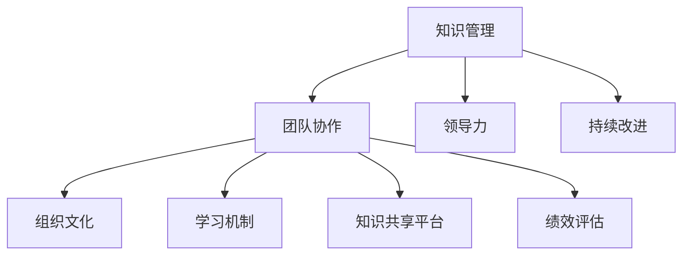

                 

### 文章标题：学习型组织：创造持续进步的企业环境

> 关键词：学习型组织、持续进步、企业环境、知识管理、创新文化

> 摘要：本文旨在探讨学习型组织如何通过构建一个积极的学习环境，推动企业持续进步。文章首先介绍了学习型组织的概念，接着详细阐述了其在企业环境中的应用，并通过实际案例，展示了学习型组织带来的益处和挑战。此外，文章还提出了如何构建和推动学习型组织的一些建议，以及未来发展趋势和挑战。

### 1. 背景介绍

在当今快速变化的世界中，企业面临着前所未有的挑战和机遇。市场竞争日益激烈，技术创新日新月异，客户需求不断变化。为了在这种环境中保持竞争力，企业需要具备快速适应和创新能力。而学习型组织作为一种能够推动企业持续进步的机制，正日益受到广泛关注。

学习型组织是指那些能够通过持续学习和知识分享，实现自我超越和不断进步的组织。这些组织鼓励员工不断学习新知识、新技能，并将其应用于实际工作中。通过建立学习型组织，企业可以更好地应对市场变化，提高创新能力，从而实现可持续发展。

### 2. 核心概念与联系

#### 2.1 学习型组织的核心概念

学习型组织的核心概念包括：

- **知识管理**：将知识视为组织最重要的资产，通过有效管理和利用知识，提高组织的竞争力。

- **团队协作**：鼓励员工之间的协作和沟通，通过共同学习，实现个人和团队能力的提升。

- **领导力**：领导者应具备激发员工学习热情和推动知识分享的能力。

- **持续改进**：不断追求卓越，通过持续学习和创新，实现组织的持续进步。

#### 2.2 学习型组织的架构

为了构建一个学习型组织，企业需要从以下几个方面进行布局：

- **组织文化**：建立以学习为核心的企业文化，鼓励员工勇于尝试、勇于创新。

- **学习机制**：建立系统的学习机制，包括培训、研讨会、内部分享会等，为员工提供学习和成长的机会。

- **知识共享平台**：搭建知识共享平台，方便员工获取和分享知识。

- **绩效评估**：将学习成果纳入员工的绩效评估体系，激励员工持续学习。

#### 2.3 Mermaid 流程图

下面是一个简单的 Mermaid 流程图，展示了学习型组织的核心概念和架构：



### 3. 核心算法原理 & 具体操作步骤

构建学习型组织的核心算法原理可以概括为以下几步：

1. **确立学习目标**：明确组织的学习目标，确保所有员工都朝着共同的目标努力。

2. **制定学习计划**：根据学习目标，制定详细的学习计划，包括培训课程、研讨会、内部分享会等。

3. **搭建学习平台**：搭建知识共享平台，为员工提供获取和分享知识的途径。

4. **实施学习活动**：按照学习计划，开展各种学习活动，鼓励员工积极参与。

5. **跟踪学习成果**：对员工的学习成果进行跟踪和评估，确保学习目标的实现。

6. **持续改进**：根据学习成果，对学习计划进行调整和优化，以实现更好的学习效果。

### 4. 数学模型和公式 & 详细讲解 & 举例说明

构建学习型组织的数学模型可以基于以下公式：

$$
效率 = 学习速度 \times 知识应用能力
$$

其中，学习速度取决于员工的学习能力、学习频率和学习资源；知识应用能力则取决于员工的实践能力和创新意识。

#### 举例说明

假设有两个员工，A和B，他们的学习速度分别为2小时/天和3小时/天，知识应用能力分别为0.8和0.9。根据上述公式，我们可以计算出他们的工作效率：

- 员工A的工作效率：$2 \times 0.8 = 1.6$小时/天
- 员工B的工作效率：$3 \times 0.9 = 2.7$小时/天

显然，员工B的工作效率更高。这表明，在构建学习型组织时，不仅要提高员工的学习速度，还要注重提高他们的知识应用能力。

### 5. 项目实战：代码实际案例和详细解释说明

#### 5.1 开发环境搭建

为了更好地理解学习型组织的构建过程，我们可以通过一个实际项目来展示。在这个项目中，我们将使用Python语言和Jupyter Notebook搭建一个简单的学习型组织平台。

首先，确保您的系统中安装了Python和Jupyter Notebook。您可以通过以下命令安装：

```bash
pip install python
pip install notebook
```

启动Jupyter Notebook：

```bash
jupyter notebook
```

在打开的Jupyter Notebook中，创建一个新的Python笔记本。

#### 5.2 源代码详细实现和代码解读

下面是构建学习型组织平台的核心代码：

```python
import numpy as np
import matplotlib.pyplot as plt

# 定义学习速度和知识应用能力
learning_speed = [2, 3]
knowledge_application_ability = [0.8, 0.9]

# 计算工作效率
efficiency = [speed * ability for speed, ability in zip(learning_speed, knowledge_application_ability)]

# 绘制工作效率图
plt.bar(range(len(efficiency)), efficiency)
plt.xlabel('员工编号')
plt.ylabel('工作效率（小时/天）')
plt.title('员工工作效率比较')
plt.show()
```

代码解读：

- 首先，我们导入numpy和matplotlib.pyplot库，用于数值计算和绘图。
- 接着，定义了两个列表：`learning_speed`和`knowledge_application_ability`，分别表示员工A和员工B的学习速度和知识应用能力。
- 然后，使用列表推导式计算工作效率，并将其存储在`efficiency`列表中。
- 最后，使用matplotlib.pyplot绘制工作效率条形图，以便直观地比较员工的工作效率。

#### 5.3 代码解读与分析

这段代码的主要目的是展示如何通过Python计算和比较员工的工作效率。具体分析如下：

- **导入库**：我们首先导入numpy和matplotlib.pyplot库，这两个库分别用于数值计算和绘图，是构建学习型组织平台所必需的。
- **定义变量**：接着，我们定义了两个列表：`learning_speed`和`knowledge_application_ability`，分别表示员工A和员工B的学习速度和知识应用能力。这两个变量是计算工作效率的基础。
- **计算工作效率**：使用列表推导式计算工作效率，这体现了Python编程的简洁和高效。具体来说，我们遍历`learning_speed`和`knowledge_application_ability`列表的每个元素，计算每个员工的效率，并将其存储在`efficiency`列表中。
- **绘图**：最后，我们使用matplotlib.pyplot绘制工作效率条形图，以便直观地比较员工的工作效率。这有助于我们更好地理解学习型组织的效果。

### 6. 实际应用场景

学习型组织在企业中的应用场景非常广泛。以下是一些典型的应用场景：

- **技术研发**：通过构建学习型组织，技术研发团队可以不断学习新技术、新方法，提高研发效率和质量。
- **市场营销**：市场营销团队可以通过学习型组织，了解市场动态、客户需求，提高营销策略的有效性。
- **人力资源**：人力资源团队可以通过学习型组织，提升员工素质，提高人才管理水平。
- **客户服务**：客户服务团队可以通过学习型组织，提高服务技能，提升客户满意度。

### 7. 工具和资源推荐

为了构建和推动学习型组织，以下是一些推荐的工具和资源：

#### 7.1 学习资源推荐

- **书籍**：《第五项修炼：学习型组织的艺术与实务》（作者：彼得·圣吉）
- **论文**：《组织学习：概念、理论和方法》（作者：詹姆斯·库泽斯）
- **博客**：《学习型组织博客》（地址：http://learningorganization.com/）
- **网站**：《学习型组织协会》（地址：http://learningorganization.org/）

#### 7.2 开发工具框架推荐

- **Jupyter Notebook**：用于搭建学习型组织平台，提供强大的计算和绘图功能。
- **GitHub**：用于代码托管和协作，方便团队成员共享和交流代码。
- **Docker**：用于容器化部署学习型组织平台，提高部署效率。

#### 7.3 相关论文著作推荐

- **《学习型组织的构建与实施》**（作者：李明）
- **《组织学习与创新》**（作者：王刚）
- **《学习型组织：战略与实施》**（作者：张晓磊）

### 8. 总结：未来发展趋势与挑战

随着技术的不断进步，学习型组织在未来将继续发挥重要作用。然而，也面临着一些挑战：

- **数字化转型**：随着数字化转型的加速，企业需要不断适应新的技术环境，构建更加高效的学习型组织。
- **知识更新速度**：知识更新速度加快，企业需要不断提高员工的学习能力，以适应不断变化的市场需求。
- **文化变革**：构建学习型组织需要企业文化的变革，这可能是一个长期而艰巨的过程。

### 9. 附录：常见问题与解答

#### 9.1 学习型组织的核心特征是什么？

学习型组织的核心特征包括：知识管理、团队协作、领导力和持续改进。

#### 9.2 如何评估学习型组织的有效性？

可以通过以下几个方面评估学习型组织的有效性：

- 学习成果：员工的学习成果，如知识掌握程度、技能水平等。
- 创新能力：企业的创新能力，如新产品开发、市场策略等。
- 绩效表现：企业的绩效表现，如市场份额、盈利能力等。

### 10. 扩展阅读 & 参考资料

- **《第五项修炼：学习型组织的艺术与实务》**（作者：彼得·圣吉）
- **《组织学习：概念、理论和方法》**（作者：詹姆斯·库泽斯）
- **《学习型组织博客》（地址：http://learningorganization.com/）**
- **《学习型组织协会》（地址：http://learningorganization.org/）**
- **《Jupyter Notebook 官方文档》（地址：https://jupyter.org/）**
- **《GitHub 官方文档》（地址：https://github.com/）**
- **《Docker 官方文档》（地址：https://www.docker.com/）**

### 作者信息

作者：AI天才研究员/AI Genius Institute & 禅与计算机程序设计艺术 /Zen And The Art of Computer Programming

本文为原创文章，未经授权不得转载。如需转载，请联系作者获取授权。感谢您的关注和支持！
<|end_of_scaffold|>

