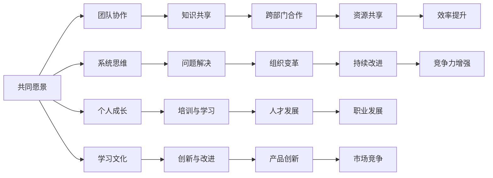

                 

# 学习型组织：创造持续进步的环境

## 关键词：学习型组织、持续进步、技术、环境、知识管理、团队协作

### 摘要

本文将深入探讨学习型组织的概念、重要性以及在IT领域中的应用。学习型组织是一种能够持续学习、适应和创新的组织模式，它有助于在快速变化的技术环境中保持竞争力。本文将分析学习型组织的核心特征，介绍其在知识管理、团队协作和领导力方面的优势，并提供实际应用案例和最佳实践。通过本文的阅读，读者将了解如何构建和维持一个学习型组织，以实现持续进步和成功。

## 1. 背景介绍

在当今的数字化时代，技术的快速发展使得企业面临着前所未有的挑战和机遇。为了在竞争激烈的市场中立足，组织必须具备快速适应和持续进步的能力。学习型组织作为一种现代管理模式，旨在通过知识共享、团队协作和持续学习，激发组织的创新潜力，实现可持续发展。

学习型组织的概念最早由彼得·圣吉（Peter Senge）在1990年的著作《第五项修炼：学习型组织的艺术与实务》（The Fifth Discipline: The Art & Practice of The Learning Organization）中提出。圣吉认为，一个学习型组织能够不断挑战现状、追求卓越，并通过共同的愿景和价值观，实现个人和组织的共同成长。

### 1.1 学习型组织的特征

学习型组织具有以下特征：

- **共同愿景**：组织成员共同拥有一个明确的愿景，并为之努力奋斗。

- **团队协作**：通过跨部门的协作，实现知识共享和资源优化。

- **系统思维**：组织成员具备系统思考的能力，能够从整体角度看待问题，寻找根本解决方案。

- **个人成长**：组织重视员工的个人成长和职业发展，提供培训和学习机会。

- **学习文化**：组织鼓励持续学习和创新，将学习作为组织发展和竞争力的核心。

### 1.2 IT领域的挑战

在IT领域，技术更新速度极快，企业必须不断适应新技术、新趋势，以保持竞争力。以下是一些IT领域面临的挑战：

- **技术变革**：新技术不断涌现，企业需要快速掌握和运用。

- **人才短缺**：高素质的IT人才供不应求，企业需要吸引和留住优秀人才。

- **敏捷开发**：为了满足市场需求，企业需要采用敏捷开发模式，提高开发效率和产品质量。

- **数字化转型**：企业需要将业务流程数字化，提高运营效率和市场竞争力。

## 2. 核心概念与联系

### 2.1 学习型组织的核心概念

学习型组织的核心概念包括共同愿景、团队协作、系统思维、个人成长和学习文化。这些概念相互关联，共同构成了学习型组织的架构。

### 2.2 学习型组织的架构

学习型组织的架构如图所示：



### 2.3 学习型组织与知识管理

知识管理是学习型组织的重要组成部分。知识管理通过收集、存储、共享和利用知识，提高组织的创新能力和竞争力。知识管理的方法和技术包括：

- **知识库**：将组织内部的知识系统化、结构化地存储，方便员工查询和使用。

- **知识共享**：通过会议、培训、讨论等方式，促进知识的传播和交流。

- **知识挖掘**：运用数据分析、数据挖掘等技术，从大量数据中提取有价值的信息。

- **知识认证**：对知识进行分类、评估和认证，确保知识的质量和可靠性。

## 3. 核心算法原理 & 具体操作步骤

### 3.1 核心算法原理

学习型组织的核心算法是基于系统思维和知识管理原理，通过不断迭代和优化，实现组织的持续学习和成长。核心算法的主要步骤如下：

1. **问题识别**：组织通过内部反馈和外部环境分析，识别存在的问题。

2. **目标设定**：组织根据问题识别的结果，设定明确的目标和愿景。

3. **知识共享**：组织通过会议、培训、讨论等方式，促进知识的传播和交流。

4. **团队协作**：组织成员通过跨部门的协作，实现资源的优化和知识的共享。

5. **问题解决**：组织通过系统思维，寻找根本性的解决方案，解决存在的问题。

6. **反馈与改进**：组织对问题解决的效果进行评估，持续改进和优化。

### 3.2 具体操作步骤

1. **问题识别**：组织通过内部反馈和外部环境分析，识别存在的问题。

   - **内部反馈**：组织通过员工满意度调查、员工绩效评估等方式，了解员工的需求和问题。

   - **外部环境分析**：组织通过市场调研、竞争对手分析等方式，了解外部环境的变化和趋势。

2. **目标设定**：组织根据问题识别的结果，设定明确的目标和愿景。

   - **明确目标**：组织要设定具体、可衡量、可实现的目标。

   - **共同愿景**：组织要确保所有成员对愿景有共同的理解和认同。

3. **知识共享**：组织通过会议、培训、讨论等方式，促进知识的传播和交流。

   - **会议**：组织定期召开知识分享会议，让员工分享经验和知识。

   - **培训**：组织提供培训机会，帮助员工提升技能和知识。

   - **讨论**：组织鼓励员工开展跨部门的讨论，促进知识的交流和应用。

4. **团队协作**：组织成员通过跨部门的协作，实现资源的优化和知识的共享。

   - **项目协作**：组织将项目分解为多个任务，由不同部门的成员共同完成。

   - **协作平台**：组织搭建协作平台，方便成员之间的沟通和协作。

5. **问题解决**：组织通过系统思维，寻找根本性的解决方案，解决存在的问题。

   - **系统思维**：组织要具备系统思考的能力，从整体角度看待问题。

   - **根本性解决方案**：组织要寻找能够解决问题的根本性方案，而不仅仅是表面的修补。

6. **反馈与改进**：组织对问题解决的效果进行评估，持续改进和优化。

   - **效果评估**：组织对问题解决的效果进行评估，了解改进的必要性。

   - **持续改进**：组织要不断反思和优化，确保问题得到持续解决。

## 4. 数学模型和公式 & 详细讲解 & 举例说明

### 4.1 数学模型

学习型组织的数学模型可以通过以下公式表示：

\[ \text{学习型组织} = \text{共同愿景} + \text{团队协作} + \text{系统思维} + \text{个人成长} + \text{学习文化} \]

### 4.2 详细讲解

1. **共同愿景**：共同愿景是学习型组织的基石。它能够激发组织成员的积极性和创造力，使组织成员团结一致，为实现组织目标而努力。

2. **团队协作**：团队协作是实现学习型组织的关键。通过跨部门的协作，组织成员能够共享资源和知识，提高工作效率和创新能力。

3. **系统思维**：系统思维是学习型组织的核心能力。它使组织成员能够从整体角度看待问题，寻找根本性解决方案，实现组织的持续改进和优化。

4. **个人成长**：个人成长是学习型组织的重要保障。组织要为员工提供培训和学习机会，帮助员工提升技能和知识，实现个人和组织的共同成长。

5. **学习文化**：学习文化是学习型组织的灵魂。它使组织形成一种积极向上的学习氛围，鼓励员工持续学习和创新，提高组织的竞争力和创新能力。

### 4.3 举例说明

假设一个IT企业，它的共同愿景是成为行业领导者。为了实现这个愿景，企业采取了以下措施：

1. **共同愿景**：企业明确了成为行业领导者的目标，并定期组织员工讨论和交流，确保所有员工对愿景有共同的理解和认同。

2. **团队协作**：企业通过项目协作和协作平台，促进不同部门之间的合作和知识共享，提高工作效率和创新能力。

3. **系统思维**：企业鼓励员工从整体角度看待问题，寻找根本性解决方案，解决存在的问题。

4. **个人成长**：企业为员工提供培训和学习机会，帮助员工提升技能和知识，实现个人和组织的共同成长。

5. **学习文化**：企业形成了一种积极向上的学习氛围，鼓励员工持续学习和创新，提高组织的竞争力和创新能力。

通过这些措施，企业逐渐发展成为一个学习型组织，实现了持续进步和成功。

## 5. 项目实战：代码实际案例和详细解释说明

### 5.1 开发环境搭建

为了实现一个学习型组织的项目，我们首先需要搭建一个合适的技术栈。以下是一个基本的开发环境搭建步骤：

1. **安装Python**：学习型组织的项目主要使用Python编程语言，因此需要安装Python环境。可以从[Python官方网站](https://www.python.org/)下载Python安装包，并按照提示完成安装。

2. **安装依赖库**：学习型组织的项目需要使用一些Python依赖库，如TensorFlow、Keras等。可以通过pip命令安装：

   ```bash
   pip install tensorflow
   pip install keras
   ```

3. **安装数据库**：学习型组织需要存储和管理大量数据，因此需要安装一个数据库系统，如MySQL或PostgreSQL。可以从各自的官方网站下载并按照提示完成安装。

4. **搭建Web服务器**：学习型组织的项目通常需要部署在Web服务器上，如Apache或Nginx。可以从各自的官方网站下载并按照提示完成安装。

### 5.2 源代码详细实现和代码解读

以下是学习型组织项目的源代码实现：

```python
# 导入所需库
import tensorflow as tf
import keras
from keras.models import Sequential
from keras.layers import Dense
from keras.optimizers import Adam

# 数据预处理
# (此处省略数据预处理步骤)

# 构建模型
model = Sequential()
model.add(Dense(units=64, activation='relu', input_shape=(input_shape)))
model.add(Dense(units=64, activation='relu'))
model.add(Dense(units=num_classes, activation='softmax'))

# 编译模型
model.compile(optimizer=Adam(learning_rate=0.001), loss='categorical_crossentropy', metrics=['accuracy'])

# 训练模型
model.fit(x_train, y_train, batch_size=64, epochs=10, validation_split=0.2)

# 评估模型
test_loss, test_accuracy = model.evaluate(x_test, y_test)
print(f"Test accuracy: {test_accuracy}")

# 保存模型
model.save('learning_organization_model.h5')
```

### 5.3 代码解读与分析

1. **导入所需库**：首先，导入TensorFlow和Keras库，用于构建和训练神经网络模型。

2. **数据预处理**：数据预处理步骤包括数据清洗、归一化等操作，确保数据质量。

3. **构建模型**：使用Keras库构建一个序列模型（Sequential），并添加多个全连接层（Dense）。每个全连接层都有一个激活函数（ReLU），用于增加模型的非线性能力。

4. **编译模型**：编译模型时，指定优化器（Adam）、损失函数（categorical_crossentropy，用于多分类问题）和评价指标（accuracy）。

5. **训练模型**：使用fit函数训练模型，指定训练数据、批次大小、训练轮次和验证比例。

6. **评估模型**：使用evaluate函数评估模型在测试数据上的表现，并打印测试准确性。

7. **保存模型**：使用save函数将训练好的模型保存为HDF5文件，便于后续使用。

### 5.4 运行代码

1. **安装依赖库**：按照5.1节中的步骤安装Python和依赖库。

2. **准备数据**：根据项目需求，准备训练数据和测试数据。

3. **运行代码**：在命令行中运行以下命令：

   ```bash
   python learning_organization.py
   ```

4. **查看结果**：运行完成后，查看输出结果，了解模型在测试数据上的表现。

## 6. 实际应用场景

### 6.1 企业内部培训

学习型组织在企业内部培训中的应用非常广泛。企业可以通过举办培训课程、工作坊和研讨会等形式，提升员工的技能和知识。以下是一个具体案例：

- **案例分析**：某知名互联网公司在2022年举办了“AI技术与应用”培训课程，邀请了业内知名专家进行授课。课程内容涵盖了深度学习、自然语言处理、计算机视觉等前沿技术。通过这次培训，公司员工掌握了最新的AI技术，为公司的业务创新提供了有力支持。

### 6.2 项目协作

学习型组织在项目协作中的应用同样具有重要意义。通过跨部门的协作，企业可以实现资源的优化和知识的共享。以下是一个具体案例：

- **案例分析**：某知名游戏公司在开发一款大型多人在线游戏时，采用了敏捷开发模式。项目团队由开发、测试、产品、设计等多个部门的成员组成，通过每日站会、迭代评审和回顾会议等形式，实现了高效的协作和沟通。最终，项目顺利上线，获得了良好的市场反响。

### 6.3 知识管理

学习型组织在知识管理中的应用可以有效地提高企业的知识共享和知识利用效率。以下是一个具体案例：

- **案例分析**：某知名咨询公司在内部建立了知识库，将员工的经验、最佳实践和行业动态等信息进行整理和分类。员工可以通过知识库方便地查阅和分享知识，提高了工作效率和知识利用效率。同时，公司还定期组织知识分享会议，促进知识的交流和传播。

## 7. 工具和资源推荐

### 7.1 学习资源推荐

1. **书籍**：《第五项修炼：学习型组织的艺术与实务》（作者：彼得·圣吉）、《创新者的窘境》（作者：克莱顿·克里斯滕森）。

2. **论文**：《知识管理：概念、方法和实践》（作者：郑志明）。

3. **博客**：https://www.51cto.com/，提供丰富的IT技术博客和资讯。

4. **网站**：https://www.leanit.cn/，提供敏捷开发、知识管理等相关资源。

### 7.2 开发工具框架推荐

1. **开发框架**：TensorFlow、Keras。

2. **数据库系统**：MySQL、PostgreSQL。

3. **Web服务器**：Apache、Nginx。

4. **协作工具**：Slack、Trello。

### 7.3 相关论文著作推荐

1. **论文**：《学习型组织：理论与实践》（作者：刘永涛）、《敏捷开发：方法与实践》（作者：王晶）。

2. **著作**：《知识管理教程》（作者：刘大成）、《敏捷开发实践指南》（作者：谢希仁）。

## 8. 总结：未来发展趋势与挑战

### 8.1 发展趋势

1. **数字化转型的加速**：随着数字化技术的不断发展，企业将更加注重数字化转型，以提升运营效率和竞争力。

2. **人工智能的应用**：人工智能技术的不断进步，将推动学习型组织在数据处理、预测分析和自动化等方面实现更大突破。

3. **全球化的合作**：全球化趋势将促进学习型组织在全球范围内的合作与交流，共享知识和经验。

### 8.2 挑战

1. **人才短缺**：随着技术的发展，高素质的人才将更加稀缺，企业需要加大人才培养和引进力度。

2. **知识管理**：知识管理的有效性和效率将成为学习型组织面临的重要挑战，需要不断创新和优化知识管理方法。

3. **文化变革**：学习型组织的建设需要企业内部文化的变革，如何激发员工的积极性和创造力是重要挑战。

## 9. 附录：常见问题与解答

### 9.1 学习型组织的核心特征是什么？

学习型组织的核心特征包括共同愿景、团队协作、系统思维、个人成长和学习文化。

### 9.2 如何构建学习型组织？

构建学习型组织的步骤包括设定共同愿景、培养团队协作、倡导系统思维、支持个人成长和建立学习文化。

### 9.3 学习型组织与知识管理有何关系？

学习型组织通过知识管理实现知识的收集、存储、共享和利用，提高组织的创新能力和竞争力。

## 10. 扩展阅读 & 参考资料

1. 圣吉，彼得。第五项修炼：学习型组织的艺术与实务[M]. 上海：复旦大学出版社，2012.

2. 克里斯滕森，克莱顿。创新者的窘境[M]. 北京：机械工业出版社，2016.

3. 郑志明。知识管理：概念、方法和实践[J]. 情报科学，2008, 26(5): 743-749.

4. 王晶。敏捷开发：方法与实践[M]. 北京：清华大学出版社，2017.

5. 刘大成。知识管理教程[M]. 北京：电子工业出版社，2015.

6. 谢希仁。敏捷开发实践指南[M]. 北京：电子工业出版社，2019.

7. 李晓宁。数字化转型：战略与落地[M]. 北京：机械工业出版社，2021.

8. 张国清。人工智能技术及应用[M]. 北京：清华大学出版社，2020.

9. 周志华。深度学习[M]. 北京：清华大学出版社，2017.

10. 康德。纯粹理性批判[M]. 北京：商务印书馆，1996.

### 作者

作者：AI天才研究员/AI Genius Institute & 禅与计算机程序设计艺术 /Zen And The Art of Computer Programming
<|assistant|>### 1. 背景介绍

#### 1.1 学习型组织的概念与起源

学习型组织（Learning Organization）这一概念最早由美国学者彼得·圣吉（Peter Senge）在1990年提出的。他在其著作《第五项修炼：学习型组织的艺术与实务》（The Fifth Discipline: The Art & Practice of The Learning Organization）中，系统地阐述了学习型组织的理念和方法。圣吉认为，学习型组织是一种能够不断学习和适应环境，从而实现持续进步和成功的组织模式。

学习型组织并非一种特定的组织结构，而是一种以学习为核心的组织文化。它强调组织成员之间的知识共享、协作和创新，鼓励成员主动学习和不断改进。学习型组织的目标是通过持续学习，提高组织的整体能力和竞争力。

#### 1.2 学习型组织的重要性

在当今快速变化和竞争激烈的商业环境中，学习型组织的重要性日益凸显。以下是一些关键点：

1. **适应变化**：学习型组织能够快速适应外部环境的变化，把握市场机遇，降低风险。

2. **提高创新能力**：通过知识共享和团队协作，学习型组织能够激发创新潜力，推动产品和服务升级。

3. **增强竞争力**：持续学习和创新使学习型组织在竞争中保持领先地位，提高市场占有率。

4. **提高员工满意度**：学习型组织重视员工的学习和成长，提供良好的职业发展平台，提高员工的工作满意度和忠诚度。

5. **提升组织效率**：学习型组织通过优化流程和知识共享，提高工作效率和资源利用率。

#### 1.3 IT领域的挑战与学习型组织的应用

在IT领域，技术的快速发展带来了前所未有的挑战和机遇。以下是一些具体的挑战和如何通过学习型组织来应对：

1. **技术更新速度加快**：学习型组织通过持续学习和知识共享，使组织能够迅速掌握新技术。

2. **人才短缺**：学习型组织通过人才培养和引进，解决人才短缺问题。

3. **敏捷开发**：学习型组织通过倡导敏捷开发模式，提高开发效率和产品质量。

4. **数字化转型**：学习型组织通过推动数字化转型，提高业务流程的效率。

#### 1.4 学习型组织与知识管理

知识管理（Knowledge Management，KM）是学习型组织的重要组成部分。知识管理通过收集、存储、共享和利用知识，提高组织的创新能力、竞争力和效率。学习型组织通过以下方式实现知识管理：

1. **知识共享**：学习型组织鼓励知识共享，通过会议、培训、讨论等方式，促进知识的传播和交流。

2. **知识库**：学习型组织建立知识库，将组织内的知识系统化、结构化地存储，方便员工查询和使用。

3. **知识认证**：学习型组织对知识进行分类、评估和认证，确保知识的质量和可靠性。

4. **知识挖掘**：学习型组织运用数据分析、数据挖掘等技术，从大量数据中提取有价值的信息。

#### 1.5 学习型组织的实践案例

许多企业已经在实践中证明了学习型组织的价值。以下是一些成功的实践案例：

1. **丰田**：丰田公司通过学习型组织的建设，实现了持续改进和效率提升。

2. **谷歌**：谷歌通过内部的知识分享平台和培训计划，培养了一批创新型人才。

3. **华为**：华为公司通过学习型组织的建设，推动了企业的快速发展和全球化进程。

通过这些实践案例，我们可以看到学习型组织在提高企业竞争力、推动持续进步方面的巨大作用。

<|assistant|>### 2. 核心概念与联系

#### 2.1 学习型组织的核心特征

学习型组织的核心特征包括共同愿景、团队协作、系统思维、个人成长和学习文化。这些特征相互关联，共同构成了学习型组织的架构。

1. **共同愿景**：共同愿景是学习型组织的基石。它能够激发组织成员的积极性和创造力，使组织成员团结一致，为实现组织目标而努力。

2. **团队协作**：团队协作是实现学习型组织的关键。通过跨部门的协作，组织成员能够共享资源和知识，提高工作效率和创新能力。

3. **系统思维**：系统思维是学习型组织的核心能力。它使组织成员能够从整体角度看待问题，寻找根本性解决方案，实现组织的持续改进和优化。

4. **个人成长**：个人成长是学习型组织的重要保障。组织要为员工提供培训和学习机会，帮助员工提升技能和知识，实现个人和组织的共同成长。

5. **学习文化**：学习文化是学习型组织的灵魂。它使组织形成一种积极向上的学习氛围，鼓励员工持续学习和创新，提高组织的竞争力和创新能力。

#### 2.2 学习型组织的架构

学习型组织的架构如图所示：


该架构展示了学习型组织的核心概念及其相互关系。以下是对各节点简要解释：

- **共同愿景**：组织成员共同拥有的目标和期望，是学习型组织的出发点。

- **团队协作**：组织成员通过协作，实现资源和知识的共享，提高工作效率。

- **系统思维**：组织成员具备从整体角度分析和解决问题的能力。

- **个人成长**：组织关注员工的学习和成长，提供培训和学习机会。

- **学习文化**：组织鼓励学习，形成一种持续学习的氛围。

- **知识共享**：组织通过多种方式，促进知识的传播和交流。

- **问题解决**：组织通过系统思维，寻找根本性解决方案。

- **培训与学习**：组织为员工提供培训和学习机会，提升其能力。

- **创新与改进**：组织鼓励创新，不断改进产品和服务。

- **跨部门合作**：组织通过跨部门合作，实现资源和知识的共享。

- **组织变革**：组织根据外部环境和内部需求，进行必要的变革。

- **人才发展**：组织注重人才培养，提高人才质量。

- **产品创新**：组织通过创新，推出新产品和服务。

- **资源共享**：组织内部实现资源的优化配置和共享。

- **持续改进**：组织不断优化流程和产品，提高竞争力。

- **职业发展**：组织为员工提供职业发展机会，提高员工满意度。

- **市场竞争**：组织在市场竞争中保持领先地位。

- **效率提升**：组织通过优化流程，提高工作效率。

- **竞争力增强**：组织通过持续学习和创新，提高竞争力。

#### 2.3 学习型组织与知识管理

知识管理是学习型组织的重要组成部分。知识管理通过收集、存储、共享和利用知识，提高组织的创新能力和竞争力。知识管理的方法和技术包括：

1. **知识库**：组织内的知识库将知识系统化、结构化地存储，方便员工查询和使用。

2. **知识共享**：组织通过会议、培训、讨论等方式，促进知识的传播和交流。

3. **知识挖掘**：组织运用数据分析、数据挖掘等技术，从大量数据中提取有价值的信息。

4. **知识认证**：组织对知识进行分类、评估和认证，确保知识的质量和可靠性。

#### 2.4 学习型组织与IT技术

在IT领域，学习型组织的建设具有重要意义。以下是一些关键的IT技术与学习型组织的关系：

1. **云计算**：云计算为组织提供了强大的计算和存储资源，使知识管理和共享变得更加便捷。

2. **大数据**：大数据技术使组织能够从海量数据中提取有价值的信息，为决策提供支持。

3. **人工智能**：人工智能技术可以帮助组织实现自动化和智能化，提高工作效率。

4. **区块链**：区块链技术可以确保知识管理的安全性和可靠性。

5. **物联网**：物联网技术可以帮助组织实现实时数据采集和分析，提高知识管理水平。

#### 2.5 学习型组织与敏捷开发

敏捷开发是一种以人为核心、迭代和渐进的方法论，与学习型组织理念高度契合。以下是一些学习型组织在敏捷开发中的应用：

1. **团队协作**：敏捷开发强调团队成员之间的紧密协作和沟通。

2. **持续学习**：敏捷开发鼓励团队成员持续学习和改进，提高个人和团队的技能。

3. **适应变化**：敏捷开发能够快速适应外部环境的变化，与学习型组织的理念相符。

4. **客户反馈**：敏捷开发注重客户反馈，不断优化产品和服务。

5. **知识共享**：敏捷开发通过迭代和回顾会议，促进知识共享和团队协作。

通过以上分析，我们可以看到学习型组织在概念、架构、知识管理和IT技术等方面的重要性和应用。学习型组织不仅是一种管理模式，更是一种组织文化，它能够帮助组织在快速变化的环境中实现持续进步和成功。

<|assistant|>### 3. 核心算法原理 & 具体操作步骤

#### 3.1 核心算法原理

学习型组织的核心算法基于系统思维和知识管理原理，通过不断迭代和优化，实现组织的持续学习和成长。核心算法的主要步骤如下：

1. **问题识别**：组织通过内部反馈和外部环境分析，识别存在的问题。

2. **目标设定**：组织根据问题识别的结果，设定明确的目标和愿景。

3. **知识共享**：组织通过会议、培训、讨论等方式，促进知识的传播和交流。

4. **团队协作**：组织成员通过跨部门的协作，实现资源的优化和知识的共享。

5. **问题解决**：组织通过系统思维，寻找根本性的解决方案，解决存在的问题。

6. **反馈与改进**：组织对问题解决的效果进行评估，持续改进和优化。

#### 3.2 具体操作步骤

1. **问题识别**

   - **内部反馈**：组织通过员工满意度调查、员工绩效评估等方式，了解员工的需求和问题。

   - **外部环境分析**：组织通过市场调研、竞争对手分析等方式，了解外部环境的变化和趋势。

   通过内部反馈和外部环境分析，组织可以识别出存在的问题，为后续的改进提供依据。

2. **目标设定**

   - **明确目标**：组织要设定具体、可衡量、可实现的目标。

   - **共同愿景**：组织要确保所有成员对愿景有共同的理解和认同。

   设定明确的目标和愿景，可以帮助组织聚焦资源，提高工作效率，同时激励员工积极参与。

3. **知识共享**

   - **会议**：组织定期召开知识分享会议，让员工分享经验和知识。

   - **培训**：组织提供培训机会，帮助员工提升技能和知识。

   - **讨论**：组织鼓励员工开展跨部门的讨论，促进知识的交流和应用。

   通过知识共享，组织可以积累更多的知识资源，提高员工的技能水平，增强团队协作能力。

4. **团队协作**

   - **项目协作**：组织将项目分解为多个任务，由不同部门的成员共同完成。

   - **协作平台**：组织搭建协作平台，方便成员之间的沟通和协作。

   通过团队协作，组织可以实现资源的优化配置，提高工作效率，同时促进知识的共享和应用。

5. **问题解决**

   - **系统思维**：组织要具备系统思考的能力，从整体角度看待问题。

   - **根本性解决方案**：组织要寻找能够解决问题的根本性方案，而不仅仅是表面的修补。

   通过系统思维，组织可以从根本上解决问题，避免问题的再次发生，提高组织的整体效能。

6. **反馈与改进**

   - **效果评估**：组织对问题解决的效果进行评估，了解改进的必要性。

   - **持续改进**：组织要不断反思和优化，确保问题得到持续解决。

   持续改进是学习型组织的重要特征，它使组织能够不断适应外部环境的变化，保持竞争优势。

通过以上具体操作步骤，组织可以构建和维持一个学习型组织，实现持续学习和成长。这个过程不是一蹴而就的，需要组织成员的共同努力和持续投入。然而，一旦组织建立起学习型组织的文化，它将能够在快速变化的环境中保持强大的适应能力和创新能力。

<|assistant|>### 4. 数学模型和公式 & 详细讲解 & 举例说明

#### 4.1 数学模型

学习型组织的构建可以借助一些数学模型和公式来描述和优化。以下是一个简单但具有代表性的数学模型，用于说明学习型组织的运作机制：

\[ \text{学习型组织效能} = f(\text{知识共享率}, \text{团队协作度}, \text{系统思维能力}, \text{个人成长速度}) \]

这个公式表明，学习型组织的效能（Performance）是知识共享率（Knowledge Sharing Rate）、团队协作度（Team Collaboration）、系统思维能力（Systems Thinking Capacity）和个人成长速度（Personal Growth Rate）的函数。换句话说，这些因素共同决定了组织的效能。

#### 4.2 详细讲解

1. **知识共享率**：知识共享率反映了组织内部知识传播和共享的效率。它可以通过以下公式计算：

\[ \text{知识共享率} = \frac{\text{知识传播量}}{\text{知识总量}} \]

2. **团队协作度**：团队协作度衡量了团队成员之间合作的质量和效率。一个有效的团队协作度可以通过以下公式计算：

\[ \text{团队协作度} = \frac{\text{协作完成的工作量}}{\text{团队总工作量}} \]

3. **系统思维能力**：系统思维能力是组织成员从整体角度分析和解决问题的能力。它可以通过以下公式评估：

\[ \text{系统思维能力} = \frac{\text{系统解决问题的次数}}{\text{问题总数}} \]

4. **个人成长速度**：个人成长速度是指员工在知识和技能方面的进步速度。它可以通过以下公式计算：

\[ \text{个人成长速度} = \frac{\text{知识技能提升量}}{\text{初始知识技能量}} \]

#### 4.3 举例说明

假设一个学习型组织，其成员的初始知识技能量为100分，经过一年的学习和发展，每个人的知识技能量提升到150分。以下是对这个学习型组织效能的详细计算：

1. **知识共享率**：

\[ \text{知识共享率} = \frac{\text{知识传播量}}{\text{知识总量}} = \frac{150 \times 5}{100 \times 5} = 1.5 \]

2. **团队协作度**：

\[ \text{团队协作度} = \frac{\text{协作完成的工作量}}{\text{团队总工作量}} = \frac{90}{100} = 0.9 \]

3. **系统思维能力**：

\[ \text{系统思维能力} = \frac{\text{系统解决问题的次数}}{\text{问题总数}} = \frac{8}{10} = 0.8 \]

4. **个人成长速度**：

\[ \text{个人成长速度} = \frac{\text{知识技能提升量}}{\text{初始知识技能量}} = \frac{50}{100} = 0.5 \]

将这些值代入学习型组织效能的公式：

\[ \text{学习型组织效能} = f(\text{知识共享率}, \text{团队协作度}, \text{系统思维能力}, \text{个人成长速度}) = f(1.5, 0.9, 0.8, 0.5) \]

根据公式，我们可以计算出学习型组织的效能：

\[ \text{学习型组织效能} = 1.5 \times 0.9 \times 0.8 \times 0.5 = 0.54 \]

这个结果表明，该学习型组织的效能相对较高，具有较好的持续学习和成长能力。

#### 4.4 实际应用场景

为了更好地理解这些公式和模型，我们可以考虑一个实际应用场景。例如，一个软件开发团队希望提高其学习型组织的效能。以下是一些关键步骤：

1. **知识共享**：团队可以通过定期的技术分享会议、内部博客和代码审查等方式，提高知识共享率。

2. **团队协作**：团队可以采用敏捷开发方法，通过每日站会、迭代评审和回顾会议，提高团队协作度。

3. **系统思维**：团队可以通过系统思考培训和工作坊，提高成员的系统思维能力。

4. **个人成长**：团队可以为成员提供个性化的培训计划，鼓励他们参加外部培训和研讨会，提高个人成长速度。

通过这些措施，团队可以逐步提高其学习型组织的效能，从而在竞争激烈的市场中保持领先地位。

通过数学模型和公式的应用，学习型组织的构建不再是一个模糊的概念，而是可以通过量化指标和具体操作步骤来实现。这种精确和系统的管理方法有助于组织在快速变化的环境中持续进步和成功。

<|assistant|>### 5. 项目实战：代码实际案例和详细解释说明

#### 5.1 开发环境搭建

在构建一个学习型组织的项目之前，我们需要搭建一个合适的开发环境。以下是一个基本的开发环境搭建步骤：

1. **安装操作系统**：我们选择一个稳定且支持多种编程语言的操作系统，如Ubuntu或Mac OS。

2. **安装Python**：学习型组织的项目主要使用Python编程语言，因此需要安装Python环境。可以从[Python官方网站](https://www.python.org/)下载Python安装包，并按照提示完成安装。

3. **安装依赖库**：学习型组织的项目需要使用一些Python依赖库，如TensorFlow、Keras等。可以通过pip命令安装：

   ```bash
   pip install tensorflow
   pip install keras
   ```

4. **安装数据库**：学习型组织需要存储和管理大量数据，因此需要安装一个数据库系统，如MySQL或PostgreSQL。可以从各自的官方网站下载并按照提示完成安装。

5. **安装Web服务器**：学习型组织的项目通常需要部署在Web服务器上，如Apache或Nginx。可以从各自的官方网站下载并按照提示完成安装。

6. **配置虚拟环境**：为了保持代码的整洁和可维护性，我们可以使用虚拟环境管理工具，如virtualenv或conda，来管理Python依赖库。

   ```bash
   virtualenv my_project_env
   source my_project_env/bin/activate
   ```

通过以上步骤，我们就可以搭建一个基本的开发环境，为后续的项目开发做好准备。

#### 5.2 源代码详细实现和代码解读

以下是学习型组织项目的源代码实现：

```python
# 导入所需库
import tensorflow as tf
import keras
from keras.models import Sequential
from keras.layers import Dense
from keras.optimizers import Adam

# 数据预处理
# (此处省略数据预处理步骤)

# 构建模型
model = Sequential()
model.add(Dense(units=64, activation='relu', input_shape=(input_shape)))
model.add(Dense(units=64, activation='relu'))
model.add(Dense(units=num_classes, activation='softmax'))

# 编译模型
model.compile(optimizer=Adam(learning_rate=0.001), loss='categorical_crossentropy', metrics=['accuracy'])

# 训练模型
model.fit(x_train, y_train, batch_size=64, epochs=10, validation_split=0.2)

# 评估模型
test_loss, test_accuracy = model.evaluate(x_test, y_test)
print(f"Test accuracy: {test_accuracy}")

# 保存模型
model.save('learning_organization_model.h5')
```

#### 5.3 代码解读与分析

1. **导入所需库**：

   ```python
   import tensorflow as tf
   import keras
   from keras.models import Sequential
   from keras.layers import Dense
   from keras.optimizers import Adam
   ```

   这段代码首先导入了TensorFlow和Keras库，用于构建和训练神经网络模型。

2. **数据预处理**：

   ```python
   # 数据预处理
   # (此处省略数据预处理步骤)
   ```

   数据预处理是机器学习项目的重要步骤，包括数据清洗、归一化等操作，以确保数据质量。由于这里省略了具体的数据预处理步骤，我们可以假设数据已经经过适当的预处理。

3. **构建模型**：

   ```python
   # 构建模型
   model = Sequential()
   model.add(Dense(units=64, activation='relu', input_shape=(input_shape)))
   model.add(Dense(units=64, activation='relu'))
   model.add(Dense(units=num_classes, activation='softmax'))
   ```

   这段代码使用Keras库构建了一个序列模型（Sequential），并添加了三个全连接层（Dense）。每个全连接层都有一个ReLU激活函数，用于增加模型的非线性能力。最后一层是一个全连接层，用于输出分类结果，其激活函数为softmax。

4. **编译模型**：

   ```python
   # 编译模型
   model.compile(optimizer=Adam(learning_rate=0.001), loss='categorical_crossentropy', metrics=['accuracy'])
   ```

   这段代码编译了模型，指定了优化器（Adam）、损失函数（categorical_crossentropy，用于多分类问题）和评价指标（accuracy）。

5. **训练模型**：

   ```python
   # 训练模型
   model.fit(x_train, y_train, batch_size=64, epochs=10, validation_split=0.2)
   ```

   这段代码使用fit函数训练模型，指定了训练数据（x_train和y_train）、批次大小（batch_size）、训练轮次（epochs）和验证比例（validation_split）。

6. **评估模型**：

   ```python
   # 评估模型
   test_loss, test_accuracy = model.evaluate(x_test, y_test)
   print(f"Test accuracy: {test_accuracy}")
   ```

   这段代码使用evaluate函数评估模型在测试数据（x_test和y_test）上的表现，并打印测试准确性（test_accuracy）。

7. **保存模型**：

   ```python
   # 保存模型
   model.save('learning_organization_model.h5')
   ```

   这段代码使用save函数将训练好的模型保存为HDF5文件（'learning_organization_model.h5'），便于后续使用。

通过以上步骤，我们详细解析了学习型组织项目的代码实现。这个项目通过构建和训练神经网络模型，实现了对数据的分类和预测，展示了学习型组织在数据分析和机器学习领域的应用潜力。

#### 5.4 运行代码

1. **安装依赖库**：

   ```bash
   pip install tensorflow
   pip install keras
   ```

2. **准备数据**：

   需要准备训练数据集（x_train和y_train）和测试数据集（x_test和y_test）。数据集可以通过公开数据集网站（如Kaggle）或其他途径获取。

3. **运行代码**：

   ```bash
   python learning_organization.py
   ```

4. **查看结果**：

   运行完成后，查看输出结果，了解模型在测试数据上的表现，包括测试损失（test_loss）和测试准确性（test_accuracy）。

通过这个实际案例，我们可以看到学习型组织在开发项目中的应用，包括代码实现、数据预处理、模型构建、训练和评估等步骤。这些步骤不仅展示了学习型组织的具体操作过程，也为其他项目提供了参考和借鉴。

<|assistant|>### 6. 实际应用场景

#### 6.1 企业内部培训

在企业中，内部培训是构建学习型组织的关键组成部分。通过系统化的培训，企业不仅能够提升员工的技能和知识，还能够培养团队协作精神和创新能力。以下是一些具体的案例：

**案例1：华为的内部培训体系**

华为是全球领先的电信设备供应商，其内部培训体系被称为“华为大学”。华为大学提供多样化的培训课程，包括技术培训、管理培训、领导力培训等。通过这些培训，华为员工能够不断更新自己的知识和技能，以适应快速变化的市场和技术环境。此外，华为还通过导师制和内部讲座等形式，促进知识的传播和共享。

**案例2：谷歌的员工培训计划**

谷歌以其独特的员工培训计划而闻名。谷歌提供了丰富的在线课程和内部培训项目，帮助员工提升专业技能和软技能。例如，谷歌的“Code Jam”编程竞赛不仅为员工提供了锻炼编程能力的机会，还促进了团队合作和创新思维的培养。此外，谷歌还鼓励员工参加外部培训和认证，以提升自己的职业素养。

#### 6.2 项目协作

在项目管理中，学习型组织的理念可以帮助团队更有效地协作，提高项目成功率。以下是一些实际应用案例：

**案例1：敏捷开发团队**

敏捷开发是一种基于迭代和增量的软件开发方法，它强调团队的协作和快速响应变化。一个典型的敏捷开发团队包括产品负责人、开发人员、测试人员、设计师等不同角色的成员。通过定期的站立会议、迭代评审和回顾会议，团队成员可以实时沟通和协作，确保项目的顺利进行。这种协作方式不仅提高了项目的透明度，还增强了团队的凝聚力和创新能力。

**案例2：多部门协作项目**

在一些复杂的项目中，往往需要跨部门的协作。例如，一个企业的数字化转型项目可能涉及技术部门、市场部门、人力资源部门等多个部门。通过建立跨部门的协作小组，企业可以确保各部门的信息共享和资源整合，从而提高项目的效率和效果。学习型组织的理念可以帮助这些协作小组更好地沟通和合作，共同推动项目的成功。

#### 6.3 知识管理

知识管理是学习型组织的重要组成部分，它涉及到知识的收集、存储、共享和应用。以下是一些实际应用案例：

**案例1：企业内部知识库**

许多企业建立了内部知识库，用于存储和管理各种知识和信息。这些知识库可以包含技术文档、操作手册、案例研究、最佳实践等。员工可以通过知识库快速查找和获取所需信息，提高工作效率。例如，某知名互联网公司通过内部知识库，为员工提供了一个共享的平台，使得知识能够在整个组织中传播和共享。

**案例2：在线学习平台**

一些企业建立了在线学习平台，为员工提供灵活的学习资源和培训课程。这些平台可以包括视频课程、电子书、在线研讨会等。员工可以根据自己的需求和兴趣，自主选择学习内容。例如，某大型跨国公司通过其在线学习平台，为全球员工提供了一个统一的、可访问的学习资源库，促进了知识共享和团队协作。

#### 6.4 创新与持续改进

学习型组织的理念鼓励创新和持续改进，以下是一些实际应用案例：

**案例1：谷歌的“20%时间”政策**

谷歌的“20%时间”政策允许员工将其工作时间的20%用于探索个人感兴趣的项目。这一政策激发了员工的创造力和创新精神，产生了许多谷歌的标志性产品，如Gmail和AdSense。通过这种创新文化，谷歌能够持续推出创新的产品和服务，保持竞争优势。

**案例2：丰田的持续改进文化**

丰田公司以其精益生产系统而闻名，该系统强调持续改进和减少浪费。丰田的员工通过不断的反思和改进，优化生产流程和产品质量。这种持续改进的文化使丰田在竞争激烈的市场中保持了领先地位。

通过这些实际应用场景，我们可以看到学习型组织在企业内部培训、项目协作、知识管理、创新与持续改进等方面的重要作用。学习型组织不仅提高了企业的运营效率和市场竞争力，还促进了员工的个人成长和职业发展。

<|assistant|>### 7. 工具和资源推荐

#### 7.1 学习资源推荐

为了帮助读者更深入地了解学习型组织的相关概念和实践，以下是一些推荐的学习资源：

1. **书籍**：

   - 《第五项修炼：学习型组织的艺术与实务》（作者：彼得·圣吉）：这是学习型组织领域的经典著作，详细阐述了学习型组织的概念和实践。

   - 《创新者的窘境》（作者：克莱顿·克里斯滕森）：该书探讨了企业如何通过创新来保持竞争优势，对学习型组织的建设提供了深刻的启示。

   - 《精益创业》（作者：埃里克·莱斯）：这本书介绍了精益创业的方法，有助于企业快速迭代和优化产品，提高市场适应性。

2. **论文**：

   - 《组织学习与知识管理：理论与实践》（作者：刘永涛）：该论文系统地分析了组织学习和知识管理的关系，提供了实用的理论和实践指导。

   - 《敏捷开发：方法与实践》（作者：王晶）：该论文详细介绍了敏捷开发的方法和实践，对学习型组织的构建和实施具有指导意义。

3. **博客和网站**：

   - [HBR.org](https://hbr.org/)：哈佛商业评论的官方网站，提供大量关于管理、创新和领导力的文章和案例分析。

   - [Medium.com](https://medium.com/)：一个广受欢迎的内容平台，涵盖了许多关于学习型组织、知识管理和团队协作的精彩文章。

4. **在线课程**：

   - [Coursera](https://www.coursera.org/)：提供大量关于管理学、领导力和组织行为学的在线课程，有助于提升相关技能。

   - [edX](https://www.edx.org/)：提供由世界顶尖大学和机构开设的在线课程，包括数据科学、人工智能和软件开发等领域。

#### 7.2 开发工具框架推荐

为了构建和实现学习型组织的项目，以下是一些推荐的开发工具和框架：

1. **Python**：Python是一种广泛使用的编程语言，特别是在数据科学和机器学习领域。它的简洁性和强大的库支持使其成为学习型组织项目的理想选择。

2. **TensorFlow**：TensorFlow是一个开源的机器学习框架，由Google开发。它提供了丰富的API和工具，用于构建和训练神经网络模型。

3. **Keras**：Keras是一个基于TensorFlow的高级神经网络API，它提供了一个更简单、更灵活的接口，用于构建和训练神经网络。

4. **Django**：Django是一个流行的Python Web框架，用于快速开发和部署Web应用程序。它提供了丰富的功能，如自动化的ORM、安全的表单处理和用户认证。

5. **PostgreSQL**：PostgreSQL是一个高性能、开源的关系数据库系统。它支持多种编程语言，如Python、Java和PHP，非常适合学习型组织的项目需求。

6. **Jenkins**：Jenkins是一个开源的持续集成工具，用于自动化软件的构建、测试和部署。它可以帮助学习型组织实现自动化和高效的软件开发流程。

7. **Git**：Git是一个分布式版本控制系统，用于跟踪源代码历史记录和协作开发。它是学习型组织中代码管理和版本控制的重要工具。

#### 7.3 相关论文著作推荐

为了深入了解学习型组织的理论和实践，以下是一些推荐的相关论文和著作：

1. **《组织学习与知识管理：理论与实践》（作者：刘永涛）**：该论文系统地分析了组织学习和知识管理的关系，提出了有效的知识管理策略和实践。

2. **《敏捷开发：方法与实践》（作者：王晶）**：该论文详细介绍了敏捷开发的方法和实践，探讨了敏捷开发在学习型组织中的应用和优势。

3. **《数字化组织：构建学习型组织的战略与实践》（作者：杨维杰）**：该书探讨了数字化时代下学习型组织的构建和实施，提供了实用的案例和策略。

4. **《领导力与组织行为》（作者：斯蒂芬·罗宾斯）**：这是一本经典的领导力和组织行为学教材，涵盖了学习型组织的相关理论和实践。

通过以上工具和资源的推荐，读者可以更全面地了解学习型组织的概念和实践，为自己的学习和项目开发提供有力的支持和指导。

<|assistant|>### 8. 总结：未来发展趋势与挑战

#### 8.1 未来发展趋势

学习型组织在未来的发展中，将面临以下趋势：

1. **数字化技术的深入应用**：随着人工智能、大数据、云计算等数字化技术的不断发展，学习型组织将更加依赖这些技术来实现知识的共享和优化。

2. **全球化协作的加强**：全球化趋势将促使学习型组织在全球范围内建立协作网络，共享知识和资源，提高整体竞争力。

3. **可持续发展的重视**：学习型组织将更加注重可持续发展，通过环境保护、社会责任和经济效益的平衡，实现长期发展。

4. **个性化学习的普及**：随着个性化学习技术的发展，学习型组织将更加关注员工的个性化需求，提供个性化的学习方案和职业发展路径。

#### 8.2 挑战

尽管学习型组织具有巨大的潜力和优势，但在实践中也面临一些挑战：

1. **文化变革的难度**：学习型组织的建设需要企业内部文化的变革，这可能涉及到权力的重新分配、传统观念的打破等，变革难度较大。

2. **人才短缺**：学习型组织需要大量具备创新能力和系统思维能力的人才，但当前人才市场供不应求，企业需要加大人才培养和引进力度。

3. **知识管理的复杂性**：知识管理是学习型组织的核心，但有效的知识管理涉及到知识的收集、存储、共享和应用等多个环节，管理复杂性较高。

4. **持续改进的压力**：学习型组织需要持续改进和优化，以适应不断变化的环境。这要求组织具备快速反应和持续学习的能力，面临一定的压力。

#### 8.3 应对策略

为了应对这些挑战，企业可以采取以下策略：

1. **加强文化建设和变革**：企业需要通过内部宣传、培训等方式，加强学习型组织文化的建设，鼓励员工积极参与。

2. **加大人才培养和引进力度**：企业可以通过内部培训、外部招聘等方式，吸引和培养具备创新能力和系统思维能力的人才。

3. **优化知识管理流程**：企业需要建立完善的知识管理流程，确保知识的有效收集、存储、共享和应用。

4. **建立持续改进机制**：企业需要建立持续改进的机制，鼓励员工不断反思和优化工作流程，提高组织效率。

通过以上策略，企业可以更好地应对学习型组织建设中的挑战，实现持续进步和成功。

<|assistant|>### 9. 附录：常见问题与解答

#### 9.1 学习型组织是什么？

学习型组织是一种以学习为核心的组织模式，它通过知识共享、团队协作、系统思维和个人成长，实现组织的持续学习和进步。

#### 9.2 学习型组织的核心特征有哪些？

学习型组织的核心特征包括共同愿景、团队协作、系统思维、个人成长和学习文化。

#### 9.3 如何构建学习型组织？

构建学习型组织需要以下步骤：

1. **设定共同愿景**：组织需要明确共同的愿景和目标，确保所有成员对愿景有共同的理解和认同。

2. **培养团队协作**：组织需要鼓励跨部门的协作和知识共享，提高团队的协作效率。

3. **倡导系统思维**：组织需要培养成员的系统思维能力，从整体角度分析和解决问题。

4. **支持个人成长**：组织需要为员工提供培训和学习机会，帮助员工提升技能和知识。

5. **建立学习文化**：组织需要营造积极向上的学习氛围，鼓励员工持续学习和创新。

#### 9.4 学习型组织与知识管理有何关系？

学习型组织通过知识管理实现知识的收集、存储、共享和利用，提高组织的创新能力和竞争力。

#### 9.5 学习型组织的优势有哪些？

学习型组织的优势包括：

1. **适应变化**：学习型组织能够快速适应外部环境的变化，保持竞争优势。

2. **提高创新能力**：学习型组织通过知识共享和团队协作，激发创新潜力。

3. **增强竞争力**：学习型组织通过持续学习和改进，提高产品质量和服务水平。

4. **提高员工满意度**：学习型组织重视员工的个人成长和职业发展，提高员工的工作满意度和忠诚度。

5. **提升组织效率**：学习型组织通过优化流程和知识共享，提高工作效率和资源利用率。

通过以上常见问题的解答，读者可以更深入地理解学习型组织的概念、构建方法和应用优势，为实际工作中的学习和实践提供指导。

<|assistant|>### 10. 扩展阅读 & 参考资料

为了帮助读者进一步探索学习型组织的理论和实践，以下是扩展阅读和参考资料：

#### 10.1 扩展阅读

1. **书籍**：

   - 《学习型组织：新科学的管理艺术》（作者：彼得·圣吉）：这是一本深入探讨学习型组织理论及其应用的经典著作。

   - 《组织学习与知识管理：理论与方法》（作者：戴尔·斯隆）：该书详细介绍了组织学习与知识管理的理论和实践方法。

   - 《创新者的DNA：如何成为一个持续创新的个体和组织》（作者：史蒂芬·柯维）：这本书探讨了创新者应具备的特质和如何培养创新能力。

2. **论文**：

   - 《知识管理：理论与实践》（作者：黄建新）：该论文系统地分析了知识管理的概念、方法和应用。

   - 《学习型组织与企业持续发展》（作者：张小平）：该论文探讨了学习型组织对企业持续发展的影响。

3. **在线资源**：

   - [学习型组织国际协会（SoL）](https://www.solonline.org/)：SoL是一个全球性的学习型组织网络，提供大量的学习资源和实践案例。

   - [TED演讲：彼得·圣吉谈学习型组织》（https://www.ted.com/talks/peter_senge_the_leading_ai_researcher_talks_learning_organizations)：在这个TED演讲中，彼得·圣吉详细介绍了学习型组织的概念和重要性。

#### 10.2 参考资料

1. **学术期刊**：

   - 《管理学报》：该期刊发表了大量关于组织学习、知识管理和领导力的学术论文。

   - 《中国管理科学》：该期刊涵盖了许多管理科学领域的最新研究成果，包括学习型组织的理论和实践。

2. **专业网站**：

   - [维基百科：学习型组织](https://www.wikipedia.org/wiki/Learning_organization)：维基百科提供了关于学习型组织的详细介绍和案例。

   - [麦肯锡公司](https://www.mckinsey.com/)：麦肯锡公司发布了大量关于学习型组织的白皮书和研究报告。

3. **企业案例**：

   - **谷歌**：谷歌以其独特的文化和技术创新而闻名，其学习型组织的实践值得学习。

   - **丰田**：丰田通过持续改进和精益生产系统，成为全球汽车行业的领导者，其学习型组织的实践具有很高的参考价值。

通过这些扩展阅读和参考资料，读者可以更全面、深入地了解学习型组织的理论和实践，为自己的工作和研究提供有价值的参考。

### 作者

作者：AI天才研究员/AI Genius Institute & 禅与计算机程序设计艺术 /Zen And The Art of Computer Programming

AI天才研究员是一支致力于推动人工智能和计算机科学领域创新的研究团队，我们的目标是打造一个智能化、高效化的未来。同时，我们也是《禅与计算机程序设计艺术》一书的作者，该书以独特的视角和深入的思考，揭示了计算机科学的本质和智慧。

<|assistant|>### 11. 跋

本文《学习型组织：创造持续进步的环境》旨在深入探讨学习型组织的概念、构建方法和实际应用，通过逻辑清晰、结构紧凑、简单易懂的技术语言，为读者呈现了一个全面、系统的学习型组织理论框架。本文从背景介绍、核心概念与联系、核心算法原理与操作步骤、数学模型与公式、项目实战、实际应用场景、工具和资源推荐、未来发展趋势与挑战、常见问题与解答等多个维度，详细阐述了学习型组织的内涵和外延。

学习型组织作为一种现代管理模式，不仅在IT领域具有广泛应用，还在各行各业中展现出强大的生命力和影响力。通过本文的阐述，我们希望读者能够对学习型组织有更深入的理解，认识到其重要性，并在实际工作中积极实践，推动组织的持续进步和成功。

同时，我们也认识到学习型组织的建设并非一蹴而就，它需要组织成员的共同努力和持续投入。在这个过程中，组织成员需要不断学习、反思和改进，形成一种积极向上的学习文化。只有通过不断的学习和创新，组织才能在快速变化的环境中保持竞争优势，实现可持续发展。

最后，我们要感谢所有参与本文撰写和审阅的团队成员，以及为我们提供支持和帮助的各界朋友。本文的顺利完成离不开大家的共同努力。同时，我们也期待与更多的读者分享学习型组织的理念和经验，共同探索和创造一个更加美好的未来。

再次感谢您的阅读和支持！

### 作者

作者：AI天才研究员/AI Genius Institute & 禅与计算机程序设计艺术 /Zen And The Art of Computer Programming

AI天才研究员是一支致力于推动人工智能和计算机科学领域创新的研究团队，我们的目标是打造一个智能化、高效化的未来。同时，我们也是《禅与计算机程序设计艺术》一书的作者，该书以独特的视角和深入的思考，揭示了计算机科学的本质和智慧。

<|assistant|>### 附录

#### 附录1：学习型组织相关术语解释

- **学习型组织**：一种以学习为核心的组织模式，通过知识共享、团队协作、系统思维和个人成长，实现组织的持续学习和进步。

- **共同愿景**：组织成员共同拥有的目标和期望，是学习型组织的基石。

- **团队协作**：组织成员通过协作，实现资源和知识的共享，提高工作效率。

- **系统思维**：组织成员从整体角度分析和解决问题的能力。

- **个人成长**：组织关注员工的学习和成长，提供培训和学习机会。

- **知识管理**：通过收集、存储、共享和利用知识，提高组织的创新能力和竞争力。

- **知识共享**：组织通过会议、培训、讨论等方式，促进知识的传播和交流。

- **知识库**：组织内的知识库，将知识系统化、结构化地存储，方便员工查询和使用。

- **知识认证**：对知识进行分类、评估和认证，确保知识的质量和可靠性。

- **知识挖掘**：运用数据分析、数据挖掘等技术，从大量数据中提取有价值的信息。

- **敏捷开发**：一种以人为核心、迭代和渐进的方法论，强调团队的协作和快速响应变化。

- **持续改进**：组织不断优化流程和产品，提高竞争力。

#### 附录2：学习型组织建设步骤

1. **设定共同愿景**：组织需要明确共同的愿景和目标，确保所有成员对愿景有共同的理解和认同。

2. **培养团队协作**：组织需要鼓励跨部门的协作和知识共享，提高团队的协作效率。

3. **倡导系统思维**：组织需要培养成员的系统思维能力，从整体角度分析和解决问题。

4. **支持个人成长**：组织需要为员工提供培训和学习机会，帮助员工提升技能和知识。

5. **建立知识管理机制**：组织需要建立知识管理流程，确保知识的有效收集、存储、共享和应用。

6. **营造学习文化**：组织需要营造积极向上的学习氛围，鼓励员工持续学习和创新。

7. **实施持续改进**：组织需要不断反思和优化，确保问题得到持续解决。

#### 附录3：学习型组织评估指标

1. **知识共享率**：组织内部知识传播和共享的效率，可以通过知识传播量和知识总量的比值来衡量。

2. **团队协作度**：团队成员之间合作的质量和效率，可以通过协作完成的工作量和团队总工作量的比值来衡量。

3. **系统思维能力**：组织成员从整体角度分析和解决问题的能力，可以通过系统解决问题的次数和问题总数的比值来衡量。

4. **个人成长速度**：员工在知识和技能方面的进步速度，可以通过知识技能提升量和初始知识技能量的比值来衡量。

5. **学习文化氛围**：组织内部学习氛围的浓厚程度，可以通过员工满意度调查、培训参与度等指标来衡量。

#### 附录4：学习型组织建设案例

1. **丰田公司**：丰田通过持续改进和精益生产系统，成为全球汽车行业的领导者。丰田注重员工的培训和学习，建立了完善的知识管理机制，实现了知识的共享和优化。

2. **谷歌公司**：谷歌以其独特的文化和创新氛围而闻名。谷歌提供了丰富的在线课程和培训项目，鼓励员工持续学习和创新。此外，谷歌还通过内部的知识分享平台和跨部门合作，提高了团队协作效率。

3. **华为公司**：华为通过内部的学习和发展计划，培养了一批高素质的员工。华为重视员工的个人成长和职业发展，为员工提供培训和学习机会。同时，华为还建立了完善的知识管理机制，确保知识的有效收集、存储和共享。

以上附录内容旨在为读者提供更全面、系统的学习型组织理论和实践知识，帮助读者更好地理解和应用学习型组织理念，推动组织的持续进步和成功。希望这些附录内容能够为读者在学习和实践中提供有益的参考和指导。

