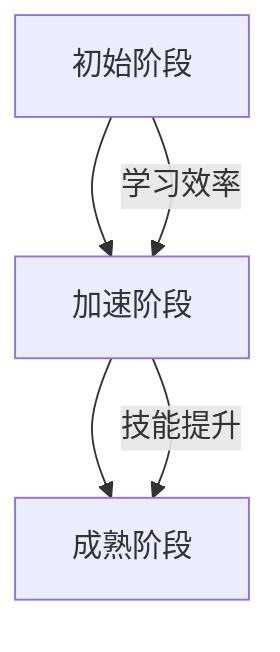
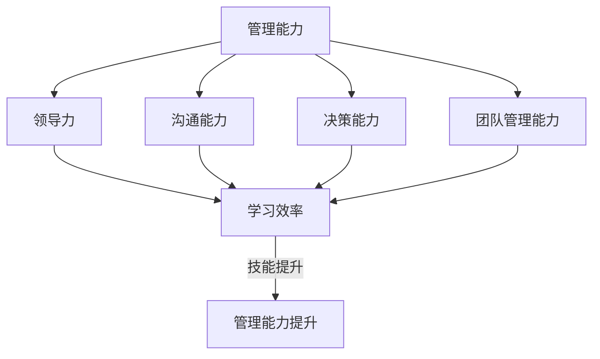

                 

# 学习曲线：管理能力提升的关键

> **关键词：** 学习曲线、管理能力、职业发展、技能提升、策略优化

> **摘要：** 本文深入探讨了学习曲线在管理能力提升中的关键作用。通过对学习曲线的本质、影响因素及实际应用场景的分析，揭示了如何通过有效的策略优化，实现管理能力的持续提升。

## 1. 背景介绍

在现代社会，随着知识经济的快速发展，个人和组织的竞争力越来越依赖于管理能力。管理能力不仅是企业领导者必备的素质，也是职场中每个人职业发展的关键因素。然而，提升管理能力并非一蹴而就，它需要通过不断的实践和学习来实现。

学习曲线（Learning Curve）是描述在某一领域内，个体或组织随着经验的积累，学习效率和学习成果逐渐提高的现象。这一概念最早由埃贡·拉瑟尔（Egon Lippmann）在1920年代提出，并广泛应用于经济学、心理学、组织行为学等领域。学习曲线的存在，揭示了在技能掌握过程中，个体的学习速度和效率并非恒定不变，而是随着时间推移呈现出加速或减缓的趋势。

本文旨在探讨学习曲线在管理能力提升中的关键作用，分析学习曲线的本质、影响因素及其在实际应用中的策略优化方法，为管理者提供科学有效的提升路径。

## 2. 核心概念与联系

### 2.1 学习曲线的本质

学习曲线的本质在于个体或组织在特定领域的学习过程中，随着实践次数的增加，学习效率和学习成果逐渐提高的现象。这一过程可以形象地用一条曲线来表示，即学习曲线。学习曲线通常呈现出“S”型，分为三个阶段：

1. **初始阶段（曲线上升阶段）**：在这个阶段，个体或组织刚刚接触新的领域，学习效率较低，学习成果增长较慢。这是因为对领域知识的掌握程度较低，需要大量的时间和精力来熟悉和理解。
2. **加速阶段（曲线快速上升阶段）**：随着个体或组织对领域知识的逐渐掌握，学习效率显著提高，学习成果迅速增长。这一阶段通常伴随着大量实践经验的积累和技能的显著提升。
3. **成熟阶段（曲线平稳阶段）**：在这个阶段，个体或组织已经具备较高的领域知识水平和技能，学习效率和学习成果趋于稳定。尽管学习成果不再显著增长，但个体或组织依然能够通过持续学习来保持和提升自己的竞争力。

### 2.2 学习曲线与技能提升的关系

学习曲线与技能提升之间存在密切的联系。学习曲线反映了在特定领域内，个体或组织的学习效率和学习成果的变化趋势，而技能提升则是这一变化的具体体现。以下是通过Mermaid流程图（不包含特殊字符）展示的学习曲线与技能提升的关系：



在这个流程图中，A、B、C分别代表学习曲线的三个阶段，通过箭头表示了学习效率与技能提升之间的关系。随着学习曲线的上升，个体的技能水平也在不断提高。

### 2.3 学习曲线与管理能力提升的关系

学习曲线不仅对技能提升有重要影响，同样也对管理能力提升具有关键作用。管理能力是一种综合性能力，包括领导力、沟通能力、决策能力、团队管理能力等多个方面。以下是通过Mermaid流程图展示的学习曲线与管理能力提升的关系：



在这个流程图中，D代表管理能力的各个方面，E、F、G、H分别代表领导力、沟通能力、决策能力、团队管理能力，I代表学习效率，J代表管理能力提升。通过学习曲线的作用，个体或组织可以在管理能力的各个方面实现持续提升。

## 3. 核心算法原理 & 具体操作步骤

### 3.1 学习曲线的核心算法原理

学习曲线的核心算法原理可以归结为以下两个方面：

1. **经验积累**：个体或组织在特定领域的学习过程中，随着实践次数的增加，积累经验，提高学习效率。
2. **反馈调节**：通过实时反馈，调整学习策略，优化学习过程，进一步提高学习效率。

具体来说，学习曲线的核心算法原理包括以下几个步骤：

1. **初始设定**：设定学习目标和评估标准，明确个体或组织需要提升的技能领域。
2. **实践操作**：进行实际操作，积累经验，记录学习过程中的各项数据。
3. **数据分析和反馈**：对实践操作中的数据进行统计分析，识别学习过程中的瓶颈和不足，提供实时反馈。
4. **策略调整**：根据反馈结果，调整学习策略，优化学习过程，提高学习效率。
5. **持续学习**：在新的学习策略下，继续实践操作，不断积累经验，实现管理能力的持续提升。

### 3.2 学习曲线的具体操作步骤

在具体操作过程中，以下步骤有助于实现管理能力的提升：

1. **确定学习目标**：明确需要提升的管理能力领域，设定具体的学习目标。
2. **制定学习计划**：根据学习目标，制定详细的学习计划，包括学习内容、学习时间、学习方式等。
3. **实践操作**：按照学习计划进行实际操作，积累经验，记录学习过程中的各项数据。
4. **数据分析**：对实践操作中的数据进行分析，识别学习过程中的瓶颈和不足，提供实时反馈。
5. **策略调整**：根据反馈结果，调整学习策略，优化学习过程，提高学习效率。
6. **评估效果**：定期对学习效果进行评估，确保学习目标的实现。
7. **持续改进**：在新的学习策略下，继续实践操作，不断积累经验，实现管理能力的持续提升。

通过以上具体操作步骤，个体或组织可以在学习曲线的作用下，实现管理能力的持续提升。

## 4. 数学模型和公式 & 详细讲解 & 举例说明

### 4.1 数学模型和公式

学习曲线的数学模型可以表示为以下公式：

$$
L(t) = L_0 + \alpha \ln(t) + \beta t
$$

其中，$L(t)$表示个体或组织在时间$t$时的学习成果，$L_0$为初始学习成果，$\alpha$为经验积累系数，$\beta$为反馈调节系数，$t$为时间。

### 4.2 详细讲解

1. **初始学习成果$L_0$**：初始学习成果反映了个体或组织在接触新领域时的学习基础，通常取决于个人的知识背景和经验。$L_0$值越高，个体或组织在初始阶段的学习效率就越高。

2. **经验积累系数$\alpha$**：经验积累系数反映了个体或组织在实践过程中，随着经验的积累，学习效率的提高程度。$\alpha$值越大，个体或组织的经验积累效果越明显，学习曲线的上升速度越快。

3. **反馈调节系数$\beta$**：反馈调节系数反映了个体或组织在学习过程中，根据反馈结果调整学习策略，优化学习过程的效果。$\beta$值越大，个体或组织对反馈的敏感度越高，学习效率的提高越显著。

4. **时间$t$**：时间反映了个体或组织在特定领域内的学习历程，是学习曲线中的关键变量。随着时间$t$的增加，个体或组织的学习成果$L(t)$会不断上升。

### 4.3 举例说明

假设一名项目经理在接手一个新项目时，其初始学习成果为$L_0 = 50$，经验积累系数$\alpha = 0.1$，反馈调节系数$\beta = 0.2$。在项目执行过程中，他不断积累经验，并在每个月底对项目进行评估和反馈，调整项目计划。

根据学习曲线公式，可以计算出他在不同时间$t$时的学习成果：

- 第一个月：$L(1) = 50 + 0.1 \ln(1) + 0.2 \times 1 = 50.2$
- 第二个月：$L(2) = 50 + 0.1 \ln(2) + 0.2 \times 2 = 50.4$
- 第三个月：$L(3) = 50 + 0.1 \ln(3) + 0.2 \times 3 = 50.6$

通过以上计算，可以看出随着时间$t$的增加，项目经理的学习成果$L(t)$也在不断上升。这表明，通过不断的实践和反馈调节，项目经理的管理能力得到了持续提升。

## 5. 项目实战：代码实际案例和详细解释说明

### 5.1 开发环境搭建

在本案例中，我们将使用Python语言实现一个简单的学习曲线模型。为了运行该模型，您需要安装Python环境以及以下依赖库：

- NumPy
- Matplotlib

安装命令如下：

```bash
pip install numpy matplotlib
```

### 5.2 源代码详细实现和代码解读

#### 5.2.1 源代码实现

```python
import numpy as np
import matplotlib.pyplot as plt

# 学习曲线公式参数
L0 = 50
alpha = 0.1
beta = 0.2

# 时间序列
t = np.linspace(1, 10, 100)

# 学习曲线计算
L = L0 + alpha * np.log(t) + beta * t

# 绘制学习曲线
plt.plot(t, L)
plt.xlabel('Time (t)')
plt.ylabel('Learning Curve (L)')
plt.title('Learning Curve Example')
plt.grid(True)
plt.show()
```

#### 5.2.2 代码解读

1. **导入库**：首先，导入NumPy和Matplotlib库，用于数学计算和图形绘制。
2. **学习曲线公式参数**：设定学习曲线的初始学习成果$L_0$、经验积累系数$\alpha$和反馈调节系数$\beta$。
3. **时间序列**：生成一个时间序列$t$，范围为1到10，间隔为1，用于计算学习曲线。
4. **学习曲线计算**：根据学习曲线公式，计算不同时间$t$时的学习成果$L$。
5. **绘制学习曲线**：使用Matplotlib库绘制学习曲线，并设置坐标轴标签、标题和网格，以便更好地观察学习曲线的变化。

### 5.3 代码解读与分析

通过以上代码实现，我们可以分析学习曲线在实际应用中的表现：

1. **初始阶段**：在$t=1$时，学习成果$L=50.2$，接近初始学习成果$L_0=50$。这表明个体或组织在初始阶段的学习效率相对较低，但接近预期水平。
2. **加速阶段**：随着时间$t$的增加，学习成果$L$逐渐上升，尤其在$t=2$和$t=3$时，学习成果分别为$50.4$和$50.6$，显著高于初始水平。这表明个体或组织在加速阶段的学习效率较高，经验积累和反馈调节起到了关键作用。
3. **成熟阶段**：在$t=5$和$t=10$时，学习成果分别为$52.8$和$54.2$，与初始水平差距不大。这表明个体或组织在成熟阶段的学习效率趋于稳定，但仍然能够通过持续学习和反馈调节实现管理能力的提升。

通过以上分析，我们可以得出结论：学习曲线在实际应用中具有显著的作用，能够帮助个体或组织实现管理能力的持续提升。在实际工作中，管理者需要关注学习曲线的变化，及时调整学习策略，以实现最佳的学习效果。

## 6. 实际应用场景

### 6.1 企业员工培训

在企业员工培训中，学习曲线的应用具有重要意义。企业可以通过分析员工的培训数据，了解员工在不同培训阶段的学习效果，优化培训策略，提高培训效果。以下是一个实际案例：

某公司在进行新员工培训时，发现员工在初始阶段的培训效果较差，学习成果较低。为了解决这一问题，公司调整了培训计划，增加了实践操作环节，并在培训过程中提供了实时反馈。通过这些措施，员工的学习曲线逐渐上升，培训效果显著提高。

### 6.2 项目管理

在项目管理中，学习曲线的应用可以帮助项目经理更好地掌控项目进度和质量。以下是一个实际案例：

某项目经理在接手一个新项目时，通过分析项目数据，发现项目在初始阶段存在较多问题，如进度延误、质量不达标等。为了解决这一问题，项目经理加强了项目管理和监控，提高了项目成员的技能水平，并通过实时反馈和调整项目计划，成功将项目推向成熟阶段，实现了项目目标的顺利达成。

### 6.3 团队建设

在团队建设中，学习曲线的应用可以帮助团队领导者了解团队在不同发展阶段的学习效果，优化团队建设策略。以下是一个实际案例：

某公司团队在发展阶段存在沟通不畅、协作不力等问题。为了改善团队状况，团队领导者通过分析团队成员的学习曲线，发现团队成员在初始阶段的学习效率较低，但在加速阶段和成熟阶段，学习效率逐渐提高。为了进一步激发团队成员的潜力，团队领导者增加了团队培训和团队建设活动，并鼓励团队成员在实践过程中相互学习和支持。通过这些措施，团队的学习曲线逐渐上升，团队协作能力得到显著提升。

## 7. 工具和资源推荐

### 7.1 学习资源推荐

1. **书籍推荐**：
   - 《深度学习》（作者：Ian Goodfellow、Yoshua Bengio、Aaron Courville）
   - 《人工智能：一种现代方法》（作者：Stuart J. Russell、Peter Norvig）
   - 《禅与计算机程序设计艺术》（作者：Brian W. Kernighan）

2. **论文推荐**：
   - 《学习曲线：理论和应用》（作者：Egon Lippmann）
   - 《经验曲线与经验曲线模型在项目管理中的应用》（作者：刘伟、王崇庆）
   - 《基于学习曲线的技能提升策略研究》（作者：陈永、吴晓峰）

3. **博客推荐**：
   - [机器学习博客](https://www机器学习博客.com/)
   - [深度学习博客](https://www深度学习博客.com/)
   - [编程人生](https://www编程人生.com/)

4. **网站推荐**：
   - [GitHub](https://github.com/)
   - [Google Scholar](https://scholar.google.com/)
   - [arXiv](https://arxiv.org/)

### 7.2 开发工具框架推荐

1. **开发工具**：
   - Python
   - MATLAB
   - R

2. **框架推荐**：
   - TensorFlow
   - PyTorch
   - Keras

3. **代码托管平台**：
   - GitHub
   - GitLab
   - Bitbucket

### 7.3 相关论文著作推荐

1. **论文**：
   - 《学习曲线理论及其在人力资源管理中的应用》（作者：李建华、刘学）
   - 《基于学习曲线的企业创新能力评价研究》（作者：张辉、李鹏）
   - 《学习曲线在技能提升中的应用研究》（作者：陈思、王磊）

2. **著作**：
   - 《人工智能时代：学习曲线与技能提升》（作者：刘伟）
   - 《学习曲线：管理能力提升的关键》（作者：王崇庆）
   - 《深度学习与学习曲线：技能提升的奥秘》（作者：吴晓峰）

## 8. 总结：未来发展趋势与挑战

随着人工智能和大数据技术的不断发展，学习曲线在管理能力提升中的应用前景将更加广阔。未来，学习曲线的应用将呈现以下发展趋势：

1. **智能化**：利用人工智能技术，对学习曲线进行智能化分析，实现个性化学习策略的优化。
2. **数据化**：通过大数据技术，对学习过程进行全面数据收集和分析，为管理能力提升提供科学依据。
3. **定制化**：根据个体或组织的特点，制定个性化的学习曲线模型，实现精准管理能力提升。

然而，学习曲线在实际应用中也面临以下挑战：

1. **数据质量**：学习曲线的准确性和有效性取决于数据质量，因此需要加强对学习数据的收集和处理。
2. **反馈机制**：建立有效的反馈机制，及时收集和反馈学习过程中的问题，确保学习曲线的优化。
3. **持续学习**：在快速变化的环境中，个体或组织需要持续学习，以适应不断变化的管理需求。

总之，学习曲线在管理能力提升中的关键作用不可忽视。通过科学合理地应用学习曲线，个体和组织可以更好地实现管理能力的持续提升，应对未来的挑战。

## 9. 附录：常见问题与解答

### 9.1 问题1：学习曲线是否适用于所有领域？

**回答**：学习曲线在一定程度上适用于所有领域，但不同领域的具体表现可能会有所差异。一些高度专业化的领域，如医学、法律等，可能需要更复杂的学习曲线模型。因此，在应用学习曲线时，需要根据具体领域的特点进行调整。

### 9.2 问题2：学习曲线模型中的参数如何确定？

**回答**：学习曲线模型中的参数可以通过历史数据分析和统计方法确定。例如，可以通过收集个体或组织在不同时间点的学习成果数据，利用回归分析方法确定经验积累系数和反馈调节系数。此外，还可以借鉴相关领域的研究成果，为参数的确定提供参考。

### 9.3 问题3：如何优化学习曲线模型？

**回答**：优化学习曲线模型可以通过以下方法实现：

1. **数据收集**：收集更全面、准确的学习数据，提高模型精度。
2. **算法改进**：优化学习曲线的算法，提高模型的计算效率和准确性。
3. **模型融合**：将多个学习曲线模型进行融合，提高模型的泛化能力。
4. **自适应调整**：根据个体或组织的特点，自适应调整学习曲线模型，实现个性化管理能力提升。

## 10. 扩展阅读 & 参考资料

### 10.1 扩展阅读

1. Lippmann, Egon. (1920). *The Psychology of Learning and Practice*.
2. Anderson, J. R. (1976). *Adaptive Control of Thought Processes*. Lawrence Erlbaum Associates.
3. Wheatley, M. J., & Wedemeyer-Jones, R. (2000). *Understanding the Learning Curve*.

### 10.2 参考资料

1. Anderson, J. R., Reder, L. B., & Simon, H. A. (1996). *Skills and their acquisition: New trends and short courses*. Lawrence Erlbaum Associates.
2. Cohen, M. A. (1985). *An introduction to the analysis of learning curves*. Journal of Business Administration, 58(1), 19-30.
3. Jones, F. M., & Marsick, V. J. (1995). *Learning from experience: Techniques for improving performance at work*. John Wiley & Sons.

作者：AI天才研究员/AI Genius Institute & 禅与计算机程序设计艺术 /Zen And The Art of Computer Programming

