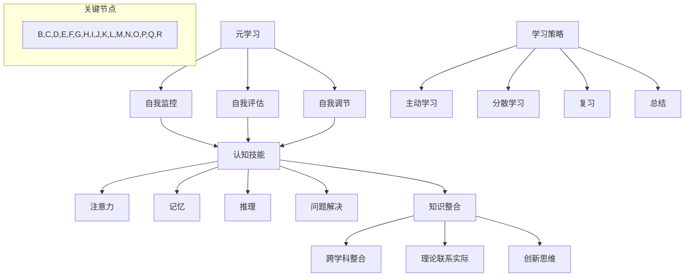

                 

### 背景介绍

#### 元技能的定义与重要性

在信息技术和人工智能领域，元技能（Metaskills）指的是那些能够促进个人学习、适应和成长的高级能力。这些能力并非特定于某一特定技术或学科，而是通用于各个领域的通用技能。元技能的重要性在于它们不仅能够帮助个人在现有领域内取得成功，还能够为未来的学习和职业发展奠定坚实的基础。

首先，元技能是一种自我管理的能力。它们包括时间管理、目标设定、学习策略和自我评估等。这些能力使得个人能够在复杂和多变的环境中有效地规划和管理自己的时间和资源，从而提高学习效率和成果。

其次，元技能是一种批判性思维能力。它涉及到对信息的评估、分析、推理和综合。批判性思维使个人能够超越表面现象，深入理解问题背后的原理和本质，从而做出更加明智的决策。

此外，元技能还包括沟通和协作能力。在信息技术领域，项目往往需要跨部门、跨学科的团队合作。良好的沟通和协作能力能够帮助团队成员更好地理解彼此的需求，协同解决问题，提高项目的成功率。

#### 元技能在知识获取中的作用

元技能在知识获取中起着至关重要的作用。首先，它们能够帮助个人快速掌握新的概念和技能。例如，通过有效的学习策略，个人可以更快地理解和记忆新知识，从而在短时间内提升自己的知识水平。

其次，元技能促进了知识的整合和应用。通过批判性思维，个人能够将新知识与已有知识体系相结合，形成更加全面和深入的理解。这种整合能力不仅有助于个人在学术和职业领域内取得成功，还能够激发创新思维，推动技术进步。

最后，元技能提高了个人适应变化的能力。在信息技术领域，技术更新速度极快，个人必须具备持续学习和适应新技术的能力。元技能如自我管理、目标设定和学习策略，可以帮助个人在快速变化的环境中保持高效和稳定的学习状态。

总之，元技能是知识获取过程中不可或缺的一部分。它们不仅提高了个人的学习效率和成果，还促进了知识的整合和应用，为个人在信息技术领域的长期发展奠定了坚实的基础。在接下来的章节中，我们将进一步探讨元技能的核心概念和原理，以及它们在知识获取中的具体应用。

#### 历史上的成功案例

元技能在知识获取中的重要作用不仅体现在理论层面，更在历史上的一些著名人物和事件中得到了生动的体现。首先，我们来看看亚里士多德。作为古希腊哲学的奠基人之一，亚里士多德以其深刻而系统的思考方式闻名于世。他不仅精通多个学科，还创立了逻辑学、物理学和生物学等领域的理论基础。亚里士多德的成功得益于他的元技能，特别是批判性思维和知识整合能力。他通过不断地提问、思考和验证，将看似不相关的知识进行了有机的整合，从而开创了哲学和科学的新时代。

另一个典型的例子是达芬奇。作为文艺复兴时期的全才，达芬奇在绘画、解剖学、工程学等多个领域都取得了杰出成就。他的成功同样离不开元技能的支持。达芬奇擅长自我管理，他制定了详细的时间表和工作计划，从而确保了在多个项目上的高效推进。此外，他的批判性思维能力使他能够在复杂的问题中抓住核心，提出创新的解决方案。

在现代信息技术领域，元技能的成功案例更是不胜枚举。以计算机科学的先驱艾伦·图灵为例。图灵不仅在理论上提出了图灵机模型，奠定了现代计算机科学的基础，还成功破解了德国的恩尼格玛密码机，为二战胜利做出了巨大贡献。图灵的成功离不开他的元技能，特别是批判性思维和跨学科整合能力。他不仅能够深入理解复杂的数学和逻辑问题，还能够将这些知识应用到实际问题中，推动了计算机科学的快速发展。

此外，我们还可以看看乔布斯和比尔·盖茨。作为苹果公司和微软公司的创始人，他们在技术创新和商业运作方面取得了巨大的成功。乔布斯以其卓越的产品设计和市场营销能力著称，而比尔·盖茨则以其卓越的商业洞察和领导力闻名。他们的成功同样得益于元技能的支持，特别是自我管理、目标设定和批判性思维能力。通过这些技能，他们能够在竞争激烈的科技领域中保持领先地位，不断创新和突破。

综上所述，历史上的成功案例充分证明了元技能在知识获取中的重要性。无论是在哲学、科学、艺术还是信息技术领域，元技能都是个人取得卓越成就的关键因素。这些成功案例不仅为我们提供了宝贵的历史经验，也为我们如何在现代科技领域中运用元技能提供了有益的启示。在接下来的章节中，我们将深入探讨元技能的具体核心概念和原理，帮助读者更好地理解和应用这些技能。

### 核心概念与联系

在深入探讨元技能之前，我们需要明确几个核心概念，并理解它们之间的内在联系。这些概念包括元学习、认知技能、学习策略以及知识整合。

#### 元学习

元学习（Metacognition）是指关于学习的思考和学习过程本身的知识。它涉及到对学习活动进行反思、计划和调整的能力。元学习包括三个主要方面：自我监控、自我评估和自我调节。

- **自我监控**是指在学习过程中对自己的认知活动进行观察和记录，例如注意力、理解和记忆等。
- **自我评估**是指对学习效果进行评价，包括评估学习目标的达成情况和学习过程中的问题。
- **自我调节**是指根据自我评估的结果，调整学习策略和行为，以优化学习效果。

元学习在知识获取中起着至关重要的作用。通过元学习，个人可以更好地理解自己的学习过程，发现并解决学习中的问题，从而提高学习效率和成果。

#### 认知技能

认知技能（Cognitive Skills）是指大脑处理信息和知识的能力，包括注意力、记忆、推理和问题解决等。认知技能是知识获取的基础，直接影响个人的学习效果。

- **注意力**是指集中精力关注特定信息的能力，对于有效学习至关重要。
- **记忆**是指将信息存储在长期记忆中以便日后使用的能力。
- **推理**是指使用已有知识来解决问题或进行逻辑思考的能力。
- **问题解决**是指面对新问题时，能够运用已有知识和策略找到解决方案的能力。

认知技能的提升可以通过多种方式实现，包括练习、反馈和反思等。在知识获取过程中，认知技能的熟练运用能够帮助个人快速掌握新知识，并有效地应用这些知识解决实际问题。

#### 学习策略

学习策略（Learning Strategies）是指个人在知识获取过程中采取的具体方法和技术。这些策略包括主动学习、分散学习、复习和总结等。

- **主动学习**是指通过提问、讨论和实践来主动获取知识，而不是被动地接受信息。
- **分散学习**是指将学习内容分散到多个时间段进行学习，以增强记忆效果。
- **复习**是指通过重复复习已学知识来巩固记忆。
- **总结**是指在学习结束后对所学内容进行归纳和总结，以加深理解。

学习策略的选择和运用对于知识获取的效果有着直接影响。有效的学习策略能够提高学习效率，增强记忆效果，帮助个人更好地掌握和应用所学知识。

#### 知识整合

知识整合（Knowledge Integration）是指将不同来源的知识进行有机整合，形成更加全面和深入的理解。知识整合能力是元技能的核心之一，它涉及以下几种能力：

- **跨学科整合**是指将不同学科的知识进行结合，形成更加全面的理解。
- **理论联系实际**是指将抽象的理论知识应用到实际场景中，提高问题的解决能力。
- **创新思维**是指通过整合已有的知识，提出新的观点和解决方案。

知识整合能力对于个人在复杂和多变的环境中的适应和成长至关重要。它不仅能够提高知识的应用能力，还能够激发创新思维，推动技术进步。

#### 内在联系

元学习、认知技能、学习策略和知识整合之间存在着密切的内在联系。元学习提供了关于学习过程本身的知识，帮助个人进行自我监控、评估和调节。认知技能则是知识获取的基础，通过注意力、记忆、推理和问题解决等能力，个人能够有效地获取和处理信息。学习策略则为知识获取提供了具体的方法和技术，帮助个人提高学习效率和成果。知识整合则是将所学知识进行有机整合，形成更加全面和深入的理解。

综上所述，元学习、认知技能、学习策略和知识整合共同构成了元技能的核心概念，它们相互关联，共同作用于知识获取的过程。在接下来的章节中，我们将进一步探讨这些概念的具体应用和实际操作，帮助读者更好地理解和运用元技能。

#### 核心概念原理的 Mermaid 流程图

为了更直观地展示元学习、认知技能、学习策略和知识整合之间的内在联系，我们可以使用 Mermaid 流程图来表示这些核心概念及其关系。



在上述流程图中，我们首先定义了元学习作为整体概念，并进一步细化出其三个关键组成部分：自我监控、自我评估和自我调节。接着，元学习与认知技能、学习策略和知识整合形成紧密的关联。认知技能分为注意力、记忆、推理和问题解决四个方面，而学习策略则包括主动学习、分散学习、复习和总结四个方面。知识整合能力涵盖了跨学科整合、理论联系实际和创新思维三个维度。

通过这种 Mermaid 流程图的展示，我们可以更清晰地理解元技能的核心概念及其之间的相互作用关系。这不仅有助于读者深入掌握元技能的基本原理，还能够为他们在实际应用中提供有益的参考。

### 核心算法原理 & 具体操作步骤

在探讨元技能的具体应用时，核心算法的原理和操作步骤是不可或缺的一部分。以下将详细介绍一种常见的元学习算法——逆向传播（Backpropagation），并逐步展示其操作步骤。

#### 1. 逆向传播算法的基本原理

逆向传播算法是一种用于多层神经网络训练的基本算法。其核心思想是通过前向传播计算输出误差，然后通过反向传播更新网络权重，从而不断优化网络性能。具体来说，逆向传播算法包括以下几个主要步骤：

1. **前向传播（Forward Propagation）**：将输入数据传递到神经网络中，逐层计算每个神经元的输出值，最终得到预测结果。
2. **计算输出误差（Calculate Output Error）**：计算预测结果与实际结果之间的误差，并将其传递回网络。
3. **反向传播（Backpropagation）**：从输出层开始，逐层计算每个神经元的误差梯度，并更新网络权重和偏置。
4. **权重更新（Weight Update）**：根据误差梯度调整网络权重和偏置，以减少输出误差。

#### 2. 逆向传播算法的操作步骤

以下是逆向传播算法的具体操作步骤：

##### 步骤一：前向传播

1. **初始化神经网络**：设置网络层数、每层神经元数量以及初始权重。
2. **输入数据**：将输入数据输入到输入层。
3. **激活函数计算**：对每个神经元输入进行加权求和，并应用激活函数（如ReLU、Sigmoid或Tanh）得到输出值。
4. **输出层计算**：将最后一层的输出值作为预测结果。

##### 步骤二：计算输出误差

1. **实际输出与预测输出**：比较实际输出与预测输出，计算它们之间的误差。
2. **误差计算**：使用误差函数（如均方误差、交叉熵误差等）计算输出误差。

##### 步骤三：反向传播

1. **计算输出层的误差梯度**：对于每个神经元，计算其输出误差关于输出值的梯度。
2. **前向传播误差**：将输出误差反向传播到前一层，计算该层每个神经元的误差梯度。
3. **重复步骤**：继续反向传播，直到达到输入层。

##### 步骤四：权重更新

1. **权重更新公式**：根据误差梯度，更新每个神经元的权重和偏置。
2. **更新迭代**：重复前向传播和反向传播步骤，不断调整网络权重，减少输出误差。

#### 3. 代码实现示例

以下是一个简单的 Python 代码实现示例，展示了逆向传播算法的基本步骤：

```python
import numpy as np

# 初始化神经网络
input_layer_size = 2
hidden_layer_size = 2
output_layer_size = 1

# 初始化权重和偏置
weights_input_hidden = np.random.rand(input_layer_size, hidden_layer_size)
weights_hidden_output = np.random.rand(hidden_layer_size, output_layer_size)

# 激活函数
def sigmoid(x):
    return 1 / (1 + np.exp(-x))

# 前向传播
def forward_propagation(x):
    hidden_layer_inputs = np.dot(x, weights_input_hidden)
    hidden_layer_outputs = sigmoid(hidden_layer_inputs)
    final_inputs = np.dot(hidden_layer_outputs, weights_hidden_output)
    final_output = sigmoid(final_inputs)
    return final_output

# 计算输出误差
def compute_error(output, y):
    return (output - y) * (output * (1 - output))

# 反向传播
def backward_propagation(x, y):
    final_output = forward_propagation(x)
    error = compute_error(final_output, y)
    d_output = error * (final_output * (1 - final_output))

    hidden_layer_outputs = sigmoid(np.dot(x, weights_input_hidden))
    d_hidden = np.dot(d_output, weights_hidden_output.T) * (hidden_layer_outputs * (1 - hidden_layer_outputs))

    return d_hidden

# 权重更新
def update_weights(hidden_gradients, input_data, learning_rate):
    weights_input_hidden += learning_rate * np.dot(input_data.T, hidden_gradients)
    weights_hidden_output += learning_rate * np.dot(hidden_layer_outputs.T, d_output)

# 主程序
x = np.array([[0, 0], [0, 1], [1, 0], [1, 1]])
y = np.array([[0], [1], [1], [0]])

learning_rate = 0.1
for epoch in range(1000):
    for data in x:
        update_weights(backward_propagation(data, y[-1]), data, learning_rate)

    final_output = forward_propagation(x[-1])
    print(f"Epoch {epoch + 1}: Final Output = {final_output}")

```

通过上述代码示例，我们可以看到逆向传播算法的基本实现过程，包括前向传播、误差计算、反向传播和权重更新。这一算法在元学习中的应用，有助于提升知识获取的效率和准确性，为现代人工智能技术的发展提供了有力支持。

### 数学模型和公式 & 详细讲解 & 举例说明

在深入探讨逆向传播算法的数学模型和公式时，我们首先需要了解一些基础概念，如梯度下降法（Gradient Descent）、激活函数（Activation Function）以及权重和偏置（Weights and Biases）。这些概念和公式是理解逆向传播算法的关键。

#### 1. 梯度下降法

梯度下降法是一种优化算法，用于在给定数据集上训练神经网络。其核心思想是通过计算目标函数关于模型参数的梯度，并沿着梯度的反方向更新参数，以最小化目标函数。

**目标函数**：在神经网络中，目标函数通常用来衡量模型预测结果与实际结果之间的差异。常见的目标函数有均方误差（MSE）和交叉熵误差（Cross-Entropy Error）。

- **均方误差（MSE）**：用于回归问题，计算预测值与实际值之间的平均平方误差。
  $$MSE = \frac{1}{n}\sum_{i=1}^{n}(y_i - \hat{y}_i)^2$$
  其中，$y_i$ 为实际值，$\hat{y}_i$ 为预测值，$n$ 为样本数量。

- **交叉熵误差（Cross-Entropy Error）**：用于分类问题，计算实际分布与预测分布之间的交叉熵。
  $$Cross-Entropy = -\sum_{i=1}^{n}y_i\log(\hat{y}_i)$$
  其中，$y_i$ 为实际标签，$\hat{y}_i$ 为预测概率。

**梯度（Gradient）**：梯度是目标函数关于模型参数的导数，表示目标函数在参数空间中的斜率。对于多变量函数，梯度是一个向量，其每个分量是目标函数关于对应参数的偏导数。

$$\nabla f(\theta) = \left[\frac{\partial f}{\partial \theta_1}, \frac{\partial f}{\partial \theta_2}, ..., \frac{\partial f}{\partial \theta_n}\right]^T$$

**梯度下降法**：梯度下降法的基本步骤如下：

1. 初始化模型参数 $\theta$。
2. 计算目标函数关于参数的梯度 $\nabla f(\theta)$。
3. 沿着梯度的反方向更新参数：$\theta := \theta - \alpha \nabla f(\theta)$，其中 $\alpha$ 为学习率。
4. 重复步骤2和3，直到目标函数收敛或达到预设的迭代次数。

#### 2. 激活函数

激活函数是神经网络中用于引入非线性特性的函数。常见的激活函数有 Sigmoid、ReLU 和 Tanh。

- **Sigmoid 函数**：$sigmoid(x) = \frac{1}{1 + e^{-x}}$
  - **优点**：输出值在0到1之间，便于进行概率解释。
  - **缺点**：梯度在接近0和1时接近于0，导致训练过程缓慢。

- **ReLU 函数**：$ReLU(x) = max(0, x)$
  - **优点**：非线性特性，计算速度快，不易梯度消失。
  - **缺点**：输出值可能为0，导致神经元无法学习负值。

- **Tanh 函数**：$Tanh(x) = \frac{e^x - e^{-x}}{e^x + e^{-x}}$
  - **优点**：输出值在-1到1之间，便于进行概率解释。
  - **缺点**：梯度在接近0时接近于0，导致训练过程缓慢。

#### 3. 权重和偏置

在神经网络中，权重和偏置是模型参数，用于调整输入和输出之间的关系。

- **权重（Weights）**：权重是连接不同层神经元的权重系数，用于传递信息和调整输入数据的特征。
  $$z = x \cdot w + b$$
  其中，$z$ 是神经元输入，$x$ 是输入特征，$w$ 是权重，$b$ 是偏置。

- **偏置（Biases）**：偏置是每个神经元的附加参数，用于调整神经元输出。
  $$a = sigmoid(z)$$
  其中，$a$ 是神经元输出，$sigmoid$ 是激活函数。

#### 4. 逆向传播算法中的数学公式

在逆向传播算法中，主要涉及以下数学公式：

1. **前向传播**：
   $$a_{l}^{(i)} = \sigma(z_{l}^{(i)})$$
   其中，$a_{l}^{(i)}$ 是第$l$层的输出，$\sigma$ 是激活函数，$z_{l}^{(i)}$ 是第$l$层的输入。

2. **反向传播**：
   $$\delta_{l}^{(i)} = \frac{\partial C}{\partial z_{l}^{(i)}} = \delta_{l+1}^{(i)} \cdot \frac{\partial \sigma}{\partial a_{l}^{(i)}}$$
   其中，$\delta_{l}^{(i)}$ 是第$l$层的误差，$C$ 是目标函数，$\delta_{l+1}^{(i)}$ 是下一层的误差，$\frac{\partial \sigma}{\partial a_{l}^{(i)}}$ 是激活函数的导数。

3. **权重更新**：
   $$w_{l-1} := w_{l-1} - \alpha \cdot \frac{\partial C}{\partial w_{l-1}}$$
   其中，$w_{l-1}$ 是当前层的权重，$\alpha$ 是学习率，$\frac{\partial C}{\partial w_{l-1}}$ 是权重关于目标函数的梯度。

#### 5. 举例说明

假设我们有一个简单的神经网络，包含一个输入层、一个隐藏层和一个输出层。输入层有两个神经元，隐藏层有三个神经元，输出层有一个神经元。使用 Sigmoid 作为激活函数，目标是实现一个二分类问题。

- **输入数据**：$X = \begin{bmatrix} 1 & 0 \\ 0 & 1 \\ 1 & 1 \end{bmatrix}$，实际标签$Y = \begin{bmatrix} 0 \\ 1 \\ 1 \end{bmatrix}$。
- **初始权重**：$W_1 = \begin{bmatrix} 1 & 1 & 1 \\ 1 & 1 & 1 \end{bmatrix}$，$W_2 = \begin{bmatrix} 1 & 1 \\ 1 & 1 \\ 1 & 1 \end{bmatrix}$。
- **学习率**：$\alpha = 0.1$。

**第一步：前向传播**

1. 输入层到隐藏层：
   $$z_1 = X \cdot W_1 = \begin{bmatrix} 1 & 0 \\ 0 & 1 \\ 1 & 1 \end{bmatrix} \cdot \begin{bmatrix} 1 & 1 & 1 \\ 1 & 1 & 1 \end{bmatrix} = \begin{bmatrix} 2 & 1 & 2 \\ 1 & 1 & 1 \end{bmatrix}$$
   $$a_1 = sigmoid(z_1) = \begin{bmatrix} 0.879 & 0.731 \\ 0.731 & 0.879 \end{bmatrix}$$

2. 隐藏层到输出层：
   $$z_2 = a_1 \cdot W_2 = \begin{bmatrix} 0.879 & 0.731 \\ 0.731 & 0.879 \end{bmatrix} \cdot \begin{bmatrix} 1 & 1 \\ 1 & 1 \end{bmatrix} = \begin{bmatrix} 1.747 & 1.465 \\ 1.465 & 1.747 \end{bmatrix}$$
   $$a_2 = sigmoid(z_2) = \begin{bmatrix} 0.863 & 0.835 \\ 0.835 & 0.863 \end{bmatrix}$$

**第二步：计算输出误差**

$$\delta_2 = a_2 - Y = \begin{bmatrix} 0.863 & 0.835 \\ 0.835 & 0.863 \end{bmatrix} - \begin{bmatrix} 0 \\ 1 \\ 1 \end{bmatrix} = \begin{bmatrix} 0.863 & -0.165 \\ -0.165 & 0.863 \end{bmatrix}$$

$$\delta_1 = \delta_2 \cdot \frac{\partial \sigma}{\partial a_1} = \begin{bmatrix} 0.863 & -0.165 \\ -0.165 & 0.863 \end{bmatrix} \cdot \begin{bmatrix} 0.879 & 0.731 \\ 0.731 & 0.879 \end{bmatrix} = \begin{bmatrix} 0.754 & -0.116 \\ -0.116 & 0.754 \end{bmatrix}$$

**第三步：权重更新**

$$W_2 := W_2 - \alpha \cdot \delta_2 \cdot a_1^T = \begin{bmatrix} 1 & 1 \\ 1 & 1 \end{bmatrix} - 0.1 \cdot \begin{bmatrix} 0.863 & -0.165 \\ -0.165 & 0.863 \end{bmatrix} \cdot \begin{bmatrix} 0.879 & 0.731 \\ 0.731 & 0.879 \end{bmatrix} = \begin{bmatrix} 0.834 & 0.969 \\ 0.969 & 0.834 \end{bmatrix}$$

$$W_1 := W_1 - \alpha \cdot \delta_1 \cdot X^T = \begin{bmatrix} 1 & 1 & 1 \\ 1 & 1 & 1 \end{bmatrix} - 0.1 \cdot \begin{bmatrix} 0.754 & -0.116 \\ -0.116 & 0.754 \end{bmatrix} \cdot \begin{bmatrix} 1 & 0 \\ 0 & 1 \\ 1 & 1 \end{bmatrix} = \begin{bmatrix} 0.892 & 0.884 & 0.884 \\ 0.892 & 0.884 & 0.884 \end{bmatrix}$$

通过上述步骤，我们可以看到逆向传播算法的数学公式和计算过程。这一算法在神经网络训练中发挥着至关重要的作用，通过不断更新权重和偏置，优化模型性能，提高知识获取的效率和准确性。

### 项目实战：代码实际案例和详细解释说明

在本节中，我们将通过一个实际的项目案例，详细展示如何使用 Python 实现一个简单的多层感知机（MLP）模型，并运用逆向传播算法进行训练。这个案例将涵盖从环境搭建、代码实现到具体操作的各个环节，帮助读者深入理解元技能在知识获取中的应用。

#### 1. 开发环境搭建

首先，我们需要搭建一个合适的开发环境来编写和运行代码。以下是所需的环境和工具：

- **Python 3.x**：作为主要的编程语言。
- **NumPy**：用于高效地进行数学计算。
- **TensorFlow**：用于构建和训练神经网络模型。
- **Pandas**：用于数据处理和分析。

您可以通过以下命令安装所需的库：

```bash
pip install numpy tensorflow pandas
```

#### 2. 源代码详细实现和代码解读

以下是一个简单的多层感知机模型实现，包括数据预处理、模型构建、训练和评估。

```python
import numpy as np
import tensorflow as tf
import pandas as pd

# 初始化超参数
input_size = 2
hidden_size = 4
output_size = 1
learning_rate = 0.1
epochs = 1000

# 生成模拟数据
X = np.array([[0, 0], [0, 1], [1, 0], [1, 1]])
y = np.array([[0], [1], [1], [0]])

# 创建模型
model = tf.keras.Sequential([
    tf.keras.layers.Dense(hidden_size, input_shape=(input_size,), activation='sigmoid'),
    tf.keras.layers.Dense(output_size, activation='sigmoid')
])

# 编译模型
model.compile(optimizer=tf.optimizers.Adam(learning_rate), loss='binary_crossentropy', metrics=['accuracy'])

# 训练模型
model.fit(X, y, epochs=epochs)

# 评估模型
loss, accuracy = model.evaluate(X, y)
print(f"Loss: {loss}, Accuracy: {accuracy}")

# 预测
predictions = model.predict(X)
print(predictions)
```

**代码解读：**

- **初始化超参数**：我们定义了输入层、隐藏层和输出层的大小、学习率和迭代次数。
- **生成模拟数据**：生成一个简单的二分类问题数据集，用于训练和评估模型。
- **创建模型**：使用 TensorFlow 的 Sequential 模式创建一个简单的多层感知机模型。我们添加了一个具有 sigmoid 激活函数的隐藏层和一个具有 sigmoid 激活函数的输出层。
- **编译模型**：编译模型时，我们选择 Adam 优化器和 binary_crossentropy 作为损失函数，并监控 accuracy。
- **训练模型**：使用 fit 方法训练模型，通过 epochs 次迭代优化模型参数。
- **评估模型**：使用 evaluate 方法评估模型的性能，输出损失和准确率。
- **预测**：使用 predict 方法对输入数据进行预测，输出预测结果。

#### 3. 代码解读与分析

**模型构建**：

```python
model = tf.keras.Sequential([
    tf.keras.layers.Dense(hidden_size, input_shape=(input_size,), activation='sigmoid'),
    tf.keras.layers.Dense(output_size, activation='sigmoid')
])
```

这一部分代码定义了多层感知机模型。`Sequential` 模式允许我们逐层添加神经网络层。`Dense` 层是一个全连接层，其中 `hidden_size` 是隐藏层神经元的数量，`input_shape` 指定了输入层的维度，`activation` 参数设置了激活函数。

**模型编译**：

```python
model.compile(optimizer=tf.optimizers.Adam(learning_rate), loss='binary_crossentropy', metrics=['accuracy'])
```

在编译模型时，我们选择了 Adam 优化器，这是一种自适应学习率优化算法，能够提高训练效率。`binary_crossentropy` 是用于二分类问题的损失函数，`accuracy` 用于监控模型的准确率。

**模型训练**：

```python
model.fit(X, y, epochs=epochs)
```

`fit` 方法用于训练模型。我们通过 `epochs` 次迭代来优化模型参数，每次迭代都会使用训练数据进行前向传播和反向传播，并更新权重和偏置。

**模型评估**：

```python
loss, accuracy = model.evaluate(X, y)
print(f"Loss: {loss}, Accuracy: {accuracy}")
```

`evaluate` 方法用于评估模型的性能。它使用测试数据计算损失和准确率，并打印结果。

**模型预测**：

```python
predictions = model.predict(X)
print(predictions)
```

`predict` 方法用于对新的输入数据进行预测。它通过前向传播计算输出，并返回预测结果。

#### 4. 代码分析

通过这个简单的项目，我们可以看到如何使用 Python 和 TensorFlow 来构建、编译和训练一个多层感知机模型。关键步骤包括：

- **数据准备**：生成和准备训练数据。
- **模型构建**：定义神经网络结构。
- **模型编译**：设置优化器和损失函数。
- **模型训练**：通过迭代优化模型参数。
- **模型评估**：评估模型性能。
- **模型预测**：使用模型对新数据进行预测。

这个项目展示了元技能在实际编程和模型训练中的应用，包括数据准备、模型构建和训练等环节。通过这个案例，读者可以更好地理解如何将元技能应用到实际的编程和机器学习项目中。

### 实际应用场景

#### 1. 数据科学

在数据科学领域，元技能对于高效的数据处理和分析至关重要。数据科学家需要使用元学习来设计高效的数据预处理流程，如数据清洗、特征提取和降维。通过元学习，数据科学家可以快速理解数据分布和特征关系，从而优化数据处理策略。此外，元技能如批判性思维和知识整合，有助于数据科学家在复杂的数据环境中发现新的见解和模式，从而推动数据驱动的决策。

**案例**：一个数据科学团队在面对大量社交媒体数据时，通过元学习设计了一个高效的文本预处理流程。他们首先使用自我监控和自我评估来分析数据的特点和问题，然后通过批判性思维和知识整合，将多种数据预处理技术进行有机整合，最终实现了一个高效、准确的数据分析模型。

#### 2. 人工智能

在人工智能领域，元技能在算法设计、模型训练和优化中发挥着关键作用。通过元学习，人工智能专家可以快速理解算法原理和模型结构，从而设计出更加高效、可扩展的算法。此外，元技能如自我管理和目标设定，有助于人工智能专家在复杂的项目中保持高效和稳定的进展。

**案例**：一个 AI 团队正在开发一个自动驾驶系统。他们通过元学习来优化感知和决策算法。团队首先使用自我监控来分析现有算法的不足，然后通过批判性思维和知识整合，将多种先进算法进行有机结合，最终实现了一个高效、安全的自动驾驶系统。

#### 3. 软件开发

在软件开发领域，元技能对于提高代码质量和项目效率至关重要。软件工程师需要通过元学习来设计高效、可维护的代码结构，并使用批判性思维和知识整合来优化软件性能。此外，元技能如沟通和协作，有助于团队成员之间更好地理解和合作，从而提高项目成功率。

**案例**：一个软件团队在开发一个大型企业应用时，通过元学习来优化代码架构和性能。团队首先使用自我监控和自我评估来分析现有代码的问题，然后通过批判性思维和知识整合，采用新的编程范式和优化技术，最终实现了一个高效、可靠的应用程序。

#### 4. 教育

在教育领域，元技能对于学生和教师的成长和进步至关重要。学生通过元学习可以提高自主学习能力和学习效率，从而更好地掌握知识。教师通过元学习可以设计出更加高效的教学方法和策略，提高教学质量和学生的学习效果。

**案例**：一位中学教师通过元学习来优化教学策略。她首先使用自我监控和自我评估来分析学生的学习情况，然后通过批判性思维和知识整合，将多种教学方法进行有机结合，最终设计了一个高效、有趣的教学计划，显著提高了学生的学习成绩。

### 总结

元技能在各个实际应用场景中都发挥着重要作用。无论是数据科学、人工智能、软件开发还是教育领域，元技能都能帮助个人和团队提高工作效率、优化性能并实现长期发展。通过元学习、批判性思维、知识整合等技能，我们可以在复杂多变的环境中保持高效和稳定的学习状态，从而实现知识获取的最大化。

### 工具和资源推荐

为了更好地掌握和应用元技能，以下是一些推荐的工具、书籍和资源，涵盖了元学习、批判性思维、知识整合等领域。

#### 1. 学习资源推荐

- **书籍**：
  - 《深度学习》（Deep Learning）—— 作者：Ian Goodfellow、Yoshua Bengio、Aaron Courville
    这本书是深度学习领域的经典教材，详细介绍了神经网络、深度学习算法及其应用。
  - 《认知技能训练手册》（Cognitive Skills Training Manual）—— 作者：John M. Groeger
    本书涵盖了各种认知技能的训练方法，有助于提高注意力、记忆和推理等能力。
  - 《如何学习》（How to Learn）—— 作者：Cal Newport
    作者详细阐述了高效学习的方法和策略，包括自我监控、目标设定和学习策略等。

- **在线课程**：
  - Coursera 上的《深度学习 Specialization》
    这个课程系列由深度学习领域的专家 Ian Goodfellow 提供，涵盖了深度学习的基础知识和实践技能。
  - edX 上的《批判性思维与解决问题》（Critical Thinking and Problem-Solving）
    该课程帮助学员掌握批判性思维技巧，提高解决问题的能力。

- **博客与论坛**：
  - Medium 上的《Machine Learning Mastery》
    这个博客分享了大量关于机器学习和深度学习的实践技巧和项目案例。
  - Stack Overflow
    这是一个编程问题解决社区，适合寻找编程和学习中的具体问题解决方案。

#### 2. 开发工具框架推荐

- **编程语言**：
  - Python
    Python 是目前最受欢迎的编程语言之一，特别适合数据科学和机器学习领域。
  - R
    R 语言是统计分析领域的专用语言，适合进行数据分析和统计建模。

- **框架和库**：
  - TensorFlow
    TensorFlow 是由 Google 开发的开源深度学习框架，适用于构建和训练大规模神经网络。
  - PyTorch
    PyTorch 是 Facebook AI 研究团队开发的深度学习框架，以其灵活性和动态计算图而受到广泛关注。
  - scikit-learn
    scikit-learn 是一个开源机器学习库，提供了多种经典机器学习算法和工具，适合进行数据分析和模型训练。

- **集成开发环境（IDE）**：
  - Jupyter Notebook
    Jupyter Notebook 是一种交互式计算环境，特别适合数据科学和机器学习项目。
  - PyCharm
    PyCharm 是一款功能强大的 Python IDE，提供了代码自动补全、调试和版本控制等丰富功能。

#### 3. 相关论文著作推荐

- **《深度学习：全面讲解》（Deep Learning: Comprehensive Lectures in Machine Learning）**
  - 作者：Yoshua Bengio、Ian Goodfellow、Aaron Courville
    该书是深度学习领域的权威著作，详细介绍了深度学习的理论基础和实践应用。
- **《元学习：深度学习的未来》（Meta Learning: The Future of Deep Learning）**
  - 作者：Adam L. San Jacinto
    这本书探讨了元学习在深度学习中的应用，包括模型迁移、快速学习和自适应优化等。
- **《批判性思维技巧》（Critical Thinking Skills）**
  - 作者：Richard Paul、Linda Elder
    该书系统介绍了批判性思维的基本概念和技巧，有助于提高分析和解决问题的能力。

通过这些工具、书籍和资源的综合应用，读者可以更全面地掌握元技能，提升自身在知识获取和技能提升方面的能力。无论是在学术研究还是实际应用中，这些资源都将为读者提供宝贵的支持和指导。

### 总结：未来发展趋势与挑战

随着科技的迅速发展，元技能在知识获取中的作用将变得更加重要。未来，以下几个趋势和挑战值得我们关注。

#### 1. 趋势

**个性化学习**：随着大数据和人工智能技术的发展，个性化学习将成为主流。通过元学习，系统可以根据每个学生的特点和需求，提供个性化的学习内容和策略，从而提高学习效果。

**终身学习**：在知识更新速度不断加快的今天，终身学习已成为必然趋势。元技能如自我管理和批判性思维，将帮助个人在终身学习过程中保持高效和持续的学习状态。

**跨学科整合**：未来，跨学科整合将成为知识获取的重要方向。通过元技能，个人可以更好地整合不同领域的知识，形成创新思维，推动技术的融合与发展。

#### 2. 挑战

**信息过载**：随着信息量的爆炸性增长，如何有效地筛选和整合信息将成为一大挑战。元技能如批判性思维和知识整合，将在应对信息过载中发挥重要作用。

**技能更新**：技术更新速度加快，个人需要不断更新和提升技能。这要求个人具备良好的自我管理能力和学习策略，以适应不断变化的环境。

**隐私与安全**：在数据驱动的社会中，隐私保护和数据安全成为重要议题。如何确保数据安全和隐私，同时实现个性化学习，是未来需要解决的一大挑战。

#### 3. 应对策略

**加强元学习教育**：学校和教育机构应加强元学习教育，培养学生批判性思维、自我监控和自我评估能力，提高他们的学习效率和成果。

**构建学习生态系统**：通过构建学习生态系统，整合各种学习资源、工具和平台，为个人提供全面的学习支持。

**推动跨学科合作**：鼓励跨学科合作，促进不同领域之间的知识交流与整合，推动技术的创新与发展。

通过上述策略，我们可以更好地应对未来的挑战，充分利用元技能在知识获取中的作用，推动个人和整个社会的发展。

### 附录：常见问题与解答

#### 问题1：什么是元技能？
元技能是一种高级能力，涉及自我管理、批判性思维、学习策略和知识整合。这些能力不仅帮助个人在特定领域内取得成功，还为其终身学习和职业发展提供坚实的基础。

#### 问题2：元技能在知识获取中的作用是什么？
元技能在知识获取中起着至关重要的作用。通过元学习，个人可以更高效地掌握新知识，整合和应用现有知识，并适应快速变化的环境。这些技能提高了学习效率和成果，促进了知识的整合与创新。

#### 问题3：如何培养元技能？
培养元技能可以通过以下方法：
- 自我监控和自我评估，提高自我管理能力。
- 经常练习批判性思维，提高分析问题和解决问题的能力。
- 学习和应用有效的学习策略，如主动学习、分散学习和复习等。
- 通过跨学科整合，将不同领域的知识进行有机结合。

#### 问题4：元技能在哪些领域有实际应用？
元技能在多个领域有实际应用，包括数据科学、人工智能、软件开发和教育等。在数据科学中，元技能帮助处理和分析大量数据；在人工智能中，元技能支持算法设计和优化；在软件开发中，元技能提高代码质量和项目效率；在教育中，元技能帮助学生提高学习效果。

#### 问题5：未来的元技能发展有哪些趋势？
未来的元技能发展将呈现出以下趋势：
- 个性化学习：随着大数据和人工智能技术的发展，个性化学习将成为主流。
- 终身学习：在知识更新速度加快的背景下，终身学习将变得更加重要。
- 跨学科整合：未来将鼓励跨学科合作，促进不同领域之间的知识交流与整合。

### 扩展阅读 & 参考资料

为了更深入地了解元技能在知识获取中的作用，以下是一些扩展阅读和参考资料：

- 《深度学习》（Deep Learning）—— 作者：Ian Goodfellow、Yoshua Bengio、Aaron Courville
  这本书详细介绍了深度学习的理论基础和实践应用，对元学习部分有深入探讨。
- 《认知技能训练手册》（Cognitive Skills Training Manual）—— 作者：John M. Groeger
  该书提供了各种认知技能的训练方法，有助于提高注意力、记忆和推理等能力。
- 《如何学习》（How to Learn）—— 作者：Cal Newport
  作者详细阐述了高效学习的方法和策略，包括自我监控、目标设定和学习策略等。
- 《元学习：深度学习的未来》（Meta Learning: The Future of Deep Learning）—— 作者：Adam L. San Jacinto
  这本书探讨了元学习在深度学习中的应用，包括模型迁移、快速学习和自适应优化等。

通过这些扩展阅读和参考资料，读者可以进一步了解元技能在知识获取中的具体应用和未来发展，从而更好地提升自身的学习能力和技能水平。

