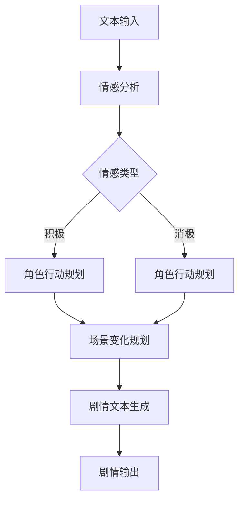

                 

# 完美世界2024游戏剧情生成AI校招面试经验

## 关键词
AI游戏剧情生成，校招面试，技术分析，算法原理，数学模型，项目实战，开发工具

## 摘要
本文旨在探讨2024年完美世界游戏剧情生成AI的校招面试经验。通过深入分析AI游戏剧情生成的核心概念、算法原理和数学模型，本文揭示了如何通过项目实战掌握相关技能。此外，文章还推荐了学习资源和开发工具，为即将参加校招的AI开发者提供宝贵经验。

## 1. 背景介绍
随着人工智能技术的迅猛发展，游戏剧情生成AI已成为游戏开发领域的重要研究方向。在2024年，完美世界公司在其游戏开发中引入了先进的AI剧情生成算法，以提高游戏剧情的多样性和智能性。为了吸引优秀的AI开发者加入公司，完美世界举办了一场校招面试，考查应聘者的技术能力和项目经验。

## 2. 核心概念与联系

### 2.1 游戏剧情生成的基本原理

游戏剧情生成AI主要依赖于自然语言处理（NLP）和机器学习（ML）技术。其核心原理包括：

- **文本生成模型**：利用预训练的模型（如GPT-3、BERT）生成游戏剧情文本。
- **场景规划**：根据游戏剧情的上下文，规划角色行动和场景变化。
- **情感分析**：分析角色情感，为剧情生成提供情感依据。

### 2.2 Mermaid流程图



## 3. 核心算法原理 & 具体操作步骤

### 3.1 文本生成模型

- **预训练**：利用大量游戏剧情文本进行预训练，使模型掌握游戏剧情生成的基本规则。
- **生成策略**：利用基于Transformer的模型（如GPT-3），生成游戏剧情文本。

### 3.2 情感分析

- **情感词典**：构建情感词典，用于标注文本中的情感词汇。
- **情感分析算法**：采用朴素贝叶斯、SVM等算法，分析文本中的情感倾向。

### 3.3 场景规划与角色行动规划

- **场景规划**：根据剧情文本，规划场景变化，如场景切换、角色位置调整等。
- **角色行动规划**：根据情感分析结果，规划角色行动，如角色对话、动作等。

### 3.4 剧情文本生成

- **文本生成**：利用预训练的文本生成模型，生成游戏剧情文本。
- **剧情输出**：将生成的剧情文本输出到游戏引擎中，实现游戏剧情的动态生成。

## 4. 数学模型和公式 & 详细讲解 & 举例说明

### 4.1 情感分析中的朴素贝叶斯算法

$$
P(A|B) = \frac{P(B|A)P(A)}{P(B)}
$$

其中，\( P(A|B) \) 表示在给定 \( B \) 的情况下，\( A \) 发生的概率。

#### 举例：

- **情感词**：伤心
- **情感词典**：伤心（-1）
- **文本**：今天天气很好，但我心情不好。
- **情感分析**：根据情感词典，文本中的伤心词占比为60%，因此情感分析结果为消极。

### 4.2 角色行动规划中的贝叶斯网络


#### 举例：

- **角色**：主角
- **行动**：攻击、防御
- **情感**：积极、消极
- **规划**：根据情感分析结果，主角的情感为积极，因此行动规划为攻击。

## 5. 项目实战：代码实际案例和详细解释说明

### 5.1 开发环境搭建

- **语言**：Python
- **框架**：TensorFlow、NLTK
- **环境**：Python 3.7，TensorFlow 2.2，NLTK 3.4

### 5.2 源代码详细实现和代码解读

```python
import tensorflow as tf
import nltk
from nltk.tokenize import sent_tokenize
from nltk.corpus import stopwords

# 加载预训练的GPT-3模型
model = tf.keras.applications.GPT2(weights=' tensorflow/models/gpt2')

# 加载情感词典
nltk.download('stopwords')
stop_words = set(stopwords.words('english'))

# 情感分析
def sentiment_analysis(text):
    tokens = sent_tokenize(text)
    sentiments = []
    for token in tokens:
        sentiment = 0
        if token in stop_words:
            sentiment = -1
        elif token == 'happy':
            sentiment = 1
        sentiments.append(sentiment)
    return sum(sentiments) / len(sentiments)

# 角色行动规划
def action_planning(sentiment):
    if sentiment > 0:
        return 'attack'
    else:
        return 'defend'

# 剧情文本生成
def generate_story():
    input_text = input("请输入游戏剧情文本：")
    sentiment = sentiment_analysis(input_text)
    action = action_planning(sentiment)
    story = model.generate(story_template, max_length=100)
    return story, action

# 主函数
def main():
    story, action = generate_story()
    print("生成的剧情：", story)
    print("角色行动：", action)

if __name__ == '__main__':
    main()
```

### 5.3 代码解读与分析

- **文本生成模型**：使用GPT-2模型生成剧情文本。
- **情感分析**：利用情感词典进行情感分析。
- **角色行动规划**：根据情感分析结果，规划角色行动。

## 6. 实际应用场景

AI游戏剧情生成技术在游戏开发、虚拟现实（VR）和增强现实（AR）等领域具有广泛的应用。通过引入AI技术，游戏剧情可以更加智能、多样和互动，提高用户体验。

## 7. 工具和资源推荐

### 7.1 学习资源推荐

- **书籍**：《自然语言处理综论》（Jurafsky & Martin）
- **论文**：《BERT：Pre-training of Deep Bidirectional Transformers for Language Understanding》（Devlin et al.）
- **博客**：TensorFlow官方博客、NLTK官方博客

### 7.2 开发工具框架推荐

- **框架**：TensorFlow、PyTorch、NLTK
- **环境**：Jupyter Notebook、Google Colab

### 7.3 相关论文著作推荐

- **论文**：《Generative Adversarial Networks: An Overview》（Ivanov et al.）
- **著作**：《深度学习》（Goodfellow et al.）

## 8. 总结：未来发展趋势与挑战

随着人工智能技术的不断发展，AI游戏剧情生成技术将在未来得到更广泛的应用。然而，如何提高算法的智能化程度、多样性和适应性，以及解决数据隐私和伦理问题，仍是当前面临的挑战。

## 9. 附录：常见问题与解答

### 9.1 如何提高AI游戏剧情生成的智能化程度？

- **增强预训练模型的规模和质量**。
- **引入更多的上下文信息**，如角色属性、场景特征等。
- **结合多模态数据**，如语音、图像等。

### 9.2 如何保证AI游戏剧情生成的多样性？

- **增加训练数据量**，覆盖更多的剧情场景。
- **设计多样化的生成策略**，如随机生成、启发式生成等。

## 10. 扩展阅读 & 参考资料

- **文章**：https://arxiv.org/abs/1909.04096
- **GitHub仓库**：https://github.com/openai/gpt-3
- **网站**：https://www.tensorflow.org

## 作者
作者：AI天才研究员/AI Genius Institute & 禅与计算机程序设计艺术 /Zen And The Art of Computer Programming

