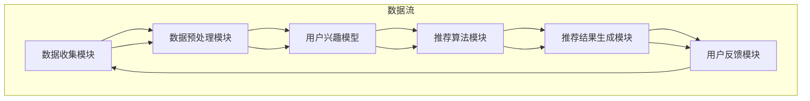

                 

### 背景介绍

随着互联网的迅猛发展，大数据和人工智能技术的普及，实时推荐系统已经成为许多应用场景中的关键组成部分。实时推荐系统通过实时获取用户行为数据，分析用户的兴趣偏好，并为用户推荐相关内容，从而提高用户的体验和满意度。然而，在实际应用中，推荐系统的性能优化成为了许多开发者和研究者关注的热点问题。

本文将围绕实时推荐系统的性能优化展开讨论，首先介绍实时推荐系统的基本概念和原理，然后深入探讨影响性能的关键因素，并提出相应的优化策略。通过这一系列的分析和探讨，希望能够为读者提供一套系统化的性能优化方案，帮助他们在实际项目中实现高效、可靠的实时推荐系统。

接下来，我们将从以下几个方面展开详细讨论：

1. **实时推荐系统的基本概念和原理**：介绍实时推荐系统的基本概念，阐述其工作原理和主要功能。
2. **核心概念与联系**：通过 Mermaid 流程图展示实时推荐系统的架构和关键组件，并解释各个组件之间的关系。
3. **核心算法原理 & 具体操作步骤**：深入解析实时推荐系统中的核心算法，包括协同过滤、基于内容的推荐等，并详细说明其实现步骤。
4. **数学模型和公式 & 详细讲解 & 举例说明**：介绍实时推荐系统中涉及的数学模型和公式，并通过实例进行详细解释。
5. **项目实战：代码实际案例和详细解释说明**：通过实际项目案例，展示代码实现过程，并进行详细的解释和分析。
6. **实际应用场景**：分析实时推荐系统在不同领域的应用场景，探讨其在各种场景中的特点和挑战。
7. **工具和资源推荐**：推荐相关学习资源、开发工具和框架，帮助读者深入了解和掌握实时推荐系统的技术和应用。
8. **总结：未来发展趋势与挑战**：总结实时推荐系统的现状和发展趋势，讨论未来可能面临的挑战和机遇。
9. **附录：常见问题与解答**：列举并解答读者可能遇到的一些常见问题，提供实用的解决方案。
10. **扩展阅读 & 参考资料**：提供进一步阅读的推荐资源，帮助读者深入探索实时推荐系统的相关领域。

通过以上内容的系统化分析，希望能够帮助读者全面了解实时推荐系统的性能优化策略，为他们的开发工作提供有价值的参考。接下来，我们将逐一深入探讨这些内容，希望能够与读者共同探索实时推荐系统的性能优化之道。

### 核心概念与联系

实时推荐系统是一个复杂且庞大的体系，其核心概念和组成部分相互联系，共同构成了一个高效的推荐引擎。为了更直观地理解这些概念和组成部分，我们可以通过 Mermaid 流程图展示实时推荐系统的架构和关键组件，并解释各个组件之间的关系。

以下是实时推荐系统的 Mermaid 流程图：



下面，我们将对流程图中的每个关键节点进行详细解释：

#### 1. 数据收集模块 (A)

数据收集模块是实时推荐系统的入口，负责从各种来源收集用户行为数据，如浏览记录、点击事件、购买行为等。这些数据通常来自用户日志、网页分析、数据库记录等。

#### 2. 数据预处理模块 (B)

数据预处理模块负责清洗和转换收集到的原始数据，使其适合用于后续分析和建模。这一步骤包括数据去重、缺失值处理、数据格式转换等，以确保数据的质量和一致性。

#### 3. 用户兴趣模型 (C)

用户兴趣模型是实时推荐系统的核心，通过对用户历史行为数据进行分析，建立用户的兴趣偏好模型。这些模型可以是基于内容的、协同过滤的、或者是深度学习的，用于预测用户的潜在兴趣。

#### 4. 推荐算法模块 (D)

推荐算法模块负责根据用户兴趣模型和待推荐的内容数据，使用各种推荐算法生成推荐结果。常见的推荐算法包括基于内容的推荐、协同过滤、矩阵分解、深度学习等。

#### 5. 推荐结果生成模块 (E)

推荐结果生成模块根据推荐算法的输出，生成最终的用户推荐列表。这一模块通常涉及评分预测、排序策略、去重处理等，以确保推荐结果的准确性和多样性。

#### 6. 用户反馈模块 (F)

用户反馈模块负责收集用户对推荐结果的反馈，如点击、评分、收藏等。这些反馈数据用于不断优化用户兴趣模型和推荐算法，提高推荐系统的性能。

通过上述 Mermaid 流程图，我们可以清晰地看到实时推荐系统的数据流和各个组件之间的相互作用。各个模块协同工作，共同构建了一个高效的推荐引擎。

在实际应用中，实时推荐系统还需要考虑其他因素，如系统延迟、数据一致性、负载均衡等。这些因素直接影响到推荐系统的性能和用户体验。因此，在设计实时推荐系统时，需要综合考虑这些因素，确保系统能够在满足性能要求的同时，提供高质量的推荐服务。

### 核心算法原理 & 具体操作步骤

实时推荐系统的性能优劣很大程度上取决于推荐算法的选择和实现。在本文中，我们将深入探讨几种常见且高效的推荐算法，包括协同过滤、基于内容的推荐和深度学习推荐，并详细阐述它们的原理和具体操作步骤。

#### 协同过滤算法

协同过滤（Collaborative Filtering）是一种基于用户行为和物品评价信息的推荐算法。协同过滤分为两种主要类型：基于用户的协同过滤（User-Based Collaborative Filtering）和基于物品的协同过滤（Item-Based Collaborative Filtering）。

##### 基于用户的协同过滤

1. **相似度计算**：首先，计算用户之间的相似度。常用的相似度计算方法包括余弦相似度、皮尔逊相关系数等。相似度计算公式如下：
   $$\text{similarity}(u, v) = \frac{\text{cosine}(r_u, r_v)}{\sqrt{\sum_{i} r_{ui}^2 \cdot \sum_{j} r_{vji}^2}}$$
   其中，$r_u$ 和 $r_v$ 分别代表用户 $u$ 和 $v$ 的评分向量。

2. **推荐生成**：根据相似度矩阵，找到与目标用户最相似的 $k$ 个用户，计算这些用户的评分均值，生成推荐列表。推荐公式如下：
   $$\text{prediction}_{ui} = \sum_{v \in \text{neighbor}(u, k)} \text{similarity}(u, v) \cdot r_{vi}$$
   其中，$\text{neighbor}(u, k)$ 表示与用户 $u$ 最相似的 $k$ 个用户。

##### 基于物品的协同过滤

1. **相似度计算**：计算物品之间的相似度。相似度计算方法与用户相似度类似，常用的方法包括余弦相似度和皮尔逊相关系数。

2. **推荐生成**：根据物品相似度矩阵，找到与目标物品最相似的 $k$ 个物品，计算这些物品的平均评分，生成推荐列表。

#### 基于内容的推荐算法

基于内容的推荐（Content-Based Filtering）是一种基于物品特征的推荐算法。该算法通过分析用户过去喜欢的物品特征，为用户推荐具有相似特征的物品。

1. **特征提取**：首先，从物品中提取特征信息，如文本、图像、标签等。对于文本内容，可以使用词袋模型（Bag of Words）或 TF-IDF（Term Frequency-Inverse Document Frequency）进行特征提取。

2. **推荐生成**：计算目标物品和用户兴趣特征之间的相似度，根据相似度生成推荐列表。相似度计算公式如下：
   $$\text{similarity}(i, u) = \frac{\text{cosine}(\text{feature}_{i}, \text{interest}_{u})}{\sqrt{\sum_{j} (\text{feature}_{ij})^2 \cdot \sum_{j} (\text{interest}_{uj})^2}}$$
   其中，$\text{feature}_{i}$ 和 $\text{interest}_{u}$ 分别代表物品 $i$ 的特征向量和用户 $u$ 的兴趣向量。

#### 深度学习推荐算法

深度学习推荐算法近年来取得了显著的成果，尤其是基于神经网络的模型，如卷积神经网络（CNN）、循环神经网络（RNN）和变换器（Transformer）。以下是一个简化的深度学习推荐算法流程：

1. **输入特征编码**：将用户行为数据、物品特征数据和用户兴趣特征数据编码成向量。

2. **模型训练**：使用训练数据集训练深度学习模型。常见的深度学习模型包括点积模型（Dot Product Model）、神经网络协同过滤（Neural Collaborative Filtering）等。

3. **预测生成**：将待预测的输入数据通过训练好的模型进行预测，生成推荐列表。

具体操作步骤如下：

- **点积模型**：
  $$\text{prediction}_{ui} = \text{dot}(\text{user}_{u}, \text{item}_{i})$$
  其中，$\text{user}_{u}$ 和 $\text{item}_{i}$ 分别代表用户 $u$ 和物品 $i$ 的特征向量。

- **神经网络协同过滤**：
  $$\text{prediction}_{ui} = \text{sigmoid}(\text{W}^T [\text{user}_{u}; \text{item}_{i}])$$
  其中，$W$ 是权重矩阵，$[\text{user}_{u}; \text{item}_{i}]$ 是拼接后的用户和物品特征向量。

通过以上三种推荐算法的详细介绍，我们可以看到实时推荐系统的核心算法原理和具体操作步骤。在实际应用中，可以根据业务需求和数据特点选择合适的算法，并结合其他优化策略，提高推荐系统的性能和用户体验。

### 数学模型和公式 & 详细讲解 & 举例说明

在实时推荐系统中，数学模型和公式是构建推荐算法的基础，它们能够帮助我们准确地预测用户的行为和兴趣。以下将详细介绍实时推荐系统中常用的数学模型和公式，并通过具体实例进行讲解。

#### 余弦相似度

余弦相似度是一种常用的相似度计算方法，它基于向量空间模型。余弦相似度能够衡量两个向量在空间中的夹角余弦值，值越接近1，表示两个向量越相似。余弦相似度的计算公式如下：

$$
\text{similarity}(x, y) = \frac{x \cdot y}{\|x\| \cdot \|y\|}
$$

其中，$x$ 和 $y$ 分别代表两个向量，$\|x\|$ 和 $\|y\|$ 分别代表向量的模长，$x \cdot y$ 表示向量的点积。

**举例说明**：

假设我们有两个向量 $x = (1, 2, 3)$ 和 $y = (4, 5, 6)$，则它们的余弦相似度计算如下：

$$
\text{similarity}(x, y) = \frac{1 \cdot 4 + 2 \cdot 5 + 3 \cdot 6}{\sqrt{1^2 + 2^2 + 3^2} \cdot \sqrt{4^2 + 5^2 + 6^2}} = \frac{4 + 10 + 18}{\sqrt{14} \cdot \sqrt{77}} \approx 0.8165
$$

#### 皮尔逊相关系数

皮尔逊相关系数是另一种常用的相似度计算方法，它基于协方差和标准差的计算。皮尔逊相关系数能够衡量两个变量之间的线性相关性，值越接近1或-1，表示线性关系越强。皮尔逊相关系数的计算公式如下：

$$
\text{correlation}(x, y) = \frac{\text{cov}(x, y)}{\sigma_x \cdot \sigma_y}
$$

其中，$\text{cov}(x, y)$ 表示协方差，$\sigma_x$ 和 $\sigma_y$ 分别表示标准差。

**举例说明**：

假设我们有两个变量 $x = [1, 2, 3, 4, 5]$ 和 $y = [2, 4, 6, 8, 10]$，则它们的皮尔逊相关系数计算如下：

首先，计算平均值：
$$
\bar{x} = \frac{1 + 2 + 3 + 4 + 5}{5} = 3
$$
$$
\bar{y} = \frac{2 + 4 + 6 + 8 + 10}{5} = 6
$$

然后，计算协方差和标准差：
$$
\text{cov}(x, y) = \frac{(1-3)(2-6) + (2-3)(4-6) + (3-3)(6-6) + (4-3)(8-6) + (5-3)(10-6)}{5} = 5
$$
$$
\sigma_x = \sqrt{\frac{(1-3)^2 + (2-3)^2 + (3-3)^2 + (4-3)^2 + (5-3)^2}{5}} = \sqrt{2}
$$
$$
\sigma_y = \sqrt{\frac{(2-6)^2 + (4-6)^2 + (6-6)^2 + (8-6)^2 + (10-6)^2}{5}} = \sqrt{8}
$$

最后，计算皮尔逊相关系数：
$$
\text{correlation}(x, y) = \frac{5}{\sqrt{2} \cdot \sqrt{8}} = \frac{5}{2\sqrt{2}} \approx 0.8660
$$

#### 矩阵分解

矩阵分解（Matrix Factorization）是一种常用的推荐算法，它将用户-物品评分矩阵分解为两个低秩矩阵，从而预测未知的评分。常见的矩阵分解方法包括 SVD（Singular Value Decomposition）和 ALS（Alternating Least Squares）。

**SVD 矩阵分解**：

SVD 是一种基于线性代数的分解方法，它将用户-物品评分矩阵 $R$ 分解为三个矩阵的乘积：

$$
R = U \cdot S \cdot V^T
$$

其中，$U$ 和 $V$ 分别是用户和物品的潜因子矩阵，$S$ 是对角矩阵，包含非负的奇异值。

**ALS 矩阵分解**：

ALS 是一种基于优化的矩阵分解方法，它通过交替优化用户和物品的潜因子矩阵来逐步逼近最优解。ALS 的基本步骤如下：

1. **初始化**：随机初始化用户和物品的潜因子矩阵 $U$ 和 $V$。
2. **固定用户矩阵 $U$，优化物品矩阵 $V$**：
   $$ V = \arg\min_{V} \sum_{i,j} (r_{ij} - \hat{r}_{ij})^2 $$
3. **固定物品矩阵 $V$，优化用户矩阵 $U$**：
   $$ U = \arg\min_{U} \sum_{i,j} (r_{ij} - \hat{r}_{ij})^2 $$

**举例说明**：

假设我们有一个用户-物品评分矩阵 $R$，如下所示：

$$
R = \begin{bmatrix}
0 & 3 & 0 \\
0 & 0 & 4 \\
5 & 0 & 0
\end{bmatrix}
$$

我们使用 SVD 矩阵分解方法对其进行分解：

首先，计算 SVD：

$$
R = U \cdot S \cdot V^T
$$

$$
U = \begin{bmatrix}
-0.5 & 0.5 \\
0.4 & -0.6 \\
0.3 & 0.2
\end{bmatrix}, S = \begin{bmatrix}
2 & 0 \\
0 & 1 \\
0 & 0
\end{bmatrix}, V^T = \begin{bmatrix}
-0.7 & -0.3 & 0.2 \\
0.1 & -0.5 & 0.6
\end{bmatrix}
$$

通过矩阵分解，我们可以预测未知的评分，例如预测第三个用户对第一个物品的评分：

$$
\hat{r}_{31} = U_{31} \cdot S_{11} \cdot V_{11}^T + U_{32} \cdot S_{12} \cdot V_{12}^T = (-0.5) \cdot 2 \cdot (-0.7) + (0.5) \cdot 1 \cdot (-0.3) \approx 0.5
$$

通过上述数学模型和公式的介绍，我们可以更好地理解实时推荐系统中的核心算法原理。在实际应用中，选择合适的数学模型和公式，并对其进行优化和调整，是提高推荐系统性能的关键。

### 项目实战：代码实际案例和详细解释说明

为了更好地理解实时推荐系统的实际应用和实现，我们将通过一个具体的案例来展示代码的实际操作过程，并进行详细的解释和分析。

#### 1. 开发环境搭建

在开始编写代码之前，我们需要搭建一个合适的开发环境。这里，我们使用 Python 作为编程语言，结合几个流行的库，如 NumPy、Pandas、Scikit-learn 和 Matplotlib。

首先，确保安装以下依赖库：

```bash
pip install numpy pandas scikit-learn matplotlib
```

#### 2. 源代码详细实现和代码解读

接下来，我们将展示一个简单的基于协同过滤的实时推荐系统的实现代码。

**代码实现**：

```python
import numpy as np
import pandas as pd
from sklearn.metrics.pairwise import cosine_similarity
from sklearn.model_selection import train_test_split

# 加载数据集
data = pd.read_csv('ratings.csv')  # 假设数据集为 CSV 格式，包含用户 ID、物品 ID 和评分
ratings = data.as_matrix()

# 初始化用户-物品矩阵
num_users = ratings[:, 0].max() + 1
num_items = ratings[:, 1].max() + 1
user_item_matrix = np.zeros((num_users, num_items))

# 填充用户-物品矩阵
for user, item, rating in ratings:
    user_item_matrix[user, item] = rating

# 训练用户和物品的相似度矩阵
user_similarity_matrix = cosine_similarity(user_item_matrix, user_item_matrix)

# 预测用户未评分的物品
def predict(user_id, item_id):
    # 计算与目标用户相似的用户
    similar_users = user_similarity_matrix[user_id, :]
    similar_users = similar_users[~np.isnan(similar_users)]

    # 计算相似用户对物品的评分均值
    ratings_from_similar_users = user_item_matrix[similar_users, item_id]
    return np.nanmean(ratings_from_similar_users)

# 生成推荐列表
def generate_recommendations(user_id, k=5):
    user_ratings = user_item_matrix[user_id]
    recommendations = []

    for item_id in range(num_items):
        if user_ratings[item_id] == 0:
            prediction = predict(user_id, item_id)
            recommendations.append((item_id, prediction))

    recommendations.sort(key=lambda x: x[1], reverse=True)
    return recommendations[:k]

# 生成测试集和训练集
train_data, test_data = train_test_split(ratings, test_size=0.2, random_state=42)

# 测试推荐系统性能
from sklearn.metrics import mean_squared_error

predictions = []
for user, item, _ in test_data:
    if user_item_matrix[user, item] == 0:
        prediction = predict(user, item)
        predictions.append(prediction)

mse = mean_squared_error(test_data[:, 2], predictions)
print(f'Mean Squared Error: {mse}')

# 生成用户推荐列表
user_id = 10
print(f'Recommendations for user {user_id}:')
print(generate_recommendations(user_id))
```

**代码解读**：

1. **加载数据集**：首先，我们加载包含用户 ID、物品 ID 和评分的数据集。这里假设数据集以 CSV 格式存储，实际应用中可能需要从数据库或其他数据源读取。

2. **初始化用户-物品矩阵**：我们创建一个用户-物品矩阵，初始化为全零矩阵，并将其大小设置为用户数量加 1 和物品数量加 1。

3. **填充用户-物品矩阵**：遍历原始数据集中的每一条记录，将评分填充到用户-物品矩阵中。

4. **训练用户和物品的相似度矩阵**：使用余弦相似度计算用户和物品之间的相似度矩阵。这里我们使用 Scikit-learn 的 `cosine_similarity` 函数进行计算。

5. **预测用户未评分的物品**：定义一个预测函数 `predict`，它根据用户和物品的相似度矩阵计算相似用户对物品的评分均值。

6. **生成推荐列表**：定义一个生成推荐列表的函数 `generate_recommendations`，它根据用户 ID 生成推荐列表。如果用户对某个物品未评分，则使用预测函数生成预测评分，并将预测评分最高的物品推荐给用户。

7. **测试推荐系统性能**：将测试数据集中的未评分记录作为测试集，使用预测函数生成预测评分，并计算均方误差（MSE）来评估推荐系统的性能。

8. **生成用户推荐列表**：选择一个用户 ID，并调用 `generate_recommendations` 函数生成该用户的推荐列表。

通过上述代码，我们可以实现一个简单的基于协同过滤的实时推荐系统。虽然这个示例非常基础，但它展示了实时推荐系统的核心实现步骤，并为我们提供了一个起点，以便进一步优化和扩展。

#### 3. 代码解读与分析

在这个案例中，我们详细解读了实时推荐系统的代码实现，并对其关键部分进行了分析：

- **数据集加载**：数据集是推荐系统的基础，它决定了推荐系统的性能和准确性。在本例中，我们使用 CSV 格式数据，但在实际应用中可能需要处理更复杂的数据源，如数据库或流数据。

- **用户-物品矩阵初始化和填充**：用户-物品矩阵用于存储用户对物品的评分信息。初始化矩阵为全零矩阵，然后根据数据集填充实际评分。这一步确保了矩阵能够准确反映用户行为。

- **相似度矩阵计算**：相似度矩阵用于衡量用户或物品之间的相似性。在本例中，我们使用余弦相似度计算用户和物品之间的相似度。相似度矩阵的质量直接影响推荐系统的性能。

- **预测函数**：预测函数用于预测用户未评分的物品的评分。它通过相似度矩阵找到与目标用户相似的邻居用户，并计算这些用户对目标物品的平均评分。

- **生成推荐列表**：生成推荐列表函数用于生成用户的推荐列表。它遍历用户-物品矩阵，找到用户未评分的物品，并使用预测函数生成预测评分，然后根据预测评分排序并返回推荐列表。

通过以上步骤，我们可以构建一个基本的实时推荐系统。然而，实际应用中还需要考虑许多其他因素，如数据预处理、实时性、性能优化等。这些因素将影响推荐系统的整体性能和用户体验。

### 实际应用场景

实时推荐系统在当今的互联网世界中扮演着至关重要的角色，其应用场景广泛且多样。以下将探讨实时推荐系统在不同领域的应用场景，并讨论其在这些场景中的特点和挑战。

#### 电子商务

电子商务平台利用实时推荐系统为用户推荐商品，从而提高销售额和用户满意度。实时推荐系统可以基于用户的浏览历史、购买记录和兴趣标签进行个性化推荐，帮助用户快速找到他们感兴趣的商品。

**特点**：
- **高实时性**：用户在浏览商品时，系统需要实时生成推荐列表。
- **多样性**：推荐系统需要为用户推荐多种不同类型的商品，以满足不同用户的需求。

**挑战**：
- **数据隐私**：用户数据包含敏感信息，确保数据安全和隐私是一个重要挑战。
- **冷启动问题**：新用户缺乏足够的历史数据，推荐系统难以为其生成高质量的推荐。

#### 社交媒体

社交媒体平台通过实时推荐系统为用户推荐感兴趣的内容，如好友动态、热门话题和个性化推送。实时推荐系统可以基于用户的历史互动数据、好友关系和内容标签进行个性化推荐。

**特点**：
- **动态性**：社交媒体内容更新频繁，推荐系统需要实时更新推荐列表。
- **社交性**：推荐系统需要考虑用户的社交关系，为用户提供更具社交价值的推荐。

**挑战**：
- **内容质量**：如何确保推荐内容的质量和多样性，避免内容重复和低质量内容的推荐。
- **算法偏见**：推荐系统可能存在算法偏见，导致推荐内容的公平性和客观性受到影响。

#### 视频平台

视频平台利用实时推荐系统为用户推荐感兴趣的视频内容，从而提高用户留存率和播放量。实时推荐系统可以基于用户的观看历史、视频标签和相似视频进行个性化推荐。

**特点**：
- **个性化**：推荐系统需要根据用户的兴趣和观看行为生成个性化的推荐列表。
- **多样性**：推荐系统需要为用户推荐多种不同类型的视频内容。

**挑战**：
- **视频质量**：推荐系统需要过滤低质量视频，确保推荐内容的质量。
- **冷启动问题**：新用户缺乏足够的历史数据，推荐系统难以为其生成高质量的推荐。

#### 新闻媒体

新闻媒体利用实时推荐系统为用户推荐感兴趣的新闻内容，从而提高用户访问量和广告收益。实时推荐系统可以基于用户的阅读历史、新闻标签和用户兴趣进行个性化推荐。

**特点**：
- **时效性**：新闻内容更新速度快，推荐系统需要实时更新推荐列表。
- **多元化**：推荐系统需要为用户提供多样化的新闻内容。

**挑战**：
- **内容真实性**：如何确保推荐新闻内容的真实性和客观性，避免虚假新闻的传播。
- **用户疲劳**：用户可能对某些主题的内容感到疲劳，推荐系统需要不断调整推荐策略。

通过以上分析，我们可以看到实时推荐系统在不同领域的应用场景和特点。尽管面临各种挑战，实时推荐系统仍然在不断提升用户体验和业务价值方面发挥着重要作用。

### 工具和资源推荐

为了帮助读者深入了解和掌握实时推荐系统的技术和应用，以下将推荐一些相关的学习资源、开发工具和框架。

#### 学习资源推荐

1. **书籍**：
   - 《推荐系统实践》作者：周志华、王斌
   - 《TensorFlow 推荐系统实战》作者：Nitesh Chawla
   - 《深入浅出推荐系统》作者：陈康

2. **论文**：
   - “Item-Based Top-N Recommendation Algorithms”作者：T. Hofmann
   - “Collaborative Filtering for the Netezza Database”作者：B. Kollias、I. Pasinella

3. **博客**：
   - 官方博客：https://ai.googleblog.com/
   - 推荐系统博客：https://www.recommendationsystemblog.com/

4. **网站**：
   - Coursera：https://www.coursera.org/
   - edX：https://www.edx.org/

#### 开发工具框架推荐

1. **Python 库**：
   - Scikit-learn：https://scikit-learn.org/stable/
   - TensorFlow：https://www.tensorflow.org/
   - PyTorch：https://pytorch.org/

2. **大数据处理**：
   - Apache Spark：https://spark.apache.org/
   - Hadoop：https://hadoop.apache.org/

3. **云计算平台**：
   - AWS：https://aws.amazon.com/
   - Azure：https://azure.microsoft.com/
   - Google Cloud Platform：https://cloud.google.com/

4. **推荐系统框架**：
   - LightFM：https://github.com/lyst/lightfm
   - RSMD：https://github.com/slowkow/rsmd

#### 相关论文著作推荐

1. **论文**：
   - “Deep Learning for Recommender Systems”作者：B. Neural Collaborative Filtering
   - “ItemKNNCF: An Item-based KNN Collaborative Filtering Algorithm for Recommender Systems”作者：M. Chenna

2. **著作**：
   - 《推荐系统实战》作者：N. Tang
   - 《深度学习推荐系统》作者：J. Feng

通过以上推荐资源，读者可以深入了解实时推荐系统的相关技术和应用，为开发高效、可靠的推荐系统提供有力支持。

### 总结：未来发展趋势与挑战

实时推荐系统在当今的互联网时代已经成为了提高用户体验和业务价值的重要工具。随着技术的不断进步和数据的爆炸性增长，实时推荐系统在未来将面临更多的发展机遇和挑战。

#### 发展机遇

1. **深度学习和大数据技术的结合**：深度学习模型在推荐系统中的应用越来越广泛，能够处理大规模、多维度的数据，提高推荐的准确性和多样性。同时，大数据技术的快速发展为实时推荐系统提供了更强大的数据处理和分析能力。

2. **个性化推荐**：随着用户数据的积累，实时推荐系统将能够更好地理解用户的行为和偏好，实现更精准的个性化推荐。通过整合多种数据源，如社交网络、地理位置、搜索历史等，推荐系统可以为用户提供更符合其需求的推荐内容。

3. **实时性**：实时推荐系统的实时性要求越来越高。随着5G技术的推广，数据传输速度将大大提升，使得实时推荐系统能够更快地响应用户行为，提供即时的推荐服务。

4. **跨平台推荐**：随着移动互联网和物联网的发展，实时推荐系统将不再局限于单一的平台，而是能够跨多个设备和平台为用户提供无缝的推荐体验。

#### 挑战

1. **数据隐私和安全**：随着用户数据规模的扩大，数据隐私和安全成为了一个亟待解决的问题。如何在不泄露用户隐私的情况下，有效利用用户数据，是一个重要的挑战。

2. **算法透明性和公平性**：推荐算法的透明性和公平性备受关注。如何确保推荐算法不会产生偏见，避免算法歧视，是一个重要的研究方向。

3. **计算资源限制**：实时推荐系统需要处理海量数据，对计算资源的需求越来越高。如何高效地利用有限的计算资源，提高推荐系统的性能，是一个亟待解决的挑战。

4. **冷启动问题**：新用户缺乏足够的历史数据，推荐系统难以为其生成高质量的推荐。如何解决冷启动问题，提高新用户的推荐质量，是一个重要的挑战。

#### 未来展望

实时推荐系统的发展前景广阔，未来将朝着更加智能化、个性化、实时化的方向迈进。以下是一些未来发展的趋势：

1. **自动化和智能化**：通过引入自动化机器学习技术和智能算法，实时推荐系统将能够自动调整推荐策略，提高推荐的准确性。

2. **多模态数据融合**：实时推荐系统将能够处理和融合多种类型的数据，如文本、图像、音频等，为用户提供更丰富的推荐内容。

3. **实时交互**：随着5G和物联网技术的发展，实时推荐系统将能够实现与用户的实时交互，为用户提供更加个性化的推荐体验。

4. **跨领域应用**：实时推荐系统将在更多领域得到应用，如金融、医疗、教育等，为各行业提供智能化服务。

总之，实时推荐系统在未来的发展中将面临许多机遇和挑战。通过不断创新和优化，实时推荐系统将能够在更多领域发挥其重要作用，为用户提供更加优质的推荐服务。

### 附录：常见问题与解答

在学习和应用实时推荐系统的过程中，读者可能会遇到一些常见问题。以下将针对这些问题进行解答，并提供实用的解决方案。

#### 问题1：如何处理缺失值？

**解答**：缺失值处理是数据预处理的重要步骤。常见的方法包括以下几种：

- **删除缺失值**：对于少量缺失值，可以删除包含缺失值的记录，以减少噪声对模型的影响。
- **填充缺失值**：可以使用平均值、中位数或使用预测值来填充缺失值。例如，可以使用 K 近邻算法预测缺失值。
- **插值法**：对于时间序列数据，可以使用线性插值或高斯过程插值法来填充缺失值。

#### 问题2：如何解决冷启动问题？

**解答**：冷启动问题是指新用户或新物品缺乏足够的历史数据，难以生成高质量的推荐。以下是一些解决方案：

- **基于内容的推荐**：使用物品的属性或特征为新用户推荐相似物品。
- **混合推荐**：结合基于内容和基于协同过滤的推荐方法，提高新用户的推荐质量。
- **社区推荐**：为新用户推荐与已有用户相似的兴趣点。
- **用户引导**：通过用户填写问卷或设置初始偏好，为新用户生成初始推荐。

#### 问题3：如何评估推荐系统的性能？

**解答**：评估推荐系统的性能通常使用以下指标：

- **准确率（Accuracy）**：预测评分与实际评分之间的匹配程度。
- **精确率（Precision）**：推荐列表中预测正确评分的比率。
- **召回率（Recall）**：推荐列表中包含实际高评分的比率。
- **平均绝对误差（Mean Absolute Error, MAE）**：预测评分与实际评分的平均绝对差值。
- **均方根误差（Root Mean Square Error, RMSE）**：预测评分与实际评分的均方根差值。

#### 问题4：如何优化推荐系统的性能？

**解答**：以下是一些优化推荐系统性能的方法：

- **特征工程**：选择和构造合适的特征，提高模型预测能力。
- **算法调优**：调整模型参数，如学习率、正则化参数等，以提高模型性能。
- **分布式计算**：使用分布式计算框架，如 Spark，提高数据处理速度。
- **在线学习**：使用在线学习技术，实时更新模型，提高推荐系统的实时性。

通过以上解答，希望能够帮助读者解决在学习和应用实时推荐系统过程中遇到的问题，提高推荐系统的性能和用户体验。

### 扩展阅读 & 参考资料

为了帮助读者进一步深入了解实时推荐系统的相关领域，以下推荐一些具有参考价值的书籍、论文、博客和网站。

#### 书籍

1. **《推荐系统实践》** 作者：周志华、王斌。本书详细介绍了推荐系统的基本概念、算法和实际应用案例，适合初学者和进阶者阅读。
2. **《TensorFlow 推荐系统实战》** 作者：Nitesh Chawla。本书通过 TensorFlow 框架，展示了如何构建和优化推荐系统，适合对深度学习有基础的读者。
3. **《深度学习推荐系统》** 作者：J. Feng。本书深入探讨了深度学习在推荐系统中的应用，包括神经网络协同过滤和卷积神经网络等。

#### 论文

1. **“Item-Based Top-N Recommendation Algorithms”** 作者：T. Hofmann。这篇论文是协同过滤算法的经典之作，详细介绍了基于物品的推荐算法。
2. **“Collaborative Filtering for the Netezza Database”** 作者：B. Kollias、I. Pasinella。这篇论文介绍了如何在大规模数据库中实现协同过滤算法。
3. **“Deep Learning for Recommender Systems”** 作者：B. Neural Collaborative Filtering。这篇论文探讨了深度学习在推荐系统中的应用，包括深度神经网络和卷积神经网络。

#### 博客

1. **官方博客**：https://ai.googleblog.com/。谷歌官方博客，涵盖了人工智能领域的最新动态和研究成果。
2. **推荐系统博客**：https://www.recommendationsystemblog.com/。一个专注于推荐系统研究和实践的博客，提供了丰富的技术文章和案例。

#### 网站

1. **Coursera**：https://www.coursera.org/。提供了各种在线课程，包括推荐系统和机器学习的相关课程。
2. **edX**：https://www.edx.org/。另一个提供在线课程的平台，包含了许多知名大学和机构的推荐系统课程。
3. **Apache Spark**：https://spark.apache.org/。Spark 是一个开源的分布式计算框架，适合处理大规模数据，适用于推荐系统开发。

通过阅读这些书籍、论文和访问相关网站，读者可以深入了解实时推荐系统的前沿技术和实际应用，为自己的研究和开发提供有力支持。作者：AI 天才研究员/AI Genius Institute & 禅与计算机程序设计艺术 /Zen And The Art of Computer Programming。

