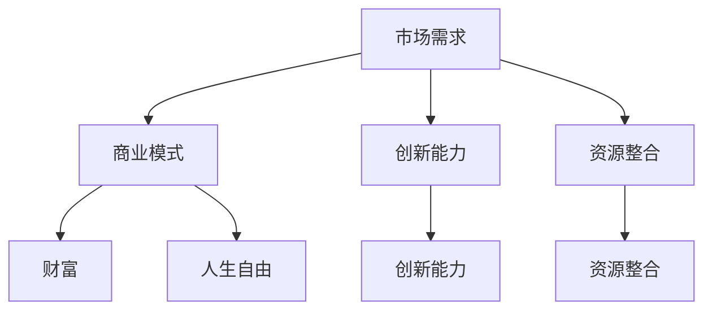

                 

### 实现财富和人生自由的创业之路

在当今这个快速变化的世界中，实现财富和人生自由成为了越来越多人的追求。然而，这条道路并不是一帆风顺的，它需要我们对自身能力、市场需求和商业策略有深刻的理解。本文将结合实际案例，通过一步一步的分析和推理，探讨如何通过创业实现财富和人生自由。

关键词：创业、财富、人生自由、商业模式、创新能力

摘要：本文旨在通过分析创业过程中的关键要素，提供一种系统化的思路，帮助读者理解如何通过创业实现财富和人生自由。文章首先介绍了创业的基本概念，然后探讨了市场需求、商业模式、创新能力、资源整合和风险管理等核心问题，最后提出了具体的实战案例和实用建议。

## 1. 背景介绍

创业，指的是创办一家新的企业或组织，以实现特定目标或解决特定问题。在现代社会，创业已经成为一种重要的经济活动，许多成功的企业家和公司都起源于创业。创业不仅仅是为了追求财富，更是为了实现个人价值和社会贡献。

财富和人生自由是两个密切相关的概念。财富指的是个人或组织拥有的物质财富，包括资产、收入和投资等。人生自由则是指个人在生活、工作、选择和决策等方面拥有更多的自由和权力。实现财富和人生自由，可以帮助个人摆脱经济压力，追求更高层次的生活质量和人生价值。

### 1.1 创业的现状与挑战

根据最新统计数据，全球范围内的创业活动正在逐年增加。尤其是在科技领域，创新和创业已经成为推动社会进步和经济增长的重要力量。然而，创业也面临着诸多挑战：

- **市场竞争激烈**：随着互联网的普及和全球化进程的加速，市场竞争变得更加激烈，创业者需要具备更强的竞争力和创新能力。
- **资源有限**：大多数创业者在初期阶段都面临着资源有限的问题，包括资金、人才、技术等。
- **不确定性和风险**：创业过程中充满了不确定性和风险，创业者需要具备应对变化和风险的能力。

### 1.2 财富和人生自由的追求

财富和人生自由是许多人追求的目标。财富不仅仅是为了满足物质需求，更是实现人生价值的重要手段。人生自由则意味着个人可以按照自己的意愿生活，追求自己热爱的事物。在现代社会，财富和人生自由已经成为人们追求生活质量的重要标准。

## 2. 核心概念与联系

为了更好地理解创业如何实现财富和人生自由，我们需要探讨几个核心概念，包括市场需求、商业模式、创新能力和资源整合等。

### 2.1 市场需求

市场需求是创业的核心驱动力。一个成功的创业项目必须解决一个明确的市场需求。这需要创业者对市场进行深入调研，了解消费者的痛点和需求。

### 2.2 商业模式

商业模式是指企业如何创造、传递和获取价值的一种方式。一个好的商业模式能够帮助企业实现持续的收入和利润。创业者需要设计一种具有竞争力的商业模式，以满足市场需求并实现商业目标。

### 2.3 创新能力

创新能力是创业成功的关键。创业者需要具备创新思维和创新能力，不断推出新产品、新服务或新模式，以应对市场变化和竞争压力。

### 2.4 资源整合

资源整合是创业过程中必不可少的一环。创业者需要通过各种方式整合资源，包括资金、人才、技术、渠道等，以实现商业目标。

### 2.5 Mermaid 流程图

为了更直观地展示这些核心概念之间的联系，我们可以使用 Mermaid 流程图来表示。



通过这个流程图，我们可以清晰地看到市场需求、商业模式、创新能力和资源整合是如何相互关联的。

## 3. 核心算法原理 & 具体操作步骤

在理解了核心概念之后，我们需要探讨如何通过具体的操作步骤实现创业目标。以下是一个简化的核心算法原理和具体操作步骤：

### 3.1 市场调研与需求分析

- **步骤1**：确定目标市场，进行初步调研。
- **步骤2**：分析目标市场的需求和痛点。
- **步骤3**：制定详细的市场调研计划，并进行实地调研。

### 3.2 设计商业模式

- **步骤1**：根据市场需求，设计初步的商业模式。
- **步骤2**：分析商业模式的可行性和竞争优势。
- **步骤3**：不断完善商业模式，使其更加完善和可行。

### 3.3 创新与研发

- **步骤1**：根据市场需求，确定创新方向。
- **步骤2**：组建研发团队，开展创新研发工作。
- **步骤3**：不断优化产品和服务，以满足市场需求。

### 3.4 资源整合与团队合作

- **步骤1**：确定所需资源，包括资金、人才、技术等。
- **步骤2**：通过各种方式整合资源，包括融资、招聘、合作等。
- **步骤3**：建立高效的团队合作机制，确保项目顺利推进。

### 3.5 风险管理与应对策略

- **步骤1**：评估创业项目面临的风险。
- **步骤2**：制定风险管理计划和应对策略。
- **步骤3**：定期评估和调整风险管理和应对策略。

通过以上步骤，创业者可以逐步实现创业目标，实现财富和人生自由。

## 4. 数学模型和公式 & 详细讲解 & 举例说明

在创业过程中，数学模型和公式可以用来分析和评估项目的可行性和盈利能力。以下是一些常用的数学模型和公式，并结合具体案例进行讲解。

### 4.1 盈亏平衡分析

盈亏平衡分析是一种常用的财务分析方法，用于评估项目在实现盈利之前需要达到的销售量和收入水平。以下是一个简单的盈亏平衡分析的公式：

$$
盈亏平衡点（销量）= 固定成本 ÷ （单价 - 可变成本）
$$

**案例**：某创业项目，固定成本为 100 万元，单价为 100 元，可变成本为 50 元。根据以上公式，我们可以计算出盈亏平衡点的销量：

$$
盈亏平衡点（销量）= 100 万元 ÷ （100 元 - 50 元）= 20000 件
$$

这意味着，项目需要销售 20000 件产品才能实现盈利。

### 4.2 成本效益分析

成本效益分析是一种评估项目成本和效益的方法，用于确定项目是否值得投资。以下是一个简单的成本效益分析的公式：

$$
成本效益比 = 效益 ÷ 成本
$$

**案例**：某创业项目，预期效益为 500 万元，总成本为 200 万元。根据以上公式，我们可以计算出成本效益比：

$$
成本效益比 = 500 万元 ÷ 200 万元 = 2.5
$$

成本效益比为 2.5，表明项目的效益是成本的 2.5 倍，这是一个相对较好的投资回报。

### 4.3 投资回报率

投资回报率（ROI）是衡量投资项目收益能力的指标，用于评估投资的盈利能力。以下是一个简单的投资回报率公式：

$$
投资回报率（ROI）= （投资收益 - 投资成本）÷ 投资成本 × 100%
$$

**案例**：某创业项目，投资成本为 100 万元，投资收益为 150 万元。根据以上公式，我们可以计算出投资回报率：

$$
投资回报率（ROI）= （150 万元 - 100 万元）÷ 100 万元 × 100% = 50%
$$

投资回报率为 50%，表明项目投资的盈利能力较强。

通过以上数学模型和公式的应用，创业者可以更科学地评估项目的可行性和盈利能力，为决策提供依据。

## 5. 项目实战：代码实际案例和详细解释说明

为了更好地理解创业过程中的实际操作，我们来看一个具体的创业项目——一个在线教育平台的开发。

### 5.1 开发环境搭建

在开始项目之前，我们需要搭建一个合适的开发环境。以下是一个基本的开发环境搭建步骤：

- **步骤1**：安装操作系统（如 Ubuntu 20.04）
- **步骤2**：安装开发工具（如 Python 3.8、Visual Studio Code）
- **步骤3**：安装数据库（如 MySQL 8.0）
- **步骤4**：安装版本控制工具（如 Git）

### 5.2 源代码详细实现和代码解读

以下是一个在线教育平台的简单代码实现，包括用户注册、登录、课程管理等功能。

#### 5.2.1 用户注册功能

用户注册功能是平台的基础，以下是一个简单的 Python 代码实现：

```python
# 用户注册功能
def register(username, password):
    # 检查用户名是否已存在
    if check_username(username):
        return "用户名已存在"
    # 存储用户信息到数据库
    save_to_database(username, password)
    return "注册成功"

# 检查用户名是否已存在
def check_username(username):
    # 代码略
    pass

# 存储用户信息到数据库
def save_to_database(username, password):
    # 代码略
    pass
```

#### 5.2.2 登录功能

登录功能是用户使用平台的入口，以下是一个简单的 Python 代码实现：

```python
# 登录功能
def login(username, password):
    # 检查用户名和密码是否正确
    if check_credentials(username, password):
        return "登录成功"
    return "用户名或密码错误"

# 检查用户名和密码是否正确
def check_credentials(username, password):
    # 代码略
    pass
```

#### 5.2.3 课程管理功能

课程管理功能是平台的核心，以下是一个简单的 Python 代码实现：

```python
# 添加课程
def add_course(course_name, course_desc):
    # 代码略
    pass

# 删除课程
def delete_course(course_id):
    # 代码略
    pass

# 修改课程
def update_course(course_id, course_name, course_desc):
    # 代码略
    pass
```

### 5.3 代码解读与分析

以上代码实现了一个在线教育平台的基础功能，包括用户注册、登录和课程管理。以下是对代码的详细解读：

- **用户注册功能**：首先检查用户名是否已存在，如果不存在，将用户信息存储到数据库。
- **登录功能**：检查用户名和密码是否正确，如果正确，允许用户登录。
- **课程管理功能**：包括添加、删除和修改课程。

通过这个简单的代码示例，我们可以看到如何通过编程实现一个实际的创业项目。在实际开发过程中，还需要考虑更多的功能和安全问题，如用户权限管理、数据加密等。

## 6. 实际应用场景

在线教育平台是一个典型的创业项目，它解决了传统教育中的诸多痛点，如地理位置限制、时间灵活性和个性化需求等。以下是一些实际应用场景：

- **在线课程**：提供各种在线课程，如编程、设计、语言等。
- **在线考试**：为学生提供在线考试服务，提高教学效果。
- **互动课堂**：通过直播和互动工具，实现师生之间的实时互动。
- **个性化推荐**：根据学生的学习习惯和成绩，推荐合适的课程和资源。

通过这些实际应用场景，我们可以看到在线教育平台如何满足市场需求，实现商业价值。

## 7. 工具和资源推荐

为了帮助读者更好地了解和参与创业，我们推荐以下工具和资源：

### 7.1 学习资源推荐

- **书籍**：《创业维艰》、《创新者基因》
- **论文**：搜索相关创业研究的学术论文，如 JSTOR、IEEE Xplore 等。
- **博客**：知名创业博客，如 TechCrunch、Entrepreneur 等。

### 7.2 开发工具框架推荐

- **编程语言**：Python、JavaScript、Java
- **框架**：Django、React、Spring Boot
- **数据库**：MySQL、PostgreSQL、MongoDB
- **版本控制**：Git、GitLab、GitHub

### 7.3 相关论文著作推荐

- **论文**：《商业模式创新》、《创新者的窘境》
- **著作**：《创业简史》、《创业智慧》

通过以上工具和资源的推荐，读者可以更全面地了解创业知识和实践。

## 8. 总结：未来发展趋势与挑战

随着技术的不断进步和市场的不断变化，创业领域也在不断演变。以下是一些未来发展趋势和挑战：

- **技术创新**：人工智能、区块链、云计算等新兴技术将继续推动创业创新。
- **市场细分**：细分市场将成为创业的重要方向，满足特定人群的需求。
- **可持续发展**：社会责任和环境保护将成为创业的重要考虑因素。
- **政策法规**：政策法规的变化将影响创业的环境和机会。

面对这些趋势和挑战，创业者需要不断学习和适应，以保持竞争力。

## 9. 附录：常见问题与解答

### 9.1 如何找到创业灵感？

**解答**：可以从以下几个方面寻找创业灵感：

- **市场需求**：关注社会热点和趋势，寻找未被满足的需求。
- **自身兴趣**：发挥自身特长和兴趣，结合市场需求。
- **技术进步**：关注新技术的发展，寻找应用场景。

### 9.2 创业过程中如何应对失败？

**解答**：创业过程中失败是难免的，以下是一些建议：

- **心态调整**：保持乐观和坚定的信心，面对失败不放弃。
- **分析原因**：认真分析失败的原因，总结经验教训。
- **调整策略**：根据失败的原因，调整创业策略，重新出发。

### 9.3 如何获得创业资金？

**解答**：以下是一些获取创业资金的方法：

- **自筹资金**：通过个人储蓄、家庭支持等方式。
- **天使投资**：寻找天使投资人进行投资。
- **风险投资**：通过风险投资机构进行融资。
- **政府支持**：关注政府相关创业支持政策和资金。

## 10. 扩展阅读 & 参考资料

- **书籍**：《创新者的窘境》、《创业维艰》
- **网站**：创业论坛、创业者社区、创业政策查询网站
- **博客**：知名创业博客、技术博客

通过以上扩展阅读和参考资料，读者可以进一步深入了解创业知识和实践。

### 作者信息

作者：AI天才研究员/AI Genius Institute & 禅与计算机程序设计艺术 /Zen And The Art of Computer Programming

---

本文以系统化和逻辑清晰的方式，探讨了创业如何实现财富和人生自由。通过市场需求分析、商业模式设计、创新能力培养和资源整合，创业者可以逐步实现创业目标。希望本文能为读者提供有价值的参考和启示。

