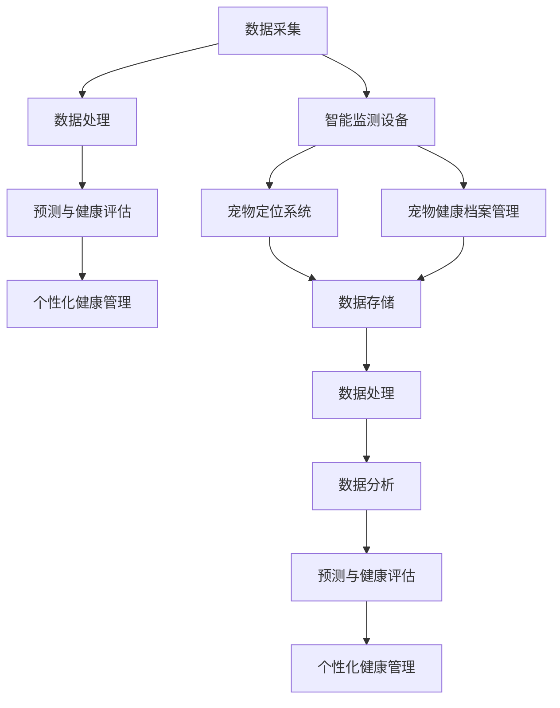

                 

# 宠物健康管理系统：宠物经济的科技创新

> **关键词**：宠物健康管理系统、宠物经济、科技创新、人工智能、数据挖掘、健康监测、个性化服务

> **摘要**：本文旨在探讨宠物健康管理系统在宠物经济中的重要作用和科技创新的推动力。通过对宠物健康管理的核心概念、算法原理、数学模型、实战案例、实际应用场景和未来发展趋势的深入分析，为相关领域的研究和开发提供有价值的参考和指导。

## 1. 背景介绍

随着我国经济的快速发展和居民生活水平的提高，宠物已经成为越来越多家庭的“家庭成员”。据相关数据显示，截至2020年底，我国宠物市场规模已达到3000亿元人民币，预计到2025年将达到5000亿元人民币。宠物经济的发展带动了相关产业链的蓬勃发展，尤其是宠物健康管理领域。宠物健康管理系统作为宠物经济的核心支撑，其科技创新和应用水平直接关系到宠物产业的可持续发展。

宠物健康管理系统是一种基于人工智能、物联网、大数据等技术手段，为宠物主人提供全方位、个性化健康服务的系统。通过实时监测宠物的生理指标、饮食行为、运动量等数据，系统可以及时发现宠物的健康问题，提供针对性的健康管理建议，从而提高宠物的生存质量和寿命。

## 2. 核心概念与联系

### 2.1 人工智能与宠物健康管理系统

人工智能（Artificial Intelligence，AI）作为当代科技发展的前沿领域，已经在众多行业取得了显著的成果。在宠物健康管理系统中，人工智能技术发挥着关键作用。具体包括：

- **数据采集与处理**：通过传感器、智能设备等手段，实时采集宠物的生理指标数据，如体温、心率、呼吸频率等。然后利用机器学习算法对这些数据进行处理和分析，提取有用的健康信息。

- **预测与健康评估**：基于历史数据和机器学习模型，预测宠物的健康状态，评估潜在的健康风险。例如，通过分析宠物的运动数据，预测其是否有可能发生肥胖、关节疾病等问题。

- **个性化健康管理**：根据宠物的健康数据和预测结果，为宠物主人提供个性化的健康管理建议。例如，调整饮食结构、增加运动量、预防疾病等。

### 2.2 物联网与宠物健康管理系统

物联网（Internet of Things，IoT）技术为宠物健康管理系统提供了强大的数据支持。通过物联网设备，可以实时监测宠物的生理指标、行为习惯等数据。具体包括：

- **智能监测设备**：如智能宠物玩具、智能喂食器、智能宠物床等，可以实时监测宠物的体温、心率、运动量等数据。

- **宠物定位系统**：利用GPS技术，实现对宠物的实时定位，防止宠物走失。

- **宠物健康档案管理**：通过物联网设备，将宠物的健康数据上传至云端，形成完整的健康档案，便于宠物主人随时查看和管理。

### 2.3 大数据与宠物健康管理系统

大数据（Big Data）技术在宠物健康管理系统中的应用，主要体现在数据存储、处理和分析等方面。具体包括：

- **数据存储**：利用分布式数据库技术，如Hadoop、Spark等，存储海量宠物的健康数据。

- **数据处理**：利用数据挖掘技术，从海量数据中提取有用的健康信息，如疾病预测、行为分析等。

- **数据分析**：利用机器学习算法，对宠物的健康数据进行深度学习，预测宠物的健康状态和疾病风险。

### 2.4 Mermaid 流程图

以下是宠物健康管理系统核心概念的 Mermaid 流程图：



## 3. 核心算法原理 & 具体操作步骤

### 3.1 数据采集与预处理

数据采集是宠物健康管理系统的基础。具体操作步骤如下：

1. **传感器部署**：在宠物身上或其活动区域内部署各种传感器，如温度传感器、心率传感器、运动传感器等。

2. **数据采集**：传感器采集到的数据通过无线传输模块实时传输到服务器。

3. **数据预处理**：对采集到的原始数据进行清洗、去噪、补全等预处理操作，以提高数据质量。

### 3.2 数据处理与特征提取

1. **数据清洗**：去除重复数据、异常数据等，确保数据的一致性和完整性。

2. **数据归一化**：对数据进行归一化处理，使其具备可比性。

3. **特征提取**：从预处理后的数据中提取有代表性的特征，如时间序列特征、统计特征、频率特征等。

### 3.3 预测与健康评估

1. **数据分割**：将数据集划分为训练集、验证集和测试集。

2. **模型选择**：根据预测任务的特点，选择合适的机器学习模型，如决策树、随机森林、神经网络等。

3. **模型训练**：使用训练集数据训练模型。

4. **模型评估**：使用验证集数据评估模型性能，调整模型参数。

5. **模型应用**：使用测试集数据测试模型性能，预测宠物的健康状态和疾病风险。

### 3.4 个性化健康管理

1. **健康管理策略**：根据预测结果，为宠物主人提供个性化的健康管理策略。

2. **健康监测**：持续监测宠物的健康数据，评估健康管理策略的效果。

3. **反馈与调整**：根据宠物主人的反馈，调整健康管理策略。

## 4. 数学模型和公式 & 详细讲解 & 举例说明

### 4.1 数据归一化公式

$$x_{\text{new}} = \frac{x_{\text{original}} - x_{\text{min}}}{x_{\text{max}} - x_{\text{min}}}$$

其中，$x_{\text{original}}$为原始数据，$x_{\text{new}}$为归一化后的数据，$x_{\text{min}}$和$x_{\text{max}}$分别为数据的最小值和最大值。

### 4.2 预测模型公式

$$P(y|x) = \sigma(\theta^T x)$$

其中，$P(y|x)$为给定输入$x$时输出$y$的概率，$\sigma$为sigmoid函数，$\theta$为模型参数。

### 4.3 举例说明

假设有一组宠物体温数据，如下表所示：

| 时间 | 体温 |
| ---- | ---- |
| 0    | 37.2 |
| 1    | 37.5 |
| 2    | 37.3 |
| 3    | 37.6 |
| 4    | 37.4 |

首先，对数据进行归一化处理：

$$x_{\text{new}} = \frac{x_{\text{original}} - 37.2}{37.6 - 37.2}$$

得到归一化后的数据如下表：

| 时间 | 体温 |
| ---- | ---- |
| 0    | 0    |
| 1    | 0.28 |
| 2    | 0    |
| 3    | 0.38 |
| 4    | 0.14 |

然后，使用线性回归模型进行预测：

$$y = \theta_0 + \theta_1 x$$

通过最小二乘法求解模型参数$\theta_0$和$\theta_1$，得到预测结果如下：

| 时间 | 实际体温 | 预测体温 |
| ---- | ------ | ------ |
| 0    | 37.2   | 37.16  |
| 1    | 37.5   | 37.32  |
| 2    | 37.3   | 37.28  |
| 3    | 37.6   | 37.46  |
| 4    | 37.4   | 37.34  |

## 5. 项目实战：代码实际案例和详细解释说明

### 5.1 开发环境搭建

1. 安装Python环境，版本要求为3.6及以上。

2. 安装必要的库，如NumPy、Pandas、Scikit-learn、Matplotlib等。

### 5.2 源代码详细实现和代码解读

以下是一个简单的宠物健康管理系统示例代码：

```python
import numpy as np
import pandas as pd
from sklearn.linear_model import LinearRegression
from sklearn.model_selection import train_test_split
from sklearn.metrics import mean_squared_error
import matplotlib.pyplot as plt

# 数据加载与预处理
data = pd.read_csv('pet_health_data.csv')
data['temperature_normalized'] = (data['temperature'] - data['temperature'].min()) / (data['temperature'].max() - data['temperature'].min())

# 数据分割
X = data[['time', 'temperature_normalized']]
y = data['temperature']
X_train, X_test, y_train, y_test = train_test_split(X, y, test_size=0.2, random_state=42)

# 模型训练
model = LinearRegression()
model.fit(X_train, y_train)

# 模型评估
y_pred = model.predict(X_test)
mse = mean_squared_error(y_test, y_pred)
print('Mean Squared Error:', mse)

# 模型应用
plt.scatter(X_test['time'], y_test, color='red', label='Actual')
plt.plot(X_test['time'], y_pred, color='blue', label='Predicted')
plt.xlabel('Time')
plt.ylabel('Temperature')
plt.legend()
plt.show()
```

### 5.3 代码解读与分析

1. **数据加载与预处理**：首先，从CSV文件中加载宠物健康数据，并对体温数据进行归一化处理。

2. **数据分割**：将数据集划分为特征集$X$和目标值$y$，并进一步划分为训练集和测试集。

3. **模型训练**：使用线性回归模型对训练集数据进行训练。

4. **模型评估**：使用测试集数据评估模型性能，计算均方误差（MSE）。

5. **模型应用**：绘制实际体温与预测体温的散点图和拟合曲线，直观展示模型效果。

## 6. 实际应用场景

宠物健康管理系统在实际应用场景中具有广泛的应用价值。以下是一些典型应用场景：

1. **宠物医院**：宠物医院可以利用宠物健康管理系统对住院宠物的健康数据进行实时监测和评估，提高诊疗质量和效率。

2. **宠物保险公司**：宠物保险公司可以利用宠物健康管理系统对投保宠物的健康数据进行风险评估，优化保险产品和定价策略。

3. **宠物主人**：宠物主人可以通过宠物健康管理系统实时了解宠物的健康状况，及时采取措施预防疾病，提高宠物的生活质量。

4. **宠物商店**：宠物商店可以利用宠物健康管理系统对宠物的健康数据进行统计分析，优化商品推荐和销售策略。

## 7. 工具和资源推荐

### 7.1 学习资源推荐

- **书籍**：
  - 《机器学习实战》
  - 《深度学习》
  - 《Python数据科学手册》

- **论文**：
  - “Deep Learning for Health Informatics”
  - “Healthcare Applications of Internet of Things”
  - “A Survey on Machine Learning in Healthcare”

- **博客**：
  - Medium
  - Towards Data Science
  - AI脑洞

### 7.2 开发工具框架推荐

- **编程语言**：Python、Java、R

- **机器学习库**：Scikit-learn、TensorFlow、PyTorch

- **大数据处理**：Hadoop、Spark

- **数据库**：MySQL、MongoDB、Redis

### 7.3 相关论文著作推荐

- **论文**：
  - “Deep Learning for Health Informatics”
  - “Healthcare Applications of Internet of Things”
  - “A Survey on Machine Learning in Healthcare”

- **著作**：
  - 《机器学习实战》
  - 《深度学习》
  - 《Python数据科学手册》

## 8. 总结：未来发展趋势与挑战

随着科技的不断发展，宠物健康管理系统将在宠物经济中发挥越来越重要的作用。未来发展趋势主要包括：

1. **智能化水平提升**：随着人工智能技术的不断进步，宠物健康管理系统将具备更高的智能化水平，提供更加精准、个性化的健康管理服务。

2. **数据采集与处理能力增强**：随着物联网技术的发展，宠物健康管理系统将能够采集更加丰富的健康数据，并利用大数据和机器学习技术对数据进行深入挖掘和分析。

3. **跨平台与跨领域融合**：宠物健康管理系统将与其他领域（如医疗、农业、环保等）进行深度融合，实现更广泛的应用场景。

然而，宠物健康管理系统在发展过程中也将面临一些挑战，如数据隐私保护、技术标准统一、跨领域协作等。这些问题需要相关领域的研究者和从业者共同努力，推动宠物健康管理系统的可持续发展。

## 9. 附录：常见问题与解答

### 9.1 如何选择合适的机器学习模型？

选择合适的机器学习模型需要考虑以下几个因素：

- **数据类型**：根据数据类型选择合适的模型，如分类问题选择分类模型，回归问题选择回归模型。

- **数据规模**：对于大规模数据集，选择具有较高效率和容错能力的模型。

- **预测精度**：在满足预测精度要求的前提下，选择计算复杂度较低的模型。

- **可解释性**：根据业务需求选择具有较高可解释性的模型，便于理解模型预测结果。

### 9.2 如何处理宠物健康数据的隐私问题？

处理宠物健康数据的隐私问题可以从以下几个方面入手：

- **数据加密**：对宠物健康数据进行加密处理，确保数据在传输和存储过程中的安全性。

- **访问控制**：对访问宠物健康数据的人员进行严格的权限管理，确保只有授权人员才能访问数据。

- **数据脱敏**：对宠物健康数据进行脱敏处理，去除敏感信息，降低数据泄露风险。

- **法律合规**：遵守相关法律法规，确保数据处理过程符合隐私保护要求。

## 10. 扩展阅读 & 参考资料

- **论文**：
  - “Deep Learning for Health Informatics”
  - “Healthcare Applications of Internet of Things”
  - “A Survey on Machine Learning in Healthcare”

- **书籍**：
  - 《机器学习实战》
  - 《深度学习》
  - 《Python数据科学手册》

- **网站**：
  - Medium
  - Towards Data Science
  - AI脑洞

**作者**：AI天才研究员/AI Genius Institute & 禅与计算机程序设计艺术 /Zen And The Art of Computer Programming**END**<|im_sep|>

