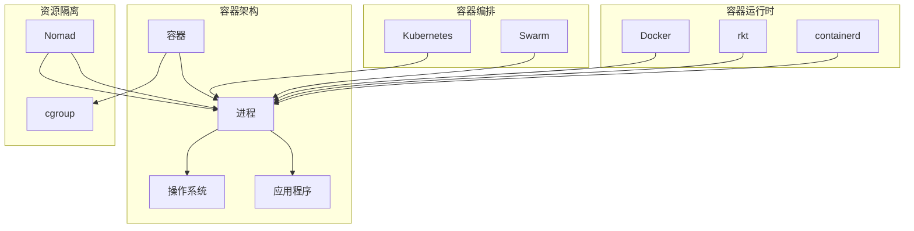

                 

### 背景介绍

容器技术作为现代软件开发和运维领域的重要工具，已经在过去数年内迅速崛起，并成为推动软件开发效率提升的关键因素之一。容器的定义非常简单：它是一个轻量级、可移植的、自给自足的运行时环境，可以封装应用程序及其依赖项。这一技术解决了长期困扰开发者和运维人员的环境一致性问题，使得应用程序能够在不同的开发、测试和生产环境中无缝运行。

容器技术的起源可以追溯到2000年代初期，当时Linux容器（LXC）的出现标志着容器技术进入了一个新的阶段。随后，Docker的兴起进一步推动了容器技术的发展，成为了容器技术的代表。Docker提供了一个简单的用户界面和一套完整的工具链，使得容器从概念走向了实际应用。

容器的核心优势主要体现在以下几个方面：

1. **环境一致性**：容器封装了应用程序及其运行环境，确保了不同环境之间的运行一致性，从而避免了“它在我机器上运行得好好的”的问题。
2. **资源效率**：容器利用操作系统层面的虚拟化技术，与传统的虚拟机相比，容器启动速度快、占用资源少，可以在同一台物理机上运行更多的应用程序。
3. **可移植性**：容器是自给自足的，不需要依赖宿主机的具体环境，可以轻松地在不同的操作系统和硬件平台上移植。
4. **敏捷开发**：容器技术使得持续集成和持续部署（CI/CD）成为可能，大大缩短了软件开发和部署的周期。

随着容器技术的普及，它已经在许多实际应用场景中得到了广泛的应用，包括Web应用程序、微服务架构、大数据处理、云计算和边缘计算等。容器不仅改变了软件开发的方式，还推动了整个IT基础设施的变革。

本文将深入探讨容器的原理、核心概念及其应用，通过详细的代码实例讲解，帮助读者全面理解容器技术的工作机制。我们将从基础概念开始，逐步深入到容器的高级特性，最终通过实际的项目实战案例，让读者能够将所学知识应用到实际的开发工作中。

在接下来的章节中，我们将首先介绍容器的基本概念和核心原理，并通过Mermaid流程图展示容器的架构。随后，我们将详细讲解容器的主要组成部分和操作步骤，以及如何使用容器进行应用部署。文章的最后，我们将探讨容器的实际应用场景，并提供一系列的学习资源和开发工具推荐，帮助读者深入学习和实践容器技术。

## 2. 核心概念与联系

要深入理解容器技术，首先需要了解其核心概念和它们之间的联系。在这一节中，我们将介绍容器的基本概念，包括容器与虚拟机、容器运行时、容器编排工具等，并通过一个Mermaid流程图展示这些概念之间的联系。

### 容器与虚拟机

容器与虚拟机（VM）是两种不同的虚拟化技术。虚拟机通过模拟硬件环境，为每个虚拟机提供一个独立的操作系统实例，从而实现资源隔离。而容器则利用操作系统的用户空间，通过命名空间（Namespace）和内核虚拟化技术（如cgroup）来实现资源隔离，但并不提供完整的操作系统实例。

- **虚拟机**：
  - 资源消耗高：每个虚拟机都需要运行一个完整的操作系统，导致资源利用率低。
  - 启动时间长：虚拟机的启动需要模拟硬件初始化，因此启动时间长。
  - 孤立性强：虚拟机之间通过硬件抽象层（Hypervisor）进行隔离，安全性高。

- **容器**：
  - 资源消耗低：容器共享宿主机的操作系统内核，因此资源利用率高。
  - 启动速度快：容器直接运行在宿主机的用户空间，启动速度快。
  - 孤立性适中：容器通过命名空间和cgroup实现资源隔离，但与其他容器共享宿主机的内核。

### 容器运行时

容器运行时（Container Runtime）是负责管理容器生命周期和资源分配的核心组件。常见的容器运行时包括Docker、rkt和containerd。Docker是最流行的容器运行时，其通过一系列工具（如dockerd、docker-compose等）提供容器创建、启动、管理和运维功能。

- **Docker**：
  - Docker Engine：负责容器创建和管理。
  - Docker Compose：用于定义和编排多容器应用程序。
  - Docker Desktop：简化容器开发的图形界面工具。

- **rkt**：
  - rkt是CoreOS开发的容器运行时，注重安全性和稳定性。

- **containerd**：
  - containerd是容器运行时的标准，被多个开源项目和云平台采用。

### 容器编排工具

容器编排工具用于管理多个容器的部署、扩展和服务发现。常见的容器编排工具包括Kubernetes、Swarm和Nomad。Kubernetes是当前最流行的容器编排工具，它提供了一个强大的平台，用于自动化容器的部署、扩展和管理。

- **Kubernetes**：
  - 控制平面（Control Plane）：负责集群的调度和管理。
  - 工作节点（Node）：运行容器的主机。
  - Pod：最小的部署单元，可以包含一个或多个容器。

- **Swarm**：
  - Swarm是Docker内置的容器编排工具，通过简单的API接口提供容器编排功能。

- **Nomad**：
  - Nomad是HashiCorp开发的容器编排工具，注重灵活性和易用性。

### 容器架构

为了更好地理解容器的工作原理，我们可以使用Mermaid流程图来展示容器的架构。



在这个流程图中，容器（C）是应用程序（A）的运行环境，通过命名空间（N）和cgroup（Cg）实现资源隔离。容器编排工具（如Kubernetes、Swarm和Nomad）用于管理容器的部署和生命周期。容器运行时（如Docker、rkt和containerd）负责容器的创建和管理。

通过上述核心概念和架构的介绍，我们可以更好地理解容器技术的工作原理和它在现代软件开发中的应用。接下来，我们将详细探讨容器的主要组成部分和操作步骤，帮助读者深入了解容器技术的实际应用。

## 3. 核心算法原理 & 具体操作步骤

在了解了容器的基本概念和架构之后，接下来我们将深入探讨容器的核心算法原理和具体的操作步骤。这一部分将包括容器创建、容器启动和容器管理的具体流程。

### 容器创建

容器创建是容器生命周期的第一步，通常通过容器运行时完成。以Docker为例，容器创建的过程大致如下：

1. **Dockerfile**：首先，我们需要编写一个Dockerfile，这是一个包含一系列命令的文本文件，用于定义如何构建容器镜像。Dockerfile的基本结构如下：

    ```Dockerfile
    # 使用官方的Python基础镜像
    FROM python:3.8-slim

    # 设置工作目录
    WORKDIR /app

    # 复制应用程序代码
    COPY . .

    # 安装依赖项
    RUN pip install -r requirements.txt

    # 暴露端口
    EXPOSE 8000

    # 运行应用程序
    CMD ["python", "app.py"]
    ```

2. **构建镜像**：使用Docker命令构建容器镜像。例如：

    ```bash
    docker build -t myapp .
    ```

    这条命令将在当前目录下构建一个名为`myapp`的容器镜像。

3. **运行容器**：构建完成后，我们可以使用以下命令运行容器：

    ```bash
    docker run -d -p 8080:8000 myapp
    ```

    这条命令将在后台运行容器，并将容器的8000端口映射到宿主机的8080端口。

### 容器启动

容器启动是容器生命周期的关键步骤，包括加载容器镜像、配置网络和资源限制等。以Docker为例，容器启动的过程如下：

1. **加载镜像**：Docker会查找本地镜像仓库，如果找不到指定的镜像，则会从Docker Hub等远程仓库下载。

2. **创建命名空间**：容器启动时，Docker会创建一系列命名空间，包括PID命名空间、NET命名空间、USER命名空间等，以实现进程和资源的隔离。

3. **配置网络**：Docker默认为容器分配一个独立的网络命名空间，但也可以使用桥接网络模式或宿主网络模式。

4. **设置资源限制**：Docker允许通过cgroup配置容器的资源限制，如CPU份额、内存限制等。

5. **执行启动命令**：容器启动时，Docker会执行Dockerfile中定义的CMD命令，例如启动Python应用程序。

### 容器管理

容器启动后，我们需要进行容器的管理，包括容器状态的监控、日志查看、容器资源的调整等。Docker提供了一系列命令来方便管理容器：

- **查看容器状态**：

    ```bash
    docker ps
    ```

    这条命令将列出当前所有运行的容器。

- **查看容器日志**：

    ```bash
    docker logs <容器ID或名称>
    ```

    这条命令将显示指定容器的日志输出。

- **调整容器资源**：

    ```bash
    docker update --cpu-shares 5000 <容器ID或名称>
    docker update --memory 2g <容器ID或名称>
    ```

    这两条命令分别用于调整容器的CPU份额和内存限制。

- **停止和删除容器**：

    ```bash
    docker stop <容器ID或名称>
    docker rm <容器ID或名称>
    ```

    这两条命令分别用于停止和删除指定容器。

### 容器编排

在实际应用中，容器往往不是单独运行的，而是需要与其他容器协同工作。容器编排工具（如Kubernetes）提供了更高级的管理功能，包括容器集群管理、服务发现、负载均衡等。以下是一个简单的Kubernetes部署示例：

1. **编写部署配置文件**：

    ```yaml
    apiVersion: apps/v1
    kind: Deployment
    metadata:
      name: myapp
    spec:
      replicas: 3
      selector:
        matchLabels:
          app: myapp
      template:
        metadata:
          labels:
            app: myapp
        spec:
          containers:
          - name: myapp
            image: myapp:latest
            ports:
            - containerPort: 8000
    ```

2. **部署应用程序**：

    ```bash
    kubectl apply -f deployment.yaml
    ```

    这条命令将部署指定的应用程序，并创建三个容器副本。

3. **查看部署状态**：

    ```bash
    kubectl get pods
    ```

    这条命令将显示当前所有Pod的状态。

通过上述步骤，我们可以创建、启动和管理容器，以及通过容器编排工具实现复杂的应用部署。在下一节中，我们将深入探讨容器的数学模型和公式，进一步理解容器技术的原理和实现。

## 4. 数学模型和公式 & 详细讲解 & 举例说明

在容器技术的实现过程中，数学模型和公式起到了至关重要的作用。这些模型和公式帮助我们更好地理解容器的资源分配、调度策略以及性能优化。在本节中，我们将详细讲解几个关键的数学模型和公式，并通过实际案例进行说明。

### 4.1 资源分配模型

容器资源分配是容器管理的关键问题之一。为了确保资源的高效利用，我们需要一种有效的资源分配策略。常用的资源分配模型包括固定分配策略、动态分配策略和混合分配策略。

1. **固定分配策略**：

   固定分配策略是一种简单的资源分配方法，它为每个容器分配固定的资源份额。这种策略的优势是简单易实现，但可能无法适应动态负载变化。

   数学公式：  
   \( C_i = R_i \times \alpha \)

   其中，\( C_i \) 表示容器 \( i \) 的资源需求，\( R_i \) 表示容器的最大资源需求，\( \alpha \) 表示资源份额比例。

   举例说明：

   假设我们有两个容器A和B，最大资源需求分别为2 CPU和4 CPU，资源份额比例分别为0.5和0.5。那么，每个容器的固定资源分配为：

   \( C_A = 2 \times 0.5 = 1 \) CPU  
   \( C_B = 4 \times 0.5 = 2 \) CPU

2. **动态分配策略**：

   动态分配策略根据容器的实际负载动态调整资源分配。这种策略可以更好地适应负载变化，但实现较为复杂。

   数学公式：  
   \( C_i = F_i \times P_i \)

   其中，\( C_i \) 表示容器 \( i \) 的实际资源需求，\( F_i \) 表示容器的负载函数，\( P_i \) 表示容器的性能指标。

   举例说明：

   假设我们有一个容器A，其负载函数为 \( F_A(t) = 1 + \sin(t) \)，性能指标为2。那么，容器A在任意时间点 \( t \) 的资源需求为：

   \( C_A(t) = (1 + \sin(t)) \times 2 \)

### 4.2 调度策略

容器调度是容器管理中的另一个重要问题。调度策略决定了容器如何在宿主机上分配资源。常见的调度策略包括最短作业优先（SJF）、最短剩余时间优先（SRPT）和轮转调度（RR）等。

1. **最短作业优先（SJF）**：

   最短作业优先调度策略选择执行时间最短的作业。这种策略可以最大化系统的吞吐量。

   数学公式：  
   \( T_{\text{next}} = \min(T_i) \)

   其中，\( T_i \) 表示作业 \( i \) 的执行时间。

   举例说明：

   假设我们有三个作业A、B和C，执行时间分别为1、2和3。按照SJF调度策略，作业的执行顺序为A、B、C。

2. **最短剩余时间优先（SRPT）**：

   最短剩余时间优先调度策略选择剩余执行时间最短的作业。这种策略可以避免长时间作业的饥饿现象。

   数学公式：  
   \( R_{\text{next}} = \min(R_i) \)

   其中，\( R_i \) 表示作业 \( i \) 的剩余执行时间。

   举例说明：

   假设我们有三个作业A、B和C，当前剩余执行时间分别为1、3和5。按照SRPT调度策略，作业的执行顺序为A、B、C。

3. **轮转调度（RR）**：

   轮转调度策略将每个作业分配一个固定的时间片，并轮流执行。如果作业在时间片内未完成，则会暂时挂起，等待下一个时间片。

   数学公式：  
   \( T_{\text{time\_slice}} \)

   其中，\( T_{\text{time\_slice}} \) 表示时间片长度。

   举例说明：

   假设时间片长度为2，作业A、B和C的执行时间分别为1、2和3。按照RR调度策略，作业的执行顺序为A、B（暂时挂起）、C（暂时挂起）、A（暂时挂起）、B（暂时挂起）、C。

### 4.3 性能优化

性能优化是容器管理的重要目标之一。常见的性能优化方法包括负载均衡、缓存和压缩等。

1. **负载均衡**：

   负载均衡通过将请求分配到多个容器，实现负载均衡。常见的负载均衡算法包括最小连接数、最小响应时间和轮询等。

   数学公式：  
   \( L_i = w_i \times (1 - \frac{C_i}{\sum_{j=1}^{n} C_j}) \)

   其中，\( L_i \) 表示容器 \( i \) 的负载权重，\( w_i \) 表示容器 \( i \) 的权重，\( C_i \) 表示容器 \( i \) 的当前负载，\( n \) 表示容器总数。

   举例说明：

   假设有两个容器A和B，权重分别为0.6和0.4。当前容器A的负载为20，容器B的负载为10。按照负载均衡策略，容器A和B的负载权重分别为：

   \( L_A = 0.6 \times (1 - \frac{20}{20+10}) = 0.3 \)  
   \( L_B = 0.4 \times (1 - \frac{10}{20+10}) = 0.2 \)

2. **缓存**：

   缓存可以减少频繁的磁盘访问，提高系统性能。常见的缓存算法包括最近最少使用（LRU）和最少访问时间（LFU）等。

   数学公式：  
   \( \text{Cache\_hit} = \frac{\text{命中次数}}{\text{总访问次数}} \)

   举例说明：

   假设系统在一天内访问了100次，其中缓存命中80次。缓存命中率为：

   \( \text{Cache\_hit} = \frac{80}{100} = 0.8 \)

3. **压缩**：

   数据压缩可以减少数据传输的体积，提高网络传输效率。常见的压缩算法包括Huffman编码和LZ77等。

   数学公式：  
   \( \text{Compression\_ratio} = \frac{\text{原始数据大小}}{\text{压缩后数据大小}} \)

   举例说明：

   假设原始数据大小为10 KB，压缩后数据大小为5 KB。压缩比为：

   \( \text{Compression\_ratio} = \frac{10}{5} = 2 \)

通过上述数学模型和公式的讲解，我们可以更好地理解容器资源的分配、调度策略和性能优化。这些模型和公式为容器管理提供了理论依据，有助于我们在实际应用中实现高效的资源利用和系统性能优化。

## 5. 项目实战：代码实际案例和详细解释说明

### 5.1 开发环境搭建

在进行容器项目实战之前，我们需要首先搭建一个适合开发、测试和部署的容器环境。以下是开发环境搭建的步骤：

1. **安装Docker**：

   在大多数Linux发行版中，可以通过包管理器安装Docker。以下是在Ubuntu系统中安装Docker的命令：

   ```bash
   sudo apt-get update
   sudo apt-get install docker-ce docker-ce-cli containerd.io
   ```

2. **安装Kubernetes**：

   Kubernetes的安装过程比较复杂，建议参考官方文档。这里简要介绍如何在Ubuntu系统中安装Kubernetes：

   - 安装依赖：

     ```bash
     sudo apt-get update
     sudo apt-get install -y apt-transport-https ca-certificates curl
     ```

   - 添加Kubernetes官方GPG密钥：

     ```bash
     curl -s https://packages.cloud.google.com/apt/doc/apt-key.gpg | sudo apt-key add -
     ```

   - 添加Kubernetes仓库：

     ```bash
     cat <<EOF | sudo tee /etc/apt/sources.list.d/kubernetes.list
     deb https://apt.kubernetes.io/ kubernetes-xenial main
     EOF
     ```

   - 安装Kubernetes命令行工具：

     ```bash
     sudo apt-get update
     sudo apt-get install -y kubelet kubeadm kubectl
     ```

   - 启动并设置kubelet开机启动：

     ```bash
     sudo systemctl enable kubelet
     sudo systemctl start kubelet
     ```

3. **配置Kubernetes集群**：

   - 初始化Kubernetes集群：

     ```bash
     sudo kubeadm init --pod-network-cidr=10.244.0.0/16
     ```

   - 配置kubectl工具：

     ```bash
     mkdir -p $HOME/.kube
     sudo cp -i /etc/kubernetes/admin.conf $HOME/.kube/config
     sudo chown $(id -u):$(id -g) $HOME/.kube/config
     ```

   - 安装Pod网络插件（如Calico）：

     ```bash
     kubectl apply -f https://docs.projectcalico.org/manifests/calico.yaml
     ```

### 5.2 源代码详细实现和代码解读

在本节中，我们将实现一个简单的Web应用程序，并将其部署到Kubernetes集群中。应用程序将使用Python和Flask框架开发。

1. **创建应用程序**：

   - 初始化Python虚拟环境：

     ```bash
     python -m venv venv
     source venv/bin/activate
     ```

   - 安装Flask：

     ```bash
     pip install flask
     ```

   - 创建一个简单的Flask应用程序：

     ```python
     # app.py
     from flask import Flask
     app = Flask(__name__)

     @app.route('/')
     def hello():
         return 'Hello, World!'

     if __name__ == '__main__':
         app.run(host='0.0.0.0', port=8080)
     ```

2. **编写Dockerfile**：

   - 创建Dockerfile文件，定义容器镜像：

     ```Dockerfile
     # 使用官方Python基础镜像
     FROM python:3.8-slim

     # 设置工作目录
     WORKDIR /app

     # 复制应用程序代码
     COPY . .

     # 安装依赖项
     RUN pip install -r requirements.txt

     # 暴露端口
     EXPOSE 8080

     # 运行应用程序
     CMD ["python", "app.py"]
     ```

3. **构建容器镜像**：

   - 在项目根目录下运行以下命令构建容器镜像：

     ```bash
     docker build -t myapp .
     ```

4. **部署应用程序到Kubernetes集群**：

   - 创建部署配置文件（deployment.yaml）：

     ```yaml
     apiVersion: apps/v1
     kind: Deployment
     metadata:
       name: myapp
     spec:
       replicas: 3
       selector:
         matchLabels:
           app: myapp
       template:
         metadata:
           labels:
             app: myapp
         spec:
           containers:
           - name: myapp
             image: myapp:latest
             ports:
             - containerPort: 8080
     ```

   - 部署应用程序：

     ```bash
     kubectl apply -f deployment.yaml
     ```

   - 查看部署状态：

     ```bash
     kubectl get pods
     ```

   - 访问应用程序：

     在浏览器中输入任意一个Pod的IP地址（可以通过kubectl get pods命令获取），例如：

     ```bash
     http://<Pod_IP>:8080
     ```

     你应该能看到“Hello, World!”的输出。

### 5.3 代码解读与分析

在本节中，我们将对上述应用程序的代码进行解读，并分析其实现原理。

1. **Flask应用程序结构**：

   Flask是一个微型的Web框架，它允许我们以简洁的方式创建Web应用程序。应用程序的主要结构如下：

   - **Flask实例**：应用程序的入口点，用于创建路由和处理请求。

     ```python
     app = Flask(__name__)
     ```

   - **路由**：定义应用程序的URL路径和处理函数。

     ```python
     @app.route('/')
     def hello():
         return 'Hello, World!'
     ```

   - **请求处理**：处理传入的HTTP请求，并返回响应。

     ```python
     if __name__ == '__main__':
         app.run(host='0.0.0.0', port=8080)
     ```

2. **容器镜像构建**：

   - **Dockerfile解析**：

     - `FROM python:3.8-slim`：基于Python 3.8-slim基础镜像。

     - `WORKDIR /app`：设置工作目录。

     - `COPY . .`：将当前目录（包含应用程序代码）复制到容器中。

     - `RUN pip install -r requirements.txt`：安装依赖项。

     - `EXPOSE 8080`：暴露8080端口。

     - `CMD ["python", "app.py"]`：运行应用程序。

   - **容器运行时**：Docker负责加载镜像、启动容器并管理容器生命周期。

3. **Kubernetes部署**：

   - **部署配置文件（deployment.yaml）**：

     - `apiVersion: apps/v1`：指定Kubernetes API版本。

     - `kind: Deployment`：定义Deployment对象。

     - `metadata`：定义部署的元数据，包括名称。

     - `spec`：定义部署的规格，包括副本数量、选择器和模板。

     - `template`：定义Pod模板，包括容器配置。

   - **部署流程**：

     - Kubernetes通过API服务器接收部署配置文件。

     - Kubernetes根据配置文件创建Deployment对象。

     - Kubernetes控制器管理器根据Deployment对象创建和管理Pod。

     - Pod启动并运行应用程序容器。

   - **服务发现**：Kubernetes使用DNS或负载均衡器将请求路由到Pod。

通过上述步骤，我们可以将Flask应用程序部署到Kubernetes集群中，实现高可用性和可扩展性。在下一节中，我们将探讨容器的实际应用场景，并推荐一些相关的学习资源和开发工具。

### 5.4 容器的实际应用场景

容器技术在现代软件开发和运维中扮演着至关重要的角色，其应用场景广泛且多样化。以下将介绍一些常见的容器应用场景，并讨论其在这些场景中的优势。

#### 5.4.1 微服务架构

微服务架构是一种基于容器的应用程序设计方法，通过将应用程序分解为多个小型、独立的服务，每个服务负责特定的业务功能。这种架构使得系统更加灵活、可扩展且易于维护。

- **优势**：
  - **模块化**：服务之间松耦合，便于独立开发和部署。
  - **可扩展性**：可以根据服务需求独立扩展特定服务。
  - **故障隔离**：服务故障不会影响整个系统，提高了系统的容错性。

#### 5.4.2 大数据与数据处理

容器技术在大数据处理和实时分析领域也发挥着重要作用。容器化的大数据应用程序可以轻松部署到云计算环境中，实现弹性扩展和高效计算。

- **优势**：
  - **弹性扩展**：根据计算需求动态调整资源。
  - **简化部署**：容器化使得大数据应用程序的部署和运维更加便捷。
  - **高性能**：容器化环境可以优化资源利用，提高数据处理速度。

#### 5.4.3 云计算与分布式系统

容器技术在云计算和分布式系统中得到了广泛应用。容器化使得应用程序可以在不同的云平台上无缝部署，提高了部署的灵活性和可移植性。

- **优势**：
  - **跨平台兼容性**：容器可以在不同操作系统和硬件平台上运行。
  - **简化运维**：容器编排工具（如Kubernetes）提供了强大的管理和调度功能。
  - **资源优化**：容器可以高效利用云资源，实现最佳性能。

#### 5.4.4 边缘计算与物联网

容器技术在边缘计算和物联网（IoT）领域也具有巨大的潜力。容器化使得物联网设备可以运行复杂的应用程序，实现实时数据处理和智能分析。

- **优势**：
  - **轻量级**：容器可以减少边缘设备的资源消耗。
  - **可移植性**：容器可以轻松部署到不同物联网设备上。
  - **安全性**：容器提供了隔离环境，增强了系统的安全性。

#### 5.4.5 容器化数据库

容器化数据库技术（如Kubernetes上的StatefulSets）为数据库应用程序提供了高可用性和数据持久化支持。容器化数据库可以轻松部署在Kubernetes集群中，实现自动化管理。

- **优势**：
  - **高可用性**：容器化数据库提供了自动故障转移和数据备份功能。
  - **数据持久化**：容器化数据库支持数据存储和持久化。
  - **资源优化**：容器编排工具可以根据需求动态调整数据库资源。

### 5.5 工具和资源推荐

为了更好地学习和应用容器技术，以下推荐一些常用的学习资源和开发工具。

#### 5.5.1 学习资源推荐

1. **书籍**：
   - 《Docker Deep Dive》：深入讲解了Docker的内部工作原理。
   - 《Kubernetes Up & Running》：介绍了Kubernetes的架构和实际应用。
   - 《Microservices Patterns》：探讨了微服务架构的设计模式和实践。

2. **在线课程**：
   - Udacity的《容器化和微服务》课程：提供了全面的基础知识和实战技能。
   - Pluralsight的《Kubernetes Deep Dive》课程：深入讲解了Kubernetes的核心概念和操作。

3. **博客和网站**：
   - Docker官方博客：提供了最新的Docker技术和最佳实践。
   - Kubernetes官方文档：详尽的Kubernetes教程和参考文档。
   - Medium上的相关技术博客：分享了行业专家的见解和实践经验。

#### 5.5.2 开发工具框架推荐

1. **Docker**：
   - Docker Desktop：简化了容器的开发和管理。
   - Docker Hub：提供了容器镜像的存储和分发平台。

2. **Kubernetes**：
   - Kubectl：Kubernetes命令行工具，用于管理和监控集群。
   - Minikube：用于本地环境快速启动Kubernetes集群。

3. **容器编排工具**：
   - Helm：用于Kubernetes的包管理器，简化了应用程序的部署和管理。
   - Istio：提供了微服务架构的连接、管理和监控功能。

通过学习和实践上述工具和资源，可以更好地掌握容器技术，并将其应用于实际项目中。

### 8. 总结：未来发展趋势与挑战

容器技术在过去数年内取得了显著的进展，已经成为现代软件开发和运维的基石。展望未来，容器技术将继续在以下方面发展：

1. **自动化与智能化**：随着人工智能和机器学习技术的进步，容器编排和管理将更加自动化和智能化。自动化工具和智能算法将帮助优化资源利用、提高系统可靠性和响应速度。

2. **跨平台与兼容性**：容器技术的跨平台能力将进一步提升，实现更广泛的应用。未来，容器将不仅限于Linux环境，还将扩展到Windows和macOS等其他操作系统。

3. **高性能与低延迟**：随着边缘计算和物联网的兴起，容器技术将在高性能和低延迟方面进行优化。轻量级容器和优化调度策略将满足实时数据处理和响应的需求。

然而，容器技术也面临着一些挑战：

1. **安全性**：容器环境的安全性问题仍然是一个关键挑战。随着容器应用的普及，确保容器内外的数据安全和系统完整性将成为重要任务。

2. **标准化**：尽管容器技术已经取得了一定的标准化进展，但仍然存在一些不一致性和兼容性问题。推动统一的容器标准和规范，对于提升容器生态的稳定性至关重要。

3. **复杂性和运维成本**：容器化应用程序的管理和运维相对复杂，需要专业知识和技能。对于小型团队和初创公司来说，容器技术的运维成本可能较高。

总之，容器技术在未来将继续快速发展，并在更多领域得到应用。通过不断优化和解决面临的挑战，容器技术将为软件开发和运维带来更多的价值。

### 9. 附录：常见问题与解答

在本附录中，我们将解答关于容器技术的一些常见问题，帮助读者更好地理解容器的基本概念和操作。

#### 9.1 什么是容器？

容器是一种轻量级、可移植的、自给自足的运行时环境，用于封装应用程序及其依赖项。它通过操作系统层面的虚拟化技术实现资源隔离，但不需要提供完整的操作系统实例。

#### 9.2 容器与虚拟机有什么区别？

容器与虚拟机是两种不同的虚拟化技术。虚拟机通过模拟硬件环境，为每个虚拟机提供一个独立的操作系统实例，而容器则利用操作系统的用户空间，通过命名空间和内核虚拟化技术实现资源隔离，但不需要完整的操作系统实例。

- **资源消耗**：容器资源消耗较低，共享宿主机的操作系统内核；虚拟机资源消耗较高，每个虚拟机都需要运行一个完整的操作系统。
- **启动速度**：容器启动速度快，虚拟机启动速度慢。
- **隔离性**：容器之间的隔离性适中，虚拟机之间的隔离性较强。

#### 9.3 什么是容器运行时？

容器运行时是负责管理容器生命周期和资源分配的核心组件。常见的容器运行时包括Docker、rkt和containerd。这些组件提供了容器创建、启动、管理和运维功能。

#### 9.4 什么是容器编排？

容器编排是指管理多个容器的部署、扩展和服务发现。常见的容器编排工具包括Kubernetes、Swarm和Nomad。容器编排工具提供了自动化管理功能，帮助开发者和管理员更轻松地部署和管理容器化应用程序。

#### 9.5 如何在Kubernetes中部署容器？

在Kubernetes中部署容器通常涉及以下步骤：

1. **编写部署配置文件（如deployment.yaml）**。
2. **使用kubectl apply命令部署配置文件**。
3. **查看部署状态，确保应用程序正常运行**。

示例命令：

```bash
kubectl apply -f deployment.yaml
kubectl get pods
```

#### 9.6 如何确保容器安全性？

确保容器安全性的方法包括：

1. **最小权限原则**：容器运行时应该以最小权限运行。
2. **使用官方镜像**：从官方镜像仓库下载和使用镜像。
3. **容器签名**：为容器镜像签名，确保镜像的完整性和可信度。
4. **网络隔离**：使用命名空间和防火墙规则实现容器网络隔离。

#### 9.7 容器技术有哪些应用场景？

容器技术的应用场景广泛，包括：

1. **微服务架构**：通过将应用程序分解为小型、独立的服务，实现系统的灵活性和可扩展性。
2. **大数据处理**：容器化大数据应用程序，实现高效计算和弹性扩展。
3. **云计算与分布式系统**：容器化应用程序，提高部署的灵活性和可移植性。
4. **边缘计算与物联网**：在边缘设备和物联网设备上运行容器，实现实时数据处理和智能分析。
5. **容器化数据库**：在Kubernetes上部署容器化数据库，提高可用性和数据持久化。

### 10. 扩展阅读 & 参考资料

为了更好地了解容器技术，以下是一些推荐的学习资源和参考资料：

- **书籍**：
  - 《Docker Deep Dive》：详细讲解了Docker的内部工作原理和最佳实践。
  - 《Kubernetes Up & Running》：介绍了Kubernetes的架构和应用场景。
  - 《Microservices Patterns》：探讨了微服务架构的设计模式和实现。

- **在线课程**：
  - Udacity的《容器化和微服务》课程：提供了全面的基础知识和实战技能。
  - Pluralsight的《Kubernetes Deep Dive》课程：深入讲解了Kubernetes的核心概念和操作。

- **博客和网站**：
  - Docker官方博客：提供了最新的Docker技术和最佳实践。
  - Kubernetes官方文档：详尽的Kubernetes教程和参考文档。
  - Medium上的相关技术博客：分享了行业专家的见解和实践经验。

- **开源项目**：
  - Kubernetes：https://kubernetes.io/
  - Docker：https://www.docker.com/
  - Helm：https://helm.sh/

通过阅读这些资源和资料，读者可以进一步深入了解容器技术，并在实际项目中应用所学知识。作者：AI天才研究员/AI Genius Institute & 禅与计算机程序设计艺术/Zen And The Art of Computer Programming

