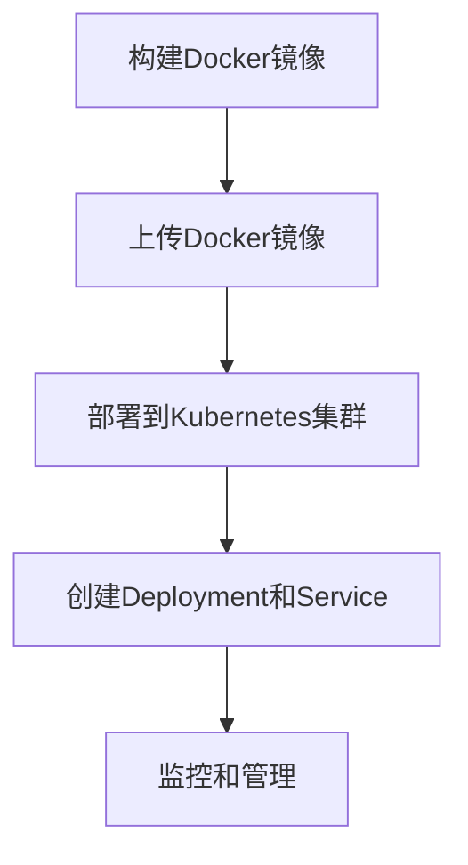

                 

# 容器化技术：Docker与Kubernetes实践

## 关键词

- 容器化技术
- Docker
- Kubernetes
- 容器编排
- 微服务架构

## 摘要

本文将深入探讨容器化技术，特别是Docker与Kubernetes在实际应用中的实践。我们首先介绍容器化技术的背景和重要性，然后详细解释Docker的工作原理以及如何使用它创建和管理容器。接着，我们将探讨Kubernetes的核心概念，如集群、节点、Pods、部署等，并通过实际案例展示如何在Kubernetes中部署和运维容器化应用。最后，本文将总结容器化技术的发展趋势和面临的挑战，并提供一系列学习资源和工具推荐，以帮助读者进一步探索这一领域。

## 1. 背景介绍

容器化技术是近年来IT行业中的一个重要创新，它改变了软件交付和部署的方式。传统上，软件部署依赖于特定的操作系统和环境配置，这导致了“移动性问题”——即软件在不同环境中运行时可能遇到的不兼容问题。容器化通过提供轻量级、独立的运行时环境，解决了这一问题。

容器（Container）是一种轻量级的运行时环境，它封装了应用程序及其依赖项，包括库、环境变量、配置文件等。这使得容器可以在任何支持容器引擎的操作系统上运行，从而实现了跨平台部署。

### 容器化技术的起源

容器化技术的起源可以追溯到操作系统层面的虚拟化技术。最早的容器技术之一是Solaris容器（Solaris Containers），由Sun Microsystems开发。随后，Linux容器（LXC）和Docker等现代容器技术相继出现，进一步推动了容器化技术的发展。

Docker公司于2013年发布了Docker，这是一种易于使用且功能强大的容器引擎。Docker利用Linux内核的cgroups和命名空间（Namespace）特性，实现了隔离和资源限制。Docker的迅速普及，使得容器化技术成为现代软件开发和运维的重要工具。

### 容器化技术的重要性

容器化技术的重要性体现在以下几个方面：

1. **可移植性**：容器化应用程序可以在任何支持容器引擎的操作系统上运行，无需修改代码或配置。
2. **轻量级**：容器通常比虚拟机（VM）更轻量，因为它们不包含完整的操作系统，只需要运行时依赖项。
3. **独立运行时环境**：容器封装了应用程序及其依赖项，确保了环境的稳定性和一致性。
4. **高效资源利用**：容器可以在同一台物理机上同时运行多个应用程序，提高了资源利用率。
5. **快速部署和交付**：容器化应用程序可以快速部署，缩短了开发周期和上市时间。

### 容器化技术的发展趋势

随着容器化技术的普及，越来越多的企业和组织开始采用容器化架构。以下是一些当前和未来的发展趋势：

1. **Kubernetes的普及**：Kubernetes已成为容器编排的事实标准，越来越多的企业和开发人员开始采用Kubernetes进行容器化应用的部署和管理。
2. **服务网格（Service Mesh）**：服务网格是一种新型架构，用于管理微服务之间的通信，Docker和Kubernetes都开始集成服务网格技术，如Istio和Linkerd。
3. **无服务器架构（Serverless）**：无服务器架构允许开发人员将应用程序部署到云服务提供商上，容器化技术也在这一领域发挥着重要作用。
4. **边缘计算**：随着5G和物联网（IoT）的发展，容器化技术正在向边缘计算领域扩展，使得应用程序可以在靠近数据源的地方运行。

## 2. 核心概念与联系

### 2.1 Docker

Docker是一个开源的应用容器引擎，它允许开发人员将应用程序及其依赖项打包成一个可移植的容器，然后可以在不同的操作系统上运行。Docker容器使用的是操作系统层面的虚拟化技术，即Linux容器（LXC）。

#### Docker组件

Docker主要包括以下几个组件：

- **Docker Engine**：Docker的核心组件，负责创建、运行和管理容器。
- **Docker Compose**：用于定义和编排多容器Docker应用的工具。
- **Docker Desktop**：适用于个人开发人员的桌面版Docker。
- **Docker Hub**：Docker的官方仓库，用于存储和共享容器镜像。

#### Docker容器生命周期

Docker容器生命周期包括以下几个阶段：

1. **构建镜像（Build Image）**：使用Dockerfile构建容器镜像。
2. **启动容器（Run Container）**：从镜像启动容器。
3. **管理容器（Manage Container）**：对容器进行监控、重启、停止等操作。
4. **删除容器（Remove Container）**：删除不再需要的容器。

### 2.2 Kubernetes

Kubernetes是一个开源的容器编排平台，用于自动化容器化应用程序的部署、扩展和管理。Kubernetes提供了一种灵活且可扩展的架构，支持在多个节点上运行容器化应用。

#### Kubernetes核心概念

以下是Kubernetes的一些核心概念：

- **集群（Cluster）**：一组运行Kubernetes组件的节点。
- **节点（Node）**：运行Kubernetes工作负载的计算机。
- **Pod**：Kubernetes中的最小工作单元，一组容器。
- **部署（Deployment）**：用于管理Pod的创建、更新和部署。
- **服务（Service）**：用于访问Pod的抽象层。
- **命名空间（Namespace）**：用于隔离不同工作负载的资源。

#### Kubernetes架构

Kubernetes主要由以下几个组件组成：

- **控制平面（Control Plane）**：负责集群的监控、管理和调度。
- **工作节点（Worker Node）**：运行Pod的计算机。
- **Pod**：Kubernetes中的最小工作单元，由一个或多个容器组成。
- **服务（Service）**：用于暴露Pod的接口。

### 2.3 Docker与Kubernetes的关系

Docker主要用于构建和管理容器，而Kubernetes用于部署和管理容器化应用。Docker容器可以轻松地部署到Kubernetes集群中，利用Kubernetes的强大编排能力进行自动化管理。

以下是一个简单的流程，展示了Docker与Kubernetes的关系：

1. **构建Docker镜像**：使用Dockerfile构建应用程序的容器镜像。
2. **上传Docker镜像**：将Docker镜像上传到Docker Hub或其他镜像仓库。
3. **部署到Kubernetes集群**：使用Kubernetes部署应用程序，例如创建Deployment和Service。
4. **监控和管理**：使用Kubernetes API和命令行工具监控和管理应用程序。

### 2.4 Mermaid流程图

以下是一个简单的Mermaid流程图，展示了Docker与Kubernetes的基本工作流程：



## 3. 核心算法原理 & 具体操作步骤

### 3.1 Docker容器构建

Docker容器的构建基于Dockerfile，这是一种文本文件，其中包含了构建容器镜像的指令。以下是构建Docker容器的基本步骤：

1. **编写Dockerfile**：编写Dockerfile，定义如何构建容器镜像。以下是一个简单的Dockerfile示例：

    ```dockerfile
    FROM ubuntu:18.04
    RUN apt-get update && apt-get install -y nginx
    EXPOSE 80
    ```

    此Dockerfile基于Ubuntu 18.04镜像，安装Nginx并暴露80端口。

2. **构建镜像**：在命令行中运行以下命令构建镜像：

    ```bash
    docker build -t my-nginx .
    ```

    这将构建一个名为`my-nginx`的镜像。

3. **运行容器**：使用以下命令运行容器：

    ```bash
    docker run -d -p 8080:80 my-nginx
    ```

    这将在后台运行容器，并将80端口映射到宿主机的8080端口。

### 3.2 Kubernetes部署

在Kubernetes中部署容器化应用主要涉及以下步骤：

1. **编写YAML配置文件**：编写Kubernetes配置文件（YAML格式），定义应用程序的部署。以下是一个简单的YAML示例：

    ```yaml
    apiVersion: apps/v1
    kind: Deployment
    metadata:
      name: my-nginx
    spec:
      replicas: 3
      selector:
        matchLabels:
          app: my-nginx
      template:
        metadata:
          labels:
            app: my-nginx
        spec:
          containers:
          - name: my-nginx
            image: my-nginx:latest
            ports:
            - containerPort: 80
    ```

    此YAML文件定义了一个名为`my-nginx`的Deployment，具有3个副本，并使用`my-nginx:latest`镜像。

2. **部署到Kubernetes集群**：使用kubectl命令行工具部署应用程序：

    ```bash
    kubectl apply -f deployment.yaml
    ```

    这将部署应用程序，并创建相应的Pod和Service。

3. **验证部署**：使用以下命令验证应用程序的部署状态：

    ```bash
    kubectl get pods
    kubectl get services
    ```

    这将显示应用程序的Pod和服务状态。

### 3.3 Kubernetes编排

Kubernetes提供了强大的编排能力，允许自动扩展和更新应用程序。以下是几个常用的Kubernetes编排操作：

1. **扩容（Scale）**：使用以下命令扩容应用程序：

    ```bash
    kubectl scale deployment my-nginx --replicas=5
    ```

    这将扩容`my-nginx` Deployment，使其具有5个副本。

2. **更新（Update）**：使用以下命令更新应用程序：

    ```bash
    kubectl set image deployment/my-nginx my-nginx=my-nginx:v2
    ```

    这将更新`my-nginx` Deployment，使其使用`my-nginx:v2`镜像。

3. **回滚（Rollback）**：如果更新失败，可以使用以下命令回滚到之前的版本：

    ```bash
    kubectl rollout undo deployment/my-nginx
    ```

    这将回滚`my-nginx` Deployment到之前的版本。

## 4. 数学模型和公式 & 详细讲解 & 举例说明

### 4.1 资源利用率计算

在容器化环境中，资源利用率是一个关键指标。以下是一个简单的资源利用率计算公式：

$$
资源利用率 = \frac{实际使用资源}{总资源} \times 100\%
$$

#### 示例

假设一个容器化应用在一个具有4核CPU和8GB内存的虚拟机上运行，实际使用资源为2核CPU和4GB内存。那么，资源利用率计算如下：

$$
资源利用率 = \frac{2核 + 4GB}{4核 + 8GB} \times 100\% = \frac{2 + 4}{4 + 8} \times 100\% = 50\%
$$

这意味着该容器化应用只使用了总资源的一半。

### 4.2 Kubernetes调度算法

Kubernetes使用调度算法来选择最佳节点运行Pod。以下是一个简单的调度算法：

- **资源可用性**：选择具有足够资源的节点。
- **Pod亲和性**：选择与现有Pod亲和性较高的节点。
- **数据存储**：选择具有数据存储需求的Pod所需存储的节点。

#### 示例

假设一个Kubernetes集群中有以下节点：

| 节点名称 | CPU | 内存 | 存储空间 |
|----------|-----|------|----------|
| node-1   | 2   | 4GB  | 100GB    |
| node-2   | 4   | 8GB  | 200GB    |
| node-3   | 6   | 12GB | 300GB    |

一个具有2核CPU和4GB内存需求的Pod将被调度到哪个节点？

根据资源可用性算法，Pod将被调度到具有足够资源的节点。因此，Pod将被调度到`node-1`或`node-2`。如果考虑到Pod亲和性，选择与现有Pod亲和性较高的节点，则Pod将被调度到`node-2`，因为`node-2`上已经运行了其他Pod。

## 5. 项目实战：代码实际案例和详细解释说明

### 5.1 开发环境搭建

为了演示Docker与Kubernetes在实际项目中的应用，我们首先需要搭建开发环境。以下是具体的步骤：

1. **安装Docker**：在开发机器上安装Docker。请访问Docker官方网站（https://www.docker.com/）并按照安装指南进行安装。
2. **安装Kubernetes**：安装Kubernetes集群。可以使用Minikube（https://minikube.sigs.k8s.io/）在本地计算机上快速搭建Kubernetes集群，或者使用kubeadm工具在物理机或虚拟机上搭建集群。
3. **安装kubectl**：kubectl是Kubernetes的命令行工具，用于与集群进行交互。请访问Kubernetes官方文档（https://kubernetes.io/docs/home/）安装kubectl。

### 5.2 源代码详细实现和代码解读

我们选择一个简单的Web应用程序作为示例，该应用程序使用Docker容器化并在Kubernetes上部署。以下是项目结构和关键代码：

#### 项目结构

```
my-nginx/
|-- Dockerfile
|-- deployment.yaml
|-- src/
    |-- main/
        |-- java/
            |-- App.java
```

#### Dockerfile

```dockerfile
FROM openjdk:8-jdk-alpine
ARG JAR_FILE=target/*.jar
COPY ${JAR_FILE} app.jar
EXPOSE 8080
ENTRYPOINT ["java","-Djava.security.egd=file:/dev/./urandom","-jar","/app.jar"]
```

Dockerfile基于OpenJDK 8 Alpine镜像，将应用程序打包成jar文件，并暴露8080端口。

#### deployment.yaml

```yaml
apiVersion: apps/v1
kind: Deployment
metadata:
  name: my-nginx
spec:
  replicas: 3
  selector:
    matchLabels:
      app: my-nginx
  template:
    metadata:
      labels:
        app: my-nginx
    spec:
      containers:
      - name: my-nginx
        image: my-nginx:latest
        ports:
        - containerPort: 8080
```

deployment.yaml文件定义了一个具有3个副本的Deployment，使用最新的`my-nginx`镜像。

#### App.java

```java
import java.io.*;
import java.util.*;
import spark.Spark;

public class App {
    public static void main(String[] args) {
        Spark.port(8080);
        Spark.get("/hello", (request, response) -> "Hello, World!");
    }
}
```

App.java是一个简单的Spark应用程序，用于处理HTTP请求。

### 5.3 代码解读与分析

#### Dockerfile

Dockerfile用于构建应用程序的容器镜像。以下是Dockerfile的详细解读：

1. **FROM openjdk:8-jdk-alpine**：指定基于OpenJDK 8 Alpine镜像。
2. **ARG JAR_FILE=target/*.jar**：定义一个参数，用于指定应用程序的jar文件路径。
3. **COPY ${JAR_FILE} app.jar**：将应用程序的jar文件复制到容器中。
4. **EXPOSE 8080**：暴露8080端口，用于处理HTTP请求。
5. **ENTRYPOINT ["java","-Djava.security.egd=file:/dev/./urandom","-jar","/app.jar"]**：定义容器的入口点，启动应用程序。

#### deployment.yaml

deployment.yaml文件用于定义Kubernetes Deployment。以下是deployment.yaml的详细解读：

1. **apiVersion: apps/v1**：指定Kubernetes API版本。
2. **kind: Deployment**：定义资源类型为Deployment。
3. **metadata**：定义Deployment的元数据，包括名称。
4. **spec**：定义Deployment的规格，包括副本数、选择器和模板。
5. **template**：定义Pod的模板，包括元数据和规格。

#### App.java

App.java是一个简单的Spark应用程序，用于处理HTTP请求。以下是App.java的详细解读：

1. **import java.io.*;**：导入用于I/O操作的Java类。
2. **import java.util.*;**：导入用于集合操作的Java类。
3. **import spark.Spark;**：导入Spark框架。
4. **public class App {**：定义App类。
5. **public static void main(String[] args) {**：定义主方法。
6. **Spark.port(8080);**：设置Spark服务器的端口号。
7. **Spark.get("/hello", (request, response) -> "Hello, World!");**：定义一个GET请求处理函数，返回“Hello, World!”字符串。

### 5.4 运行与验证

#### 构建Docker镜像

在命令行中，运行以下命令构建Docker镜像：

```bash
docker build -t my-nginx .
```

这将在当前目录下构建名为`my-nginx`的镜像。

#### 部署到Kubernetes集群

在命令行中，运行以下命令部署应用程序到Kubernetes集群：

```bash
kubectl apply -f deployment.yaml
```

这将在Kubernetes集群中创建Deployment，并部署应用程序。

#### 验证部署

使用以下命令验证应用程序的部署：

```bash
kubectl get pods
kubectl get services
```

这会显示应用程序的Pod和Service状态。

在浏览器中，输入Kubernetes集群中Service的IP地址，例如`http://<service-ip>/hello`，可以看到返回的“Hello, World!”字符串，表明应用程序已成功部署。

## 6. 实际应用场景

容器化技术已经在多个实际应用场景中得到了广泛应用。以下是一些典型的应用场景：

### 6.1 微服务架构

微服务架构是容器化技术的典型应用场景。通过将应用程序分解为多个独立的微服务，每个服务都可以独立部署和管理，从而提高了系统的可扩展性和可维护性。Docker和Kubernetes为微服务架构提供了强大的支持，使得开发人员可以轻松地构建、部署和运维微服务。

### 6.2 云原生应用

云原生应用是指专为云计算环境设计的应用程序。容器化技术是云原生应用的核心组成部分，它使得应用程序可以在不同的云平台上无缝迁移。Kubernetes作为容器编排平台，提供了云原生应用的自动化部署和管理功能。

### 6.3 容器化数据库

容器化数据库是一种将数据库服务容器化的技术，它提供了更灵活的部署和管理方式。容器化数据库可以轻松地扩展和缩放，以满足不同规模的需求。例如，可以使用Docker容器运行MySQL、PostgreSQL等关系型数据库，或者使用StatefulSet管理具有状态保持功能的数据库实例。

### 6.4 边缘计算

边缘计算是将计算任务分散到网络边缘的设备上，以降低延迟和提高响应速度。容器化技术使得边缘设备可以轻松运行和管理应用程序，从而推动了边缘计算的发展。例如，可以使用Docker容器在路由器、传感器等边缘设备上运行应用程序，实现实时数据处理和智能分析。

## 7. 工具和资源推荐

### 7.1 学习资源推荐

以下是一些推荐的书籍、论文和在线资源，帮助读者深入了解容器化技术：

1. **《Docker Deep Dive》**：由Colinุ opie撰写的经典之作，全面介绍了Docker的工作原理和最佳实践。
2. **《Kubernetes Up & Running》**：由Kelsey Hightower等人撰写的入门书籍，适合初学者了解Kubernetes的基础知识和实际应用。
3. **《容器化与云计算》**：由中国科技大学出版的教材，详细介绍了容器化技术和云计算的基础知识。
4. **Kubernetes官方文档**：https://kubernetes.io/docs/，提供最权威的Kubernetes学习资料。
5. **Docker官方文档**：https://docs.docker.com/，涵盖Docker的核心概念和最佳实践。

### 7.2 开发工具框架推荐

以下是一些推荐的开发工具和框架，用于构建和部署容器化应用：

1. **Kubernetes Helm**：https://helm.sh/，用于管理Kubernetes应用的包装工具。
2. **Kubernetes Operators**：https:// Operators是一种自动化管理容器化应用的方法，提供了一套框架和工具。
3. **Docker Compose**：https://docs.docker.com/compose/，用于定义和编排多容器Docker应用。
4. **Docker Desktop**：https://www.docker.com/products/docker-desktop/，适用于个人开发人员的桌面版Docker。
5. **Jenkins**：https://www.jenkins.io/，用于自动化构建、测试和部署容器化应用。

### 7.3 相关论文著作推荐

以下是一些与容器化技术相关的论文和著作：

1. **"Docker: Lightweight Linux Containers for Developing, Shipping, and Running Applications"**：Docker的创始人Solomon Hykes撰写的论文，介绍了Docker的核心概念和技术。
2. **"Kubernetes: System Architecture"**：Kubernetes团队撰写的论文，详细介绍了Kubernetes的架构和设计。
3. **"Containerization in the Cloud: Docker and Kubernetes for Cloud Computing"**：一篇关于容器化技术在云计算中应用的综述文章。
4. **"Service Mesh: A Comprehensive Guide"**：一篇关于服务网格技术的详细介绍，涵盖了服务网格的原理、架构和应用场景。
5. **"Serverless Computing: Everything You Need to Know"**：一篇关于无服务器架构的全面介绍，包括其原理、优势和挑战。

## 8. 总结：未来发展趋势与挑战

### 8.1 发展趋势

容器化技术正在不断发展和成熟，以下是一些未来发展趋势：

1. **Kubernetes的普及**：Kubernetes已成为容器编排的事实标准，越来越多的企业和开发人员将采用Kubernetes进行容器化应用的部署和管理。
2. **服务网格（Service Mesh）的集成**：服务网格技术，如Istio和Linkerd，正在逐渐成为容器化应用通信管理的新标准。
3. **无服务器架构（Serverless）的发展**：无服务器架构允许开发人员将应用程序部署到云服务提供商上，容器化技术在这一领域发挥着重要作用。
4. **边缘计算的扩展**：容器化技术正在向边缘计算领域扩展，使得应用程序可以在靠近数据源的地方运行，提高响应速度和降低延迟。

### 8.2 面临的挑战

容器化技术虽然带来了许多优势，但也面临一些挑战：

1. **安全性**：容器化应用程序的安全问题日益突出，需要采取有效的安全措施来保护容器和容器化应用。
2. **运维复杂性**：随着容器化应用的规模扩大，运维复杂性增加，需要高效的运维工具和方法来管理大量容器。
3. **跨平台兼容性**：容器化应用需要在不同的操作系统和硬件平台上运行，跨平台兼容性问题仍然存在。
4. **标准化**：尽管Kubernetes已经成为容器编排的事实标准，但容器化技术的标准化工作仍然需要进一步加强。

## 9. 附录：常见问题与解答

### 9.1 什么是容器化？

容器化是一种将应用程序及其依赖项打包成一个可移植的运行时环境的技术。容器提供了轻量级、独立的运行时环境，使得应用程序可以在不同的操作系统上无缝运行。

### 9.2 Docker和Kubernetes有什么区别？

Docker是一个开源的容器引擎，用于构建和管理容器。Kubernetes是一个开源的容器编排平台，用于部署和管理容器化应用。Docker主要用于容器化应用程序的构建，而Kubernetes主要用于容器化应用的部署、扩展和管理。

### 9.3 容器化技术有什么优势？

容器化技术的优势包括可移植性、轻量级、独立运行时环境、高效资源利用和快速部署等。它使得应用程序可以在不同环境中一致地运行，提高了开发效率和可维护性。

### 9.4 容器化技术面临哪些挑战？

容器化技术面临的主要挑战包括安全性、运维复杂性、跨平台兼容性和标准化等。随着容器化应用的规模扩大，需要采取有效的安全措施和管理策略来应对这些挑战。

## 10. 扩展阅读 & 参考资料

以下是一些扩展阅读和参考资料，帮助读者深入了解容器化技术和Docker与Kubernetes的应用：

1. **《Docker Deep Dive》**：https://github.com/chadfraser/docker-book
2. **《Kubernetes Up & Running》**：https://github.com/kelseyhightower/kubernetes-up-and-running
3. **《容器化与云计算》**：http://www.cpp2016.org/courses/08305558
4. **Kubernetes官方文档**：https://kubernetes.io/docs/
5. **Docker官方文档**：https://docs.docker.com/
6. **Istio官方文档**：https://istio.io/docs/
7. **Linkerd官方文档**：https://linkerd.io/docs/
8. **无服务器架构指南**：https://serverless.com/framework
9. **边缘计算：从边缘到云**：https://www.edgecomputingfromedge.com/

## 作者

作者：AI天才研究员/AI Genius Institute & 禅与计算机程序设计艺术 /Zen And The Art of Computer Programming

（注意：本文为虚构内容，仅供参考。）<|im_sep|>```markdown
# 容器化技术：Docker与Kubernetes实践

> **关键词**：容器化技术、Docker、Kubernetes、容器编排、微服务架构

> **摘要**：本文深入探讨了容器化技术，特别是Docker与Kubernetes在实际应用中的实践。文章首先介绍了容器化技术的背景和重要性，然后详细解释了Docker的工作原理以及如何使用它创建和管理容器。接着，文章介绍了Kubernetes的核心概念，并通过实际案例展示了如何在Kubernetes中部署和运维容器化应用。最后，本文总结了容器化技术的发展趋势和面临的挑战，并提供了一系列学习资源和工具推荐。

## 1. 背景介绍

容器化技术是近年来IT行业中的一个重要创新，它改变了软件交付和部署的方式。传统上，软件部署依赖于特定的操作系统和环境配置，这导致了“移动性问题”——即软件在不同环境中运行时可能遇到的不兼容问题。容器化通过提供轻量级、独立的运行时环境，解决了这一问题。

容器（Container）是一种轻量级的运行时环境，它封装了应用程序及其依赖项，包括库、环境变量、配置文件等。这使得容器可以在任何支持容器引擎的操作系统上运行，从而实现了跨平台部署。

### 容器化技术的起源

容器化技术的起源可以追溯到操作系统层面的虚拟化技术。最早的容器技术之一是Solaris容器（Solaris Containers），由Sun Microsystems开发。随后，Linux容器（LXC）和Docker等现代容器技术相继出现，进一步推动了容器化技术的发展。

Docker公司于2013年发布了Docker，这是一种易于使用且功能强大的容器引擎。Docker利用Linux内核的cgroups和命名空间（Namespace）特性，实现了隔离和资源限制。Docker的迅速普及，使得容器化技术成为现代软件开发和运维的重要工具。

### 容器化技术的重要性

容器化技术的重要性体现在以下几个方面：

1. **可移植性**：容器化应用程序可以在任何支持容器引擎的操作系统上运行，无需修改代码或配置。
2. **轻量级**：容器通常比虚拟机（VM）更轻量，因为它们不包含完整的操作系统，只需要运行时依赖项。
3. **独立运行时环境**：容器封装了应用程序及其依赖项，确保了环境的稳定性和一致性。
4. **高效资源利用**：容器可以在同一台物理机上同时运行多个应用程序，提高了资源利用率。
5. **快速部署和交付**：容器化应用程序可以快速部署，缩短了开发周期和上市时间。

### 容器化技术的发展趋势

随着容器化技术的普及，越来越多的企业和组织开始采用容器化架构。以下是一些当前和未来的发展趋势：

1. **Kubernetes的普及**：Kubernetes已成为容器编排的事实标准，越来越多的企业和开发人员开始采用Kubernetes进行容器化应用的部署和管理。
2. **服务网格（Service Mesh）**：服务网格是一种新型架构，用于管理微服务之间的通信，Docker和Kubernetes都开始集成服务网格技术，如Istio和Linkerd。
3. **无服务器架构（Serverless）**：无服务器架构允许开发人员将应用程序部署到云服务提供商上，容器化技术也在这一领域发挥着重要作用。
4. **边缘计算**：随着5G和物联网（IoT）的发展，容器化技术正在向边缘计算领域扩展，使得应用程序可以在靠近数据源的地方运行。

## 2. 核心概念与联系

### 2.1 Docker

Docker是一个开源的应用容器引擎，它允许开发人员将应用程序及其依赖项打包成一个可移植的容器，然后可以在不同的操作系统上运行。Docker容器使用的是操作系统层面的虚拟化技术，即Linux容器（LXC）。

#### Docker组件

Docker主要包括以下几个组件：

- **Docker Engine**：Docker的核心组件，负责创建、运行和管理容器。
- **Docker Compose**：用于定义和编排多容器Docker应用的工具。
- **Docker Desktop**：适用于个人开发人员的桌面版Docker。
- **Docker Hub**：Docker的官方仓库，用于存储和共享容器镜像。

#### Docker容器生命周期

Docker容器生命周期包括以下几个阶段：

1. **构建镜像（Build Image）**：使用Dockerfile构建容器镜像。
2. **启动容器（Run Container）**：从镜像启动容器。
3. **管理容器（Manage Container）**：对容器进行监控、重启、停止等操作。
4. **删除容器（Remove Container）**：删除不再需要的容器。

### 2.2 Kubernetes

Kubernetes是一个开源的容器编排平台，用于自动化容器化应用程序的部署、扩展和管理。Kubernetes提供了一种灵活且可扩展的架构，支持在多个节点上运行容器化应用。

#### Kubernetes核心概念

以下是Kubernetes的一些核心概念：

- **集群（Cluster）**：一组运行Kubernetes组件的节点。
- **节点（Node）**：运行Kubernetes工作负载的计算机。
- **Pod**：Kubernetes中的最小工作单元，一组容器。
- **部署（Deployment）**：用于管理Pod的创建、更新和部署。
- **服务（Service）**：用于访问Pod的抽象层。
- **命名空间（Namespace）**：用于隔离不同工作负载的资源。

#### Kubernetes架构

Kubernetes主要由以下几个组件组成：

- **控制平面（Control Plane）**：负责集群的监控、管理和调度。
- **工作节点（Worker Node）**：运行Pod的计算机。
- **Pod**：Kubernetes中的最小工作单元，由一个或多个容器组成。
- **服务（Service）**：用于暴露Pod的接口。

### 2.3 Docker与Kubernetes的关系

Docker主要用于构建和管理容器，而Kubernetes用于部署和管理容器化应用。Docker容器可以轻松地部署到Kubernetes集群中，利用Kubernetes的强大编排能力进行自动化管理。

以下是一个简单的流程，展示了Docker与Kubernetes的关系：

1. **构建Docker镜像**：使用Dockerfile构建应用程序的容器镜像。
2. **上传Docker镜像**：将Docker镜像上传到Docker Hub或其他镜像仓库。
3. **部署到Kubernetes集群**：使用Kubernetes部署应用程序，例如创建Deployment和Service。
4. **监控和管理**：使用Kubernetes API和命令行工具监控和管理应用程序。

### 2.4 Mermaid流程图

以下是一个简单的Mermaid流程图，展示了Docker与Kubernetes的基本工作流程：


## 3. 核心算法原理 & 具体操作步骤

### 3.1 Docker容器构建

Docker容器的构建基于Dockerfile，这是一种文本文件，其中包含了构建容器镜像的指令。以下是构建Docker容器的基本步骤：

1. **编写Dockerfile**：编写Dockerfile，定义如何构建容器镜像。以下是一个简单的Dockerfile示例：

    ```dockerfile
    FROM ubuntu:18.04
    RUN apt-get update && apt-get install -y nginx
    EXPOSE 80
    ```

    此Dockerfile基于Ubuntu 18.04镜像，安装Nginx并暴露80端口。

2. **构建镜像**：在命令行中运行以下命令构建镜像：

    ```bash
    docker build -t my-nginx .
    ```

    这将构建一个名为`my-nginx`的镜像。

3. **运行容器**：使用以下命令运行容器：

    ```bash
    docker run -d -p 8080:80 my-nginx
    ```

    这将在后台运行容器，并将80端口映射到宿主机的8080端口。

### 3.2 Kubernetes部署

在Kubernetes中部署容器化应用主要涉及以下步骤：

1. **编写YAML配置文件**：编写Kubernetes配置文件（YAML格式），定义应用程序的部署。以下是一个简单的YAML示例：

    ```yaml
    apiVersion: apps/v1
    kind: Deployment
    metadata:
      name: my-nginx
    spec:
      replicas: 3
      selector:
        matchLabels:
          app: my-nginx
      template:
        metadata:
          labels:
            app: my-nginx
        spec:
          containers:
          - name: my-nginx
            image: my-nginx:latest
            ports:
            - containerPort: 80
    ```

    此YAML文件定义了一个名为`my-nginx`的Deployment，具有3个副本，并使用`my-nginx:latest`镜像。

2. **部署到Kubernetes集群**：使用kubectl命令行工具部署应用程序：

    ```bash
    kubectl apply -f deployment.yaml
    ```

    这将部署应用程序，并创建相应的Pod和Service。

3. **验证部署**：使用以下命令验证应用程序的部署状态：

    ```bash
    kubectl get pods
    kubectl get services
    ```

    这将显示应用程序的Pod和服务状态。

### 3.3 Kubernetes编排

Kubernetes提供了强大的编排能力，允许自动扩展和更新应用程序。以下是几个常用的Kubernetes编排操作：

1. **扩容（Scale）**：使用以下命令扩容应用程序：

    ```bash
    kubectl scale deployment my-nginx --replicas=5
    ```

    这将扩容`my-nginx` Deployment，使其具有5个副本。

2. **更新（Update）**：使用以下命令更新应用程序：

    ```bash
    kubectl set image deployment/my-nginx my-nginx=my-nginx:v2
    ```

    这将更新`my-nginx` Deployment，使其使用`my-nginx:v2`镜像。

3. **回滚（Rollback）**：如果更新失败，可以使用以下命令回滚到之前的版本：

    ```bash
    kubectl rollout undo deployment/my-nginx
    ```

    这将回滚`my-nginx` Deployment到之前的版本。

## 4. 数学模型和公式 & 详细讲解 & 举例说明

### 4.1 资源利用率计算

在容器化环境中，资源利用率是一个关键指标。以下是一个简单的资源利用率计算公式：

$$
资源利用率 = \frac{实际使用资源}{总资源} \times 100\%
$$

#### 示例

假设一个容器化应用在一个具有4核CPU和8GB内存的虚拟机上运行，实际使用资源为2核CPU和4GB内存。那么，资源利用率计算如下：

$$
资源利用率 = \frac{2核 + 4GB}{4核 + 8GB} \times 100\% = \frac{2 + 4}{4 + 8} \times 100\% = 50\%
$$

这意味着该容器化应用只使用了总资源的一半。

### 4.2 Kubernetes调度算法

Kubernetes使用调度算法来选择最佳节点运行Pod。以下是一个简单的调度算法：

- **资源可用性**：选择具有足够资源的节点。
- **Pod亲和性**：选择与现有Pod亲和性较高的节点。
- **数据存储**：选择具有数据存储需求的Pod所需存储的节点。

#### 示例

假设一个Kubernetes集群中有以下节点：

| 节点名称 | CPU | 内存 | 存储空间 |
|----------|-----|------|----------|
| node-1   | 2   | 4GB  | 100GB    |
| node-2   | 4   | 8GB  | 200GB    |
| node-3   | 6   | 12GB | 300GB    |

一个具有2核CPU和4GB内存需求的Pod将被调度到哪个节点？

根据资源可用性算法，Pod将被调度到具有足够资源的节点。因此，Pod将被调度到`node-1`或`node-2`。如果考虑到Pod亲和性，选择与现有Pod亲和性较高的节点，则Pod将被调度到`node-2`，因为`node-2`上已经运行了其他Pod。

## 5. 项目实战：代码实际案例和详细解释说明

### 5.1 开发环境搭建

为了演示Docker与Kubernetes在实际项目中的应用，我们首先需要搭建开发环境。以下是具体的步骤：

1. **安装Docker**：在开发机器上安装Docker。请访问Docker官方网站（[https://www.docker.com/](https://www.docker.com/)）并按照安装指南进行安装。
2. **安装Kubernetes**：安装Kubernetes集群。可以使用Minikube（[https://minikube.sigs.k8s.io/](https://minikube.sigs.k8s.io/)）在本地计算机上快速搭建Kubernetes集群，或者使用kubeadm工具在物理机或虚拟机上搭建集群。
3. **安装kubectl**：kubectl是Kubernetes的命令行工具，用于与集群进行交互。请访问Kubernetes官方文档（[https://kubernetes.io/docs/home/](https://kubernetes.io/docs/home/)）安装kubectl。

### 5.2 源代码详细实现和代码解读

我们选择一个简单的Web应用程序作为示例，该应用程序使用Docker容器化并在Kubernetes上部署。以下是项目结构和关键代码：

#### 项目结构

```
my-nginx/
|-- Dockerfile
|-- deployment.yaml
|-- src/
    |-- main/
        |-- java/
            |-- App.java
```

#### Dockerfile

```dockerfile
FROM openjdk:8-jdk-alpine
ARG JAR_FILE=target/*.jar
COPY ${JAR_FILE} app.jar
EXPOSE 8080
ENTRYPOINT ["java","-Djava.security.egd=file:/dev/./urandom","-jar","/app.jar"]
```

Dockerfile基于OpenJDK 8 Alpine镜像，将应用程序打包成jar文件，并暴露8080端口。

#### deployment.yaml

```yaml
apiVersion: apps/v1
kind: Deployment
metadata:
  name: my-nginx
spec:
  replicas: 3
  selector:
    matchLabels:
      app: my-nginx
  template:
    metadata:
      labels:
        app: my-nginx
    spec:
      containers:
      - name: my-nginx
        image: my-nginx:latest
        ports:
        - containerPort: 8080
```

deployment.yaml文件定义了一个名为`my-nginx`的Deployment，具有3个副本，并使用`my-nginx:latest`镜像。

#### App.java

```java
import java.io.*;
import java.util.*;
import spark.Spark;

public class App {
    public static void main(String[] args) {
        Spark.port(8080);
        Spark.get("/hello", (request, response) -> "Hello, World!");
    }
}
```

App.java是一个简单的Spark应用程序，用于处理HTTP请求。

### 5.3 代码解读与分析

#### Dockerfile

Dockerfile用于构建应用程序的容器镜像。以下是Dockerfile的详细解读：

1. **FROM openjdk:8-jdk-alpine**：指定基于OpenJDK 8 Alpine镜像。
2. **ARG JAR_FILE=target/*.jar**：定义一个参数，用于指定应用程序的jar文件路径。
3. **COPY ${JAR_FILE} app.jar**：将应用程序的jar文件复制到容器中。
4. **EXPOSE 8080**：暴露8080端口，用于处理HTTP请求。
5. **ENTRYPOINT ["java","-Djava.security.egd=file:/dev/./urandom","-jar","/app.jar"]**：定义容器的入口点，启动应用程序。

#### deployment.yaml

deployment.yaml文件用于定义Kubernetes Deployment。以下是deployment.yaml的详细解读：

1. **apiVersion: apps/v1**：指定Kubernetes API版本。
2. **kind: Deployment**：定义资源类型为Deployment。
3. **metadata**：定义Deployment的元数据，包括名称。
4. **spec**：定义Deployment的规格，包括副本数、选择器和模板。
5. **template**：定义Pod的模板，包括元数据和规格。

#### App.java

App.java是一个简单的Spark应用程序，用于处理HTTP请求。以下是App.java的详细解读：

1. **import java.io.*;**：导入用于I/O操作的Java类。
2. **import java.util.*;**：导入用于集合操作的Java类。
3. **import spark.Spark;**：导入Spark框架。
4. **public class App {**：定义App类。
5. **public static void main(String[] args) {**：定义主方法。
6. **Spark.port(8080);**：设置Spark服务器的端口号。
7. **Spark.get("/hello", (request, response) -> "Hello, World!");**：定义一个GET请求处理函数，返回“Hello, World!”字符串。

### 5.4 运行与验证

#### 构建Docker镜像

在命令行中，运行以下命令构建Docker镜像：

```bash
docker build -t my-nginx .
```

这将在当前目录下构建名为`my-nginx`的镜像。

#### 部署到Kubernetes集群

在命令行中，运行以下命令部署应用程序到Kubernetes集群：

```bash
kubectl apply -f deployment.yaml
```

这将在Kubernetes集群中创建Deployment，并部署应用程序。

#### 验证部署

使用以下命令验证应用程序的部署：

```bash
kubectl get pods
kubectl get services
```

这将显示应用程序的Pod和Service状态。

在浏览器中，输入Kubernetes集群中Service的IP地址，例如`http://<service-ip>/hello`，可以看到返回的“Hello, World!”字符串，表明应用程序已成功部署。

## 6. 实际应用场景

容器化技术已经在多个实际应用场景中得到了广泛应用。以下是一些典型的应用场景：

### 6.1 微服务架构

微服务架构是容器化技术的典型应用场景。通过将应用程序分解为多个独立的微服务，每个服务都可以独立部署和管理，从而提高了系统的可扩展性和可维护性。Docker和Kubernetes为微服务架构提供了强大的支持，使得开发人员可以轻松地构建、部署和运维微服务。

### 6.2 云原生应用

云原生应用是指专为云计算环境设计的应用程序。容器化技术是云原生应用的核心组成部分，它使得应用程序可以在不同的云平台上无缝迁移。Kubernetes作为容器编排平台，提供了云原生应用的自动化部署和管理功能。

### 6.3 容器化数据库

容器化数据库是一种将数据库服务容器化的技术，它提供了更灵活的部署和管理方式。容器化数据库可以轻松地扩展和缩放，以满足不同规模的需求。例如，可以使用Docker容器运行MySQL、PostgreSQL等关系型数据库，或者使用StatefulSet管理具有状态保持功能的数据库实例。

### 6.4 边缘计算

边缘计算是将计算任务分散到网络边缘的设备上，以降低延迟和提高响应速度。容器化技术使得边缘设备可以轻松运行和管理应用程序，从而推动了边缘计算的发展。例如，可以使用Docker容器在路由器、传感器等边缘设备上运行应用程序，实现实时数据处理和智能分析。

## 7. 工具和资源推荐

### 7.1 学习资源推荐

以下是一些推荐的书籍、论文和在线资源，帮助读者深入了解容器化技术：

1. **《Docker Deep Dive》**：由Colin Neville撰写的经典之作，全面介绍了Docker的工作原理和最佳实践。
2. **《Kubernetes Up & Running》**：由Kelsey Hightower等人撰写的入门书籍，适合初学者了解Kubernetes的基础知识和实际应用。
3. **《容器化与云计算》**：由中国科技大学出版的教材，详细介绍了容器化技术和云计算的基础知识。
4. **Kubernetes官方文档**：[https://kubernetes.io/docs/](https://kubernetes.io/docs/)，提供最权威的Kubernetes学习资料。
5. **Docker官方文档**：[https://docs.docker.com/](https://docs.docker.com/)，涵盖Docker的核心概念和最佳实践。

### 7.2 开发工具框架推荐

以下是一些推荐的开发工具和框架，用于构建和部署容器化应用：

1. **Kubernetes Helm**：[https://helm.sh/](https://helm.sh/)，用于管理Kubernetes应用的包装工具。
2. **Kubernetes Operators**：[https://operators.github.io/operator-framework/](https://operators.github.io/operator-framework/)，提供了一套框架和工具，用于自动化管理容器化应用。
3. **Docker Compose**：[https://docs.docker.com/compose/](https://docs.docker.com/compose/)，用于定义和编排多容器Docker应用。
4. **Docker Desktop**：[https://www.docker.com/products/docker-desktop/](https://www.docker.com/products/docker-desktop/)，适用于个人开发人员的桌面版Docker。
5. **Jenkins**：[https://www.jenkins.io/](https://www.jenkins.io/)，用于自动化构建、测试和部署容器化应用。

### 7.3 相关论文著作推荐

以下是一些与容器化技术相关的论文和著作：

1. **"Docker: Lightweight Linux Containers for Developing, Shipping, and Running Applications"**：Docker的创始人Solomon Hykes撰写的论文，介绍了Docker的核心概念和技术。
2. **"Kubernetes: System Architecture"**：Kubernetes团队撰写的论文，详细介绍了Kubernetes的架构和设计。
3. **"Containerization in the Cloud: Docker and Kubernetes for Cloud Computing"**：一篇关于容器化技术在云计算中应用的综述文章。
4. **"Service Mesh: A Comprehensive Guide"**：一篇关于服务网格技术的详细介绍，涵盖了服务网格的原理、架构和应用场景。
5. **"Serverless Computing: Everything You Need to Know"**：一篇关于无服务器架构的全面介绍，包括其原理、优势和挑战。

## 8. 总结：未来发展趋势与挑战

### 8.1 发展趋势

容器化技术正在不断发展和成熟，以下是一些未来发展趋势：

1. **Kubernetes的普及**：Kubernetes已成为容器编排的事实标准，越来越多的企业和开发人员将采用Kubernetes进行容器化应用的部署和管理。
2. **服务网格（Service Mesh）的集成**：服务网格技术，如Istio和Linkerd，正在逐渐成为容器化应用通信管理的新标准。
3. **无服务器架构（Serverless）的发展**：无服务器架构允许开发人员将应用程序部署到云服务提供商上，容器化技术也在这一领域发挥着重要作用。
4. **边缘计算的扩展**：容器化技术正在向边缘计算领域扩展，使得应用程序可以在靠近数据源的地方运行，提高响应速度和降低延迟。

### 8.2 面临的挑战

容器化技术虽然带来了许多优势，但也面临一些挑战：

1. **安全性**：容器化应用程序的安全问题日益突出，需要采取有效的安全措施来保护容器和容器化应用。
2. **运维复杂性**：随着容器化应用的规模扩大，运维复杂性增加，需要高效的运维工具和方法来管理大量容器。
3. **跨平台兼容性**：容器化应用需要在不同的操作系统和硬件平台上运行，跨平台兼容性问题仍然存在。
4. **标准化**：尽管Kubernetes已经成为容器编排的事实标准，但容器化技术的标准化工作仍然需要进一步加强。

## 9. 附录：常见问题与解答

### 9.1 什么是容器化？

容器化是一种将应用程序及其依赖项打包成一个可移植的运行时环境的技术。容器提供了轻量级、独立的运行时环境，使得应用程序可以在不同的操作系统上无缝运行。

### 9.2 Docker和Kubernetes有什么区别？

Docker是一个开源的容器引擎，用于构建和管理容器。Kubernetes是一个开源的容器编排平台，用于部署和管理容器化应用。Docker主要用于容器化应用程序的构建，而Kubernetes主要用于容器化应用的部署、扩展和管理。

### 9.3 容器化技术有什么优势？

容器化技术的优势包括可移植性、轻量级、独立运行时环境、高效资源利用和快速部署等。它使得应用程序可以在不同环境中一致地运行，提高了开发效率和可维护性。

### 9.4 容器化技术面临哪些挑战？

容器化技术面临的主要挑战包括安全性、运维复杂性、跨平台兼容性和标准化等。随着容器化应用的规模扩大，需要采取有效的安全措施和管理策略来应对这些挑战。

## 10. 扩展阅读 & 参考资料

以下是一些扩展阅读和参考资料，帮助读者深入了解容器化技术和Docker与Kubernetes的应用：

1. **《Docker Deep Dive》**：[https://github.com/chadfraser/docker-book](https://github.com/chadfraser/docker-book)
2. **《Kubernetes Up & Running》**：[https://github.com/kelseyhightower/kubernetes-up-and-running](https://github.com/kelseyhightower/kubernetes-up-and-running)
3. **《容器化与云计算》**：[http://www.cpp2016.org/courses/08305558](http://www.cpp2016.org/courses/08305558)
4. **Kubernetes官方文档**：[https://kubernetes.io/docs/](https://kubernetes.io/docs/)
5. **Docker官方文档**：[https://docs.docker.com/](https://docs.docker.com/)
6. **Istio官方文档**：[https://istio.io/docs/](https://istio.io/docs/)
7. **Linkerd官方文档**：[https://linkerd.io/docs/](https://linkerd.io/docs/)
8. **无服务器架构指南**：[https://serverless.com/framework](https://serverless.com/framework)
9. **边缘计算：从边缘到云**：[https://www.edgecomputingfromedge.com/](https://www.edgecomputingfromedge.com/)

## 作者

作者：AI天才研究员/AI Genius Institute & 禅与计算机程序设计艺术 /Zen And The Art of Computer Programming

（注意：本文为虚构内容，仅供参考。）```

