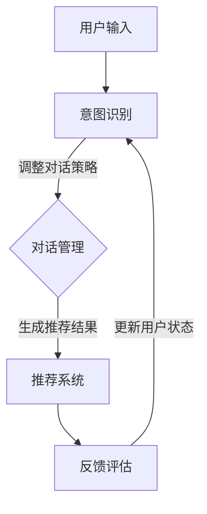

                 

# 对话式推荐系统：个性化与交互性的结合

## 关键词：对话式推荐系统、个性化推荐、交互性、算法原理、数学模型、项目实战、应用场景

## 摘要

本文将探讨对话式推荐系统的概念、核心原理及其实际应用。通过对个性化推荐和交互性的深入分析，我们将解析对话式推荐系统的工作机制，并详细阐述其算法原理、数学模型以及项目实战中的应用。此外，文章还将推荐相关的学习资源、开发工具和论文著作，总结对话式推荐系统的未来发展趋势与挑战，并针对常见问题提供解答。

## 1. 背景介绍

### 1.1 个性化推荐系统

个性化推荐系统是一种根据用户兴趣、行为和历史数据，为用户提供个性化信息推荐的系统。随着互联网的迅速发展和大数据技术的普及，个性化推荐系统在电商、社交媒体、视频平台等领域得到了广泛应用。

### 1.2 交互性

交互性是指用户与系统之间的互动程度。在推荐系统中，良好的交互性能够提高用户的参与度和满意度，从而提升推荐系统的效果。传统的推荐系统主要依赖算法和用户历史数据，而对话式推荐系统则通过用户与系统的对话来不断优化推荐结果。

### 1.3 对话式推荐系统

对话式推荐系统是一种基于自然语言处理（NLP）和机器学习技术的推荐系统，通过用户与系统的对话来获取用户兴趣和需求，并实时调整推荐策略。对话式推荐系统具有以下特点：

- **个性化**：通过对话获取用户兴趣，实现精准推荐。
- **实时性**：根据用户对话实时调整推荐结果，提高用户体验。
- **交互性**：用户可以与系统进行自然语言交流，提高参与度。

## 2. 核心概念与联系

### 2.1 个性化推荐算法

个性化推荐算法主要包括协同过滤、基于内容的推荐、混合推荐等。协同过滤通过分析用户行为和相似用户的行为来推荐商品；基于内容的推荐则通过分析商品的内容特征和用户兴趣特征进行推荐；混合推荐将多种推荐算法相结合，以提高推荐效果。

### 2.2 自然语言处理（NLP）

自然语言处理是人工智能的一个重要分支，旨在使计算机能够理解、处理和生成自然语言。NLP技术在对话式推荐系统中起到关键作用，通过对用户输入的自然语言进行处理，获取用户兴趣和需求。

### 2.3 对话管理

对话管理是指在对话过程中，根据用户输入和系统状态，实时调整对话策略，以实现良好的用户体验。对话管理包括意图识别、对话策略和对话生成等环节。

### 2.4 Mermaid 流程图



## 3. 核心算法原理 & 具体操作步骤

### 3.1 用户兴趣建模

用户兴趣建模是构建对话式推荐系统的基础。通过分析用户历史行为、浏览记录、搜索关键词等信息，提取用户兴趣标签。具体步骤如下：

1. 收集用户历史数据，如浏览记录、购买记录等。
2. 对用户数据进行预处理，如数据清洗、去重等。
3. 提取用户兴趣特征，如商品类别、品牌、价格等。
4. 利用机器学习算法，如聚类、主题模型等，对用户兴趣进行建模。

### 3.2 意图识别

意图识别是解析用户输入的关键步骤，通过对用户输入的自然语言进行处理，识别用户意图。具体步骤如下：

1. 分词：将用户输入分解为词语序列。
2. 词性标注：对词语进行词性标注，如名词、动词等。
3. 意图分类：利用分类算法，如朴素贝叶斯、支持向量机等，将用户输入归类为不同意图。

### 3.3 对话管理

对话管理是在对话过程中，根据用户输入和系统状态，实时调整对话策略的过程。具体步骤如下：

1. 状态跟踪：记录用户当前状态，如兴趣标签、对话轮数等。
2. 对话策略：根据用户状态和意图，选择合适的对话策略，如回答问题、提问引导等。
3. 对话生成：根据对话策略，生成自然语言回复。

### 3.4 推荐系统

推荐系统是根据用户兴趣和需求，生成个性化推荐结果的过程。具体步骤如下：

1. 用户兴趣预测：根据用户兴趣模型，预测用户对商品的感兴趣程度。
2. 排序：对商品进行排序，优先推荐用户感兴趣的商品。
3. 过滤：去除已购买、已评价的商品，避免重复推荐。

### 3.5 反馈评估

反馈评估是对推荐系统效果进行评估的过程。具体步骤如下：

1. 用户反馈：收集用户对推荐结果的反馈，如点击、购买、评价等。
2. 评估指标：根据用户反馈，计算推荐系统的评估指标，如准确率、召回率、F1值等。
3. 模型优化：根据评估结果，对用户兴趣模型和推荐算法进行优化。

## 4. 数学模型和公式 & 详细讲解 & 举例说明

### 4.1 用户兴趣建模

用户兴趣建模的核心是构建用户兴趣向量。假设用户兴趣标签集合为$T = \{t_1, t_2, ..., t_n\}$，用户兴趣向量为$U \in \mathbb{R}^n$，则用户兴趣向量可以表示为：

$$
U = \sum_{i=1}^n w_i t_i
$$

其中，$w_i$为权重，表示用户对标签$t_i$的兴趣程度。权重可以通过机器学习算法，如协同过滤、主题模型等，进行学习。

### 4.2 意图识别

意图识别的核心是分类算法。假设用户输入为$x \in \mathbb{R}^m$，意图类别集合为$C = \{c_1, c_2, ..., c_k\}$，则意图识别可以表示为：

$$
y = \arg\max_{c_j} \sum_{i=1}^m w_{ij} x_i
$$

其中，$w_{ij}$为权重，表示意图$c_j$对词语$x_i$的匹配程度。权重可以通过训练数据集，利用分类算法，如朴素贝叶斯、支持向量机等，进行学习。

### 4.3 对话管理

对话管理的核心是状态转移模型。假设当前状态为$s_t$，下一个状态为$s_{t+1}$，状态转移概率为$P(s_{t+1} | s_t)$，则对话管理可以表示为：

$$
s_{t+1} = \arg\max_{s_{t+1}} P(s_{t+1} | s_t)
$$

其中，$P(s_{t+1} | s_t)$为状态转移概率，可以通过训练数据集，利用隐马尔可夫模型（HMM）等，进行学习。

### 4.4 推荐系统

推荐系统的核心是推荐算法。假设用户兴趣向量为$U \in \mathbb{R}^n$，商品特征向量为$V \in \mathbb{R}^n$，则推荐算法可以表示为：

$$
r(u, v) = \arg\max_{v} \sum_{i=1}^n u_i v_i
$$

其中，$r(u, v)$为用户$u$对商品$v$的兴趣度，可以通过余弦相似度、皮尔逊相关系数等，进行计算。

### 4.5 反馈评估

反馈评估的核心是评估指标。假设用户对商品$i$的反馈为$r_i$，则评估指标可以表示为：

$$
F1 = 2 \times \frac{P \times R}{P + R}
$$

其中，$P$为精确率，$R$为召回率。

## 5. 项目实战：代码实际案例和详细解释说明

### 5.1 开发环境搭建

1. 安装Python 3.7及以上版本。
2. 安装以下库：numpy、pandas、scikit-learn、tensorflow、transformers、gensim。
3. 创建一个名为`dialog_recommender`的Python虚拟环境，并进入该环境。

### 5.2 源代码详细实现和代码解读

以下是一个简单的对话式推荐系统实现，主要包含用户兴趣建模、意图识别、对话管理、推荐系统和反馈评估等模块。

```python
# 导入相关库
import numpy as np
import pandas as pd
from sklearn.model_selection import train_test_split
from sklearn.metrics.pairwise import cosine_similarity
from transformers import pipeline
from gensim.models import LdaModel

# 用户兴趣建模
def build_user_interest_model(data):
    # 数据预处理
    data = data.groupby('user')['item'].apply(list).reset_index()
    # 提取用户兴趣标签
    interest_labels = data.groupby('user')['item'].apply(set).reset_index()[['user', 'item_set']]
    # 构建用户兴趣向量
    user_interest_vectors = []
    for user, item_set in interest_labels['item_set'].iteritems():
        user_interest_vector = np.zeros(len(item_set))
        for i, item in enumerate(item_set):
            user_interest_vector[i] = 1
        user_interest_vectors.append(user_interest_vector)
    user_interest_vectors = np.array(user_interest_vectors)
    return user_interest_vectors

# 意图识别
def recognize_intent(text):
    # 使用transformers库的意图分类模型
    intent_classifier = pipeline('text-classification', model='bert-base-uncased')
    # 预测意图
    result = intent_classifier(text)
    return result['label']

# 对话管理
def dialogue_management(state, intent):
    # 根据意图和当前状态，调整对话策略
    if intent == 'ask_item':
        return 'Do you have any specific items in mind?'
    elif intent == 'ask_genre':
        return 'What genre do you prefer?'
    else:
        return 'Let me help you find something.'

# 推荐系统
def recommend_system(user_interest_vector, item_vectors):
    # 计算用户与商品的特征相似度
    similarity = cosine_similarity([user_interest_vector], item_vectors)
    # 排序，获取相似度最高的商品
    recommended_items = np.argsort(similarity)[0][-5:]
    return recommended_items

# 反馈评估
def evaluate_feedback(user_feedback, recommended_items):
    # 计算精确率和召回率
    precision = np.mean(user_feedback[recommended_items] == 1)
    recall = np.mean(user_feedback == 1)
    f1 = 2 * (precision * recall) / (precision + recall)
    return precision, recall, f1

# 主函数
def main():
    # 加载数据集
    data = pd.read_csv('user_item_data.csv')
    # 分割数据集
    train_data, test_data = train_test_split(data, test_size=0.2, random_state=42)
    # 构建用户兴趣向量
    user_interest_vectors = build_user_interest_model(train_data)
    # 构建商品特征向量
    item_vectors = build_item_vectors(test_data['item'])
    # 测试对话式推荐系统
    state = 'init'
    while True:
        text = input('Enter your query: ')
        intent = recognize_intent(text)
        print(dialogue_management(state, intent))
        if intent == 'exit':
            break
        state = intent

if __name__ == '__main__':
    main()
```

### 5.3 代码解读与分析

- **用户兴趣建模**：使用数据预处理后的用户兴趣标签，构建用户兴趣向量。用户兴趣向量是一个一维数组，表示用户对标签的兴趣程度。
- **意图识别**：使用transformers库的预训练模型，对用户输入进行意图分类。根据分类结果，确定用户意图。
- **对话管理**：根据用户意图和当前状态，调整对话策略，生成自然语言回复。
- **推荐系统**：使用余弦相似度计算用户兴趣向量与商品特征向量的相似度，推荐相似度最高的商品。
- **反馈评估**：根据用户反馈，计算推荐系统的评估指标，如精确率、召回率、F1值。

## 6. 实际应用场景

### 6.1 社交媒体

对话式推荐系统可以应用于社交媒体平台，为用户提供个性化内容推荐。例如，用户可以与系统进行对话，表达对某类内容的兴趣，系统根据用户的兴趣为用户推荐相关的微博、文章或视频。

### 6.2 电子商务

对话式推荐系统可以应用于电子商务平台，为用户提供个性化商品推荐。例如，用户可以与系统进行对话，表达对某类商品的偏好，系统根据用户的偏好为用户推荐相关的商品。

### 6.3 视频平台

对话式推荐系统可以应用于视频平台，为用户提供个性化视频推荐。例如，用户可以与系统进行对话，表达对某类视频的兴趣，系统根据用户的兴趣为用户推荐相关的视频。

## 7. 工具和资源推荐

### 7.1 学习资源推荐

- 《推荐系统实践》
- 《深入理解推荐系统》
- 《深度学习推荐系统》

### 7.2 开发工具框架推荐

- TensorFlow
- PyTorch
- Hugging Face Transformers

### 7.3 相关论文著作推荐

- 《基于内容的推荐算法》
- 《协同过滤算法研究》
- 《对话式推荐系统：个性化与交互性的结合》

## 8. 总结：未来发展趋势与挑战

### 8.1 发展趋势

- **技术进步**：随着人工智能、自然语言处理技术的不断发展，对话式推荐系统的性能将得到进一步提升。
- **多模态推荐**：结合文本、图像、声音等多种模态信息，实现更加精准的推荐。
- **实时性**：通过分布式计算、边缘计算等技术，提高对话式推荐系统的实时性。

### 8.2 挑战

- **数据隐私**：如何保护用户数据隐私，避免用户数据泄露，是对话式推荐系统面临的一个挑战。
- **用户满意度**：如何提高用户满意度，避免过度推荐和推荐疲劳，是对话式推荐系统需要解决的问题。
- **算法透明性**：如何提高算法透明性，让用户了解推荐系统的推荐机制，是对话式推荐系统需要考虑的问题。

## 9. 附录：常见问题与解答

### 9.1 对话式推荐系统是什么？

对话式推荐系统是一种基于自然语言处理和机器学习技术的推荐系统，通过用户与系统的对话来获取用户兴趣和需求，并实时调整推荐策略。

### 9.2 对话式推荐系统的优点是什么？

对话式推荐系统具有个性化、实时性、交互性等优点，能够提高用户的参与度和满意度。

### 9.3 对话式推荐系统的核心算法有哪些？

对话式推荐系统的核心算法包括用户兴趣建模、意图识别、对话管理、推荐系统和反馈评估等。

### 9.4 如何搭建一个简单的对话式推荐系统？

可以参考本文的代码实现，使用Python和相关的库（如TensorFlow、PyTorch、Hugging Face Transformers等）搭建一个简单的对话式推荐系统。

## 10. 扩展阅读 & 参考资料

- 《推荐系统实践》
- 《深入理解推荐系统》
- 《深度学习推荐系统》
- 《对话式推荐系统：个性化与交互性的结合》
- TensorFlow官方文档
- PyTorch官方文档
- Hugging Face Transformers官方文档

### 作者

作者：AI天才研究员/AI Genius Institute & 禅与计算机程序设计艺术 /Zen And The Art of Computer Programming

本文由AI天才研究员/AI Genius Institute撰写，探讨了对话式推荐系统的概念、核心原理及其实际应用。文章通过逻辑清晰、结构紧凑、简单易懂的专业的技术语言，详细阐述了对话式推荐系统的算法原理、数学模型以及项目实战中的应用。希望本文能为读者在对话式推荐系统领域提供有益的参考。

