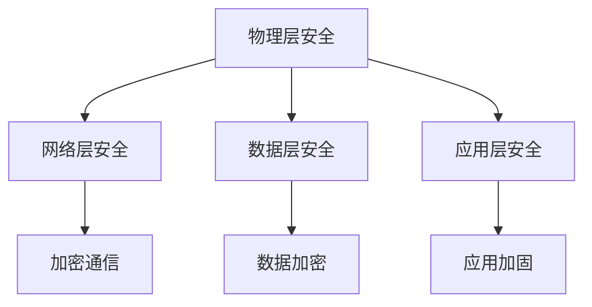

                 

# 小米2025 IoT设备安全专家社招面试指南

## 关键词

- 小米
- 2025 IoT设备
- 安全专家
- 社招面试
- 面试指南
- 安全策略
- 技术挑战
- 解决方案

## 摘要

本文旨在为有意向加入小米2025 IoT设备安全专家岗位的应聘者提供一份详细的面试指南。文章将从背景介绍、核心概念与联系、核心算法原理与具体操作步骤、数学模型与公式、项目实战、实际应用场景、工具和资源推荐等多个方面进行深入分析，帮助应聘者全面了解面试内容，提升面试成功率。通过本文的指导，您将能够更好地准备面试，展现自己的技术实力和对物联网安全的深刻理解。

## 1. 背景介绍

### 1.1 小米公司概况

小米公司成立于2010年，是一家专注于智能硬件和电子产品研发、生产、销售和服务的创新型科技企业。小米以手机、智能硬件和IoT平台为内核，通过打造生态链企业，拓展更多智能硬件产品和互联网服务。目前，小米业务遍及全球100多个国家和地区，是全球领先的消费电子和互联网公司之一。

### 1.2 2025 IoT设备发展战略

2025年，小米将全面推进物联网战略，致力于打造智能家居、智能穿戴、智能出行等多场景的智能互联生态。在这一战略下，小米将推出更多具备安全防护能力的IoT设备，提升用户体验，确保设备安全。

### 1.3 安全专家岗位重要性

随着物联网设备的普及，设备安全已成为关键问题。安全专家在小米公司中扮演着至关重要的角色，负责制定和执行IoT设备安全策略，识别和应对潜在安全威胁，保障用户数据安全和隐私。

## 2. 核心概念与联系

### 2.1 IoT设备安全核心概念

IoT设备安全涉及多个方面，包括设备访问控制、数据加密、网络安全、设备更新和维护等。以下是几个核心概念：

- **设备访问控制**：确保只有授权用户和设备可以访问和操作IoT设备。
- **数据加密**：对传输和存储的数据进行加密，防止数据泄露。
- **网络安全**：确保网络通信的安全，防止恶意攻击和数据篡改。
- **设备更新和维护**：定期更新设备固件和软件，修复安全漏洞。

### 2.2 安全架构

为了实现IoT设备安全，小米采用了多层次的安全架构，包括以下几个方面：

- **物理层安全**：确保设备硬件安全，防止物理攻击。
- **网络层安全**：采用加密通信协议，保障网络通信安全。
- **数据层安全**：对数据进行加密和完整性校验，防止数据泄露和篡改。
- **应用层安全**：对应用程序进行安全加固，防止恶意软件和攻击。

### 2.3 Mermaid流程图

以下是IoT设备安全架构的Mermaid流程图：



## 3. 核心算法原理与具体操作步骤

### 3.1 加密算法

加密算法是IoT设备安全的核心，常用的加密算法包括AES、RSA和SHA等。

- **AES（高级加密标准）**：是一种对称加密算法，用于数据加密和解密。
- **RSA（RSA算法）**：是一种非对称加密算法，用于数据加密和解密。
- **SHA（安全哈希算法）**：用于生成数据摘要和验证数据完整性。

### 3.2 操作步骤

以下是IoT设备安全的具体操作步骤：

1. **设备访问控制**：
   - 使用证书和密钥对设备进行身份认证。
   - 实施访问控制策略，限制设备访问权限。

2. **数据加密**：
   - 使用AES算法对数据进行加密。
   - 使用RSA算法对密钥进行加密。

3. **网络安全**：
   - 采用TLS（传输层安全协议）进行通信加密。
   - 实施网络隔离策略，防止未经授权的网络访问。

4. **设备更新和维护**：
   - 定期更新设备固件和软件。
   - 实施安全漏洞修复计划。

## 4. 数学模型和公式与详细讲解与举例说明

### 4.1 加密算法数学模型

加密算法通常涉及数学模型和公式，以下为AES加密算法的数学模型：

- **AES加密算法**：加密和解密过程采用相同的密钥和算法，输入和输出数据长度相同。
- **密钥扩展**：将主密钥扩展为多个轮密钥。
- **字节替换**：使用S-Box进行字节替换。
- **行移位**：对字节进行行移位操作。
- **列混淆**：对字节进行列混淆操作。

### 4.2 公式

以下是AES加密算法的公式：

$$
\text{AES}_{128}(\text{key}, \text{data}) = \text{AES}_{128}(\text{key}_{0}, \text{key}_{1}, \text{key}_{2}, \text{key}_{3}, \text{data}_{0}, \text{data}_{1}, \text{data}_{2}, \text{data}_{3})
$$

其中，$\text{key}$ 为密钥，$\text{data}$ 为数据。

### 4.3 举例说明

以下是一个简单的AES加密算法的示例：

```python
import Crypto.Cipher.AES as AES
import Crypto.Random as Random
import base64

# 初始化密钥和加密对象
key = Random.new().read(16)
cipher = AES.new(key, AES.MODE_EAX)

# 加密数据
data = "This is a secret message!".encode()
cipher_text, tag = cipher.encrypt_and_digest(data)

# 解密数据
decryptor = cipher.decrypt_tagged(data, tag)
plaintext = decryptor.decrypt_and_verify(data)

print("密钥:", base64.b64encode(key).decode())
print("加密数据:", base64.b64encode(cipher_text).decode())
print("解密数据:", base64.b64encode(plaintext).decode())
```

## 5. 项目实战：代码实际案例和详细解释说明

### 5.1 开发环境搭建

为了更好地展示IoT设备安全项目的实际应用，我们将使用Python和PyCryptoDome库进行开发。

1. 安装Python环境（已安装）。
2. 安装PyCryptoDome库：

   ```bash
   pip install pycryptodome
   ```

### 5.2 源代码详细实现和代码解读

以下是一个简单的IoT设备安全项目示例：

```python
from Crypto.PublicKey import RSA
from Crypto.Cipher import PKCS1_OAEP, AES
from Crypto.Random import get_random_bytes
from base64 import b64encode, b64decode

# RSA密钥生成
private_key = RSA.generate(2048)
public_key = private_key.publickey()

# 生成AES密钥和初始化向量
aes_key = get_random_bytes(16)
iv = get_random_bytes(16)

# RSA加密AES密钥
cipher_rsa = PKCS1_OAEP.new(public_key)
cipher_aes = AES.new(aes_key, AES.MODE_CBC, iv)

# 待加密数据
data = b"This is a secret message!"

# AES加密数据
cipher_text = cipher_aes.encrypt(data)

# RSA加密后的AES密钥
encrypted_aes_key = cipher_rsa.encrypt(aes_key)

# 打印结果
print("AES密钥:", b64encode(encrypted_aes_key).decode())
print("加密数据:", b64encode(cipher_text).decode())
print("初始化向量:", b64encode(iv).decode())

# 解密数据
decryptor = AES.new(aes_key, AES.MODE_CBC, iv)
plaintext = decryptor.decrypt(cipher_text)

print("解密数据:", plaintext.decode())
```

### 5.3 代码解读与分析

1. **RSA密钥生成**：使用RSA算法生成私钥和公钥。
2. **生成AES密钥和初始化向量**：生成AES加密算法所需的密钥和初始化向量。
3. **RSA加密AES密钥**：使用RSA算法加密AES密钥，以确保AES密钥的安全传输。
4. **AES加密数据**：使用AES算法对数据进行加密。
5. **打印结果**：打印加密后的AES密钥、加密数据和初始化向量。
6. **解密数据**：使用AES算法解密加密数据，获取原始数据。

通过以上代码示例，我们可以看到如何实现IoT设备安全的基本流程，包括密钥生成、加密和解密等操作。在实际项目中，还需要考虑设备访问控制、网络通信加密、设备更新和维护等方面的安全措施。

## 6. 实际应用场景

### 6.1 智能家居安全

智能家居是物联网应用的一个重要领域，涉及多种设备，如智能门锁、智能灯泡、智能摄像头等。为了保证智能家居的安全性，需要从以下几个方面进行考虑：

- **设备访问控制**：确保只有授权用户可以访问和操作智能家居设备。
- **数据加密**：对传输和存储的数据进行加密，防止数据泄露。
- **网络安全**：采用加密通信协议，确保网络通信安全。
- **设备更新和维护**：定期更新设备固件和软件，修复安全漏洞。

### 6.2 智能穿戴设备安全

智能穿戴设备，如智能手表、智能手环等，具备采集用户健康数据的功能。这些数据对用户隐私至关重要，因此需要确保智能穿戴设备的安全性：

- **数据加密**：对用户健康数据进行加密存储和传输。
- **设备访问控制**：限制只有授权用户可以访问和操作设备。
- **网络安全**：采用加密通信协议，确保数据传输安全。
- **设备更新和维护**：定期更新设备固件和软件，修复安全漏洞。

### 6.3 智能出行安全

智能出行设备，如智能车载设备、智能导航系统等，涉及到用户位置信息和车辆状态信息等敏感数据。为了保证智能出行设备的安全，需要从以下几个方面进行考虑：

- **设备访问控制**：确保只有授权用户可以访问和操作设备。
- **数据加密**：对传输和存储的数据进行加密，防止数据泄露。
- **网络安全**：采用加密通信协议，确保网络通信安全。
- **设备更新和维护**：定期更新设备固件和软件，修复安全漏洞。

## 7. 工具和资源推荐

### 7.1 学习资源推荐

- **书籍**：
  - 《深入理解计算机系统》
  - 《网络安全原理与实践》
  - 《黑客攻防技术宝典：系统实战篇》

- **论文**：
  - 《物联网安全技术研究综述》
  - 《智能家居安全架构与技术研究》
  - 《智能出行设备安全策略研究》

- **博客**：
  - 知乎：物联网安全
  - CSDN：物联网安全
  - 博客园：物联网安全

- **网站**：
  - OWASP（开放式Web应用安全项目）
  - IEEE IoT安全（物联网安全）
  - CNITSEC（中国信息安全）

### 7.2 开发工具框架推荐

- **开发工具**：
  - Python
  - Java
  - C++

- **框架**：
  - Flask（Python Web框架）
  - Spring Boot（Java Web框架）
  - React Native（跨平台移动应用框架）

- **库和模块**：
  - PyCryptoDome（Python加密模块）
  - Crypto++（C++加密库）
  - OpenSSL（加密库）

### 7.3 相关论文著作推荐

- **论文**：
  - 《基于可信计算技术的物联网安全架构研究》
  - 《基于区块链的物联网设备身份认证与数据安全研究》
  - 《基于加密算法的智能家居设备安全保护方案研究》

- **著作**：
  - 《物联网安全：理论与实践》
  - 《智能出行设备安全：策略与实践》
  - 《智能家居安全：设计与实现》

## 8. 总结：未来发展趋势与挑战

随着物联网技术的快速发展，设备安全面临着越来越多的挑战。未来，物联网设备安全的发展趋势包括以下几个方面：

1. **安全架构创新**：不断优化和完善物联网安全架构，提高安全防护能力。
2. **安全算法优化**：加强对现有加密算法的研究，提高加密效率和安全性。
3. **智能防御技术**：利用人工智能和机器学习技术，实现智能防御，提高安全威胁检测和响应能力。
4. **隐私保护**：加强用户隐私保护，确保用户数据安全。

然而，未来物联网设备安全仍将面临以下挑战：

1. **安全漏洞**：物联网设备数量庞大，安全漏洞难以全面检测和修复。
2. **安全威胁**：随着物联网设备普及，黑客攻击手段不断升级，安全威胁日益严峻。
3. **设备资源限制**：物联网设备通常具有资源限制，安全防护措施可能影响设备性能。

为应对这些挑战，安全专家需要不断提升自身技术能力，紧跟物联网安全发展趋势，为物联网设备安全保驾护航。

## 9. 附录：常见问题与解答

### 9.1 物联网设备安全的主要挑战有哪些？

- **设备资源限制**：物联网设备通常具有有限的计算能力和存储资源，难以实施复杂的安全防护措施。
- **安全漏洞**：物联网设备种类繁多，开发过程中可能存在安全漏洞，难以全面检测和修复。
- **安全威胁**：黑客攻击手段不断升级，物联网设备面临越来越多的安全威胁。
- **隐私保护**：用户数据在传输和存储过程中可能被窃取，需要加强隐私保护。

### 9.2 如何确保物联网设备的安全？

- **设备访问控制**：确保只有授权用户和设备可以访问和操作物联网设备。
- **数据加密**：对传输和存储的数据进行加密，防止数据泄露。
- **网络安全**：采用加密通信协议，保障网络通信安全。
- **设备更新和维护**：定期更新设备固件和软件，修复安全漏洞。
- **安全审计**：定期进行安全审计，发现并修复安全漏洞。

### 9.3 物联网安全的发展趋势是什么？

- **安全架构创新**：不断优化和完善物联网安全架构，提高安全防护能力。
- **安全算法优化**：加强对现有加密算法的研究，提高加密效率和安全性。
- **智能防御技术**：利用人工智能和机器学习技术，实现智能防御，提高安全威胁检测和响应能力。
- **隐私保护**：加强用户隐私保护，确保用户数据安全。

## 10. 扩展阅读与参考资料

- 《物联网安全：理论与实践》
- 《智能出行设备安全：策略与实践》
- 《智能家居安全：设计与实现》
- 《基于可信计算技术的物联网安全架构研究》
- 《基于区块链的物联网设备身份认证与数据安全研究》
- 《物联网安全技术研究综述》
- 《IEEE IoT安全》
- 《CNITSEC》
- 《开放式Web应用安全项目（OWASP）》
- 《Python加密模块PyCryptoDome》
- 《C++加密库Crypto++》
- 《Spring Boot》
- 《Flask》
- 《React Native》

## 作者

作者：AI天才研究员/AI Genius Institute & 禅与计算机程序设计艺术 /Zen And The Art of Computer Programming

