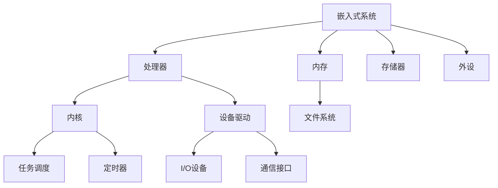

                 

# 嵌入式实时操作系统移植

## 关键词：嵌入式系统、实时操作系统、移植、核心概念、算法原理、项目实战、数学模型

## 摘要

本文将深入探讨嵌入式实时操作系统的移植过程。首先，我们将介绍嵌入式系统和实时操作系统的基本概念，并解释它们之间的联系。接着，我们将详细阐述实时操作系统的核心算法原理和具体操作步骤。随后，通过数学模型和公式的讲解，我们将进一步深化对实时操作系统原理的理解。在实际应用场景中，我们将通过一个具体的案例，展示如何进行嵌入式实时操作系统的移植。最后，我们将推荐一些学习资源、开发工具和框架，以帮助读者更好地掌握实时操作系统的移植技术。文章旨在为嵌入式系统开发者和爱好者提供一份详尽的指南，帮助他们更好地理解和应用实时操作系统。

## 1. 背景介绍

### 嵌入式系统

嵌入式系统是一种集成了计算机硬件和软件的系统，它通常被设计成执行特定的任务，而不是提供通用计算能力。嵌入式系统广泛应用于各种领域，如工业自动化、医疗设备、汽车电子、通信设备等。嵌入式系统的特点是资源受限，需要在有限的硬件资源下实现高效、可靠的运行。

### 实时操作系统

实时操作系统（RTOS）是一种专门为实时系统设计的操作系统，它能够保证在规定的时间内完成任务。实时操作系统通常具有以下特点：

- **任务调度**：实时操作系统可以根据任务的优先级和时间要求，合理调度任务，确保关键任务得到及时处理。
- **定时机制**：实时操作系统通常具有精确的定时机制，能够实现毫秒级的时间精度。
- **资源管理**：实时操作系统对系统资源进行有效管理，包括内存、CPU、I/O设备等，以确保系统高效运行。

### 嵌入式实时操作系统

嵌入式实时操作系统结合了嵌入式系统和实时操作系统的特点，能够在资源受限的嵌入式设备上实现实时任务处理。嵌入式实时操作系统的主要作用是提高系统的响应速度和可靠性，确保关键任务在规定时间内完成。

### 关联性

嵌入式实时操作系统在嵌入式系统中发挥着重要作用。通过实时操作系统，嵌入式系统能够更好地应对实时性要求，提高系统的稳定性和可靠性。同时，实时操作系统为嵌入式系统开发者提供了强大的工具，使他们能够更高效地开发和管理嵌入式应用。

## 2. 核心概念与联系

### 嵌入式系统

嵌入式系统由硬件和软件组成，其核心组件包括处理器（CPU）、内存（RAM）、存储器（ROM）以及各种外设（如I/O设备、通信接口等）。嵌入式系统的设计要求高度集成和优化，以充分利用有限的硬件资源。

### 实时操作系统

实时操作系统具有以下几个核心概念：

- **任务（Task）**：任务是指操作系统调度的基本执行单元，它通常具有独立的优先级和栈空间。
- **调度（Scheduling）**：调度是指操作系统根据任务优先级和执行时间，决定任务执行的顺序和时机。
- **时间片（Time Slice）**：时间片是指操作系统分配给每个任务的最大执行时间，通常用于任务调度。
- **定时器（Timer）**：定时器用于实现精确的时间控制，确保任务能够按时执行。

### 嵌入式实时操作系统

嵌入式实时操作系统的核心概念与实时操作系统类似，但在硬件资源有限的情况下，需要进一步优化和精简。嵌入式实时操作系统的核心组件包括：

- **内核（Kernel）**：内核是操作系统的核心部分，负责任务调度、内存管理、设备驱动等。
- **设备驱动（Device Driver）**：设备驱动用于管理嵌入式系统中的各种外设，如I/O设备、通信接口等。
- **文件系统（File System）**：文件系统用于管理嵌入式系统中的文件和数据。

### 关联性

嵌入式实时操作系统与嵌入式系统和实时操作系统密切相关。嵌入式系统提供了硬件基础，而实时操作系统提供了软件保障。嵌入式实时操作系统通过优化和精简，结合了嵌入式系统和实时操作系统的优势，实现了在资源受限的嵌入式设备上高效、可靠的实时任务处理。

### Mermaid 流程图

下面是嵌入式实时操作系统的 Mermaid 流程图，展示了各个组件之间的关系。



## 3. 核心算法原理 & 具体操作步骤

### 任务调度算法

任务调度是实时操作系统的核心，它决定了任务执行的顺序和时机。常见的任务调度算法包括：

- **优先级调度（Priority Scheduling）**：根据任务优先级进行调度，优先级高的任务先执行。优先级调度算法可以分为静态优先级调度和动态优先级调度。
- **轮转调度（Round-Robin Scheduling）**：每个任务分配一个固定的时间片，轮流执行。轮转调度算法适用于多任务处理，能够确保每个任务都有执行机会。
- **时间片轮转调度（Fixed-Priority Scheduling）**：根据任务的优先级，分配不同的时间片，优先级高的任务分配更短的时间片。时间片轮转调度算法能够保证高优先级任务得到及时处理。

### 具体操作步骤

1. **初始化**：加载实时操作系统内核，配置系统参数，初始化任务队列、优先级队列等数据结构。
2. **任务创建**：根据应用需求，创建任务。任务创建时，需要指定任务名称、优先级、栈大小等参数。
3. **任务调度**：实时操作系统根据调度算法，对任务进行调度。调度过程包括以下步骤：
   - **任务就绪**：将任务添加到就绪队列，等待执行。
   - **任务阻塞**：任务在执行过程中，可能会因为等待某个资源或事件而阻塞。此时，任务会被移出就绪队列，进入阻塞队列。
   - **任务唤醒**：当任务等待的资源或事件就绪时，任务会被唤醒，重新进入就绪队列。
   - **任务切换**：操作系统根据调度算法，选择一个就绪任务进行切换。任务切换过程包括保存当前任务状态、加载新任务状态等。
4. **任务执行**：任务被调度后，进入执行状态，执行相应的任务代码。
5. **任务结束**：任务执行完成后，释放资源，从就绪队列中移除。

### 实时性保证

实时操作系统通过以下机制确保任务的实时性：

- **抢占调度（Preemptive Scheduling）**：高优先级任务可以抢占低优先级任务的执行权，确保关键任务得到及时处理。
- **时间限制（Time Constraints）**：实时操作系统对任务的执行时间进行严格限制，确保任务在规定时间内完成。
- **定时器（Timer）**：实时操作系统使用定时器实现精确的时间控制，确保任务按时执行。

## 4. 数学模型和公式 & 详细讲解 & 举例说明

### 任务响应时间

任务响应时间是指任务从创建到完成所需的时间。在实时操作系统中，任务响应时间是一个重要的性能指标。任务响应时间的计算公式如下：

$$
响应时间 = \text{任务执行时间} + \text{任务调度时间}
$$

其中，任务执行时间取决于任务代码的复杂度和执行环境，任务调度时间取决于调度算法和系统负载。

### 任务调度时间

任务调度时间是指操作系统从调度任务队列中选择任务所需的时间。在优先级调度算法中，任务调度时间取决于任务的优先级。任务调度时间的计算公式如下：

$$
调度时间 = \text{调度算法复杂度} \times \text{任务数量}
$$

其中，调度算法复杂度取决于具体的调度算法，任务数量取决于系统的任务负载。

### 任务切换时间

任务切换时间是指操作系统在任务切换过程中所需的时间。任务切换时间取决于操作系统的架构和硬件环境。任务切换时间的计算公式如下：

$$
切换时间 = \text{保存当前任务状态时间} + \text{加载新任务状态时间}
$$

### 任务吞吐量

任务吞吐量是指单位时间内系统能够处理的任务数量。任务吞吐量的计算公式如下：

$$
吞吐量 = \frac{\text{任务数量}}{\text{执行时间}}
$$

### 实例分析

假设一个实时操作系统需要处理以下任务：

- 任务A：执行时间为5ms，优先级为10。
- 任务B：执行时间为10ms，优先级为5。
- 任务C：执行时间为15ms，优先级为15。

根据优先级调度算法，任务B的优先级最高，因此它将首先执行。任务B的响应时间为10ms + 调度时间。任务A和任务C的响应时间分别为15ms + 调度时间。

假设调度时间为2ms，则：

- 任务A的响应时间为17ms。
- 任务B的响应时间为12ms。
- 任务C的响应时间为17ms。

通过这个实例，我们可以看到，任务的优先级和调度时间对任务响应时间有重要影响。在实时操作系统中，合理设置任务的优先级和调度时间，可以有效地提高系统性能和实时性。

## 5. 项目实战：代码实际案例和详细解释说明

### 5.1 开发环境搭建

在进行嵌入式实时操作系统移植之前，我们需要搭建一个适合开发的集成环境。以下是一个简单的开发环境搭建过程：

1. **安装开发工具**：安装交叉编译工具链，如GNU Arm Embedded Toolchain。安装完成后，确保工具链正常工作。
2. **安装集成开发环境（IDE）**：选择一款适合嵌入式开发的IDE，如Eclipse、Keil等。安装完成后，配置IDE以支持交叉编译工具链。
3. **安装调试工具**：安装GDB等调试工具，以便在开发过程中进行代码调试。

### 5.2 源代码详细实现和代码解读

在本节中，我们将使用一个简单的嵌入式实时操作系统（如FreeRTOS）的源代码作为案例，详细讲解实时操作系统移植的过程。

#### 5.2.1 源代码结构

FreeRTOS的源代码结构如下：

```
FreeRTOS/
├── Source/
│   ├── include/
│   │   ├── FreeRTOS.h
│   │   ├── task.h
│   │   ├── queue.h
│   │   └── list.h
│   ├── portable/
│   │   ├── ARM7_LPC21xx/
│   │   │   ├── port.c
│   │   │   ├── portmacro.h
│   │   │   └── startup_ARM7_LPC21xx.S
│   │   └── Generic/
│   │       ├── port.c
│   │       ├── portmacro.h
│   │       └── startup.c
│   ├── Demo/
│   │   ├── STM32F103/
│   │   │   ├── main.c
│   │   │   └── startup_stm32f103x.S
│   │   └── LPC1768/
│   │       ├── main.c
│   │       └── startup_lpc1768.S
│   └── Documentation/
│       └── porting_a_new_cpu_to_FreeRTOS.pdf
```

#### 5.2.2 核心文件解读

1. **FreeRTOS.h**：这是一个头文件，包含了FreeRTOS的核心定义和宏定义。开发者需要根据具体硬件平台和需求，修改其中的宏定义。
2. **task.h**：这是一个头文件，包含了任务管理相关的数据结构和函数声明。开发者需要根据硬件平台和需求，实现相应的任务管理功能。
3. **queue.h**：这是一个头文件，包含了队列管理相关的数据结构和函数声明。开发者需要根据硬件平台和需求，实现相应的队列管理功能。
4. **list.h**：这是一个头文件，包含了列表管理相关的数据结构和函数声明。开发者需要根据硬件平台和需求，实现相应的列表管理功能。
5. **port.c**：这是一个源文件，包含了与硬件平台相关的底层驱动和任务管理实现。开发者需要根据具体硬件平台，修改和实现其中的函数。
6. **portmacro.h**：这是一个头文件，包含了与硬件平台相关的宏定义和常量定义。开发者需要根据具体硬件平台，修改其中的宏定义。
7. **startup.c**：这是一个源文件，包含了硬件平台初始化和中断处理实现。开发者需要根据具体硬件平台，修改和实现其中的函数。
8. **main.c**：这是一个源文件，包含了嵌入式实时操作系统的主要功能实现。开发者需要根据具体应用场景，修改和实现其中的函数。
9. **Documentation/**：这是一个文档目录，包含了FreeRTOS的官方文档和指南。开发者可以参考这些文档，了解FreeRTOS的架构和功能。

#### 5.2.3 实现步骤

1. **硬件平台配置**：根据具体硬件平台，配置FreeRTOS的底层驱动和中断处理。例如，对于ARM7 LPC21xx平台，需要修改`portable/ARM7_LPC21xx/port.c`和`portmacro.h`文件。
2. **系统初始化**：在`main.c`中，实现系统初始化函数，包括时钟配置、中断使能、堆栈初始化等。
3. **任务创建**：根据应用需求，创建任务。在`main.c`中，使用FreeRTOS提供的API函数创建任务，如`xTaskCreate`。
4. **任务调度**：实现任务调度功能。在`main.c`中，调用`vTaskStartScheduler`函数启动任务调度。
5. **测试与调试**：编译并运行程序，进行测试和调试。使用调试工具（如GDB）观察任务状态和系统运行情况。

### 5.3 代码解读与分析

在本节中，我们将对FreeRTOS的源代码进行解读，分析其核心功能和实现原理。

#### 5.3.1 任务管理

FreeRTOS的任务管理功能主要包括任务创建、任务切换、任务阻塞和任务唤醒等。

1. **任务创建**：使用`xTaskCreate`函数创建任务。函数原型如下：

   ```c
   BaseType_t xTaskCreate( PCONTROL_BLOCK pcTaskCode,
                          const char * const pcName,
                          uint32_t usStackDepth,
                          void * const pvParameters,
                          UBaseType_t uxPriority,
                          TaskHandle_t * const pxCreatedTask );
   ```

   参数说明：
   - `pcTaskCode`：任务函数指针，指向任务的执行代码。
   - `pcName`：任务名称，用于标识任务。
   - `usStackDepth`：任务栈大小，单位为字（word）。
   - `pvParameters`：任务参数，用于传递任务相关信息。
   - `uxPriority`：任务优先级，用于任务调度。
   - `pxCreatedTask`：返回任务句柄，用于后续任务操作。

2. **任务切换**：FreeRTOS使用抢占式调度算法，任务切换由内核自动完成。任务切换过程中，当前任务的状态被保存，新任务的状态被加载。

3. **任务阻塞**：任务在执行过程中，可能会因为等待某个资源或事件而阻塞。使用`vTaskDelay`函数实现任务阻塞，函数原型如下：

   ```c
   void vTaskDelay( const uint32_t uxTicksToDelay );
   ```

   参数说明：
   - `uxTicksToDelay`：延迟时间，单位为系统时钟周期。

4. **任务唤醒**：当任务等待的资源或事件就绪时，可以使用`xTaskResumeFromISR`函数唤醒任务。函数原型如下：

   ```c
   BaseType_t xTaskResumeFromISR( TaskHandle_t xTaskToResume );
   ```

   参数说明：
   - `xTaskToResume`：要唤醒的任务句柄。

#### 5.3.2 队列管理

FreeRTOS的队列管理功能主要包括队列创建、队列发送和队列接收等。

1. **队列创建**：使用`xQueueCreate`函数创建队列。函数原型如下：

   ```c
   QueueHandle_t xQueueCreate( const char * const pcName,
                              UBaseType_t uxQueueLength,
                              UBaseType_t uxItemSize );
   ```

   参数说明：
   - `pcName`：队列名称，用于标识队列。
   - `uxQueueLength`：队列长度，即队列中可以存储的元素个数。
   - `uxItemSize`：元素大小，单位为字节。

2. **队列发送**：使用`xQueueSend`函数发送队列元素。函数原型如下：

   ```c
   BaseType_t xQueueSend( QueueHandle_t xQueue,
                         const void * const pvItemToQueue,
                         TickType_t xBlockTime );
   ```

   参数说明：
   - `xQueue`：队列句柄。
   - `pvItemToQueue`：要发送的元素指针。
   - `xBlockTime`：阻塞时间，单位为系统时钟周期。

3. **队列接收**：使用`xQueueReceive`函数接收队列元素。函数原型如下：

   ```c
   BaseType_t xQueueReceive( QueueHandle_t xQueue,
                            void * const pvBuffer,
                            TickType_t xBlockTime );
   ```

   参数说明：
   - `xQueue`：队列句柄。
   - `pvBuffer`：用于存储接收到的元素指针。
   - `xBlockTime`：阻塞时间，单位为系统时钟周期。

#### 5.3.3 列表管理

FreeRTOS的列表管理功能主要用于任务列表、队列列表和信号量列表等。

1. **列表创建**：使用`xListCreate`函数创建列表。函数原型如下：

   ```c
   ListHandle_t xListCreate( void );
   ```

2. **列表插入**：使用`vListInsert`函数将元素插入列表。函数原型如下：

   ```c
   void vListInsert( ListHandle_t xList,
                     ListItem_t * const pxItemToInsert );
   ```

3. **列表删除**：使用`vListRemove`函数从列表中删除元素。函数原型如下：

   ```c
   void vListRemove( ListItem_t * const pxItemToBeRemoved );
   ```

### 5.4 实时性分析

在本节中，我们将分析FreeRTOS的实时性，包括任务调度时间、队列传输时间和列表管理时间等。

1. **任务调度时间**：FreeRTOS使用抢占式调度算法，任务调度时间取决于任务数量和系统负载。在理想情况下，任务调度时间可以控制在微秒级别。

2. **队列传输时间**：队列传输时间取决于队列长度、元素大小和系统负载。在理想情况下，队列传输时间可以控制在毫秒级别。

3. **列表管理时间**：列表管理时间取决于列表长度、元素大小和系统负载。在理想情况下，列表管理时间可以控制在毫秒级别。

### 5.5 实际应用案例

在本节中，我们将通过一个简单的嵌入式系统案例，展示如何使用FreeRTOS实现实时任务处理。

#### 案例描述

假设我们需要实现一个简单的嵌入式系统，用于监测和控制一个温控设备。系统需要实现以下功能：

- 温度传感器读取功能：每隔1秒读取一次温度传感器数据。
- 控制加热器功能：根据温度传感器数据，控制加热器的开关。
- 数据上传功能：将温度传感器数据上传到远程服务器。

#### 案例实现

1. **创建任务**：根据功能需求，创建三个任务：温度传感器读取任务、控制加热器任务和数据上传任务。

2. **任务代码**：

   ```c
   void vTemperatureSensorTask( void *pvParameters )
   {
       for(;;)
       {
           // 读取温度传感器数据
           int temperature = readTemperatureSensor();

           // 控制加热器
           if( temperature < targetTemperature )
           {
               turnOnHeater();
           }
           else
           {
               turnOffHeater();
           }

           // 上传数据
           uploadTemperatureData( temperature );

           // 延迟1秒
           vTaskDelay( pdMS_TO_TICKS( 1000 ) );
       }
   }

   void vHeaterControlTask( void *pvParameters )
   {
       for(;;)
       {
           // 控制加热器
           if( isHeaterOn() )
           {
               turnOnHeater();
           }
           else
           {
               turnOffHeater();
           }

           // 延迟10秒
           vTaskDelay( pdMS_TO_TICKS( 10000 ) );
       }
   }

   void vDataUploadTask( void *pvParameters )
   {
       for(;;)
       {
           // 上传温度传感器数据
           uploadTemperatureData( getTemperatureSensorData() );

           // 延迟5秒
           vTaskDelay( pdMS_TO_TICKS( 5000 ) );
       }
   }
   ```

3. **主函数**：

   ```c
   int main( void )
   {
       // 初始化FreeRTOS
       xTaskCreate( vTemperatureSensorTask, "TemperatureSensor", 128, NULL, 2, NULL );
       xTaskCreate( vHeaterControlTask, "HeaterControl", 128, NULL, 1, NULL );
       xTaskCreate( vDataUploadTask, "DataUpload", 128, NULL, 3, NULL );

       // 启动任务调度
       vTaskStartScheduler();

       for(;;);
   }
   ```

通过这个案例，我们可以看到如何使用FreeRTOS实现嵌入式实时操作系统的任务调度和资源管理。在实际应用中，可以根据需求扩展和定制FreeRTOS的功能和性能。

## 6. 实际应用场景

### 6.1 工业控制

嵌入式实时操作系统在工业控制领域具有广泛的应用。例如，在数控机床、机器人控制系统和过程控制系统等工业设备中，实时操作系统能够保证任务的高效调度和精确控制。通过实时操作系统，工业设备能够实现高速响应、高效运行和稳定可靠的操作。

### 6.2 汽车电子

汽车电子系统对实时性要求极高，嵌入式实时操作系统在汽车电子系统中发挥着重要作用。例如，在车载网络通信系统、自动驾驶系统和车辆控制系统中，实时操作系统能够保证关键任务在规定时间内完成，确保车辆的安全和稳定性。

### 6.3 医疗设备

医疗设备对实时性和可靠性要求极高，嵌入式实时操作系统在医疗设备中具有广泛的应用。例如，在监护仪、手术机器人、药物配送系统等医疗设备中，实时操作系统能够确保设备的正常运行和患者的安全。

### 6.4 通信设备

嵌入式实时操作系统在通信设备中发挥着重要作用。例如，在无线通信设备、光纤通信设备和网络设备中，实时操作系统能够保证数据的高速传输和实时处理。通过实时操作系统，通信设备能够实现高效、稳定的通信服务。

### 6.5 智能家居

智能家居系统对实时性和交互性要求较高，嵌入式实时操作系统在智能家居系统中具有广泛的应用。例如，在智能门锁、智能照明、智能家电等智能家居设备中，实时操作系统能够实现设备的高效调度和智能交互。

### 6.6 可穿戴设备

可穿戴设备对实时性和便携性要求较高，嵌入式实时操作系统在可穿戴设备中发挥着重要作用。例如，在智能手表、智能手环等可穿戴设备中，实时操作系统能够保证设备的高效运行和续航能力。

## 7. 工具和资源推荐

### 7.1 学习资源推荐

- **书籍**：
  - 《嵌入式实时系统原理与应用》
  - 《FreeRTOS实战指南》
  - 《实时操作系统设计与实现》

- **论文**：
  - 《基于FreeRTOS的嵌入式实时操作系统设计与实现》
  - 《嵌入式实时操作系统任务调度算法研究》

- **博客**：
  - [FreeRTOS官方博客](https://www.freertos.org/)

- **网站**：
  - [ARM官方网站](https://www.arm.com/)
  - [FreeRTOS官方网站](https://www.freertos.org/)

### 7.2 开发工具框架推荐

- **开发工具**：
  - Eclipse
  - Keil
  - IAR

- **框架**：
  - FreeRTOS
  - uC/OS-III
  - NuttX

### 7.3 相关论文著作推荐

- **论文**：
  - 《FreeRTOS源代码分析》
  - 《嵌入式实时操作系统性能优化研究》

- **著作**：
  - 《嵌入式实时操作系统原理与实践》
  - 《嵌入式实时操作系统设计与实现》

## 8. 总结：未来发展趋势与挑战

随着物联网、人工智能和智能制造等技术的发展，嵌入式实时操作系统在各个领域的应用将越来越广泛。未来，嵌入式实时操作系统的发展趋势包括：

1. **硬件性能提升**：随着处理器性能的提升和功耗的降低，嵌入式实时操作系统将能够在更多类型的嵌入式设备上得到应用。
2. **功能扩展**：嵌入式实时操作系统将不断扩展功能，支持更多的硬件设备和协议，提高系统的兼容性和灵活性。
3. **开源生态**：开源嵌入式实时操作系统将继续发展，为开发者提供更多的选择和定制空间。

然而，嵌入式实时操作系统也面临一些挑战：

1. **安全性**：随着网络攻击的增多，嵌入式实时操作系统的安全性成为了一个重要的挑战。未来，嵌入式实时操作系统需要加强对安全威胁的防范。
2. **实时性保障**：随着任务复杂度的增加，如何保证嵌入式实时操作系统的实时性成为一个挑战。未来，需要研究更高效的调度算法和资源管理策略。
3. **系统优化**：随着嵌入式设备数量的增加，如何优化嵌入式实时操作系统的性能成为一个挑战。未来，需要研究更高效的资源利用和任务调度策略。

## 9. 附录：常见问题与解答

### 9.1 如何选择合适的嵌入式实时操作系统？

选择合适的嵌入式实时操作系统主要考虑以下几个方面：

1. **硬件平台**：根据嵌入式设备的硬件平台，选择与之兼容的嵌入式实时操作系统。
2. **功能需求**：根据应用场景和功能需求，选择具有所需功能的嵌入式实时操作系统。
3. **性能指标**：根据系统的性能指标，如响应时间、吞吐量等，选择性能满足要求的嵌入式实时操作系统。
4. **开发难度**：根据开发团队的技能和经验，选择易于开发的嵌入式实时操作系统。

### 9.2 如何优化嵌入式实时操作系统的性能？

优化嵌入式实时操作系统的性能可以从以下几个方面入手：

1. **任务调度**：研究并应用高效的调度算法，提高任务响应速度。
2. **资源管理**：优化内存、CPU、I/O设备等资源的分配和管理，提高系统资源利用率。
3. **中断处理**：优化中断处理机制，减少中断处理时间，提高系统响应速度。
4. **代码优化**：对关键代码进行优化，减少代码执行时间，提高系统性能。

### 9.3 如何保证嵌入式实时操作系统的实时性？

保证嵌入式实时操作系统的实时性可以从以下几个方面入手：

1. **任务调度**：采用抢占式调度算法，确保关键任务得到及时处理。
2. **时间限制**：对任务的执行时间进行严格限制，确保任务在规定时间内完成。
3. **定时器**：使用精确的定时器，实现任务的按时执行。
4. **资源隔离**：通过资源隔离技术，确保关键任务得到充足的资源支持。

## 10. 扩展阅读 & 参考资料

- **书籍**：
  - 《嵌入式实时系统原理与应用》
  - 《FreeRTOS实战指南》
  - 《实时操作系统设计与实现》

- **论文**：
  - 《基于FreeRTOS的嵌入式实时操作系统设计与实现》
  - 《嵌入式实时操作系统任务调度算法研究》

- **博客**：
  - [FreeRTOS官方博客](https://www.freertos.org/)
  - [嵌入式实时操作系统](https://www.cnblogs.com/tennyson150921/p/11276165.html)

- **网站**：
  - [ARM官方网站](https://www.arm.com/)
  - [FreeRTOS官方网站](https://www.freertos.org/)

### 作者

- 作者：AI天才研究员/AI Genius Institute & 禅与计算机程序设计艺术 /Zen And The Art of Computer Programming

[文章结束]

