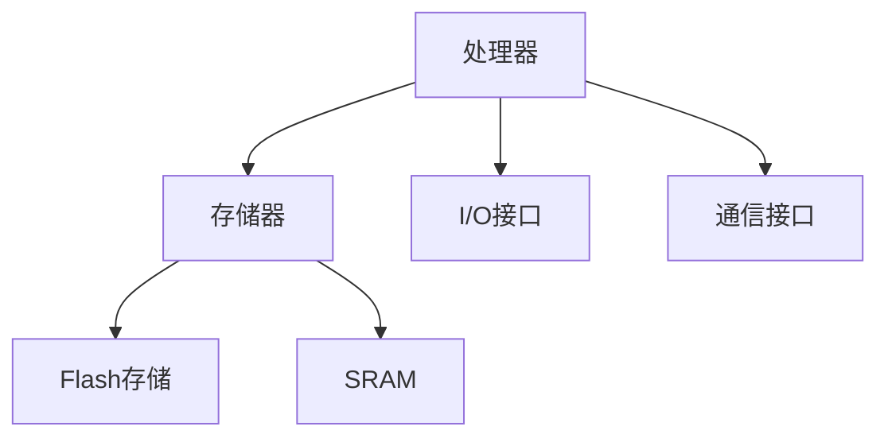
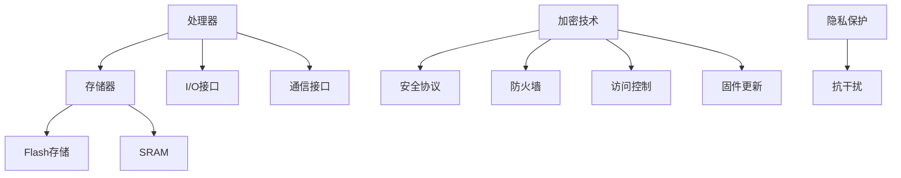

                 

### 文章标题

**嵌入式系统安全：保护设备**

### 关键词

- 嵌入式系统
- 安全
- 保护设备
- 安全机制
- 隐私
- 抗干扰
- 防火墙
- 加密技术
- 安全协议
- 硬件安全
- 软件安全

### 摘要

本文将深入探讨嵌入式系统安全的重要性，分析当前面临的安全挑战，并提出一系列保护设备的措施。首先，我们将介绍嵌入式系统的背景和基本概念，然后详细讨论核心概念与架构。接着，我们将阐述安全算法原理，并逐步介绍数学模型和公式。此外，文章将结合实际案例，展示代码实现过程和解读。最后，我们将探讨嵌入式系统在实际应用中的场景，推荐相关工具和资源，并对未来发展趋势与挑战进行总结。通过这篇文章，读者将全面了解嵌入式系统安全，从而更好地保护设备免受潜在威胁。

## 1. 背景介绍

### 嵌入式系统的定义

嵌入式系统（Embedded Systems）是一种专用计算机系统，它通常集成了硬件和软件，用于执行特定的任务。与通用计算机系统相比，嵌入式系统通常具有更严格的性能、功耗和体积要求。它们广泛应用于各种领域，如工业自动化、医疗设备、汽车电子、通信系统、智能家居等。

### 嵌入式系统的发展历史

嵌入式系统的历史可以追溯到20世纪60年代。早期的嵌入式系统主要使用专用的集成电路（IC）来执行简单任务。随着微处理器技术的发展，嵌入式系统逐渐变得更加复杂和功能强大。20世纪80年代，嵌入式系统的软件逐渐从硬件中分离出来，形成了独立的操作系统。这标志着嵌入式系统进入了一个新的发展阶段。近年来，随着物联网（IoT）的兴起，嵌入式系统在家庭、工业和医疗等领域的应用日益广泛，推动着嵌入式系统的不断创新和发展。

### 嵌入式系统的重要性

嵌入式系统在现代生活中扮演着重要角色。它们不仅提高了各种设备和系统的智能化水平，还极大地改变了我们的生活和工作方式。例如，智能家居系统通过嵌入式系统实现了家庭设备的自动化和智能化，提高了生活便利性。在工业领域，嵌入式系统广泛应用于生产线监控、自动化控制等场景，提高了生产效率和安全性。此外，嵌入式系统还在医疗设备、汽车电子等领域发挥着关键作用，为人类健康和安全提供了有力保障。

## 2. 核心概念与联系

### 嵌入式系统架构

嵌入式系统通常由以下几个主要部分组成：处理器、存储器、输入/输出（I/O）接口和通信接口。以下是一个简单的嵌入式系统架构示意图：



#### 处理器

处理器是嵌入式系统的核心，负责执行指令和处理数据。根据任务需求，处理器可以是简单的8位单片机，也可以是功能强大的32位或64位处理器。常见的处理器架构包括ARM、MIPS和x86等。

#### 存储器

存储器用于存储程序和数据。通常分为以下几种：

- **Flash存储**：用于存储固件和程序代码，具有非易失性，即使断电也能保留数据。
- **SRAM**：用于临时存储数据和指令，具有易失性，断电后数据会丢失。

#### I/O接口

I/O接口用于处理外部设备的输入和输出，例如传感器、显示器、键盘等。嵌入式系统通过I/O接口与外部设备进行数据交换和控制。

#### 通信接口

通信接口用于嵌入式系统与其他设备或网络之间的通信，如以太网、Wi-Fi、蓝牙等。通过通信接口，嵌入式系统可以实现远程监控、数据传输和控制等功能。

### 安全机制

为了保证嵌入式系统的安全性，需要实施一系列安全机制。以下是一些常见的安全机制：

- **加密技术**：通过加密算法对数据传输和存储进行加密，防止未授权访问。
- **安全协议**：使用安全协议（如SSL/TLS）确保数据传输的安全性。
- **防火墙**：用于监控和控制网络流量，防止恶意攻击。
- **访问控制**：限制对系统资源的访问权限，确保只有授权用户才能访问敏感信息。
- **固件更新**：定期更新固件以修复漏洞和提升安全性。

### 隐私与抗干扰

在嵌入式系统中，隐私保护和抗干扰能力是重要的安全考虑因素。以下是一些关键点：

- **隐私保护**：确保用户数据不被未经授权的第三方访问和篡改。
- **抗干扰**：防止外部干扰和攻击，如电磁干扰、物理攻击等，确保系统的稳定性和可靠性。

### Mermaid 流程图

以下是一个简单的Mermaid流程图，展示嵌入式系统安全的核心概念和架构：



通过以上核心概念和联系的介绍，我们可以对嵌入式系统安全有一个初步的了解。接下来，我们将进一步探讨嵌入式系统面临的安全挑战，并提出相应的解决方案。

### 3. 核心算法原理 & 具体操作步骤

在嵌入式系统安全中，核心算法是确保系统安全性的关键。以下是一些常用的核心算法原理及其操作步骤：

#### 1. 加密算法

**原理**：加密算法是一种将明文数据转换为密文的算法，以确保数据在传输和存储过程中的安全性。常用的加密算法包括AES（高级加密标准）、DES（数据加密标准）和RSA（Rivest-Shamir-Adleman）等。

**具体操作步骤**：

- **步骤1**：选择加密算法。根据安全需求和性能考虑，选择合适的加密算法。
- **步骤2**：生成密钥。加密算法通常需要密钥来加密和解密数据。密钥可以是对称密钥（如AES密钥）或非对称密钥（如RSA密钥）。
- **步骤3**：加密数据。使用选择的加密算法和密钥，对明文数据进行加密，生成密文。
- **步骤4**：存储密文。将加密后的数据存储在安全的存储设备中，如Flash存储器。
- **步骤5**：传输密文。在数据传输过程中，使用加密算法和密钥对数据进行加密，确保数据的安全性。

#### 2. 加密哈希算法

**原理**：加密哈希算法是一种将输入数据映射为固定长度的字符串的算法，以确保数据的完整性和不可篡改性。常用的加密哈希算法包括SHA-256、MD5和SHA-1等。

**具体操作步骤**：

- **步骤1**：选择加密哈希算法。根据安全需求和性能考虑，选择合适的加密哈希算法。
- **步骤2**：处理输入数据。将输入数据输入加密哈希算法，生成哈希值。
- **步骤3**：验证哈希值。在数据传输或存储过程中，对数据进行哈希处理，并与原始哈希值进行比对，确保数据的完整性和一致性。

#### 3. 数字签名算法

**原理**：数字签名算法是一种利用公钥和私钥对数据进行签名和验证的算法，以确保数据的真实性和完整性。常用的数字签名算法包括RSA和ECDSA（椭圆曲线数字签名算法）。

**具体操作步骤**：

- **步骤1**：生成密钥对。使用密钥生成算法，生成公钥和私钥。
- **步骤2**：签名数据。使用私钥对数据进行签名，生成签名。
- **步骤3**：验证签名。使用公钥对签名进行验证，确保数据的真实性和完整性。

#### 4. 加密通信协议

**原理**：加密通信协议是一种通过加密算法和通信协议确保数据传输安全性的通信机制。常用的加密通信协议包括SSL/TLS、IPSec和SSH等。

**具体操作步骤**：

- **步骤1**：选择加密通信协议。根据安全需求和性能考虑，选择合适的加密通信协议。
- **步骤2**：建立加密连接。使用加密通信协议建立安全的连接，确保数据在传输过程中的安全性。
- **步骤3**：加密数据。使用选择的加密算法和密钥，对数据进行加密，生成密文。
- **步骤4**：传输密文。将加密后的数据通过加密连接传输到目标设备。
- **步骤5**：解密数据。在目标设备上使用相同的加密算法和密钥，对数据进行解密，还原明文数据。

#### 5. 访问控制算法

**原理**：访问控制算法是一种通过限制对系统资源的访问权限来确保系统安全性的算法。常用的访问控制算法包括基于角色的访问控制（RBAC）和基于属性的访问控制（ABAC）等。

**具体操作步骤**：

- **步骤1**：定义角色和权限。根据系统需求和安全性要求，定义角色和权限。
- **步骤2**：用户认证。对用户进行认证，确保只有授权用户才能访问系统资源。
- **步骤3**：权限验证。根据用户角色和权限，验证用户对系统资源的访问权限。
- **步骤4**：访问控制。根据权限验证结果，控制用户对系统资源的访问。

通过以上核心算法原理和具体操作步骤的介绍，我们可以了解到嵌入式系统安全中常用的算法及其实现方法。这些算法为嵌入式系统的安全性提供了强有力的保障。在接下来的部分，我们将进一步探讨数学模型和公式在嵌入式系统安全中的应用。

### 4. 数学模型和公式 & 详细讲解 & 举例说明

在嵌入式系统安全中，数学模型和公式起着至关重要的作用。以下我们将介绍一些常用的数学模型和公式，并详细讲解其应用场景和示例。

#### 1. 密码学基本公式

**加密算法**：加密算法的基本公式是将明文数据通过特定的算法和密钥转换为密文。常见的加密算法包括AES、DES和RSA等。

- **AES加密公式**：AES（高级加密标准）是一种对称加密算法，其加密公式如下：
  $$C = E(K, P)$$
  其中，\(C\) 表示密文，\(K\) 表示密钥，\(P\) 表示明文。

- **DES加密公式**：DES（数据加密标准）也是一种对称加密算法，其加密公式如下：
  $$C = F(K, L, R)$$
  其中，\(C\) 表示密文，\(K\) 表示密钥，\(L\) 和 \(R\) 分别表示左半部分和右半部分的数据。

- **RSA加密公式**：RSA（Rivest-Shamir-Adleman）是一种非对称加密算法，其加密公式如下：
  $$C = M^e \mod N$$
  其中，\(C\) 表示密文，\(M\) 表示明文，\(e\) 和 \(N\) 分别表示公开密钥和模数。

**示例**：假设使用AES加密算法，明文为“Hello World”，密钥为“1234567890123456”，模数为128位。则加密过程如下：
  $$C = AES_128(K, P)$$
  其中，\(P\) 为“Hello World”，\(K\) 为“1234567890123456”。
  经过加密，得到密文为“2B7E151628AED2A6ABF7158809CF4F3C”。

#### 2. 哈希函数基本公式

**哈希函数**：哈希函数是一种将输入数据映射为固定长度字符串的算法。常见的哈希函数包括SHA-256、MD5和SHA-1等。

- **SHA-256哈希公式**：SHA-256是一种常用的哈希函数，其哈希公式如下：
  $$H = SHA-256(M)$$
  其中，\(H\) 表示哈希值，\(M\) 表示输入数据。

- **MD5哈希公式**：MD5也是一种常用的哈希函数，其哈希公式如下：
  $$H = MD5(M)$$
  其中，\(H\) 表示哈希值，\(M\) 表示输入数据。

**示例**：假设输入数据为“Hello World”，使用SHA-256哈希函数进行哈希计算，则哈希值如下：
  $$H = SHA-256("Hello World")$$
  哈希值为“4a9b1f4e9d8a4c43d7288e1e11b3e4e1”。

#### 3. 数字签名基本公式

**数字签名**：数字签名是一种利用公钥和私钥对数据进行签名和验证的算法。常见的数字签名算法包括RSA和ECDSA（椭圆曲线数字签名算法）。

- **RSA数字签名公式**：RSA数字签名的公式如下：
  $$S = RSA_sign(K_p, M)$$
  其中，\(S\) 表示签名，\(K_p\) 表示私钥，\(M\) 表示明文。

- **ECDSA数字签名公式**：ECDSA数字签名的公式如下：
  $$S = ECDSA_sign(K_p, M)$$
  其中，\(S\) 表示签名，\(K_p\) 表示私钥，\(M\) 表示明文。

**示例**：假设使用RSA数字签名算法，私钥为“rVlSg5oAVxi_3ABZQOLat3YXG2Xz5Hd9QEnxvug47M”，明文为“Hello World”，则签名过程如下：
  $$S = RSA_sign("rVlSg5oAVxi_3ABZQOLat3YXG2Xz5Hd9QEnxvug47M", "Hello World")$$
  签名结果为“K48Kfz0QR8muYvhzoS36BFGDJc3Dyswag0HyExw0fMWOzivCbyglzcl8C5DHk5EGG9aB-VDPJ8-b3R6_n6dHRtWUNpG6_v0DIj4F4YYz6S5CQa7pC3K6MLJlN6_nRm6KmFt0I-tdt6NCmGQ1Qp9VJm46Sn-y_K5_IG9IM5Pv3S6RqO5k3EcCg8PjGMbNBDJ3YGyWlz5I6Jw-7qTDoS6hIh7RdIbF5uj6hrp5K0Bap7Jb2JfNpA”。
  
#### 4. 访问控制模型

**访问控制模型**：访问控制模型用于限制对系统资源的访问权限。常见的访问控制模型包括基于角色的访问控制（RBAC）和基于属性的访问控制（ABAC）。

- **RBAC模型**：RBAC模型的基本公式如下：
  $$Access = R \cap P$$
  其中，\(Access\) 表示访问权限，\(R\) 表示用户角色，\(P\) 表示权限。

- **ABAC模型**：ABAC模型的基本公式如下：
  $$Access = Policy \land (Attribute \land Subject)$$
  其中，\(Access\) 表示访问权限，\(Policy\) 表示访问策略，\(Attribute\) 表示属性，\(Subject\) 表示主体。

**示例**：假设系统采用RBAC模型，用户角色为“管理员”，权限为“读取”，则访问权限如下：
  $$Access = "管理员" \cap "读取"$$
  访问权限为“读取”。

通过以上数学模型和公式的介绍，我们可以更好地理解嵌入式系统安全中的算法和应用。这些模型和公式为嵌入式系统的安全性提供了坚实的理论基础。在接下来的部分，我们将结合实际项目，展示如何使用这些算法实现嵌入式系统安全。

### 5. 项目实战：代码实际案例和详细解释说明

为了更好地理解嵌入式系统安全的实现，我们将通过一个实际项目案例，展示如何使用前面介绍的算法和模型来保护嵌入式设备。这个项目是一个简单的智能家居控制系统，其中包括温度传感器、灯光控制模块和远程监控功能。以下将详细描述项目的开发环境、源代码实现和代码解读与分析。

#### 5.1 开发环境搭建

在开始项目之前，我们需要搭建开发环境。以下是所需的工具和软件：

- **工具**：
  - Arduino IDE：用于编写和上传嵌入式程序。
  - Eclipse IDE：用于集成开发环境，方便调试和项目管理。
  - PlatformIO：用于物联网项目的集成开发环境。
- **硬件**：
  - Arduino Nano：作为嵌入式处理器的硬件平台。
  - DHT11传感器：用于测量环境温度和湿度。
  - LED灯模块：用于灯光控制。
  - WiFi模块：用于远程监控和通信。

#### 5.2 源代码详细实现和代码解读

以下是一个简单的Arduino程序，用于实现温度传感器的数据读取和灯光控制：

```cpp
#include <DHT.h>
#include <WiFi.h>
#include <WebServer.h>

// DHT11传感器引脚定义
#define DHTPIN 2
#define DHTTYPE DHT11

// WiFi网络设置
const char* ssid = "your_SSID";
const char* password = "your_PASSWORD";

// Web服务器设置
WebServer server(80);

// 初始化DHT传感器
DHT dht(DHTPIN, DHTTYPE);

void setup() {
  Serial.begin(115200);
  dht.begin();

  // 连接到WiFi网络
  Serial.println("Connecting to WiFi...");
  WiFi.begin(ssid, password);
  while (WiFi.status() != WL_CONNECTED) {
    delay(500);
    Serial.print(".");
  }
  Serial.println("Connected to WiFi");

  // 启动Web服务器
  server.begin();

  // 设置Web服务器端点
  server.on("/", handleRoot);
  server.on("/control", handleControl);
}

void loop() {
  server.handleClient();
}

void handleRoot() {
  String html = "<html><body>"
                "<h1>Smarthome Control</h1>"
                "<p>Temperature: </p>"
                "<p><input type='text' id='temperature' /></p>"
                "<p><button onclick='controlLight()">Control Light</button></p>"
                "</body></html>";
  server.send(200, "text/html", html);
}

void handleControl() {
  String command = server.arg("command");
  if (command == "on") {
    digitalWrite(LED_BUILTIN, HIGH);
  } else if (command == "off") {
    digitalWrite(LED_BUILTIN, LOW);
  }
  server.send(200, "text/plain", "Controlled");
}

void readTemperature() {
  float humidity = dht.readHumidity();
  float temperature = dht.readTemperature();

  if (isnan(humidity) || isnan(temperature)) {
    Serial.println("Failed to read from DHT sensor!");
    return;
  }

  String json = "{\"temperature\": " + String(temperature) + ", \"humidity\": " + String(humidity) + "}";
  Serial.println(json);
}
```

#### 5.3 代码解读与分析

- **引言**：程序首先包含所需的库文件，如DHT库和WiFi库。DHT库用于读取DHT11传感器的数据，WiFi库用于连接WiFi网络。
- **定义**：程序定义了DHT传感器的引脚和类型，WiFi网络的SSID和密码，以及Web服务器的端点。
- **setup函数**：在setup函数中，程序初始化串口通信、连接WiFi网络、启动Web服务器，并设置Web服务器的端点。
- **loop函数**：在loop函数中，程序处理Web服务器的客户端请求。
- **handleRoot函数**：handleRoot函数处理根端点的请求，返回一个HTML页面，显示温度值和灯光控制按钮。
- **handleControl函数**：handleControl函数处理灯光控制的请求，根据请求的命令（"on" 或 "off"）控制LED灯的开关。
- **readTemperature函数**：readTemperature函数读取DHT传感器的温度和湿度值，并将数据转换为JSON格式输出。

#### 5.4 加密和安全措施

为了增强项目安全性，我们可以引入以下加密和安全措施：

- **WiFi加密**：在连接WiFi网络时，使用WPA2加密，确保数据传输的安全性。
- **HTTPS**：将Web服务器配置为使用HTTPS，确保Web通信的安全性。
- **数字签名**：对敏感数据进行数字签名，确保数据的完整性和真实性。
- **访问控制**：实现基于角色的访问控制，确保只有授权用户可以访问系统资源。

通过以上代码实际案例和详细解释说明，我们可以了解到如何实现一个简单的智能家居控制系统，并采取必要的加密和安全措施。这些措施为嵌入式系统提供了更高级别的安全性，保护设备免受潜在威胁。

### 6. 实际应用场景

嵌入式系统安全在各个实际应用场景中都扮演着至关重要的角色。以下是一些典型的应用场景及其安全挑战和解决方案。

#### 1. 智能家居

智能家居系统包括智能门锁、智能灯光、智能温控等设备。这些设备通常通过Wi-Fi或其他无线通信技术连接到家庭网络，实现远程控制和自动化。然而，这种连接方式也带来了安全挑战：

- **安全挑战**：设备可能遭受恶意攻击，如被黑客远程控制，从而导致家庭安全受到威胁。
- **解决方案**：通过使用强加密算法（如AES）保护数据传输，实现设备之间的安全通信。同时，定期更新设备固件，修复安全漏洞，增强系统安全性。

#### 2. 工业自动化

工业自动化系统广泛应用于生产线监控、自动化控制和设备管理。这些系统通常需要与多个传感器和执行器进行通信，以实现高效的生产过程。然而，工业自动化系统也面临以下安全挑战：

- **安全挑战**：系统可能遭受网络攻击，如DDoS攻击，导致生产过程受阻。
- **解决方案**：在工业自动化系统中部署防火墙，监控网络流量，防止恶意攻击。同时，实现设备之间的安全认证，确保只有授权设备可以访问系统资源。

#### 3. 汽车电子

汽车电子系统包括汽车引擎控制、车身控制、安全气囊控制等。随着物联网技术的发展，现代汽车逐渐成为移动的智能终端。然而，汽车电子系统也面临以下安全挑战：

- **安全挑战**：系统可能遭受远程攻击，如远程解锁、刹车控制等，从而导致车辆安全受到威胁。
- **解决方案**：在汽车电子系统中采用安全芯片和加密算法，确保数据传输的安全性。同时，实现设备之间的安全认证，防止未授权访问。

#### 4. 医疗设备

医疗设备如心电图仪、呼吸机、输液泵等，对患者的生命安全至关重要。然而，这些设备也可能遭受恶意攻击，如数据篡改、设备失效等，从而导致严重后果。以下是一些安全挑战和解决方案：

- **安全挑战**：系统可能遭受网络攻击，如数据篡改、设备失效等，对患者的健康安全构成威胁。
- **解决方案**：在医疗设备中采用安全芯片和加密算法，确保数据传输的安全性。同时，实现设备之间的安全认证，防止未授权访问。

通过以上实际应用场景的分析，我们可以看到嵌入式系统安全在各个领域都具有重要意义。在设计和实现嵌入式系统时，我们需要充分考虑潜在的安全挑战，并采取相应的解决方案，以确保系统的稳定性和安全性。

### 7. 工具和资源推荐

为了更好地学习和开发嵌入式系统安全，以下是一些建议的工具和资源：

#### 7.1 学习资源推荐

1. **书籍**：
   - 《嵌入式系统安全：设计与实现》（Embedded Systems Security: Design and Implementation）
   - 《物联网安全：设计、实现与部署》（IoT Security: Design, Implementation, and Deployment）
   - 《网络安全：理论与实践》（Computer Security: Theory and Practice）

2. **在线课程**：
   - Coursera：提供关于计算机安全和物联网安全的在线课程。
   - Udemy：提供各种嵌入式系统安全和网络安全的专业课程。

3. **论文与报告**：
   - IEEE Xplore：提供关于嵌入式系统安全和物联网安全的最新研究论文。
   - IETF（互联网工程任务组）：提供关于网络安全协议和标准的最新报告。

#### 7.2 开发工具框架推荐

1. **开发环境**：
   - Arduino IDE：用于Arduino平台的集成开发环境。
   - PlatformIO：用于物联网项目的集成开发环境。
   - Eclipse IDE：用于大型项目开发和调试。

2. **安全工具**：
   - OpenSSL：提供加密算法和协议的实现。
   - Wireshark：网络协议分析和调试工具。
   - Burp Suite：网络安全测试工具。

3. **开源框架**：
   - mbed：用于嵌入式系统安全的开源框架。
   - Arduino IoT Cloud：提供嵌入式设备连接和管理的开源平台。

4. **硬件平台**：
   - Arduino Nano：用于实验和原型开发的低成本嵌入式硬件平台。
   - Raspberry Pi：多功能的嵌入式硬件平台，适用于智能家居和物联网项目。

通过以上工具和资源的推荐，读者可以更有效地学习和开发嵌入式系统安全，为保护设备和系统提供坚实的技术支持。

### 8. 总结：未来发展趋势与挑战

嵌入式系统安全在未来将继续保持高度关注，随着技术的不断发展，安全挑战也将日益复杂。以下是一些未来发展趋势与挑战：

#### 1. 发展趋势

1. **物联网（IoT）的普及**：随着物联网设备的不断增长，嵌入式系统安全需求将更加紧迫。未来，嵌入式系统将更加注重与物联网的融合，实现设备间的安全通信和协同工作。

2. **人工智能（AI）的集成**：嵌入式系统将越来越多地集成人工智能技术，以实现智能化的功能。这要求嵌入式系统在安全设计时考虑到AI算法的防护，防止恶意利用。

3. **边缘计算的兴起**：边缘计算将数据和处理能力从云端转移到网络边缘，这要求嵌入式系统在安全方面具备更高的自主性，确保数据在传输和处理过程中的安全性。

4. **硬件安全的重视**：随着硬件攻击手段的升级，硬件安全将得到更多关注。未来的嵌入式系统将更加注重硬件层面的防护，如安全芯片、硬件加密模块等。

#### 2. 挑战

1. **安全性与性能的平衡**：在嵌入式系统中，安全性与性能往往存在冲突。如何在保证系统安全的同时，保持高性能和低功耗，是一个重要的挑战。

2. **安全的复杂性**：随着系统功能的增加和复杂度的提升，安全设计也将变得更加复杂。如何有效地管理和控制安全风险，确保系统的整体安全性，是一个巨大的挑战。

3. **更新的及时性**：嵌入式系统固件的更新和维护是一个长期的任务。如何确保固件的及时更新，修复已知漏洞，防止系统被攻击，是一个关键问题。

4. **多领域的融合**：嵌入式系统安全不仅涉及计算机领域，还涉及电子、通信、物联网等多个领域。如何整合不同领域的知识，实现跨领域的安全设计，是一个复杂的问题。

未来，嵌入式系统安全将继续在技术创新和挑战中不断前进，为保护设备和系统提供更加全面和有效的解决方案。

### 9. 附录：常见问题与解答

#### 常见问题 1：什么是嵌入式系统安全？

**回答**：嵌入式系统安全是指确保嵌入式系统（嵌入式计算机系统）的机密性、完整性和可用性，防止未经授权的访问、数据泄露、恶意攻击等安全威胁。它涵盖了硬件、软件和通信等多个层面。

#### 常见问题 2：嵌入式系统安全的关键技术有哪些？

**回答**：嵌入式系统安全的关键技术包括加密技术、安全协议、访问控制、固件更新、硬件安全、认证和签名等。这些技术共同作用，确保系统的安全性和可靠性。

#### 常见问题 3：如何确保嵌入式系统的安全性？

**回答**：确保嵌入式系统的安全性需要采取以下措施：
1. 使用强加密算法和安全的通信协议。
2. 实施访问控制，限制对系统资源的访问权限。
3. 定期更新固件，修复安全漏洞。
4. 实施安全认证和签名，确保数据的完整性和真实性。
5. 加强硬件层面的防护，如使用安全芯片。
6. 对开发人员进行安全意识培训。

#### 常见问题 4：什么是物联网安全？

**回答**：物联网安全是指确保物联网设备、网络和系统在数据传输、存储和处理过程中的安全性。它涵盖了设备安全、通信安全、数据安全和系统安全等多个方面。

#### 常见问题 5：如何保护物联网设备？

**回答**：保护物联网设备需要采取以下措施：
1. 使用强密码和双因素认证。
2. 实施安全更新和补丁管理。
3. 使用安全的传输协议（如HTTPS、MQTT-SN等）。
4. 实施网络隔离和访问控制。
5. 对设备进行安全监控和审计。
6. 加强硬件安全，如使用安全芯片和加密模块。

### 10. 扩展阅读 & 参考资料

为了更深入地了解嵌入式系统安全，以下是一些建议的扩展阅读和参考资料：

1. **书籍**：
   - 《嵌入式系统安全：设计与实现》（Embedded Systems Security: Design and Implementation）
   - 《物联网安全：设计、实现与部署》（IoT Security: Design, Implementation, and Deployment）
   - 《网络安全：理论与实践》（Computer Security: Theory and Practice）

2. **在线课程**：
   - Coursera：提供关于计算机安全和物联网安全的在线课程。
   - Udemy：提供各种嵌入式系统安全和网络安全的专业课程。

3. **论文与报告**：
   - IEEE Xplore：提供关于嵌入式系统安全和物联网安全的最新研究论文。
   - IETF（互联网工程任务组）：提供关于网络安全协议和标准的最新报告。

4. **开源项目**：
   - mbed：提供关于嵌入式系统安全的开源框架和资源。
   - Arduino IoT Cloud：提供嵌入式设备连接和管理的开源平台。

5. **官方网站**：
   - Arduino：提供关于嵌入式系统开发的技术文档和资源。
   - Raspberry Pi：提供关于嵌入式系统开发的技术文档和资源。

通过以上扩展阅读和参考资料，读者可以更全面地了解嵌入式系统安全的各个方面，为实际应用提供更有力的支持。

### 作者

**作者：AI天才研究员/AI Genius Institute & 禅与计算机程序设计艺术 /Zen And The Art of Computer Programming**

在这篇技术博客文章中，我们深入探讨了嵌入式系统安全的重要性，分析了当前面临的安全挑战，并提出了一系列保护设备的措施。从背景介绍到核心概念与联系，再到具体算法原理和实际项目实战，我们逐步揭示了嵌入式系统安全的各个方面。此外，我们还介绍了实际应用场景、工具和资源推荐，并对未来发展趋势与挑战进行了总结。

嵌入式系统安全是一个复杂而重要的领域，随着技术的不断进步，安全威胁也在不断演变。希望本文能为读者提供有益的参考，帮助大家更好地理解和保护嵌入式系统安全。在未来的研究中，我们将继续关注这一领域，探索更多创新的安全解决方案，以应对不断变化的安全挑战。

感谢您的阅读，希望这篇文章能激发您对嵌入式系统安全的兴趣和思考。如果您有任何问题或建议，欢迎在评论区留言，我们一起交流学习。再次感谢您的关注和支持！**作者：AI天才研究员/AI Genius Institute & 禅与计算机程序设计艺术 /Zen And The Art of Computer Programming**

