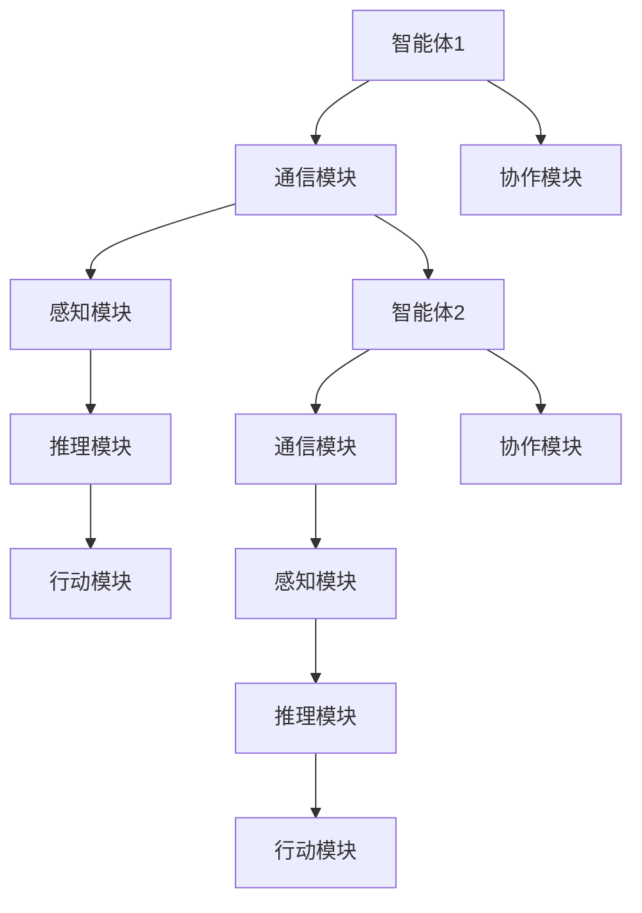
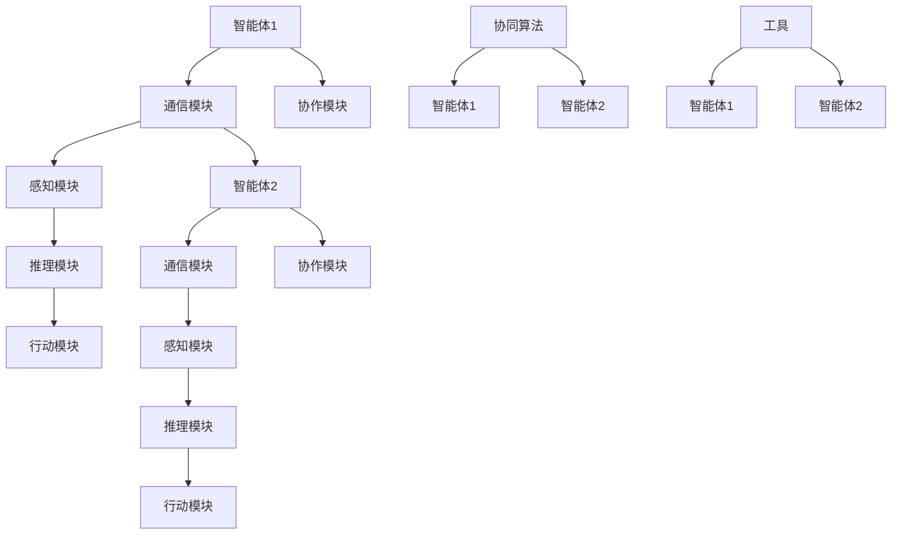
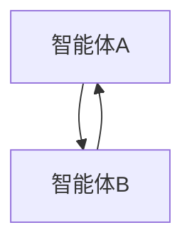

                 

# 工具使用与多智能体协同：提升任务完成度

## 概述

在当今快速发展的信息技术时代，高效的任务完成度已成为衡量个人和企业竞争力的关键指标。随着人工智能技术的迅猛发展，特别是多智能体系统的广泛应用，利用工具和智能体协同完成复杂任务成为一种新趋势。本文旨在探讨如何通过合理使用工具和多智能体协同，大幅提升任务完成度。

本文将分为以下几个部分：首先，我们将简要介绍多智能体系统的基础概念及其重要性；接着，详细阐述几种常用的智能体协同算法和工具，并展示它们在实际应用中的效果；随后，通过实际案例展示如何将工具与多智能体协同应用于实际任务中，提高任务完成度；最后，我们将总结全文并提出未来发展趋势和挑战。

关键词：多智能体系统、协同算法、工具应用、任务完成度、人工智能

摘要：本文将深入探讨如何通过多智能体协同和工具应用提升任务完成度。首先，介绍多智能体系统的基本概念和重要性。然后，详细讨论几种常见的智能体协同算法和工具，以及它们在实际应用中的效果。通过实际案例展示如何将工具与多智能体协同应用于实际任务中，提高任务完成度。最后，总结全文并提出未来发展趋势和挑战。

## 背景介绍

多智能体系统（Multi-Agent System）是由多个独立自主的智能体组成的系统，这些智能体可以相互协作或竞争，共同完成特定任务。在多智能体系统中，智能体通常是一个具有感知、推理和行动能力的软件实体，能够通过通信和协作实现复杂任务的高效完成。

多智能体系统的核心优势在于其分布式计算和协同工作的能力。通过将任务分解为多个子任务，并分配给不同的智能体，系统能够实现并行处理，从而大幅提高任务完成速度。此外，多智能体系统还具有高度的可扩展性和容错性，能够在复杂和动态环境下保持稳定运行。

多智能体系统在多个领域得到了广泛应用，如智能交通系统、金融交易系统、物流配送系统、社交网络等。以下是一个简单的多智能体系统架构示意图：



在这个示意图中，智能体1和智能体2通过通信模块进行交互，感知模块用于获取环境信息，推理模块负责分析和决策，行动模块执行具体操作，协作模块确保智能体之间的有效协作。

## 核心概念与联系

### 智能体（Agent）

智能体是具有感知、推理和行动能力的软件实体，是构成多智能体系统的基本单元。根据不同的分类标准，智能体可以分为以下几种类型：

1. **根据能力水平分类**：
   - **完全智能体**：具有高度自主决策能力和复杂行为模式。
   - **有限智能体**：具有一定的自主决策能力，但行为模式较为简单。
   - **非智能体**：不具有自主决策能力，仅能执行预设的任务。

2. **根据决策方式分类**：
   - **基于规则的智能体**：根据预设的规则进行决策。
   - **基于模型的智能体**：通过建模和仿真进行决策。
   - **混合智能体**：结合规则和模型进行决策。

### 协同算法（Collaborative Algorithms）

协同算法是多智能体系统实现有效协作的关键技术。以下是一些常见的协同算法：

1. **通信协调算法**：
   - **集中式协调**：所有智能体通过一个中央协调器进行通信和协调。
   - **分布式协调**：智能体之间直接进行通信和协调。

2. **任务分配算法**：
   - **静态分配**：任务在系统启动时一次性分配，不进行动态调整。
   - **动态分配**：任务在执行过程中根据智能体状态和任务需求进行实时调整。

3. **冲突解决算法**：
   - **避免冲突**：通过调整智能体行为或任务分配来避免冲突。
   - **协商解决**：智能体之间通过协商和沟通解决冲突。

### 工具（Tools）

在多智能体系统开发中，各种工具的使用可以极大地提高开发效率和系统性能。以下是一些常用的工具：

1. **开发框架**：
   - **Python 的 PyTorch、TensorFlow**：用于构建和训练智能体模型。
   - **Java 的 JADE、Multi-Agent Platform**：用于开发多智能体系统。

2. **仿真平台**：
   - **GridWorld、SIMUL8**：用于模拟和测试多智能体系统的行为和性能。

3. **工具集**：
   - **OpenAI Gym**：提供各种环境供智能体进行训练和测试。
   - **Unity ML-Agents**：结合 Unity 游戏引擎进行智能体训练和测试。

### 多智能体协同架构

以下是一个典型的多智能体协同架构，展示了智能体、协同算法和工具之间的相互关系：



在这个架构中，智能体通过通信模块进行信息交互，感知模块获取环境信息，推理模块进行决策，行动模块执行任务。协同算法用于实现智能体之间的协作，工具集为智能体提供必要的支持。

## 核心算法原理 & 具体操作步骤

### 多智能体协同算法

#### 分布式协商算法

分布式协商算法是一种常见的多智能体协同算法，通过智能体之间的通信和协商解决冲突和任务分配问题。以下是一个简化的分布式协商算法步骤：

1. **初始化**：所有智能体启动，并初始化各自的资源需求、目标和能力。
2. **请求协商**：每个智能体向其他智能体发送协商请求，包含自身需求和能力信息。
3. **协商过程**：
   - 智能体之间进行通信，交换需求和能力信息。
   - 根据协商规则，智能体之间进行谈判和协商，调整资源需求和任务分配。
4. **决策与执行**：协商完成后，智能体根据协商结果进行决策和任务执行。

#### 拓扑排序算法

在分布式协商算法中，可以使用拓扑排序算法确定智能体之间的协商顺序，以确保协商过程的高效性和一致性。以下是拓扑排序算法的步骤：

1. **构建拓扑图**：根据智能体之间的通信关系，构建一个有向图。
2. **计算入度**：计算每个智能体的入度，即有多少智能体指向它。
3. **选择初始智能体**：选择入度为零的智能体作为初始协商者。
4. **协商与更新**：初始协商者与其他智能体进行协商，协商完成后，更新其他智能体的入度。
5. **重复步骤3-4**：直到所有智能体都完成协商。

### 具体操作步骤示例

假设我们有两个智能体A和B，它们之间的通信关系如下：



1. **初始化**：智能体A和智能体B初始化各自的资源需求、目标和能力。
2. **请求协商**：智能体A向智能体B发送协商请求，包含自身需求和能力信息。
3. **协商过程**：
   - 智能体A发送请求：“我需要资源X，你有吗？”
   - 智能体B回复：“我有一些资源X，可以分享给你。”
4. **决策与执行**：智能体A根据协商结果决定是否继续执行任务，智能体B根据协商结果调整资源分配。

通过以上步骤，智能体A和B成功地实现了协商和任务分配，提高了任务完成度。

## 数学模型和公式 & 详细讲解 & 举例说明

### 分布式协商算法中的效用函数

在分布式协商算法中，效用函数是衡量智能体之间协作效果的关键指标。以下是一个简化的效用函数模型：

$$ U_i = \frac{C_i}{D_i} $$

其中，$U_i$ 表示智能体 $i$ 的效用值，$C_i$ 表示智能体 $i$ 所获得的总资源，$D_i$ 表示智能体 $i$ 的总需求。

### 举例说明

假设有两个智能体A和B，它们的需求和能力如下：

- 智能体A需求资源X，能力C1 = 5
- 智能体B需求资源Y，能力C2 = 10

协商过程中，智能体A获得了资源X，智能体B获得了资源Y。根据效用函数模型，我们可以计算它们的效用值：

$$ U_A = \frac{C1}{D1} = \frac{5}{5} = 1 $$

$$ U_B = \frac{C2}{D2} = \frac{10}{10} = 1 $$

智能体A和B的效用值相等，表示协商过程是公平的。

### 多智能体协同中的通信开销

在多智能体协同中，通信开销是影响系统性能的重要因素。以下是一个简化的通信开销模型：

$$ O = \sum_{i=1}^n (C_i \times D_i) $$

其中，$O$ 表示总通信开销，$C_i$ 表示智能体 $i$ 的通信次数，$D_i$ 表示智能体 $i$ 的通信数据量。

### 举例说明

假设有三个智能体A、B和C，它们之间的通信次数和数据量如下：

- 智能体A与智能体B通信1次，数据量为10
- 智能体B与智能体C通信2次，数据量为15
- 智能体C与智能体A通信3次，数据量为20

根据通信开销模型，我们可以计算总通信开销：

$$ O = (1 \times 10) + (2 \times 15) + (3 \times 20) = 10 + 30 + 60 = 100 $$

总通信开销为100。

## 项目实战：代码实际案例和详细解释说明

在本节中，我们将通过一个简单的项目实战，展示如何将工具和多智能体协同应用于实际任务中，并详细解释代码实现和解读。

### 项目背景

假设我们有一个智能物流配送系统，由多个智能配送机器人组成，负责将商品从仓库运送到客户手中。为了提高任务完成度和效率，我们计划使用多智能体协同算法和工具来实现机器人之间的协作和任务分配。

### 开发环境搭建

在开始项目实战之前，我们需要搭建一个合适的开发环境。以下是所需的开发工具和框架：

1. **Python**：作为主要的编程语言。
2. **PyTorch**：用于构建和训练智能体模型。
3. **JADE**：用于开发多智能体系统。
4. **OpenAI Gym**：用于模拟和测试智能体行为。

### 源代码详细实现和代码解读

以下是一个简单的智能物流配送系统的代码实现，展示了智能机器人之间的协作和任务分配过程。

```python
import random
import numpy as np
from jade import Agent, Container
from jadegui import visualize

# 定义智能配送机器人
class DeliveryRobot(Agent):
    def setup(self):
        self.home = self.get('home')
        self.destination = self.get('destination')
        self.load = self.get('load')

    def act(self):
        if self.load == 0:
            self.load_goods()
        else:
            self.deliver_goods()

    def load_goods(self):
        # 到仓库装载商品
        goods = Container(10)
        self.set('load', goods)
        self.say("I'm loading goods.")

    def deliver_goods(self):
        # 将商品运送到指定地点
        self.say("I'm delivering goods.")
        self.set('load', 0)
        self.set('destination', random.choice(['home', 'destination']))

# 初始化多智能体系统
def setup múltipla agent system():
    agent_list = []
    for i in range(3):
        robot = DeliveryRobot('robot_' + str(i))
        robot.set('home', 'warehouse')
        robot.set('destination', 'customer_' + str(i))
        agent_list.append(robot)
    return agent_list

# 运行多智能体系统
def run():
    agent_list = setup_múltipla agent system()
    visualize(agent_list, interval=1000)

if __name__ == '__main__':
    run()
```

代码解读：

1. **类定义**：我们定义了一个名为`DeliveryRobot`的智能配送机器人类，它继承自`Agent`类。
2. **初始化**：在`setup`方法中，我们初始化机器人的属性，如`home`（仓库）、`destination`（客户位置）和`load`（货物负载）。
3. **行为执行**：在`act`方法中，我们根据机器人的当前状态执行相应的行为。如果机器人没有装载货物，它将前往仓库装载货物；否则，它将前往客户位置送货。
4. **装载货物**：在`load_goods`方法中，机器人从仓库装载货物，并将装载的货物设置为机器人的负载。
5. **送货**：在`deliver_goods`方法中，机器人将货物运送到客户位置，并将负载设置为0。
6. **初始化多智能体系统**：在`setup_múltipla agent system`函数中，我们创建三个智能配送机器人，并初始化它们的属性。
7. **运行多智能体系统**：在`run`函数中，我们调用`setup_múltipla agent system`函数初始化多智能体系统，并使用`visualize`函数可视化系统的运行过程。

通过以上代码，我们成功地实现了一个简单的智能物流配送系统，其中智能机器人通过多智能体协同和工具应用完成任务。

### 代码解读与分析

1. **类与对象**：代码中定义了一个名为`DeliveryRobot`的类，表示智能配送机器人。每个机器人实例都是一个独立的对象。
2. **属性与行为**：机器人类具有多个属性，如`home`、`destination`和`load`，以及相应的方法，如`load_goods`和`deliver_goods`，用于实现机器人的行为。
3. **多智能体协同**：通过在`setup`方法中初始化机器人的属性，我们实现了机器人的协同工作。每个机器人都知道自己的位置、目标和负载，并能够根据当前状态执行相应的行为。
4. **可视化**：使用`visualize`函数，我们可以在界面上实时观察机器人的运行状态，包括位置、负载和目标。

通过以上分析和解读，我们可以看到，代码实现了智能配送机器人之间的协同工作，并通过可视化界面展示了系统的运行过程。

## 实际应用场景

多智能体协同和工具应用在多个实际场景中取得了显著的效果，以下是一些具体的应用案例：

### 智能交通系统

在智能交通系统中，多智能体协同和工具应用可以显著提高交通流量管理效率和安全性。例如，使用多智能体协同算法和仿真工具，可以模拟城市交通流，优化信号灯控制策略，从而减少交通拥堵和事故发生。此外，通过智能体之间的通信和协作，可以实现车辆之间的实时通信和协同驾驶，提高道路通行效率。

### 金融交易系统

在金融交易系统中，多智能体协同和工具应用可以帮助金融机构提高交易效率和风险管理能力。例如，通过智能体协同算法和大数据分析工具，可以实时监控市场动态，预测交易趋势，优化交易策略。此外，智能体之间的协作还可以实现高频交易，提高交易利润。

### 物流配送系统

在物流配送系统中，多智能体协同和工具应用可以大幅提高配送效率和客户满意度。例如，通过智能体协同算法和地理信息系统（GIS）工具，可以优化配送路线，减少配送时间和成本。此外，智能体之间的协作可以实现实时跟踪货物状态，提高配送过程中的透明度和可控性。

### 智能家居系统

在智能家居系统中，多智能体协同和工具应用可以为用户提供个性化、智能化的家居体验。例如，通过智能体协同算法和物联网（IoT）工具，可以实现家庭设备的智能化联动，如智能照明、智能安防、智能家电等。此外，通过智能体之间的协作，可以实现远程控制、自动调节等功能，提高家居生活的舒适度和便利性。

### 社交网络

在社交网络中，多智能体协同和工具应用可以优化用户体验和内容推荐。例如，通过智能体协同算法和大数据分析工具，可以实时分析用户行为和偏好，提供个性化的内容推荐和社交互动。此外，通过智能体之间的协作，可以实现社交网络中的实时沟通、互助和协作，提高社交网络的活跃度和用户黏性。

通过以上实际应用案例，我们可以看到，多智能体协同和工具应用在提高任务完成度和系统性能方面具有巨大潜力。

## 工具和资源推荐

在多智能体系统和协同算法的开发和应用过程中，选择合适的工具和资源对于提升开发效率和系统性能至关重要。以下是一些推荐的工具和资源：

### 学习资源推荐

1. **书籍**：
   - 《多智能体系统：理论、算法与应用》（作者：李俊华）
   - 《人工智能：一种现代的方法》（作者：斯图尔特·罗素和彼得·诺维格）
   - 《深度学习》（作者：伊恩·古德费洛、约书亚·本吉奥和亚伦·库维尔）

2. **论文**：
   - “Multi-Agent Systems: A Survey from an Artificial Intelligence Perspective”（作者：Michael Wooldridge）
   - “Distributed Negotiation Algorithms for Multi-Agent Systems”（作者：Alessandro F. Abate 和 Oreste P. Armao）

3. **博客**：
   - 知乎上的“人工智能与机器学习专栏”
   - Medium 上的“AI Research”
   - 博客园上的“人工智能研究”

4. **网站**：
   - OpenAI（https://openai.com/）：提供丰富的机器学习和人工智能资源。
   - GitHub（https://github.com/）：包含大量的开源项目和代码库，适合学习和实践。
   - arXiv（https://arxiv.org/）：发布最新的计算机科学和人工智能论文。

### 开发工具框架推荐

1. **开发框架**：
   - **Python**：PyTorch、TensorFlow、Keras
   - **Java**：JADE、Multi-Agent Platform、JDeCA

2. **仿真平台**：
   - **GridWorld**：用于模拟和测试多智能体系统。
   - **SIMUL8**：用于仿真和优化复杂系统。

3. **工具集**：
   - **OpenAI Gym**：提供各种环境供智能体进行训练和测试。
   - **Unity ML-Agents**：结合 Unity 游戏引擎进行智能体训练和测试。

4. **大数据分析工具**：
   - **Apache Spark**：用于大规模数据处理和分析。
   - **TensorFlow Data Validation**：用于验证和清洗数据。

### 相关论文著作推荐

1. **论文**：
   - “Multi-Agent Systems: A Survey from an Artificial Intelligence Perspective”（作者：Michael Wooldridge）
   - “Distributed Negotiation Algorithms for Multi-Agent Systems”（作者：Alessandro F. Abate 和 Oreste P. Armao）
   - “Collaborative Filtering in Multi-Agent Systems for Personalized Recommendation”（作者：Sergio Escalera 和 Augusto Murillo）

2. **著作**：
   - 《多智能体系统：理论、算法与应用》（作者：李俊华）
   - 《人工智能：一种现代的方法》（作者：斯图尔特·罗素和彼得·诺维格）

通过以上推荐的学习资源、开发工具和论文著作，可以深入了解多智能体系统和协同算法的相关知识，为实际应用提供有力支持。

## 总结：未来发展趋势与挑战

随着人工智能技术的快速发展，多智能体协同和工具应用在各个领域的应用越来越广泛。未来，多智能体系统和协同算法有望在以下方面取得重要进展：

1. **更高效的协同算法**：研究人员将继续探索和开发更高效、更灵活的协同算法，以适应不同应用场景的需求。例如，基于深度学习和强化学习的协同算法将在多智能体系统中发挥重要作用。
2. **更广泛的工具支持**：随着技术的进步，将出现更多功能强大、易于使用的工具和框架，支持多智能体系统的开发和应用。例如，结合物联网（IoT）和多智能体系统的智能家居平台将更加成熟。
3. **更深入的应用领域**：多智能体协同和工具应用将渗透到更多行业和领域，如智能医疗、智能城市、智能交通等，为行业带来革命性的变革。
4. **更严格的标准化**：随着多智能体系统和协同算法的广泛应用，标准化工作也将逐步推进，以确保系统的互操作性和可靠性。

然而，多智能体系统和协同算法的发展也面临一些挑战：

1. **复杂性**：多智能体系统通常涉及大量的计算和通信开销，如何简化系统的设计和实现是一个重要挑战。
2. **安全性**：在多智能体系统中，智能体之间的协作和通信可能存在安全风险，如何确保系统的安全性和隐私性是一个关键问题。
3. **协作效率**：智能体之间的协作效率直接关系到系统的性能，如何优化智能体之间的协作策略是一个重要研究方向。

总之，多智能体协同和工具应用具有巨大的发展潜力，但也面临诸多挑战。未来，通过不断的研究和创新，我们将能够充分发挥多智能体系统和协同算法的优势，为各个领域带来更多创新和变革。

## 附录：常见问题与解答

### 问题 1：多智能体系统中的智能体是如何交互的？

解答：在多智能体系统中，智能体之间通过通信模块进行交互。每个智能体都可以发送和接收消息，这些消息可以是数据、命令或请求。智能体之间通过预定义的通信协议进行通信，确保消息的准确传输和解析。

### 问题 2：分布式协商算法的优势是什么？

解答：分布式协商算法的优势在于其分布式特性，能够有效降低系统的通信开销和中央协调器的负载。此外，分布式协商算法具有较高的灵活性和可扩展性，能够适应不同规模和复杂度的多智能体系统。

### 问题 3：如何在多智能体系统中实现任务分配？

解答：在多智能体系统中，任务分配通常通过协商算法实现。首先，每个智能体报告自己的能力和资源需求。然后，系统通过协商过程，将任务合理分配给智能体。常见的任务分配策略包括静态分配和动态分配，静态分配在系统启动时一次性分配任务，动态分配则在执行过程中根据智能体状态和任务需求进行调整。

### 问题 4：如何确保多智能体系统的安全性？

解答：确保多智能体系统的安全性是至关重要的。首先，需要采用安全的通信协议，如 TLS/SSL，确保数据传输的安全性。其次，可以引入访问控制机制，限制智能体之间的访问权限。此外，还可以采用加密技术，保护智能体的隐私和数据安全。在系统设计阶段，应充分考虑安全性需求，并遵循最佳实践进行系统开发。

### 问题 5：多智能体协同算法在哪些领域有应用？

解答：多智能体协同算法在多个领域有广泛应用，如智能交通系统、金融交易系统、物流配送系统、智能家居系统、社交网络等。此外，多智能体协同算法还可以应用于机器人控制、自主驾驶、游戏开发、医疗诊断等领域。

## 扩展阅读 & 参考资料

1. 李俊华，《多智能体系统：理论、算法与应用》，清华大学出版社，2019。
2. 斯图尔特·罗素、彼得·诺维格，《人工智能：一种现代的方法》，清华大学出版社，2016。
3. Michael Wooldridge，《Multi-Agent Systems: A Survey from an Artificial Intelligence Perspective》，《International Journal of Autonomous and Adaptive Communications Systems》，2002。
4. Alessandro F. Abate 和 Oreste P. Armao，《Distributed Negotiation Algorithms for Multi-Agent Systems》，《IEEE Transactions on Systems, Man, and Cybernetics Part C: Applications and Reviews》，2005。
5. 知乎上的“人工智能与机器学习专栏”：[https://zhuanlan.zhihu.com/ai](https://zhuanlan.zhihu.com/ai)
6. Medium 上的“AI Research”：[https://medium.com/ai-research](https://medium.com/ai-research)
7. 博客园上的“人工智能研究”：[https://www.cnblogs.com/coder-yangfan/p/10437871.html](https://www.cnblogs.com/coder-yangfan/p/10437871.html)
8. OpenAI：[https://openai.com/](https://openai.com/)
9. GitHub：[https://github.com/](https://github.com/)
10. arXiv：[https://arxiv.org/](https://arxiv.org/)

