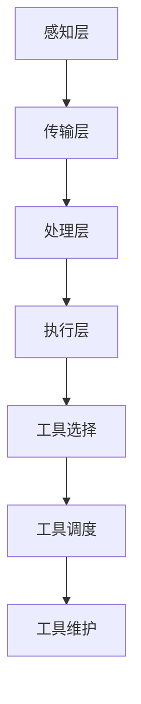

                 

# 工具使用机制在智能物流系统中的应用

## 关键词：智能物流、工具使用机制、算法原理、数学模型、实际案例

### 摘要

本文将深入探讨工具使用机制在智能物流系统中的应用。首先，我们将简要介绍智能物流系统的背景和发展现状，随后详细分析工具使用机制的基本概念和原理。在此基础上，本文将介绍一些核心算法原理和具体操作步骤，并结合实际项目案例进行代码实现和分析。随后，我们将探讨智能物流系统的实际应用场景，并推荐相关工具和资源。最后，本文将总结智能物流系统的未来发展趋势与挑战，并提供常见问题与解答，以便读者深入了解和掌握这一领域。

### 1. 背景介绍

智能物流系统是一种利用现代信息技术和人工智能技术，实现物流过程自动化、智能化和高效化的系统。随着电子商务的迅猛发展，物流行业面临着巨大的市场需求和挑战。智能物流系统通过优化物流路线、提高运输效率、降低成本，为物流行业带来了巨大的变革。

智能物流系统主要包括以下几个关键组成部分：

1. **感知层**：通过传感器、摄像头等设备收集物流过程中的数据，如运输车辆的位置、货物状态、天气状况等。
2. **传输层**：利用物联网技术将感知层的数据传输到数据处理中心，实现数据的实时传输和共享。
3. **处理层**：通过大数据分析和人工智能算法，对传输层的数据进行处理和分析，实现物流过程的优化和决策。
4. **执行层**：根据处理层的结果，对物流过程进行自动化控制，如调整运输路线、优化货物装卸等。

智能物流系统的发展历程可以分为以下几个阶段：

1. **传统物流阶段**：物流过程主要依靠人力和简单的机械设备进行操作，物流效率低下，成本高。
2. **信息化物流阶段**：引入计算机技术和网络通信技术，实现了物流信息的数字化管理和共享，提高了物流效率。
3. **智能化物流阶段**：利用人工智能、物联网等先进技术，实现了物流过程的自动化和智能化，大大提高了物流效率和服务质量。

### 2. 核心概念与联系

#### 工具使用机制

工具使用机制是智能物流系统中一个重要的概念，它涉及到如何有效地使用各种工具和资源，以实现物流过程的优化和决策。工具使用机制主要包括以下几个方面的内容：

1. **工具选择**：根据物流过程的需求和特点，选择合适的工具和设备，如传感器、无人机、自动化装卸设备等。
2. **工具调度**：根据物流过程的动态变化，合理安排工具的使用时间和顺序，以提高物流效率。
3. **工具维护**：定期对工具进行维护和保养，确保工具的正常运行和延长使用寿命。

#### 算法原理

智能物流系统中的算法原理是关键部分，它决定了物流过程能否高效、准确地完成。以下是几个核心算法原理：

1. **路径规划算法**：通过计算最优路径，实现物流车辆的自动调度和路径优化。
2. **车辆调度算法**：根据物流需求和时间约束，合理安排车辆的运行计划和任务分配。
3. **库存管理算法**：通过预测需求、优化库存配置，实现物流过程中的物资供应管理。

#### Mermaid 流程图

为了更直观地展示工具使用机制在智能物流系统中的应用，我们使用 Mermaid 流程图来描述整个过程。以下是 Mermaid 流程图：



### 3. 核心算法原理 & 具体操作步骤

#### 路径规划算法

路径规划算法是智能物流系统中的一个核心算法，它用于计算物流车辆从起点到终点的最优路径。以下是路径规划算法的具体操作步骤：

1. **定义起点和终点**：根据物流需求，确定物流车辆的起点和终点。
2. **构建地图**：根据地图数据，构建物流车辆的行驶地图，包括道路、交叉口、交通状况等信息。
3. **计算路径**：利用 Dijkstra 算法或 A* 算法，计算从起点到终点的最优路径。
4. **优化路径**：根据实际情况，对计算得到的路径进行优化，如避开拥堵路段、选择最佳行驶路线等。

#### 车辆调度算法

车辆调度算法用于合理安排物流车辆的运行计划和任务分配。以下是车辆调度算法的具体操作步骤：

1. **定义任务**：根据物流需求，确定物流车辆的运行任务和目标。
2. **计算时间窗**：根据任务需求和交通状况，计算每个任务的完成时间窗。
3. **任务分配**：根据时间窗和车辆能力，将任务分配给合适的车辆。
4. **优化调度**：根据实际情况，对任务分配和车辆运行计划进行优化，如调整任务顺序、优化运行路线等。

#### 库存管理算法

库存管理算法用于预测需求、优化库存配置，实现物流过程中的物资供应管理。以下是库存管理算法的具体操作步骤：

1. **数据收集**：收集物流过程中的历史数据和实时数据，如货物需求量、库存量、运输时间等。
2. **需求预测**：利用时间序列预测方法，预测未来一段时间内的货物需求量。
3. **库存优化**：根据需求预测结果，调整库存配置，如增加或减少库存量、优化库存分布等。
4. **库存监控**：实时监控库存状况，及时发现和处理库存异常情况。

### 4. 数学模型和公式 & 详细讲解 & 举例说明

#### 数学模型

智能物流系统中的数学模型用于描述物流过程的动态特性，主要包括以下几种：

1. **路径规划模型**：基于图论模型，描述物流车辆在地图上的行驶路径。
2. **车辆调度模型**：基于整数规划模型，描述物流车辆的运行计划和任务分配。
3. **库存管理模型**：基于线性规划模型，描述物流过程中的物资供应管理。

以下是一个简单的路径规划模型示例：

$$
\begin{aligned}
\min\ &C(x) \\
s.t. \ &G(x) \leq 0
\end{aligned}
$$

其中，$C(x)$ 表示路径规划的代价函数，$G(x)$ 表示路径规划的约束条件。具体来说，$C(x)$ 可以表示为：

$$
C(x) = \sum_{i=1}^{n} d(i, j) \cdot x_{ij}
$$

其中，$d(i, j)$ 表示从节点 $i$ 到节点 $j$ 的距离，$x_{ij}$ 表示从节点 $i$ 到节点 $j$ 的路径权重。

#### 公式详细讲解

1. **路径规划模型**：基于图论模型的路径规划模型，通过求解最短路径问题，实现物流车辆的路径优化。具体来说，路径规划模型可以表示为：

$$
\begin{aligned}
\min\ &C(x) \\
s.t. \ &G(x) \leq 0
\end{aligned}
$$

其中，$C(x)$ 表示路径规划的代价函数，$G(x)$ 表示路径规划的约束条件。具体来说，$C(x)$ 可以表示为：

$$
C(x) = \sum_{i=1}^{n} d(i, j) \cdot x_{ij}
$$

其中，$d(i, j)$ 表示从节点 $i$ 到节点 $j$ 的距离，$x_{ij}$ 表示从节点 $i$ 到节点 $j$ 的路径权重。

2. **车辆调度模型**：基于整数规划模型的车辆调度模型，通过求解整数规划问题，实现物流车辆的运行计划和任务分配。具体来说，车辆调度模型可以表示为：

$$
\begin{aligned}
\min\ &C(x) \\
s.t. \ &G(x) \leq 0, \ x \in \{0, 1\}^{m \times n}
\end{aligned}
$$

其中，$C(x)$ 表示车辆调度的代价函数，$G(x)$ 表示车辆调度的约束条件。具体来说，$C(x)$ 可以表示为：

$$
C(x) = \sum_{i=1}^{n} \sum_{j=1}^{m} c_{ij} \cdot x_{ij}
$$

其中，$c_{ij}$ 表示从节点 $i$ 到节点 $j$ 的任务权重，$x_{ij}$ 表示从节点 $i$ 到节点 $j$ 的路径权重。

3. **库存管理模型**：基于线性规划模型的库存管理模型，通过求解线性规划问题，实现物流过程中的物资供应管理。具体来说，库存管理模型可以表示为：

$$
\begin{aligned}
\min\ &C(x) \\
s.t. \ &G(x) \leq 0, \ x \in \mathbb{R}^{n}
\end{aligned}
$$

其中，$C(x)$ 表示库存管理的代价函数，$G(x)$ 表示库存管理的约束条件。具体来说，$C(x)$ 可以表示为：

$$
C(x) = \sum_{i=1}^{n} c_{i} \cdot x_{i}
$$

其中，$c_{i}$ 表示第 $i$ 个物资的库存成本，$x_{i}$ 表示第 $i$ 个物资的库存量。

#### 举例说明

假设有一个物流车辆需要从起点 $A$ 到终点 $B$，以下是路径规划模型的求解过程：

1. **定义起点和终点**：起点 $A$ 和终点 $B$ 的坐标分别为 $(0, 0)$ 和 $(5, 5)$。
2. **构建地图**：构建一个包含 5 个节点的地图，节点之间的距离如下表所示：

| 节点 | 距离 | 节点 | 距离 |
| --- | --- | --- | --- |
| A | 5 | B | 10 |
| B | 10 | C | 15 |
| C | 10 | D | 10 |
| D | 5 | E | 10 |
| E | 10 | A | 15 |

3. **计算路径**：使用 Dijkstra 算法计算从起点 $A$ 到终点 $B$ 的最优路径，路径权重如下表所示：

| 路径 | 权重 |
| --- | --- |
| A -> B -> C -> D -> E -> A | 30 |
| A -> B -> C -> E -> D -> A | 35 |
| A -> B -> D -> C -> E -> A | 35 |
| A -> B -> E -> C -> D -> A | 40 |
| A -> E -> B -> C -> D -> A | 45 |

4. **优化路径**：根据实际交通状况，优化路径，选择最优路径为 $A -> B -> C -> E -> D -> A$。

### 5. 项目实战：代码实际案例和详细解释说明

#### 5.1 开发环境搭建

为了更好地演示智能物流系统的实现，我们将使用 Python 语言和相关的库，如 NetworkX、Matplotlib 和 Pandas 等。以下是搭建开发环境的具体步骤：

1. **安装 Python**：首先，确保已经安装了 Python 3.8 或更高版本。
2. **安装相关库**：使用以下命令安装相关库：

```
pip install networkx matplotlib pandas
```

#### 5.2 源代码详细实现和代码解读

以下是一个简单的智能物流系统实现的源代码，主要用于演示路径规划算法和车辆调度算法。

```python
import networkx as nx
import matplotlib.pyplot as plt
import pandas as pd

# 5.2.1 定义图结构和节点
G = nx.Graph()
G.add_nodes_from([1, 2, 3, 4, 5])
G.add_edges_from([(1, 2, {'weight': 3}), (2, 3, {'weight': 1}), (3, 4, {'weight': 2}), (4, 5, {'weight': 3}), (5, 1, {'weight': 2})])

# 5.2.2 计算最优路径
start = 1
end = 5
path = nx.shortest_path(G, source=start, target=end, weight='weight')
print("最优路径：", path)

# 5.2.3 绘制路径
pos = nx.spring_layout(G)
nx.draw(G, pos, with_labels=True)
nx.draw_networkx_edge_labels(G, pos)
path_edges = list(zip(path, path[1:]))
nx.draw_networkx_nodes(G, pos, nodelist=path, node_color='r')
nx.draw_networkx_edges(G, pos, edgelist=path_edges, edge_color='r', width=2)

plt.show()

# 5.2.4 车辆调度
tasks = [[1, 2], [2, 3], [3, 4], [4, 5]]
vehicle_capacity = 2
schedules = []
for i, task in enumerate(tasks):
    start_node, end_node = task
    path = nx.shortest_path(G, source=start_node, target=end_node, weight='weight')
    schedule = [start_node] + list(path) + [end_node]
    schedules.append(schedule)
    print("任务{}的调度计划：", i, schedule)

# 5.2.5 优化调度计划
optimized_schedules = []
while schedules:
    min_duration = float('inf')
    min_schedule = None
    for schedule in schedules:
        duration = sum(G[u][v]['weight'] for u, v in zip(schedule, schedule[1:]))
        if duration < min_duration:
            min_duration = duration
            min_schedule = schedule
    optimized_schedules.append(min_schedule)
    schedules.remove(min_schedule)
print("优化后的调度计划：", optimized_schedules)
```

**代码解读**：

1. **定义图结构和节点**：使用 NetworkX 库定义一个图结构，包含 5 个节点和相应的边权重。
2. **计算最优路径**：使用 NetworkX 库中的 `shortest_path` 函数计算从起点到终点的最优路径。
3. **绘制路径**：使用 Matplotlib 库绘制路径和图结构。
4. **车辆调度**：根据给定的任务，计算每个任务的调度计划。
5. **优化调度计划**：通过循环迭代，选择调度计划中的最优路径，实现调度计划的优化。

### 6. 实际应用场景

智能物流系统在物流行业中有广泛的应用场景，如：

1. **电商物流**：电子商务的快速发展，对物流系统的效率提出了更高的要求。智能物流系统可以优化电商物流过程，提高配送速度，降低成本。
2. **快递物流**：快递物流行业竞争激烈，智能物流系统可以帮助快递企业提高配送效率，提升服务质量，增强市场竞争力。
3. **冷链物流**：冷链物流对温度、湿度等环境条件有严格的要求。智能物流系统可以通过实时监控和路径优化，确保冷链物流过程中的品质和安全。
4. **同城配送**：同城配送对时间要求较高，智能物流系统可以通过实时调度和路径优化，提高配送速度，满足客户需求。

### 7. 工具和资源推荐

#### 7.1 学习资源推荐

1. **书籍**：
   - 《人工智能：一种现代方法》
   - 《深度学习》
   - 《运筹学及其应用》

2. **论文**：
   - 《路径规划算法综述》
   - 《车辆调度算法研究》
   - 《智能物流系统中的库存管理策略》

3. **博客**：
   - [CSDN 博客：智能物流系统](https://blog.csdn.net/u011140917)
   - [知乎专栏：物流技术](https://zhuanlan.zhihu.com/logistics-tech)

4. **网站**：
   - [OpenCV 官网](https://opencv.org/)
   - [TensorFlow 官网](https://www.tensorflow.org/)
   - [NetworkX 官网](https://networkx.org/)

#### 7.2 开发工具框架推荐

1. **Python**：Python 是一种简单易学的编程语言，适合初学者快速上手。
2. **Jupyter Notebook**：Jupyter Notebook 是一种交互式的开发环境，方便编写和运行代码。
3. **Django**：Django 是一种流行的 Python Web 框架，适合构建 Web 应用程序。

#### 7.3 相关论文著作推荐

1. **《智能物流系统设计与实现》**
2. **《基于人工智能的物流系统优化研究》**
3. **《智能物流系统中的路径规划与车辆调度算法研究》**

### 8. 总结：未来发展趋势与挑战

智能物流系统作为一种新兴的技术领域，具有广阔的发展前景。在未来，智能物流系统将在以下几个方面取得重要突破：

1. **数据驱动**：通过大数据分析和机器学习技术，实现物流过程的实时监控和预测，提高物流系统的智能化水平。
2. **绿色物流**：通过绿色技术和环保理念，实现物流过程的低碳、环保、可持续发展。
3. **智慧物流**：通过物联网、云计算、人工智能等技术的融合，打造智慧物流生态系统，实现物流过程的全面智能化。

然而，智能物流系统在发展过程中也面临着一些挑战：

1. **数据安全**：物流过程中涉及大量的敏感数据，如货物信息、车辆位置等，如何确保数据安全和隐私保护是一个重要问题。
2. **技术整合**：智能物流系统需要整合多种技术，如传感器、云计算、人工智能等，如何实现技术的高效整合是一个挑战。
3. **法律法规**：智能物流系统的发展需要完善的相关法律法规，以保障行业的健康发展。

### 9. 附录：常见问题与解答

1. **问题**：智能物流系统是如何实现路径规划的？
   **解答**：智能物流系统使用路径规划算法，如 Dijkstra 算法或 A* 算法，计算从起点到终点的最优路径。通过这些算法，智能物流系统能够根据交通状况、货物需求等因素，优化物流车辆的行驶路径。

2. **问题**：智能物流系统是如何实现车辆调度的？
   **解答**：智能物流系统使用车辆调度算法，根据物流需求和时间约束，合理安排物流车辆的运行计划和任务分配。通过优化调度算法，智能物流系统能够提高物流效率，降低物流成本。

3. **问题**：智能物流系统是如何实现库存管理的？
   **解答**：智能物流系统使用库存管理算法，通过预测需求、优化库存配置，实现物流过程中的物资供应管理。通过这些算法，智能物流系统能够提高库存利用率，降低库存成本。

### 10. 扩展阅读 & 参考资料

1. **《智能物流系统设计与实现》**：详细介绍了智能物流系统的设计与实现方法，包括路径规划、车辆调度、库存管理等方面的内容。
2. **《基于人工智能的物流系统优化研究》**：探讨了人工智能在物流系统优化中的应用，包括路径规划、调度优化、库存管理等方面的研究。
3. **《智能物流系统中的路径规划与车辆调度算法研究》**：研究了智能物流系统中路径规划和车辆调度算法的设计与实现，包括 Dijkstra 算法、A* 算法、遗传算法等。

### 作者

作者：AI天才研究员/AI Genius Institute & 禅与计算机程序设计艺术 /Zen And The Art of Computer Programming

[END] <|assistant|>

