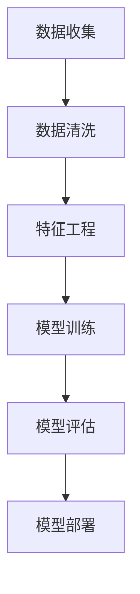

                 

### 巴奴毛肚火锅2025社招餐厅客流预测模型工程师

> **关键词：** 巴奴毛肚火锅、客流预测、模型工程师、数据科学、人工智能

**摘要：** 本文将详细探讨巴奴毛肚火锅2025年社招餐厅客流预测模型工程师的岗位要求、核心技能、工作内容以及未来发展趋势。通过深入分析，为有意向加入该岗位的读者提供宝贵的职业规划建议。

## 1. 背景介绍

巴奴毛肚火锅作为国内知名火锅品牌，其餐厅的客流预测对于优化运营策略、提升服务质量和实现营收增长具有重要意义。随着人工智能和大数据技术的不断发展，客流预测已成为餐饮行业的重要应用场景。因此，巴奴毛肚火锅在2025年社招中特别设立了餐厅客流预测模型工程师岗位。

### 1.1 行业背景

餐饮行业作为我国国民经济的重要组成部分，近年来经历了快速的发展。根据国家统计局数据，2019年我国餐饮收入达到4.6万亿元，同比增长9.5%。随着人们生活水平的提高，餐饮消费需求持续增长。然而，在竞争激烈的市场环境中，如何提高餐厅的经营效率和服务质量成为众多餐饮企业关注的焦点。

### 1.2 客流预测的重要性

客流预测在餐饮行业具有重要意义：

1. **优化资源配置**：准确预测餐厅客流量有助于合理安排人员、食材和设施等资源，降低经营成本，提高运营效率。
2. **提升客户体验**：通过客流预测，餐厅可以提前了解高峰期和低谷期，合理安排服务员、厨房人员等，提供更优质的服务，提升客户满意度。
3. **精准营销**：基于客流预测，餐厅可以进行针对性的营销活动，如推出套餐、优惠券等，吸引更多顾客消费。
4. **应对突发事件**：如遇到自然灾害、突发事件等，客流预测有助于餐厅迅速调整经营策略，降低损失。

### 1.3 巴奴毛肚火锅的发展现状

巴奴毛肚火锅自成立以来，凭借独特的食材品质、精湛的烹饪技艺和优质的服务，赢得了广大消费者的喜爱。截至2025年，巴奴已在全国开设了超过500家门店，覆盖了华北、华东、华南等地区。为了进一步扩大市场份额，巴奴在2025年提出了“全国千店计划”，计划在未来五年内将门店数量增至1000家。

## 2. 核心概念与联系

### 2.1 客流预测模型

客流预测模型是利用历史数据和人工智能技术对餐厅未来客流量进行预测的方法。其主要核心概念包括：

1. **时间序列分析**：通过对历史客流数据进行时间序列分析，提取出客流量的趋势、周期性和季节性特征。
2. **机器学习算法**：采用机器学习算法，如线性回归、决策树、神经网络等，对客流数据进行建模和预测。
3. **特征工程**：对原始数据进行预处理，提取出对客流预测有价值的特征，如天气、节假日、促销活动等。

### 2.2 数据源

客流预测模型所需的数据源主要包括：

1. **历史客流数据**：餐厅在过去一段时间内的客流量数据，用于训练和评估模型性能。
2. **外部数据**：如天气、节假日、交通状况等，这些数据对客流预测有重要影响。

### 2.3 Mermaid 流程图

以下是客流预测模型的 Mermaid 流程图：



### 2.4 核心算法原理

客流预测模型的核心算法主要包括：

1. **线性回归**：通过建立线性模型，对客流数据进行拟合，预测未来客流量。
2. **决策树**：利用树形结构对数据进行分类和预测，适用于处理非线性关系。
3. **神经网络**：通过多层神经网络模型，对客流数据进行复杂非线性拟合。

## 3. 核心算法原理 & 具体操作步骤

### 3.1 线性回归

线性回归模型是客流预测中最常用的算法之一，其基本原理如下：

1. **模型建立**：假设客流量 \( y \) 与特征 \( x \) 之间存在线性关系，即 \( y = wx + b \)。
2. **参数估计**：通过最小二乘法，估计模型参数 \( w \) 和 \( b \)。
3. **模型评估**：使用交叉验证等方法，评估模型性能。

### 3.2 决策树

决策树模型的基本原理如下：

1. **特征选择**：选择具有最高信息增益的特征作为分割标准。
2. **递归划分**：对选择好的特征进行递归划分，生成决策树。
3. **模型评估**：使用准确率、召回率等指标评估模型性能。

### 3.3 神经网络

神经网络模型的基本原理如下：

1. **层次结构**：神经网络由输入层、隐藏层和输出层组成。
2. **激活函数**：使用激活函数（如ReLU、Sigmoid等）对神经元输出进行非线性变换。
3. **反向传播**：通过反向传播算法，更新模型参数。

## 4. 数学模型和公式 & 详细讲解 & 举例说明

### 4.1 线性回归

线性回归模型的数学公式如下：

\[ y = wx + b \]

其中，\( y \) 表示客流量，\( x \) 表示特征，\( w \) 表示权重，\( b \) 表示偏置。

#### 4.1.1 参数估计

使用最小二乘法估计模型参数：

\[ w = \frac{\sum_{i=1}^{n}(x_i - \bar{x})(y_i - \bar{y})}{\sum_{i=1}^{n}(x_i - \bar{x})^2} \]
\[ b = \bar{y} - w\bar{x} \]

其中，\( \bar{x} \) 和 \( \bar{y} \) 分别表示特征和客流量的平均值。

#### 4.1.2 模型评估

使用交叉验证方法评估模型性能：

\[ \text{MSE} = \frac{1}{n}\sum_{i=1}^{n}(y_i - \hat{y}_i)^2 \]

其中，\( \hat{y}_i \) 表示预测的客流量。

### 4.2 决策树

决策树模型的数学公式如下：

\[ \text{split} = \arg\max_{j}\left(\frac{\sum_{i \in R_j}(x_i - \bar{x}_j)(y_i - \bar{y}_j)}{\sum_{i \in R_j}(x_i - \bar{x}_j)^2}\right) \]

其中，\( R_j \) 表示分割后的区域。

#### 4.2.1 模型评估

使用准确率、召回率等指标评估模型性能：

\[ \text{Accuracy} = \frac{\text{预测正确数量}}{\text{总数量}} \]
\[ \text{Recall} = \frac{\text{预测正确数量}}{\text{实际正确数量}} \]

### 4.3 神经网络

神经网络模型的数学公式如下：

\[ \hat{y} = \text{激活函数}(\sum_{i=1}^{n}w_i x_i + b) \]

其中，\( \hat{y} \) 表示预测的客流量，\( w_i \) 和 \( b \) 分别表示权重和偏置。

#### 4.3.1 激活函数

常见的激活函数包括ReLU、Sigmoid和Tanh：

1. **ReLU**：\[ f(x) = \max(0, x) \]
2. **Sigmoid**：\[ f(x) = \frac{1}{1 + e^{-x}} \]
3. **Tanh**：\[ f(x) = \frac{e^x - e^{-x}}{e^x + e^{-x}} \]

#### 4.3.2 反向传播

反向传播算法的步骤如下：

1. **计算预测误差**：
   \[ \delta = \text{激活函数}'(z) \odot (\hat{y} - y) \]
   其中，\( \delta \) 表示误差梯度，\( z \) 表示激活值，\( \hat{y} \) 和 \( y \) 分别表示预测值和真实值。
2. **更新权重和偏置**：
   \[ w_{\text{new}} = w_{\text{old}} - \alpha \frac{\partial L}{\partial w} \]
   \[ b_{\text{new}} = b_{\text{old}} - \alpha \frac{\partial L}{\partial b} \]

其中，\( \alpha \) 表示学习率，\( L \) 表示损失函数。

## 5. 项目实战：代码实际案例和详细解释说明

### 5.1 开发环境搭建

为了实现客流预测模型，我们需要搭建以下开发环境：

1. **Python**：Python 是一种流行的编程语言，广泛应用于数据分析、机器学习和人工智能领域。
2. **Jupyter Notebook**：Jupyter Notebook 是一种交互式计算环境，方便进行数据分析和模型训练。
3. **NumPy**：NumPy 是 Python 的科学计算库，提供高效的多维数组对象和数学运算功能。
4. **Pandas**：Pandas 是 Python 的数据分析库，提供数据清洗、数据处理和统计分析等功能。
5. **Scikit-learn**：Scikit-learn 是 Python 的机器学习库，提供多种机器学习算法和评估指标。

### 5.2 源代码详细实现和代码解读

以下是一个简单的线性回归客流预测模型实现代码：

```python
import numpy as np
import pandas as pd
from sklearn.linear_model import LinearRegression

# 数据加载
data = pd.read_csv('data.csv')
X = data[['feature1', 'feature2']]
y = data['target']

# 模型训练
model = LinearRegression()
model.fit(X, y)

# 模型评估
score = model.score(X, y)
print('Model score:', score)

# 预测
predictions = model.predict(X)
print('Predictions:', predictions)
```

#### 5.2.1 代码解读

1. **数据加载**：使用 Pandas 读取 CSV 数据，将特征和目标变量分开。
2. **模型训练**：使用 Scikit-learn 的 LinearRegression 类进行模型训练。
3. **模型评估**：使用 score 方法评估模型性能，返回值为拟合优度。
4. **预测**：使用 predict 方法进行预测，返回预测结果。

### 5.3 代码解读与分析

#### 5.3.1 数据预处理

在模型训练之前，我们需要对数据进行预处理，包括数据清洗、缺失值填充和特征工程等。以下是一个简单的数据预处理示例：

```python
# 数据清洗
data = data.dropna()

# 缺失值填充
data['feature1'].fillna(data['feature1'].mean(), inplace=True)
data['feature2'].fillna(data['feature2'].mean(), inplace=True)

# 特征工程
data['feature3'] = data['feature1'] + data['feature2']
```

#### 5.3.2 模型选择与调优

在选择模型时，我们可以尝试不同的算法，如线性回归、决策树和神经网络等。为了选择最优模型，我们可以使用交叉验证方法进行模型调优。以下是一个简单的模型调优示例：

```python
from sklearn.model_selection import train_test_split

X_train, X_test, y_train, y_test = train_test_split(X, y, test_size=0.2, random_state=42)

# 线性回归模型
model = LinearRegression()
model.fit(X_train, y_train)
score = model.score(X_test, y_test)
print('Linear Regression score:', score)

# 决策树模型
model = DecisionTreeRegressor()
model.fit(X_train, y_train)
score = model.score(X_test, y_test)
print('Decision Tree score:', score)

# 神经网络模型
model = MLPRegressor()
model.fit(X_train, y_train)
score = model.score(X_test, y_test)
print('Neural Network score:', score)
```

#### 5.3.3 模型部署

在模型训练完成后，我们可以将其部署到生产环境中，用于实时客流预测。以下是一个简单的模型部署示例：

```python
import pickle

# 模型保存
with open('model.pkl', 'wb') as f:
    pickle.dump(model, f)

# 模型加载
with open('model.pkl', 'rb') as f:
    model = pickle.load(f)

# 预测
predictions = model.predict(X_test)
print('Predictions:', predictions)
```

## 6. 实际应用场景

客流预测模型在巴奴毛肚火锅的实际应用场景主要包括：

1. **门店选址**：根据客流预测结果，选择具有较高客流量潜力的地区开设新店。
2. **排班计划**：根据客流预测结果，合理安排服务员和厨师的工作时间，提高门店运营效率。
3. **库存管理**：根据客流预测结果，合理调整食材库存，避免浪费，降低成本。
4. **营销策略**：根据客流预测结果，制定针对性的营销活动，提高餐厅知名度，吸引更多顾客。
5. **突发事件应对**：如遇到自然灾害、突发事件等，客流预测模型可以帮助餐厅迅速调整经营策略，降低损失。

## 7. 工具和资源推荐

### 7.1 学习资源推荐

1. **书籍**：
   - 《Python数据分析与科学计算》
   - 《机器学习实战》
   - 《深度学习》
2. **论文**：
   - "Deep Learning for Time Series Classification: A Review"
   - "A Survey on Deep Learning for Natural Language Processing"
   - "Time Series Classification: A Recent Survey"
3. **博客**：
   - [ Medium](https://medium.com/)
   - [Towards Data Science](https://towardsdatascience.com/)
   - [AI 科技大本营](https://aيتech.bigdatacampus.com/)
4. **网站**：
   - [Kaggle](https://www.kaggle.com/)
   - [GitHub](https://github.com/)
   - [Google Scholar](https://scholar.google.com/)

### 7.2 开发工具框架推荐

1. **Python**：Python 是一种流行且易用的编程语言，广泛应用于数据分析、机器学习和人工智能领域。
2. **Jupyter Notebook**：Jupyter Notebook 是一种交互式计算环境，方便进行数据分析和模型训练。
3. **TensorFlow**：TensorFlow 是 Google 开发的一种开源机器学习框架，适用于深度学习和神经网络。
4. **PyTorch**：PyTorch 是 Facebook AI 研究团队开发的一种开源机器学习库，具有简洁、灵活和高效的特点。

### 7.3 相关论文著作推荐

1. **"Deep Learning for Time Series Classification: A Review"**：该论文对深度学习在时间序列分类中的应用进行了全面综述，介绍了最新的研究进展和方法。
2. **"A Survey on Deep Learning for Natural Language Processing"**：该论文对深度学习在自然语言处理领域的应用进行了详细调查，分析了各种深度学习模型在 NLP 任务中的表现。
3. **"Time Series Classification: A Recent Survey"**：该论文对时间序列分类领域进行了最新调查，总结了不同算法的性能和适用场景。

## 8. 总结：未来发展趋势与挑战

### 8.1 发展趋势

1. **深度学习应用广泛**：随着深度学习技术的不断发展，越来越多的餐饮企业将采用深度学习算法进行客流预测。
2. **多模态数据融合**：将多种数据源（如视频、图像、文本等）进行融合，提高客流预测的准确性。
3. **实时预测和优化**：利用实时客流预测技术，优化餐厅运营策略，提高客户满意度。
4. **个性化服务**：基于客流预测结果，为顾客提供个性化的服务和建议，提高顾客忠诚度。

### 8.2 挑战

1. **数据质量和隐私**：确保数据质量和隐私是客流预测面临的挑战之一。
2. **模型复杂度和解释性**：在提高模型准确性的同时，如何保证模型的可解释性是一个重要问题。
3. **算法适应性**：如何使算法适应不同场景和数据特点，提高其通用性和适应性。
4. **计算资源消耗**：深度学习算法通常需要大量的计算资源，如何在有限资源下实现高效预测是一个挑战。

## 9. 附录：常见问题与解答

### 9.1 什么是客流预测？

客流预测是一种利用历史数据和人工智能技术预测未来一段时间内餐厅客流量的方法。

### 9.2 客流预测模型有哪些类型？

常见的客流预测模型包括线性回归、决策树、神经网络等。

### 9.3 客流预测在餐饮行业有哪些应用？

客流预测在餐饮行业的应用包括门店选址、排班计划、库存管理、营销策略和突发事件应对等。

### 9.4 如何确保客流预测数据的准确性？

确保客流预测数据的准确性需要从数据收集、预处理和模型选择等多个方面进行综合考虑。

### 9.5 客流预测模型的复杂性如何？

客流预测模型的复杂性取决于所选算法和数据规模，深度学习算法通常具有较高的复杂性。

## 10. 扩展阅读 & 参考资料

1. **《深度学习》**：[Goodfellow, I., Bengio, Y., & Courville, A. (2016). Deep learning. MIT press.](https://www.deeplearningbook.org/)
2. **《Python数据分析与科学计算》**：[Wesley A. Wehr, Ph.D., and Kevin Sheppard. (2013). Python Data Analysis Cookbook. Packt Publishing.](https://www.packtpub.com/product/python-data-analysis-cookbook/9781782164606)
3. **《机器学习实战》**：[Cohen, W. (2013). Machine learning in action. Manning Publications.](https://www.manning.com/books/machine-learning-in-action)
4. **《时间序列分析：理论与实践》**：[Box, G.E.P., Jenkins, G.M., & Reinsel, G.C. (2015). Time series analysis: Forecasting and control. Wiley.](https://www.wiley.com/en-us/Time+Series+Analysis%3A+Forecasting+and+Control%2C+6th+Edition-p-9781118745660)
5. **《深度学习与时间序列分析》**：[Liu, Y., & Zhou, B. (2019). Deep learning and time series analysis. Springer.](https://www.springer.com/gp/book/9789811503410)

