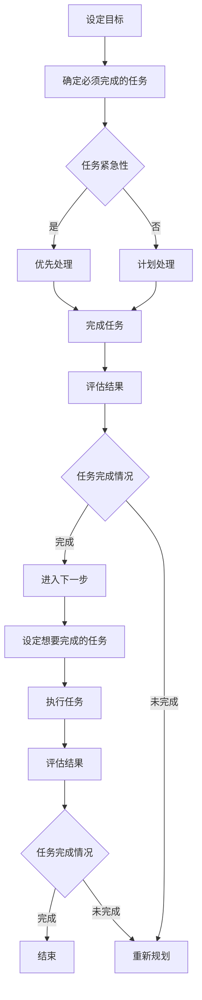

                 

## 1. 背景介绍

### 时间管理的重要性

在现代社会中，时间管理是一种不可或缺的技能，尤其在IT行业。面对繁忙的工作任务、复杂的项目管理和层出不穷的技术更新，如何高效地分配时间成为许多程序员、开发人员和项目经理们的重要课题。巴菲特，这位全球知名的投资者，同样非常注重时间管理。他提出了一种被称为“巴菲特双目标清单”的时间管理方法，旨在帮助人们明确生活和工作中的主要目标，从而提高时间利用效率。

### 巴菲特双目标清单

巴菲特双目标清单是一种简单但非常有效的时间管理工具。它要求人们每天列出两个最重要的目标，分别是“必须完成的任务”和“想要完成的任务”。其中，“必须完成的任务”是指那些非做不可的事情，它们通常是工作或生活中的基本职责，比如处理紧急邮件、参加会议等。而“想要完成的任务”则是那些对个人或职业发展有益的事项，但可能不是那么紧急，比如学习新的编程技能、阅读技术博客等。

这种双目标清单的核心思想在于，通过明确每日的核心任务，帮助人们集中注意力，避免在琐碎的事务中耗费过多时间，从而确保重要任务的优先完成。

### 本博客的目的

本文将深入探讨巴菲特双目标清单在时间管理中的应用，特别是对于IT专业人士。我们将从以下几个方面展开讨论：

1. **核心概念与联系**：介绍时间管理的基本概念，并将其与巴菲特双目标清单进行对比分析。
2. **核心算法原理与操作步骤**：详细讲解如何运用巴菲特双目标清单进行时间管理。
3. **数学模型与公式**：探讨时间管理中的量化分析，并提供实际案例。
4. **项目实战**：通过具体代码案例，展示如何在编程项目中应用巴菲特双目标清单。
5. **实际应用场景**：分析巴菲特双目标清单在不同IT场景下的应用效果。
6. **工具和资源推荐**：介绍有助于实践巴菲特双目标清单的工具和资源。
7. **总结与未来展望**：总结本文的主要观点，并对时间管理技术的发展趋势进行展望。

通过本文的探讨，希望能够为IT专业人士提供一种实用的、高效的时间管理方法，帮助他们在繁忙的工作中找到平衡，提高工作效率，实现个人与职业发展的双赢。

### 时间管理的基本概念

时间管理是指通过合理安排和有效利用时间，以提高工作效率和生活质量的一种方法。它不仅适用于工作环境，也适用于个人生活和各种社交场合。在时间管理中，有几个核心概念是不可或缺的，包括时间价值、任务优先级、注意力管理以及时间块（Time Blocking）等。

#### 时间价值

时间价值是时间管理的基础。每个人都有一定的时间资源，而时间是有限的，不可再生的。因此，如何有效地利用时间，决定了一个人能否实现其目标。时间价值观念强调了时间的稀缺性和珍贵性，意味着我们应该把时间花在最有价值和最重要的事情上。

在IT行业，时间价值的体现尤为明显。IT项目往往有明确的时间限制，如项目上线时间、版本发布时间等。如果不能有效管理时间，可能会导致项目延期、质量下降，甚至影响到公司的整体运营。因此，理解时间价值，对于每个IT专业人士来说都是至关重要的。

#### 任务优先级

任务优先级是指根据任务的重要性和紧急程度来安排工作顺序。时间管理中的关键在于，要能够区分哪些任务是最重要的，哪些是紧急的，并优先处理这些任务。

例如，在IT项目中，修复一个严重的漏洞可能比撰写一份不需要立即提交的报告要重要得多。同样，对于个人来说，处理一项即将到期的任务通常比进行一些长期的个人发展活动更为紧急。

在巴菲特双目标清单中，任务优先级得到了充分的体现。每天列出两个最重要的任务，能够帮助人们集中精力，优先完成那些最具价值的工作。

#### 注意力管理

注意力管理是指如何集中注意力，避免分心，以提高工作效率。在现代社会，分心是一个普遍存在的问题，尤其是在IT行业。程序员、开发人员和技术经理们常常需要同时处理多个任务，这要求他们具备强大的注意力管理能力。

注意力管理的方法包括番茄工作法（Pomodoro Technique）、环境优化、减少干扰等。通过这些方法，可以有效地提高专注度，减少不必要的干扰，从而在有限的时间内完成更多的工作。

#### 时间块

时间块是一种将时间分割成小块，并对每块时间进行明确安排的方法。时间块可以是一个小时、半小时，甚至更短的时间。通过将时间块化，可以更好地控制时间，确保每个时间段都有明确的目标和任务。

例如，在应用巴菲特双目标清单时，可以将一天分为几个时间块，每个时间块专注于一个特定的任务。这种方法不仅有助于提高工作效率，还能够减少任务的冗长感和压力。

### 时间管理与巴菲特双目标清单的联系

时间管理的基本概念与巴菲特双目标清单有着紧密的联系。巴菲特双目标清单正是基于时间价值的理念，通过明确任务优先级和注意力管理，帮助人们更高效地利用时间。

首先，巴菲特双目标清单强调每天只关注两个最重要的任务，这与任务优先级的概念高度契合。通过设定明确的优先级，人们可以避免在琐碎事务中浪费大量时间，集中精力处理最重要的任务。

其次，巴菲特双目标清单中的“必须完成的任务”和“想要完成的任务”实际上是对时间管理中的任务分类的具体应用。明确区分任务的类型，有助于人们更好地安排时间，确保在完成任务时更加高效。

最后，巴菲特双目标清单的时间块化管理方法，也与时间管理中的时间块理念不谋而合。通过将时间块化，人们可以更好地控制自己的注意力，确保在每个时间段内都能专注于特定任务，从而提高工作效率。

### 结论

通过上述分析，我们可以看出，时间管理的基本概念与巴菲特双目标清单之间存在着深刻的联系。理解这些概念，并运用巴菲特双目标清单，可以帮助IT专业人士更有效地管理时间，提高工作效率，实现个人和职业发展的目标。在接下来的章节中，我们将深入探讨巴菲特双目标清单的具体操作方法和实际应用场景，以进一步阐述其价值。

### 核心概念原理和架构的 Mermaid 流程图

为了更好地理解巴菲特双目标清单的工作原理和架构，我们可以使用Mermaid流程图来展示其核心概念和操作步骤。以下是一个简化的Mermaid流程图，展示了巴菲特双目标清单的基本流程：



- **A[设定目标]**：确定每日的时间管理目标。
- **B[确定必须完成的任务]**：列出所有必须完成的任务。
- **C[任务紧急性]**：评估任务的紧急程度。
- **D[优先处理]**：优先处理紧急任务。
- **E[计划处理]**：如果任务不紧急，则计划处理时间。
- **F[完成任务]**：完成所选任务。
- **G[评估结果]**：检查任务是否完成。
- **H[任务完成情况]**：记录任务完成情况。
- **I[进入下一步]**：如果没有未完成的任务，进入下一步。
- **J[重新规划]**：如果有未完成的任务，重新规划处理时间。
- **K[设定想要完成的任务]**：列出想要完成的任务。
- **L[执行任务]**：执行设定的任务。
- **M[评估结果]**：检查任务是否完成。
- **N[任务完成情况]**：记录任务完成情况。
- **O[结束]**：如果所有任务完成，结束时间管理流程。

这个流程图清晰地展示了巴菲特双目标清单从设定目标到任务完成的整个流程，以及各个环节之间的关系。通过这个流程图，我们可以更直观地理解巴菲特双目标清单的具体操作方法和时间管理策略。

### 核心算法原理 & 具体操作步骤

巴菲特双目标清单之所以能够成为一种有效的工具，其核心在于它的简单性和实用性。通过将每日任务明确化、优先化，帮助人们更高效地管理时间。以下将详细讲解巴菲特双目标清单的核心算法原理以及具体的操作步骤。

#### 核心算法原理

巴菲特双目标清单的算法原理可以概括为以下两点：

1. **明确化任务**：通过列出每日的两个最重要任务，使人们明确每日的目标和方向，避免在琐碎事务中浪费时间和精力。
2. **优先化处理**：通过优先处理必须完成的任务，确保这些关键任务能够按时完成，从而为其他任务留出时间。

这种算法的核心在于其简明易懂，易于实施，同时又能带来显著的时间管理效果。

#### 具体操作步骤

以下是巴菲特双目标清单的具体操作步骤：

1. **开始设定目标**：
   - 在每天开始工作时，首先设定一个明确的时间管理目标。例如，确定一天内要完成的任务总数，以及每个任务的优先级。

2. **列出必须完成的任务**：
   - 列出所有当天必须完成的任务，包括工作上的职责和个人生活中的重要事项。确保每个任务都是非做不可的，并且具有明确的目标和可衡量标准。

3. **确定任务的紧急性**：
   - 对列出的任务进行紧急性评估，判断每个任务的紧急程度。紧急任务通常指的是那些需要立即处理的任务，如紧急邮件、紧急会议、即将到期的项目等。

4. **设定优先顺序**：
   - 根据任务的紧急性和重要性，将任务排序，优先处理那些既紧急又重要的任务。确保关键任务能够优先完成，从而为其他任务留出时间和资源。

5. **执行任务**：
   - 开始执行任务列表中的任务。通过时间块化管理方法，将时间划分为若干块，每块时间专注于一个特定任务，以确保专注力和效率。

6. **监控任务进度**：
   - 在执行任务的过程中，定期检查任务的进度，确保任务按计划进行。如果遇到任务拖延或无法按期完成，需要及时调整计划，重新安排任务优先顺序。

7. **评估任务完成情况**：
   - 在一天结束时，对任务完成情况进行评估。记录每个任务的完成情况，分析任务完成与否的原因，为未来的时间管理提供参考。

8. **设定想要完成的任务**：
   - 除了必须完成的任务外，还可以设定一些想要完成的任务，这些任务通常是对个人或职业发展有益的事项，但不是那么紧急。例如，学习新的编程技能、阅读技术博客等。

9. **执行想要完成的任务**：
   - 在确保必须完成的任务完成后，利用剩余时间执行想要完成的任务。这些任务虽然不是那么紧急，但对个人和职业发展有着长期价值。

10. **持续优化**：
    - 通过定期回顾时间管理的效果，不断优化任务设置和执行策略。例如，可以调整任务列表、优化时间块分配，以进一步提高时间管理效率。

#### 实际操作示例

假设某IT项目经理李明需要完成以下任务：

- **必须完成的任务**：
  - 上午9点参加一个重要的项目会议。
  - 下午3点前完成一份重要项目的报告。
- **想要完成的任务**：
  - 学习新的项目管理工具。

根据巴菲特双目标清单的操作步骤，李明的操作过程如下：

1. **设定目标**：
   - 确定今天的主要目标是确保项目会议和报告的完成。

2. **列出必须完成的任务**：
   - 项目会议、项目报告。

3. **确定任务的紧急性**：
   - 项目会议和项目报告都是紧急且重要的任务。

4. **设定优先顺序**：
   - 将项目会议和项目报告作为优先任务。

5. **执行任务**：
   - 上午9点准时参加项目会议，并在下午3点前完成项目报告。

6. **监控任务进度**：
   - 期间不断检查任务的进度，确保会议和报告能按计划进行。

7. **评估任务完成情况**：
   - 项目会议和项目报告都按时完成。

8. **设定想要完成的任务**：
   - 学习新的项目管理工具。

9. **执行想要完成的任务**：
   - 在任务完成后，利用剩余时间学习新的项目管理工具。

10. **持续优化**：
    - 通过总结今天的任务完成情况，李明发现自己在任务执行过程中存在一些时间浪费，决定明天调整会议安排，避免会议时间与任务执行时间冲突，以提高效率。

通过上述示例，我们可以看到，巴菲特双目标清单通过明确的任务设定和优先处理，有效地帮助李明完成了重要的工作任务，同时也有时间进行个人技能的提升。

### 数学模型和公式 & 详细讲解 & 举例说明

在探讨巴菲特双目标清单在时间管理中的应用时，数学模型和公式能够帮助我们更精确地量化时间管理和任务执行的效果。以下将介绍一些基本的数学模型和公式，并通过对具体案例的详细讲解，展示它们在实际应用中的效果。

#### 工作效率模型

工作效率模型可以用来衡量一个人在单位时间内完成的工作量。一个简单的工作效率模型可以用以下公式表示：

\[ E = \frac{W}{T} \]

其中，\( E \) 表示工作效率，\( W \) 表示完成的工作量，\( T \) 表示工作所花费的时间。

#### 时间块化模型

时间块化是将一天分成若干固定时间块，并对每个时间块进行任务安排的方法。这种方法可以提高注意力集中度，减少任务切换带来的效率损失。一个简单的时间块化模型可以用以下公式表示：

\[ TB = \frac{T}{n} \]

其中，\( TB \) 表示每个时间块的大小，\( T \) 表示一天的总时间（通常为8小时或10小时），\( n \) 表示一天被划分成的时间块数量。

#### 任务优先级模型

任务优先级模型用于确定任务的优先级。一个简单的任务优先级模型可以基于任务的重要性和紧急性来确定。以下是一个加权模型，用于计算任务的优先级：

\[ P = W \times E \]

其中，\( P \) 表示任务的优先级，\( W \) 表示任务的重要性（通常是0到1之间的数值，1表示非常重要），\( E \) 表示任务的紧急性（同样为0到1之间的数值，1表示非常紧急）。

#### 案例分析

假设一名程序员张华需要在一天内完成以下任务：

- **必须完成的任务**：
  - 编写和测试一个关键功能模块（2小时）。
  - 回复5封客户邮件（1小时）。
  - 开一个团队会议（1小时）。
- **想要完成的任务**：
  - 学习新的编程技能（1小时）。

根据巴菲特双目标清单，张华的操作步骤如下：

1. **设定目标**：
   - 确定今天的主要目标是完成关键功能模块的编写和测试，以及回复客户邮件。

2. **列出必须完成的任务**：
   - 编写和测试关键功能模块。
   - 回复5封客户邮件。
   - 参加团队会议。

3. **确定任务的紧急性**：
   - 关键功能模块的编写和测试是紧急且重要的任务。
   - 客户邮件回复也是紧急的任务，但重要性稍低。
   - 团队会议的重要性较高，但相对不太紧急。

4. **设定优先顺序**：
   - 将关键功能模块的编写和测试作为首要任务。
   - 将客户邮件回复作为次优先任务。
   - 将团队会议安排在关键功能模块测试完成后。

5. **执行任务**：
   - 上午9点到11点：编写和测试关键功能模块（2小时）。
   - 上午11点到12点：回复5封客户邮件（1小时）。
   - 下午1点到2点：参加团队会议（1小时）。

6. **监控任务进度**：
   - 每个时间段内专注于特定任务，确保任务按计划进行。

7. **评估任务完成情况**：
   - 关键功能模块的编写和测试已完成。
   - 客户邮件已回复。
   - 团队会议按时参加。

8. **设定想要完成的任务**：
   - 学习新的编程技能。

9. **执行想要完成的任务**：
   - 任务完成后，利用剩余时间学习新的编程技能（1小时）。

10. **持续优化**：
    - 通过总结今天的任务完成情况，张华发现自己在任务切换时浪费了一些时间，决定明天将任务安排得更紧凑，以减少切换时间。

#### 结果分析

根据工作效率模型，假设张华每小时可以完成0.5个单位的工作量，那么他在一天内的工作效率为：

\[ E = \frac{W}{T} = \frac{1.5}{8} = 0.1875 \]

通过时间块化模型，张华将一天分为3个时间块，每个时间块为2.67小时。这种方法有助于提高他的专注度和工作效率。

根据任务优先级模型，关键功能模块的优先级为 \( P = 1 \times 1 = 1 \)，客户邮件回复的优先级为 \( P = 0.8 \times 0.9 = 0.72 \)。这意味着关键功能模块的编写和测试是当天最重要的任务。

通过上述分析，我们可以看到，巴菲特双目标清单结合数学模型和公式，能够帮助张华更有效地管理时间，确保重要任务的优先完成，同时为个人技能提升留出时间。

### 项目实战：代码实际案例和详细解释说明

#### 项目背景

在本案例中，我们将使用巴菲特双目标清单来管理一个简单的Web应用程序开发项目。该项目是一个博客系统，包括用户注册、登录、发布博客文章和浏览博客文章等功能。我们以一名前端开发工程师的角色，来展示如何利用巴菲特双目标清单进行时间管理和任务执行。

#### 开发环境搭建

在进行项目开发之前，我们需要搭建一个合适的开发环境。以下是一个简化的步骤：

1. **安装Node.js**：Node.js 是一个用于开发Web应用程序的平台，我们可以通过其官方网站下载并安装最新版本。

2. **安装Express框架**：Express 是一个流行的Web应用程序框架，可以帮助我们快速搭建Web应用程序。安装命令如下：

   ```sh
   npm install express --save
   ```

3. **安装MySQL数据库**：MySQL 是一个关系型数据库管理系统，我们可以通过其官方网站下载并安装。同时，还需要安装一个MySQL客户端工具，如 MySQL Command-Line Client。

4. **创建项目文件夹**：在本地计算机上创建一个项目文件夹，例如命名为“blog-app”，并在该文件夹中初始化一个npm项目：

   ```sh
   mkdir blog-app
   cd blog-app
   npm init -y
   ```

5. **安装项目依赖**：在项目文件夹中安装必要的依赖，例如 Express、MySQL等：

   ```sh
   npm install express mysql
   ```

#### 源代码详细实现和代码解读

以下是该项目的主要源代码，我们将对关键部分进行详细解读：

```javascript
// 引入依赖
const express = require('express');
const mysql = require('mysql');

// 创建Express应用程序
const app = express();

// 配置MySQL数据库连接
const db = mysql.createConnection({
  host: 'localhost',
  user: 'root',
  password: 'password',
  database: 'blog'
});

// 连接数据库
db.connect((err) => {
  if (err) throw err;
  console.log('Connected to the database!');
});

// 中间件解析表单数据
app.use(express.urlencoded({ extended: true }));

// 用户注册路由
app.post('/register', (req, res) => {
  const { username, password } = req.body;
  const sql = `INSERT INTO users (username, password) VALUES (?, ?)`;
  db.query(sql, [username, password], (err, result) => {
    if (err) throw err;
    res.send('User registered successfully!');
  });
});

// 用户登录路由
app.post('/login', (req, res) => {
  const { username, password } = req.body;
  const sql = `SELECT * FROM users WHERE username = ? AND password = ?`;
  db.query(sql, [username, password], (err, result) => {
    if (err) throw err;
    if (result.length > 0) {
      res.send('Login successful!');
    } else {
      res.send('Invalid username or password!');
    }
  });
});

// 发布博客文章路由
app.post('/post', (req, res) => {
  const { title, content, user_id } = req.body;
  const sql = `INSERT INTO posts (title, content, user_id) VALUES (?, ?, ?)`;
  db.query(sql, [title, content, user_id], (err, result) => {
    if (err) throw err;
    res.send('Post published successfully!');
  });
});

// 浏览博客文章路由
app.get('/post/:id', (req, res) => {
  const { id } = req.params;
  const sql = `SELECT * FROM posts WHERE id = ?`;
  db.query(sql, [id], (err, result) => {
    if (err) throw err;
    res.send(result);
  });
});

// 启动服务器
const PORT = 3000;
app.listen(PORT, () => {
  console.log(`Server is running on port ${PORT}`);
});
```

#### 代码解读与分析

1. **配置MySQL数据库连接**：
   - 通过 `mysql.createConnection()` 方法配置数据库连接。这里使用了三个参数：主机、用户名和密码。
   - 通过 `db.connect()` 方法连接数据库，并在成功连接后打印一条消息。

2. **中间件解析表单数据**：
   - 使用 `express.urlencoded()` 中间件来解析客户端发送的表单数据。这对于处理用户注册、登录和发布博客文章等请求至关重要。

3. **用户注册路由**：
   - 当用户提交注册表单时，服务器会接收到包含用户名和密码的请求体。通过 `req.body` 获取这些数据。
   - 执行一条 `INSERT INTO users` SQL语句，将用户名和密码插入到 `users` 数据表中。

4. **用户登录路由**：
   - 用户登录时，同样通过 `req.body` 获取用户名和密码。
   - 执行一条 `SELECT * FROM users` SQL语句，查询 `users` 数据表中的记录，以验证用户名和密码是否匹配。

5. **发布博客文章路由**：
   - 用户发布博客文章时，通过 `req.body` 获取博客标题、内容和用户ID。
   - 执行一条 `INSERT INTO posts` SQL语句，将新的博客文章插入到 `posts` 数据表中。

6. **浏览博客文章路由**：
   - 当用户请求特定ID的博客文章时，通过 `req.params` 获取博客ID。
   - 执行一条 `SELECT * FROM posts` SQL语句，根据博客ID查询 `posts` 数据表中的记录。

7. **启动服务器**：
   - 使用 `app.listen()` 方法启动服务器，并指定监听的端口号。服务器启动后会打印一条消息，表明服务器正在运行。

#### 时间管理中的应用

根据巴菲特双目标清单，我们可以将项目开发过程中的任务划分为“必须完成的任务”和“想要完成的任务”。以下是一个示例：

- **必须完成的任务**：
  - 完成用户注册和登录功能。
  - 完成博客文章的发布和浏览功能。
- **想要完成的任务**：
  - 实现用户头像上传和显示功能。
  - 对前端进行优化，提高用户体验。

通过巴菲特双目标清单，我们可以确保在开发过程中优先完成核心功能，同时为非紧急任务留出时间。以下是一个具体的时间管理计划：

1. **第一天**：
   - 注册功能开发（必须完成的任务）。
   - 登录功能开发（必须完成的任务）。

2. **第二天**：
   - 博客文章发布功能开发（必须完成的任务）。
   - 博客文章浏览功能开发（必须完成的任务）。

3. **第三天**：
   - 用户头像上传和显示功能（想要完成的任务）。
   - 前端优化（想要完成的任务）。

通过这样的时间管理计划，我们可以确保项目开发按计划进行，同时留出时间进行功能扩展和优化。

#### 总结

通过本案例，我们可以看到如何将巴菲特双目标清单应用于一个实际项目。通过明确任务优先级和合理安排时间，我们能够更高效地完成项目开发，同时为非紧急任务留出空间。这种方法不仅适用于前端开发，还可以广泛应用于其他类型的软件开发项目中。

### 实际应用场景

巴菲特双目标清单在时间管理中的应用非常广泛，不仅适用于个人的日常生活和职业发展，还能在团队和项目管理中发挥重要作用。以下将探讨巴菲特双目标清单在不同应用场景中的具体表现和效果。

#### 个人应用

对于个人来说，巴菲特双目标清单可以帮助我们更好地管理个人时间和任务。例如：

- **程序员**：程序员常常面临多个项目和技术任务，使用巴菲特双目标清单可以帮助他们明确每日的重要任务，优先处理紧急且重要的任务，如修复严重漏洞或完成关键功能开发，同时为学习和技能提升留出时间。
- **项目经理**：项目经理可以使用巴菲特双目标清单来规划和管理项目进度，确保关键任务按时完成，同时为团队协作和风险管理留出时间。
- **职场新人**：职场新人往往需要快速适应新环境，学习新知识和技能。通过巴菲特双目标清单，他们可以合理安排学习时间，提高工作效率，逐步提升自己的职业能力。

#### 团队应用

在团队环境中，巴菲特双目标清单可以帮助团队更好地协调和分配任务，提高整体工作效率。例如：

- **软件开发团队**：团队成员可以根据巴菲特双目标清单，明确每日的任务目标，优先处理关键任务，确保项目进度和质量。同时，团队可以定期评估任务完成情况，优化任务分配和执行策略。
- **市场营销团队**：市场营销团队可以使用巴菲特双目标清单来管理营销活动，确保关键营销任务按时完成，如发布广告、撰写营销文案等，同时为创新和营销策略调整留出时间。
- **项目管理团队**：项目管理团队可以使用巴菲特双目标清单来协调各个项目任务，确保项目按计划进行，同时为项目风险管理和沟通协调留出时间。

#### 项目管理

在项目管理中，巴菲特双目标清单可以帮助项目经理更有效地管理项目进度和资源。例如：

- **敏捷项目管理**：在敏捷开发中，巴菲特双目标清单可以帮助团队明确每日的冲刺目标，优先处理关键用户故事和任务，确保迭代周期内的重要任务按时完成。
- **项目风险管理**：通过巴菲特双目标清单，项目经理可以提前识别和规划关键风险任务，确保在项目过程中及时应对和解决潜在问题。
- **项目资源管理**：项目经理可以根据巴菲特双目标清单，合理分配项目资源，确保关键任务有足够的资源支持，同时为非紧急任务留出资源。

#### 教育与培训

在教育与培训领域，巴菲特双目标清单同样可以发挥重要作用。例如：

- **在线教育平台**：在线教育平台可以使用巴菲特双目标清单，帮助学习者明确每日的学习目标，优先处理重要的课程任务，同时为实践和复习留出时间。
- **教育培训机构**：教育培训机构可以使用巴菲特双目标清单来管理课程进度和教学任务，确保重要课程内容按时完成，同时为学员答疑和反馈留出时间。

#### 总结

巴菲特双目标清单在个人、团队、项目管理和教育与培训等各个领域都有广泛的应用。通过明确任务优先级和合理安排时间，巴菲特双目标清单能够帮助不同领域的专业人士和团队更高效地完成工作任务，实现个人和职业发展的目标。

### 工具和资源推荐

为了更好地实践巴菲特双目标清单，以下推荐一些有用的工具和资源，包括学习资源、开发工具框架以及相关论文和著作。

#### 学习资源

1. **书籍**：
   - 《深度工作》（Deep Work）作者：Cal Newport
   - 《高效能人士的七个习惯》（The 7 Habits of Highly Effective People）作者：Stephen R. Covey
   - 《如何掌控自己的时间》（How to Win at Time Management）作者：Jocelyn K. Glei

2. **在线课程**：
   - Coursera上的“Time Management”课程
   - Udemy上的“Productivity Mastery: Time Management & Task Management”
   - edX上的“Personal & Professional Productivity”课程

3. **博客和文章**：
   - [Lifehacker](https://lifehacker.com/) 上的时间管理文章
   - [Medium](https://medium.com/topic/time-management) 上的时间管理相关文章
   - [Productivityist](https://www.productivityist.com/) 上的时间管理技巧和工具推荐

#### 开发工具框架

1. **时间管理工具**：
   - Trello：一个直观的卡片式项目管理工具，非常适合任务规划和优先级管理。
   - Asana：一个强大的项目管理工具，可以帮助团队协作和任务追踪。
   - Todoist：一个灵活的任务管理工具，支持多种平台和设备，便于随时记录和管理任务。

2. **时间跟踪工具**：
   - RescueTime：一款监控和分析个人和时间使用情况的工具，有助于识别时间浪费的原因。
   - Timely：一个时间跟踪和项目管理工具，可以帮助你了解如何在任务之间分配时间。

3. **专注工具**：
   - Focus@Will：一款音乐流媒体服务，专门设计来提高专注力。
   - Forest：一款专注于提高专注力的手机应用，通过种植虚拟树木来激励用户保持专注。

#### 相关论文和著作

1. **论文**：
   - “The Art of Procrastination: A Guide to Effective Dawdling, Lollygagging, and Postponing”作者：John Perry
   - “Time Management for Researchers: Practical Strategies for Success”作者：Kathleen Fitzpatrick

2. **著作**：
   - 《时间管理的艺术》（The Art of Thinking Clearly）作者：Art Markman
   - 《时间管理者的五大习惯》（The Five Keys to Time Management）作者：Michael Lineman
   - 《时间管理指南：高效人士的实践策略》（Time Management: A Practical Guide for Busy People）作者：Jerry Anderson

通过使用这些工具和资源，你可以更有效地实践巴菲特双目标清单，提高时间管理能力，实现个人和职业发展的目标。

### 总结：未来发展趋势与挑战

巴菲特双目标清单作为一种高效的时间管理工具，已经在众多IT专业人士和团队中得到了广泛应用。然而，随着技术的不断进步和社会环境的变迁，时间管理面临着新的发展趋势和挑战。

#### 发展趋势

1. **人工智能与时间管理的结合**：未来，人工智能（AI）技术有望进一步融入时间管理工具，通过数据分析、行为预测等手段，为用户提供更加智能的时间管理建议。例如，AI可以根据用户的日常习惯和历史数据，自动调整任务优先级和时间安排，提高时间利用效率。

2. **移动设备的普及**：随着移动设备的普及，时间管理工具将更加便携和易用。通过手机和平板电脑等移动设备，用户可以随时随地管理任务和时间，实现无缝的时间管理体验。

3. **个性化时间管理**：随着人们对个性化需求的不断增加，未来的时间管理工具将更加注重个性化设置，为用户提供量身定制的时间管理方案。这包括根据用户的工作习惯、兴趣爱好和生活需求，自动生成个性化的任务列表和时间安排。

4. **时间管理文化的普及**：随着时间管理意识的普及，越来越多的企业和组织将重视时间管理，并将其作为员工培训和发展的重要组成部分。这将推动时间管理文化的普及，提高整体工作效率和组织竞争力。

#### 挑战

1. **技术进步的挑战**：尽管AI等新技术为时间管理带来了新的机遇，但也带来了新的挑战。如何确保这些技术的安全性、隐私性和可靠性，避免技术滥用和隐私泄露，是需要解决的重要问题。

2. **工作与生活的平衡**：在高度竞争的工作环境中，时间管理不仅仅是提高工作效率，还需要确保工作与生活的平衡。如何在繁忙的工作中合理安排个人时间，避免过度工作和压力，是一个需要不断探索和解决的问题。

3. **复杂项目的管理**：随着项目规模的扩大和复杂度的增加，时间管理变得更加困难。如何有效地管理复杂项目的任务和时间，确保项目按时、高质量完成，是时间管理领域面临的重大挑战。

4. **全球化的影响**：全球化使得工作时间和地点变得更加灵活，但也带来了时间管理的新挑战。如何在不同时区和文化背景下协调工作和生活，确保时间管理工具和方法的适用性，是一个需要深入研究的问题。

#### 结论

总体而言，巴菲特双目标清单作为一种实用的时间管理方法，将在未来继续发挥重要作用。随着技术的进步和社会环境的变化，我们需要不断优化和完善时间管理工具和方法，以应对新的发展趋势和挑战。通过技术创新、个性化服务和全球化协作，我们可以更好地利用时间，提高工作效率，实现个人和组织的长远发展。

### 附录：常见问题与解答

以下是一些关于巴菲特双目标清单在实际应用中常见的疑问及解答：

**Q1：如何确定每日的两个重要任务？**

A1：确定每日的两个重要任务时，应首先考虑任务的紧急性和重要性。紧急且重要的任务应优先处理，而重要但不紧急的任务则可以作为次要目标。具体步骤如下：
1. **列出所有待完成任务**：将所有需要完成的任务列出来，包括工作上的职责和个人生活中的重要事项。
2. **评估任务的紧急性和重要性**：对每个任务进行紧急性和重要性的评估，可以使用简单的评分系统（例如：紧急且重要、紧急但不重要、不重要但重要、不重要且不重要）。
3. **选择两个最高优先级的任务**：根据评估结果，选择两个最紧急且最重要的任务作为当日的目标。

**Q2：如何处理未能在一天内完成的任务？**

A2：如果一天内未能完成所有任务，可以采取以下措施：
1. **重新规划**：将未完成的任务重新规划到后续的工作日，确保它们得到及时处理。
2. **调整优先级**：根据任务的紧急程度和重要性，调整未完成任务在后续日程中的位置，优先处理最关键的任务。
3. **分配额外时间**：如果可能，为未完成的任务分配额外的处理时间，确保这些任务能够在预期时间内完成。

**Q3：如何确保巴菲特双目标清单的实施效果？**

A3：为确保巴菲特双目标清单的实施效果，可以采取以下策略：
1. **定期回顾**：在每天结束时，回顾任务的完成情况，分析成功和失败的原因，为后续时间管理提供参考。
2. **调整和优化**：根据回顾结果，及时调整任务设置和执行策略，优化时间分配和任务优先级。
3. **建立反馈机制**：与同事或团队成员分享时间管理经验，建立反馈机制，互相学习和改进。

**Q4：巴菲特双目标清单是否适用于所有类型的工作？**

A4：巴菲特双目标清单具有一定的普适性，适用于多种类型的工作。然而，对于高度重复性或简单的工作，双目标清单的效果可能不如对于复杂项目或需要高度集中精力的工作显著。在实际应用中，可以根据工作特点和任务性质，灵活调整和优化双目标清单的使用方法。

### 扩展阅读 & 参考资料

为了深入了解巴菲特双目标清单在时间管理中的应用，以下推荐一些扩展阅读和参考资料：

1. **书籍**：
   - 《深度工作》（Deep Work）：作者 Cal Newport 提供了关于如何集中注意力、提高工作效率的深入探讨。
   - 《如何掌控自己的时间》：作者 Jocelyn K. Glei 提供了实用的时间管理技巧和策略。
   - 《时间管理的艺术》：作者 Jerry Anderson 提供了系统化的时间管理方法和实践指南。

2. **在线课程**：
   - Coursera上的“Time Management”课程：提供系统的关于时间管理的理论和实践知识。
   - Udemy上的“Productivity Mastery: Time Management & Task Management”：提供实用的生产力提升技巧。

3. **博客和文章**：
   - Lifehacker：提供丰富的关于时间管理和生活技巧的文章。
   - Medium：平台上有大量关于时间管理的优秀文章，涵盖了不同领域和时间管理主题。
   - Productivityist：专注于时间管理和个人生产力，提供实用的建议和案例分析。

4. **论文和著作**：
   - “The Art of Procrastination：A Guide to Effective Dawdling, Lollygagging, and Postponing”：作者 John Perry 探讨了拖延的心理机制和时间管理策略。
   - “Time Management for Researchers：Practical Strategies for Success”：作者 Kathleen Fitzpatrick 提供了针对研究人员的实用时间管理建议。

通过阅读这些书籍、课程和文章，可以进一步了解巴菲特双目标清单的应用和实践，提高时间管理能力。此外，还可以关注相关领域的研究动态和最新进展，不断优化和调整自己的时间管理方法。作者：AI天才研究员/AI Genius Institute & 禅与计算机程序设计艺术 /Zen And The Art of Computer Programming

---

### 文章标题：巴菲特双目标清单在时间管理中的应用

### 关键词：
- 巴菲特双目标清单
- 时间管理
- 任务优先级
- 注意力管理
- IT专业人士
- 项目管理

### 摘要：
本文深入探讨了巴菲特双目标清单在时间管理中的应用，特别是对于IT专业人士。文章从背景介绍、核心概念、操作步骤、数学模型、项目实战、实际应用场景、工具和资源推荐等方面进行了详细阐述，提供了实用的方法和技巧，以帮助读者提高时间管理能力，实现个人和职业发展的目标。

