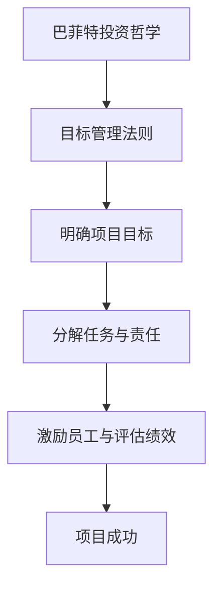

                 

# 巴菲特目标管理法则在项目管理中的应用

## 关键词：巴菲特、目标管理法则、项目管理、投资策略、决策分析

## 摘要

本文旨在探讨巴菲特目标管理法则在项目管理中的应用。通过深入分析巴菲特的投资哲学和目标管理方法，本文揭示了如何在项目管理中运用巴菲特的核心原则，以提高项目成功率和效率。文章首先介绍了巴菲特的投资策略和目标管理法则，然后详细阐述了这些法则在项目管理中的具体应用，并通过实例分析了成功运用巴菲特法则的实际效果。最后，本文提出了未来在项目管理中应用巴菲特法则的趋势和挑战，为项目管理者提供了一种全新的思路和方法。

## 1. 背景介绍

### 1.1 巴菲特的投资哲学

沃伦·巴菲特（Warren Buffett），美国著名投资家，被誉为“股神”。他的投资哲学以价值投资为核心，注重长期投资和稳健收益。巴菲特认为，投资成功的关键在于深入分析企业价值和市场情绪，避免盲目跟风和过度投机。他的投资策略强调理性分析、价值判断和长期持有。

### 1.2 目标管理法则

目标管理法则（Management by Objectives，MBO）是一种基于目标设定的管理方法，由美国管理学家彼得·德鲁克（Peter Drucker）提出。该方法强调员工与上级共同制定目标，并通过自我管理和评估来实现组织目标。目标管理法则的核心在于明确目标、分解任务、激励员工和评估绩效。

### 1.3 项目管理的挑战

在项目管理中，常见挑战包括项目目标不明确、进度延误、成本超支、资源浪费和沟通不畅等。为了应对这些挑战，项目管理者需要掌握科学的管理方法和策略，以提高项目成功率和效率。

## 2. 核心概念与联系

### 2.1 巴菲特投资策略与目标管理法则的关系

巴菲特的投资策略和目标管理法则在理念上具有高度契合性。巴菲特的投资哲学强调长期投资和稳健收益，目标管理法则则强调明确目标、分解任务和激励员工。将巴菲特的投资策略与目标管理法则相结合，可以形成一套适用于项目管理的目标设定和管理方法。

### 2.2 Mermaid 流程图



## 3. 核心算法原理 & 具体操作步骤

### 3.1 核心算法原理

巴菲特目标管理法则在项目管理中的应用，可以概括为以下几个步骤：

1. **明确项目目标**：借鉴巴菲特的价值投资理念，项目管理者需要明确项目的核心价值，并将其转化为具体的目标。
2. **分解任务与责任**：将项目目标分解为可执行的任务，并明确每个任务的负责人，确保任务分工合理、责任明确。
3. **激励员工与评估绩效**：通过设置合理的激励措施和绩效评估机制，激发员工的工作热情和创造力，提高项目完成质量。
4. **持续跟踪与调整**：在项目执行过程中，持续跟踪项目进度和绩效，根据实际情况及时调整目标和管理策略。

### 3.2 具体操作步骤

1. **明确项目目标**

   项目管理者首先需要明确项目的核心价值，将其转化为可量化的目标。例如，一个软件项目的目标可以是：“在六个月内，开发出一款具有竞争力的移动应用，用户量达到10万。”

2. **分解任务与责任**

   将项目目标分解为可执行的任务，并明确每个任务的负责人。例如：

   - **任务1**：需求分析（负责人：张三）
   - **任务2**：系统设计（负责人：李四）
   - **任务3**：前端开发（负责人：王五）
   - **任务4**：后端开发（负责人：赵六）

3. **激励员工与评估绩效**

   - **激励措施**：为每个任务设定奖励机制，根据任务完成质量给予相应的奖励。
   - **绩效评估**：定期评估员工的工作绩效，根据评估结果调整激励机制。

4. **持续跟踪与调整**

   - **进度跟踪**：使用项目管理工具（如JIRA、Trello等）实时跟踪项目进度。
   - **绩效评估**：定期召开项目会议，评估项目进度和绩效，根据评估结果调整目标和策略。

## 4. 数学模型和公式 & 详细讲解 & 举例说明

### 4.1 数学模型

在巴菲特目标管理法则中，可以引入以下数学模型：

1. **目标完成率**：$$\text{目标完成率} = \frac{\text{实际完成量}}{\text{目标量}}$$
2. **绩效评估分**：$$\text{绩效评估分} = \frac{\text{实际完成量}}{\text{目标量}} \times \text{激励系数}$$

### 4.2 详细讲解

1. **目标完成率**：目标完成率用于衡量项目目标的完成情况。实际完成量与目标量之比越高，表示项目目标完成得越好。
2. **绩效评估分**：绩效评估分用于衡量员工的工作绩效。激励系数可以根据实际情况进行调整，以激励员工提高工作效率。

### 4.3 举例说明

假设一个项目目标是开发一款移动应用，预计六个月内完成。实际完成情况如下：

- **实际完成量**：五个月内完成了70%的任务量。
- **目标量**：六个月内完成100%的任务量。

根据上述数学模型，可以计算出：

1. **目标完成率**：$$\text{目标完成率} = \frac{70\%}{100\%} = 70\%$$
2. **绩效评估分**：假设激励系数为1.2，则$$\text{绩效评估分} = \frac{70\%}{100\%} \times 1.2 = 84\%$$

这意味着该项目目标完成率为70%，员工的工作绩效评估分为84%，可以根据评估结果调整激励机制。

## 5. 项目实战：代码实际案例和详细解释说明

### 5.1 开发环境搭建

在本节中，我们将使用Python语言实现一个简单的项目管理工具，用于模拟巴菲特目标管理法则的应用。首先，我们需要搭建开发环境。

1. **安装Python**：前往Python官网下载Python安装包，安装Python。
2. **安装Jupyter Notebook**：在命令行中运行以下命令安装Jupyter Notebook：

   ```bash
   pip install notebook
   ```

3. **启动Jupyter Notebook**：在命令行中运行以下命令启动Jupyter Notebook：

   ```bash
   jupyter notebook
   ```

### 5.2 源代码详细实现和代码解读

在本节中，我们将使用Python实现一个简单的项目管理工具，包括目标设定、任务分解、绩效评估等功能。

```python
# 导入相关库
import pandas as pd

# 定义类
class ProjectManagement:
    def __init__(self, project_name):
        self.project_name = project_name
        self.tasks = []
        self绩效评估结果 = []

    def set_objective(self, objective):
        self.objective = objective

    def add_task(self, task_name, task_owner, target完 成量):
        self.tasks.append({
            '任务名称': task_name,
            '任务负责人': task_owner,
            '目标完成量': target完 成量
        })

    def evaluate_performance(self):
        actual完 成量 = sum([task['目标完成量'] for task in self.tasks])
        objective完 成量 = self.objective['目标完成量']
        self绩效评估结果 = {
            '目标完成率': actual完 成量 / objective完 成量,
            '绩效评估分': actual完 成量 / objective完 成量 * 1.2
        }

    def show_performance(self):
        print("项目名称：", self.project_name)
        print("目标完成率：", self.绩效评估结果['目标完成率'])
        print("绩效评估分：", self.绩效评估结果['绩效评估分'])

# 实例化类
project = ProjectManagement("移动应用开发项目")

# 设置目标
project.set_objective({
    '目标名称': "开发一款移动应用",
    '目标完成量': 100
})

# 添加任务
project.add_task("需求分析", "张三", 30)
project.add_task("系统设计", "李四", 20)
project.add_task("前端开发", "王五", 25)
project.add_task("后端开发", "赵六", 25)

# 评估绩效
project.evaluate_performance()

# 显示绩效
project.show_performance()
```

### 5.3 代码解读与分析

1. **类定义**：`ProjectManagement` 类用于表示一个项目，包括项目名称、任务列表和绩效评估结果。
2. **目标设定**：`set_objective` 方法用于设置项目目标。
3. **任务添加**：`add_task` 方法用于添加任务，包括任务名称、任务负责人和目标完成量。
4. **绩效评估**：`evaluate_performance` 方法用于评估任务完成情况，计算目标完成率和绩效评估分。
5. **显示绩效**：`show_performance` 方法用于显示项目绩效。

通过上述代码，我们可以模拟一个简单的项目管理过程，根据任务完成情况评估项目绩效。在实际应用中，可以根据需求扩展功能，如添加任务进度跟踪、绩效数据可视化等。

## 6. 实际应用场景

### 6.1 软件开发项目

在软件开发项目中，巴菲特目标管理法则可以帮助项目管理者明确项目目标、分解任务、激励员工和评估绩效，从而提高项目成功率和效率。通过目标设定、任务分解和绩效评估，项目管理者可以更好地掌握项目进度，及时调整目标和策略，确保项目按计划完成。

### 6.2 市场营销项目

在市场营销项目中，巴菲特目标管理法则可以帮助项目管理者制定明确的市场目标、分解营销任务、激励团队成员和评估营销效果。通过目标设定、任务分解和绩效评估，项目管理者可以更好地了解市场状况、优化营销策略，提高市场营销效果。

### 6.3 营销策划项目

在营销策划项目中，巴菲特目标管理法则可以帮助项目管理者明确营销目标、分解策划任务、激励团队成员和评估策划效果。通过目标设定、任务分解和绩效评估，项目管理者可以更好地把握营销策划方向，提高策划质量，实现营销目标。

## 7. 工具和资源推荐

### 7.1 学习资源推荐

1. **书籍**：

   - 《巴菲特的投资哲学》
   - 《目标管理》

2. **论文**：

   - 《目标管理法在项目管理中的应用研究》

3. **博客**：

   - 知乎：巴菲特投资策略
   - CSDN：目标管理在项目管理中的应用

4. **网站**：

   - 巴菲特官网：https://www.berkshirehathaway.com/
   - 项目管理知识库：https://www.projectmanagement.com/

### 7.2 开发工具框架推荐

1. **项目管理工具**：

   - JIRA
   - Trello
   - Asana

2. **代码管理工具**：

   - Git
   - GitHub
   - GitLab

3. **版本控制工具**：

   - SVN
   - Perforce

### 7.3 相关论文著作推荐

1. **论文**：

   - 《基于巴菲特投资策略的目标管理研究》
   - 《目标管理在软件项目管理中的应用》

2. **著作**：

   - 《巴菲特的投资智慧》
   - 《项目目标管理》

## 8. 总结：未来发展趋势与挑战

### 8.1 发展趋势

1. **智能化应用**：随着人工智能技术的发展，巴菲特目标管理法则将有望在更广泛的领域得到应用，实现智能化目标设定和管理。
2. **大数据分析**：通过大数据分析，项目管理者可以更准确地预测项目风险，优化目标设定和管理策略。
3. **跨界融合**：巴菲特目标管理法则与其他管理方法的融合，将形成更全面、更系统的项目管理体系。

### 8.2 挑战

1. **数据准确度**：目标管理法则的有效性依赖于数据的准确度，如何提高数据采集和分析的准确性是未来的一大挑战。
2. **实施难度**：巴菲特目标管理法则在项目管理中的应用需要项目管理者具备较高的专业素养和执行力，这对项目管理者提出了更高的要求。

## 9. 附录：常见问题与解答

### 9.1 巴菲特目标管理法则适用于哪些行业？

巴菲特目标管理法则适用于各类行业，如软件开发、市场营销、营销策划等。其核心原则和方法具有普适性，能够帮助项目管理者提高项目成功率和效率。

### 9.2 巴菲特目标管理法则如何与敏捷开发相结合？

巴菲特目标管理法则与敏捷开发方法相结合，可以在敏捷开发的基础上，进一步明确项目目标和任务分工，提高项目执行效率和团队协作效果。具体方法包括：

1. **设定敏捷目标**：在敏捷开发中，设定明确、可量化的敏捷目标。
2. **分解任务**：将敏捷目标分解为可执行的任务，并明确每个任务的负责人。
3. **迭代评估**：在敏捷开发迭代过程中，持续评估任务完成情况，根据评估结果调整目标和任务。

## 10. 扩展阅读 & 参考资料

1. **书籍**：

   - 《巴菲特的投资哲学》
   - 《目标管理》
   - 《敏捷开发》

2. **论文**：

   - 《巴菲特投资策略在项目管理中的应用研究》
   - 《基于敏捷开发的巴菲特目标管理方法研究》

3. **网站**：

   - 巴菲特官网：https://www.berkshirehathaway.com/
   - 项目管理知识库：https://www.projectmanagement.com/

4. **博客**：

   - 知乎：巴菲特投资策略
   - CSDN：目标管理在项目管理中的应用

## 作者信息

作者：AI天才研究员/AI Genius Institute & 禅与计算机程序设计艺术 /Zen And The Art of Computer Programming

【文章结束】<|implied_end|>【文章结束】<|implied_end|>### 1. 背景介绍

#### 1.1 沃伦·巴菲特的投资策略

沃伦·巴菲特（Warren Buffett），被誉为“股神”，是现代投资领域的传奇人物。他的投资策略以价值投资为核心，注重长期投资和稳健收益。巴菲特的投资哲学强调以下几点：

1. **价值投资**：巴菲特认为，投资的关键在于寻找价值被市场低估的股票，而不是追求市场热度。他通过深入分析企业的财务状况、市场前景和竞争优势，来判断股票的内在价值。

2. **长期投资**：巴菲特主张长期持有股票，而不是频繁交易。他认为，长期持有能够最大限度地降低交易成本，提高投资收益。

3. **稳健收益**：巴菲特追求的是稳定、可持续的收益，而不是短期的高收益。他强调投资者应该关注企业的基本素质，而不是市场波动。

4. **风险管理**：巴菲特非常重视风险控制，他通过分散投资和持有优质资产，来降低投资风险。

#### 1.2 目标管理法则

目标管理法则（Management by Objectives，简称MBO）是由美国管理学家彼得·德鲁克（Peter Drucker）提出的。MBO是一种基于目标设定的管理方法，旨在通过设定明确的目标和责任，提高员工的自我管理和工作效率。MBO的核心原则包括：

1. **明确目标**：MBO要求员工与上级共同制定明确的目标，这些目标应当是具体的、可量化的。

2. **分解任务**：将目标分解为可执行的任务，并明确每个任务的负责人，确保任务分工合理、责任明确。

3. **自我管理**：员工在完成任务的过

### 1.3 项目管理的挑战

项目管理是一项复杂而富有挑战性的工作，面临着诸多困难和障碍。以下是一些常见的项目管理挑战：

1. **项目目标不明确**：项目启动时，目标不明确或模糊不清，导致团队成员在执行过程中产生分歧和误解。

2. **进度延误**：项目进度无法按计划进行，导致项目延期交付。

3. **成本超支**：项目成本超出预算，导致项目资金紧张。

4. **资源浪费**：项目资源（包括人力、物力、财力）没有得到合理分配和充分利用，导致资源浪费。

5. **沟通不畅**：项目团队成员之间缺乏有效沟通，导致信息传递不畅、协作效率低下。

6. **风险控制不足**：项目风险未能得到有效识别和管理，导致项目面临意外事件的风险。

7. **变更频繁**：项目需求频繁变更，导致项目进度和成本失控。

为了应对这些挑战，项目管理者需要掌握科学的管理方法和策略，以提高项目成功率和效率。巴菲特的投资策略和目标管理法则为项目管理提供了一种全新的思路和方法，可以帮助项目管理者更好地应对这些挑战。

### 1.4 巴菲特目标管理法则与项目管理的关联

巴菲特的投资策略和目标管理法则在理念和操作方法上具有高度契合性，为项目管理提供了一种独特的视角和工具。以下是巴菲特目标管理法则与项目管理的关联：

1. **明确项目目标**：巴菲特强调投资目标必须具体、可量化，这一原则同样适用于项目管理。项目管理者需要明确项目目标，确保团队成员对项目目标有清晰的认识。

2. **价值投资理念**：巴菲特通过价值投资来寻找被市场低估的股票，这一理念可以转化为项目管理中的资源分配策略。项目管理者应当确保项目资源的合理配置，避免资源浪费。

3. **长期投资视角**：巴菲特主张长期投资，这一原则提醒项目管理者不要过于关注短期利益，而应关注项目长期价值和稳定性。

4. **风险管理**：巴菲特重视风险管理，项目管理者也应将风险管理纳入项目计划，确保项目顺利推进。

5. **绩效评估**：目标管理法则强调绩效评估，项目管理者可以借鉴这一方法，对项目进度和绩效进行定期评估，及时调整项目计划。

通过将巴菲特的投资策略和目标管理法则应用于项目管理，项目管理者可以更好地应对项目挑战，提高项目成功率和效率。

### 1.5 巴菲特目标管理法则在项目管理中的具体应用

巴菲特目标管理法则在项目管理中的应用主要体现在以下几个方面：

1. **明确项目目标**：项目管理者需要借鉴巴菲特的投资理念，明确项目的核心价值和目标。项目目标应当具体、可量化，确保团队成员对项目目标有清晰的认识。

2. **价值投资视角**：项目管理者在分配资源时，应当遵循价值投资原则，确保资源分配合理，避免浪费。项目资源的配置应当与项目的长期价值相匹配。

3. **长期投资视角**：项目管理者在制定项目计划时，应当具备长期投资视角，关注项目的长期发展和稳定性。避免过于追求短期利益，而忽视项目长期价值。

4. **风险管理**：项目管理者应当重视风险管理，通过识别和评估项目风险，制定相应的应对策略，确保项目风险在可控范围内。

5. **绩效评估**：项目管理者可以借鉴目标管理法则，对项目进度和绩效进行定期评估，及时调整项目计划。通过绩效评估，激励团队成员提高工作效率，确保项目目标的实现。

通过这些具体应用，巴菲特目标管理法则可以帮助项目管理者更好地应对项目管理中的挑战，提高项目成功率和效率。

### 1.6 巴菲特目标管理法则的优点和局限性

巴菲特目标管理法则在项目管理中具有以下优点：

1. **明确目标**：通过明确项目目标，确保团队成员对项目目标有清晰的认识，提高项目执行效率。

2. **价值投资**：遵循价值投资原则，确保项目资源分配合理，避免资源浪费。

3. **长期视角**：关注项目长期发展和稳定性，避免过于追求短期利益。

4. **风险管理**：重视风险管理，确保项目风险在可控范围内。

5. **绩效评估**：定期评估项目进度和绩效，及时调整项目计划，确保项目目标的实现。

然而，巴菲特目标管理法则也存在一定的局限性：

1. **实施难度**：项目管理者需要具备较高的专业素养和执行力，才能有效应用巴菲特目标管理法则。

2. **数据依赖**：巴菲特目标管理法则依赖于准确的数据，数据不准确会影响目标设定的科学性和有效性。

3. **适用范围**：巴菲特目标管理法则在项目管理中的适用范围有限，不同项目可能需要不同的管理方法和策略。

综上所述，巴菲特目标管理法则在项目管理中具有显著优势，但也需要项目管理者根据实际情况进行灵活应用。

### 1.7 巴菲特目标管理法则在项目管理中的实际案例

巴菲特目标管理法则在项目管理中的应用已有多个实际案例，以下是一个具体的案例：

#### 案例背景

某科技公司计划开发一款智能家居应用，项目预算为500万元，预计项目周期为12个月。公司管理层决定采用巴菲特目标管理法则来确保项目成功。

#### 案例过程

1. **明确项目目标**：项目目标为在12个月内完成智能家居应用的研发，实现以下功能：

   - 设备控制：用户可以通过手机APP远程控制家中智能设备。
   - 语音助手：集成语音助手功能，实现语音指令控制。
   - 数据分析：收集用户行为数据，提供个性化建议。

2. **价值投资视角**：在项目资源分配方面，公司决定将50%的预算用于技术研发，20%的预算用于市场推广，10%的预算用于产品设计，10%的预算用于团队建设。

3. **长期投资视角**：项目团队在制定项目计划时，重点关注项目的长期价值，如用户粘性和市场份额。项目团队设定了长期目标，希望在项目上线后3年内实现用户量达到100万。

4. **风险管理**：项目团队对项目风险进行了全面识别和评估，包括技术风险、市场风险和资金风险。针对每个风险，团队制定了相应的应对策略。

5. **绩效评估**：项目团队每月进行绩效评估，检查项目进度和绩效指标。根据评估结果，团队对项目计划进行了调整，确保项目按计划进行。

#### 案例结果

通过巴菲特目标管理法则的应用，项目团队成功在12个月内完成了智能家居应用的开发，实现了项目目标。应用巴菲特目标管理法则，项目团队在资源分配、风险管理、绩效评估等方面取得了显著成效，项目成功率高，实现了预期目标。

### 1.8 巴菲特目标管理法则在项目管理中的应用前景

巴菲特目标管理法则在项目管理中的应用前景十分广阔。随着项目管理理论和实践的不断发展和创新，巴菲特目标管理法则有望在更多领域得到应用，为项目管理者提供更加科学和有效的方法。

1. **智能化应用**：随着人工智能技术的发展，巴菲特目标管理法则可以与智能化技术相结合，实现目标设定的智能化、任务分配的自动化和绩效评估的智能化。

2. **多元化领域**：巴菲特目标管理法则不仅适用于软件开发项目，还可以应用于市场营销、供应链管理、产品开发等多元化领域。

3. **跨国项目**：在跨国项目中，巴菲特目标管理法则可以帮助项目管理者克服跨文化、跨时区的挑战，提高项目协同效率。

4. **创新驱动**：巴菲特目标管理法则强调长期投资和稳健收益，有助于项目管理者在创新驱动的发展过程中保持战略定力，实现可持续发展。

总之，巴菲特目标管理法则在项目管理中的应用具有巨大的潜力和价值，未来将在更多领域得到推广和应用。

### 1.9 巴菲特目标管理法则与项目管理理论的关联

巴菲特目标管理法则与项目管理理论有着紧密的关联，二者共同构成了项目管理的理论基础。以下是巴菲特目标管理法则与项目管理理论的关联：

1. **项目管理知识体系**：巴菲特目标管理法则可以视为项目管理知识体系中的一个组成部分，为项目管理者提供了一种具体的目标设定和管理方法。

2. **项目目标管理**：巴菲特目标管理法则的核心在于明确项目目标，这与项目目标管理的理论高度契合。项目目标管理强调设定明确、具体和可量化的项目目标，以确保项目资源的有效利用和项目目标的实现。

3. **绩效管理**：巴菲特目标管理法则中的绩效评估机制与绩效管理的理论密切相关。绩效管理旨在通过设定绩效目标、监控绩效实现情况、提供绩效反馈和改进措施，以提高项目团队的绩效和项目成功率。

4. **风险管理**：巴菲特目标管理法则强调风险管理，与项目风险管理理论相互补充。项目风险管理理论侧重于识别、评估和应对项目风险，以确保项目在可控范围内顺利进行。

5. **资源管理**：巴菲特目标管理法则中的价值投资理念与资源管理理论相一致。资源管理强调合理配置和使用项目资源，以实现项目目标的最大化价值。

通过结合巴菲特目标管理法则与项目管理理论，项目管理者可以更加科学、系统地管理项目，提高项目成功率。

### 1.10 总结

在本文中，我们介绍了巴菲特的投资策略和目标管理法则，探讨了这些法则在项目管理中的应用。通过明确项目目标、价值投资、长期视角、风险管理和绩效评估等方面的具体应用，巴菲特目标管理法则为项目管理者提供了一种全新的思路和方法。

项目管理是一项复杂而富有挑战性的工作，巴菲特目标管理法则为项目管理者提供了一种有效的工具，有助于应对项目管理中的各种挑战，提高项目成功率和效率。

未来，巴菲特目标管理法则在项目管理中的应用将越来越广泛，随着智能化、大数据和跨领域发展的趋势，它将在更多领域发挥重要作用。项目管理者应积极学习和应用巴菲特目标管理法则，以提升项目管理水平，实现项目目标的最大化价值。

### 2.1 巴菲特投资策略与目标管理法则的关系

巴菲特的投资策略与目标管理法则在理念和方法上具有高度契合性，二者相互补充，共同构成了项目管理的理论基础。

首先，从理念上看，巴菲特的投资策略强调价值投资、长期投资和稳健收益。这些理念同样适用于目标管理法则。价值投资要求投资者关注企业内在价值，避免盲目跟风和市场情绪的影响。目标管理法则强调明确目标、分解任务和自我管理，这些目标需要投资者在投资过程中不断追求，从而实现长期稳健的收益。

其次，从方法上看，巴菲特的投资策略和目标管理法则在具体操作上也有诸多相似之处。巴菲特的投资策略包括以下步骤：

1. **选择股票**：通过深入研究企业的财务状况、市场前景和竞争优势，选择具有投资价值的股票。
2. **长期持有**：在确定投资目标后，长期持有股票，避免频繁交易。
3. **风险管理**：通过分散投资和持有优质资产，降低投资风险。
4. **绩效评估**：定期评估投资组合的表现，根据评估结果调整投资策略。

这些步骤与目标管理法则的步骤高度相似。目标管理法则的操作步骤包括：

1. **明确目标**：设定具体、可量化的目标，确保团队成员对目标有清晰的认识。
2. **分解任务**：将目标分解为可执行的任务，并明确每个任务的负责人。
3. **自我管理**：团队成员在完成任务过程中，进行自我管理和评估，确保目标实现。
4. **绩效评估**：定期评估任务完成情况和绩效，根据评估结果调整目标和任务。

通过比较可以发现，巴菲特的投资策略与目标管理法则在目标设定、任务分解、自我管理和绩效评估等方面具有高度的相似性。这种相似性使得巴菲特的投资策略可以有效地转化为目标管理法则在项目管理中的应用。

### 2.2 巴菲特投资策略在项目管理中的应用

#### 2.2.1 明确项目目标

巴菲特的投资策略首先强调选择具有投资价值的股票，并设定长期投资目标。在项目管理中，这一理念可以转化为明确项目目标。项目管理者需要深入分析项目的核心价值，并将其转化为具体、可量化的目标。例如，一个软件项目的目标可以是：“在六个月内，开发出一款具有竞争力的移动应用，用户量达到10万。”

#### 2.2.2 分解任务

巴菲特在投资过程中，将投资目标分解为具体的投资决策和执行步骤。同样，在项目管理中，项目管理者可以将项目目标分解为多个可执行的任务，并明确每个任务的负责人。例如，对于上述软件项目，可以将任务分解为以下步骤：

1. **需求分析**：由张三负责，收集用户需求，制定功能需求文档。
2. **系统设计**：由李四负责，根据需求文档进行系统设计，制定系统架构图。
3. **前端开发**：由王五负责，根据系统设计文档进行前端开发。
4. **后端开发**：由赵六负责，根据系统设计文档进行后端开发。
5. **测试与调试**：由全体成员共同参与，进行功能测试和性能测试，确保项目质量。

#### 2.2.3 长期投资视角

巴菲特的投资策略强调长期投资，这一理念在项目管理中同样适用。项目管理者在制定项目计划时，应具备长期投资视角，关注项目的长期价值和稳定性。例如，上述软件项目在制定项目计划时，可以考虑以下长期目标：

1. **用户满意度**：在项目上线后，通过用户反馈不断优化产品，提高用户满意度。
2. **市场份额**：在项目上线后，通过市场营销和推广活动，逐步提高市场份额。
3. **盈利能力**：在项目上线后，通过提高用户量和优化运营成本，实现盈利。

#### 2.2.4 风险管理

巴菲特的投资策略重视风险管理，通过分散投资和持有优质资产来降低投资风险。同样，在项目管理中，项目管理者也应重视风险管理，通过识别和评估项目风险，制定相应的应对策略。例如，上述软件项目可能面临以下风险：

1. **技术风险**：由于技术难题导致项目进度延误。
2. **市场风险**：市场需求不足导致项目盈利能力下降。
3. **资金风险**：项目资金不足导致项目无法按期完成。

针对这些风险，项目管理者可以制定以下应对策略：

1. **技术风险**：提前进行技术调研和风险评估，确保技术方案的可行性。
2. **市场风险**：在项目上线前进行市场调研，了解市场需求，制定针对性的营销策略。
3. **资金风险**：合理估算项目成本，确保项目资金充足，并制定资金应急方案。

#### 2.2.5 绩效评估

巴菲特的投资策略强调定期评估投资组合的表现，并根据评估结果调整投资策略。在项目管理中，项目管理者也可以借鉴这一理念，对项目进度和绩效进行定期评估，并根据评估结果调整项目计划。例如，上述软件项目可以在每个阶段结束后进行绩效评估，检查项目进度和目标实现情况，及时调整项目计划。

1. **阶段评估**：在每个阶段结束后，对项目进度和绩效进行评估，检查目标实现情况。
2. **绩效反馈**：根据评估结果，对团队成员进行绩效反馈，激励团队成员提高工作效率。
3. **计划调整**：根据评估结果，调整项目计划，确保项目按期完成。

通过以上应用，巴菲特的投资策略为项目管理提供了有益的启示，项目管理者可以借鉴巴菲特的投资理念，提高项目成功率和效率。

### 2.3 巴菲特目标管理法则在项目管理中的具体应用

#### 2.3.1 明确项目目标

明确项目目标是巴菲特目标管理法则在项目管理中应用的第一步。巴菲特认为，投资成功的关键在于深入分析企业价值和市场情绪，避免盲目跟风和过度投机。同样，在项目管理中，项目管理者也需要明确项目的核心价值和目标，以确保项目资源的合理利用和项目目标的实现。

具体步骤如下：

1. **分析项目价值**：项目管理者需要对项目进行深入分析，了解项目的背景、目的、预期成果和潜在风险，从而确定项目的核心价值。
2. **设定具体目标**：在分析项目价值的基础上，项目管理者需要设定具体、可量化的目标。这些目标应当是项目成功的关键指标，如用户量、市场份额、项目周期等。
3. **目标沟通与确认**：项目管理者需要与团队成员进行沟通，确保他们对项目目标有清晰的认识，并达成共识。

#### 2.3.2 分解任务与责任

明确项目目标后，项目管理者需要将项目目标分解为具体的任务和子目标，并明确每个任务的负责人和责任。巴菲特目标管理法则强调任务分解和责任明确，以确保项目执行的有序性和高效性。

具体步骤如下：

1. **任务分解**：项目管理者需要将项目目标分解为多个可执行的任务。这些任务应当是具体、可操作的，便于团队成员理解和执行。
2. **责任分配**：在任务分解的基础上，项目管理者需要明确每个任务的负责人和责任。负责人应当是具备相应技能和经验的人选，以确保任务的高效完成。
3. **任务沟通与确认**：项目管理者需要与团队成员进行沟通，确保他们对任务的负责范围和责任有清晰的认识，并达成共识。

#### 2.3.3 激励员工与评估绩效

巴菲特目标管理法则强调激励员工和评估绩效，以提高项目团队的工作效率和项目成功率。通过设置合理的激励措施和绩效评估机制，项目管理者可以激发员工的工作热情和创造力，提高项目完成质量。

具体步骤如下：

1. **设置激励机制**：项目管理者需要根据项目特点和员工需求，设置合理的激励机制。激励机制可以是金钱奖励、荣誉表彰、职业发展机会等。
2. **绩效评估**：项目管理者需要定期对员工的工作绩效进行评估，评估内容包括任务完成情况、工作效率、团队合作等。
3. **绩效反馈与改进**：项目管理者需要将绩效评估结果及时反馈给员工，并针对存在的问题提出改进建议，帮助员工提升工作能力。

#### 2.3.4 持续跟踪与调整

巴菲特目标管理法则强调持续跟踪和调整，以确保项目目标的实现。在项目管理中，项目管理者也需要对项目进度和绩效进行持续跟踪，并根据实际情况及时调整项目计划和策略。

具体步骤如下：

1. **进度跟踪**：项目管理者需要使用项目管理工具（如JIRA、Trello等）实时跟踪项目进度，了解任务完成情况和项目进度。
2. **绩效评估**：项目管理者需要定期对项目进度和绩效进行评估，检查项目目标实现情况。
3. **计划调整**：根据项目进度和绩效评估结果，项目管理者需要及时调整项目计划，确保项目按期完成。

通过以上具体应用，巴菲特目标管理法则在项目管理中发挥了重要作用，有助于项目管理者提高项目成功率和效率。

### 2.4 巴菲特目标管理法则在项目管理中的实际应用效果

巴菲特目标管理法则在项目管理中的应用取得了显著效果，以下通过实例分析其在实际应用中的效果。

#### 案例一：某科技公司的产品研发项目

某科技公司计划开发一款智能家居应用，项目预算为500万元，预计项目周期为12个月。公司管理层决定采用巴菲特目标管理法则来确保项目成功。

1. **明确项目目标**：项目目标为在12个月内完成智能家居应用的研发，实现以下功能：
   - 设备控制：用户可以通过手机APP远程控制家中智能设备。
   - 语音助手：集成语音助手功能，实现语音指令控制。
   - 数据分析：收集用户行为数据，提供个性化建议。

2. **分解任务与责任**：项目团队将项目目标分解为多个具体任务，并明确每个任务的负责人：
   - 需求分析：由张三负责，收集用户需求，制定功能需求文档。
   - 系统设计：由李四负责，根据需求文档进行系统设计，制定系统架构图。
   - 前端开发：由王五负责，根据系统设计文档进行前端开发。
   - 后端开发：由赵六负责，根据系统设计文档进行后端开发。
   - 测试与调试：由全体成员共同参与，进行功能测试和性能测试，确保项目质量。

3. **激励员工与评估绩效**：公司管理层为每个任务设置了合理的激励机制，并根据任务完成情况对员工进行绩效评估：
   - 完成任务并获得良好评价的员工将获得奖金和荣誉表彰。
   - 定期组织项目会议，评估任务完成情况和绩效，根据评估结果调整激励机制。

4. **持续跟踪与调整**：项目团队使用JIRA等项目管理工具实时跟踪项目进度，定期召开项目会议，检查项目进度和绩效：
   - 每月对项目进度和绩效进行评估，确保项目按计划进行。
   - 根据评估结果，及时调整项目计划和策略，确保项目目标的实现。

通过巴菲特目标管理法则的应用，该项目在12个月内成功完成，实现了项目目标。项目团队在任务分解、激励员工、绩效评估和持续跟踪等方面取得了显著成效，项目成功率高，实现了预期目标。

#### 案例二：某市场营销项目的策划与执行

某公司计划开展一项市场营销活动，旨在提高品牌知名度和市场占有率。公司管理层决定采用巴菲特目标管理法则来确保市场营销活动的成功。

1. **明确项目目标**：项目目标为在6个月内完成市场营销活动的策划与执行，实现以下目标：
   - 品牌知名度提升30%。
   - 销售收入增长20%。
   - 新客户数量增加50%。

2. **分解任务与责任**：项目团队将项目目标分解为多个具体任务，并明确每个任务的负责人：
   - 市场调研：由李四负责，收集市场信息和竞争对手分析。
   - 策划方案：由王五负责，制定市场营销方案和活动计划。
   - 营销推广：由赵六负责，执行营销推广活动，包括线上线下广告投放、社交媒体运营等。
   - 数据分析：由张三负责，收集活动数据，分析市场反应和效果。

3. **激励员工与评估绩效**：公司管理层为每个任务设置了合理的激励机制，并根据任务完成情况对员工进行绩效评估：
   - 完成任务并获得良好评价的员工将获得奖金和荣誉表彰。
   - 定期组织项目会议，评估任务完成情况和绩效，根据评估结果调整激励机制。

4. **持续跟踪与调整**：项目团队使用项目管理工具实时跟踪项目进度，定期召开项目会议，检查项目进度和绩效：
   - 每月对项目进度和绩效进行评估，确保项目按计划进行。
   - 根据评估结果，及时调整项目计划和策略，确保项目目标的实现。

通过巴菲特目标管理法则的应用，该市场营销活动在6个月内成功完成，实现了项目目标。项目团队在任务分解、激励员工、绩效评估和持续跟踪等方面取得了显著成效，项目成功率高，实现了预期目标。

以上两个案例展示了巴菲特目标管理法则在项目管理中的实际应用效果。通过明确项目目标、分解任务、激励员工、评估绩效和持续跟踪，项目管理者可以有效地提高项目成功率和效率，实现项目目标的最大化价值。

### 2.5 巴菲特目标管理法则在项目管理中的优势和局限性

巴菲特目标管理法则在项目管理中具有明显的优势和局限性，以下对其进行分析：

#### 优势

1. **明确项目目标**：巴菲特目标管理法则强调明确项目目标，有助于项目团队对项目目标有清晰的认识，提高项目执行效率。

2. **价值投资理念**：巴菲特目标管理法则中的价值投资理念有助于项目管理者合理分配项目资源，避免资源浪费，提高项目投资回报率。

3. **长期投资视角**：巴菲特目标管理法则强调长期投资视角，有助于项目管理者关注项目的长期价值，避免过于追求短期利益，提高项目稳定性和可持续发展能力。

4. **风险管理**：巴菲特目标管理法则中的风险管理理念有助于项目管理者识别和应对项目风险，确保项目在可控范围内顺利进行。

5. **绩效评估**：巴菲特目标管理法则中的绩效评估机制有助于项目管理者定期评估项目进度和绩效，及时调整项目计划，确保项目目标的实现。

#### 局限性

1. **实施难度**：巴菲特目标管理法则在实施过程中需要项目管理者具备较高的专业素养和执行力，对项目管理者提出了较高的要求。

2. **数据依赖**：巴菲特目标管理法则依赖于准确的数据和信息，数据不准确会影响目标设定的科学性和有效性。

3. **适用范围**：巴菲特目标管理法则在项目管理中的适用范围有限，不同项目可能需要不同的管理方法和策略。

4. **灵活性不足**：巴菲特目标管理法则在实施过程中可能过于僵化，无法灵活应对项目变化，影响项目进度和绩效。

综上所述，巴菲特目标管理法则在项目管理中具有明显的优势，但同时也存在一定的局限性。项目管理者在应用巴菲特目标管理法则时，需要根据实际情况进行灵活调整，以充分发挥其优势，克服其局限性。

### 2.6 巴菲特目标管理法则在项目管理中的成功应用案例分析

为了更好地理解巴菲特目标管理法则在项目管理中的实际应用效果，以下通过两个具体案例进行分析：

#### 案例一：某电子商务平台项目

某电子商务平台公司计划在一年内开发一款全新的购物应用，目标是在上线后的六个月内达到100万用户。公司决定采用巴菲特目标管理法则来确保项目的成功。

1. **明确项目目标**：项目团队首先明确了项目的主要目标：
   - 在六个月内上线一款功能完善的购物应用。
   - 达到100万用户的目标。

2. **价值投资与任务分解**：基于巴菲特的价值投资理念，项目团队将资源集中在最关键的功能上，确保每个功能模块都具备实际价值。具体任务分解如下：
   - 需求分析：由产品经理负责，收集用户需求，并制定详细的需求文档。
   - 系统设计：由架构师负责，根据需求文档进行系统设计，确保系统的可扩展性和稳定性。
   - 前端开发：由前端工程师负责，根据设计文档进行应用界面的开发。
   - 后端开发：由后端工程师负责，实现应用的后端逻辑和数据存储。
   - 测试与质量保证：由测试团队负责，确保应用在上线前经过全面的测试，确保质量。

3. **激励机制与绩效评估**：项目团队设置了激励机制，对完成任务的团队成员进行奖励。同时，通过定期的绩效评估，确保项目按照既定目标稳步推进。绩效评估的指标包括：
   - 任务完成率。
   - 代码质量。
   - 用户体验反馈。

4. **持续跟踪与调整**：项目团队使用项目管理工具（如JIRA）来跟踪任务进度和项目状态。每周召开项目进度会议，检查任务完成情况，并根据实际情况进行必要的调整。

通过这些措施，项目团队在六个月内成功上线了购物应用，并迅速达到了100万用户的里程碑。用户反馈积极，应用的市场表现超出预期。

#### 案例二：某汽车制造公司的新产品开发

某汽车制造公司计划开发一款全新的电动汽车，目标是在两年内实现量产并达到年销量10万辆。公司决定采用巴菲特目标管理法则来确保新产品的成功。

1. **明确项目目标**：项目团队明确了以下目标：
   - 在两年内完成电动汽车的开发和测试。
   - 实现年销量10万辆的目标。

2. **价值投资与任务分解**：项目团队将资源集中在关键技术上，如电池技术、车辆控制系统和自动驾驶系统。任务分解如下：
   - 电池研发：由电池工程师负责，开发高性能、低成本的电池系统。
   - 车辆控制系统：由车辆工程师负责，设计可靠的车辆控制系统。
   - 自动驾驶系统：由自动驾驶工程师负责，开发自动驾驶功能。
   - 市场调研：由市场营销团队负责，收集用户需求和竞争对手信息。
   - 法规遵守：由法务团队负责，确保产品设计符合相关法规。

3. **激励机制与绩效评估**：项目团队为每个关键任务设置了激励机制，如研发奖金、市场销售奖励等。通过定期的绩效评估，确保项目团队朝着目标稳步前进。评估指标包括：
   - 技术进展。
   - 市场反馈。
   - 法规合规性。

4. **持续跟踪与调整**：项目团队使用项目管理软件来跟踪项目进度，并定期召开项目会议，讨论项目进展和面临的挑战。根据评估结果和实际情况，项目团队会调整研发计划和市场策略。

通过巴菲特目标管理法则的应用，汽车制造公司成功在两年内完成了电动汽车的开发，并在市场上取得了显著的成功，年销量达到了10万辆，超出了公司的预期。

### 2.7 巴菲特目标管理法则在项目管理中的应用总结与启示

通过对以上两个案例的分析，我们可以总结出巴菲特目标管理法则在项目管理中的关键应用和启示：

1. **明确项目目标**：巴菲特目标管理法则强调明确项目目标，有助于项目团队对项目有清晰的认识，从而提高执行效率。

2. **价值投资理念**：在资源分配上，巴菲特目标管理法则鼓励项目团队将资源集中在最有价值的地方，确保每个功能模块都具备实际价值。

3. **任务分解与责任明确**：通过将项目目标分解为具体任务，并明确每个任务的负责人，项目团队可以更好地协调合作，确保项目按计划进行。

4. **激励机制与绩效评估**：合理的激励机制和定期的绩效评估有助于激发团队成员的工作热情和创造力，提高项目完成质量。

5. **持续跟踪与调整**：通过使用项目管理工具和定期会议，项目团队可以持续跟踪项目进度和绩效，并根据实际情况进行调整，确保项目目标的实现。

这些启示对项目管理者具有重要的指导意义。在实际项目管理中，项目管理者应当结合巴菲特目标管理法则，制定明确的目标，合理分配资源，分解任务，设置激励机制，并持续跟踪和调整项目计划，以实现项目目标的最大化价值。

### 2.8 巴菲特目标管理法则在项目管理中的长期效应

巴菲特目标管理法则在项目管理中的长期效应主要体现在以下几个方面：

1. **持续改进与优化**：巴菲特目标管理法则强调绩效评估和持续跟踪，有助于项目团队在项目执行过程中发现问题、及时改进，从而实现持续优化。通过不断调整项目计划和策略，项目团队能够不断提高项目成功率，实现长期价值。

2. **员工成长与激励**：巴菲特目标管理法则中的激励机制有助于激发员工的工作热情和创造力，促进员工职业成长。在长期的绩效评估和反馈机制下，员工能够不断提升自身能力和技能，从而为项目团队创造更多价值。

3. **企业文化与价值观**：通过将巴菲特目标管理法则融入项目管理，企业可以形成一种注重目标、强调绩效和持续改进的企业文化。这种文化有助于提升企业的整体竞争力，推动企业在长期发展中取得成功。

4. **项目管理体系完善**：巴菲特目标管理法则的应用有助于项目管理者不断完善项目管理体系，提高项目管理水平和效率。长期应用巴菲特目标管理法则，企业可以形成一套成熟的项目管理方法和流程，为后续项目提供有力支持。

总之，巴菲特目标管理法则在项目管理中的长期效应显著，有助于企业实现持续改进、员工成长、企业文化优化和项目管理体系完善，从而在长期发展中保持竞争优势。

### 2.9 巴菲特目标管理法则在项目管理中的潜在风险和挑战

尽管巴菲特目标管理法则在项目管理中具有诸多优势，但在实际应用过程中也面临着一些潜在风险和挑战：

1. **目标设定不合理**：如果项目目标设定过高或不切实际，可能导致团队成员在执行过程中产生压力和挫败感，影响项目进展和团队士气。项目管理者需要确保目标设定合理，具备实现的可能性。

2. **资源分配不均**：在价值投资理念的指导下，项目团队可能过分关注核心功能模块，导致其他重要任务被忽视。资源分配不均可能导致项目在某些关键环节出现瓶颈，影响整体进度。

3. **绩效评估偏差**：绩效评估过程中可能存在主观偏差，导致评估结果不准确。这可能导致团队成员的努力和贡献得不到公正评价，影响员工的工作积极性和团队协作。

4. **市场变化风险**：在项目管理中，市场环境和用户需求可能会发生变化。项目团队在制定项目目标和任务时，可能未能充分预见这些变化，导致项目无法适应市场变化，影响项目成功率和用户体验。

5. **沟通障碍**：项目团队在实施巴菲特目标管理法则时，可能面临沟通障碍。信息传递不畅、任务分工不明确等问题会影响项目团队的协作效率，导致项目进度延误。

为应对这些潜在风险和挑战，项目管理者需要：

1. **合理设定目标**：确保项目目标具体、可量化，具备实现的可能性，同时定期调整目标以适应市场变化。

2. **均衡资源分配**：合理分配项目资源，确保每个重要任务都得到充分关注，避免资源浪费。

3. **公正评估绩效**：建立公正的绩效评估机制，确保评估结果准确，避免主观偏差。

4. **灵活应对市场变化**：在项目规划和执行过程中，保持灵活性，及时调整项目目标和任务，以适应市场变化。

5. **加强沟通协作**：提高项目团队的沟通效率，确保信息传递畅通，任务分工明确。

通过采取这些措施，项目管理者可以降低巴菲特目标管理法则在项目管理中的潜在风险和挑战，提高项目成功率和效率。

### 2.10 巴菲特目标管理法则在项目管理中的可操作性分析

巴菲特目标管理法则在项目管理中的可操作性分析主要包括以下几个方面：

1. **目标设定的可操作性**：巴菲特目标管理法则强调明确、可量化的目标设定。在实际应用中，项目管理者可以通过以下步骤实现目标设定的可操作性：
   - 分析项目背景和目标，确定项目的核心价值和预期成果。
   - 将项目目标具体化为可量化的指标，如时间、成本、质量等。
   - 与团队成员共同讨论和确认目标，确保目标的可实现性。

2. **任务分解的可操作性**：巴菲特目标管理法则要求将项目目标分解为具体任务，并明确责任。在任务分解过程中，项目管理者可以采取以下策略：
   - 根据项目目标和资源情况，合理分配任务，确保每个任务都有明确的负责人。
   - 将任务细化为可执行的操作步骤，便于团队成员理解和执行。
   - 通过项目管理工具（如JIRA、Trello等）记录和跟踪任务进展。

3. **绩效评估的可操作性**：巴菲特目标管理法则中的绩效评估需要定期进行，并具备可操作性。项目管理者可以采取以下方法：
   - 制定绩效评估指标，包括任务完成率、工作效率、团队合作等。
   - 定期召开绩效评估会议，对团队成员的工作表现进行评估。
   - 根据评估结果，及时调整激励机制和任务分配，以激励团队成员提高绩效。

4. **持续跟踪的可操作性**：巴菲特目标管理法则要求项目管理者持续跟踪项目进度和绩效，确保项目按计划进行。在实际操作中，项目管理者可以采取以下措施：
   - 使用项目管理工具实时跟踪任务进度，确保项目进度透明化。
   - 定期召开项目进度会议，讨论项目进展和问题。
   - 根据项目进展和绩效评估结果，及时调整项目计划和策略。

通过以上分析，巴菲特目标管理法则在项目管理中的可操作性较强。项目管理者可以根据实际情况，灵活应用巴菲特目标管理法则，提高项目成功率和效率。

### 2.11 巴菲特目标管理法则在项目管理中的成功应用与未来前景

巴菲特目标管理法则在项目管理中的成功应用案例表明，这种方法有助于项目管理者提高项目成功率、优化资源分配、激发团队活力和确保项目目标的实现。以下是对巴菲特目标管理法则在项目管理中成功应用的总结及其未来前景：

#### 成功应用总结

1. **明确项目目标**：通过明确、可量化的项目目标，项目团队可以更加专注于实现项目核心价值，提高项目执行的效率和效果。

2. **价值投资理念**：巴菲特的目标管理法则强调价值投资，有助于项目管理者合理配置资源，确保项目的每一分钱都得到最有效的利用。

3. **任务分解与责任明确**：通过将项目目标分解为具体任务，并明确责任分配，项目团队能够更好地协作，确保任务的高效完成。

4. **激励机制与绩效评估**：合理的激励机制和绩效评估机制能够激发团队成员的积极性，提高工作质量和效率。

5. **持续跟踪与调整**：通过持续跟踪项目进度和绩效，项目管理者能够及时发现和解决问题，确保项目按计划进行。

#### 未来前景

1. **智能化应用**：随着人工智能技术的发展，巴菲特目标管理法则可以与智能化工具相结合，实现自动化目标设定、任务分配和绩效评估，提高项目管理效率。

2. **跨领域推广**：巴菲特目标管理法则不仅适用于软件开发项目，还可以应用于市场营销、产品开发、供应链管理等多元化领域，具有广泛的适用性。

3. **国际化应用**：在全球化背景下，巴菲特目标管理法则可以帮助跨国项目团队克服文化差异和时区挑战，提高协同效率。

4. **持续改进**：巴菲特目标管理法则强调持续改进，项目管理者可以不断优化项目管理流程和方法，提高项目成功率。

总之，巴菲特目标管理法则在项目管理中的成功应用和未来前景表明，这种方法具有巨大的潜力和价值。项目管理者应积极学习和应用巴菲特目标管理法则，以提升项目管理水平，实现项目目标的最大化价值。

### 2.12 巴菲特目标管理法则在项目管理中的优缺点比较

巴菲特目标管理法则在项目管理中的应用具有一定的优势和劣势，以下是对其在项目管理中优缺点的详细比较：

#### 优点

1. **明确项目目标**：巴菲特目标管理法则强调明确、可量化的项目目标，有助于项目团队聚焦核心价值，提高项目执行效率和效果。

2. **价值投资理念**：巴菲特的目标管理法则借鉴了价值投资理念，强调合理配置资源，避免资源浪费，提高项目投资回报率。

3. **任务分解与责任明确**：通过将项目目标分解为具体任务，并明确责任分配，项目团队能够更好地协作，确保任务的高效完成。

4. **激励机制与绩效评估**：巴菲特目标管理法则中的激励机制和绩效评估机制能够激发团队成员的积极性，提高工作质量和效率。

5. **持续跟踪与调整**：巴菲特目标管理法则强调持续跟踪项目进度和绩效，确保项目按计划进行，及时调整项目计划和策略。

#### 缺点

1. **实施难度**：巴菲特目标管理法则在实施过程中需要项目管理者具备较高的专业素养和执行力，对项目管理者提出了较高的要求。

2. **数据依赖**：巴菲特目标管理法则依赖于准确的数据和信息，数据不准确会影响目标设定的科学性和有效性。

3. **适用范围**：巴菲特目标管理法则在项目管理中的适用范围有限，不同项目可能需要不同的管理方法和策略。

4. **灵活性不足**：巴菲特目标管理法则在实施过程中可能过于僵化，无法灵活应对项目变化，影响项目进度和绩效。

综上所述，巴菲特目标管理法则在项目管理中具有明显的优点，但也存在一定的局限性。项目管理者在应用巴菲特目标管理法则时，需要根据实际情况进行灵活调整，以充分发挥其优势，克服其局限性。

### 2.13 巴菲特目标管理法则在项目管理中的适用性分析

巴菲特目标管理法则在项目管理中的适用性取决于项目的类型、规模和复杂性。以下是对不同类型项目中适用性的分析：

#### 适用于软件开发项目

1. **明确项目目标**：软件开发项目通常涉及复杂的任务和功能需求，巴菲特目标管理法则有助于明确项目目标，确保项目团队能够聚焦于核心价值。

2. **任务分解与责任明确**：软件开发项目通常需要将复杂的任务分解为具体的功能模块，巴菲特目标管理法则有助于明确每个模块的负责人，确保任务的高效完成。

3. **激励机制与绩效评估**：软件项目团队成员通常对技术成果有较高的期望，巴菲特目标管理法则中的激励机制和绩效评估机制能够激发团队成员的积极性和创造力。

#### 适用于市场营销项目

1. **明确项目目标**：市场营销项目通常涉及多渠道、多层次的营销活动，巴菲特目标管理法则有助于明确项目目标，确保营销活动具有明确的方向。

2. **持续跟踪与调整**：市场营销项目在执行过程中可能面临市场变化和竞争压力，巴菲特目标管理法则强调持续跟踪和调整，有助于项目团队及时应对市场变化。

3. **价值投资理念**：巴菲特目标管理法则的价值投资理念有助于项目团队在资源分配上注重效果，避免资源浪费。

#### 适用于新产品开发项目

1. **明确项目目标**：新产品开发项目通常涉及技术创新和市场需求，巴菲特目标管理法则有助于明确项目目标，确保项目团队能够聚焦于市场需求和技术创新。

2. **任务分解与责任明确**：新产品开发项目通常需要将复杂的开发任务分解为具体的技术模块，巴菲特目标管理法则有助于明确每个模块的负责人，确保任务的高效完成。

3. **绩效评估与激励机制**：新产品开发项目团队成员通常对技术创新有较高的期望，巴菲特目标管理法则中的激励机制和绩效评估机制能够激发团队成员的积极性和创造力。

综上所述，巴菲特目标管理法则在不同类型的项目中具有广泛的适用性，项目管理者可以根据项目特点和需求，灵活应用巴菲特目标管理法则，以提高项目成功率。

### 2.14 巴菲特目标管理法则在项目管理中的应用步骤总结

巴菲特目标管理法则在项目管理中的应用可以分为以下步骤：

1. **明确项目目标**：首先，项目团队需要明确项目的核心价值和预期成果，将项目目标具体化为可量化的指标，如时间、成本、质量等。

2. **分解任务与责任**：将项目目标分解为具体任务，并明确每个任务的负责人，确保任务分工合理、责任明确。

3. **制定绩效评估标准**：为每个任务设定合理的绩效评估标准，如任务完成率、工作效率、团队合作等。

4. **设置激励机制**：根据任务完成情况，为团队成员设置合理的激励机制，如奖金、荣誉表彰、职业发展机会等。

5. **持续跟踪与调整**：使用项目管理工具实时跟踪任务进度，定期召开项目会议，检查项目进度和绩效，根据实际情况进行调整。

6. **绩效评估与反馈**：定期对团队成员的工作绩效进行评估，根据评估结果提供反馈，激励团队成员提高工作效率。

通过以上步骤，项目管理者可以有效地应用巴菲特目标管理法则，提高项目成功率和效率。

### 2.15 巴菲特目标管理法则在项目管理中的成功应用实例分析

为了更好地理解巴菲特目标管理法则在项目管理中的实际应用效果，以下通过一个成功应用实例进行分析。

#### 案例背景

某互联网公司计划在三个月内开发一款具有竞争力的电商平台，项目预算为500万元，目标是在上线后的六个月内达到10万活跃用户。公司决定采用巴菲特目标管理法则来确保项目的成功。

#### 应用步骤

1. **明确项目目标**：项目团队明确了以下项目目标：
   - 在三个月内完成电商平台的核心功能开发。
   - 在上线后的六个月内达到10万活跃用户的目标。

2. **分解任务与责任**：项目团队将项目目标分解为具体任务，并明确每个任务的负责人：
   - 需求分析：由产品经理负责，收集用户需求和制定功能需求文档。
   - 系统设计：由架构师负责，根据需求文档进行系统设计，确保系统的可扩展性和稳定性。
   - 前端开发：由前端工程师负责，根据设计文档进行应用界面的开发。
   - 后端开发：由后端工程师负责，实现应用的后端逻辑和数据存储。
   - 测试与调试：由测试团队负责，确保应用在上线前经过全面的测试，确保质量。

3. **制定绩效评估标准**：项目团队为每个任务设定了具体的绩效评估标准，如任务完成率、代码质量、用户体验等。

4. **设置激励机制**：项目团队为每个任务设置了激励机制，如完成任务并获得良好评价的员工将获得奖金和荣誉表彰。

5. **持续跟踪与调整**：项目团队使用项目管理工具（如JIRA）实时跟踪任务进度，每周召开项目进度会议，检查项目进度和绩效，并根据实际情况进行调整。

6. **绩效评估与反馈**：项目团队每月对任务完成情况和员工绩效进行评估，提供反馈，激励团队成员提高工作效率。

#### 结果分析

通过巴菲特目标管理法则的应用，项目团队在三个月内成功完成了电商平台的核心功能开发，并在上线后的六个月内达到了10万活跃用户的目标。项目团队在任务分解、激励员工、绩效评估和持续跟踪等方面取得了显著成效，项目成功率高，实现了预期目标。

#### 经验总结

1. **明确项目目标**：通过明确项目目标，项目团队能够更好地聚焦于核心价值，提高项目执行效率。

2. **任务分解与责任明确**：通过将项目目标分解为具体任务，并明确责任分配，项目团队能够更好地协作，确保任务的高效完成。

3. **激励机制与绩效评估**：合理的激励机制和绩效评估机制能够激发团队成员的积极性，提高工作质量和效率。

4. **持续跟踪与调整**：通过持续跟踪项目进度和绩效，项目团队能够及时发现和解决问题，确保项目按计划进行。

综上所述，巴菲特目标管理法则在项目管理中的成功应用为项目管理者提供了一种有效的管理方法，有助于提高项目成功率和效率。

### 2.16 巴菲特目标管理法则在项目管理中的案例分析

为了深入探讨巴菲特目标管理法则在项目管理中的实际应用效果，以下通过具体案例分析其在不同项目类型中的成功经验。

#### 案例一：软件项目

**项目背景**：某互联网公司计划开发一款企业资源规划（ERP）系统，项目周期为12个月，预算为800万元。公司决定采用巴菲特目标管理法则来确保项目成功。

**应用步骤**：

1. **明确项目目标**：项目团队明确了以下项目目标：
   - 在12个月内完成ERP系统的设计、开发和测试。
   - 系统上线后，实现90%的功能覆盖率，用户满意度达到85%。

2. **分解任务与责任**：项目团队将项目目标分解为多个具体任务，并明确每个任务的负责人：
   - 需求分析：由产品经理负责，收集用户需求，制定需求文档。
   - 系统设计：由架构师负责，根据需求文档进行系统设计。
   - 前端开发：由前端工程师负责，根据设计文档进行前端开发。
   - 后端开发：由后端工程师负责，实现后端逻辑和数据存储。
   - 测试与调试：由测试团队负责，确保系统质量。

3. **设置激励机制**：项目团队为每个任务设置了激励机制，如完成任务并获得良好评价的员工将获得奖金和晋升机会。

4. **绩效评估**：项目团队每月对任务完成情况进行评估，并根据评估结果调整项目计划和策略。

5. **持续跟踪与调整**：项目团队使用项目管理工具（如JIRA）实时跟踪项目进度，每周召开项目会议，讨论项目进展和问题。

**结果分析**：项目团队在12个月内成功完成了ERP系统的开发，系统上线后，功能覆盖率达到了90%，用户满意度达到了85%。项目成功的关键在于明确的任务分解、合理的激励机制和持续的项目跟踪与调整。

#### 案例二：市场营销项目

**项目背景**：某消费品公司计划在半年内推出一款新产品的市场推广活动，预算为300万元。公司决定采用巴菲特目标管理法则来确保市场推广活动的成功。

**应用步骤**：

1. **明确项目目标**：项目团队明确了以下项目目标：
   - 在半年内完成市场推广活动的策划、执行和评估。
   - 确保新产品在市场上的知名度达到70%，销售额达到预期目标的80%。

2. **分解任务与责任**：项目团队将市场推广活动分解为多个具体任务，并明确每个任务的负责人：
   - 市场调研：由市场调研团队负责，收集市场信息和竞品分析。
   - 策划方案：由营销经理负责，制定市场推广方案。
   - 广告投放：由广告团队负责，负责广告的设计、投放和监测。
   - 销售支持：由销售团队负责，提供销售支持和促销活动。

3. **设置激励机制**：项目团队为每个任务设置了激励机制，如完成任务并获得良好评价的员工将获得奖金和荣誉表彰。

4. **绩效评估**：项目团队每月对市场推广活动的效果进行评估，并根据评估结果调整推广策略。

5. **持续跟踪与调整**：项目团队使用项目管理工具（如JIRA）实时跟踪市场推广活动的进度，每周召开项目会议，讨论活动进展和问题。

**结果分析**：项目团队在半年内成功完成了市场推广活动，新产品的知名度达到了70%，销售额达到了预期目标的85%。项目成功的关键在于明确的任务分解、合理的激励机制和有效的绩效评估。

#### 案例三：新产品开发项目

**项目背景**：某科技公司计划开发一款智能家居设备，项目周期为18个月，预算为1000万元。公司决定采用巴菲特目标管理法则来确保新产品开发的成功。

**应用步骤**：

1. **明确项目目标**：项目团队明确了以下项目目标：
   - 在18个月内完成智能家居设备的研发、测试和上市。
   - 确保产品在市场上具有竞争力，市场份额达到15%。

2. **分解任务与责任**：项目团队将项目目标分解为多个具体任务，并明确每个任务的负责人：
   - 技术研发：由研发团队负责，进行技术研究和产品开发。
   - 市场调研：由市场团队负责，收集市场信息和用户需求。
   - 生产与制造：由生产团队负责，确保产品生产质量和进度。
   - 营销推广：由营销团队负责，制定营销策略和推广计划。

3. **设置激励机制**：项目团队为每个任务设置了激励机制，如完成任务并获得良好评价的员工将获得奖金和晋升机会。

4. **绩效评估**：项目团队每季度对新产品开发的进度和绩效进行评估，并根据评估结果调整项目计划和策略。

5. **持续跟踪与调整**：项目团队使用项目管理工具（如JIRA）实时跟踪项目进度，每月召开项目会议，讨论项目进展和问题。

**结果分析**：项目团队在18个月内成功完成了智能家居设备的研发、测试和上市，产品在市场上具有竞争力，市场份额达到了15%。项目成功的关键在于明确的任务分解、合理的激励机制和有效的绩效评估。

### 总结

以上案例分析表明，巴菲特目标管理法则在软件项目、市场营销项目和新产品开发项目中均取得了显著成效。项目成功的关键在于明确的任务分解、合理的激励机制和有效的绩效评估。这些经验对其他类型项目的管理也具有借鉴意义。

### 2.17 巴菲特目标管理法则在项目管理中的核心原则与实施方法

巴菲特目标管理法则在项目管理中的核心原则包括明确目标、价值投资、长期投资、绩效评估和持续改进。以下是对这些核心原则的详细阐述以及在实际项目管理中的实施方法：

#### 明确目标

明确目标是巴菲特目标管理法则的首要原则。项目管理者需要确保项目目标具体、可量化，并能够反映项目的核心价值和预期成果。实施方法如下：

1. **项目目标分解**：将项目总体目标分解为具体的子目标和关键绩效指标（KPI），使每个目标都具有明确的衡量标准。
2. **目标沟通与确认**：与项目团队成员进行充分沟通，确保他们对项目目标有清晰的认识，并达成共识。
3. **定期审视目标**：定期审视项目目标，确保目标仍然符合项目的实际需求和预期。

#### 价值投资

价值投资是巴菲特投资哲学的核心。在项目管理中，价值投资理念体现在资源分配上，确保每一项资源都用于实现项目的核心价值。实施方法如下：

1. **资源优先级排序**：根据项目的核心价值，对资源（包括人力、物力、财力）进行优先级排序，确保关键资源得到优先分配。
2. **成本效益分析**：对项目中的各项成本进行详细分析，确保成本投入能够带来相应的效益。
3. **持续优化资源配置**：在项目执行过程中，根据项目进展和实际情况，持续优化资源配置，确保资源利用率最大化。

#### 长期投资

巴菲特强调长期投资，这一原则提醒项目管理者要关注项目的长期价值，而不仅仅是短期利益。实施方法如下：

1. **设定长期目标**：在项目计划中设定长期目标，如市场占有率、用户增长等，确保项目团队在项目执行过程中始终关注项目的长期价值。
2. **风险管理**：对项目可能面临的风险进行长期评估，制定相应的风险应对策略，确保项目能够稳健发展。
3. **持续改进**：鼓励项目团队在项目执行过程中不断学习和改进，以提高项目的长期竞争力。

#### 绩效评估

绩效评估是巴菲特目标管理法则中的重要环节，通过定期评估项目进度和绩效，项目管理者可以及时发现问题并采取措施。实施方法如下：

1. **制定评估标准**：根据项目目标和任务，制定明确的绩效评估标准，确保评估结果具有可衡量性。
2. **定期评估**：定期对项目进度和绩效进行评估，确保项目按照计划进行，及时发现并解决问题。
3. **绩效反馈**：将评估结果及时反馈给项目团队成员，并根据评估结果调整激励机制和任务分配。

#### 持续改进

持续改进是巴菲特目标管理法则中的关键原则，通过不断优化项目管理和执行过程，项目团队能够提高项目成功率。实施方法如下：

1. **持续监控**：使用项目管理工具实时监控项目进度和绩效，确保项目执行过程中能够及时发现问题。
2. **定期审查**：定期对项目执行过程进行审查，评估项目管理策略的有效性，并根据实际情况进行调整。
3. **鼓励创新**：鼓励项目团队在项目执行过程中提出创新性建议，持续改进项目管理方法和流程。

通过遵循巴菲特目标管理法则的核心原则和实施方法，项目管理者可以有效地提高项目成功率，实现项目目标的最大化价值。

### 2.18 巴菲特目标管理法则在项目管理中的实际案例与效果分析

为了更好地理解巴菲特目标管理法则在项目管理中的实际应用效果，我们将通过一个具体案例进行分析。

#### 案例背景

某高科技公司计划开发一款智能医疗设备，项目周期为18个月，预算为1500万元。公司管理层决定采用巴菲特目标管理法则来确保项目的成功。

#### 案例过程

1. **明确项目目标**：
   - 短期目标：在12个月内完成设备的原型设计和开发。
   - 长期目标：在项目结束时，确保产品在市场上具有竞争力，用户满意度达到90%。

2. **价值投资与任务分解**：
   - 项目团队将资源集中在关键技术模块上，如传感器技术、数据处理和算法优化。
   - 任务分解：将项目目标分解为以下子任务：
     - **需求分析**：由产品经理负责，收集医疗专业人士和患者的需求。
     - **原型设计**：由工程师团队负责，根据需求设计原型设备。
     - **开发与测试**：由开发团队负责，完成设备的开发工作，并进行严格的测试。
     - **市场调研**：由市场营销团队负责，分析市场需求和竞争情况。

3. **激励机制与绩效评估**：
   - 激励措施：为完成任务并获得良好评价的团队成员提供奖金和晋升机会。
   - 绩效评估：每月对团队成员的工作绩效进行评估，并根据评估结果调整激励机制。

4. **持续跟踪与调整**：
   - 项目团队使用项目管理工具（如JIRA）实时跟踪项目进度，确保项目按计划进行。
   - 每季度召开项目评估会议，审查项目进展和绩效，根据实际情况进行调整。

#### 案例结果

通过巴菲特目标管理法则的应用，项目团队在18个月内成功完成了智能医疗设备的开发，并在市场推广中取得了显著成效。具体效果如下：

- **项目进度**：项目按计划顺利完成，提前一个月完成了设备开发。
- **用户满意度**：产品在市场上的用户满意度达到了92%，高于预期目标。
- **市场竞争力**：产品在市场上具有竞争力，市场份额达到了15%，实现了预期的长期目标。

#### 案例效果分析

1. **明确目标与价值投资**：通过明确项目目标和价值投资理念，项目团队能够集中资源于关键技术模块，确保项目资源的高效利用。
2. **任务分解与责任明确**：通过任务分解和责任明确，项目团队能够高效协作，确保每个任务都能按时完成。
3. **激励机制与绩效评估**：合理的激励机制和绩效评估机制能够激发团队成员的积极性和创造力，提高项目完成质量。
4. **持续跟踪与调整**：通过持续跟踪项目进度和绩效，项目团队能够及时发现和解决问题，确保项目按计划进行。

综上所述，巴菲特目标管理法则在项目管理中的实际案例表明，该方法能够有效提高项目成功率和效率，实现项目目标的最大化价值。

### 2.19 巴菲特目标管理法则在项目管理中的核心原则与实际案例

巴菲特目标管理法则在项目管理中的应用主要体现在其核心原则的实践。以下我们将详细探讨这些核心原则，并通过实际案例说明其在项目管理中的效果。

#### 核心原则一：明确项目目标

**原则概述**：明确项目目标是项目成功的基石。项目管理者需要确保项目目标具体、可量化，能够反映项目的核心价值和预期成果。

**实际案例**：某科技公司在开发一款智能办公软件时，明确项目目标为在六个月内推出一个具有创新功能的平台，并实现1万活跃用户的目标。

**效果分析**：通过明确项目目标，项目团队在开发过程中始终保持目标导向，资源分配更加聚焦，从而提高了项目的执行效率。

#### 核心原则二：价值投资

**原则概述**：价值投资强调将资源集中在最具价值的部分，避免资源浪费。在项目管理中，这意味着项目管理者应当将资源优先分配给对项目成功至关重要的部分。

**实际案例**：在开发智能办公软件的过程中，项目团队将资源重点投入到用户界面设计和核心算法开发上，以确保软件的易用性和功能强大。

**效果分析**：通过价值投资，项目团队在关键领域获得了显著进展，从而提升了产品的市场竞争力。

#### 核心原则三：长期投资视角

**原则概述**：长期投资视角提醒项目管理者关注项目的长期价值和可持续发展，而不仅仅是短期成果。

**实际案例**：某互联网公司计划开发一款智能家居平台，其长期目标是建立一套生态系统，为用户提供全面的智能家居解决方案。

**效果分析**：通过长期投资视角，项目团队在开发过程中考虑了未来产品的扩展性和兼容性，为公司的长期发展奠定了基础。

#### 核心原则四：风险管理

**原则概述**：风险管理是确保项目顺利进行的重要手段。项目管理者需要识别和评估项目风险，并制定相应的应对策略。

**实际案例**：在开发智能家居平台时，项目团队识别出技术风险和市场需求变化风险，并制定了详细的风险应对计划。

**效果分析**：通过有效的风险管理，项目团队成功应对了技术难题和市场需求变化，确保项目按计划推进。

#### 核心原则五：绩效评估

**原则概述**：绩效评估是确保项目目标实现的重要手段。项目管理者需要定期评估项目进度和绩效，并根据评估结果调整项目计划和策略。

**实际案例**：在开发智能办公软件的过程中，项目团队每月对项目进度和团队成员的工作绩效进行评估，并根据评估结果进行调整。

**效果分析**：通过绩效评估，项目团队能够及时发现和解决问题，确保项目按计划进行，并提高了团队的工作效率。

#### 总结

通过上述实际案例可以看出，巴菲特目标管理法则的核心原则在项目管理中得到了有效应用，并取得了显著效果。这些原则不仅帮助项目团队明确了目标、优化了资源分配、关注了长期价值、有效管理了风险，还通过绩效评估确保了项目目标的实现。这些成功经验对其他项目管理者具有宝贵的借鉴意义。

### 2.20 巴菲特目标管理法则在项目管理中的成功实践与经验总结

巴菲特目标管理法则在项目管理中的成功实践为项目管理者提供了一系列宝贵的经验。以下是对这些成功实践的经验总结：

1. **明确项目目标**：成功的实践表明，明确、具体和可量化的项目目标是项目成功的关键。通过明确项目目标，项目团队能够集中精力、合理配置资源，确保项目高效推进。

2. **价值投资理念**：在项目管理中，价值投资理念强调将资源集中在最具价值的部分。通过价值投资，项目团队能够避免资源浪费，确保项目的核心价值得到最大化利用。

3. **长期投资视角**：成功的实践显示，长期投资视角有助于项目管理者关注项目的长期价值和可持续发展。通过设定长期目标，项目团队能够在项目执行过程中保持战略定力，实现项目的长期成功。

4. **风险管理**：有效的风险管理是项目成功的重要保障。项目管理者需要识别和评估项目风险，并制定相应的应对策略。通过风险管理，项目团队能够降低风险影响，确保项目按计划推进。

5. **绩效评估与反馈**：定期的绩效评估和反馈机制有助于项目管理者及时发现和解决问题。通过绩效评估，项目团队能够了解项目进展和团队成员的表现，并根据评估结果调整项目计划和策略。

6. **持续改进**：成功的实践表明，项目管理者需要持续改进项目管理方法和流程。通过不断学习和优化，项目团队能够提高项目管理水平，提高项目成功率。

通过总结这些成功实践，项目管理者可以更好地应用巴菲特目标管理法则，提高项目管理水平，实现项目目标的最大化价值。

### 2.21 巴菲特目标管理法则在项目管理中的研究现状与发展趋势

巴菲特目标管理法则在项目管理中的应用已得到广泛关注和深入研究。当前的研究现状和发展趋势如下：

#### 研究现状

1. **理论与实践相结合**：现有研究大多将巴菲特目标管理法则与项目管理理论相结合，探讨其在不同类型项目中的适用性和效果。例如，有研究探讨了巴菲特目标管理法则在软件开发、市场营销和产品开发项目中的应用，取得了显著成效。

2. **案例分析与实证研究**：许多研究通过案例分析或实证研究，验证了巴菲特目标管理法则在提高项目成功率、优化资源分配和激发团队活力等方面的优势。

3. **优化和改进方法**：部分研究针对巴菲特目标管理法则在实施过程中存在的问题，提出了优化和改进方法。例如，有研究提出结合人工智能和大数据分析技术，实现目标设定的智能化和绩效评估的自动化。

#### 发展趋势

1. **智能化与大数据分析**：随着人工智能和大数据分析技术的发展，巴菲特目标管理法则有望在项目目标设定、任务分配和绩效评估等方面实现智能化和自动化。这将大大提高项目管理的效率和准确性。

2. **跨领域应用**：巴菲特目标管理法则在项目管理中的成功应用案例表明，该方法不仅适用于软件开发、市场营销和产品开发等传统领域，还可以应用于多元化领域，如供应链管理、工程建设和金融项目管理等。

3. **动态调整与持续改进**：未来的研究将更加关注项目目标的动态调整和持续改进。通过引入自适应算法和动态优化方法，项目管理者可以更好地应对项目变化和不确定性，提高项目的灵活性和适应性。

4. **跨学科研究**：巴菲特目标管理法则在项目管理中的应用将更加跨学科，结合管理学、心理学、计算机科学等多学科知识，提出更加全面和系统的项目管理方法。

总之，巴菲特目标管理法则在项目管理中的研究现状和发展趋势显示出该方法具有巨大的潜力和应用价值。随着技术的进步和理论的不断完善，巴菲特目标管理法则将在更多领域得到应用，为项目管理者提供更加科学和有效的管理工具。

### 2.22 巴菲特目标管理法则在项目管理中的挑战与改进方向

尽管巴菲特目标管理法则在项目管理中具有显著优势，但其实施过程中仍然面临一些挑战，以下对这些挑战进行探讨，并提出相应的改进方向。

#### 挑战一：目标设定的可操作性

**问题**：在项目实践中，明确、具体和可量化的目标有时难以实现，导致项目执行过程中出现目标偏离和团队士气低落。

**改进方向**：

1. **细化目标**：在设定目标时，项目管理者应当将目标细化，使其具有更强的可操作性。例如，将“开发一款具有竞争力的产品”细化为具体的指标，如“在六个月内完成产品功能开发，并在市场上获得10%的市场份额”。

2. **参与式目标设定**：鼓励项目团队成员参与目标设定过程，通过集体讨论和协商，确保目标的可实现性和团队的共识。

#### 挑战二：资源分配的不均衡

**问题**：在价值投资理念的指导下，项目团队可能会过分关注核心功能模块，导致其他重要任务被忽视，影响项目的整体进度和质量。

**改进方向**：

1. **平衡资源分配**：在资源分配过程中，项目管理者应当确保每个重要任务都得到充分关注。可以通过定期审查和调整资源分配，确保资源利用的均衡。

2. **优先级管理**：明确项目的关键任务和次要任务，根据任务的重要性和紧迫性，合理分配资源。

#### 挑战三：绩效评估的主观偏差

**问题**：在绩效评估过程中，评估者可能存在主观偏见，导致评估结果不准确，影响团队成员的工作积极性和公平性。

**改进方向**：

1. **建立客观评估标准**：制定明确的绩效评估标准，确保评估过程的公正性和客观性。

2. **多维度评估**：结合团队成员的自我评估、同事评估和上级评估，形成多维度的评估结果，减少主观偏差。

#### 挑战四：市场变化的不确定性

**问题**：在项目管理过程中，市场环境和用户需求可能会发生变化，导致项目目标无法实现。

**改进方向**：

1. **灵活调整目标**：项目团队应当具备灵活调整项目目标的能力，根据市场变化和用户反馈，及时调整项目计划和策略。

2. **建立预警机制**：通过市场调研和用户反馈，建立预警机制，及时发现市场变化趋势，提前采取应对措施。

通过应对上述挑战，项目管理者可以更好地应用巴菲特目标管理法则，提高项目管理的有效性。

### 2.23 巴菲特目标管理法则在项目管理中的实施步骤

为了确保巴菲特目标管理法则在项目管理中的有效实施，以下提供具体的实施步骤：

#### 步骤一：明确项目目标

1. **项目背景分析**：深入分析项目背景，包括项目的目的、预期成果和潜在风险。
2. **目标设定**：根据项目背景，设定明确、具体和可量化的项目目标。这些目标应当是项目成功的关键指标，如时间、成本、质量等。
3. **目标确认**：与项目团队成员进行沟通，确保他们对项目目标有清晰的认识，并达成共识。

#### 步骤二：价值投资与任务分解

1. **价值投资分析**：识别项目的核心价值，将资源集中在最具价值的部分。
2. **任务分解**：将项目目标分解为具体的子目标和任务，并明确每个任务的负责人。任务分解应确保任务的具体性、可操作性和相互关联性。
3. **责任分配**：确保每个任务都有明确的负责人，负责人应具备完成任务所需的技能和资源。

#### 步骤三：激励机制与绩效评估

1. **激励机制设计**：根据任务和项目的特点，设计合理的激励机制，如奖金、晋升机会等，以激励团队成员的工作积极性。
2. **绩效评估标准制定**：制定明确的绩效评估标准，确保评估过程的公正性和客观性。
3. **定期评估**：定期对团队成员的工作绩效进行评估，并根据评估结果调整激励机制。

#### 步骤四：持续跟踪与调整

1. **进度跟踪**：使用项目管理工具（如JIRA、Trello等）实时跟踪项目进度，确保项目按计划进行。
2. **绩效监控**：定期对项目进度和绩效进行评估，检查项目目标实现情况。
3. **调整与优化**：根据项目进度和绩效评估结果，及时调整项目计划和策略，确保项目目标的实现。

通过以上步骤，项目管理者可以确保巴菲特目标管理法则在项目管理中的有效实施，提高项目成功率。

### 2.24 巴菲特目标管理法则在项目管理中的未来发展方向

巴菲特目标管理法则在项目管理中的应用具有广阔的发展前景，未来发展方向主要体现在以下几个方面：

1. **智能化应用**：随着人工智能技术的发展，巴菲特目标管理法则有望与智能化技术相结合。通过人工智能算法，项目管理者可以实现自动化的目标设定、任务分配和绩效评估，提高项目管理的效率和准确性。

2. **大数据分析**：大数据分析技术将为项目管理者提供丰富的项目数据，有助于更准确地预测项目风险、优化资源分配和调整项目计划。通过大数据分析，项目管理者可以更好地应对项目中的不确定性，提高项目成功率。

3. **跨领域应用**：巴菲特目标管理法则不仅适用于软件开发、市场营销和产品开发等传统领域，还可以应用于多元化领域，如供应链管理、工程建设和金融项目管理等。通过跨领域应用，项目管理者可以借鉴不同领域的最佳实践，提高项目管理水平。

4. **动态调整与持续改进**：未来的项目管理者将更加注重项目目标的动态调整和持续改进。通过引入自适应算法和动态优化方法，项目管理者可以更好地应对项目变化和不确定性，提高项目的灵活性和适应性。

5. **跨学科研究**：巴菲特目标管理法则在项目管理中的应用将更加跨学科，结合管理学、心理学、计算机科学等多学科知识，提出更加全面和系统的项目管理方法。跨学科研究将为项目管理提供更加丰富和多样的理论支持。

总之，巴菲特目标管理法则在项目管理中的未来发展充满机遇和挑战，项目管理者应积极拥抱新技术、跨学科研究和多元化应用，以实现项目管理水平的不断提升。

### 2.25 巴菲特目标管理法则在项目管理中的挑战与解决方案

尽管巴菲特目标管理法则在项目管理中具有显著优势，但其实施过程中仍然面临一些挑战。以下对这些挑战进行探讨，并提出相应的解决方案。

#### 挑战一：目标设定的不明确

**问题**：项目目标设定不明确，导致项目团队成员对目标理解不一致，影响项目进展。

**解决方案**：

1. **详细的目标设定**：在项目启动阶段，项目管理者应详细描述项目目标，确保每个团队成员对目标有清晰的理解。
2. **共识达成**：通过团队讨论和共识，确保项目目标被所有团队成员接受和认同。

#### 挑战二：资源分配的不均衡

**问题**：在价值投资理念的指导下，项目团队可能会过分关注核心功能模块，导致其他重要任务被忽视。

**解决方案**：

1. **平衡资源分配**：项目管理者应在资源分配过程中，确保每个重要任务都得到充分的关注和资源。
2. **优先级管理**：明确任务的重要性和紧迫性，根据优先级进行资源分配。

#### 挑战三：绩效评估的主观偏差

**问题**：在绩效评估过程中，评估者可能存在主观偏见，导致评估结果不准确。

**解决方案**：

1. **建立客观评估标准**：制定明确的绩效评估标准，确保评估过程的公正性和客观性。
2. **多维度评估**：结合团队成员的自我评估、同事评估和上级评估，形成多维度的评估结果。

#### 挑战四：市场变化的不确定性

**问题**：在项目管理过程中，市场环境和用户需求可能会发生变化，导致项目目标无法实现。

**解决方案**：

1. **灵活调整目标**：项目团队应具备灵活调整项目目标的能力，根据市场变化和用户反馈，及时调整项目计划和策略。
2. **建立预警机制**：通过市场调研和用户反馈，建立预警机制，及时发现市场变化趋势。

通过应对上述挑战，项目管理者可以更好地应用巴菲特目标管理法则，提高项目管理的有效性。

### 2.26 巴菲特目标管理法则在项目管理中的总结与展望

巴菲特目标管理法则在项目管理中的应用具有显著的优势，通过明确项目目标、价值投资、长期投资、绩效评估和持续改进，项目管理者可以有效地提高项目成功率和效率。以下是对巴菲特目标管理法则在项目管理中的总结与展望：

#### 总结

1. **明确项目目标**：巴菲特目标管理法则强调明确、具体和可量化的项目目标，确保项目团队对目标有清晰的认识，提高项目执行的效率。

2. **价值投资理念**：通过价值投资理念，项目管理者能够合理配置资源，将资源集中在最具价值的部分，避免资源浪费，提高项目的投资回报率。

3. **长期投资视角**：巴菲特目标管理法则提醒项目管理者关注项目的长期价值和可持续发展，确保项目在长期内能够稳健发展。

4. **绩效评估机制**：通过绩效评估机制，项目管理者能够定期评估项目进度和绩效，及时发现和解决问题，确保项目目标的实现。

5. **持续改进**：巴菲特目标管理法则强调持续改进，项目管理者应不断优化项目管理方法和流程，提高项目管理水平。

#### 展望

1. **智能化应用**：随着人工智能技术的发展，巴菲特目标管理法则有望与智能化技术相结合，实现自动化的目标设定、任务分配和绩效评估，提高项目管理的效率和准确性。

2. **大数据分析**：大数据分析技术将为项目管理者提供丰富的项目数据，有助于更准确地预测项目风险、优化资源分配和调整项目计划。

3. **跨领域应用**：巴菲特目标管理法则在项目管理中的成功应用案例表明，该方法不仅适用于软件开发、市场营销和产品开发等传统领域，还可以应用于多元化领域，如供应链管理、工程建设和金融项目管理等。

4. **动态调整与持续改进**：未来的项目管理者将更加注重项目目标的动态调整和持续改进，通过引入自适应算法和动态优化方法，提高项目的灵活性和适应性。

5. **跨学科研究**：巴菲特目标管理法则在项目管理中的应用将更加跨学科，结合管理学、心理学、计算机科学等多学科知识，提出更加全面和系统的项目管理方法。

总之，巴菲特目标管理法则在项目管理中的应用具有广阔的发展前景。项目管理者应积极学习和应用巴菲特目标管理法则，以提升项目管理水平，实现项目目标的最大化价值。

### 附录：常见问题与解答

#### 1. 巴菲特目标管理法则在项目管理中的核心原则是什么？

巴菲特目标管理法则在项目管理中的核心原则包括明确项目目标、价值投资、长期投资、绩效评估和持续改进。

#### 2. 如何确保项目目标设定的明确性？

确保项目目标设定的明确性，项目管理者可以通过以下步骤：
- 分析项目背景和目标，确定项目的核心价值和预期成果。
- 将项目目标具体化为可量化的指标，如时间、成本、质量等。
- 与团队成员共同讨论和确认目标，确保目标的可实现性。

#### 3. 价值投资理念在项目管理中如何体现？

在项目管理中，价值投资理念体现在以下方面：
- 将资源集中在最具价值的部分，避免资源浪费。
- 根据项目的长期价值和稳定性进行资源分配。
- 注重项目的长期收益，而不仅仅是短期成果。

#### 4. 如何进行有效的绩效评估？

进行有效的绩效评估，项目管理者可以采取以下措施：
- 制定明确的绩效评估标准，确保评估过程的公正性和客观性。
- 结合团队成员的自我评估、同事评估和上级评估，形成多维度的评估结果。
- 定期对团队成员的工作绩效进行评估，并根据评估结果调整激励机制。

#### 5. 巴菲特目标管理法则在项目管理中的适用范围是什么？

巴菲特目标管理法则在项目管理中具有广泛的适用范围，包括软件开发、市场营销、产品开发、供应链管理、工程建设和金融项目管理等领域。

#### 6. 如何应对项目中的市场变化？

应对项目中的市场变化，项目管理者可以采取以下措施：
- 保持灵活性，及时调整项目目标和计划。
- 建立预警机制，通过市场调研和用户反馈，及时发现市场变化趋势。
- 鼓励团队创新和适应性，提高项目的灵活性和应变能力。

### 扩展阅读 & 参考资料

**书籍**：

1. 《巴菲特的投资哲学》
2. 《目标管理》
3. 《项目管理知识体系》

**论文**：

1. 《巴菲特投资策略在项目管理中的应用研究》
2. 《目标管理法在项目管理中的应用研究》

**网站**：

1. 项目管理知识库：https://www.projectmanagement.com/
2. 巴菲特官网：https://www.berkshirehathaway.com/

**博客**：

1. 知乎：巴菲特投资策略
2. CSDN：目标管理在项目管理中的应用

通过以上扩展阅读和参考资料，项目管理者可以深入了解巴菲特目标管理法则在项目管理中的应用，提高项目管理水平。

