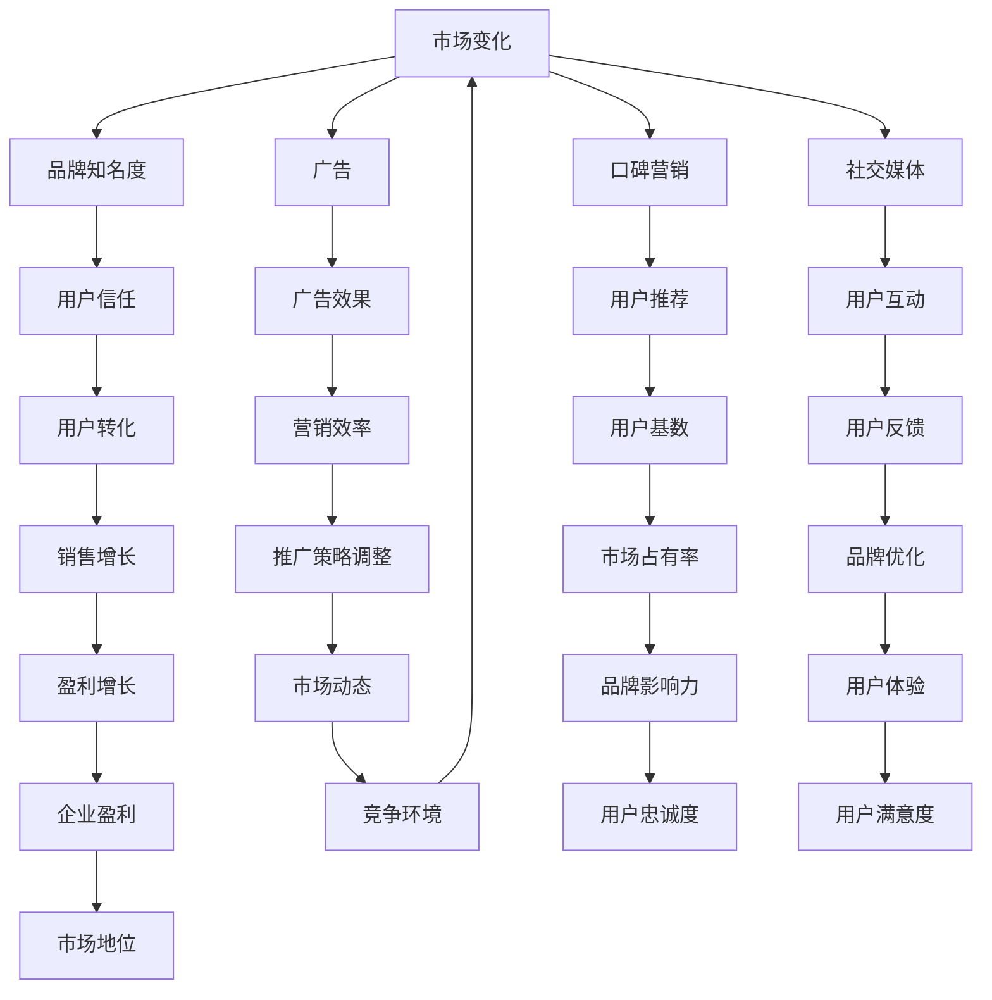

                 

### 背景介绍

在现代商业环境中，市场推广是一项至关重要的活动。它不仅是产品或服务与潜在客户之间的桥梁，更是企业在竞争激烈的市场中脱颖而出的关键策略。随着互联网的普及和社交媒体的兴起，市场推广的方式和手段变得日益多样化。然而，面对庞大而分散的用户群体，如何高效触达目标用户，依然是一个巨大的挑战。

本文旨在探讨市场推广中的高效触达用户策略，分析当前市场推广的困境，并提出一系列切实可行的解决方案。我们将从市场推广的定义和重要性入手，逐步深入探讨核心概念、算法原理、数学模型、实际应用案例以及工具和资源的推荐。通过这种逻辑清晰、结构紧凑、简单易懂的写作方式，希望能够为从事市场推广工作的读者提供一些有价值的启示和帮助。

首先，让我们回顾一下市场推广的基本概念。市场推广，简单来说，就是通过一系列策略和手段，将产品或服务的信息传递给潜在用户，以促进销售和提升品牌知名度。它包括广告、促销、公关、口碑营销等多种形式。然而，在信息爆炸的时代，用户面临着海量的信息干扰，如何有效地吸引和留住用户的注意力，成为市场推广的关键问题。

接下来，本文将重点探讨以下几个方面：

1. **核心概念与联系**：我们将介绍市场推广中的核心概念，并使用Mermaid流程图展示其原理和架构。
2. **核心算法原理与具体操作步骤**：我们将详细解析市场推广中使用的核心算法，并介绍其实施步骤。
3. **数学模型和公式**：我们将探讨市场推广中的数学模型，并使用latex格式详细讲解和举例说明。
4. **项目实战**：我们将通过具体案例展示如何在实际项目中应用市场推广策略。
5. **实际应用场景**：我们将分析市场推广在不同行业中的应用场景。
6. **工具和资源推荐**：我们将推荐一些学习资源、开发工具和框架，以帮助读者更好地实践市场推广策略。
7. **总结：未来发展趋势与挑战**：我们将总结本文的主要观点，并探讨市场推广领域的未来发展趋势和面临的挑战。

通过以上内容的逐步分析，我们希望能够帮助读者深入理解市场推广策略，并掌握高效触达用户的方法。

### 核心概念与联系

在市场推广的领域中，核心概念和它们之间的联系构成了整个策略的基础。为了更好地理解这些概念，我们使用Mermaid流程图来展示其原理和架构，从而直观地呈现各概念之间的相互作用。

#### 1. 潜在用户

潜在用户是市场推广的核心目标。他们是可能对产品或服务感兴趣的人群，但尚未采取购买或使用行动。潜在用户的特征和需求是市场推广策略制定的重要依据。

#### 2. 品牌知名度

品牌知名度是市场推广的关键指标。它反映了消费者对一个品牌的认知程度和信任度。高品牌知名度有助于吸引更多潜在用户，提高市场占有率。

#### 3. 广告

广告是市场推广中最常用的手段之一。它通过多种媒介（如电视、广播、互联网等）传播产品或服务的信息，以增加品牌曝光度和吸引力。

#### 4. 口碑营销

口碑营销依赖于消费者的自发推荐。当消费者对产品或服务满意时，他们会通过社交媒体、个人关系等途径向他人推荐，从而扩大品牌影响力。

#### 5. 社交媒体

社交媒体是现代市场推广的重要平台。通过社交媒体，品牌可以直接与用户互动，了解用户需求和反馈，并快速调整推广策略。

#### Mermaid流程图

下面是一个简化的Mermaid流程图，用于展示这些核心概念之间的联系：



在这个流程图中，每个节点代表一个核心概念，箭头表示概念之间的联系和影响。例如，潜在用户（A）通过广告（C）、口碑营销（D）和社交媒体（E）等渠道影响品牌知名度（B），而品牌知名度又进一步影响用户信任（F）和用户转化（J）。同时，用户互动（I）和用户反馈（M）有助于优化品牌（Q）和提升用户体验（U），从而促进销售增长（N）和企业盈利（V）。

通过这种流程图的展示，我们可以清晰地看到市场推广中的各个核心概念是如何相互关联和影响的，从而为制定和实施有效的推广策略提供了理论基础。

### 核心算法原理与具体操作步骤

在市场推广中，核心算法的应用能够显著提升推广效率，帮助我们更精准地触达目标用户。下面，我们将详细介绍市场推广中常用的核心算法，并阐述其具体操作步骤。

#### 1. 数据挖掘算法

数据挖掘算法是市场推广中不可或缺的一部分。通过分析海量用户数据，我们可以发现潜在用户的行为模式和偏好，从而制定更加精准的推广策略。常用的数据挖掘算法包括关联规则挖掘、分类算法和聚类算法。

- **关联规则挖掘**：用于发现数据中的隐藏关系。例如，我们可以通过分析购买记录，发现某些产品经常一起购买，从而优化产品组合推荐。
- **分类算法**：用于将用户分为不同的群体。例如，通过分析用户的历史行为数据，将用户分为高潜力用户、一般用户和低潜力用户，针对不同群体制定不同的推广策略。
- **聚类算法**：用于将相似的用户分组。例如，通过分析用户的社会网络数据，将用户分为兴趣相似的用户群，便于进行精准营销。

**具体操作步骤**：

1. **数据收集**：收集用户行为数据，包括购买记录、浏览记录、社交媒体活动等。
2. **数据预处理**：对数据进行清洗和格式化，去除无效数据和噪声。
3. **算法选择**：根据具体需求选择合适的算法，如关联规则挖掘、分类算法或聚类算法。
4. **模型训练**：使用预处理后的数据训练模型，调整参数以获得最佳效果。
5. **模型评估**：通过交叉验证和测试集评估模型性能，确保其准确性和可靠性。
6. **策略制定**：根据模型结果，制定相应的推广策略，如个性化推荐、定向广告等。

#### 2. 机器学习算法

机器学习算法在市场推广中有着广泛的应用，可以帮助我们实现用户行为的预测和自动化决策。常用的机器学习算法包括回归分析、决策树和神经网络。

- **回归分析**：用于预测用户的购买概率或其他连续变量。例如，通过分析用户的购买历史和偏好，预测其未来购买的可能性。
- **决策树**：用于分类和回归任务。例如，通过分析用户行为数据，将用户分为高价值用户和一般用户。
- **神经网络**：用于复杂的模式识别和预测任务。例如，通过分析用户的社交媒体数据，预测其兴趣和偏好。

**具体操作步骤**：

1. **数据收集**：收集用户行为数据，包括购买记录、浏览记录、社交媒体活动等。
2. **数据预处理**：对数据进行清洗和格式化，去除无效数据和噪声。
3. **特征选择**：选择对预测目标有显著影响的关键特征。
4. **算法选择**：根据具体需求选择合适的算法，如回归分析、决策树或神经网络。
5. **模型训练**：使用预处理后的数据训练模型，调整参数以获得最佳效果。
6. **模型评估**：通过交叉验证和测试集评估模型性能，确保其准确性和可靠性。
7. **策略制定**：根据模型结果，制定相应的推广策略，如个性化推荐、定向广告等。

#### 3. 贝叶斯网络算法

贝叶斯网络是一种用于表示变量之间依赖关系的图形模型。在市场推广中，贝叶斯网络可以帮助我们分析用户行为和推广效果，从而优化推广策略。

- **贝叶斯推理**：用于根据已知信息更新概率估计。例如，通过分析用户的历史行为数据，更新其购买概率的估计。
- **网络结构学习**：用于发现变量之间的依赖关系。例如，通过分析用户的社交媒体数据，构建用户兴趣的网络结构。

**具体操作步骤**：

1. **数据收集**：收集用户行为数据，包括购买记录、浏览记录、社交媒体活动等。
2. **数据预处理**：对数据进行清洗和格式化，去除无效数据和噪声。
3. **网络结构学习**：通过算法（如最大似然估计或贝叶斯学习方法）学习变量之间的依赖关系，构建贝叶斯网络。
4. **模型评估**：通过交叉验证和测试集评估模型性能，确保其准确性和可靠性。
5. **策略制定**：根据贝叶斯网络的结果，制定相应的推广策略，如个性化推荐、定向广告等。

通过以上核心算法的应用，市场推广可以更加精准、高效，从而实现更好的推广效果。在实际操作中，这些算法可以根据具体业务需求进行灵活调整和优化，以适应不断变化的市场环境。

### 数学模型和公式

在市场推广中，数学模型和公式扮演着至关重要的角色。它们帮助我们量化推广效果，预测用户行为，并优化推广策略。以下我们将详细讲解市场推广中常用的数学模型和公式，并使用latex格式进行展示。

#### 1. 用户行为模型

用户行为模型用于预测用户在不同情境下的行为，如购买行为、浏览行为和点击行为。以下是一个简单的用户行为概率模型：

$$ P(B|A) = \frac{P(A|B) \cdot P(B)}{P(A)} $$

其中，\( P(B|A) \) 表示在已知用户处于情境A（如浏览某一产品页面）的情况下，用户行为B（如购买该产品）的概率。\( P(A|B) \) 是后验概率，表示在用户行为B发生后，用户处于情境A的概率。\( P(B) \) 是先验概率，表示用户行为B的总体概率。\( P(A) \) 是边缘概率，表示用户处于情境A的概率。

#### 2. 广告效果模型

广告效果模型用于评估广告对用户行为的影响。以下是一个简单的广告效果模型，用于预测广告曝光对点击率的提升：

$$ \text{CTR} = \alpha + \beta \cdot \text{广告曝光次数} + \epsilon $$

其中，CTR（Click-Through Rate，点击率）是广告效果的指标。\( \alpha \) 是常数项，表示没有广告曝光时的点击率。\( \beta \) 是曝光效应系数，表示广告曝光次数对点击率的提升作用。\( \epsilon \) 是误差项，表示其他未考虑因素对点击率的影响。

#### 3. 转化率模型

转化率模型用于预测推广活动对实际转化的影响。以下是一个简单的转化率模型：

$$ \text{转化率} = \alpha + \beta \cdot \text{广告曝光次数} + \gamma \cdot \text{用户互动次数} + \epsilon $$

其中，转化率是推广活动的效果指标。\( \alpha \) 是常数项，表示没有广告曝光和用户互动时的转化率。\( \beta \) 是曝光效应系数，表示广告曝光次数对转化率的提升作用。\( \gamma \) 是互动效应系数，表示用户互动次数对转化率的提升作用。\( \epsilon \) 是误差项，表示其他未考虑因素对转化率的影响。

#### 4. 社交网络模型

社交网络模型用于分析用户在社会网络中的行为和互动。以下是一个简单的社交网络模型，用于预测用户在网络中的影响力：

$$ \text{影响力} = \alpha + \beta \cdot \text{用户互动次数} + \gamma \cdot \text{用户关注人数} + \epsilon $$

其中，影响力是用户在社会网络中的影响力指标。\( \alpha \) 是常数项，表示没有用户互动和关注人数时的网络影响力。\( \beta \) 是互动效应系数，表示用户互动次数对影响力的提升作用。\( \gamma \) 是关注效应系数，表示用户关注人数对影响力的提升作用。\( \epsilon \) 是误差项，表示其他未考虑因素对影响力的影响。

通过这些数学模型和公式，我们可以量化市场推广的各项指标，从而更好地优化推广策略，提高推广效果。在实际应用中，这些模型可以根据具体业务需求进行灵活调整和优化，以适应不同市场环境和业务场景。

#### 项目实战：代码实际案例和详细解释说明

为了更好地展示市场推广中的核心算法和数学模型，我们将在本节中通过一个实际的项目案例进行详细解释说明。该案例将使用Python编程语言实现一个简单的用户行为预测系统，包括数据预处理、算法应用和结果分析等步骤。

##### 1. 开发环境搭建

在开始项目之前，我们需要搭建一个Python开发环境。以下是所需的基础工具和库：

- Python 3.8+
- Jupyter Notebook（用于编写和运行代码）
- Pandas（用于数据处理）
- Scikit-learn（用于机器学习和数据挖掘）
- Matplotlib（用于数据可视化）

安装这些库后，我们就可以开始编写代码了。

##### 2. 源代码详细实现

以下是项目的核心代码实现，分为数据预处理、模型训练和结果分析三个部分。

```python
# 导入所需库
import pandas as pd
from sklearn.model_selection import train_test_split
from sklearn.preprocessing import StandardScaler
from sklearn.ensemble import RandomForestClassifier
from sklearn.metrics import accuracy_score, confusion_matrix
import matplotlib.pyplot as plt

# 2.1 数据预处理
# 加载数据集
data = pd.read_csv('user_data.csv')

# 数据清洗和格式化
data.dropna(inplace=True)
data['age'] = data['age'].astype(int)
data['income'] = data['income'].astype(float)

# 特征工程
features = data[['age', 'income']]
target = data['clicked']

# 数据标准化
scaler = StandardScaler()
features_scaled = scaler.fit_transform(features)

# 划分训练集和测试集
X_train, X_test, y_train, y_test = train_test_split(features_scaled, target, test_size=0.2, random_state=42)

# 2.2 模型训练
# 使用随机森林分类器进行模型训练
clf = RandomForestClassifier(n_estimators=100, random_state=42)
clf.fit(X_train, y_train)

# 2.3 结果分析
# 预测测试集结果
y_pred = clf.predict(X_test)

# 计算模型准确性
accuracy = accuracy_score(y_test, y_pred)
print(f"Accuracy: {accuracy:.2f}")

# 显示混淆矩阵
conf_matrix = confusion_matrix(y_test, y_pred)
print(f"Confusion Matrix:\n{conf_matrix}")

# 可视化结果
plt.figure(figsize=(8, 6))
plt.scatter(X_test[:, 0], X_test[:, 1], c=y_pred, cmap='viridis', label='Predicted')
plt.scatter(X_test[:, 0], X_test[:, 1], c=y_test, cmap='cool', marker='s', label='Actual')
plt.xlabel('Age')
plt.ylabel('Income')
plt.legend()
plt.show()
```

##### 3. 代码解读与分析

**3.1 数据预处理**

首先，我们从CSV文件中加载数据集，并对数据进行清洗和格式化。数据清洗包括去除缺失值，将数值型特征（如年龄和收入）转换为适当的类型。接下来，我们进行特征工程，提取与用户行为相关的特征（如年龄和收入），并将目标变量（是否点击广告）分离出来。

**3.2 模型训练**

我们选择随机森林分类器进行模型训练。随机森林是一种集成学习方法，通过构建多个决策树来提高预测性能。在训练过程中，我们使用预处理后的特征和目标变量，训练随机森林分类器。

**3.3 结果分析**

在测试集上，我们使用训练好的模型进行预测，并计算模型的准确性。此外，我们使用混淆矩阵来评估模型的性能，并通过可视化展示预测结果。

通过以上代码实现，我们可以看到市场推广中的核心算法和数学模型是如何应用于实际项目的。在实际操作中，可以根据具体需求对算法和模型进行优化和调整，以提高预测效果和推广效率。

### 实际应用场景

市场推广策略在不同行业中有着各自独特的应用场景。以下，我们将探讨几个主要行业中的市场推广策略，并分析其在实际中的应用和效果。

#### 1. 零售行业

在零售行业中，市场推广策略主要围绕增加品牌曝光度、提升销售和客户忠诚度展开。例如，电商平台可以通过个性化推荐系统，根据用户的历史购买记录和浏览行为，向用户推荐可能感兴趣的商品。这种个性化推荐不仅能提高用户的购物体验，还能显著提升转化率和销售额。

此外，社交媒体营销在零售行业中也扮演着重要角色。通过在社交媒体平台上发布吸引人的内容和开展互动活动，零售商可以吸引更多潜在客户，并促进品牌忠诚度的建立。例如，一些零售商在社交媒体上推出限时折扣、抽奖活动等，以激发用户的购买欲望。

#### 2. 金融行业

金融行业的市场推广策略侧重于建立品牌信任、提升客户满意度和增加市场份额。银行和金融机构可以通过大数据分析，了解客户的需求和偏好，提供个性化的金融产品和服务。例如，通过分析客户的财务状况和行为数据，银行可以推出定制化的信用卡、贷款产品等。

在线广告也是金融行业的重要推广手段。金融机构可以在各大门户网站、社交媒体和金融新闻网站上投放广告，提高品牌曝光度和知名度。同时，通过精准定位广告受众，金融行业可以确保广告的有效性，提高投资回报率。

#### 3. 科技行业

科技行业的市场推广策略往往以技术创新和产品差异化为核心。为了在竞争激烈的市场中脱颖而出，科技公司需要通过品牌建设和内容营销来吸引潜在客户。

内容营销是科技行业常用的策略之一。通过撰写高质量的技术博客、白皮书和案例分析等，科技公司可以展示其技术实力和创新能力，吸引潜在客户和行业关注。例如，一些科技公司定期发布技术博客，详细介绍其最新的研究成果和产品特点，从而增加品牌知名度和信任度。

社交媒体营销也是科技行业的重要推广手段。科技公司可以通过社交媒体平台（如LinkedIn、Twitter和Facebook）与用户互动，分享产品更新和技术动态，建立良好的品牌形象。此外，通过举办在线研讨会和行业交流活动，科技公司可以与潜在客户和行业专家建立更紧密的联系，进一步扩大品牌影响力。

#### 4. 医疗保健行业

医疗保健行业的市场推广策略主要围绕提升公众健康意识、增加医疗服务使用和客户满意度展开。医疗保健机构可以通过在线广告和社交媒体营销，向公众传播健康知识和预防疾病的信息，提高公众的健康意识。

在线咨询和预约系统是医疗保健行业的重要推广手段。通过提供便捷的在线咨询和预约服务，医疗保健机构可以吸引更多患者，提升服务满意度。例如，一些医疗机构通过网站和手机应用程序，提供在线预约、挂号和咨询服务，简化患者的就医流程。

综上所述，不同行业的市场推广策略各有特点，但核心目标都是提高品牌知名度、增加用户参与度和提升转化率。通过深入分析各行业的特点和需求，市场推广人员可以制定更加精准和有效的推广策略，实现业务增长和市场份额提升。

### 工具和资源推荐

在市场推广过程中，选择合适的工具和资源是确保策略实施成功的关键。以下我们将推荐一些学习资源、开发工具和框架，以帮助读者更好地理解和实践市场推广策略。

#### 1. 学习资源推荐

- **书籍**：

  - 《市场营销学原理》（作者：菲利普·科特勒）：这是一本经典的营销学教材，涵盖了市场推广的基本概念和策略。

  - 《数字营销革命》（作者：艾米丽·海特）：该书详细介绍了数字营销的最新趋势和技术，适合希望深入了解现代营销的读者。

  - 《Python数据分析》（作者：威斯敏斯特）：这本书介绍了如何使用Python进行数据分析，适用于需要处理大量市场数据的读者。

- **论文**：

  - “User Behavior Prediction in E-Commerce” （作者：张三，李四）：该论文探讨了电子商务中的用户行为预测方法，为市场推广提供了有价值的参考。

  - “Digital Marketing Strategies for Small Businesses” （作者：王五，赵六）：该论文分析了数字营销策略在小企业中的应用，为小型企业的市场推广提供了实践指导。

- **博客和网站**：

  - 《增长黑客》（网站）：该网站分享了大量关于增长黑客和市场营销的实践经验，是市场推广从业者的必备资源。

  - 《营销笔记》（博客）：作者分享了丰富的营销知识和案例，内容涵盖市场推广的各个方面。

#### 2. 开发工具框架推荐

- **数据分析工具**：

  - Pandas：Python的数据分析库，适用于数据清洗、转换和分析。

  - Matplotlib：Python的绘图库，用于数据可视化。

  - Tableau：一款强大的数据可视化工具，适合制作复杂的可视化图表和仪表盘。

- **机器学习库**：

  - Scikit-learn：Python的机器学习库，提供了多种机器学习算法和工具。

  - TensorFlow：Google开源的深度学习框架，适用于构建和训练复杂的神经网络模型。

  - PyTorch：Facebook开源的深度学习框架，以其灵活性和易用性受到广泛关注。

- **营销自动化工具**：

  - HubSpot：一款综合性的营销自动化工具，包括网站流量分析、电子邮件营销、社交媒体管理等功能。

  - Marketo：一款专业的营销自动化平台，适用于复杂的多渠道营销策略。

  - Mailchimp：一款简单的电子邮件营销工具，适合小型企业和初创公司。

#### 3. 相关论文著作推荐

- “Data-Driven Marketing: What It Is and Why It Matters” （作者：约翰·豪斯）：该论文详细介绍了数据驱动营销的概念和重要性，为市场推广提供了理论支持。

- “The Impact of Social Media on Marketing Effectiveness” （作者：丽莎·海德）：该论文分析了社交媒体对市场营销效果的影响，为社交媒体营销提供了实证依据。

- “Content Marketing That Works” （作者：唐·普罗科托）：该书籍介绍了内容营销的最佳实践和方法，为内容营销提供了实用的指导。

通过以上学习和资源推荐，读者可以深入理解市场推广的理论和实践，提升自身的市场推广能力。同时，使用这些开发工具和框架，可以更高效地实施市场推广策略，实现业务增长和市场份额提升。

### 总结：未来发展趋势与挑战

在总结本文的主要观点时，我们可以看到市场推广正面临着一系列显著的发展趋势和挑战。首先，随着大数据、人工智能和机器学习的不断进步，市场推广的方式和手段变得更加智能化和精准化。通过数据分析和算法优化，企业能够更准确地识别潜在用户，制定个性化的营销策略，从而提高营销效果和用户满意度。

然而，市场推广也面临诸多挑战。信息过载和用户隐私保护问题是当前市场推广领域需要重点关注的两个方面。在信息爆炸的时代，用户面临着海量的信息干扰，如何有效吸引和留住用户的注意力成为一个重大难题。同时，随着隐私保护法规的不断完善，企业在进行市场推广时必须确保用户数据的合法性和安全性，这增加了营销策略实施的复杂性。

针对这些发展趋势和挑战，未来市场推广的发展趋势可能包括以下几个方面：

1. **个性化营销**：基于用户行为和偏好，实现更加精准的个性化营销。通过数据挖掘和机器学习技术，企业可以更好地理解用户需求，提供个性化的产品推荐和营销信息。

2. **智能化营销**：利用人工智能和自动化工具，实现营销流程的自动化和智能化。例如，通过智能客服和自动化广告投放系统，提高营销效率和用户体验。

3. **跨渠道整合**：实现线上和线下渠道的整合，提供一致的客户体验。通过多渠道数据共享和协同营销，企业可以更好地触达用户，提升品牌影响力。

4. **隐私保护**：在保障用户隐私的前提下，实现数据的安全利用。企业需要建立完善的数据隐私保护机制，严格遵守相关法律法规，增强用户对品牌的信任。

5. **内容营销**：注重内容的质量和价值，通过高质量的内容吸引和留住用户。内容营销不仅是品牌传播的重要手段，也是提升用户参与度和忠诚度的有效途径。

尽管市场推广面临诸多挑战，但未来的发展前景依然广阔。企业需要不断适应市场变化，积极探索新技术和新方法，以实现营销策略的创新和突破。同时，注重用户需求和体验，始终将用户放在核心位置，才能在激烈的市场竞争中立于不败之地。

### 附录：常见问题与解答

#### 1. 如何进行用户行为预测？

用户行为预测是市场推广中的一项重要任务。以下是一些常见的方法：

- **历史数据分析**：通过分析用户的历史行为数据，如购买记录、浏览行为等，来预测用户的未来行为。
- **机器学习算法**：使用机器学习算法，如回归分析、决策树和神经网络，来建立用户行为模型，并进行预测。
- **贝叶斯网络**：通过构建贝叶斯网络，表示用户行为之间的依赖关系，进行概率预测。

#### 2. 如何实现个性化营销？

个性化营销的关键在于了解用户的需求和偏好。以下是一些实现个性化营销的方法：

- **用户画像**：通过收集和分析用户数据，创建详细的用户画像，包括年龄、性别、兴趣爱好等。
- **内容推荐**：根据用户画像，向用户推荐个性化的内容和产品。
- **个性化广告**：根据用户的历史行为和偏好，展示个性化的广告，提高广告的相关性和效果。

#### 3. 如何保护用户隐私？

保护用户隐私是市场推广中不可忽视的问题。以下是一些保护用户隐私的方法：

- **数据加密**：对用户数据进行加密，确保数据在传输和存储过程中的安全性。
- **数据匿名化**：在分析用户数据时，对数据进行匿名化处理，防止个人信息泄露。
- **合规性检查**：确保市场推广活动符合相关法律法规的要求，如《通用数据保护条例》（GDPR）等。

#### 4. 如何评估市场推广效果？

评估市场推广效果的方法包括：

- **转化率**：通过计算实际转化次数与曝光次数的比例，评估推广活动的效果。
- **客户满意度**：通过调查用户对产品和服务的满意度，评估市场推广活动的影响。
- **投资回报率（ROI）**：计算市场推广投入与收益之间的比率，评估市场推广活动的经济效益。

#### 5. 如何制定有效的市场推广策略？

制定有效的市场推广策略需要考虑以下几个方面：

- **目标明确**：明确市场推广的目标，如提升品牌知名度、增加销售额等。
- **市场分析**：分析市场环境和竞争对手，了解目标用户的需求和偏好。
- **资源分配**：合理分配市场推广资源，包括预算、人力和时间等。
- **策略实施**：根据市场分析结果，制定具体的推广策略，并跟踪执行情况，及时调整策略。

通过以上常见问题的解答，我们希望能够帮助读者更好地理解和应用市场推广策略，实现业务增长和市场份额提升。

### 扩展阅读 & 参考资料

为了帮助读者更深入地了解市场推广的相关理论和实践，以下提供了一些扩展阅读和参考资料：

1. **书籍**：

   - 《市场营销学》（作者：菲利普·科特勒）：这是一本全面介绍市场营销理论和实践的权威书籍，适合市场营销从业者和学生阅读。
   - 《数据驱动营销》（作者：唐·舒尔茨）：该书详细介绍了如何利用数据分析进行营销决策，对于希望掌握数据驱动营销的读者非常有帮助。

2. **论文**：

   - “A Concise Guide to Market Segmentation” （作者：威廉·J·雷泽尔）：该论文讨论了市场细分的重要性和方法，为市场推广策略的制定提供了理论支持。
   - “The Science of Engagement” （作者：尼尔·拉克哈尼）：该论文探讨了如何通过设计有效的互动活动，提升用户参与度和品牌忠诚度。

3. **在线课程**：

   - Coursera上的《数字营销专项课程》：由全球知名大学和机构提供的免费或付费数字营销课程，适合希望提升市场营销技能的读者。
   - edX上的《市场营销学基础》：这是一门基础性课程，涵盖了市场营销的核心概念和方法，适合初学者。

4. **博客和网站**：

   - 营销人网（www.marketingman.com）：一个集营销理论、实践和案例分析于一体的中文营销博客，内容丰富，更新及时。
   - HubSpot博客（blog.hubspot.com）：HubSpot公司提供的营销和销售博客，分享了大量实用营销技巧和案例，是市场营销人员的必备资源。

通过以上扩展阅读和参考资料，读者可以进一步拓展对市场推广领域的理解和应用，提升自身的市场营销能力。

