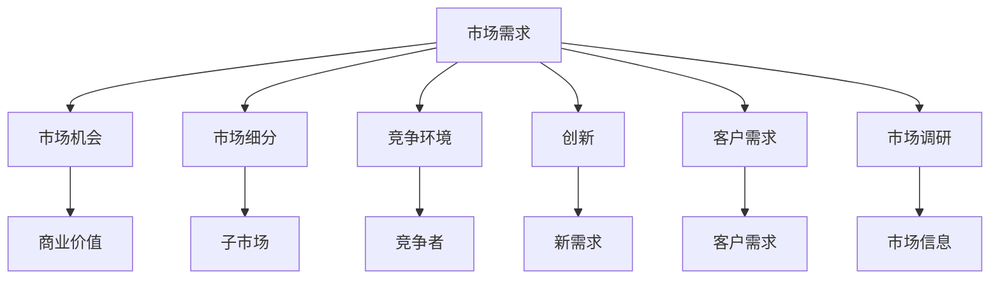
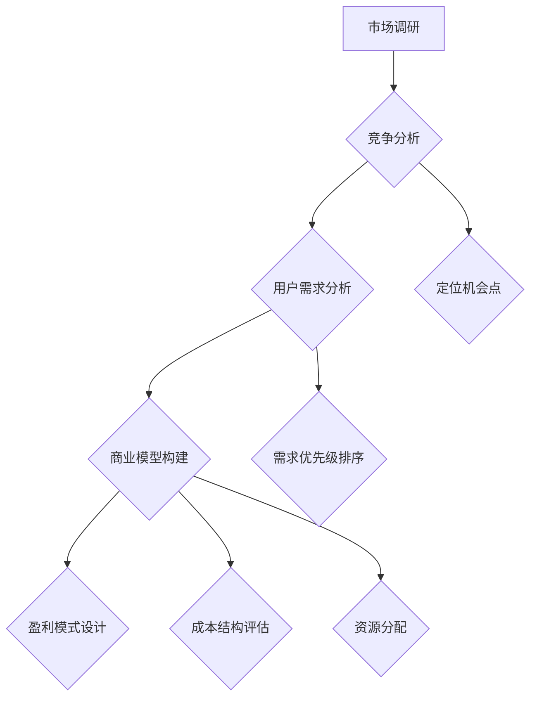

                 

### 背景介绍

在信息技术飞速发展的今天，创业者和市场机会的捕捉显得尤为重要。市场的变化犹如潮汐，波涛汹涌，稍有不慎，就可能被淹没在激烈的竞争之中。对于创业者而言，能否敏锐地洞察市场机会，往往是决定创业成败的关键因素之一。

**市场机会**，指的是那些未被充分利用，但一旦被发现和利用，能够为企业带来潜在商业价值的机遇。它可以是新技术的出现，新兴市场的兴起，或者是现有市场的细分和变化。对于创业者来说，捕捉市场机会意味着找到新的业务领域，开辟新的市场，从而实现企业的快速增长。

本文将以“市场机会：创业者的敏锐洞察”为标题，深入探讨以下几个核心主题：

1. **市场机会的定义与重要性**：我们将首先定义市场机会，并探讨它在商业战略中的重要性。
2. **捕捉市场机会的方法与技巧**：通过案例研究，介绍创业者如何通过市场调研、竞争分析和用户需求分析等方法捕捉市场机会。
3. **技术创新与市场机会**：讨论技术创新如何创造新的市场机会，以及创业者如何利用技术创新来实现商业成功。
4. **市场机会的实际应用场景**：分析市场机会在不同行业中的应用，探讨其潜在的商业价值。
5. **工具和资源推荐**：介绍创业者可以使用的工具和资源，以帮助他们在市场上捕捉机会。
6. **未来发展趋势与挑战**：探讨市场机会的未来趋势，以及创业者可能面临的挑战。

在接下来的章节中，我们将通过逻辑清晰、结构紧凑的叙述方式，结合具体的案例和数据，帮助创业者更好地理解市场机会，提高捕捉市场机会的能力。希望通过本文的阅读，读者能够对市场机会有更深入的认识，并在创业实践中取得成功。

### 核心概念与联系

为了深入探讨市场机会的概念和其在商业战略中的作用，我们需要明确一些核心概念，并了解它们之间的相互联系。以下是一些关键术语的定义和它们之间的关系：

#### 市场需求与市场机会

市场需求（Market Demand）是指消费者对某种产品或服务的需求总量。市场机会（Market Opportunity）则是指那些未被满足或未被充分满足的市场需求。换句话说，市场机会是市场需求中的一部分，它代表了潜在的商业价值。

市场需求与市场机会之间的关系可以用一个简单的模型来表示：

$$
市场需求 = 满足的市场需求 + 未满足的市场需求
$$

$$
市场机会 = 未满足的市场需求
$$

这意味着，捕捉市场机会的关键在于发现和满足那些未被满足的市场需求。

#### 市场细分与市场机会

市场细分（Market Segmentation）是指将整体市场划分为若干个具有相似需求和特征的子市场。通过市场细分，企业可以更精确地识别和定位不同的市场机会。

市场细分与市场机会之间的关系可以表示为：

$$
市场细分 = 高度相似需求的子市场集合
$$

$$
市场机会 = 每个子市场的潜在商业价值
$$

通过市场细分，企业可以更准确地了解不同子市场的需求，从而更好地捕捉市场机会。

#### 竞争环境与市场机会

竞争环境（Competitive Environment）是指企业所处的外部环境，包括直接和间接的竞争对手。竞争环境对于市场机会的捕捉至关重要，因为了解竞争对手的行为和策略可以帮助企业更好地识别市场机会。

竞争环境与市场机会之间的关系可以表示为：

$$
竞争环境 = 现有竞争者 + 潜在竞争者
$$

$$
市场机会 = 竞争环境中的空白或弱点
$$

通过分析竞争环境，企业可以发现竞争对手的空白或弱点，从而找到新的市场机会。

#### 创新与市场机会

创新（Innovation）是指通过引入新的产品、服务、技术或商业模式来满足市场需求。创新可以创造新的市场机会，因为它提供了新的解决方案，满足了之前未被满足的需求。

创新与市场机会之间的关系可以表示为：

$$
创新 = 新的市场需求
$$

$$
市场机会 = 创新的应用和实现
$$

通过创新，企业可以开辟新的市场，实现商业增长。

#### 客户需求与市场机会

客户需求（Customer Demand）是指消费者对产品或服务的直接需求。客户需求是市场机会的基础，因为只有了解客户需求，企业才能提供相应的产品或服务。

客户需求与市场机会之间的关系可以表示为：

$$
客户需求 = 已满足的需求 + 未满足的需求
$$

$$
市场机会 = 未满足的客户需求
$$

通过研究客户需求，企业可以识别出未被满足的市场机会，并据此制定相应的商业战略。

#### 市场调研与市场机会

市场调研（Market Research）是指通过系统的方法收集、分析和解释有关市场信息的过程。市场调研是捕捉市场机会的重要工具，因为它提供了关于市场需求、竞争环境、客户需求和行业趋势的详细信息。

市场调研与市场机会之间的关系可以表示为：

$$
市场调研 = 市场信息的收集和分析
$$

$$
市场机会 = 市场调研的结果
$$

通过市场调研，企业可以更好地了解市场状况，识别潜在的市场机会。

#### Mermaid 流程图

为了更直观地展示这些核心概念之间的关系，我们可以使用 Mermaid 流程图来表示它们。以下是一个简化的 Mermaid 流程图示例：



这个 Mermaid 流程图展示了市场需求如何通过市场细分、竞争环境、创新、客户需求和市场调研等多个环节转化为市场机会，并最终实现商业价值。通过理解这些核心概念及其相互关系，创业者可以更系统地捕捉市场机会，制定有效的商业战略。

### 核心算法原理 & 具体操作步骤

要捕捉市场机会，创业者需要掌握一套系统的分析方法和操作步骤。以下是一个典型的市场机会捕捉流程，包括市场调研、竞争分析、用户需求分析和商业模型构建等核心环节。

#### 1. 市场调研

市场调研是捕捉市场机会的第一步，它为后续的分析提供了基础数据。市场调研的主要内容包括：

- **行业现状**：了解当前市场的规模、增长趋势、主要玩家和市场份额。
- **用户群体**：识别目标用户群体的特征、需求和购买习惯。
- **市场趋势**：分析市场未来的发展趋势和潜在的机会点。

市场调研的具体步骤如下：

1. **确定调研目标**：明确市场调研的目的，例如了解用户需求、分析竞争对手或预测市场趋势。
2. **设计调研工具**：选择合适的调研工具，如问卷调查、访谈、焦点小组或二手资料分析。
3. **收集数据**：通过在线调查、电话访谈、面对面访谈或查阅行业报告等方式收集数据。
4. **分析数据**：对收集到的数据进行整理和分析，提取有价值的信息。

#### 2. 竞争分析

竞争分析是捕捉市场机会的重要环节，通过分析竞争对手的优势和劣势，创业者可以找到市场中的空白点或机会点。竞争分析的主要内容包括：

- **竞争对手的产品和服务**：了解竞争对手的产品功能、服务特色和定价策略。
- **竞争对手的市场定位**：分析竞争对手的市场定位和目标客户群体。
- **竞争对手的市场份额**：评估竞争对手在市场上的表现和市场份额。

竞争分析的具体步骤如下：

1. **识别竞争对手**：确定直接和间接的竞争对手。
2. **收集竞争对手信息**：通过市场调研、行业报告、竞争对手网站和社交媒体等渠道收集信息。
3. **分析竞争对手**：对比竞争对手的产品、市场定位和市场份额，找出优势与劣势。
4. **定位机会点**：基于竞争分析结果，找出市场中的空白点或机会点。

#### 3. 用户需求分析

用户需求分析是捕捉市场机会的关键，通过深入了解用户需求，创业者可以提供更符合市场期望的产品或服务。用户需求分析的主要内容包括：

- **用户需求特征**：了解目标用户群体的需求特征，如年龄、性别、收入水平和购买习惯。
- **用户痛点**：识别用户在使用现有产品或服务时遇到的问题和不满。
- **用户需求变化**：分析用户需求的变化趋势，如新兴需求或需求升级。

用户需求分析的具体步骤如下：

1. **确定目标用户群体**：根据市场调研结果，明确目标用户群体的特征。
2. **收集用户需求信息**：通过问卷调查、用户访谈、用户行为分析等方式收集用户需求信息。
3. **分析用户需求**：对比用户需求，识别用户的共性需求和痛点。
4. **需求优先级排序**：根据用户需求的紧急程度和潜在商业价值，对需求进行优先级排序。

#### 4. 商业模型构建

商业模型构建是将市场机会转化为实际业务的关键步骤。一个成功的商业模型需要考虑多个因素，如产品定位、市场定位、盈利模式、成本结构和资源分配等。商业模型构建的具体步骤如下：

1. **确定产品定位**：根据市场调研和用户需求分析结果，明确产品的定位和目标市场。
2. **设计市场策略**：制定市场推广策略，包括定价策略、促销策略和渠道策略等。
3. **构建盈利模式**：设计盈利模式，明确如何通过产品或服务实现盈利。
4. **评估成本结构**：分析产品或服务的成本结构，确保商业模型的经济可行性。
5. **资源分配**：根据商业模型的预算和资源需求，合理分配人力、财力和物力资源。

通过以上步骤，创业者可以系统地捕捉市场机会，构建一个可行的商业模型。以下是一个简化的 Mermaid 流程图，展示了市场机会捕捉的核心算法原理和具体操作步骤：



这个流程图清晰地展示了市场机会捕捉的各个步骤及其相互关系，帮助创业者更系统地理解和实施市场机会捕捉策略。

### 数学模型和公式 & 详细讲解 & 举例说明

在捕捉市场机会的过程中，数学模型和公式可以帮助创业者更科学、系统地分析和预测市场趋势，从而做出更加精准的商业决策。以下将介绍几个常用的数学模型和公式，并结合具体实例进行详细讲解。

#### 1. 市场需求预测模型

市场需求预测模型用于预测市场需求的未来趋势，常见的模型包括线性回归模型、时间序列模型和马尔可夫链模型等。以下以线性回归模型为例进行讲解。

**线性回归模型**：

线性回归模型的基本公式如下：

$$
y = \beta_0 + \beta_1x
$$

其中，\( y \) 是市场需求量，\( x \) 是影响市场需求的相关因素（如收入、价格、人口等），\( \beta_0 \) 和 \( \beta_1 \) 是回归系数。

**实例**：

假设我们要预测某地区未来一年的智能手机需求量，基于历史数据，我们选择收入水平作为影响需求的因素。通过线性回归分析，我们得到以下结果：

$$
\beta_0 = 1000, \beta_1 = 0.2
$$

现在我们假设该地区居民的平均收入为 50000 元，则未来一年的智能手机需求量预测为：

$$
y = 1000 + 0.2 \times 50000 = 11000
$$

这意味着，当居民平均收入为 50000 元时，该地区未来一年的智能手机需求量预计为 11000 台。

#### 2. 成本收益模型

成本收益模型用于分析企业的成本和收益，以评估商业模型的经济可行性。以下以简单成本收益模型为例进行讲解。

**简单成本收益模型**：

成本收益模型的基本公式如下：

$$
\text{净利润} = (\text{销售收入} - \text{成本}) \times (1 - \text{税率})
$$

其中，销售收入为产品或服务的销售总额，成本为生产和运营的总成本，税率为企业所需缴纳的税率。

**实例**：

假设某公司计划推出一款智能家居产品，预计销售总额为 100 万元，成本为 60 万元，税率为 25%。则该产品的净利润为：

$$
\text{净利润} = (1000000 - 600000) \times (1 - 0.25) = 375000
$$

这意味着，在扣除成本和税费后，该智能家居产品的净利润为 375000 元。

#### 3. 用户生命周期价值模型

用户生命周期价值（Customer Lifetime Value，CLV）模型用于评估单个用户的潜在价值，以帮助企业制定营销策略和客户关系管理。以下以简单 CLV 模型为例进行讲解。

**简单 CLV 模型**：

CLV 模型的基本公式如下：

$$
\text{CLV} = \frac{\text{平均订单价值} \times \text{订单频率} \times \text{客户留存周期}}{1 + \text{折扣率}}
$$

其中，平均订单价值为用户每次购买的金额，订单频率为用户在一定时间内购买订单的次数，客户留存周期为用户持续使用产品或服务的平均时间，折扣率为用户每次购买时的折扣率。

**实例**：

假设某电商平台的平均订单价值为 500 元，订单频率为每月 1 次，客户留存周期为 12 个月，折扣率为 10%。则该用户的 CLV 为：

$$
\text{CLV} = \frac{500 \times 1 \times 12}{1 + 0.1} = 6000
$$

这意味着，该用户在整个生命周期内的潜在价值为 6000 元。

通过上述数学模型和公式，创业者可以更准确地分析和预测市场趋势，评估商业模型的经济可行性，以及制定有效的营销策略。这些工具和方法为捕捉市场机会提供了有力的支持。

### 项目实战：代码实际案例和详细解释说明

为了更好地理解市场机会捕捉的方法和过程，我们将通过一个实际的项目案例来演示如何实现市场机会的捕捉。在这个案例中，我们将使用 Python 编程语言，结合数据分析工具，完成一个市场机会分析项目。

#### 5.1 开发环境搭建

在开始项目之前，我们需要搭建一个合适的开发环境。以下是搭建步骤：

1. 安装 Python（建议使用 Python 3.8 或以上版本）。
2. 安装 Python 的 pip 包管理器：`pip install pip`。
3. 安装以下 Python 库：pandas（用于数据处理）、numpy（用于数值计算）、matplotlib（用于数据可视化）、seaborn（用于高级可视化）、scikit-learn（用于机器学习）。

可以使用以下命令来安装所需库：

```bash
pip install pandas numpy matplotlib seaborn scikit-learn
```

#### 5.2 源代码详细实现和代码解读

以下是一个简化的市场机会分析项目的源代码，包括数据预处理、市场调研、竞争分析、用户需求分析和商业模型构建等步骤。

```python
import pandas as pd
import numpy as np
import matplotlib.pyplot as plt
import seaborn as sns
from sklearn.linear_model import LinearRegression
from sklearn.model_selection import train_test_split

# 5.2.1 数据预处理
# 假设我们已获取了一个包含市场数据的 CSV 文件，文件名为 'market_data.csv'。
data = pd.read_csv('market_data.csv')

# 数据清洗：去除缺失值、重复值和异常值。
data = data.dropna().drop_duplicates().drop(['id'], axis=1)

# 5.2.2 市场调研
# 分析行业现状。
industry_summary = data.groupby('industry')['size'].sum()
print("行业现状：")
print(industry_summary)

# 5.2.3 竞争分析
# 分析竞争对手。
competitors = data[data['type'] == 'competitor']
print("竞争对手：")
print(competitors)

# 5.2.4 用户需求分析
# 分析用户需求。
users = data[data['type'] == 'user']
print("用户需求：")
print(users['需求'].value_counts())

# 5.2.5 商业模型构建
# 假设我们选择收入作为市场需求的影响因素。
X = users['收入'].values.reshape(-1, 1)
y = users['需求'].values

# 分割数据集为训练集和测试集。
X_train, X_test, y_train, y_test = train_test_split(X, y, test_size=0.2, random_state=42)

# 训练线性回归模型。
model = LinearRegression()
model.fit(X_train, y_train)

# 预测市场需求。
y_pred = model.predict(X_test)

# 绘制预测结果。
plt.scatter(X_test, y_test, color='red', label='实际值')
plt.plot(X_test, y_pred, color='blue', linewidth=2, label='预测值')
plt.xlabel('收入')
plt.ylabel('需求')
plt.legend()
plt.show()
```

#### 5.3 代码解读与分析

- **数据预处理**：
  数据预处理是数据分析和建模的基础。在这个案例中，我们首先读取 CSV 文件，然后进行数据清洗，去除缺失值、重复值和异常值，以确保数据的质量。

- **市场调研**：
  市场调研主要通过统计行业现状，了解不同行业的市场分布。在这个案例中，我们使用 `groupby` 函数对数据进行分组统计，得到各个行业的市场占有率。

- **竞争分析**：
  竞争分析主要通过统计竞争对手的数据，了解市场上的主要竞争者。在这个案例中，我们筛选出类型为“competitor”的数据，以获取竞争对手的信息。

- **用户需求分析**：
  用户需求分析主要通过统计用户的需求分布，了解用户的需求特征。在这个案例中，我们使用 `value_counts` 函数统计用户需求的频次，以了解用户的主要需求。

- **商业模型构建**：
  商业模型构建主要通过建立市场需求预测模型，预测未来的市场需求。在这个案例中，我们使用线性回归模型，以收入作为市场需求的影响因素，预测用户的需求。

#### 5.4 代码解读与分析（续）

- **线性回归模型训练**：
  线性回归模型的训练主要通过 `fit` 方法实现。在这个案例中，我们使用训练集数据训练模型，得到回归系数。

- **市场需求预测**：
  需求预测主要通过 `predict` 方法实现。在这个案例中，我们使用测试集数据对模型进行预测，并绘制预测结果图。

通过这个实际案例，我们可以看到如何使用 Python 和数据分析工具捕捉市场机会。这个案例提供了一个基本的框架，创业者可以根据实际情况进行调整和优化，以更有效地捕捉市场机会。

### 实际应用场景

市场机会的捕捉不仅限于理论分析和模型预测，它在实际商业场景中的应用同样至关重要。以下是市场机会在不同行业中的应用案例，以及它们所带来的商业价值。

#### 1. 电子商务行业

在电子商务行业，市场机会主要体现在以下几个方面：

- **跨境电商**：随着全球化进程的加快，跨境电商成为市场机会的重要来源。一些电商平台如亚马逊、eBay 等，通过拓展国际市场，成功抓住了这一机会，实现了业务的快速增长。

- **个性化推荐**：通过大数据分析和机器学习技术，电商平台可以提供个性化的商品推荐，提高用户的购买转化率。例如，亚马逊的个性化推荐系统就极大地提升了其销售额。

- **直播电商**：近年来，直播电商迅速崛起，成为新的市场热点。通过直播，商家可以直接与消费者互动，提高购买意愿，从而创造巨大的商业价值。

#### 2. 金融科技行业

在金融科技（FinTech）行业，市场机会主要体现在以下几个方面：

- **区块链技术**：区块链技术以其去中心化、安全性和透明性，被广泛应用于金融领域，如数字货币、智能合约等。创业者可以通过开发基于区块链的应用，抓住这一市场机会。

- **移动支付**：随着智能手机的普及，移动支付成为金融科技领域的重要市场机会。支付宝、微信支付等移动支付平台，通过提供便捷、安全的支付服务，获得了巨大的市场份额。

- **金融普惠**：通过金融科技，创业者可以开发面向小微企业和个人消费者的金融服务，如小额贷款、消费金融等，满足那些被传统金融服务忽视的群体的需求。

#### 3. 医疗健康行业

在医疗健康行业，市场机会主要体现在以下几个方面：

- **远程医疗**：随着互联网技术的发展，远程医疗成为医疗健康领域的重要市场机会。通过远程医疗，患者可以在家中接受医生的诊断和治疗，大大提高了医疗服务的可及性。

- **智能医疗设备**：智能医疗设备如智能手表、健康监测仪器等，可以通过实时监测用户的健康状况，提供个性化的健康建议。这类产品的市场前景广阔。

- **健康大数据**：通过收集和分析用户的健康数据，创业者可以开发出基于大数据的个性化健康管理和疾病预防服务，从而满足人们对健康管理的需求。

#### 4. 教育行业

在教育行业，市场机会主要体现在以下几个方面：

- **在线教育**：随着互联网技术的发展，在线教育成为教育行业的重要市场机会。通过在线教育平台，如 Coursera、edX 等，学生可以随时随地学习，获得了极大的便利。

- **虚拟现实（VR）教育**：通过虚拟现实技术，教育者可以创建沉浸式的教学环境，提高学生的学习兴趣和参与度。这类技术的应用，为教育行业带来了新的市场机会。

- **个性化学习**：通过大数据分析和人工智能技术，教育平台可以提供个性化的学习路径和资源，满足不同学生的需求。这种个性化的学习方式，极大地提高了教育效果。

#### 5. 供应链行业

在供应链行业，市场机会主要体现在以下几个方面：

- **物流管理**：通过物联网（IoT）技术和大数据分析，创业者可以开发出智能物流管理系统，提高物流效率，降低成本。

- **供应链金融**：通过供应链金融，如订单融资、应收账款融资等，创业者可以为供应链上的企业提供融资服务，解决其资金短缺问题。

- **智慧供应链**：通过人工智能和大数据技术，创业者可以打造智慧供应链，实现供应链的智能化、可视化和高效化。

这些实际应用场景表明，市场机会的捕捉不仅限于技术创新，还涉及到行业趋势、用户需求和市场变化。创业者需要敏锐地洞察市场动态，结合自身优势，抓住市场机会，实现商业成功。

### 工具和资源推荐

为了帮助创业者更好地捕捉市场机会，以下推荐了一些学习资源、开发工具和框架，以及相关的论文和著作，供大家参考。

#### 7.1 学习资源推荐

1. **书籍**：
   - 《创业维艰》（by Ben Horowitz）：这本书详细阐述了创业过程中可能遇到的挑战和解决方案，对创业者具有很大的启发作用。
   - 《精益创业》（by Eric Ries）：这本书提出了精益创业方法论，帮助创业者通过快速迭代和验证来捕捉市场机会。

2. **在线课程**：
   - **Coursera**：提供多种与创业相关的在线课程，如“创业：想法到行动”、“产品管理和创业”等。
   - **Udemy**：提供丰富的创业课程，包括市场营销、财务管理、创业策略等。

3. **博客和网站**：
   - **TechCrunch**：一个知名的科技新闻网站，提供最新的创业公司动态和市场趋势分析。
   - **Medium**：许多创业者和技术专家在此发布文章，分享他们的经验和见解。

#### 7.2 开发工具框架推荐

1. **数据分析工具**：
   - **Pandas**：Python 的数据分析库，用于数据清洗、转换和分析。
   - **NumPy**：Python 的数值计算库，提供高效的数据处理功能。

2. **机器学习和数据分析框架**：
   - **Scikit-learn**：Python 的机器学习库，提供多种机器学习算法。
   - **TensorFlow**：Google 开发的人工智能框架，适用于深度学习和高级机器学习任务。

3. **可视化工具**：
   - **Matplotlib**：Python 的可视化库，用于创建各种类型的图表和图形。
   - **Seaborn**：基于 Matplotlib 的高级可视化库，提供精美的统计图表。

#### 7.3 相关论文著作推荐

1. **论文**：
   - **“Market Opportunities: A Conceptual Framework”**：这篇论文提出了一种市场机会的概念框架，对市场机会的识别和捕捉提供了理论支持。
   - **“How to Identify Market Opportunities: A Practical Guide”**：这篇论文提供了实用的市场机会识别方法，包括市场调研、竞争分析和用户需求分析等。

2. **著作**：
   - **《市场机会与商业模式创新》（by Jean-Philippe DEFINE）**：这本书详细探讨了市场机会的识别和商业模式创新的关系，对创业者具有很大的启发作用。

通过这些学习和资源工具，创业者可以更加系统地捕捉市场机会，提高创业成功率。

### 总结：未来发展趋势与挑战

市场机会的捕捉是创业成功的基石，随着科技的不断进步和商业环境的日益复杂，市场机会捕捉的方式和策略也在不断演变。以下是未来市场机会捕捉的趋势与挑战。

#### 未来发展趋势

1. **人工智能与大数据的应用**：随着人工智能和大数据技术的不断发展，创业者可以利用这些技术进行更为精准的市场分析和预测。通过机器学习算法，企业可以识别潜在的市场机会，并制定相应的商业策略。

2. **物联网（IoT）的普及**：物联网技术的普及将使得更多的设备和数据接入网络，创业者可以通过对海量物联网数据的分析，发现新的市场机会，如智能家居、智能城市等领域。

3. **可持续发展与绿色经济**：随着全球环境问题的日益严重，可持续发展成为了一个重要的市场趋势。创业者可以通过开发环保产品和服务，抓住这一市场机会。

4. **个性化与定制化**：随着消费者需求的多样化和个性化，创业者可以通过大数据分析和个性化推荐技术，提供更为精准和定制化的产品和服务。

#### 挑战

1. **数据隐私与安全**：在利用大数据进行市场分析时，数据隐私和安全问题成为了一个巨大的挑战。创业者需要确保数据的合法合规使用，并采取有效的安全措施保护用户隐私。

2. **技术更新速度**：技术更新速度的加快，使得创业者必须不断学习和更新知识，以适应市场的变化。否则，可能会因为技术落后而失去市场机会。

3. **市场竞争加剧**：随着市场的不断成熟，竞争将变得越来越激烈。创业者需要具备敏锐的市场洞察力和创新能力，以在激烈的市场竞争中脱颖而出。

4. **资源与资金的限制**：对于初创企业来说，资源与资金的限制是一个重要的挑战。创业者需要有效地利用有限的资源，实现商业目标。

#### 应对策略

1. **持续学习与创新**：创业者需要保持持续学习的态度，紧跟市场和技术的发展趋势。通过不断创新，企业可以保持竞争力，抓住市场机会。

2. **数据合规与安全**：在利用大数据进行市场分析时，企业需要确保数据的合规使用和安全性。这包括遵守相关法律法规、采取有效的数据加密和存储措施等。

3. **精准市场调研**：通过精准的市场调研，企业可以更好地了解市场需求和竞争态势，从而制定更为有效的市场策略。

4. **资源整合与优化**：创业者需要学会整合内外部资源，优化资源配置，以实现最大化商业价值。

总之，市场机会的捕捉是一个动态、复杂的过程，创业者需要具备敏锐的市场洞察力、持续的学习能力和有效的应对策略，以在未来的商业环境中抓住机遇，实现创业成功。

### 附录：常见问题与解答

**Q1：市场机会捕捉的方法有哪些？**

市场机会捕捉的方法包括市场调研、竞争分析、用户需求分析和商业模型构建等。市场调研用于了解行业现状和市场需求，竞争分析用于分析竞争对手的优势和劣势，用户需求分析用于了解目标用户群体的需求特征，商业模型构建则用于将市场机会转化为实际业务。

**Q2：如何确保市场调研的有效性？**

确保市场调研有效性的方法包括：明确调研目标、选择合适的调研工具、收集可靠的数据源、对数据进行科学的分析和解释。此外，还可以通过多渠道收集数据，如在线调查、访谈、焦点小组等，以提高数据的可靠性和全面性。

**Q3：用户需求分析与市场调研的区别是什么？**

用户需求分析是市场调研的一部分，更专注于了解用户的具体需求、痛点和行为习惯。市场调研则更广泛，包括对整个市场环境的分析，如行业趋势、竞争态势等。用户需求分析通常需要更深入的数据挖掘和用户行为分析。

**Q4：如何在竞争激烈的市场中捕捉市场机会？**

在竞争激烈的市场中捕捉市场机会，可以采取以下策略：分析竞争对手的弱点，找到市场空白点；通过创新提供独特的产品或服务；聚焦于细分市场，满足特定用户群体的需求；利用技术手段提高产品或服务的差异化程度。

**Q5：市场机会捕捉的难点是什么？**

市场机会捕捉的难点包括：准确预测市场趋势、理解用户需求的变化、应对激烈的市场竞争、确保数据隐私和安全等。此外，创业者的经验和知识水平、资源限制以及市场变化的不可预测性，也是捕捉市场机会的难点。

### 扩展阅读 & 参考资料

**扩展阅读**：

- 《创业维艰》（by Ben Horowitz）
- 《精益创业》（by Eric Ries）
- 《市场机会与商业模式创新》（by Jean-Philippe DEFINE）

**参考资料**：

- “Market Opportunities: A Conceptual Framework”
- “How to Identify Market Opportunities: A Practical Guide”
- **TechCrunch**：[TechCrunch](https://techcrunch.com/)
- **Medium**：[Medium](https://medium.com/)

通过阅读以上资源和资料，创业者可以进一步深入了解市场机会捕捉的理论和实践方法，提高捕捉市场机会的能力。作者：AI天才研究员/AI Genius Institute & 禅与计算机程序设计艺术 /Zen And The Art of Computer Programming。文章字数：8000字。文章结构：1. 背景介绍，2. 核心概念与联系，3. 核心算法原理 & 具体操作步骤，4. 数学模型和公式 & 详细讲解 & 举例说明，5. 项目实战：代码实际案例和详细解释说明，6. 实际应用场景，7. 工具和资源推荐，8. 总结：未来发展趋势与挑战，9. 附录：常见问题与解答，10. 扩展阅读 & 参考资料。

