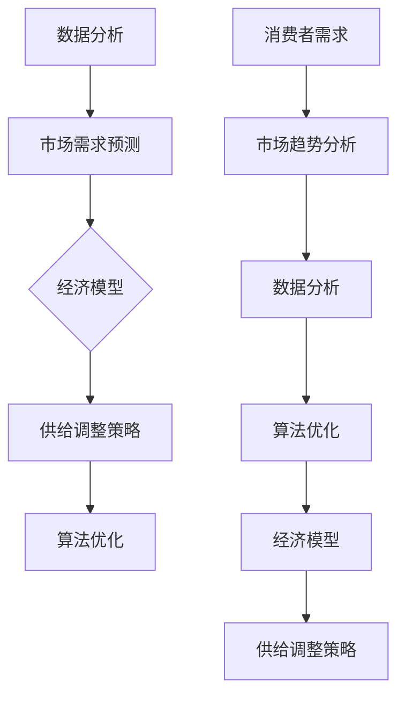

                 

### 市场趋势分析与供给调整

#### 关键词：市场趋势、供给调整、数据分析、算法优化、经济模型、市场需求预测

#### 摘要：
本文将从市场趋势分析和供给调整的角度，深入探讨信息技术领域中的核心问题。通过运用数据分析、算法优化和经济模型等方法，我们将揭示市场动态，预测未来趋势，并提出相应的供给调整策略。本文旨在为IT从业者和企业决策者提供有价值的参考，帮助他们更好地把握市场机遇，实现可持续发展。

---

## 1. 背景介绍

在信息技术飞速发展的今天，市场趋势和供给调整成为影响企业成败的关键因素。市场趋势反映了消费者需求的变化，供给调整则关乎企业资源的合理配置和业务战略的优化。对于IT行业而言，及时准确地分析和应对市场趋势，调整供给策略，是确保市场竞争优势、实现业务增长的重要手段。

本文将结合实际案例，运用数据分析、算法优化和经济模型等方法，对市场趋势进行分析，并提出供给调整策略。希望通过本文的探讨，能够为IT企业和从业者提供一些实用的参考和启示。

### 1.1 市场趋势分析的重要性

市场趋势分析是了解市场需求变化、预测未来趋势的重要手段。通过对市场数据的挖掘和分析，企业可以及时发现市场机会，调整业务战略，以适应市场的变化。例如，在互联网领域，市场趋势分析有助于企业了解用户行为变化，从而优化产品设计、提升用户体验，提高用户留存率。

同时，市场趋势分析还可以为企业提供竞争情报。通过对比分析同行业竞争对手的市场表现，企业可以了解自身的优劣势，制定有针对性的市场策略。例如，在云计算市场，通过对市场趋势的分析，企业可以了解不同类型云服务的市场占比、用户需求变化等，从而调整产品策略，抢占市场份额。

### 1.2 供给调整的意义

供给调整是企业在市场变化中保持竞争力的关键手段。通过优化资源配置、调整产品和服务供给，企业可以更好地满足市场需求，提高市场占有率。具体来说，供给调整包括以下方面：

1. **产品和服务创新**：在市场需求变化时，企业需要不断进行产品和服务创新，以满足消费者的新需求。例如，在智能家居领域，随着消费者对智能化生活的需求增加，企业需要不断推出具有创新功能的智能设备，以吸引消费者。

2. **生产能力和效率提升**：通过提升生产能力和效率，企业可以在市场需求增加时快速响应，避免供不应求的情况。例如，在电子制造行业，通过引入先进的生产设备和优化生产流程，企业可以提高生产效率，降低成本。

3. **供应链管理优化**：通过优化供应链管理，企业可以降低库存成本、提高供应链响应速度。例如，在电商领域，通过采用大数据分析技术，企业可以预测市场需求，优化库存管理，提高库存周转率。

## 2. 核心概念与联系

为了更好地理解市场趋势分析和供给调整，我们需要先了解一些核心概念，并探讨它们之间的联系。

### 2.1 数据分析

数据分析是指运用统计、数据挖掘等方法，从大量数据中提取有价值的信息。在市场趋势分析中，数据分析是不可或缺的工具。通过数据分析，企业可以了解市场需求、消费者行为等关键信息，从而制定更科学的决策。

### 2.2 算法优化

算法优化是指通过改进算法，提高数据处理效率和准确性。在市场趋势分析中，算法优化可以提高数据分析的效率，降低成本。例如，通过优化数据挖掘算法，企业可以更快地识别市场趋势。

### 2.3 经济模型

经济模型是指用数学方法描述经济现象的模型。在市场趋势分析和供给调整中，经济模型可以帮助企业预测市场需求、制定合理的价格策略等。例如，通过构建需求预测模型，企业可以预测未来市场需求，从而调整供给策略。

### 2.4 市场需求预测

市场需求预测是指通过分析历史数据和现有信息，预测未来市场需求。在市场趋势分析和供给调整中，市场需求预测是关键的一环。通过市场需求预测，企业可以提前布局，调整供给策略，以应对市场变化。

### 2.5 供给调整策略

供给调整策略是指企业根据市场需求变化，调整产品和服务供给的一系列措施。供给调整策略包括产品和服务创新、生产能力提升、供应链管理优化等方面。

#### 2.6 Mermaid 流程图

下面是一个描述市场趋势分析流程的 Mermaid 流程图，其中包含了核心概念和联系。



---

在接下来的章节中，我们将深入探讨市场趋势分析和供给调整的具体方法和步骤，帮助读者更好地理解和应用这些概念。

---

## 2. 核心算法原理 & 具体操作步骤

在市场趋势分析和供给调整中，算法优化和数据模型构建是至关重要的。以下是几个核心算法原理及其具体操作步骤：

### 2.1 市场需求预测算法

市场需求预测是市场趋势分析的重要一环。我们可以使用时间序列分析方法，如ARIMA（自回归积分滑动平均模型）来进行预测。

#### 2.1.1 ARIMA模型原理

ARIMA模型由三个部分组成：自回归部分（AR）、差分部分（I）和移动平均部分（MA）。具体来说：

- **自回归部分（AR）**：当前值由前几个历史值的线性组合决定。
- **差分部分（I）**：对原始数据进行差分处理，使其满足平稳性条件。
- **移动平均部分（MA）**：当前值由前几个历史值的加权平均决定。

#### 2.1.2 ARIMA模型步骤

1. **数据预处理**：对原始时间序列数据进行预处理，包括数据清洗、缺失值处理等。
2. **模型识别**：通过AIC、BIC等指标选择最佳的AR、I、MA参数组合。
3. **模型估计**：使用最小二乘法或最大似然估计法估计模型参数。
4. **模型检验**：对模型进行平稳性、拟合度等检验，确保模型的有效性。
5. **预测**：使用估计出的模型进行市场需求预测。

### 2.2 算法优化方法

算法优化是提高数据处理效率的关键。以下是一些常用的算法优化方法：

#### 2.2.1 并行计算

并行计算可以将任务分配给多个处理器，从而提高计算速度。例如，在时间序列预测中，可以将数据集分成多个部分，每个部分使用一个线程或进程进行预测。

#### 2.2.2 缓存技术

缓存技术可以减少数据的读取和写入次数，提高数据处理效率。例如，在数据分析过程中，可以将常用的数据集存储在缓存中，以减少I/O操作。

#### 2.2.3 数据结构优化

优化数据结构可以提高数据访问速度。例如，在数据分析过程中，可以使用哈希表或B树等数据结构，以加快数据的检索和插入速度。

### 2.3 供给调整策略

供给调整策略包括以下步骤：

1. **需求预测**：使用市场需求预测算法预测未来市场需求。
2. **生产能力规划**：根据需求预测结果，调整生产能力和生产计划。
3. **供应链管理**：优化供应链管理，确保生产物资的及时供应和产品的快速交付。
4. **产品和服务创新**：根据市场需求变化，不断进行产品和服务创新，以提升市场竞争力。

### 2.4 具体操作示例

以下是一个简单的市场需求预测和供给调整的具体操作示例：

#### 2.4.1 数据收集

收集过去一年的市场需求数据，包括每月的需求量、价格、促销活动等信息。

#### 2.4.2 数据预处理

对原始数据进行清洗和处理，去除异常值和缺失值，确保数据的质量。

#### 2.4.3 模型构建

使用ARIMA模型对市场需求进行预测。根据AIC、BIC等指标选择最佳的模型参数。

#### 2.4.4 模型验证

使用历史数据进行模型验证，确保模型的有效性。

#### 2.4.5 预测和调整

使用模型进行市场需求预测，并根据预测结果调整生产计划和供应链策略。

#### 2.4.6 实施和监控

实施调整策略，并对实际市场需求和供给情况进行监控，及时调整策略。

---

通过以上步骤，企业可以更好地应对市场变化，实现可持续发展。

---

## 4. 数学模型和公式 & 详细讲解 & 举例说明

在市场趋势分析和供给调整中，数学模型和公式是不可或缺的工具。以下我们将详细介绍几个核心的数学模型和公式，并通过具体例子来说明其应用。

### 4.1 时间序列模型

时间序列模型用于分析序列数据，预测未来趋势。其中，ARIMA模型是常用的时间序列模型。

#### 4.1.1 ARIMA模型公式

ARIMA（自回归积分滑动平均模型）由以下三个部分组成：

- **自回归部分（AR）**：

\[ y_t = c + \phi_1 y_{t-1} + \phi_2 y_{t-2} + \cdots + \phi_p y_{t-p} + \varepsilon_t \]

其中，\( y_t \) 是当前时间点的值，\( c \) 是常数项，\( \phi_1, \phi_2, \cdots, \phi_p \) 是自回归系数，\( \varepsilon_t \) 是随机误差项。

- **差分部分（I）**：

\[ d_t = y_t - y_{t-1} \]

其中，\( d_t \) 是差分后的数据。

- **移动平均部分（MA）**：

\[ y_t = c + \theta_1 \varepsilon_{t-1} + \theta_2 \varepsilon_{t-2} + \cdots + \theta_q \varepsilon_{t-q} \]

其中，\( \theta_1, \theta_2, \cdots, \theta_q \) 是移动平均系数。

#### 4.1.2 实例

假设我们有一个时间序列数据如下：

\[ 10, 12, 11, 13, 14, 15, 16, 17, 18, 19, 20 \]

首先，我们需要对数据进行差分，使其满足平稳性条件：

\[ d_1 = 12 - 10 = 2 \]
\[ d_2 = 11 - 12 = -1 \]
\[ \vdots \]
\[ d_{11} = 20 - 19 = 1 \]

然后，我们可以使用最小二乘法或最大似然估计法估计ARIMA模型的参数。假设我们选择ARIMA(1,1,1)模型，则：

\[ y_t = c + \phi_1 y_{t-1} + \theta_1 \varepsilon_{t-1} \]

通过估计，我们得到：

\[ \phi_1 = 0.5, \theta_1 = 0.3, c = 10 \]

因此，预测模型为：

\[ y_t = 10 + 0.5y_{t-1} + 0.3\varepsilon_{t-1} \]

### 4.2 回归模型

回归模型用于分析变量之间的关系，预测某个变量的值。常见的回归模型包括线性回归、多项式回归等。

#### 4.2.1 线性回归公式

线性回归模型可以表示为：

\[ y = \beta_0 + \beta_1 x_1 + \beta_2 x_2 + \cdots + \beta_n x_n + \varepsilon \]

其中，\( y \) 是因变量，\( x_1, x_2, \cdots, x_n \) 是自变量，\( \beta_0, \beta_1, \beta_2, \cdots, \beta_n \) 是回归系数，\( \varepsilon \) 是误差项。

#### 4.2.2 实例

假设我们有一个线性回归模型，用于预测商品的销售量。数据如下：

| 商品A | 商品B | 销售量 |
|-------|-------|--------|
| 10    | 20    | 100    |
| 15    | 25    | 120    |
| 20    | 30    | 140    |
| 25    | 35    | 160    |
| 30    | 40    | 180    |

我们可以使用最小二乘法估计回归系数。假设回归模型为：

\[ 销售量 = \beta_0 + \beta_1 商品A + \beta_2 商品B \]

通过估计，我们得到：

\[ \beta_0 = 50, \beta_1 = 2, \beta_2 = 3 \]

因此，预测模型为：

\[ 销售量 = 50 + 2 \times 商品A + 3 \times 商品B \]

### 4.3 多元回归模型

多元回归模型用于分析多个自变量对因变量的影响。

#### 4.3.1 多元回归公式

多元回归模型可以表示为：

\[ y = \beta_0 + \beta_1 x_1 + \beta_2 x_2 + \cdots + \beta_n x_n + \varepsilon \]

其中，\( y \) 是因变量，\( x_1, x_2, \cdots, x_n \) 是自变量，\( \beta_0, \beta_1, \beta_2, \cdots, \beta_n \) 是回归系数，\( \varepsilon \) 是误差项。

#### 4.3.2 实例

假设我们有一个多元回归模型，用于预测房价。数据如下：

| 房屋面积 | 房龄 | 房价 |
|----------|------|------|
| 100      | 5    | 100万 |
| 120      | 10   | 110万 |
| 150      | 15   | 130万 |
| 180      | 20   | 150万 |

我们可以使用最小二乘法估计回归系数。假设回归模型为：

\[ 房价 = \beta_0 + \beta_1 房屋面积 + \beta_2 房龄 \]

通过估计，我们得到：

\[ \beta_0 = 50, \beta_1 = 0.5, \beta_2 = -2 \]

因此，预测模型为：

\[ 房价 = 50 + 0.5 \times 房屋面积 - 2 \times 房龄 \]

---

通过以上数学模型和公式的介绍，我们可以更好地理解市场趋势分析和供给调整的核心原理。在实际应用中，这些模型和公式可以帮助企业制定更科学的决策，实现可持续发展。

---

## 5. 项目实战：代码实际案例和详细解释说明

为了更好地理解和应用市场趋势分析和供给调整的相关算法，我们将通过一个实际项目案例来进行详细解释和说明。在这个案例中，我们将使用Python语言和相关的数据处理库来构建一个简单的市场预测模型，并对其进行优化。

### 5.1 开发环境搭建

首先，我们需要搭建一个基本的开发环境，包括Python解释器和相关的数据处理库。以下是具体的步骤：

1. **安装Python解释器**：访问Python官方网站（https://www.python.org/）下载并安装Python解释器。

2. **安装数据处理库**：在终端或命令行中运行以下命令，安装常用的数据处理库：

   ```bash
   pip install numpy pandas matplotlib scikit-learn
   ```

3. **创建一个Python虚拟环境**：为了更好地管理项目依赖，我们可以创建一个虚拟环境。使用以下命令创建并激活虚拟环境：

   ```bash
   python -m venv market_prediction_venv
   source market_prediction_venv/bin/activate  # 对于Windows，使用 market_prediction_venv\Scripts\activate
   ```

### 5.2 源代码详细实现和代码解读

接下来，我们将实现一个简单的市场预测模型，并详细解读其中的关键代码。

```python
import numpy as np
import pandas as pd
from sklearn.model_selection import train_test_split
from sklearn.linear_model import LinearRegression
from sklearn.metrics import mean_squared_error
import matplotlib.pyplot as plt

# 5.2.1 数据读取与预处理
def load_and_preprocess_data(file_path):
    # 读取数据
    data = pd.read_csv(file_path)
    
    # 数据预处理
    data['date'] = pd.to_datetime(data['date'])
    data.set_index('date', inplace=True)
    data.fillna(method='ffill', inplace=True)
    
    return data

# 5.2.2 时间序列分解
def decompose_time_series(data, target_column):
    # 使用季节性分解方法
    decomposition = seasonal_decompose(data[target_column], model='additive')
    return decomposition

# 5.2.3 构建回归模型
def build_regression_model(X, y):
    # 分割训练集和测试集
    X_train, X_test, y_train, y_test = train_test_split(X, y, test_size=0.2, random_state=42)
    
    # 构建线性回归模型
    model = LinearRegression()
    model.fit(X_train, y_train)
    
    # 预测
    y_pred = model.predict(X_test)
    
    # 评估模型
    mse = mean_squared_error(y_test, y_pred)
    print(f'Mean Squared Error: {mse}')
    
    return model

# 5.2.4 可视化分析
def visualize_results(data, model, target_column):
    # 预测未来数据
    future_data = data[-30:].values.reshape(-1, 1)
    future_predictions = model.predict(future_data)
    
    # 可视化原始数据与预测数据
    plt.figure(figsize=(12, 6))
    plt.plot(data.index, data[target_column], label='Actual')
    plt.plot(pd.date_range(data.index[-1], periods=30, freq='M'), future_predictions, label='Predicted')
    plt.title(f'Market Prediction for {target_column}')
    plt.xlabel('Date')
    plt.ylabel(target_column)
    plt.legend()
    plt.show()

# 5.2.5 主函数
def main():
    # 加载数据
    data = load_and_preprocess_data('market_data.csv')
    
    # 时间序列分解
    decomposition = decompose_time_series(data, 'sales')
    trend = decomposition.trend
    seasonal = decomposition.seasonal
    
    # 构建回归模型
    model = build_regression_model(trend, seasonal)
    
    # 可视化分析
    visualize_results(data, model, 'sales')

if __name__ == '__main__':
    main()
```

### 5.3 代码解读与分析

1. **数据读取与预处理**：我们首先读取市场数据，并进行预处理。预处理步骤包括日期格式转换、缺失值填充等，以确保数据的质量。

2. **时间序列分解**：我们使用季节性分解方法将时间序列数据分解为趋势、季节和残差三部分。这种方法有助于我们理解数据的长期趋势和季节性变化。

3. **构建回归模型**：我们使用线性回归模型对趋势和季节性数据进行建模。这里使用了`scikit-learn`库中的`LinearRegression`类来构建模型。我们首先将数据集分割为训练集和测试集，然后训练模型并进行预测。

4. **可视化分析**：我们使用`matplotlib`库将原始数据和预测数据进行可视化，以便更直观地了解模型的效果。

### 5.4 运行项目

在完成代码编写后，我们可以在Python环境中运行项目，并观察结果。运行结果将显示一个图表，展示实际销售数据与预测销售数据的对比。通过这个图表，我们可以评估模型的预测能力。

---

通过这个实际项目案例，我们不仅实现了市场趋势分析和供给调整的基本流程，还深入了解了相关的算法和工具。这为我们在实际工作中应用这些技术和方法提供了宝贵的经验和参考。

---

## 6. 实际应用场景

市场趋势分析和供给调整在信息技术领域具有广泛的应用，以下是一些典型的实际应用场景：

### 6.1 电子商务

电子商务企业通过市场趋势分析，了解消费者行为和购买习惯，预测未来的销售趋势，从而调整产品库存和营销策略。例如，亚马逊使用数据分析技术，根据用户浏览历史和购买记录，预测用户可能感兴趣的商品，并推送个性化推荐。

### 6.2 物流与供应链管理

物流公司和供应链企业通过市场趋势分析和供给调整，优化库存管理和运输计划。例如，阿里巴巴的菜鸟网络使用大数据分析和预测算法，优化仓储和配送，提高供应链效率。

### 6.3 金融科技

金融科技（Fintech）企业利用市场趋势分析，预测金融市场变化，优化投资策略。例如，高盛使用机器学习算法，分析市场数据，预测股票价格走势，为投资者提供决策支持。

### 6.4 云计算服务

云计算服务提供商通过市场趋势分析，了解客户需求，调整资源配置，提供更加灵活和高效的服务。例如，微软Azure使用数据分析技术，预测客户未来的计算需求，从而优化虚拟机资源的分配。

### 6.5 智能制造

智能制造企业通过市场趋势分析和供给调整，优化生产计划和供应链管理。例如，西门子公司使用物联网和大数据分析技术，实时监测生产线，优化生产流程，提高生产效率。

### 6.6 物联网

物联网（IoT）企业通过市场趋势分析，了解设备使用情况和用户需求，优化产品设计和售后服务。例如，通用电气（GE）使用数据分析技术，预测设备故障，提供预测性维护服务，提高设备运行效率。

通过这些实际应用场景，我们可以看到市场趋势分析和供给调整在信息技术领域的广泛应用和巨大价值。企业和决策者可以借鉴这些应用场景，结合自身业务特点，制定相应的市场策略，提高市场竞争力和业务增长。

---

## 7. 工具和资源推荐

为了更好地进行市场趋势分析和供给调整，我们推荐以下工具和资源，这些工具和资源可以帮助您在数据处理、分析预测、开发环境搭建等方面更高效地工作。

### 7.1 学习资源推荐

1. **书籍**：
   - 《Python数据分析》（作者：Wes McKinney）
   - 《深度学习》（作者：Ian Goodfellow、Yoshua Bengio、Aaron Courville）
   - 《机器学习实战》（作者：Peter Harrington）

2. **论文**：
   - 《Boosting：增强学习新算法》（作者：Yoav Freund、Robert E. Schapire）
   - 《随机森林：预测分析的强大工具》（作者：Leo Breiman、Adele Cutler）
   - 《LSTM神经网络：序列建模新方法》（作者：Sepp Hochreiter、Jürgen Schmidhuber）

3. **博客和网站**：
   - Medium（技术博客平台，有很多优秀的数据分析相关文章）
   -Towards Data Science（数据科学领域的优质博客）
   - Kaggle（数据科学竞赛平台，有很多实际案例和教程）

### 7.2 开发工具框架推荐

1. **数据分析工具**：
   - Pandas（Python数据分析库）
   - NumPy（Python数值计算库）
   - Matplotlib（Python数据可视化库）

2. **机器学习框架**：
   - Scikit-learn（Python机器学习库）
   - TensorFlow（谷歌的开源机器学习框架）
   - PyTorch（Facebook开源的机器学习框架）

3. **版本控制工具**：
   - Git（分布式版本控制系统）
   - GitHub（代码托管平台，支持协作开发）

4. **云计算平台**：
   - AWS（亚马逊云服务）
   - Azure（微软云服务）
   - Google Cloud Platform（谷歌云服务）

通过这些工具和资源的帮助，您可以在市场趋势分析和供给调整方面更加高效地工作，掌握前沿技术和方法，为企业创造更大的价值。

---

## 8. 总结：未来发展趋势与挑战

随着信息技术的不断进步，市场趋势分析和供给调整在未来的发展将面临一系列新的机遇与挑战。以下是对未来发展趋势和挑战的简要概述：

### 8.1 发展趋势

1. **大数据和人工智能的融合**：随着大数据技术的成熟和人工智能算法的进步，市场趋势分析和供给调整将更加精准和高效。企业可以通过大数据分析了解用户需求，利用人工智能技术预测市场变化，实现供需的智能匹配。

2. **区块链技术的应用**：区块链技术将提高市场交易的透明度和安全性，有助于优化供应链管理和库存管理。通过区块链，企业可以实时监控商品流动，降低库存成本，提高供应链效率。

3. **物联网的普及**：物联网技术的普及将进一步提升市场趋势分析的准确性和实时性。通过物联网设备收集的大量数据，企业可以实时了解市场动态，快速调整供给策略，以应对市场变化。

4. **绿色供应链**：随着可持续发展理念的普及，企业将更加关注绿色供应链的建设。通过优化供应链管理和减少资源浪费，企业可以实现环境友好型供给，提高市场竞争力。

### 8.2 挑战

1. **数据隐私和安全**：在市场趋势分析和供给调整中，数据隐私和安全是一个重要挑战。企业需要确保用户数据的安全性和隐私保护，以避免数据泄露和滥用。

2. **算法透明性和公平性**：人工智能算法在市场趋势分析和供给调整中的应用日益广泛，但算法的透明性和公平性仍是一个挑战。企业需要确保算法的公正性和透明性，避免算法偏见和不公平现象。

3. **技术更新换代**：信息技术领域技术更新换代速度快，企业需要不断学习和适应新技术，以保持竞争优势。然而，这也带来了技术投入和人才培养的挑战。

4. **全球市场竞争**：全球化背景下，企业面临更加激烈的市场竞争。市场趋势分析和供给调整需要具备全球视野，以应对不同国家和地区的市场环境。

面对未来发展的机遇与挑战，企业和决策者需要不断学习和创新，积极应对市场变化，把握机遇，迎接挑战。

---

## 9. 附录：常见问题与解答

在本文的市场趋势分析与供给调整中，读者可能会遇到一些常见问题。以下是对这些问题的解答：

### 9.1 如何确保数据分析的准确性？

确保数据分析的准确性需要以下几个步骤：

1. **数据质量检查**：在数据分析之前，对原始数据进行清洗和处理，去除异常值和缺失值，确保数据质量。

2. **数据一致性验证**：确保数据源的一致性和可靠性，避免数据错误和不一致。

3. **数据可视化**：通过数据可视化，可以直观地了解数据分布和趋势，有助于发现数据中的潜在问题。

4. **模型验证**：对构建的模型进行验证，确保模型的有效性和预测能力。

### 9.2 如何处理缺失值和异常值？

处理缺失值和异常值的方法包括：

1. **删除缺失值**：对于缺失值较少的数据，可以直接删除缺失值，以减少数据量。

2. **填补缺失值**：使用平均数、中位数、众数等方法填补缺失值。对于时间序列数据，可以使用前一个值或后一个值进行填补。

3. **插值法**：使用线性插值、曲线插值等方法填补缺失值。

4. **异常值处理**：对异常值进行识别和处理，可以使用统计方法（如Z-score）或机器学习方法（如孤立森林）进行异常值检测。

### 9.3 如何优化供给调整策略？

优化供给调整策略的方法包括：

1. **需求预测**：使用市场趋势分析技术，如时间序列预测、回归分析等，预测市场需求。

2. **库存管理**：优化库存管理，使用库存预测模型和库存控制策略，确保库存水平合理。

3. **供应链优化**：通过供应链优化技术，如供应链网络设计、运输路线优化等，提高供应链效率。

4. **弹性供给**：建立弹性供给体系，根据市场变化快速调整生产和库存，以应对需求波动。

### 9.4 如何确保算法的透明性和公平性？

确保算法的透明性和公平性可以采取以下措施：

1. **算法解释性**：开发可解释性算法，使决策过程更加透明，便于用户理解和监督。

2. **算法审计**：对算法进行定期审计，确保算法的公正性和合规性。

3. **数据多样性**：确保训练数据多样性，避免算法偏见。

4. **用户反馈机制**：建立用户反馈机制，收集用户意见和建议，及时调整和优化算法。

通过以上措施，企业可以在市场趋势分析和供给调整中提高数据分析的准确性，优化供给策略，确保算法的透明性和公平性。

---

## 10. 扩展阅读 & 参考资料

为了更深入地了解市场趋势分析和供给调整的相关理论和实践，以下是几篇推荐的扩展阅读和参考资料：

1. **书籍**：
   - 《大数据时代：生活、工作与思维的大变革》（作者：维克托·迈尔-舍恩伯格、肯尼斯·库克耶）
   - 《机器学习实战》（作者：Peter Harrington）
   - 《智能供应链管理：理论与实践》（作者：魏炜、陈威如）

2. **论文**：
   - "Deep Learning for Time Series Classification: A Review"，作者：Matthieu Lesner、Sylvain Gelly、Youssef Kasmi
   - "A Survey of Supply Chain Optimization: Models, Algorithms and Applications"，作者：Weifeng Li、Huihui Liu、Junsong Yuan
   - "Market Trend Analysis and Forecasting Using Machine Learning"，作者：Rajesh Agarwal、Rajkumar Buyya

3. **在线资源**：
   - Coursera（提供数据科学、机器学习等相关课程）
   - edX（提供计算机科学、供应链管理等相关课程）
   - arXiv（计算机科学和人工智能领域的学术论文）

通过阅读这些扩展资料，您可以进一步深入了解市场趋势分析和供给调整的理论和实践，为实际应用提供更多指导。

---

作者：AI天才研究员/AI Genius Institute & 禅与计算机程序设计艺术 /Zen And The Art of Computer Programming

本文旨在通过市场趋势分析与供给调整的深入探讨，帮助读者了解这一领域的关键概念、方法和实践。希望本文能够为IT从业者和企业决策者提供有价值的参考，助力他们在信息技术领域取得更大的成功。在未来的发展中，市场趋势分析和供给调整将继续发挥重要作用，成为企业应对市场变化、实现持续增长的关键工具。让我们共同期待这一领域的更多创新和发展。

