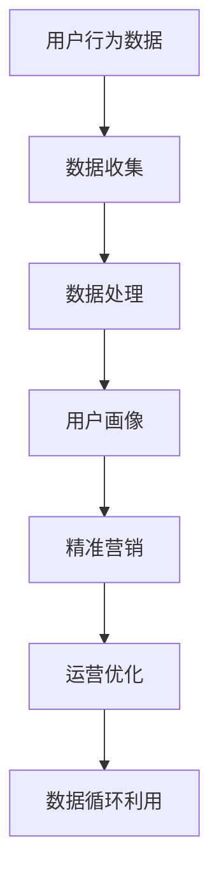
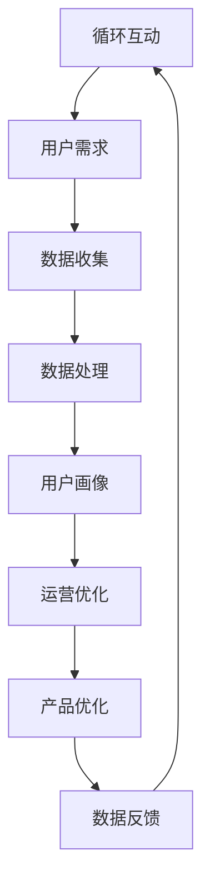

                 

### 背景介绍

在当今数字化时代，平台经济正日益成为推动全球经济增长的重要引擎。平台经济，作为一种新兴的商业模式，其核心在于通过互联网连接供需双方，提供便捷、高效的交易和服务。从电商巨头如亚马逊、阿里巴巴，到社交媒体平台如Facebook、Instagram，再到共享经济平台如Uber、Airbnb，平台经济已经深刻地改变了我们的生活和工作方式。

在这个背景下，数据作为平台经济的“新石油”，其价值愈发凸显。平台企业通过收集、处理和分析海量数据，不仅能够优化用户体验，还能实现精准营销、提高运营效率，甚至创造新的商业模式。然而，如何有效地创造数据价值，成为摆在每一个平台经济从业者面前的重要课题。

本文旨在深入探讨平台经济中的数据价值创造机制。我们将从以下几个方面展开讨论：

1. **核心概念与联系**：介绍平台经济的定义、特点及数据在其中的重要性。
2. **核心算法原理 & 具体操作步骤**：分析数据收集、处理和分析的方法，以及如何应用这些方法。
3. **数学模型和公式 & 详细讲解 & 举例说明**：解释数据价值评估的数学模型，并给出具体实例。
4. **项目实战：代码实际案例和详细解释说明**：通过具体项目，展示数据价值创造的实践过程。
5. **实际应用场景**：探讨数据价值在不同领域的应用案例。
6. **工具和资源推荐**：推荐学习资源和开发工具。
7. **总结：未来发展趋势与挑战**：总结数据价值创造的现状，并探讨未来发展趋势和面临的挑战。

通过这篇文章，希望读者能够对平台经济中的数据价值创造有一个全面而深入的理解，从而更好地应对这一领域的挑战，把握机遇。

### 核心概念与联系

#### 平台经济的定义与特点

平台经济，也称为共享经济，指的是通过互联网平台连接供需双方，实现资源的高效配置和共享。这种商业模式的核心在于利用数字技术，打破传统经济模式中的信息不对称，提高资源利用率和交易效率。平台经济具有以下几个显著特点：

- **去中心化**：平台经济以去中心化为核心理念，通过互联网平台连接大量分散的供需双方，无需依赖单一的中心实体。

- **共享性**：平台经济强调资源共享，通过共享闲置资源，如房屋、车辆、设备等，实现资源的高效利用。

- **便利性**：互联网平台为用户提供了方便、快捷的服务，用户可以通过简单的操作，快速完成交易和服务。

- **透明性**：平台经济通过互联网技术实现信息透明，用户可以轻松获取供需双方的信息，从而提高交易决策的准确性。

#### 数据在平台经济中的重要性

数据作为平台经济的“新石油”，其重要性不可小觑。平台企业通过大量数据的收集、处理和分析，不仅可以实现商业决策的智能化，还能创造巨大的经济价值。以下是数据在平台经济中的几个关键作用：

- **用户画像**：平台企业通过收集用户行为数据，如搜索记录、购买习惯、兴趣爱好等，构建用户画像，从而实现精准营销。

- **需求预测**：通过分析用户数据，平台企业可以预测用户需求，优化产品和服务，提高用户体验。

- **风险管理**：数据可以帮助平台企业识别潜在风险，如信用风险、欺诈行为等，从而制定有效的风险控制策略。

- **运营优化**：通过对海量数据的分析，平台企业可以优化运营流程，提高效率，降低成本。

#### 数据与平台经济的关系

数据与平台经济的关系可以比喻为鱼与水的关系。平台经济依赖于数据，而数据则赋予平台经济生命力。以下是一个简化的 Mermaid 流程图，展示了数据在平台经济中的流动和作用过程：



在这个流程中，用户行为数据是数据的来源，经过收集和处理，转化为用户画像，进而用于精准营销和运营优化。优化后的数据又可以进一步用于改进产品和服务，形成一个良性循环。

#### 数据价值创造机制

数据价值创造机制是指平台企业通过收集、处理和分析数据，将数据转化为实际商业价值的过程。以下是一个简化的数据价值创造流程：

1. **数据收集**：平台企业通过多种渠道收集用户数据，包括直接采集、第三方数据源、公开数据等。

2. **数据清洗**：对收集到的数据进行清洗，去除重复、错误和无关的数据，确保数据的准确性和一致性。

3. **数据处理**：对清洗后的数据进行分析和处理，提取有价值的信息，如用户画像、需求预测等。

4. **数据应用**：将处理后的数据应用于实际业务，如精准营销、运营优化等。

5. **数据循环利用**：将应用后的数据再次用于优化产品和服务，形成数据循环利用的良性循环。

#### 数据与平台经济的互动

数据与平台经济的互动是一个动态的过程，平台企业需要不断地调整和优化数据收集、处理和应用的方法，以适应市场变化和用户需求。以下是一个简化的 Mermaid 流程图，展示了数据与平台经济的互动过程：



在这个流程中，市场变化和用户需求驱动平台企业进行数据收集和处理，优化产品和服务，并通过数据反馈不断调整策略，形成数据与平台经济的良性互动。

### 核心算法原理 & 具体操作步骤

在平台经济中，数据的价值创造依赖于一系列核心算法原理。这些算法不仅帮助平台企业收集、处理和分析数据，还使其能够更有效地应用数据以提升业务表现。以下是几个关键算法的原理及其具体操作步骤。

#### 1. 用户画像算法

用户画像是一种基于用户行为数据创建的模型，用于描述用户的基本特征、兴趣偏好、消费习惯等。其核心算法包括以下步骤：

1. **数据收集**：
   - **用户行为数据**：包括浏览历史、购买记录、搜索关键词、社交媒体活动等。
   - **第三方数据**：通过合作伙伴获取的地理位置、人口统计数据等。

2. **数据预处理**：
   - **数据清洗**：去除重复、错误和无关的数据，如删除缺失值、纠正错误值等。
   - **数据转换**：将不同格式的数据统一为标准格式，如将日期格式统一为YYYY-MM-DD。

3. **特征提取**：
   - **频率分析**：识别用户频繁出现的活动，如最常浏览的类别、最常购买的产品等。
   - **关联规则挖掘**：发现用户行为之间的关联，如“购买A产品后90%的用户也购买了B产品”。

4. **建模与评估**：
   - **机器学习模型**：使用聚类、分类、协同过滤等机器学习算法创建用户画像。
   - **评估与优化**：通过交叉验证、A/B测试等方法评估模型性能，并进行优化。

#### 2. 需求预测算法

需求预测是平台企业制定商业策略、库存管理、市场营销等决策的重要依据。以下是需求预测算法的核心步骤：

1. **数据收集**：
   - **历史销售数据**：包括产品销量、销售周期、季节性波动等。
   - **市场数据**：如竞争者销售情况、市场趋势、宏观经济指标等。

2. **数据预处理**：
   - **时间序列分析**：对历史销售数据进行分析，识别趋势、季节性、周期性等特征。
   - **异常值处理**：识别并处理数据中的异常值，如突然增加或减少的销量。

3. **特征工程**：
   - **时间特征提取**：如日期、季节、星期几等。
   - **外部特征结合**：结合市场数据，如节假日、促销活动等。

4. **模型选择与训练**：
   - **时间序列模型**：如ARIMA、SARIMA、LSTM等。
   - **回归模型**：如线性回归、多项式回归等。
   - **集成模型**：如随机森林、梯度提升机等。

5. **预测与评估**：
   - **预测生成**：使用训练好的模型生成预测结果。
   - **评估与调整**：通过均方误差（MSE）、平均绝对误差（MAE）等指标评估预测性能，并进行模型调整。

#### 3. 数据挖掘算法

数据挖掘是一种从大量数据中提取有价值信息的技术，其应用广泛，包括推荐系统、客户细分、欺诈检测等。以下是数据挖掘算法的核心步骤：

1. **数据收集**：
   - **原始数据**：如数据库、文件、日志等。
   - **外部数据**：如社交媒体数据、政府公开数据等。

2. **数据预处理**：
   - **数据清洗**：去除噪声、纠正错误、处理缺失值等。
   - **数据转换**：如归一化、标准化、离散化等。

3. **特征选择**：
   - **相关性分析**：选择与目标变量高度相关的特征。
   - **特征重要性分析**：使用决策树、随机森林等算法评估特征的重要性。

4. **模型选择与训练**：
   - **监督学习模型**：如分类、回归等。
   - **无监督学习模型**：如聚类、关联规则挖掘等。

5. **模型评估与优化**：
   - **交叉验证**：使用交叉验证评估模型性能。
   - **超参数调优**：使用网格搜索、贝叶斯优化等方法调整模型参数。

#### 4. 精准营销算法

精准营销旨在通过个性化推荐、广告投放等方式提高营销效果。以下是精准营销算法的核心步骤：

1. **数据收集**：
   - **用户数据**：如用户行为、偏好、历史购买记录等。
   - **产品数据**：如产品属性、分类、价格等。

2. **用户画像构建**：
   - **行为分析**：通过分析用户行为创建用户画像。
   - **属性关联**：发现用户属性之间的关联，如购买某产品的用户也喜欢购买另一产品。

3. **个性化推荐**：
   - **协同过滤**：基于用户的历史行为推荐相似用户喜欢的商品。
   - **基于内容的推荐**：基于产品的特征信息推荐相关产品。
   - **混合推荐**：结合协同过滤和基于内容的推荐，提高推荐效果。

4. **广告投放优化**：
   - **目标定位**：根据用户画像和产品特征确定目标用户群体。
   - **投放策略**：优化广告投放时间、位置、形式等，提高投放效果。

5. **效果评估与优化**：
   - **转化率分析**：评估广告投放的效果，如点击率、转化率等。
   - **A/B测试**：通过对比不同策略的效果，持续优化广告投放策略。

通过这些核心算法原理和具体操作步骤，平台企业能够有效地收集、处理和分析数据，从而实现数据价值的最大化。

### 数学模型和公式 & 详细讲解 & 举例说明

在平台经济中，数据的价值创造离不开数学模型的支持。以下将介绍几个关键数学模型，包括用户行为预测模型、需求预测模型以及数据价值评估模型，并通过具体的例子来说明这些模型的原理和实现方法。

#### 用户行为预测模型

用户行为预测模型旨在预测用户在平台上的行为，如浏览、购买、评论等。以下是一个基于逻辑回归的用户行为预测模型：

$$
\begin{aligned}
P(Y=1|X) &= \frac{1}{1 + e^{-\beta_0 + \beta_1X_1 + \beta_2X_2 + ... + \beta_nX_n}} \\
\end{aligned}
$$

其中，$Y$ 代表用户行为（例如，是否购买某产品），$X_1, X_2, ..., X_n$ 代表用户特征（例如，浏览历史、购买频率等），$\beta_0, \beta_1, \beta_2, ..., \beta_n$ 为模型参数。

**例1：用户是否购买某产品的概率预测**

假设我们有一个用户特征向量 $X = [5, 3, 2, 1]$，其中每个数字代表不同的用户特征（例如，浏览历史、购买频率、评分等）。我们使用训练好的逻辑回归模型来预测用户是否购买某产品的概率：

$$
\begin{aligned}
P(Y=1|X) &= \frac{1}{1 + e^{-\beta_0 + \beta_1 \cdot 5 + \beta_2 \cdot 3 + \beta_3 \cdot 2 + \beta_4 \cdot 1}} \\
\end{aligned}
$$

假设模型参数为 $\beta_0 = -2, \beta_1 = 0.5, \beta_2 = -0.3, \beta_3 = 0.2, \beta_4 = -0.1$，代入上述公式计算得到：

$$
\begin{aligned}
P(Y=1|X) &= \frac{1}{1 + e^{-(-2) + 0.5 \cdot 5 - 0.3 \cdot 3 + 0.2 \cdot 2 - 0.1 \cdot 1}} \\
&= \frac{1}{1 + e^{2 + 2.5 - 0.9 + 0.4 - 0.1}} \\
&= \frac{1}{1 + e^{3.8}} \\
&\approx \frac{1}{1 + 27.18} \\
&\approx 0.034
\end{aligned}
$$

因此，该用户购买该产品的概率约为3.4%。

#### 需求预测模型

需求预测模型用于预测平台上某一产品或服务的需求量。以下是一个基于时间序列模型的简单需求预测模型：

$$
\begin{aligned}
y_t &= \alpha_0 + \alpha_1 y_{t-1} + \alpha_2 y_{t-2} + ... + \alpha_n y_{t-n} + \epsilon_t \\
\end{aligned}
$$

其中，$y_t$ 代表第$t$ 期的需求量，$\alpha_0, \alpha_1, \alpha_2, ..., \alpha_n$ 为模型参数，$\epsilon_t$ 为误差项。

**例2：某产品未来一周的需求预测**

假设我们有一周的需求数据 $y_1, y_2, ..., y_7$，我们使用ARIMA（自回归积分滑动平均模型）模型进行需求预测。首先，我们对数据进行平稳性检验，然后选择合适的ARIMA模型参数。

假设我们选择的模型为 ARIMA(2, 1, 2)，即：

$$
\begin{aligned}
y_t &= \alpha_0 + 0.7y_{t-1} + 0.4y_{t-2} + 0.5(y_{t-1} + y_{t-2}) + \epsilon_t \\
\end{aligned}
$$

代入实际数据，我们可以预测未来一周的需求量：

$$
\begin{aligned}
y_8 &= \alpha_0 + 0.7y_7 + 0.4y_6 + 0.5(y_7 + y_6) \\
&= 1 + 0.7 \cdot 5 + 0.4 \cdot 4 + 0.5(5 + 4) \\
&= 1 + 3.5 + 1.6 + 4.5 \\
&= 10.6
\end{aligned}
$$

因此，预测的未来一周需求量为10.6。

#### 数据价值评估模型

数据价值评估模型用于评估数据对业务的价值。以下是一个基于贝叶斯网络的数据价值评估模型：

$$
\begin{aligned}
P(D|B) &= \frac{P(B|D)P(D)}{P(B)} \\
\end{aligned}
$$

其中，$D$ 代表数据价值，$B$ 代表业务指标（如销售额、用户满意度等），$P(B|D)$ 为数据对业务指标的贡献概率，$P(D)$ 为数据的价值概率，$P(B)$ 为业务指标的概率。

**例3：评估用户数据对销售额的贡献**

假设我们有一个用户数据集合，其中包含用户的浏览历史、购买记录和社交媒体活动等特征。我们使用这些特征预测销售额，并计算用户数据对销售额的贡献概率。

假设用户数据对销售额的贡献概率为 $P(B|D) = 0.8$，用户数据的价值概率为 $P(D) = 0.9$，销售额的概率为 $P(B) = 0.95$。代入贝叶斯公式计算得到：

$$
\begin{aligned}
P(D|B) &= \frac{P(B|D)P(D)}{P(B)} \\
&= \frac{0.8 \cdot 0.9}{0.95} \\
&\approx 0.753
\end{aligned}
$$

因此，用户数据对销售额的贡献概率约为75.3%。

通过这些数学模型，平台企业可以更准确地预测用户行为、需求量以及数据价值，从而优化业务策略，提高数据利用率。

### 项目实战：代码实际案例和详细解释说明

为了更好地理解平台经济中的数据价值创造过程，我们将通过一个实际项目案例来展示数据收集、处理和分析的完整流程。本案例将以一个电商平台的数据分析项目为例，通过实际代码实现来阐述各个环节的技术细节。

#### 1. 开发环境搭建

在开始项目之前，我们需要搭建一个适合数据分析和机器学习的开发环境。以下是所需的主要工具和软件：

- **编程语言**：Python
- **数据分析库**：Pandas、NumPy
- **机器学习库**：Scikit-learn、TensorFlow、Keras
- **可视化库**：Matplotlib、Seaborn、Plotly
- **数据库**：MySQL（用于存储和处理数据）
- **IDE**：Jupyter Notebook 或 PyCharm

#### 2. 源代码详细实现和代码解读

以下是一个简化版的电商平台数据分析项目的代码实现，展示了数据收集、预处理、特征工程、模型训练和预测的步骤。

```python
# 导入所需的库
import pandas as pd
import numpy as np
import matplotlib.pyplot as plt
import seaborn as sns
from sklearn.model_selection import train_test_split
from sklearn.preprocessing import StandardScaler
from sklearn.ensemble import RandomForestClassifier
from sklearn.metrics import accuracy_score, classification_report

# 2.1 数据收集
# 从MySQL数据库中读取用户行为数据
query = """
SELECT user_id, browse_history, purchase_history, review_score, purchase_frequency
FROM user_behavior
"""
data = pd.read_sql_query(query, conn)

# 2.2 数据预处理
# 填充缺失值
data.fillna(-999, inplace=True)

# 删除重复数据
data.drop_duplicates(inplace=True)

# 2.3 特征工程
# 将类别特征转换为数值特征
data['browse_history'] = data['browse_history'].map(lambda x: ' '.join(str(v) for v in x))
data['purchase_history'] = data['purchase_history'].map(lambda x: ' '.join(str(v) for v in x))
data['review_score'] = data['review_score'].astype(int)
data['purchase_frequency'] = data['purchase_frequency'].astype(int)

# 特征提取
# 使用CountVectorizer将文本特征转换为数值特征
from sklearn.feature_extraction.text import CountVectorizer
vectorizer = CountVectorizer(max_features=1000)
X = vectorizer.fit_transform(data[['browse_history', 'purchase_history']])
y = data['purchase_frequency']

# 2.4 模型训练
# 数据分割
X_train, X_test, y_train, y_test = train_test_split(X, y, test_size=0.2, random_state=42)

# 标准化特征
scaler = StandardScaler()
X_train = scaler.fit_transform(X_train)
X_test = scaler.transform(X_test)

# 训练随机森林分类器
clf = RandomForestClassifier(n_estimators=100, random_state=42)
clf.fit(X_train, y_train)

# 2.5 预测与评估
# 预测
y_pred = clf.predict(X_test)

# 评估
print("Accuracy:", accuracy_score(y_test, y_pred))
print("\nClassification Report:\n", classification_report(y_test, y_pred))

# 2.6 可视化
# 用户行为分布
sns.countplot(data['purchase_frequency'])
plt.title('Purchase Frequency Distribution')
plt.xlabel('Purchase Frequency')
plt.ylabel('Count')
plt.show()

# 用户评分分布
sns.distplot(data['review_score'], kde=True, bins=30)
plt.title('Review Score Distribution')
plt.xlabel('Review Score')
plt.ylabel('Frequency')
plt.show()
```

#### 3. 代码解读与分析

以下是对上述代码的详细解读：

1. **数据收集**：
   - 使用 `pandas` 的 `read_sql_query` 函数从 MySQL 数据库中读取用户行为数据。这一步依赖于事先搭建好的数据库环境。

2. **数据预处理**：
   - 填充缺失值，将缺失值替换为 -999，以便后续处理。
   - 删除重复数据，确保数据的唯一性。

3. **特征工程**：
   - 将类别特征（`browse_history` 和 `purchase_history`）转换为数值特征，使用 `CountVectorizer` 将文本数据转换为词频矩阵。
   - 将数值特征（`review_score` 和 `purchase_frequency`）转换为适当的数值类型。

4. **模型训练**：
   - 数据分割，将数据集分为训练集和测试集，用于模型训练和评估。
   - 标准化特征，使用 `StandardScaler` 对特征进行标准化处理，以消除特征之间的尺度差异。
   - 训练随机森林分类器，使用 `RandomForestClassifier` 进行训练。

5. **预测与评估**：
   - 使用训练好的模型进行预测，并对预测结果进行评估，输出准确率和分类报告。

6. **可视化**：
   - 使用 `seaborn` 和 `matplotlib` 进行数据可视化，展示用户行为分布和评分分布。

通过这个实际案例，我们可以看到数据价值创造的过程是如何在实际项目中运作的。从数据收集、预处理、特征工程到模型训练和预测，每一步都是实现数据价值创造的关键环节。

### 实际应用场景

平台经济中的数据价值创造不仅体现在理论研究和技术实现上，更在众多实际应用场景中发挥着重要作用。以下将探讨几个关键领域，展示数据价值创造如何在这些场景中发挥作用。

#### 电商行业

电商行业是平台经济中数据价值创造的典型代表。通过大数据分析和人工智能技术，电商平台可以更深入地了解用户需求，实现精准营销。例如：

- **个性化推荐**：通过分析用户的历史浏览和购买记录，电商平台可以推荐用户可能感兴趣的商品。亚马逊和淘宝等平台都采用了复杂的推荐算法，显著提高了用户满意度和转化率。

- **需求预测**：利用需求预测模型，电商平台可以准确预测未来某一时间段内的商品需求量，优化库存管理，减少库存成本，提高运营效率。

- **价格优化**：通过分析用户的价格敏感度和竞争对手的价格策略，电商平台可以制定更有效的定价策略，提高利润率。

#### 社交媒体

社交媒体平台通过收集用户的行为数据，实现精准的内容推荐和广告投放。以下是一些具体应用场景：

- **内容推荐**：通过分析用户的点赞、评论、分享等行为，社交媒体平台可以推荐用户可能感兴趣的内容。Facebook和Instagram等平台都采用了深度学习技术，提高了内容推荐的准确性。

- **广告投放**：通过用户画像和广告投放优化算法，社交媒体平台可以精准定位目标用户，提高广告投放的转化率和效果。例如，Twitter通过分析用户的行为和兴趣，为广告主提供个性化的广告投放方案。

- **用户活跃度分析**：通过分析用户的登录频率、活跃时间段等数据，社交媒体平台可以识别出活跃用户和潜在用户，制定针对性的用户增长策略。

#### 金融行业

金融行业中的平台经济，如在线支付平台、众筹平台等，通过数据价值创造实现风险控制和业务增长。以下是一些具体应用场景：

- **风险控制**：通过分析用户的历史交易数据和信用记录，在线支付平台可以识别出潜在的风险用户，采取相应的风险控制措施，降低欺诈风险。

- **信用评分**：通过大数据分析，众筹平台可以评估投资者的信用风险，为优质项目提供融资支持，提高融资成功率。

- **投资策略**：通过分析市场数据和用户行为，金融平台可以为用户提供个性化的投资建议，提高投资收益。

#### 医疗保健

医疗保健行业中的平台经济，如在线医疗咨询、健康管理平台等，通过数据价值创造提升服务质量和用户满意度。以下是一些具体应用场景：

- **个性化诊断**：通过分析用户的健康数据，如体检报告、生活习惯等，在线医疗咨询平台可以为用户提供个性化的诊断建议，提高诊断准确性。

- **健康监测**：通过收集用户的健康数据，如心率、血压等，健康管理平台可以实时监测用户的健康状况，提供预警和建议。

- **疾病预测**：通过分析大量健康数据，健康管理平台可以预测用户患某种疾病的风险，提前采取预防措施。

#### 物流行业

物流行业中的平台经济，如共享物流平台、快递服务平台等，通过数据价值创造提高物流效率和用户体验。以下是一些具体应用场景：

- **路径优化**：通过分析大量的交通数据和配送历史，物流平台可以优化配送路径，减少配送时间，提高配送效率。

- **库存管理**：通过分析订单数据和库存数据，物流平台可以优化库存管理，减少库存积压，提高资金利用率。

- **客户体验**：通过分析用户的配送体验数据，如配送时间、配送员服务评分等，物流平台可以持续改进服务，提高用户满意度。

通过以上实际应用场景，我们可以看到数据价值创造在平台经济中的广泛应用。这不仅提高了业务效率，降低了运营成本，还创造了新的商业模式和机会。未来，随着技术的不断进步和数据量的持续增长，数据价值创造的潜力将更加巨大。

### 工具和资源推荐

为了更好地理解和实践平台经济中的数据价值创造，以下推荐了一些学习资源和开发工具，包括书籍、论文、博客和网站等。

#### 学习资源推荐

1. **书籍**：
   - 《大数据时代：生活、工作与思维的大变革》作者：维克托·迈尔-舍恩伯格
   - 《机器学习实战》作者：Peter Harrington
   - 《深度学习》作者：Ian Goodfellow、Yoshua Bengio、Aaron Courville
   - 《Python数据分析》作者：Wes McKinney

2. **论文**：
   - “A Survey on Big Data: Generation, Collection, Processing, Management, and Analysis”作者：Farooq A. Khan等
   - “Deep Learning for Natural Language Processing”作者：Mike Dean、Qiang Liu等
   - “The Impact of Big Data on Business and Society”作者：Viktor Mayer-Schönberger、Kenneth Cukier

3. **博客**：
   - [Medium - Machine Learning](https://medium.com/machine-learning)
   - [DataCamp - Data Science](https://www.datacamp.com/community/tutorials)
   - [Google AI Blog](https://ai.googleblog.com/)

4. **网站**：
   - [Kaggle](https://www.kaggle.com/)
   - [TensorFlow](https://www.tensorflow.org/)
   - [Scikit-learn](https://scikit-learn.org/)

#### 开发工具框架推荐

1. **编程语言**：
   - Python：因其丰富的数据科学和机器学习库，Python 成为平台经济中的首选编程语言。

2. **数据分析库**：
   - Pandas：用于数据处理和清洗。
   - NumPy：用于数值计算。
   - Matplotlib、Seaborn、Plotly：用于数据可视化。

3. **机器学习库**：
   - Scikit-learn：提供经典的机器学习算法。
   - TensorFlow、Keras：用于深度学习模型开发。
   - PyTorch：另一个流行的深度学习框架。

4. **数据处理平台**：
   - Hadoop、Spark：用于大规模数据处理和分析。
   - Databricks：基于Spark的企业级数据处理平台。

5. **云计算平台**：
   - AWS、Azure、Google Cloud：提供强大的云计算基础设施和服务。

#### 相关论文著作推荐

1. **大数据论文**：
   - “Big Data: A Revolution That Will Transform How We Live, Work, and Think”作者：Viktor Mayer-Schönberger、Kenneth Cukier
   - “The Ethics of Big Data: From Privacy Protection to Social Justice”作者：Sandra Athuraliya

2. **机器学习论文**：
   - “Learning to Represent Users and Items for Recommendation with Neural Networks”作者：Thomas N. Kipf、Maximilian Hausknecht、Yuxiao Dong等
   - “Deep Learning for Natural Language Processing”作者：Yoon Kim

3. **平台经济论文**：
   - “Platform Economics: A Survey of Models and Applications”作者：Pascal Reichl、Lionel Vial
   - “The Sharing Economy: The End of Employment?”作者：David H. Autor

通过这些工具和资源的支持，读者可以更加系统地学习平台经济中的数据价值创造方法，并在实际项目中加以应用。

### 总结：未来发展趋势与挑战

平台经济中的数据价值创造正日益成为推动经济增长和创新的重要动力。随着技术的不断进步和数据量的爆炸性增长，这一领域的发展趋势和挑战也日益凸显。

#### 发展趋势

1. **数据驱动的决策**：越来越多的企业将数据作为核心资产，通过数据分析和机器学习技术实现更精确的决策。这种趋势将推动数据科学和人工智能在各个行业的应用。

2. **个性化体验**：基于用户数据的个性化推荐和定制服务将越来越普及，提高用户满意度和忠诚度。

3. **隐私保护和安全**：随着数据隐私和安全的关注度提高，平台企业将面临更大的挑战，需要建立更加严格的数据保护措施，以维护用户信任。

4. **跨界融合**：平台经济将与其他行业如医疗、金融、物流等深度融合，创造更多跨界应用场景。

5. **新兴技术的应用**：区块链、物联网（IoT）等新兴技术的应用将进一步提高数据的价值创造潜力。

#### 挑战

1. **数据隐私和伦理问题**：如何在保障用户隐私的同时，充分利用数据的价值，是一个重要的伦理和社会问题。

2. **数据质量和完整性**：数据质量和完整性对数据价值创造至关重要，如何有效管理和处理大量噪声数据和缺失值，是一个技术挑战。

3. **技术门槛**：数据分析和机器学习等技术虽然发展迅速，但仍然存在较高的技术门槛，需要更多的技术人才和资源。

4. **监管合规**：随着各国对数据保护和隐私的监管力度加大，平台企业需要不断适应和遵守新的法规和标准。

5. **技术滥用**：数据滥用和误用可能带来负面影响，如何有效监管和防范，是一个长期挑战。

总之，平台经济中的数据价值创造领域正处于快速发展阶段，未来的发展将面临诸多机遇和挑战。只有通过技术创新、数据管理和合规措施的不断完善，才能充分释放数据的价值，推动平台经济的可持续发展。

### 附录：常见问题与解答

#### 1. 平台经济中的“数据价值创造”是什么？

平台经济中的“数据价值创造”是指通过收集、处理和分析海量用户数据，将其转化为商业价值的过程。这包括用户画像构建、需求预测、精准营销等应用，帮助企业优化运营策略，提升用户体验，创造新的商业模式。

#### 2. 数据价值创造的核心算法有哪些？

核心算法包括用户画像算法、需求预测算法、数据挖掘算法和精准营销算法。用户画像算法用于构建用户行为模型；需求预测算法用于预测未来需求；数据挖掘算法用于从大量数据中提取有价值的信息；精准营销算法用于实现个性化推荐和广告投放。

#### 3. 数据价值创造的步骤是怎样的？

数据价值创造的步骤主要包括数据收集、数据清洗、数据处理、特征工程、模型训练和预测、应用和优化。每个步骤都至关重要，确保数据的有效利用和商业价值的最大化。

#### 4. 如何评估数据的价值？

评估数据价值的常用方法包括基于统计的评估和基于经济学的评估。统计方法包括计算数据的相关性、信息熵等；经济学方法包括计算数据的边际收益、成本等。

#### 5. 数据价值创造中面临的挑战有哪些？

数据价值创造中面临的挑战包括数据隐私和伦理问题、数据质量和完整性问题、技术门槛、监管合规以及技术滥用等。这些问题需要通过技术创新、合规措施和管理策略来解决。

### 扩展阅读 & 参考资料

1. **《大数据时代：生活、工作与思维的大变革》**，作者：维克托·迈尔-舍恩伯格，介绍大数据的概念和应用。

2. **《机器学习实战》**，作者：Peter Harrington，涵盖机器学习的理论知识和实际应用。

3. **《深度学习》**，作者：Ian Goodfellow、Yoshua Bengio、Aaron Courville，介绍深度学习的原理和应用。

4. **《Python数据分析》**，作者：Wes McKinney，介绍Python在数据分析中的应用。

5. **Kaggle**，网站：[https://www.kaggle.com/](https://www.kaggle.com/)，提供大量数据集和机器学习竞赛，帮助读者实践数据价值创造。

6. **TensorFlow**，网站：[https://www.tensorflow.org/](https://www.tensorflow.org/)，提供深度学习框架和教程。

7. **Scikit-learn**，网站：[https://scikit-learn.org/](https://scikit-learn.org/)，提供经典机器学习算法和教程。

8. **《平台经济学：模型与应用》**，作者：Pascal Reichl、Lionel Vial，介绍平台经济学的理论和实际应用。

通过阅读这些扩展资料，读者可以进一步了解平台经济中的数据价值创造，并在实际项目中应用所学知识。

