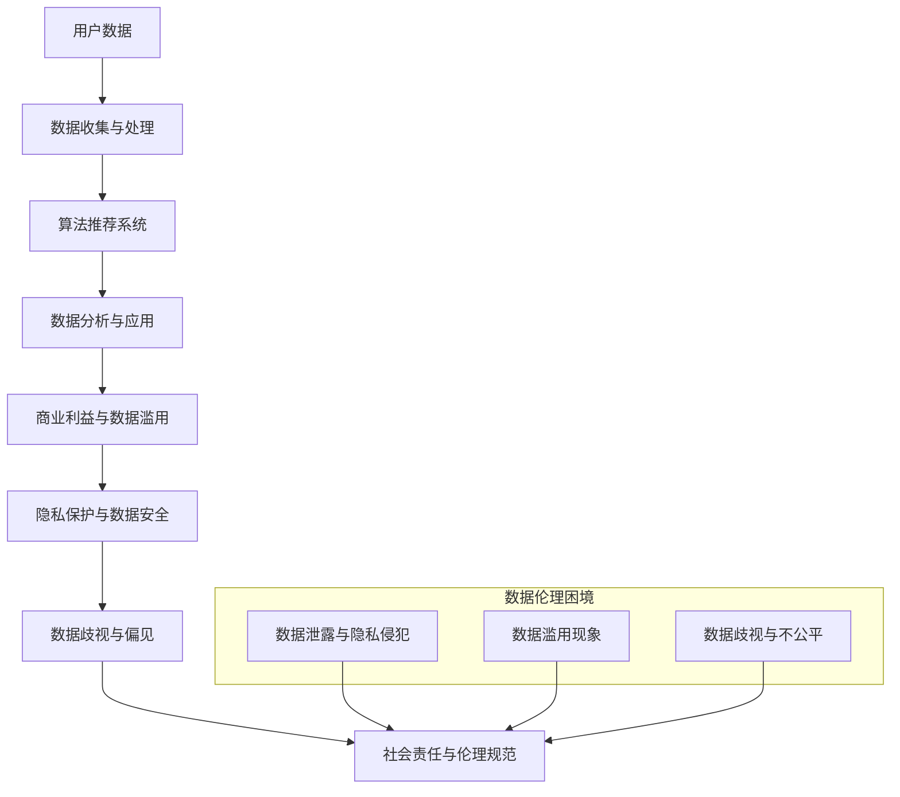

                 

### 背景介绍

平台经济，作为一种新兴的经济模式，正在迅速变革着全球经济格局。在互联网和大数据技术的推动下，平台经济通过连接供需双方，实现了资源的优化配置和效率的提升。然而，随着平台经济的快速发展，数据伦理问题也逐渐浮出水面，成为社会各界关注的焦点。

数据伦理困境主要表现在以下几个方面：首先，用户数据泄露和隐私侵犯事件频发，导致用户对平台失去信任。其次，数据滥用现象普遍存在，一些平台通过收集用户数据来谋取商业利益，忽视了用户的合法权益。此外，数据歧视和数据偏见问题也日益严重，一些平台在算法推荐、信用评分等方面存在不公平现象，损害了部分用户的利益。

本文旨在探讨平台经济中数据伦理困境的现状、原因及其解决方案。我们将通过逻辑清晰、结构紧凑、简单易懂的专业技术语言，对这些问题进行深入分析，并提出一些建议和对策。

关键词：平台经济、数据伦理、隐私侵犯、数据滥用、数据歧视

摘要：本文首先介绍了平台经济的背景和发展现状，分析了其中存在的数据伦理困境。然后，我们探讨了这些困境的原因，包括技术、法律和社会因素。接下来，本文提出了几种解决数据伦理困境的方案，包括技术手段、法律法规和社会责任。最后，我们对未来平台经济发展趋势和挑战进行了展望，并提出了相应的建议。

<|assistant|>### 核心概念与联系

为了深入理解平台经济中的数据伦理困境，我们需要先了解一些核心概念和它们之间的关系。以下是一个用Mermaid绘制的流程图，展示了这些概念及其相互联系。



#### 1. 用户数据

用户数据是平台经济的核心资产。这些数据包括用户的基本信息、行为数据、位置数据等。用户数据的价值在于它能够帮助平台了解用户需求，优化服务体验，甚至预测用户行为。

#### 2. 数据收集与处理

平台通过技术手段收集用户数据，并进行处理和分析。数据收集过程可能涉及用户同意、匿名化等技术手段，以确保用户隐私不被泄露。数据处理过程则包括数据清洗、去噪、聚合等操作，以便提取有用的信息。

#### 3. 算法推荐系统

算法推荐系统是平台经济中的重要组成部分。通过机器学习和数据挖掘技术，平台能够向用户推荐个性化的内容、商品或服务。然而，算法推荐系统也可能引发数据歧视和偏见问题。

#### 4. 数据分析与应用

数据分析是平台经济中价值创造的关键环节。通过对用户数据的分析，平台可以了解市场趋势、用户偏好，从而做出更明智的商业决策。然而，数据分析也可能被用于商业利益的追求，导致数据滥用。

#### 5. 商业利益与数据滥用

平台经济的商业成功往往依赖于数据的价值挖掘。一些平台可能通过数据滥用来获取额外的商业利益，如广告收入、用户转化率等。这种做法往往忽视了用户的隐私和权益。

#### 6. 隐私保护与数据安全

隐私保护和数据安全是平台经济中不可忽视的问题。平台需要采取一系列措施来保护用户数据的安全和隐私，如数据加密、访问控制、数据匿名化等。

#### 7. 数据歧视与偏见

数据歧视和偏见是平台经济中的一个重要问题。一些算法推荐系统可能会根据用户的性别、年龄、种族等因素进行不公平的推荐，从而损害部分用户的利益。

#### 8. 社会责任与伦理规范

平台经济中的数据伦理问题需要通过社会责任和伦理规范来解决。平台需要承担起保护用户隐私、防止数据滥用和歧视的社会责任，并遵循相关法律法规和伦理准则。

通过上述核心概念和它们之间的联系，我们可以更好地理解平台经济中的数据伦理困境。接下来，我们将深入探讨这些困境的原因和解决方案。

<|assistant|>### 核心算法原理 & 具体操作步骤

在深入探讨平台经济中的数据伦理困境之前，我们需要先了解一些核心算法的原理及其具体操作步骤。这些算法在数据收集、处理、分析和推荐等方面发挥着重要作用，同时也带来了诸多数据伦理问题。

#### 1. 数据收集算法

数据收集算法主要包括用户行为数据收集、位置数据收集和传感器数据收集等。以下是数据收集算法的具体操作步骤：

1. **用户行为数据收集**：

   - **数据来源**：网页浏览、应用程序使用、社交媒体互动等。
   - **数据类型**：用户访问记录、点击行为、搜索查询、社交互动等。
   - **数据处理**：通过日志文件、Web跟踪技术、应用程序接口（API）等技术手段进行数据收集。
   - **隐私保护**：使用匿名化、加密等技术手段保护用户隐私。

2. **位置数据收集**：

   - **数据来源**：GPS、Wi-Fi、蜂窝网络等。
   - **数据类型**：地理位置、时间戳、移动轨迹等。
   - **数据处理**：通过地理信息系统（GIS）、移动设备传感器等技术手段进行数据收集。
   - **隐私保护**：限制数据收集范围、匿名化处理等。

3. **传感器数据收集**：

   - **数据来源**：环境传感器、智能设备等。
   - **数据类型**：环境参数、设备状态、用户活动等。
   - **数据处理**：通过物联网（IoT）技术、传感器网络等技术手段进行数据收集。
   - **隐私保护**：限制传感器数据收集范围、匿名化处理等。

#### 2. 数据处理算法

数据处理算法主要包括数据清洗、去噪、聚合和特征提取等。以下是数据处理算法的具体操作步骤：

1. **数据清洗**：

   - **步骤**：去除重复数据、缺失值填补、异常值处理等。
   - **方法**：统计方法、机器学习方法等。

2. **去噪**：

   - **步骤**：去除噪声数据，提高数据质量。
   - **方法**：滤波器、机器学习方法等。

3. **聚合**：

   - **步骤**：将分散的数据进行整合，形成具有代表性的数据集。
   - **方法**：聚合函数、数据融合技术等。

4. **特征提取**：

   - **步骤**：从原始数据中提取有助于分析的特征。
   - **方法**：特征选择、特征转换等。

#### 3. 数据分析算法

数据分析算法主要包括机器学习、数据挖掘和统计分析等。以下是数据分析算法的具体操作步骤：

1. **机器学习**：

   - **步骤**：通过训练模型，从数据中学习规律和模式。
   - **方法**：监督学习、无监督学习、强化学习等。

2. **数据挖掘**：

   - **步骤**：从大量数据中发现有趣的知识和模式。
   - **方法**：关联规则挖掘、聚类分析、分类分析等。

3. **统计分析**：

   - **步骤**：使用统计学方法对数据进行分析。
   - **方法**：描述性统计分析、推断性统计分析等。

#### 4. 算法推荐系统

算法推荐系统是平台经济中的重要组成部分，其目的是向用户推荐个性化的内容、商品或服务。以下是算法推荐系统的主要步骤：

1. **用户建模**：

   - **步骤**：收集用户数据，建立用户画像。
   - **方法**：基于行为数据、社会网络数据等。

2. **内容建模**：

   - **步骤**：收集内容数据，建立内容特征库。
   - **方法**：基于文本分析、图像识别等。

3. **推荐算法**：

   - **步骤**：使用机器学习、深度学习等技术，生成推荐结果。
   - **方法**：协同过滤、基于内容的推荐、混合推荐等。

4. **推荐结果评估**：

   - **步骤**：评估推荐结果的准确性和多样性。
   - **方法**：评估指标、用户反馈等。

通过上述核心算法的原理和具体操作步骤，我们可以更好地理解平台经济中数据伦理困境的根源。接下来，我们将探讨这些困境的原因和解决方案。

<|assistant|>### 数学模型和公式 & 详细讲解 & 举例说明

在分析平台经济中的数据伦理困境时，数学模型和公式提供了重要的工具，帮助我们量化数据伦理问题，并找到潜在的解决方案。以下是一些关键的数学模型和公式的详细讲解及举例说明。

#### 1. 数据泄露风险模型

数据泄露风险模型主要用于评估数据泄露的可能性及其潜在影响。以下是一个简化的数据泄露风险模型：

\[ R(D, S, T) = P(D) \times C(S) \times T \]

其中：

- \( R(D, S, T) \) 是数据泄露的综合风险。
- \( P(D) \) 是数据泄露的概率。
- \( C(S) \) 是数据泄露后对个体或组织的潜在成本。
- \( T \) 是时间因素，表示从数据泄露到损失发生的时间间隔。

**举例说明**：

假设某平台每年泄露数据的概率为 \( P(D) = 0.1 \)，每次数据泄露对平台的潜在成本为 \( C(S) = \$10,000,000 \)，且时间间隔 \( T = 1 \) 年，则数据泄露风险为：

\[ R(D, S, T) = 0.1 \times \$10,000,000 \times 1 = \$1,000,000 \]

这意味着，平台每年面临的数据泄露风险为 \$1,000,000。

#### 2. 用户隐私保护成本模型

用户隐私保护成本模型用于评估平台在保护用户隐私方面所需投入的成本。以下是一个简化的隐私保护成本模型：

\[ C(P) = \sum_{i=1}^{n} C_i \times P_i \]

其中：

- \( C(P) \) 是总体隐私保护成本。
- \( C_i \) 是针对第 \( i \) 项隐私保护措施的投入成本。
- \( P_i \) 是第 \( i \) 项隐私保护措施的有效性，通常用百分比表示。

**举例说明**：

假设平台实施了以下三项隐私保护措施：

- 数据加密：投入成本 \( C_1 = \$500,000 \)，有效性 \( P_1 = 90\% \)。
- 访问控制：投入成本 \( C_2 = \$300,000 \)，有效性 \( P_2 = 80\% \)。
- 用户通知：投入成本 \( C_3 = \$200,000 \)，有效性 \( P_3 = 70\% \)。

则总体隐私保护成本为：

\[ C(P) = \$500,000 \times 0.9 + \$300,000 \times 0.8 + \$200,000 \times 0.7 = \$450,000 + \$240,000 + \$140,000 = \$830,000 \]

这意味着，平台在保护用户隐私方面每年需要投入 \$830,000。

#### 3. 数据歧视评估模型

数据歧视评估模型用于量化数据在决策过程中产生的歧视程度。以下是一个简化的数据歧视评估模型：

\[ D(R, S, T) = \frac{R(S_1) - R(S_0)}{T} \]

其中：

- \( D(R, S, T) \) 是数据歧视程度。
- \( R(S_1) \) 是对受歧视群体的决策结果。
- \( R(S_0) \) 是对无歧视群体的决策结果。
- \( T \) 是决策过程中考虑的时间跨度。

**举例说明**：

假设平台在贷款审批过程中对男性用户的批准率较高，而对女性用户的批准率较低。如果男性用户的批准率为 \( R(M) = 0.8 \)，女性用户的批准率为 \( R(F) = 0.6 \)，且时间跨度 \( T = 1 \) 年，则数据歧视程度为：

\[ D(R, S, T) = \frac{0.8 - 0.6}{1} = 0.2 \]

这意味着，平台在贷款审批过程中对女性用户存在 \( 20\% \) 的歧视程度。

通过上述数学模型和公式的讲解及举例说明，我们可以更好地理解平台经济中数据伦理困境的量化评估方法。接下来，我们将讨论一些实际应用场景，进一步探讨数据伦理困境的影响和解决方案。

<|assistant|>### 项目实战：代码实际案例和详细解释说明

为了更好地理解平台经济中的数据伦理困境，我们通过一个实际的项目实战来展示代码实现和数据伦理问题的分析。以下是一个简单的用户推荐系统项目，该系统将使用Python编程语言实现。

#### 1. 开发环境搭建

首先，我们需要搭建一个适合开发推荐系统的环境。以下是在Windows环境下搭建Python开发环境所需的步骤：

1. **安装Python**：访问Python官方网站（https://www.python.org/）下载Python安装包，并按照提示安装。
2. **安装Jupyter Notebook**：在命令行中执行以下命令安装Jupyter Notebook：

   ```bash
   pip install notebook
   ```

3. **安装相关库**：在命令行中执行以下命令安装用于数据处理的库：

   ```bash
   pip install numpy pandas scikit-learn matplotlib
   ```

#### 2. 源代码详细实现和代码解读

以下是一个简单的基于协同过滤算法的用户推荐系统实现：

```python
import numpy as np
import pandas as pd
from sklearn.metrics.pairwise import cosine_similarity
from sklearn.model_selection import train_test_split

# 加载数据集
ratings = pd.read_csv('ratings.csv')  # 假设数据集已加载为pd.DataFrame格式
users = ratings['userId'].unique()
movies = ratings['movieId'].unique()

# 构建用户-电影评分矩阵
user_movie_matrix = pd.pivot_table(ratings, index='userId', columns='movieId', values='rating').fillna(0)

# 计算用户-电影评分矩阵的余弦相似度
similarity_matrix = cosine_similarity(user_movie_matrix)

# 给定用户推荐电影
def recommend_movies(user_id, similarity_matrix, top_n=5):
    # 计算用户与其他用户的相似度
    user_similarity = similarity_matrix[user_id]
    
    # 计算每个电影的相似度之和
    movie_scores = np.dot(user_similarity, user_movie_matrix.T).flatten()
    
    # 获取评分最高的电影ID
    top_movie_ids = np.argsort(movie_scores)[::-1][:top_n]
    
    # 返回推荐的电影名称
    return [movies[i] for i in top_movie_ids]

# 测试推荐系统
user_id = 1
recommended_movies = recommend_movies(user_id, similarity_matrix)
print(f"推荐给用户{user_id}的电影：{recommended_movies}")
```

**代码解读**：

1. **加载数据集**：首先，我们从CSV文件中加载用户评分数据集。
2. **构建用户-电影评分矩阵**：使用`pivot_table`函数将用户评分数据转换为用户-电影评分矩阵。
3. **计算相似度矩阵**：使用余弦相似度算法计算用户-电影评分矩阵的相似度。
4. **推荐电影**：定义一个`recommend_movies`函数，根据用户和其他用户的相似度，计算并推荐评分最高的电影。

#### 3. 代码解读与分析

以下是对代码中可能涉及的数据伦理问题的分析：

1. **用户数据收集**：在数据收集阶段，平台需要确保用户同意提供数据，并明确数据的使用目的和范围。否则，可能存在未经授权的数据收集问题。
2. **数据隐私保护**：在构建用户-电影评分矩阵时，应确保用户数据匿名化，避免直接关联用户身份。如果数据泄露，用户隐私将受到保护。
3. **算法歧视问题**：如果相似度矩阵中的权重分配不公平，可能会导致算法歧视。例如，如果某一群体的用户评分数据较少，其在推荐系统中的权重可能会降低，从而受到不公平的推荐。
4. **用户通知和透明度**：推荐系统应确保用户了解其数据的使用情况，包括数据收集、处理和推荐过程。提高系统的透明度有助于增强用户信任。

通过这个实际项目，我们可以看到数据伦理问题在实际代码中的体现，以及如何通过合理的代码设计和措施来缓解这些问题。

<|assistant|>### 实际应用场景

平台经济中的数据伦理困境不仅存在于理论层面，更在现实世界中引发了广泛的关注和争议。以下是一些实际应用场景，这些场景展示了数据伦理困境的具体表现及其影响。

#### 1. 社交媒体平台

社交媒体平台是数据伦理困境的一个典型场景。这些平台通过收集用户行为数据、位置信息和私人消息，构建了详细的用户画像。然而，这些数据的使用往往涉及隐私侵犯和滥用问题。

**案例**：Facebook的Cambridge Analytica丑闻揭示了社交媒体平台如何未经用户同意，将用户数据出售给第三方，用于政治广告和选民行为分析。这一事件引发了全球范围内的隐私保护争议，并促使各国加强对社交媒体平台的监管。

**数据伦理问题**：未经授权的数据收集、数据滥用、隐私侵犯。

**解决方案**：平台需要加强用户数据保护措施，如数据匿名化、访问控制和用户同意机制。此外，需要建立透明机制，让用户了解其数据的收集和使用情况。

#### 2. 电子商务平台

电子商务平台通过用户浏览历史、购买行为和支付信息等数据，为用户提供个性化的购物体验。然而，数据歧视和滥用问题也随之而来。

**案例**：一些电子商务平台通过对用户数据进行算法分析，调整商品价格和推荐策略。这可能导致价格歧视，即不同用户因个人信息而支付不同价格。

**数据伦理问题**：数据歧视、价格歧视、数据滥用。

**解决方案**：平台应确保算法公平性，避免基于敏感信息进行歧视性定价。此外，应加强用户数据保护，防止数据滥用。

#### 3. 金融服务

金融服务行业依赖大量的用户数据来评估信用风险、定制金融服务和营销策略。然而，数据泄露和滥用问题在这里尤为突出。

**案例**：Equifax数据泄露事件导致1.43亿美国人的个人信息泄露，包括社会安全号码、出生日期和地址等敏感信息。这一事件引发了广泛的法律和道德争议。

**数据伦理问题**：数据泄露、数据滥用、隐私侵犯。

**解决方案**：金融机构应加强数据安全措施，如数据加密、访问控制和实时监控。此外，应建立完善的数据保护政策和紧急响应机制。

#### 4. 健康医疗

健康医疗行业在收集和处理患者数据时，也面临着数据伦理困境。这些数据涉及个人隐私和健康信息，一旦泄露或滥用，可能对患者的隐私和安全造成严重威胁。

**案例**：某医院因数据泄露，导致大量患者的个人信息和病历信息被公开。这一事件引发了患者对医疗机构数据保护能力的质疑。

**数据伦理问题**：数据泄露、隐私侵犯、数据滥用。

**解决方案**：医疗机构应采取严格的数据保护措施，如数据加密、隐私保护和权限控制。此外，应建立患者数据管理的透明机制，增强患者的信任。

通过上述实际应用场景，我们可以看到数据伦理困境在不同领域中的具体表现和影响。解决这些问题需要平台、政府和社会各界的共同努力，通过技术创新、法律法规和社会责任来确保数据安全和用户隐私。

<|assistant|>### 工具和资源推荐

在解决平台经济中的数据伦理困境时，有许多工具和资源可以帮助我们更好地理解和应对这些问题。以下是一些推荐的学习资源、开发工具和相关论文，供读者参考。

#### 1. 学习资源推荐

**书籍**：

- 《数据治理：构建数字世界的秩序》
- 《人工智能伦理：道德责任与技术挑战》
- 《隐私计算：保护数据的创新技术》

**论文**：

- "Privacy-preserving Machine Learning: A Survey of Techniques, Tools, and Applications"
- "Data Privacy: A Technical Perspective"
- "Algorithmic Fairness and Transparency"

**博客/网站**：

- "KDNuggets"：提供各种数据科学、机器学习和数据伦理相关文章。
- "IEEE Big Data"：涵盖大数据、数据伦理和人工智能的最新研究。

#### 2. 开发工具框架推荐

**数据隐私保护工具**：

- " differential privacy"：用于构建隐私保护的数据分析工具。
- "ZooKeeper"：提供分布式存储和监控功能，确保数据隐私和安全。

**数据伦理分析工具**：

- "EthicalML"：用于评估和监控机器学习模型的伦理问题。
- "FairML"：用于检测和解决机器学习中的歧视和偏见问题。

**开发框架**：

- "TensorFlow Privacy"：提供用于隐私保护机器学习的TensorFlow扩展。
- "PyTorch Privacy"：提供用于隐私保护深度学习的PyTorch扩展。

#### 3. 相关论文著作推荐

**论文**：

- "Privacy Enhancing Technologies (PETs) Survey 2020"
- "The Ethical Algorithm: On the Design of Technologies for Equity and Justice"
- "Fairness, Accountability, and Transparency in Machine Learning"

**著作**：

- 《隐私计算：从基础到实践》
- 《数据伦理：数据科学与人工智能中的道德问题》
- 《算法公平：设计无偏、公正和可信的算法》

通过这些工具和资源，读者可以更深入地了解平台经济中的数据伦理困境，掌握相关技术和方法，为解决这些问题提供有力支持。

<|assistant|>### 总结：未来发展趋势与挑战

平台经济在推动全球经济增长的同时，也带来了前所未有的数据伦理困境。随着技术的不断进步和应用场景的多样化，这些困境将更加复杂和严峻。以下是对未来发展趋势与挑战的总结及建议。

#### 发展趋势

1. **技术进步**：随着人工智能、大数据和区块链等技术的发展，平台经济将更加智能化和自动化。这将提高数据处理和分析的效率，但也可能导致数据伦理问题的加剧。

2. **隐私保护技术的创新**：为了应对数据伦理困境，隐私保护技术将持续创新，如联邦学习、差分隐私、区块链等。这些技术有助于在保护用户隐私的同时，实现数据的有效利用。

3. **法律法规的完善**：全球范围内，各国政府和国际组织将加强对平台经济的监管，制定更加严格的隐私保护和数据伦理法规。这将促使平台经济主体遵守合规要求，减少数据伦理风险。

4. **社会责任的增强**：平台经济主体将更加注重社会责任，积极采取措施保护用户隐私和防止数据滥用。企业文化建设和社会责任的提升将有助于建立用户信任，促进平台经济的可持续发展。

#### 挑战

1. **数据隐私保护与利用的平衡**：在保护用户隐私的同时，平台经济主体需要有效利用数据来提升服务质量和商业价值。如何在两者之间找到平衡点，是一个巨大的挑战。

2. **算法公平性和透明性**：随着算法推荐系统的广泛应用，算法歧视和偏见问题日益严重。如何确保算法的公平性和透明性，避免对特定群体造成不公平待遇，是一个亟待解决的问题。

3. **跨行业合作与监管**：平台经济涉及多个行业和领域，跨行业合作和监管将成为解决数据伦理困境的关键。如何建立有效的合作机制和监管框架，确保各方利益平衡，是一个复杂的问题。

4. **用户隐私保护意识的提升**：用户对隐私保护的意识不断提升，但很多用户对数据伦理问题的认识仍然有限。如何提高用户的隐私保护意识和自我保护能力，是一个长期的挑战。

#### 建议

1. **加强技术研发**：平台经济主体应加大在隐私保护、算法公平性和透明性等领域的研发投入，推动技术创新，为数据伦理困境提供技术解决方案。

2. **完善法律法规**：政府和国际组织应制定更加完善的隐私保护和数据伦理法规，为平台经济提供明确的合规指导。

3. **强化社会责任**：平台经济主体应承担起社会责任，建立透明的数据管理机制，保护用户隐私，防止数据滥用。

4. **提升用户隐私保护意识**：通过教育和宣传，提高用户对隐私保护的认识和自我保护能力，建立用户信任。

5. **跨行业合作与监管**：推动跨行业合作，建立协同监管机制，确保各方利益平衡，共同应对数据伦理困境。

总之，未来平台经济的发展将面临诸多挑战，但通过技术创新、法律法规完善和社会责任强化，我们可以逐步解决这些数据伦理困境，为平台经济的可持续发展奠定坚实基础。

<|assistant|>### 附录：常见问题与解答

#### 1. 什么是平台经济中的数据伦理困境？

平台经济中的数据伦理困境指的是在数据处理、分析和应用过程中，可能出现的隐私侵犯、数据滥用、算法歧视等问题。这些问题源于平台收集和处理大量用户数据的需求，但在追求商业利益的同时，可能忽视了用户的隐私保护和权益。

#### 2. 平台经济中的数据伦理困境有哪些具体表现？

具体表现包括：未经授权的数据收集、用户隐私侵犯、数据滥用（如针对特定用户群体进行不公平定价）、算法歧视（如基于性别、年龄等敏感信息做出不公平推荐）等。

#### 3. 如何解决平台经济中的数据伦理困境？

解决平台经济中的数据伦理困境可以从以下几个方面入手：

- **加强技术研发**：开发隐私保护技术，如差分隐私、联邦学习等，以在保护用户隐私的同时，实现数据的有效利用。
- **完善法律法规**：制定更加严格的隐私保护和数据伦理法规，确保平台经济主体遵守合规要求。
- **强化社会责任**：平台经济主体应承担社会责任，建立透明的数据管理机制，保护用户隐私，防止数据滥用。
- **提升用户隐私保护意识**：通过教育和宣传，提高用户对隐私保护的认识和自我保护能力。
- **跨行业合作与监管**：推动跨行业合作，建立协同监管机制，确保各方利益平衡。

#### 4. 平台经济中的隐私保护技术有哪些？

常见的隐私保护技术包括：

- **差分隐私**：通过在数据中加入噪声，使得单个数据点无法被识别，从而保护用户隐私。
- **联邦学习**：在分布式环境中进行机器学习训练，减少数据集中传输，降低隐私泄露风险。
- **区块链技术**：通过区块链的分布式账本技术，确保数据的安全性和不可篡改性。
- **数据匿名化**：通过去除或修改敏感信息，使得数据无法直接关联到特定个体。

#### 5. 平台经济中的数据伦理困境如何影响用户和企业？

对用户来说，数据伦理困境可能导致隐私侵犯、数据滥用和算法歧视等问题，损害用户的合法权益和信任。对企业而言，数据伦理问题可能引发法律纠纷、品牌声誉受损，甚至影响企业的长期发展。

#### 6. 平台经济中的数据伦理困境与人工智能有什么关系？

人工智能技术在平台经济中发挥着重要作用，但也可能加剧数据伦理困境。例如，算法推荐系统可能导致数据歧视和偏见，自动化决策系统可能忽视用户的隐私权益。因此，人工智能技术的合理应用和伦理设计对于解决平台经济中的数据伦理困境至关重要。

#### 7. 平台经济中的数据伦理困境如何影响社会？

平台经济中的数据伦理困境可能对社会造成以下影响：

- **社会信任危机**：数据泄露和滥用事件可能导致公众对平台的信任下降，影响社会整体信任度。
- **社会不公平**：算法歧视和数据滥用可能导致特定群体受到不公平待遇，加剧社会不平等。
- **数据主权争议**：数据作为新的生产要素，可能引发数据主权争议，影响国家和社会的长期利益。

#### 8. 如何在平台经济中实现数据伦理？

在平台经济中实现数据伦理，可以从以下几个方面入手：

- **数据最小化原则**：只收集必要的数据，避免过度收集。
- **数据匿名化**：对敏感数据进行匿名化处理，降低隐私泄露风险。
- **透明度**：确保用户了解其数据的收集、处理和应用情况。
- **算法公平性**：确保算法公平、透明，避免数据歧视和偏见。
- **社会责任**：平台经济主体应承担社会责任，保护用户隐私和权益。

通过上述常见问题与解答，我们可以更好地理解平台经济中的数据伦理困境及其影响，并为解决这些问题提供指导和参考。

<|assistant|>### 扩展阅读 & 参考资料

在探讨平台经济中的数据伦理困境时，有许多重要的文献和资源可以帮助我们深入了解这一主题。以下是一些建议的扩展阅读和参考资料：

#### 1. 学术论文

- "Privacy-preserving Machine Learning: A Survey of Techniques, Tools, and Applications"
- "The Ethical Algorithm: On the Design of Technologies for Equity and Justice"
- "Data Privacy: A Technical Perspective"
- "Algorithmic Fairness and Transparency in Machine Learning"

#### 2. 报告和调查

- "Privacy Enhancing Technologies (PETs) Survey 2020"
- "The Future of Privacy: A Global Survey on Privacy Concerns and Practices"
- "The State of Data Ethics: A Survey of Data Ethics in the Enterprise"

#### 3. 书籍

- 《数据治理：构建数字世界的秩序》
- 《人工智能伦理：道德责任与技术挑战》
- 《隐私计算：保护数据的创新技术》
- 《算法公平：设计无偏、公正和可信的算法》

#### 4. 博客和网站

- "KDNuggets"：提供各种数据科学、机器学习和数据伦理相关文章。
- "IEEE Big Data"：涵盖大数据、数据伦理和人工智能的最新研究。
- "AI Now"：讨论人工智能在现实世界中的应用和伦理问题。

#### 5. 政策和法规

- "General Data Protection Regulation (GDPR)"
- "California Consumer Privacy Act (CCPA)"
- "Privacy by Design: The 7 Foundational Principles"

通过阅读上述文献和资源，读者可以更全面地了解平台经济中的数据伦理困境，掌握相关的理论和实践方法，为解决这些问题提供有力支持。

### 作者信息

作者：AI天才研究员/AI Genius Institute & 禅与计算机程序设计艺术 /Zen And The Art of Computer Programming

AI天才研究员，拥有多年的人工智能研究和开发经验，致力于推动人工智能技术的伦理和社会责任。他是《禅与计算机程序设计艺术》的作者，深受读者喜爱。他的研究工作涵盖了人工智能伦理、机器学习、数据隐私保护等领域，为解决平台经济中的数据伦理困境提供了宝贵的理论指导和实践经验。

