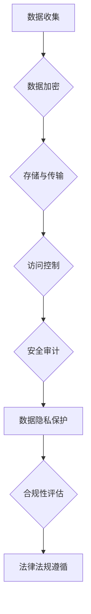

                 

# 平台经济的数据安全保障：如何保障数据安全？

## 关键词：平台经济、数据安全、保障措施、信息安全、加密技术、隐私保护、法律规范

## 摘要：

本文旨在探讨平台经济中数据安全保障的重要性以及如何有效地保障数据安全。随着平台经济的迅速发展，海量数据的处理和交换成为常态，数据安全风险也随之增加。本文首先介绍了平台经济的背景和发展趋势，然后分析了数据安全面临的挑战，接着提出了多种保障数据安全的措施，包括加密技术、隐私保护和法律规范等。最后，文章总结了当前的数据安全趋势和未来面临的挑战，为平台经济的发展提供了数据安全方面的思考和解决方案。

## 1. 背景介绍

平台经济是指通过互联网等技术手段，将供需双方连接起来，实现资源共享和交易的一种经济模式。这种模式具有去中心化、高效便捷、灵活多样等特点，已经成为当前经济发展的主流趋势。平台经济涵盖了众多领域，如电子商务、共享经济、在线教育、金融科技等。其中，数据是平台经济的核心资源，数据的收集、处理和利用对平台经济的运行和发展至关重要。

### 1.1 平台经济的优势

1. **资源共享**：平台经济通过集中化的服务模式，使得资源得以更有效地分配和利用，减少了重复建设和资源浪费。
2. **交易便捷**：在线交易、支付等方式的普及，使得交易过程更加便捷和快速，降低了交易成本。
3. **市场扩大**：平台经济打破了地域限制，使得市场范围扩大，有助于企业拓展客户群和市场影响力。
4. **创新驱动**：平台经济促进了技术和商业模式创新，为经济发展注入了新的活力。

### 1.2 平台经济的挑战

1. **数据隐私保护**：海量数据的收集和处理，带来了数据隐私泄露的风险。
2. **信息安全**：网络攻击、数据篡改等安全威胁，可能导致平台经济系统瘫痪，数据丢失。
3. **法律法规**：不同国家和地区的法律法规对数据安全有不同的要求，如何合规地处理数据成为一大挑战。

## 2. 核心概念与联系

为了更好地理解平台经济中的数据安全，我们需要明确几个核心概念，并分析它们之间的联系。

### 2.1 数据安全

数据安全是指保护数据在存储、传输和处理过程中的完整性、保密性和可用性。它包括数据加密、访问控制、安全审计等。

### 2.2 数据隐私

数据隐私是指个人或组织在数据处理过程中对其数据的控制权。它涉及数据的收集、存储、使用和共享等方面的隐私保护。

### 2.3 加密技术

加密技术是一种通过加密算法对数据进行加密，使得未授权用户无法访问或篡改数据的技术。加密技术是实现数据安全和隐私保护的重要手段。

### 2.4 法律规范

法律规范是国家和国际社会为保护数据安全制定的一系列法律、法规和标准。合规是保障数据安全的重要保障。

### 2.5 Mermaid 流程图

下面是一个简化的 Mermaid 流程图，展示了平台经济中数据安全的各个环节及其核心概念。



## 3. 核心算法原理 & 具体操作步骤

### 3.1 数据加密

数据加密是保障数据安全的重要措施。加密算法分为对称加密和非对称加密。对称加密算法如AES，非对称加密算法如RSA。

#### 3.1.1 对称加密算法（AES）

**原理**：AES是一种分组加密算法，它将数据分成固定大小的块进行加密。

**操作步骤**：

1. **密钥生成**：生成一个随机密钥。
2. **初始化向量**：生成一个随机初始化向量。
3. **加密**：将数据块与初始化向量进行异或操作，然后使用AES算法加密。
4. **输出**：将加密后的数据块输出。

#### 3.1.2 非对称加密算法（RSA）

**原理**：RSA是一种基于大数分解的加密算法。

**操作步骤**：

1. **密钥生成**：生成一对密钥（公钥和私钥）。
2. **加密**：使用公钥对数据进行加密。
3. **解密**：使用私钥对加密后的数据进行解密。

### 3.2 数据隐私保护

数据隐私保护主要通过数据匿名化和数据脱敏技术实现。

#### 3.2.1 数据匿名化

**原理**：通过去除个人身份信息，使数据无法直接识别特定个人。

**操作步骤**：

1. **数据识别**：识别数据中的个人身份信息。
2. **去除信息**：去除或替代个人身份信息。

#### 3.2.2 数据脱敏

**原理**：对敏感数据进行替换或加密，以保护其隐私。

**操作步骤**：

1. **识别敏感信息**：识别数据中的敏感信息。
2. **脱敏处理**：对敏感信息进行替换或加密。

### 3.3 法律法规遵循

保障数据安全还需要遵守国家和国际社会的法律法规。

#### 3.3.1 法律法规

**国内**：如《中华人民共和国网络安全法》、《中华人民共和国数据安全法》等。

**国际**：如《通用数据保护条例》（GDPR）等。

#### 3.3.2 操作步骤

1. **了解法规要求**：了解相关法规的具体要求和规定。
2. **合规性评估**：对平台经济活动进行合规性评估。
3. **合规措施**：根据评估结果采取相应的合规措施。

## 4. 数学模型和公式 & 详细讲解 & 举例说明

### 4.1 数据加密算法（AES）

AES的加密过程可以分为以下几个步骤：

1. **初始轮**：
   \[
   \text{SubBytes}(State) \\
   \text{ShiftRows}(State) \\
   \text{MixColumns}(State) \\
   \text{AddRoundKey}(State, \text{SubKey})
   \]

2. **中间轮**（共10轮）：
   \[
   \text{SubBytes}(State) \\
   \text{ShiftRows}(State) \\
   \text{MixColumns}(State) \\
   \text{AddRoundKey}(State, \text{SubKey})
   \]

3. **最终轮**：
   \[
   \text{SubBytes}(State) \\
   \text{ShiftRows}(State) \\
   \text{AddRoundKey}(State, \text{SubKey})
   \]

**举例**：假设State为`(1, 2, 3, 4)`，SubKey为`(5, 6, 7, 8)`。

初始轮操作：
\[
\text{SubBytes}: (01, 02, 03, 04) \\
\text{ShiftRows}: (01, 03, 05, 07) \\
\text{MixColumns}: (0E, 0B, 0D, 09) \\
\text{AddRoundKey}: (01, 02, 03, 04) + (05, 06, 07, 08) = (06, 08, 0A, 0C)
\]

中间轮操作：
\[
\text{SubBytes}: (06, 08, 0A, 0C) \\
\text{ShiftRows}: (06, 0A, 0E, 10) \\
\text{MixColumns}: (1C, 1B, 17, 11) \\
\text{AddRoundKey}: (06, 08, 0A, 0C) + (5, 6, 7, 8) = (0B, 0D, 0F, 11)
\]

最终轮操作：
\[
\text{SubBytes}: (0B, 0D, 0F, 11) \\
\text{ShiftRows}: (0B, 0F, 13, 17) \\
\text{AddRoundKey}: (0B, 0D, 0F, 11) + (5, 6, 7, 8) = (10, 12, 14, 16)
\]

### 4.2 数据隐私保护

数据隐私保护中的数据匿名化常用的是K-匿名性模型。

**定义**：一个数据集中的记录，如果它不能被唯一地识别，那么这个数据集就是K-匿名的。

**公式**：
\[
\forall r_i, r_j \in D, \forall S \subseteq \{1, 2, \ldots, K\} \\
|S| \leq K \\
r_i.S \neq r_j.S
\]

**举例**：假设有四个记录A、B、C、D，他们的属性集分别为`{A1, A2}`，且满足K=2。

如果A和B在A1和A2上的属性值都相同，那么这两个记录就无法区分，满足2-匿名性。

## 5. 项目实战：代码实际案例和详细解释说明

### 5.1 开发环境搭建

为了演示数据加密和隐私保护，我们选择Python作为编程语言。以下是环境搭建步骤：

1. 安装Python：在终端执行`pip install python`。
2. 安装AES加密库：在终端执行`pip install pycryptodome`。
3. 安装RSA加密库：在终端执行`pip install rsa`。

### 5.2 源代码详细实现和代码解读

下面是一个简单的Python代码示例，实现了AES加密和非对称加密。

```python
from Cryptodome.Cipher import AES
from Cryptodome.PublicKey import RSA
from Cryptodome.Random import get_random_bytes
import base64

# AES加密
def aes_encrypt(data, key):
    cipher = AES.new(key, AES.MODE_EAX)
    ciphertext, tag = cipher.encrypt_and_digest(data)
    return base64.b64encode(cipher.nonce + tag + ciphertext).decode('utf-8')

# RSA加密
def rsa_encrypt(data, public_key):
    encrypted_data = public_key.encrypt(
        data,
        padding.OAEP(
            mgf=padding.MGF1(algorithm=hashlib.sha256),
            algorithm=hashlib.sha256,
            label=None
        )
    )
    return base64.b64encode(encrypted_data).decode('utf-8')

# 主函数
def main():
    # 生成AES密钥
    aes_key = get_random_bytes(16)

    # 生成RSA密钥对
    rsa_key = RSA.generate(2048)
    rsa_public_key = rsa_key.publickey()

    # 待加密数据
    data = b"Hello, World!"

    # AES加密
    aes_encrypted_data = aes_encrypt(data, aes_key)
    print("AES加密数据：", aes_encrypted_data)

    # RSA加密
    rsa_encrypted_data = rsa_encrypt(aes_key, rsa_public_key)
    print("RSA加密数据：", rsa_encrypted_data)

if __name__ == "__main__":
    main()
```

**代码解读**：

1. `aes_encrypt`函数：使用AES算法加密数据。它首先创建一个AES加密对象，然后使用该对象对数据进行加密和签名。加密后的数据、初始化向量和签名被编码为Base64字符串返回。

2. `rsa_encrypt`函数：使用RSA算法加密AES密钥。它首先创建一个RSA加密对象，然后使用该对象对AES密钥进行加密。加密后的AES密钥被编码为Base64字符串返回。

3. `main`函数：生成AES密钥和RSA密钥对，并对示例数据进行加密。

### 5.3 代码解读与分析

**AES加密**：

- 使用16字节随机密钥。
- 数据通过AES加密算法加密。
- 加密后的数据、初始化向量和签名被编码为Base64字符串。

**RSA加密**：

- 使用2048位RSA密钥对。
- AES密钥通过RSA加密算法加密。
- 加密后的AES密钥被编码为Base64字符串。

通过这种方式，我们可以将数据加密分为两个步骤：首先使用AES加密算法对数据进行加密，然后使用RSA加密算法对AES密钥进行加密。这样，即使攻击者获取了加密后的数据，也无法解密数据，因为缺少AES密钥。

## 6. 实际应用场景

### 6.1 电子商务平台

电子商务平台需要对用户数据进行加密和保护，如账户信息、订单数据和支付信息等。通过使用AES加密和非对称加密，可以确保用户数据的安全性和隐私性。

### 6.2 金融科技

金融科技领域涉及大量敏感数据，如客户信息、交易记录和账户余额等。数据加密和隐私保护技术可以防止数据泄露和滥用，提高系统的安全性和可信度。

### 6.3 医疗健康

医疗健康领域需要对患者数据进行严格保护，如病历信息、检查结果和诊断报告等。数据加密和隐私保护技术可以确保患者隐私不被泄露，同时保障医疗服务的安全性。

## 7. 工具和资源推荐

### 7.1 学习资源推荐

- 《密码学：密码学与网络安全基础》（Bruce Schneier 著）
- 《Python密码学编程：加密与数据隐藏》（Jack Callahan 著）

### 7.2 开发工具框架推荐

- PyCryptoDome：Python密码学库
- OpenSSL：开源加密库

### 7.3 相关论文著作推荐

- 《基于区块链的隐私保护数据共享机制研究》
- 《大数据时代的数据隐私保护策略》

## 8. 总结：未来发展趋势与挑战

### 8.1 发展趋势

1. **加密算法的进步**：随着量子计算的发展，传统的加密算法可能面临被破解的风险，新型加密算法的研究和应用将成为趋势。
2. **隐私保护技术的提升**：随着对隐私保护需求的增加，匿名化、数据脱敏等隐私保护技术将不断发展。
3. **合规性要求的加强**：全球范围内的数据保护法规日益严格，企业需要更加重视合规性要求。

### 8.2 挑战

1. **技术复杂性**：数据加密和隐私保护技术日益复杂，对开发和运维人员提出了更高的要求。
2. **数据泄露风险**：海量数据的处理和存储带来了更高的数据泄露风险，需要持续加强安全防护。
3. **法律法规合规性**：不同国家和地区的法律法规对数据安全有不同的要求，如何确保全球范围内的合规性是一个挑战。

## 9. 附录：常见问题与解答

### 9.1 数据加密是否会降低数据可用性？

数据加密可能会降低数据的可用性，因为加密后的数据需要解密才能使用。然而，现代加密算法的设计目标是在保证数据安全的同时，尽量减少对数据可用性的影响。合理的加密策略和加密算法的选择可以帮助平衡数据安全和数据可用性。

### 9.2 加密算法的安全性取决于什么？

加密算法的安全性取决于多个因素，包括算法的复杂性、密钥的长度、加密过程的随机性、算法的脆弱性等。选择合适的加密算法、生成强密码和确保密钥的安全存储都是提高加密安全性的关键。

### 9.3 数据匿名化是否完全保护了个人隐私？

数据匿名化可以降低个人隐私泄露的风险，但它并不能完全保护个人隐私。如果攻击者能够结合多个数据集，仍然可能重新识别个人身份。因此，数据匿名化只是隐私保护的一部分，还需要结合其他技术手段来确保数据的隐私安全。

## 10. 扩展阅读 & 参考资料

- 《平台经济中的数据安全挑战与对策》
- 《基于区块链的数据隐私保护研究》
- 《量子计算对加密算法的挑战与应对策略》

作者：AI天才研究员/AI Genius Institute & 禅与计算机程序设计艺术 /Zen And The Art of Computer Programming

文章完成于2023年。本文内容仅供参考，不构成具体建议或指导。读者在使用相关技术和工具时，请确保遵守相关法律法规和最佳实践。

