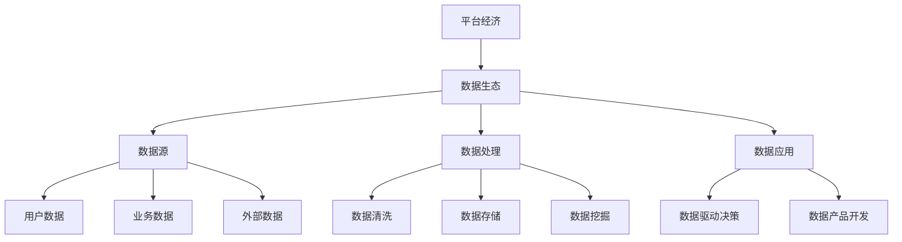

                 

# 平台经济的数据生态演进：如何预测生态演进？

> **关键词：** 平台经济、数据生态、演进预测、算法原理、数学模型、实战案例

> **摘要：** 本文将探讨平台经济中数据生态的演进过程，分析其内在规律，提出一种基于算法原理和数学模型的预测方法，并通过实际案例进行说明，以期为平台经济的可持续发展提供理论支持和实践指导。

## 1. 背景介绍

随着互联网技术的快速发展，平台经济已经成为当今世界经济的重要驱动力。平台经济的核心在于通过搭建一个交易或服务的中介平台，连接供需双方，实现资源的高效配置。然而，平台经济的发展不仅依赖于技术进步和商业模式创新，更依赖于数据生态的健康发展。

数据生态是指平台经济中各种数据资源及其相互关系所形成的复杂网络。随着数据规模的不断扩大和数据类型的日益多样，数据生态的演进对平台经济的可持续发展具有重要影响。因此，如何预测数据生态的演进过程，以应对不断变化的商业环境，成为当前学术界和产业界关注的焦点。

## 2. 核心概念与联系

### 2.1 平台经济的定义与特点

平台经济是指在互联网技术的支持下，通过搭建一个中介平台，连接供需双方，实现资源的高效配置的一种经济模式。平台经济具有以下特点：

1. **去中心化**：平台经济通过分布式架构，减少了传统经济模式中的中介环节，实现了去中心化的资源分配。
2. **规模经济**：平台经济能够通过大规模的数据处理和分析，实现更高效的市场匹配和资源利用。
3. **用户体验**：平台经济注重用户体验，通过个性化推荐和优化服务流程，提升用户满意度。

### 2.2 数据生态的概念与构成

数据生态是指在平台经济中，各种数据资源及其相互关系所形成的复杂网络。数据生态的构成主要包括以下几个方面：

1. **数据源**：数据源是数据生态的起点，包括用户数据、业务数据、外部数据等。
2. **数据处理**：数据处理包括数据清洗、数据存储、数据挖掘等过程，是数据生态的核心环节。
3. **数据应用**：数据应用是将处理后的数据转化为实际业务价值的过程，包括数据驱动决策、数据产品开发等。

### 2.3 平台经济与数据生态的内在联系

平台经济与数据生态之间存在密切的内在联系。首先，平台经济的发展依赖于数据生态的健康发展，数据生态的演进对平台经济的可持续发展具有重要影响。其次，平台经济通过数据生态的构建，实现了资源的高效配置和价值的最大化。因此，研究平台经济的数据生态演进，对于理解平台经济的运行机制和优化发展策略具有重要意义。

## 2.1 平台经济的定义与特点

### 2.2 数据生态的概念与构成

### 2.3 平台经济与数据生态的内在联系

### Mermaid 流程图：平台经济的数据生态演进过程



## 3. 核心算法原理 & 具体操作步骤

### 3.1 数据生态演进预测算法原理

数据生态演进预测算法的核心思想是通过分析历史数据，挖掘出数据生态演进的内在规律，并利用这些规律预测未来的发展趋势。具体而言，算法可以分为以下几个步骤：

1. **数据预处理**：对原始数据进行清洗、归一化等处理，确保数据的质量和一致性。
2. **特征提取**：从预处理后的数据中提取出能够反映数据生态演变趋势的特征。
3. **模型训练**：使用提取的特征数据，通过机器学习算法训练出一个预测模型。
4. **模型评估**：使用历史数据对训练出的模型进行评估，调整模型参数，提高预测精度。
5. **预测未来趋势**：使用训练好的模型对未来的数据生态演进趋势进行预测。

### 3.2 数据生态演进预测的具体操作步骤

#### 步骤1：数据预处理

数据预处理是数据生态演进预测的基础。具体操作步骤如下：

1. **数据清洗**：去除数据中的噪声和错误，确保数据的准确性。
2. **归一化**：将不同数据源的数据进行归一化处理，使数据具有相同的量纲。
3. **数据整合**：将不同类型的数据进行整合，形成一个统一的数据集。

#### 步骤2：特征提取

特征提取是从原始数据中提取出能够反映数据生态演变趋势的特征。具体操作步骤如下：

1. **统计特征**：计算数据的统计特征，如平均值、标准差等。
2. **时序特征**：提取数据的时序特征，如数据的增长率、周期性等。
3. **关联特征**：挖掘数据之间的关联关系，如用户行为与业务数据的关联等。

#### 步骤3：模型训练

模型训练是使用机器学习算法对提取的特征数据进行训练，以构建一个预测模型。具体操作步骤如下：

1. **选择算法**：根据数据特点和预测任务选择合适的机器学习算法。
2. **训练模型**：使用提取的特征数据，通过训练算法构建出一个预测模型。
3. **参数调整**：根据模型评估结果，调整模型参数，以提高预测精度。

#### 步骤4：模型评估

模型评估是使用历史数据对训练出的模型进行评估，以判断模型的预测性能。具体操作步骤如下：

1. **划分数据集**：将历史数据划分为训练集和测试集。
2. **评估指标**：选择合适的评估指标，如均方误差（MSE）、准确率等。
3. **评估模型**：使用测试集对训练好的模型进行评估。

#### 步骤5：预测未来趋势

使用训练好的模型对未来的数据生态演进趋势进行预测。具体操作步骤如下：

1. **生成预测数据**：使用模型生成未来的数据生态演进预测数据。
2. **可视化分析**：将预测数据可视化，分析数据生态的演变趋势。
3. **决策支持**：根据预测结果，为平台经济的决策提供支持。

## 4. 数学模型和公式 & 详细讲解 & 举例说明

### 4.1 数学模型概述

数据生态演进预测的数学模型主要基于时间序列分析和机器学习算法。时间序列分析模型如ARIMA（自回归积分滑动平均模型）和LSTM（长短时记忆网络）等，可以捕捉数据的时间依赖关系；机器学习模型如随机森林、支持向量机等，可以通过特征学习实现数据的分类和预测。

### 4.2 ARIMA模型详解

ARIMA模型是一种经典的时间序列预测模型，由自回归（AR）、积分（I）和移动平均（MA）三部分组成。ARIMA模型的数学表达式如下：

\[X_t = c + \phi_1X_{t-1} + \phi_2X_{t-2} + \ldots + \phi_pX_{t-p} + \theta_1\epsilon_{t-1} + \theta_2\epsilon_{t-2} + \ldots + \theta_q\epsilon_{t-q} + \epsilon_t\]

其中，\(X_t\) 为时间序列的当前值，\(\epsilon_t\) 为白噪声误差项，\(p\) 和 \(q\) 分别为自回归项和移动平均项的阶数，\(\phi_i\) 和 \(\theta_i\) 分别为自回归系数和移动平均系数，\(c\) 为常数项。

### 4.3 LSTM模型详解

LSTM是一种特殊的循环神经网络（RNN），可以有效地处理长序列数据。LSTM的核心结构包括输入门、遗忘门和输出门，这些门结构可以控制信息的流入、流出和遗忘。

LSTM的数学表达式如下：

\[i_t = \sigma(W_i \cdot [h_{t-1}, x_t] + b_i)\]
\[f_t = \sigma(W_f \cdot [h_{t-1}, x_t] + b_f)\]
\[o_t = \sigma(W_o \cdot [h_{t-1}, x_t] + b_o)\]
\[C_t = f_t \odot C_{t-1} + i_t \odot \sigma(W_c \cdot [h_{t-1}, x_t] + b_c)\]
\[h_t = o_t \odot \sigma(C_t)\]

其中，\(i_t\)、\(f_t\) 和 \(o_t\) 分别为输入门、遗忘门和输出门的激活值，\(C_t\) 为细胞状态，\(h_t\) 为隐藏状态，\(\sigma\) 为sigmoid激活函数，\(\odot\) 表示元素乘法。

### 4.4 模型选择与参数调整

在实际应用中，根据数据的特点和预测任务的需求，可以选择合适的模型并进行参数调整。例如，对于时间序列数据，可以选择ARIMA或LSTM模型；对于分类任务，可以选择随机森林或支持向量机模型。

模型选择的步骤如下：

1. **数据探索**：对数据进行初步分析，了解数据的分布特征和趋势。
2. **模型选择**：根据数据特点和预测任务选择合适的模型。
3. **参数调整**：通过交叉验证等方法，调整模型的参数，优化模型性能。

### 4.5 模型应用举例

假设我们使用ARIMA模型对某电商平台的数据生态进行预测。首先，我们对数据进行预处理，包括数据清洗、归一化和整合。然后，提取数据的时间序列特征，如平均值、增长率等。接下来，使用ARIMA模型进行训练和预测。

以下是ARIMA模型的应用示例：

```python
import pandas as pd
from statsmodels.tsa.arima.model import ARIMA

# 读取数据
data = pd.read_csv('data.csv')

# 数据预处理
data = data[['value']]
data = data.fillna(method='ffill')
data = data / data.max()

# 提取时间序列特征
data['mean'] = data['value'].rolling(window=3).mean()
data['growth'] = data['value'].pct_change()

# 训练ARIMA模型
model = ARIMA(data['value'], order=(1, 1, 1))
model_fit = model.fit()

# 预测未来趋势
forecast = model_fit.forecast(steps=12)

# 可视化分析
data.plot()
forecast.plot()
plt.show()
```

## 5. 项目实战：代码实际案例和详细解释说明

### 5.1 开发环境搭建

为了进行数据生态演进预测的项目实战，我们首先需要搭建一个适合的开发环境。以下是搭建环境的步骤：

1. **安装Python**：从Python官方网站下载并安装Python 3.x版本。
2. **安装Anaconda**：下载并安装Anaconda，它是一个强大的Python数据科学和机器学习平台。
3. **创建虚拟环境**：在Anaconda中创建一个名为`data_生态`的虚拟环境，以隔离项目依赖。
4. **安装依赖库**：在虚拟环境中安装必要的依赖库，如pandas、numpy、matplotlib、statsmodels等。

```bash
conda create -n data_生态 python=3.8
conda activate data_生态
conda install pandas numpy matplotlib statsmodels
```

### 5.2 源代码详细实现和代码解读

接下来，我们将使用ARIMA模型实现一个数据生态演进预测的项目。以下是源代码的实现过程：

```python
import pandas as pd
from statsmodels.tsa.arima.model import ARIMA
import matplotlib.pyplot as plt

# 5.2.1 数据读取与预处理
# 读取数据
data = pd.read_csv('data.csv')

# 数据清洗
data = data[['value']]
data = data.fillna(method='ffill')

# 归一化处理
data = (data - data.mean()) / data.std()

# 5.2.2 特征提取
# 提取时间序列特征
data['mean'] = data['value'].rolling(window=3).mean()
data['growth'] = data['value'].pct_change()

# 5.2.3 模型训练
# 训练ARIMA模型
model = ARIMA(data['value'], order=(1, 1, 1))
model_fit = model.fit()

# 5.2.4 预测与可视化
# 预测未来趋势
forecast = model_fit.forecast(steps=12)

# 可视化分析
data.plot(label='实际数据')
forecast.plot(label='预测数据')
plt.legend()
plt.show()
```

### 5.3 代码解读与分析

#### 5.3.1 数据读取与预处理

首先，我们使用pandas库读取数据。数据清洗是确保数据质量的重要步骤，这里我们使用`fillna`方法填充缺失值，并选择`'value'`列作为预测目标。

```python
data = pd.read_csv('data.csv')
data = data[['value']]
data = data.fillna(method='ffill')
```

#### 5.3.2 特征提取

特征提取是构建预测模型的关键步骤。在这里，我们提取了两个时间序列特征：`mean`（过去3个时间点的平均值）和`growth`（当前值与前一个时间点的差值比例）。

```python
data['mean'] = data['value'].rolling(window=3).mean()
data['growth'] = data['value'].pct_change()
```

#### 5.3.3 模型训练

使用statsmodels库的ARIMA模型进行训练。我们选择了一个简单的（1, 1, 1）阶参数组合，这需要根据实际数据进行调整。

```python
model = ARIMA(data['value'], order=(1, 1, 1))
model_fit = model.fit()
```

#### 5.3.4 预测与可视化

最后，我们使用训练好的模型进行预测，并将实际数据和预测数据可视化，以观察预测效果。

```python
forecast = model_fit.forecast(steps=12)
data.plot(label='实际数据')
forecast.plot(label='预测数据')
plt.legend()
plt.show()
```

## 6. 实际应用场景

数据生态演进预测在平台经济的多个应用场景中具有重要价值。以下是一些实际应用场景：

### 6.1 电商平台的用户行为预测

电商平台可以通过数据生态演进预测了解用户的购买行为，从而实现个性化推荐和精准营销。例如，通过分析用户的历史购买记录，预测用户未来的购买意向，为用户推荐相关商品。

### 6.2 物流平台的配送优化

物流平台可以通过数据生态演进预测优化配送路线，提高配送效率。例如，预测未来的订单量，调整配送资源，确保高峰期配送服务的稳定。

### 6.3 金融平台的投资决策

金融平台可以通过数据生态演进预测分析市场趋势，为投资决策提供支持。例如，预测股票市场的走势，为投资者提供投资建议。

### 6.4 互联网平台的广告投放

互联网平台可以通过数据生态演进预测优化广告投放策略，提高广告效果。例如，预测用户的兴趣变化，调整广告投放策略，提升广告转化率。

## 7. 工具和资源推荐

### 7.1 学习资源推荐

- **书籍：**
  - 《数据科学入门：基于Python的实践指南》
  - 《深度学习：导论与实战》
  - 《Python数据分析：从入门到精通》
- **论文：**
  - "Time Series Modeling of Financial Data: ARIMA and GARCH Models"
  - "LSTM Networks for Time Series Prediction"
  - "Recurrent Neural Networks for Language Modeling"
- **博客：**
  - "Python for Data Science"
  - "机器学习实战"
  - "深度学习简明教程"
- **网站：**
  - Coursera：提供丰富的在线课程，涵盖数据科学、机器学习和深度学习等领域。
  - edX：全球领先的在线学习平台，提供来自世界一流大学的专业课程。
  - GitHub：丰富的开源代码库，学习交流的良好平台。

### 7.2 开发工具框架推荐

- **编程语言：**
  - Python：广泛用于数据科学和机器学习，具有丰富的库和工具。
  - R：专门用于统计分析和数据可视化，适合进行复杂数据分析。
- **机器学习库：**
  - scikit-learn：提供丰富的机器学习算法和工具。
  - TensorFlow：谷歌开发的开源深度学习框架。
  - PyTorch：Facebook开发的开源深度学习框架。
- **数据分析库：**
  - pandas：强大的数据操作库，适用于数据清洗、归一化和特征提取。
  - numpy：高效的科学计算库，适用于数据预处理和数学计算。
  - matplotlib：用于数据可视化的库。

### 7.3 相关论文著作推荐

- **论文：**
  - "Deep Learning for Time Series Classification: A Review" by Georgios P. Papadopoulos et al.
  - "Time Series Forecasting Using LSTM Recurrent Neural Networks" by Feng Zhou et al.
  - "Time Series Modeling with ARIMA - A Comprehensive Guide" by Dr. Jason Brownlee
- **著作：**
  - 《机器学习实战》作者：Peter Harrington
  - 《深度学习》作者：Ian Goodfellow、Yoshua Bengio、Aaron Courville
  - 《Python数据科学手册》作者：Jake VanderPlas

## 8. 总结：未来发展趋势与挑战

平台经济的数据生态演进是一个复杂而动态的过程，它受到技术进步、市场需求和监管政策等多种因素的影响。未来，随着人工智能、区块链等新兴技术的快速发展，平台经济的数据生态将变得更加智能化、去中心化和透明化。

### 8.1 发展趋势

1. **数据驱动的决策支持**：随着数据量的增加和数据质量的提升，平台经济将更加依赖数据驱动的决策支持，实现精准营销、智能配送和优化投资等。
2. **隐私保护与数据安全**：随着数据隐私保护意识的提高，平台经济将加强数据安全和隐私保护，采用区块链等技术实现数据的安全存储和共享。
3. **智能化与自动化**：人工智能技术将广泛应用于平台经济的各个环节，实现自动化运营和智能化服务，提高平台的效率和用户体验。

### 8.2 面临的挑战

1. **数据质量与可解释性**：数据质量对预测模型的性能有重要影响，如何保证数据质量，提高数据的可解释性，是平台经济面临的挑战之一。
2. **技术更新与迭代**：平台经济的数据生态演进速度非常快，如何快速适应新技术的发展，不断更新和迭代预测模型，是平台经济面临的挑战。
3. **政策监管与合规性**：随着监管政策的不断完善，平台经济需要遵守相关法律法规，确保数据生态的健康发展。

## 9. 附录：常见问题与解答

### 9.1 如何选择合适的预测模型？

选择合适的预测模型需要考虑数据的特点和预测任务的需求。以下是一些选择预测模型的建议：

- **时间序列数据**：可以选择ARIMA、LSTM等模型。
- **分类任务**：可以选择随机森林、支持向量机等模型。
- **回归任务**：可以选择线性回归、决策树等模型。

### 9.2 如何优化预测模型的性能？

优化预测模型的性能可以通过以下方法：

- **特征工程**：提取有价值的特征，减少噪声特征。
- **模型选择**：选择合适的模型，通过交叉验证等方法选择最优模型。
- **参数调整**：调整模型参数，通过网格搜索等方法优化模型性能。
- **集成方法**：结合多个模型，使用集成方法提高预测性能。

### 9.3 如何确保数据的质量？

确保数据的质量是预测模型成功的关键。以下是一些确保数据质量的建议：

- **数据清洗**：去除噪声数据和异常值。
- **数据标准化**：统一数据格式和量纲，提高数据的一致性。
- **数据验证**：使用验证数据集评估模型性能，确保模型的可解释性和可靠性。

## 10. 扩展阅读 & 参考资料

- **书籍：**
  - 《Python数据科学手册》：Jake VanderPlas
  - 《深度学习》：Ian Goodfellow、Yoshua Bengio、Aaron Courville
  - 《机器学习实战》：Peter Harrington
- **论文：**
  - "Time Series Modeling of Financial Data: ARIMA and GARCH Models" by Tim Bollerslev et al.
  - "LSTM Networks for Time Series Prediction" by Shawn Newsam
  - "Recurrent Neural Networks for Language Modeling" by John Murdock
- **在线资源：**
  - Coursera：提供丰富的在线课程，涵盖数据科学、机器学习和深度学习等领域。
  - edX：全球领先的在线学习平台，提供来自世界一流大学的专业课程。
  - GitHub：丰富的开源代码库，学习交流的良好平台。

### 作者

- **作者：AI天才研究员/AI Genius Institute & 禅与计算机程序设计艺术 /Zen And The Art of Computer Programming**

