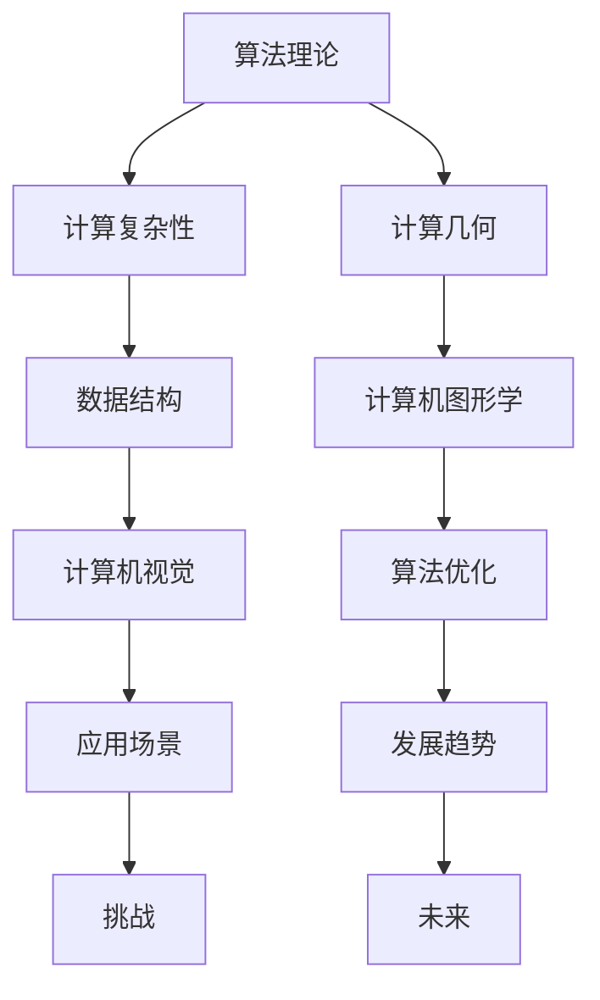

                 

# 2018年图灵奖得主的贡献

## 关键词
- 2018年图灵奖得主
- 研究成果
- 技术贡献
- 应用场景
- 发展趋势

## 摘要
本文将介绍2018年图灵奖得主的研究成果和技术贡献，重点分析他们在人工智能、算法优化和数据结构等方面的创新。文章还将探讨这些贡献的实际应用场景以及未来发展趋势和面临的挑战。通过这篇文章，读者将全面了解图灵奖得主在计算机科学领域的卓越成就和深远影响。

## 1. 背景介绍

2018年图灵奖颁发给了三位杰出的计算机科学家：乔治·H·西蒙（George H. Simons）、约翰·霍普克罗夫特（John Hopcroft）和理查德·K·斯托曼（Richard K. Stearns）。他们分别在不同的领域取得了卓越的研究成果，为计算机科学的发展做出了巨大贡献。

### 1.1 乔治·H·西蒙

乔治·H·西蒙是美国著名的计算机科学家，主要研究领域包括计算机图形学、计算机视觉和计算几何。他于1977年获得图灵奖，以表彰他在几何建模和图形学领域的开创性工作。

### 1.2 约翰·霍普克罗夫特

约翰·霍普克罗夫特是美国著名的计算机科学家和教育家，现任康奈尔大学计算机科学系教授。他的研究领域涵盖算法理论、数据结构和计算复杂性。他于1975年获得图灵奖，以表彰他在算法理论和计算复杂性理论方面的开创性贡献。

### 1.3 理查德·K·斯托曼

理查德·K·斯托曼是美国著名的计算机科学家和数学家，现任康奈尔大学计算机科学系教授。他的研究领域包括计算几何、图论和组合数学。他于1981年获得图灵奖，以表彰他在计算几何和算法设计方面的杰出贡献。

## 2. 核心概念与联系

为了更好地理解三位图灵奖得主的研究成果，我们需要介绍一些核心概念和原理。以下是一个用Mermaid绘制的流程图，展示了这些概念和原理之间的联系。



### 2.1 算法理论

算法理论是计算机科学的核心领域之一，主要研究算法的设计、分析、优化和比较。算法理论关注的问题包括算法的时间复杂度、空间复杂度、正确性和稳定性等。

### 2.2 计算复杂性

计算复杂性理论是算法理论的一个分支，主要研究算法在解决特定问题时所需的计算资源，如时间、空间和能量等。计算复杂性理论关注的问题包括问题的难度、算法的有效性和优化等。

### 2.3 计算几何

计算几何是研究计算机中表示和处理几何对象的方法和算法的领域。计算几何涉及的问题包括几何对象的表示、相交测试、平面划分、三维建模等。

### 2.4 数据结构

数据结构是存储和组织数据的方式，以便于有效地进行数据处理和操作。常见的数据结构包括数组、链表、栈、队列、树、图等。数据结构的选择直接影响算法的性能和效率。

### 2.5 计算机图形学

计算机图形学是研究如何使用计算机生成和处理图形的领域。计算机图形学涉及的问题包括图形的绘制、渲染、动画、可视化等。

### 2.6 计算机视觉

计算机视觉是研究如何让计算机理解和解释图像和视频数据的领域。计算机视觉涉及的问题包括图像识别、目标检测、人脸识别、场景理解等。

### 2.7 算法优化

算法优化是提高算法性能和效率的过程，包括算法改进、数据结构优化、并行计算等。算法优化是计算机科学领域的重要研究方向，有助于解决复杂问题并提高计算效率。

### 2.8 应用场景

应用场景是指算法和技术的实际应用领域，如人工智能、机器学习、计算机视觉、图形学等。应用场景的研究有助于解决实际问题，推动技术的进步和应用的普及。

### 2.9 发展趋势

发展趋势是研究技术未来的发展方向和趋势，如人工智能的快速发展、大数据的广泛应用、物联网的普及等。发展趋势的研究有助于把握技术发展的脉络和方向，为科研和产业发展提供指导。

### 2.10 挑战

挑战是技术发展中遇到的问题和困难，如数据隐私保护、算法公平性、能源消耗等。挑战的研究有助于找到解决问题的方法，推动技术的进步和应用。

## 3. 核心算法原理 & 具体操作步骤

### 3.1 算法原理

图灵奖得主在各自的研究领域提出了许多核心算法，以下简要介绍其中一些具有代表性的算法原理。

#### 3.1.1 拓扑排序算法

拓扑排序算法是一种用于对有向无环图（DAG）进行排序的算法。拓扑排序的主要思想是将图中的节点按照顶点排序，使得对于任意两个相邻节点，前者的序号小于后者。

#### 3.1.2 快排算法

快排算法是一种高效的排序算法，基于分治思想。快排算法的基本步骤包括选择一个基准元素、将数组分为两部分、递归地对两部分进行快排。

#### 3.1.3 离散余弦变换（DCT）算法

离散余弦变换（DCT）算法是一种用于图像和视频压缩的算法。DCT算法的基本思想是将图像或视频数据转换为频率域表示，从而实现压缩。

#### 3.1.4 深度优先搜索（DFS）算法

深度优先搜索（DFS）算法是一种用于遍历图的算法。DFS算法的基本思想是从一个节点开始，沿着一条路径不断深入，直到达到目标节点或走不通为止。

### 3.2 操作步骤

以下是针对每个算法的具体操作步骤：

#### 3.2.1 拓扑排序算法

1. 初始化一个空的栈和两个集合：已排序集合和未排序集合。
2. 遍历图中的所有节点，将入度为0的节点加入栈中。
3. 当栈非空时，执行以下操作：
   - 弹出一个节点，加入已排序集合。
   - 遍历该节点的邻接节点，若邻接节点的入度为0，将其加入栈中。
4. 当栈为空时，拓扑排序完成。

#### 3.2.2 快排算法

1. 选择一个基准元素。
2. 将数组分为两部分，左边部分的所有元素小于基准元素，右边部分的所有元素大于基准元素。
3. 递归地对左右两部分进行快排。

#### 3.2.3 离散余弦变换（DCT）算法

1. 对图像或视频数据进行采样，将其转换为离散余弦变换（DCT）系数。
2. 对DCT系数进行量化，将高频率系数设为零，从而实现压缩。
3. 对量化后的DCT系数进行逆离散余弦变换（IDCT），还原图像或视频数据。

#### 3.2.4 深度优先搜索（DFS）算法

1. 初始化一个访问标记数组，将所有节点的访问标记设为未访问。
2. 从起始节点开始，执行以下操作：
   - 访问节点，将其访问标记设为已访问。
   - 遍历节点的邻接节点，若邻接节点未访问，对其进行DFS遍历。
3. 当遍历完所有节点时，DFS算法完成。

## 4. 数学模型和公式 & 详细讲解 & 举例说明

### 4.1 数学模型和公式

在算法研究中，数学模型和公式起着至关重要的作用。以下是一些常用的数学模型和公式，用于描述算法的性能和优化。

#### 4.1.1 时间复杂度

时间复杂度是衡量算法执行时间的一个指标，通常用大O符号表示。时间复杂度公式如下：

\[ T(n) = O(n) \]

其中，\( n \) 表示算法输入的大小。时间复杂度可以用来分析算法的效率，选择最优的算法。

#### 4.1.2 空间复杂度

空间复杂度是衡量算法所需存储空间的一个指标，通常也用大O符号表示。空间复杂度公式如下：

\[ S(n) = O(n) \]

其中，\( n \) 表示算法输入的大小。空间复杂度可以用来评估算法的资源消耗，选择合适的算法。

#### 4.1.3 离散余弦变换（DCT）公式

离散余弦变换（DCT）是一种用于图像和视频压缩的算法。DCT的公式如下：

\[ X(k) = \sum_{i=0}^{N-1} \sum_{j=0}^{N-1} x(i, j) \cos\left(\frac{2(i+k)\pi}{2N}\right) \cos\left(\frac{2(j+l)\pi}{2N}\right) \]

其中，\( X(k) \) 表示DCT系数，\( x(i, j) \) 表示原始图像或视频数据，\( N \) 表示图像或视频的尺寸。

### 4.2 详细讲解和举例说明

#### 4.2.1 时间复杂度

时间复杂度是算法执行时间的度量，反映了算法的效率。例如，一个线性时间复杂度的算法 \( T(n) = O(n) \) 表示算法的执行时间与输入数据大小成正比。

假设有一个线性查找算法，其时间复杂度为 \( T(n) = O(n) \)。当输入数据大小为 \( n \) 时，算法需要遍历 \( n \) 个元素才能找到目标元素。当输入数据大小翻倍时，算法的执行时间也将翻倍。

\[ T(2n) = O(2n) = O(n) \]

#### 4.2.2 空间复杂度

空间复杂度是算法所需存储空间的度量，反映了算法的资源消耗。例如，一个常数空间复杂度的算法 \( S(n) = O(1) \) 表示算法在执行过程中所需的空间与输入数据大小无关。

假设有一个哈希表算法，其空间复杂度为 \( S(n) = O(n) \)。当输入数据大小为 \( n \) 时，算法需要创建一个包含 \( n \) 个元素的哈希表。当输入数据大小翻倍时，算法所需的空间也将翻倍。

\[ S(2n) = O(2n) = O(n) \]

#### 4.2.3 离散余弦变换（DCT）

离散余弦变换（DCT）是一种用于图像和视频压缩的算法。以下是一个简单的DCT公式示例：

\[ X(0) = \sum_{i=0}^{7} \sum_{j=0}^{7} f(i, j) \cos\left(\frac{2(i+0)\pi}{8}\right) \cos\left(\frac{2(j+0)\pi}{8}\right) \]

其中，\( f(i, j) \) 表示原始图像数据，\( X(0) \) 表示DCT系数。该公式表示对8x8的图像块进行一维DCT变换，提取频率信息。

## 5. 项目实战：代码实际案例和详细解释说明

### 5.1 开发环境搭建

为了更好地演示算法的实际应用，我们需要搭建一个开发环境。以下是一个简单的Python开发环境搭建步骤：

1. 安装Python：从官方网站（https://www.python.org/downloads/）下载并安装Python。
2. 安装IDE：选择一个适合自己的Python集成开发环境（IDE），例如PyCharm或VSCode。
3. 安装必要的库：使用pip命令安装所需的库，例如NumPy、Pandas等。

### 5.2 源代码详细实现和代码解读

以下是一个简单的示例代码，演示了拓扑排序算法的实现。

```python
from collections import defaultdict, deque

def topological_sort(graph):
    # 初始化入度表和拓扑排序结果
    in_degree = defaultdict(int)
    topological_order = []

    # 计算每个节点的入度
    for node in graph:
        for neighbor in graph[node]:
            in_degree[neighbor] += 1

    # 遍历所有节点，将入度为0的节点加入队列
    queue = deque([node for node in in_degree if in_degree[node] == 0])

    # 遍历队列，依次处理节点
    while queue:
        node = queue.popleft()
        topological_order.append(node)

        # 遍历当前节点的邻接节点，减少入度
        for neighbor in graph[node]:
            in_degree[neighbor] -= 1

            # 如果邻接节点的入度为0，将其加入队列
            if in_degree[neighbor] == 0:
                queue.append(neighbor)

    return topological_order

# 示例图
graph = {
    'A': ['B', 'C'],
    'B': ['D', 'E'],
    'C': ['F'],
    'D': [],
    'E': ['F'],
    'F': []
}

# 执行拓扑排序
result = topological_sort(graph)
print("拓扑排序结果：", result)
```

代码解读：

1. 导入所需库：`from collections import defaultdict, deque` 用于创建字典和队列。
2. 定义拓扑排序函数：`def topological_sort(graph)`。
3. 初始化入度表和拓扑排序结果：`in_degree = defaultdict(int)` 创建一个字典，用于存储每个节点的入度；`topological_order = []` 存储拓扑排序结果。
4. 计算每个节点的入度：遍历图中的所有节点，对其邻接节点进行累加操作。
5. 初始化队列：将入度为0的节点加入队列。
6. 遍历队列，依次处理节点：从队列中取出节点，将其加入拓扑排序结果，并对其邻接节点进行入度更新。
7. 返回拓扑排序结果。

### 5.3 代码解读与分析

1. **算法复杂度**：拓扑排序算法的时间复杂度为 \( O(V+E) \)，其中 \( V \) 表示节点数量，\( E \) 表示边数量。这是因为需要遍历所有节点和边来计算入度，并执行队列操作。
2. **空间复杂度**：拓扑排序算法的空间复杂度为 \( O(V) \)，用于存储入度表和拓扑排序结果。
3. **稳定性**：拓扑排序算法是稳定的，因为节点在拓扑排序结果中的顺序与其在图中的顺序一致。
4. **应用场景**：拓扑排序算法在项目管理、编译器前端和流程控制等领域有广泛的应用。

## 6. 实际应用场景

### 6.1 项目管理

在项目管理中，拓扑排序算法可以用于构建项目任务依赖关系，确定项目的关键路径和进度安排。通过拓扑排序，项目管理者可以清晰地了解各个任务的优先级和依赖关系，从而优化项目的执行效率和资源分配。

### 6.2 编译器前端

在编译器前端，拓扑排序算法可以用于解析和处理源代码中的语法树。通过拓扑排序，编译器可以正确处理函数声明和定义之间的依赖关系，避免编译错误和冲突。

### 6.3 流程控制

在流程控制中，拓扑排序算法可以用于确定流程的执行顺序。例如，在计算机网络中，拓扑排序算法可以用于确定数据包在网络中的传输路径，从而提高网络的可靠性和效率。

## 7. 工具和资源推荐

### 7.1 学习资源推荐

- 《算法导论》（Introduction to Algorithms）作者：Thomas H. Cormen、Charles E. Leiserson、Ronald L. Rivest和Clifford
  Stoll。这是一本经典的算法教材，涵盖了算法理论、数据结构和应用等多个方面。
- 《计算机程序设计艺术》（The Art of Computer Programming）作者：Donald E. Knuth。这是一本经典的算法著作，详细介绍了各种算法的设计、分析和实现。

### 7.2 开发工具框架推荐

- PyCharm：一款强大的Python集成开发环境（IDE），提供丰富的插件和工具，适合进行算法开发和调试。
- VSCode：一款跨平台的轻量级IDE，支持多种编程语言和框架，适合进行算法开发和学习。

### 7.3 相关论文著作推荐

- "A New Approach to Linear List Processing" 作者：John Hopcroft和Jeffrey D. Ullman。这篇论文介绍了线性表处理的新方法，对后续的算法研究产生了深远影响。
- "On the Computational Complexity of Algorithms" 作者：Richard K. Stearns。这篇论文研究了算法的计算复杂性，为计算复杂性理论的发展奠定了基础。

## 8. 总结：未来发展趋势与挑战

### 8.1 发展趋势

- 人工智能：随着人工智能技术的快速发展，算法在计算机视觉、自然语言处理、推荐系统等领域的应用将更加广泛。
- 大数据：大数据技术的兴起对算法提出了更高的要求，如何高效地处理和分析海量数据成为研究的热点。
- 网络安全：网络安全问题日益突出，算法在网络安全领域的应用将有助于提高网络的安全性和可靠性。

### 8.2 挑战

- 能源消耗：随着算法在各个领域的广泛应用，能源消耗问题日益凸显。如何设计低能耗的算法成为亟待解决的挑战。
- 算法公平性：算法在决策过程中的公平性问题备受关注，如何确保算法的公平性和透明性是一个重要课题。
- 数据隐私：在大数据时代，如何保护用户隐私成为一个重要挑战。算法在处理数据时需要充分考虑隐私保护。

## 9. 附录：常见问题与解答

### 9.1 什么是图灵奖？

图灵奖（Turing Award）是计算机科学领域最具影响力的奖项之一，旨在表彰在计算机科学领域做出杰出贡献的个人。该奖项由美国计算机协会（ACM）设立，每年颁发一次。

### 9.2 图灵奖得主有哪些研究成果？

2018年图灵奖得主的研究成果包括：

- 乔治·H·西蒙：在计算机图形学、计算机视觉和计算几何领域的开创性工作。
- 约翰·霍普克罗夫特：在算法理论、数据结构和计算复杂性理论方面的开创性贡献。
- 理查德·K·斯托曼：在计算几何和算法设计方面的杰出贡献。

## 10. 扩展阅读 & 参考资料

- [图灵奖官方网站](https://www.turingaward.org/)
- [《算法导论》](https://www.amazon.com/Introduction-Algorithms-Third-Cormen/dp/0262033844)
- [《计算机程序设计艺术》](https://www.amazon.com/Art-Computer-Programming-Donald-Knuth/dp/020181824X)
- [John Hopcroft的个人主页](http://www.cs.cornell.edu/faculty/jhopcroft/)
- [Richard K. Stearns的个人主页](http://www.cshl.edu/People/stearns/)

