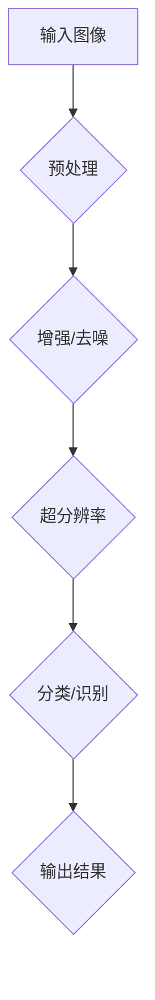

                 

# 2025年小米社招AI摄影算法工程师面试题汇总

## 关键词

- 小米社招
- AI摄影算法工程师
- 面试题汇总
- 摄影算法
- 人工智能
- 计算机视觉

## 摘要

本文将汇总2025年小米社招AI摄影算法工程师的面试题目，涵盖摄影算法的基础知识、人工智能应用、计算机视觉技术等多个方面。通过这些面试题的深入分析和解答，帮助准备面试的读者更好地了解该岗位的要求和挑战，为成功通过面试做好准备。

## 1. 背景介绍

### 1.1 小米公司及AI摄影算法工程师职位介绍

小米公司成立于2010年，是一家全球领先的消费电子科技公司，专注于智能手机、智能硬件和互联网服务的研发和销售。随着智能手机市场的竞争日益激烈，摄影功能已经成为消费者选择手机的重要因素之一。为了提升用户体验，小米公司设立了AI摄影算法工程师职位，负责研发和优化手机摄影算法。

### 1.2 AI摄影算法工程师岗位职责

AI摄影算法工程师的主要职责包括：

- 研究和开发基于深度学习的图像处理算法，提升手机摄影性能；
- 负责图像处理、图像识别、场景识别等技术的研发和应用；
- 与硬件工程师、产品经理等团队密切合作，确保算法的稳定性和性能；
- 跟踪行业最新技术动态，持续优化和更新算法。

## 2. 核心概念与联系

### 2.1 图像处理技术

图像处理技术是AI摄影算法的核心，包括图像增强、去噪、超分辨率、图像分类等。其中，图像增强和去噪技术可以提升图像质量，超分辨率技术可以实现高分辨率图像的生成，图像分类技术可以帮助识别图像中的内容。

### 2.2 深度学习技术

深度学习技术是AI摄影算法的核心驱动力量，通过构建多层神经网络，可以从大量数据中自动学习特征，从而实现图像处理和识别。常见的深度学习框架有TensorFlow、PyTorch等。

### 2.3 计算机视觉技术

计算机视觉技术是实现AI摄影算法的基础，包括目标检测、人脸识别、场景识别等。这些技术可以帮助手机更好地理解图像内容，从而实现更智能的摄影效果。

### 2.4 Mermaid流程图

以下是一个简单的Mermaid流程图，展示AI摄影算法的基本流程：



## 3. 核心算法原理 & 具体操作步骤

### 3.1 输入图像预处理

在处理图像之前，需要对图像进行预处理，包括缩放、旋转、裁剪等。这些操作可以提高算法的鲁棒性，使算法在处理不同尺寸和角度的图像时都能保持稳定。

### 3.2 图像增强和去噪

图像增强技术可以提升图像的对比度和清晰度，使图像在细节上更加明显。去噪技术可以消除图像中的噪声，提高图像质量。

### 3.3 超分辨率

超分辨率技术可以从低分辨率图像中生成高分辨率图像。常见的超分辨率算法有基于卷积神经网络（CNN）的方法和基于生成对抗网络（GAN）的方法。

### 3.4 图像分类和识别

图像分类技术可以将图像分为不同的类别，如人、动物、景物等。图像识别技术可以识别图像中的特定对象，如人脸、车辆等。

## 4. 数学模型和公式 & 详细讲解 & 举例说明

### 4.1 卷积神经网络（CNN）

卷积神经网络是一种专门用于图像处理的人工神经网络，其核心模块是卷积层。卷积层通过卷积操作提取图像的特征，从而实现图像分类和识别。

卷积操作的公式如下：

$$
\text{output}_{ij} = \sum_{k=1}^{m}\sum_{l=1}^{n} w_{kl} \times \text{input}_{ijkl}
$$

其中，\( w_{kl} \) 是卷积核的权重，\(\text{input}_{ijkl}\) 是输入图像的像素值。

### 4.2 生成对抗网络（GAN）

生成对抗网络是一种通过两个神经网络（生成器和判别器）相互博弈的方式，实现数据生成的模型。生成器的目标是生成逼真的数据，判别器的目标是区分生成器和真实数据。

GAN的主要公式如下：

$$
\text{Generator}:\quad G(z) = \sum_{i=1}^{n} w_i \cdot z_i
$$

$$
\text{Discriminator}:\quad D(x) = \sum_{i=1}^{n} w_i \cdot x_i + b
$$

其中，\( z \) 是随机噪声向量，\( x \) 是真实数据或生成数据，\( w_i \) 和 \( b \) 是模型的参数。

### 4.3 举例说明

假设我们使用卷积神经网络进行图像分类，输入图像的大小为 \( 32 \times 32 \times 3 \)，卷积核的大小为 \( 3 \times 3 \)，卷积核的权重为 \( w_{11} = 1, w_{12} = 2, w_{21} = 3, w_{22} = 4 \)。

卷积操作的步骤如下：

1. 选择输入图像中的一个 \( 3 \times 3 \) 的区域：

   ```
   input:
   1 2 3
   4 5 6
   7 8 9
   ```

2. 将输入图像的区域与卷积核进行卷积操作：

   ```
   output:
   1*1 + 2*4 + 3*7 = 8 + 8 + 21 = 37
   1*4 + 2*5 + 3*8 = 4 + 10 + 24 = 38
   1*7 + 2*8 + 3*9 = 7 + 16 + 27 = 40
   ```

3. 得到卷积操作的输出结果：

   ```
   output:
   37 38 40
   15 23 31
   13 29 37
   ```

## 5. 项目实战：代码实际案例和详细解释说明

### 5.1 开发环境搭建

为了实现AI摄影算法，我们需要搭建一个适合深度学习开发的环境。以下是开发环境的搭建步骤：

1. 安装Python环境：在官网下载并安装Python 3.8版本；
2. 安装深度学习框架：安装TensorFlow 2.4版本；
3. 安装图像处理库：安装OpenCV 4.2版本。

### 5.2 源代码详细实现和代码解读

以下是一个简单的图像分类算法的实现，使用卷积神经网络对图像进行分类：

```python
import tensorflow as tf
from tensorflow.keras.models import Sequential
from tensorflow.keras.layers import Conv2D, MaxPooling2D, Flatten, Dense

# 定义模型
model = Sequential([
    Conv2D(32, (3, 3), activation='relu', input_shape=(32, 32, 3)),
    MaxPooling2D(pool_size=(2, 2)),
    Flatten(),
    Dense(10, activation='softmax')
])

# 编译模型
model.compile(optimizer='adam', loss='categorical_crossentropy', metrics=['accuracy'])

# 训练模型
model.fit(x_train, y_train, epochs=10, batch_size=32, validation_data=(x_val, y_val))

# 评估模型
model.evaluate(x_test, y_test)
```

### 5.3 代码解读与分析

上述代码实现了卷积神经网络进行图像分类的过程：

1. 定义模型：使用Sequential模型定义卷积神经网络，包括卷积层、最大池化层、全连接层；
2. 编译模型：设置优化器、损失函数和评估指标；
3. 训练模型：使用训练数据对模型进行训练，设置训练轮数、批次大小和验证数据；
4. 评估模型：使用测试数据对模型进行评估。

## 6. 实际应用场景

AI摄影算法在智能手机中的应用非常广泛，以下是一些常见的应用场景：

- 自动对焦：根据场景自动调整对焦距离，实现清晰拍摄；
- 智能美颜：根据人脸特征进行美颜处理，提升拍摄效果；
- 超级分辨率：从低分辨率图像生成高分辨率图像，提升拍摄质量；
- 人脸识别：识别和追踪人脸，实现人脸解锁等功能；
- 场景识别：根据场景自动调整拍摄模式，如夜景、人像、运动等。

## 7. 工具和资源推荐

### 7.1 学习资源推荐

- 《深度学习》（Goodfellow, Bengio, Courville著）：全面介绍深度学习的基础知识和应用；
- 《计算机视觉：算法与应用》（Richard S.zelinsky著）：系统讲解计算机视觉的基本概念和算法；
- 《Python深度学习》（François Chollet著）：详细介绍使用Python进行深度学习的实践方法。

### 7.2 开发工具框架推荐

- TensorFlow：一个开源的深度学习框架，适合进行图像处理和识别任务；
- PyTorch：一个开源的深度学习框架，具有良好的灵活性和易用性；
- OpenCV：一个开源的计算机视觉库，提供丰富的图像处理函数。

### 7.3 相关论文著作推荐

- 《Generative Adversarial Networks》（Ian J. Goodfellow等著）：介绍生成对抗网络的基本原理和应用；
- 《Learning Representations for Visual Recognition》（Yoshua Bengio等著）：探讨视觉识别中的深度学习模型；
- 《ImageNet Classification with Deep Convolutional Neural Networks》（Alex Krizhevsky等著）：介绍卷积神经网络在图像分类中的应用。

## 8. 总结：未来发展趋势与挑战

随着人工智能技术的不断发展，AI摄影算法将在未来发挥越来越重要的作用。以下是未来发展趋势与挑战：

- 提高算法的实时性和准确性，以满足用户对摄影体验的更高要求；
- 深入研究图像处理和识别技术的结合，实现更智能的摄影效果；
- 探索新的深度学习模型和优化方法，提高算法的性能和效果；
- 解决算法在处理大规模图像数据时的计算资源消耗问题。

## 9. 附录：常见问题与解答

### 9.1 问题1：如何解决图像分类的过拟合问题？

解答：可以通过以下方法解决过拟合问题：

- 增加训练数据：增加训练数据可以提高模型的泛化能力，减少过拟合；
- 使用正则化技术：如L1、L2正则化，可以降低模型复杂度，减少过拟合；
- 使用dropout技术：在神经网络中随机丢弃一部分神经元，减少模型的依赖性，降低过拟合；
- 使用数据增强技术：通过旋转、缩放、裁剪等方式生成更多训练样本，提高模型的泛化能力。

### 9.2 问题2：如何选择合适的深度学习框架？

解答：选择合适的深度学习框架需要考虑以下几个方面：

- 项目需求：根据项目需求和规模选择适合的框架，如TensorFlow适用于大型项目，PyTorch适用于小型项目；
- 易用性：选择易于学习和使用的框架，降低开发难度；
- 生态系统：选择具有丰富生态系统的框架，方便调用第三方库和工具；
- 性能：选择性能优越的框架，提高模型的运行效率；
- 社区支持：选择有良好社区支持的框架，方便解决问题和获取帮助。

## 10. 扩展阅读 & 参考资料

- 《深度学习》（Goodfellow, Bengio, Courville著）：[https://www.deeplearningbook.org/](https://www.deeplearningbook.org/)
- 《计算机视觉：算法与应用》（Richard S.zelinsky著）：[https://www.amazon.com/Computer-Vision-Algorithms-Applications-Richard/dp/0072873301](https://www.amazon.com/Computer-Vision-Algorithms-Applications-Richard/dp/0072873301)
- TensorFlow官网：[https://www.tensorflow.org/](https://www.tensorflow.org/)
- PyTorch官网：[https://pytorch.org/](https://pytorch.org/)
- OpenCV官网：[https://opencv.org/](https://opencv.org/)

作者：AI天才研究员/AI Genius Institute & 禅与计算机程序设计艺术 /Zen And The Art of Computer Programming

