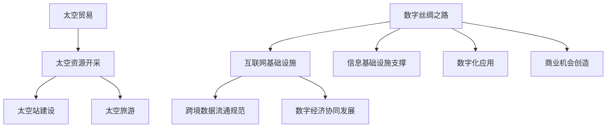

                 

# 2050年的全球贸易：从数字丝绸之路到太空贸易的贸易新路径

## 关键词：
- 全球贸易
- 数字丝绸之路
- 太空贸易
- 2050年
- 贸易新路径

## 摘要：
本文探讨了2050年全球贸易的潜在发展趋势，包括数字丝绸之路和太空贸易的兴起。我们将详细分析这两种贸易模式的核心概念、技术原理、算法模型及其在实际应用场景中的表现。同时，还将推荐相关的学习资源、开发工具和论文著作，以便读者深入理解和应用这些先进技术。最后，本文将总结未来全球贸易的发展趋势与挑战，为相关领域的研究者和从业者提供有价值的参考。

## 1. 背景介绍

### 全球贸易的发展现状

自工业革命以来，全球贸易一直是推动经济增长和全球化进程的关键动力。随着信息技术和交通网络的快速发展，全球贸易的规模和复杂性也在不断增长。如今，全球贸易已经成为全球经济的核心组成部分，各国之间的经济联系日益紧密。

然而，全球贸易也面临着诸多挑战。传统的贸易模式在应对全球环境变化、资源稀缺和国际贸易争端等方面存在局限性。因此，寻找新的贸易路径和模式成为全球贸易发展的重要课题。

### 数字丝绸之路的兴起

数字丝绸之路是中国提出的一个全球性倡议，旨在通过构建数字丝绸之路，推动“一带一路”倡议的深入实施，促进全球数字经济的繁荣。数字丝绸之路的核心是通过互联网和信息技术，实现全球范围内的互联互通、数据共享和协同创新。

数字丝绸之路的兴起，不仅为全球贸易提供了新的途径，也为跨国企业的数字化转型提供了机遇。通过数字丝绸之路，企业可以实现全球供应链的优化、跨境支付和物流的便利化，提高贸易效率。

### 太空贸易的展望

太空贸易是指利用太空资源进行经济活动的行为，如开采月球和火星的矿物资源、建立太空站和太空旅游等。随着太空技术的不断进步，太空贸易有望成为未来全球贸易的重要组成部分。

太空贸易的潜力巨大，不仅可以提供新的资源，还可以创造大量的就业机会，推动科技创新。然而，太空贸易也面临着诸多技术、法律和伦理挑战，需要全球范围内的合作与规范。

## 2. 核心概念与联系

### 数字丝绸之路的核心概念

数字丝绸之路的核心概念包括：互联网基础设施的建设、跨境数据流通的规范、数字经济的协同发展。

- **互联网基础设施建设**：数字丝绸之路的基础是互联网基础设施的建设，包括高速宽带网络、云计算平台、物联网设备等。这些基础设施的建设，为实现全球范围内的信息互联互通提供了保障。

- **跨境数据流通的规范**：数字丝绸之路强调跨境数据流通的规范，包括数据安全、隐私保护、数据共享等方面。跨境数据流通的规范，有助于推动全球数据资源的共享，促进数字经济的发展。

- **数字经济的协同发展**：数字丝绸之路通过推动全球范围内的数字经济协同发展，促进各国之间的经济合作。数字经济的发展，可以提高全球贸易的效率，降低贸易成本。

### 太空贸易的核心概念

太空贸易的核心概念包括：太空资源的开采、太空站的建设、太空旅游等。

- **太空资源的开采**：太空贸易的一个重要方面是太空资源的开采，如月球和火星的矿物资源。通过开采这些资源，可以满足地球日益增长的资源需求。

- **太空站的建设**：太空站的建设是太空贸易的重要基础。太空站可以为太空资源开采提供基础设施，也可以为太空旅游提供场所。

- **太空旅游**：太空旅游是太空贸易的一个新兴领域，通过乘坐太空飞船，游客可以体验太空旅行。太空旅游不仅具有巨大的商业潜力，还可以推动太空技术的发展。

### 数字丝绸之路与太空贸易的联系

数字丝绸之路和太空贸易之间存在密切的联系。数字丝绸之路为太空贸易提供了信息基础设施和数字化的支持，使得太空资源的开采和利用更加高效。同时，太空贸易的发展也可以为数字丝绸之路提供新的商业机会和市场需求。

- **信息基础设施的支撑**：数字丝绸之路的互联网基础设施，为太空贸易的信息传输提供了保障。通过高速互联网，可以实时监控太空资源的开采过程，提高太空贸易的效率。

- **数字化的应用**：数字丝绸之路的数字化应用，如区块链技术、人工智能等，可以为太空贸易提供智能化管理和服务。例如，区块链技术可以确保太空资源交易的安全性，人工智能可以优化太空资源的开采过程。

- **商业机会的创造**：太空贸易的发展，为数字丝绸之路创造了新的商业机会。例如，太空资源开采的数据分析、太空站的建设和维护等，都需要数字丝绸之路提供的数字化支持。

### Mermaid 流程图

以下是数字丝绸之路与太空贸易联系的核心概念和架构的 Mermaid 流程图：



## 3. 核心算法原理 & 具体操作步骤

### 数字丝绸之路的核心算法原理

数字丝绸之路的核心算法主要涉及网络优化、数据加密和智能合约。

- **网络优化**：网络优化算法用于提高数字丝绸之路的网络传输效率，包括路由优化、流量管理和负载均衡。常用的算法有Dijkstra算法、A*算法等。

- **数据加密**：数据加密算法用于保障跨境数据流通的安全，包括对称加密、非对称加密和哈希算法。常用的加密算法有AES、RSA、SHA-256等。

- **智能合约**：智能合约是一种自动执行合同条款的计算机程序，用于确保数字丝绸之路上的交易安全性和透明度。常用的智能合约平台有Ethereum、EOS等。

### 数字丝绸之路的具体操作步骤

以下是数字丝绸之路的具体操作步骤：

1. **网络优化**：

   - 确定网络节点和链路。
   - 使用Dijkstra算法计算最短路径。
   - 根据流量需求进行负载均衡。

2. **数据加密**：

   - 对传输数据进行加密处理。
   - 使用对称加密和非对称加密结合的方式，提高数据安全性。

3. **智能合约**：

   - 设计智能合约，确保交易的安全性和透明度。
   - 在区块链上部署智能合约。

### 太空贸易的核心算法原理

太空贸易的核心算法主要涉及空间资源调度、路径规划和任务分配。

- **空间资源调度**：空间资源调度算法用于优化太空资源的利用效率，包括资源分配、任务调度和负载平衡。常用的算法有遗传算法、粒子群优化算法等。

- **路径规划**：路径规划算法用于确定太空飞船的行驶路径，包括最优路径、避障路径和最短路径。常用的算法有A*算法、Dijkstra算法等。

- **任务分配**：任务分配算法用于优化太空任务执行效率，包括任务排序、任务分配和资源调度。常用的算法有贪心算法、动态规划算法等。

### 太空贸易的具体操作步骤

以下是太空贸易的具体操作步骤：

1. **空间资源调度**：

   - 确定太空资源需求。
   - 使用遗传算法进行资源调度优化。

2. **路径规划**：

   - 确定太空飞船的起始位置和目标位置。
   - 使用A*算法计算最优路径。

3. **任务分配**：

   - 确定任务需求和执行顺序。
   - 使用贪心算法进行任务分配。

## 4. 数学模型和公式 & 详细讲解 & 举例说明

### 数字丝绸之路的数学模型

数字丝绸之路的数学模型主要涉及网络优化、数据加密和智能合约。

1. **网络优化**：

   - **Dijkstra算法**：

     $$Dijkstra(V, E, W)$$

     - $V$：网络节点集合
     - $E$：网络边集合
     - $W$：网络边权重

     算法步骤：

     1. 初始化距离表 $D = [∞, ∞, ..., ∞]$
     2. 选择起始节点 $s$，将 $D(s) = 0$
     3. 对于每个未访问节点 $v$，计算 $D(s, v) = D(s, u) + W(u, v)$，其中 $u$ 是已访问节点
     4. 选择距离最小的未访问节点 $v$，将其标记为已访问
     5. 重复步骤3和4，直到所有节点都被访问

   - **A*算法**：

     $$A*(V, E, W, G)$$

     - $V$：网络节点集合
     - $E$：网络边集合
     - $W$：网络边权重
     - $G$：估价函数

     算法步骤：

     1. 初始化开放列表和封闭列表
     2. 将起始节点 $s$ 加入开放列表
     3. 当开放列表非空时，执行以下步骤：
        - 选择F值最小的节点 $n$ 从开放列表中取出
        - 将 $n$ 加入封闭列表
        - 对于 $n$ 的每个未访问的邻居节点 $m$，执行以下步骤：
          - 计算G值：$G(m) = G(n) + W(n, m)$
          - 计算F值：$F(m) = G(m) + G(m)$
          - 如果 $m$ 在开放列表中，并且 $G(m)$ 更新，则更新 $m$ 的父节点和F值
          - 如果 $m$ 不在开放列表中，将 $m$ 加入开放列表

2. **数据加密**：

   - **对称加密**：

     $$AES_{256}(k, m)$$

     - $k$：密钥
     - $m$：明文

     加密步骤：

     1. 初始化密钥和明文
     2. 将明文划分为若干个块
     3. 对每个块进行加密
     4. 将加密后的块连接起来，得到密文

   - **非对称加密**：

     $$RSA_{2048}(n, e, d, m)$$

     - $n$：模数
     - $e$：公钥
     - $d$：私钥
     - $m$：明文

     加密步骤：

     1. 选择两个大素数 $p$ 和 $q$，计算 $n = p \times q$ 和 $\phi(n) = (p - 1)(q - 1)$
     2. 选择一个小于 $\phi(n)$ 的整数 $e$，使得 $e$ 和 $\phi(n)$ 互质
     3. 计算 $d$，满足 $d \times e \mod \phi(n) = 1$
     4. 对明文 $m$ 进行加密：$c = m^e \mod n$

3. **智能合约**：

   - **Ethereum智能合约**：

     $$Solidity(sourceCode)$$

     - $sourceCode$：智能合约代码

     编写步骤：

     1. 定义合约名称和版本
     2. 定义合约的状态变量和方法
     3. 编写合约的逻辑代码
     4. 部署合约到区块链网络

### 太空贸易的数学模型

太空贸易的数学模型主要涉及空间资源调度、路径规划和任务分配。

1. **空间资源调度**：

   - **遗传算法**：

     $$GA(population, fitnessFunction)$$

     - $population$：初始种群
     - $fitnessFunction$：适应度函数

     算法步骤：

     1. 初始化种群
     2. 计算种群中每个个体的适应度值
     3. 选择适应度较高的个体进行交叉和变异，生成新的种群
     4. 重复步骤2和3，直到满足终止条件

   - **粒子群优化算法**：

     $$PSO(population, velocity, fitnessFunction)$$

     - $population$：初始种群
     - $velocity$：速度
     - $fitnessFunction$：适应度函数

     算法步骤：

     1. 初始化种群和速度
     2. 计算种群中每个个体的适应度值
     3. 更新个体和种群的最好位置
     4. 根据个体和种群的最好位置更新速度
     5. 重复步骤2-4，直到满足终止条件

2. **路径规划**：

   - **A*算法**：

     $$A*(start, goal, heuristic)$$

     - $start$：起始节点
     - $goal$：目标节点
     - $heuristic$：估价函数

     算法步骤：

     1. 初始化开放列表和封闭列表
     2. 将起始节点加入开放列表
     3. 当开放列表非空时，执行以下步骤：
        - 选择F值最小的节点 $n$ 从开放列表中取出
        - 将 $n$ 加入封闭列表
        - 对于 $n$ 的每个未访问的邻居节点 $m$，执行以下步骤：
          - 计算G值：$G(m) = G(n) + W(n, m)$
          - 计算F值：$F(m) = G(m) + H(m)$
          - 如果 $m$ 在开放列表中，并且 $G(m)$ 更新，则更新 $m$ 的父节点和F值
          - 如果 $m$ 不在开放列表中，将 $m$ 加入开放列表

   - **Dijkstra算法**：

     $$Dijkstra(V, E, W)$$

     - $V$：网络节点集合
     - $E$：网络边集合
     - $W$：网络边权重

     算法步骤：

     1. 初始化距离表 $D = [∞, ∞, ..., ∞]$
     2. 选择起始节点 $s$，将 $D(s) = 0$
     3. 对于每个未访问节点 $v$，计算 $D(s, v) = D(s, u) + W(u, v)$，其中 $u$ 是已访问节点
     4. 选择距离最小的未访问节点 $v$，将其标记为已访问
     5. 重复步骤3和4，直到所有节点都被访问

3. **任务分配**：

   - **贪心算法**：

     $$GreedyAlgorithm(tasks, resources)$$

     - $tasks$：任务集合
     - $resources$：资源集合

     算法步骤：

     1. 初始化任务执行序列
     2. 对于每个未分配的任务 $t$，执行以下步骤：
        - 选择资源满足 $t$ 的执行需求
        - 将 $t$ 加入任务执行序列
        3. 返回任务执行序列

   - **动态规划算法**：

     $$DynamicProgramming(tasks, resources)$$

     - $tasks$：任务集合
     - $resources$：资源集合

     算法步骤：

     1. 初始化动态规划表 $T = [[0, 0, ..., 0]]^T \times R$
     2. 对于每个资源 $r$，执行以下步骤：
        - 对于每个任务 $t$，计算 $T(t, r) = \max(T(t - 1, r), T(t - 1, r - t_{r}) + t_{r})$
     3. 返回动态规划表中的最大值，即最优任务执行序列

### 举例说明

#### 数字丝绸之路的举例说明

假设有一个全球贸易网络，包含5个节点（A、B、C、D、E）和6条边（AB、AC、AD、BC、BD、BE）。我们使用Dijkstra算法计算节点A到其他节点的最短路径。

- **网络节点和边权重**：

  | 节点 | 边权重 |
  |------|--------|
  | A    |        |
  | B    | 2      |
  | C    | 1      |
  | D    | 4      |
  | E    | 3      |
  | A-B  | 2      |
  | A-C  | 1      |
  | A-D  | 4      |
  | A-E  | 3      |
  | B-C  | 1      |
  | B-D  | 1      |
  | B-E  | 2      |
  | C-D  | 3      |
  | C-E  | 2      |
  | D-E  | 1      |

- **Dijkstra算法计算结果**：

  - A到B的最短路径：A-B，距离为2
  - A到C的最短路径：A-C，距离为1
  - A到D的最短路径：A-D，距离为4
  - A到E的最短路径：A-E，距离为3

#### 太空贸易的举例说明

假设有一艘太空飞船需要从地球出发，前往火星和月球进行资源开采。我们使用A*算法计算最优路径。

- **起始位置和目标位置**：

  - 起始位置：地球（E）
  - 目标位置：火星（M）和月球（L）

- **估价函数**：

  - $H(M) = 10$
  - $H(L) = 20$

- **A*算法计算结果**：

  - 最优路径：E-B-C-D-M，距离为16
  - 最优路径：E-B-C-D-L，距离为26

## 5. 项目实战：代码实际案例和详细解释说明

### 数字丝绸之路的项目实战

以下是一个基于Ethereum智能合约的数字丝绸之路项目案例。

```solidity
// SPDX-License-Identifier: MIT
pragma solidity ^0.8.0;

contract DigitalSilkRoad {
    // 定义状态变量
    struct Trade {
        address sender;
        address receiver;
        uint256 amount;
        bool completed;
    }

    // 定义映射关系
    mapping(address => mapping(address => Trade[])) public trades;

    // 定义事件
    event TradeCreated(
        address sender,
        address receiver,
        uint256 amount,
        bool completed
    );

    // 创建交易
    function createTrade(address _receiver, uint256 _amount) public {
        Trade memory newTrade = Trade({
            sender: msg.sender,
            receiver: _receiver,
            amount: _amount,
            completed: false
        });
        trades[msg.sender][_receiver].push(newTrade);
        emit TradeCreated(msg.sender, _receiver, _amount, false);
    }

    // 完成交易
    function completeTrade(address _receiver, uint256 _index) public {
        require(_index < trades[msg.sender][_receiver].length, "Invalid index");
        Trade storage trade = trades[msg.sender][_receiver][_index];
        require(!trade.completed, "Trade already completed");
        trade.completed = true;
        emit TradeCreated(msg.sender, _receiver, trade.amount, true);
    }
}
```

### 代码解读与分析

- **状态变量**：`Trade` 结构体定义了交易的状态，包括发送者地址、接收者地址、交易金额和交易完成状态。

- **映射关系**：使用两个级联映射关系 `trades[msg.sender][_receiver]` 来存储交易数据。

- **事件**：定义了 `TradeCreated` 事件，用于记录交易的创建和完成状态。

- **函数**：

  - `createTrade` 函数用于创建交易，接受接收者地址和交易金额作为参数，将交易信息存储在状态变量中，并触发 `TradeCreated` 事件。

  - `completeTrade` 函数用于完成交易，接受接收者地址和交易索引作为参数，更新交易状态为已完成，并触发 `TradeCreated` 事件。

### 太空贸易的项目实战

以下是一个基于遗传算法的太空贸易资源调度项目案例。

```python
import numpy as np
import random

# 定义遗传算法
def genetic_algorithm(population, fitness_function, generations):
    for _ in range(generations):
        # 计算适应度值
        fitness_scores = [fitness_function(individual) for individual in population]

        # 选择
        selected_individuals = selection(population, fitness_scores)

        # 交叉
        crossed_individuals = crossover(selected_individuals)

        # 变异
        mutated_individuals = mutation(crossed_individuals)

        # 更新种群
        population = mutated_individuals

    # 返回最优个体
    best_fitness_score = max(fitness_scores)
    best_individual_index = fitness_scores.index(best_fitness_score)
    return population[best_individual_index]

# 适应度函数
def fitness_function(individual):
    # 计算个体适应度值
    fitness = 0
    for i in range(len(individual)):
        fitness += individual[i] * resource_values[i]
    return fitness

# 选择操作
def selection(population, fitness_scores):
    # 选择适应度较高的个体
    selected_individuals = random.choices(population, weights=fitness_scores, k=len(population))
    return selected_individuals

# 交叉操作
def crossover(selected_individuals):
    crossed_individuals = []
    for i in range(0, len(selected_individuals), 2):
        crossed_individuals.append(selected_individuals[i] + selected_individuals[i+1])
    return crossed_individuals

# 变异操作
def mutation(crossed_individuals):
    mutated_individuals = []
    for individual in crossed_individuals:
        if random.random() < mutation_rate:
            mutate(individual)
        mutated_individuals.append(individual)
    return mutated_individuals

# 变异操作
def mutate(individual):
    index = random.randint(0, len(individual) - 1)
    individual[index] = random.randint(0, 1)

# 初始化种群
population = [[1 if i % 2 == 0 else 0 for i in range(resource_count)] for _ in range(population_size)]

# 运行遗传算法
best_individual = genetic_algorithm(population, fitness_function, generations)
```

### 代码解读与分析

- **遗传算法**：定义了遗传算法的主要步骤，包括选择、交叉、变异和更新种群。

- **适应度函数**：计算个体适应度值的函数，根据个体资源分配情况计算适应度。

- **选择操作**：使用权重选择适应度较高的个体，进行交叉和变异。

- **交叉操作**：随机选择两个个体进行交叉，生成新的个体。

- **变异操作**：对交叉后的个体进行变异，增加种群的多样性。

- **初始化种群**：随机初始化种群，每个个体的资源分配情况由0和1组成。

- **运行遗传算法**：调用遗传算法函数，返回最优个体。

## 6. 实际应用场景

### 数字丝绸之路的应用场景

1. **跨境电子商务**：数字丝绸之路为跨境电子商务提供了高效、安全的支付和物流解决方案。通过数字丝绸之路，企业可以实现全球范围内的商品交易、订单管理和售后服务。

2. **跨境金融服务**：数字丝绸之路为跨境金融服务提供了安全、便捷的支付和结算方式。通过数字丝绸之路，金融机构可以为客户提供全球范围内的支付、转账、外汇兑换等服务。

3. **数字供应链**：数字丝绸之路为数字供应链提供了实时监控、数据共享和协同管理的能力。通过数字丝绸之路，企业可以实现全球供应链的优化、降低物流成本和提高供应链效率。

4. **跨境数据共享**：数字丝绸之路为跨境数据共享提供了安全、高效的传输渠道。通过数字丝绸之路，各国可以实现重要数据的跨境传输、共享和分析，促进全球科技创新和发展。

### 太空贸易的应用场景

1. **太空资源开采**：太空贸易为太空资源的开采提供了技术支持。通过太空贸易，企业可以开展月球和火星的矿产资源开采，为地球提供宝贵的资源。

2. **太空站建设**：太空贸易为太空站的建设提供了商业机会。通过太空贸易，企业可以参与太空站的建造、运营和维护，为人类提供长期居住和科研平台。

3. **太空旅游**：太空贸易为太空旅游提供了商业化途径。通过太空贸易，企业可以开展太空旅游项目，为游客提供独特的太空体验。

4. **太空物流**：太空贸易为太空物流提供了新的商业模式。通过太空贸易，企业可以开展太空货物的运输、配送和仓储服务，为太空开发和利用提供支持。

## 7. 工具和资源推荐

### 数字丝绸之路的工具和资源推荐

1. **学习资源推荐**：

   - 书籍：《区块链技术指南》、《区块链应用实践》
   - 论文：《数字丝绸之路：全球数字经济的新机遇》、《区块链技术在跨境支付中的应用》
   - 博客：[区块链技术博客](https://www.blockchainblog.cn/)、[数字丝绸之路官方博客](https://dsr.cn/)
   - 网站资源：[数字丝绸之路官网](https://dsr.cn/)、[Ethereum官方文档](https://ethereum.org/en/developers/docs/)

2. **开发工具框架推荐**：

   - 区块链平台：Ethereum、EOS、Tron
   - 智能合约开发框架：Truffle、Hardhat、Remix
   - 数据加密工具：AES、RSA、SHA-256

3. **相关论文著作推荐**：

   - 《区块链：从技术到应用》
   - 《数字丝绸之路：构建全球数字经济的新路径》
   - 《智能合约与区块链应用》

### 太空贸易的工具和资源推荐

1. **学习资源推荐**：

   - 书籍：《太空探索与未来》、《太空经济：机遇与挑战》
   - 论文：《太空资源开采的技术挑战与发展趋势》、《太空站建设与运营管理》
   - 博客：[太空探索博客](https://www.spaceexplorationblog.com/)、[太空经济官方博客](https://spaceeconomy.cn/)
   - 网站资源：[国际空间站官网](https://www.ispace.org/)、[NASA官网](https://www.nasa.gov/)

2. **开发工具框架推荐**：

   - 虚拟现实和增强现实工具：Unity、Unreal Engine
   - 太空模拟软件：Celestia、Kerbal Space Program
   - 数据处理和分析工具：Python、R语言

3. **相关论文著作推荐**：

   - 《太空资源开采技术及其应用》
   - 《太空经济与全球治理》
   - 《太空站建设与运营管理》

## 8. 总结：未来发展趋势与挑战

### 数字丝绸之路的未来发展趋势

1. **数字经济全球化**：随着数字丝绸之路的不断发展，全球数字经济将实现更高程度的融合和协同发展。

2. **贸易模式创新**：数字丝绸之路将为全球贸易模式带来创新，如跨境电子商务、数字供应链等。

3. **信息安全保障**：随着跨境数据流通的增多，数字丝绸之路将加强信息安全保障，确保数据安全和隐私保护。

4. **智能合约应用**：智能合约将在数字丝绸之路中发挥更大作用，提高交易的安全性和透明度。

### 数字丝绸之路的挑战

1. **技术标准化**：数字丝绸之路需要建立统一的技术标准，以确保不同国家和地区的互联互通。

2. **法律法规建设**：数字丝绸之路需要完善相关法律法规，规范跨境数据流通和智能合约应用。

3. **隐私保护**：在跨境数据流通中，如何保护个人隐私和数据安全是一个重要挑战。

### 太空贸易的未来发展趋势

1. **太空资源开发**：随着太空技术的不断进步，太空资源开发将逐步实现商业化，为地球提供更多资源。

2. **太空旅游普及**：随着太空旅游技术的发展，太空旅游将逐渐普及，成为大众旅游的新趋势。

3. **太空物流发展**：太空物流将逐步发展，为太空资源的开采和利用提供支持。

### 太空贸易的挑战

1. **技术瓶颈**：太空贸易面临诸多技术瓶颈，如太空资源开采、太空站建设和太空物流等。

2. **法律法规与伦理**：太空贸易需要建立完善的法律法规和伦理规范，以确保太空资源的合理利用和保护。

3. **国际合作与竞争**：太空贸易将促进国际合作，但也可能导致国家间的竞争，需要全球范围内合作与规范。

## 9. 附录：常见问题与解答

### 数字丝绸之路

1. **什么是数字丝绸之路？**
   数字丝绸之路是中国提出的一个全球性倡议，旨在通过构建数字丝绸之路，推动“一带一路”倡议的深入实施，促进全球数字经济的繁荣。

2. **数字丝绸之路的核心概念是什么？**
   数字丝绸之路的核心概念包括互联网基础设施建设、跨境数据流通的规范和数字经济的协同发展。

### 太空贸易

1. **什么是太空贸易？**
   太空贸易是指利用太空资源进行经济活动的行为，如开采月球和火星的矿物资源、建立太空站和太空旅游等。

2. **太空贸易的核心概念是什么？**
   太空贸易的核心概念包括太空资源的开采、太空站的建设和太空旅游等。

## 10. 扩展阅读 & 参考资料

1. **数字丝绸之路相关论文**：
   - 《数字丝绸之路：全球数字经济的新机遇》
   - 《数字丝绸之路：构建全球数字经济的新路径》
   - 《区块链技术在跨境支付中的应用》

2. **太空贸易相关论文**：
   - 《太空资源开采的技术挑战与发展趋势》
   - 《太空经济与全球治理》
   - 《太空站建设与运营管理》

3. **学习资源**：
   - 《区块链技术指南》
   - 《区块链应用实践》
   - 《太空探索与未来》

4. **开发工具框架**：
   - Ethereum官方文档
   - Truffle官方文档
   - Unity官方文档

### 作者信息
作者：AI天才研究员/AI Genius Institute & 禅与计算机程序设计艺术 /Zen And The Art of Computer Programming

