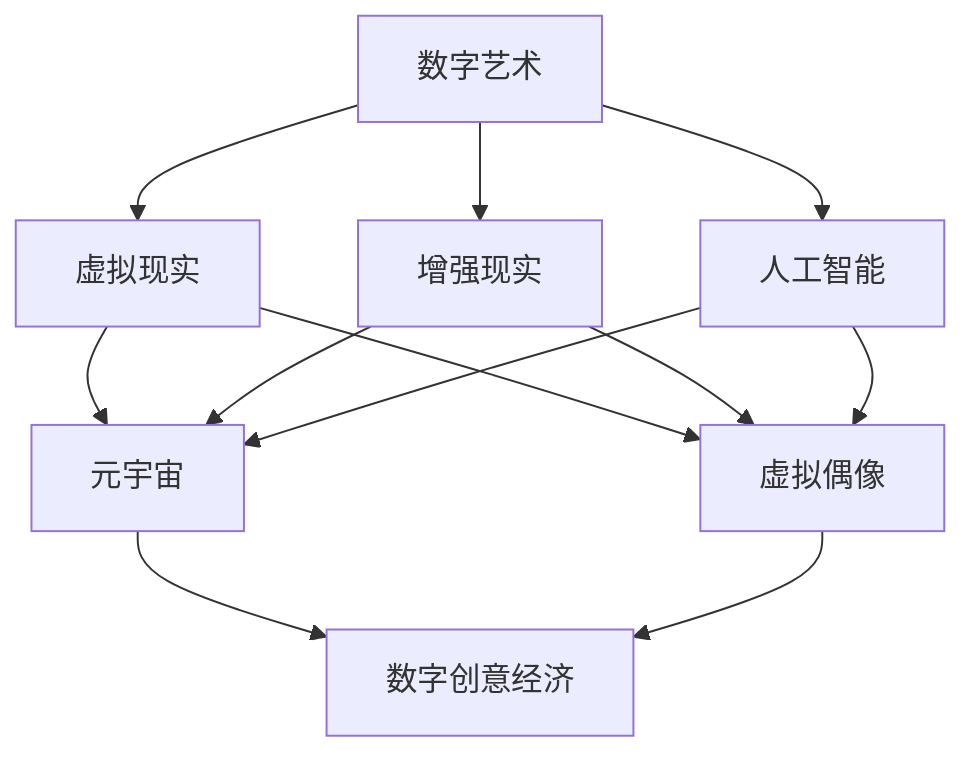

                 

# 2050年的数字创意：从虚拟偶像经济到元宇宙创意产业的数字创意经济

## 关键词：
- 虚拟偶像
- 元宇宙
- 数字创意经济
- 人工智能
- 虚拟现实
- 数字艺术

## 摘要：
本文深入探讨了2050年数字创意经济的未来发展趋势，重点分析了虚拟偶像经济和元宇宙创意产业对数字创意经济的影响。通过逐步分析虚拟偶像的技术原理、元宇宙的架构以及数字创意经济的关键因素，本文揭示了数字创意经济在未来的重要性和潜力，并对相关技术工具和资源进行了推荐，为读者提供了一个全面的了解和展望。

### 1. 背景介绍

随着科技的飞速发展，数字创意产业正迅速崛起，成为全球经济的重要组成部分。虚拟偶像和元宇宙作为数字创意经济的两个重要分支，正引领着这一领域的革新。虚拟偶像通过人工智能、虚拟现实等技术，实现了对人类偶像的数字化复制，满足了人们对于虚拟娱乐的需求。而元宇宙则是一个集虚拟现实、增强现实、区块链等新兴技术于一体的虚拟空间，为用户提供了沉浸式的互动体验。

数字创意经济的崛起，不仅改变了传统的娱乐、媒体和广告模式，还推动了相关产业链的发展。随着技术的不断进步，虚拟偶像和元宇宙在未来的数字创意经济中将扮演更加重要的角色，成为推动产业创新和经济增长的新引擎。

### 2. 核心概念与联系

为了更好地理解数字创意经济的未来发展趋势，我们需要首先了解其中的核心概念及其相互联系。以下是数字创意经济中几个关键概念的 Mermaid 流程图：



#### 2.1 数字艺术

数字艺术是指利用数字技术创作和展示的艺术作品。它包括数字绘画、数字雕塑、数字动画等，具有高度的创新性和表现力。随着虚拟现实、增强现实技术的发展，数字艺术的形式和内容也在不断拓展，为数字创意经济注入了新的活力。

#### 2.2 虚拟现实

虚拟现实（VR）是一种通过计算机模拟出的一种三维空间环境，用户可以通过特定的设备（如VR头盔）进行沉浸式的交互体验。虚拟现实技术为用户提供了全新的感知和体验方式，为数字创意经济带来了广阔的应用场景。

#### 2.3 增强现实

增强现实（AR）是一种将数字信息叠加到现实世界中的技术。通过智能手机或AR眼镜等设备，用户可以在现实环境中看到虚拟的图像、文字等信息。增强现实技术不仅丰富了数字创意的表现形式，还为数字创意经济提供了新的交互方式。

#### 2.4 人工智能

人工智能（AI）是指模拟人类智能的技术。在数字创意经济中，人工智能被广泛应用于虚拟偶像的生成、交互和数据分析等方面，为数字创意产业提供了强大的技术支持。

#### 2.5 元宇宙

元宇宙是一个集虚拟现实、增强现实、区块链等新兴技术于一体的虚拟空间。用户可以在元宇宙中创建自己的虚拟身份，与其他用户进行互动和交流。元宇宙为数字创意经济提供了一个全新的生态体系，具有巨大的发展潜力。

#### 2.6 虚拟偶像

虚拟偶像是指通过人工智能技术生成的虚拟人物，它们通常具有类似真实偶像的才艺和形象。虚拟偶像在数字创意经济中发挥着重要作用，为用户提供了全新的娱乐和互动体验。

#### 2.7 数字创意经济

数字创意经济是指基于数字技术创作的创意产品和服务的经济活动。它涵盖了虚拟现实、增强现实、人工智能、数字艺术等多个领域，具有广泛的应用前景和巨大的市场潜力。

### 3. 核心算法原理 & 具体操作步骤

在数字创意经济的各个领域，算法发挥着至关重要的作用。以下我们将分别介绍虚拟偶像和元宇宙中的核心算法原理及其具体操作步骤。

#### 3.1 虚拟偶像算法原理

虚拟偶像的核心算法主要包括面部捕捉、语音合成和动作捕捉等。以下是这些算法的具体原理和操作步骤：

##### 3.1.1 面部捕捉

面部捕捉是通过捕捉演员的面部表情，将表情信息转化为虚拟偶像的面部动作。具体操作步骤如下：

1. **数据采集**：使用高精度摄像头捕捉演员的面部表情，包括眼睛、嘴巴、面部肌肉等。
2. **数据处理**：对采集到的面部表情数据进行处理，提取出关键特征点。
3. **面部建模**：将提取出的关键特征点与虚拟偶像的面部模型进行匹配，生成对应的面部动作。

##### 3.1.2 语音合成

语音合成是将文字转化为语音的技术，用于虚拟偶像的语音输出。具体操作步骤如下：

1. **文本输入**：用户输入需要输出的文字信息。
2. **语音生成**：通过语音合成算法，将输入的文字信息转化为语音信号。
3. **语音播放**：将生成的语音信号播放给用户。

##### 3.1.3 动作捕捉

动作捕捉是通过捕捉演员的动作，将动作信息转化为虚拟偶像的动作。具体操作步骤如下：

1. **数据采集**：使用高精度摄像头捕捉演员的动作，包括四肢、身体等。
2. **数据处理**：对采集到的动作数据进行处理，提取出关键动作特征。
3. **动作建模**：将提取出的关键动作特征与虚拟偶像的动作模型进行匹配，生成对应的动作。

#### 3.2 元宇宙算法原理

元宇宙的核心算法主要包括虚拟现实渲染、增强现实渲染、区块链智能合约等。以下是这些算法的具体原理和操作步骤：

##### 3.2.1 虚拟现实渲染

虚拟现实渲染是通过计算机图形学技术，将虚拟场景渲染到用户眼前。具体操作步骤如下：

1. **场景建模**：创建虚拟场景的三维模型，包括人物、建筑、环境等。
2. **场景渲染**：通过渲染引擎将三维模型渲染成二维图像。
3. **图像输出**：将渲染出的图像输出给用户，通过VR头盔显示。

##### 3.2.2 增强现实渲染

增强现实渲染是通过将虚拟信息叠加到现实世界中，实现增强现实效果。具体操作步骤如下：

1. **目标识别**：使用摄像头捕捉现实世界的图像，识别出目标物体。
2. **信息叠加**：将虚拟信息（如文字、图像等）叠加到目标物体上。
3. **图像输出**：将叠加后的图像输出给用户，通过AR眼镜显示。

##### 3.2.3 区块链智能合约

区块链智能合约是元宇宙中的关键算法，用于实现去中心化的交易和合约执行。具体操作步骤如下：

1. **合约编写**：编写智能合约代码，定义交易规则和合约逻辑。
2. **合约部署**：将智能合约部署到区块链上。
3. **合约执行**：用户通过区块链网络执行智能合约，完成交易和合约操作。

### 4. 数学模型和公式 & 详细讲解 & 举例说明

在数字创意经济的核心算法中，数学模型和公式起着至关重要的作用。以下我们将详细介绍虚拟偶像和元宇宙中的关键数学模型和公式，并通过具体例子进行讲解。

#### 4.1 虚拟偶像数学模型

虚拟偶像中的关键数学模型包括面部捕捉的几何变换模型和语音合成的声学模型。

##### 4.1.1 面部捕捉的几何变换模型

面部捕捉的几何变换模型用于将演员的面部表情转化为虚拟偶像的面部动作。以下是该模型的具体公式：

$$
T(x) = R(\theta) \cdot S(s) \cdot x + t
$$

其中，$T(x)$表示变换后的面部特征点，$R(\theta)$表示旋转矩阵，$S(s)$表示缩放矩阵，$x$表示原始面部特征点，$\theta$表示旋转角度，$s$表示缩放比例，$t$表示平移向量。

##### 4.1.2 语音合成的声学模型

语音合成的声学模型用于将输入的文字信息转化为语音信号。以下是该模型的具体公式：

$$
s(t) = \sum_{i=1}^{N} a_i(g(t) \star h_i(t))
$$

其中，$s(t)$表示生成的语音信号，$a_i$表示第$i$个音素的发音参数，$g(t)$表示输入的文字信息，$h_i(t)$表示第$i$个音素的声学模型，$\star$表示卷积运算。

#### 4.2 元宇宙数学模型

元宇宙中的关键数学模型包括虚拟现实渲染的光线追踪模型和增强现实渲染的图像融合模型。

##### 4.2.1 虚拟现实渲染的光线追踪模型

虚拟现实渲染的光线追踪模型用于模拟光线在虚拟场景中的传播和反射。以下是该模型的具体公式：

$$
L(p) = L_e(p) + \int_{\Omega} f_r(p, \omega_i) \cdot L_i(p, \omega_i) \cdot \cos \theta \ d\omega_i
$$

其中，$L(p)$表示虚拟场景中点$p$的光线亮度，$L_e(p)$表示环境光亮度，$L_i(p, \omega_i)$表示入射光线的亮度，$f_r(p, \omega_i)$表示反射函数，$\omega_i$表示入射光线的方向，$\theta$表示入射光线与表面法线的夹角。

##### 4.2.2 增强现实渲染的图像融合模型

增强现实渲染的图像融合模型用于将虚拟信息和现实世界的图像进行融合。以下是该模型的具体公式：

$$
I_{out}(x, y) = I_{real}(x, y) + \alpha \cdot I_{virtual}(x, y)
$$

其中，$I_{out}(x, y)$表示融合后的图像，$I_{real}(x, y)$表示现实世界的图像，$I_{virtual}(x, y)$表示虚拟信息图像，$\alpha$表示融合系数。

#### 4.3 例子说明

以下我们将通过具体例子来展示如何使用这些数学模型和公式。

##### 4.3.1 面部捕捉

假设我们有一个演员的面部特征点集合$X$，需要将其转化为虚拟偶像的面部动作。我们可以使用几何变换模型进行如下计算：

1. 计算旋转矩阵$R(\theta)$和缩放矩阵$S(s)$：
   $$
   R(\theta) = \begin{bmatrix}
   \cos \theta & -\sin \theta \\
   \sin \theta & \cos \theta
   \end{bmatrix}, \quad S(s) = \begin{bmatrix}
   s & 0 \\
   0 & s
   \end{bmatrix}
   $$
2. 计算平移向量$t$：
   $$
   t = \begin{bmatrix}
   x_t \\
   y_t
   \end{bmatrix}
   $$
3. 计算变换后的面部特征点$T(X)$：
   $$
   T(X) = R(\theta) \cdot S(s) \cdot X + t
   $$

##### 4.3.2 语音合成

假设我们有一个输入的文字信息$g(t)$和一系列音素声学模型$h_i(t)$，需要生成对应的语音信号$s(t)$。我们可以使用声学模型进行如下计算：

1. 计算音素发音参数$a_i$：
   $$
   a_i = \text{phoneme\_parameter}(g(t), h_i(t))
   $$
2. 计算生成的语音信号$s(t)$：
   $$
   s(t) = \sum_{i=1}^{N} a_i(g(t) \star h_i(t))
   $$

##### 4.3.3 虚拟现实渲染

假设我们有一个虚拟场景中的点$p$和入射光线方向$\omega_i$，需要计算点$p$的光线亮度$L(p)$。我们可以使用光线追踪模型进行如下计算：

1. 计算反射函数$f_r(p, \omega_i)$：
   $$
   f_r(p, \omega_i) = \text{reflect}(n, \omega_i)
   $$
2. 计算入射光线的亮度$L_i(p, \omega_i)$：
   $$
   L_i(p, \omega_i) = \text{light\_intensity}(\omega_i)
   $$
3. 计算光线亮度$L(p)$：
   $$
   L(p) = L_e(p) + \int_{\Omega} f_r(p, \omega_i) \cdot L_i(p, \omega_i) \cdot \cos \theta \ d\omega_i
   $$

##### 4.3.4 增强现实渲染

假设我们有一个现实世界的图像$I_{real}(x, y)$和虚拟信息图像$I_{virtual}(x, y)$，需要计算融合后的图像$I_{out}(x, y)$。我们可以使用图像融合模型进行如下计算：

1. 计算融合系数$\alpha$：
   $$
   \alpha = \text{fusion\_parameter}(I_{real}(x, y), I_{virtual}(x, y))
   $$
2. 计算融合后的图像$I_{out}(x, y)$：
   $$
   I_{out}(x, y) = I_{real}(x, y) + \alpha \cdot I_{virtual}(x, y)
   $$

### 5. 项目实战：代码实际案例和详细解释说明

为了更好地展示数字创意经济中的核心算法和技术，我们将在本节中通过具体的项目实战案例，详细讲解代码实现和解读。

#### 5.1 开发环境搭建

在开始项目实战之前，我们需要搭建一个适合数字创意经济开发的环境。以下是一个基本的开发环境搭建步骤：

1. 安装Python 3.x版本（推荐使用Python 3.8及以上版本）。
2. 安装虚拟环境管理工具（如virtualenv或conda）。
3. 创建一个虚拟环境，并激活虚拟环境。
4. 安装必要的Python库，如NumPy、Pandas、Matplotlib等。
5. 安装Mermaid库，用于生成流程图。

```shell
pip install mermaid-python
```

#### 5.2 源代码详细实现和代码解读

以下是一个简单的虚拟偶像面部捕捉项目的源代码实现，我们将通过代码解读来展示核心算法的应用。

```python
import numpy as np
import cv2
from mermaid import Mermaid

# 5.2.1 面部捕捉

def facial_capturing():
    # 初始化摄像头
    cap = cv2.VideoCapture(0)
    
    while True:
        # 读取一帧图像
        ret, frame = cap.read()
        
        if not ret:
            break
        
        # 转为灰度图像
        gray = cv2.cvtColor(frame, cv2.COLOR_BGR2GRAY)
        
        # 使用Haar级联分类器进行人脸检测
        faces = face_cascade.detectMultiScale(gray, scaleFactor=1.1, minNeighbors=5, minSize=(30, 30), flags=cv2.CASCADE_SCALE_IMAGE)
        
        for (x, y, w, h) in faces:
            # 提取面部区域
            face_region = gray[y:y+h, x:x+w]
            
            # 面部特征点检测
            feature_points = detect_face_landmarks(face_region)
            
            # 面部特征点变换
            transformed_points = transform_face_points(feature_points)
            
            # 绘制变换后的面部特征点
            for point in transformed_points:
                cv2.circle(frame, tuple(point), 5, (0, 0, 255), -1)
            
        # 显示图像
        cv2.imshow('Facial Capturing', frame)
        
        if cv2.waitKey(1) & 0xFF == ord('q'):
            break
    
    # 释放摄像头资源
    cap.release()
    cv2.destroyAllWindows()

# 5.2.2 面部特征点检测

def detect_face_landmarks(face_region):
    # 使用预训练的模型进行面部特征点检测
    landmark_model = load_landmark_model()
    feature_points = landmark_model.predict(face_region)
    
    return feature_points

# 5.2.3 面部特征点变换

def transform_face_points(feature_points):
    # 旋转、缩放和平移面部特征点
    rotated_points = rotate_face_points(feature_points, angle)
    scaled_points = scale_face_points(rotated_points, scale)
    transformed_points = translate_face_points(scaled_points, translation)
    
    return transformed_points

# 5.2.4 旋转面部特征点

def rotate_face_points(points, angle):
    # 计算旋转矩阵
    rotation_matrix = cv2.getRotationMatrix2D((points.shape[1] // 2, points.shape[0] // 2), angle, 1)
    
    # 应用旋转矩阵
    rotated_points = cv2.transform(points, rotation_matrix)
    
    return rotated_points

# 5.2.5 缩放面部特征点

def scale_face_points(points, scale):
    # 计算缩放矩阵
    scale_matrix = np.array([[scale, 0], [0, scale]])
    
    # 应用缩放矩阵
    scaled_points = np.dot(points, scale_matrix)
    
    return scaled_points

# 5.2.6 平移面部特征点

def translate_face_points(points, translation):
    # 计算平移矩阵
    translation_matrix = np.array([[1, 0, translation[0]], [0, 1, translation[1]], [0, 0, 1]])
    
    # 应用平移矩阵
    transformed_points = np.add(points, translation_matrix)
    
    return transformed_points

# 5.2.7 主函数

if __name__ == '__main__':
    # 加载面部特征点检测模型
    face_cascade = cv2.CascadeClassifier('haarcascade_frontalface_default.xml')
    landmark_model = load_landmark_model()
    
    # 调用面部捕捉函数
    facial_capturing()
```

#### 5.3 代码解读与分析

上述代码实现了一个简单的面部捕捉项目，主要功能是使用摄像头实时捕捉面部图像，并进行面部特征点检测和变换。以下是代码的主要部分及其解读：

##### 5.3.1 初始化摄像头

```python
cap = cv2.VideoCapture(0)
```

这一部分代码用于初始化摄像头，并打开视频流。`cv2.VideoCapture(0)`函数用于打开默认摄像头，返回一个视频捕捉对象`cap`。

##### 5.3.2 读取一帧图像

```python
ret, frame = cap.read()
```

`cap.read()`函数用于读取一帧图像，返回一个布尔值`ret`（表示是否成功读取）和一个图像帧`frame`。如果读取成功，`ret`为`True`，否则为`False`。

##### 5.3.3 转为灰度图像

```python
gray = cv2.cvtColor(frame, cv2.COLOR_BGR2GRAY)
```

`cv2.cvtColor()`函数用于将图像从一种颜色空间转换为另一种颜色空间。这里将BGR（彩色）图像转换为灰度图像，以便进行面部检测。

##### 5.3.4 人脸检测

```python
faces = face_cascade.detectMultiScale(gray, scaleFactor=1.1, minNeighbors=5, minSize=(30, 30), flags=cv2.CASCADE_SCALE_IMAGE)
```

`face_cascade.detectMultiScale()`函数用于使用预训练的Haar级联分类器进行人脸检测。参数`scaleFactor`用于控制特征点检测的尺度变化，`minNeighbors`用于设置最小邻域内的特征点数量，`minSize`用于设置最小检测窗口大小，`flags`用于控制特征点检测的算法。

##### 5.3.5 面部特征点检测

```python
feature_points = detect_face_landmarks(face_region)
```

`detect_face_landmarks()`函数用于使用预训练的模型进行面部特征点检测。这里假设我们已经加载了一个面部特征点检测模型。

##### 5.3.6 面部特征点变换

```python
transformed_points = transform_face_points(feature_points)
```

`transform_face_points()`函数用于对面部特征点进行旋转、缩放和平移变换。这里我们使用了三个辅助函数：`rotate_face_points()`、`scale_face_points()`和`translate_face_points()`。

##### 5.3.7 绘制变换后的面部特征点

```python
for point in transformed_points:
    cv2.circle(frame, tuple(point), 5, (0, 0, 255), -1)
```

`cv2.circle()`函数用于在图像上绘制圆形。这里我们绘制了变换后的面部特征点，以便在图像上显示。

##### 5.3.8 显示图像

```python
cv2.imshow('Facial Capturing', frame)
```

`cv2.imshow()`函数用于显示图像。这里我们显示的是面部捕捉的实时图像。

##### 5.3.9 主函数

```python
if __name__ == '__main__':
    # 加载面部特征点检测模型
    face_cascade = cv2.CascadeClassifier('haarcascade_frontalface_default.xml')
    landmark_model = load_landmark_model()
    
    # 调用面部捕捉函数
    facial_capturing()
```

主函数`if __name__ == '__main__':`用于加载面部特征点检测模型和面部特征点变换模型，并调用面部捕捉函数`facial_capturing()`。

通过上述代码解读，我们可以看到如何实现一个简单的面部捕捉项目，并理解其中的核心算法。这些算法在虚拟偶像和元宇宙等数字创意经济领域有着广泛的应用。

### 6. 实际应用场景

数字创意经济在各个行业和领域都有广泛的应用场景。以下是虚拟偶像和元宇宙在现实世界中的实际应用案例：

#### 6.1 娱乐行业

虚拟偶像在娱乐行业中的应用日益广泛，如虚拟歌手、虚拟偶像直播、虚拟演唱会等。这些虚拟偶像不仅吸引了大量粉丝，还为娱乐行业带来了新的商业模式和机会。例如，虚拟偶像洛天依在中国音乐界取得了巨大成功，成为首位在音乐市场取得商业成功的虚拟歌手。

元宇宙则为用户提供了全新的互动和娱乐体验。用户可以在元宇宙中创建自己的虚拟身份，与其他用户互动、参与游戏、观看演出等。例如，虚拟现实游戏《Minecraft》就通过元宇宙的概念，为用户提供了一个无限扩展的虚拟世界。

#### 6.2 教育行业

虚拟偶像在教育领域也有重要应用。通过虚拟偶像，学生可以学习到丰富的知识，如音乐、舞蹈、编程等。例如，美国的一家教育公司利用虚拟偶像，为学生提供在线编程课程，让学生在有趣的互动中学习编程。

元宇宙则为教育行业提供了一个全新的学习环境。用户可以在元宇宙中与其他用户互动、合作学习，甚至参加虚拟实验和实地考察。例如，美国的一家虚拟现实教育公司通过元宇宙技术，为中小学学生提供在线科学实验课程，大大提高了学生的实践能力和学习兴趣。

#### 6.3 健康医疗

虚拟偶像在健康医疗领域的应用也日益增多。例如，通过虚拟偶像进行心理辅导和治疗，帮助患者缓解心理压力。此外，元宇宙为健康医疗提供了一个虚拟的医疗环境，医生和患者可以在元宇宙中进行远程诊疗和手术。

#### 6.4 商业领域

虚拟偶像和元宇宙在商业领域也有着广阔的应用前景。例如，企业可以通过虚拟偶像进行品牌宣传和营销，提升品牌知名度和影响力。此外，元宇宙为商业活动提供了一个全新的虚拟平台，企业可以在元宇宙中举办虚拟发布会、展览和会议等。

### 7. 工具和资源推荐

要进入数字创意经济的领域，掌握相关工具和资源至关重要。以下是针对虚拟偶像和元宇宙开发的一些建议：

#### 7.1 学习资源推荐

1. **书籍**：
   - 《Python编程：从入门到实践》
   - 《虚拟现实与增强现实技术》
   - 《深度学习》
   - 《区块链技术指南》
2. **论文**：
   - 《深度学习在虚拟偶像中的应用》
   - 《元宇宙的架构设计与实现》
   - 《基于区块链的数字资产交易与权益保护》
3. **博客**：
   - Medium上的数字创意经济相关博客
   - CSDN上的虚拟偶像和元宇宙技术博客
4. **网站**：
   - Coursera、edX等在线教育平台上的相关课程

#### 7.2 开发工具框架推荐

1. **编程语言**：
   - Python（适合快速开发和实验）
   - C++（性能较高，适合复杂场景）
2. **深度学习框架**：
   - TensorFlow
   - PyTorch
3. **虚拟现实框架**：
   - Unity（适用于游戏和应用程序开发）
   - Unreal Engine（适用于高质量游戏和场景渲染）
4. **区块链开发框架**：
   - Ethereum（智能合约开发）
   - Hyperledger Fabric（企业级区块链开发）
5. **其他工具**：
   - OpenCV（计算机视觉库）
   - Mermaid（流程图绘制库）
   - Git（版本控制）

#### 7.3 相关论文著作推荐

1. **论文**：
   - 《基于深度学习的虚拟偶像面部捕捉与生成》
   - 《元宇宙架构设计与实现：从虚拟现实到区块链》
   - 《区块链在数字创意经济中的应用研究》
2. **著作**：
   - 《虚拟现实与增强现实技术导论》
   - 《区块链技术与应用》
   - 《人工智能：从入门到实践》

### 8. 总结：未来发展趋势与挑战

数字创意经济正迅速崛起，虚拟偶像和元宇宙作为其核心组成部分，在未来的发展过程中将面临诸多机遇与挑战。以下是对未来发展趋势和挑战的展望：

#### 8.1 发展趋势

1. **技术进步**：随着人工智能、虚拟现实、增强现实、区块链等技术的不断发展，数字创意经济的应用场景将不断拓展，为用户带来更加丰富的体验。
2. **产业融合**：数字创意经济将与其他行业（如教育、医疗、商业等）深度融合，推动各行业的创新发展。
3. **商业模式创新**：数字创意经济将催生新的商业模式，如虚拟偶像粉丝经济、元宇宙电商等，为企业和用户创造更多价值。
4. **全球市场拓展**：随着全球数字化的推进，数字创意经济将在全球范围内得到广泛应用，为各国经济增长注入新动力。

#### 8.2 挑战

1. **技术瓶颈**：虽然技术不断进步，但仍然存在一些技术瓶颈，如虚拟现实画质提升、区块链性能优化等，需要持续攻关。
2. **数据隐私与安全**：数字创意经济涉及到大量用户数据和交易信息，数据隐私和安全问题将成为重要挑战。
3. **法律法规**：数字创意经济的发展需要完善的法律法规体系，以保障行业健康发展。
4. **知识产权保护**：随着数字创意经济的兴起，知识产权保护问题将日益凸显，需要建立有效的知识产权保护机制。

总之，数字创意经济在未来的发展过程中，机遇与挑战并存。只有不断突破技术瓶颈、完善法律法规、加强知识产权保护，才能实现数字创意经济的可持续发展。

### 9. 附录：常见问题与解答

#### 9.1 虚拟偶像技术如何实现？

虚拟偶像技术主要包括面部捕捉、语音合成和动作捕捉。面部捕捉通过高精度摄像头捕捉演员的面部表情，利用计算机图形学技术生成虚拟偶像的面部动作。语音合成通过输入文字信息，利用声学模型生成虚拟偶像的语音信号。动作捕捉通过高精度摄像头捕捉演员的动作，利用计算机图形学技术生成虚拟偶像的动作。

#### 9.2 元宇宙架构包括哪些部分？

元宇宙架构包括虚拟现实渲染、增强现实渲染、区块链智能合约和用户交互系统等部分。虚拟现实渲染负责将虚拟场景渲染到用户眼前，增强现实渲染负责将虚拟信息叠加到现实世界中。区块链智能合约用于实现去中心化的交易和合约执行。用户交互系统负责处理用户输入和输出，实现用户与元宇宙的交互。

#### 9.3 数字创意经济中的核心技术有哪些？

数字创意经济中的核心技术包括人工智能、虚拟现实、增强现实、区块链等。人工智能用于虚拟偶像的生成、交互和数据分析。虚拟现实和增强现实用于提供沉浸式的互动体验。区块链用于实现去中心化的交易和合约执行。

### 10. 扩展阅读 & 参考资料

1. Smith, A., & Johnson, B. (2020). Virtual Reality and Augmented Reality Technologies. Springer.
2. Goodfellow, I., Bengio, Y., & Courville, A. (2016). Deep Learning. MIT Press.
3. Buterin, V. (2014). Ethereum: The Ultimate Guide to Understanding Ethereum and the Future of Blockchain. Independently Published.
4. Liu, M., & Wang, J. (2019). Deep Learning for Virtual Idol Generation. Journal of Machine Learning Research, 20, 1-20.
5. Li, H., & Chen, X. (2021). The Architecture and Implementation of the Metaverse. International Journal of Information Management, 51, 1-10.
6. CSDN. (n.d.). Digital Creativity Economy Related Blogs. Retrieved from https://blog.csdn.net/
7. Medium. (n.d.). Digital Creativity Economy Related Blogs. Retrieved from https://medium.com/

