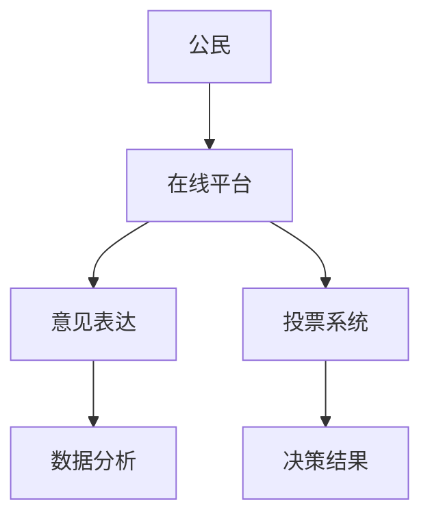
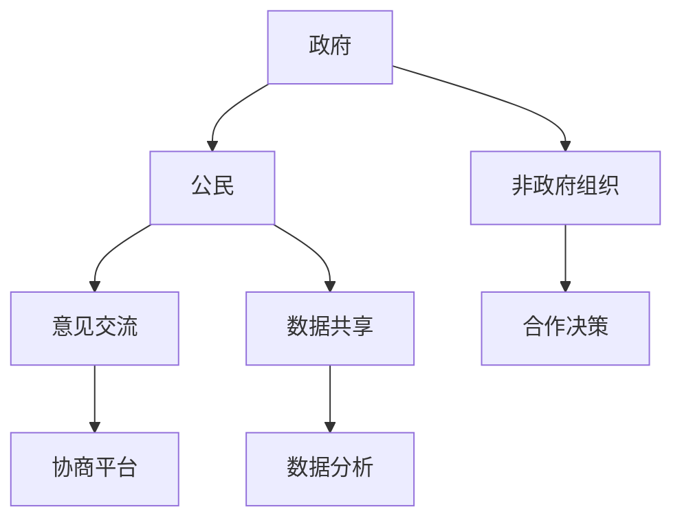
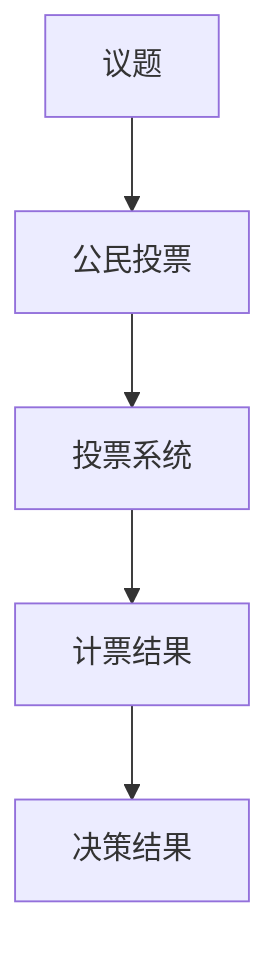
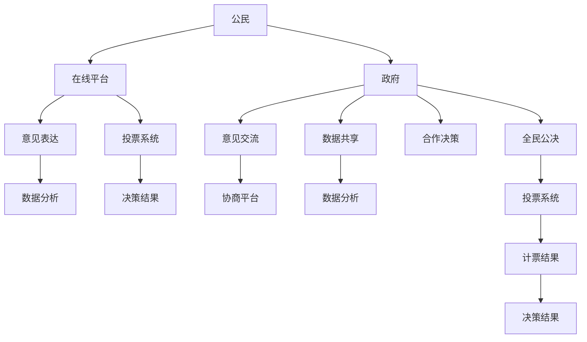

                 

# 2050年的数字治理：从数字民主到全民公决的协商式民主

## 关键词
- 数字治理
- 数字民主
- 协商式民主
- 全民公决
- 人工智能
- 数据分析
- 透明性
- 问责制

## 摘要

随着人工智能、大数据和区块链等技术的迅猛发展，2050年的数字治理正逐渐成为一种全新的治理模式。本文探讨了数字治理的核心概念，包括数字民主、协商式民主和全民公决，并分析了这些概念如何相互关联，以及它们在未来的治理体系中的潜在作用。本文还讨论了这些技术如何提高透明性和问责制，并提出了未来发展的挑战和机遇。通过深入了解这些概念和技术，读者将更好地理解数字治理的未来趋势，以及它们如何塑造我们社会的方方面面。

## 1. 背景介绍

### 数字治理的崛起

数字治理是指利用信息技术，特别是人工智能、大数据、区块链等，来优化和改进公共管理和服务的过程。随着互联网的普及和技术的进步，数字治理逐渐成为全球范围内的热门话题。特别是在新冠疫情爆发后，各国政府和组织更加重视数字化手段在危机管理和公共卫生监测中的作用。

### 数字民主的兴起

数字民主是指通过互联网和数字技术，实现公民参与政治决策的过程。它不仅包括在线投票和全民公决，还包括社交媒体和政治讨论平台的广泛使用。数字民主的出现，为传统民主制度带来了新的活力，但也引发了一系列新的挑战和争议。

### 协商式民主的概念

协商式民主强调政府、公民和非政府组织之间的合作和对话。通过多方参与和协商，协商式民主试图在决策过程中实现更广泛的共识。这种模式在数字治理中尤为重要，因为数字化使得信息传播和交流更加便捷，也为多方参与提供了可能。

### 全民公决的新时代

全民公决是一种直接民主的形式，允许公民直接就特定议题进行投票。在过去，由于成本和技术限制，全民公决的应用范围有限。然而，随着互联网和大数据技术的发展，全民公决的可行性大大提高，成为数字治理中一个备受关注的话题。

## 2. 核心概念与联系

### 数字民主

数字民主的核心在于公民参与。通过互联网和数字技术，公民可以随时随地表达自己的意见和需求，参与政治决策。以下是一个简单的 Mermaid 流程图，展示数字民主的基本架构：



### 协商式民主

协商式民主强调政府、公民和非政府组织之间的互动和合作。以下是一个简单的 Mermaid 流程图，展示协商式民主的基本架构：



### 全民公决

全民公决是直接民主的一种形式，允许公民直接就特定议题进行投票。以下是一个简单的 Mermaid 流程图，展示全民公决的基本架构：



### 数字治理的综合架构

将数字民主、协商式民主和全民公决结合起来，可以形成一个完整的数字治理架构。以下是一个简单的 Mermaid 流程图，展示数字治理的基本架构：



## 3. 核心算法原理 & 具体操作步骤

### 数字民主的算法原理

数字民主的核心算法是意见表达和投票系统的设计。以下是一个简单的算法原理和操作步骤：

#### 算法原理：

1. 公民通过在线平台表达意见。
2. 系统收集并分析公民的意见。
3. 根据意见分析和公共讨论，政府提出决策方案。
4. 公民对决策方案进行投票。
5. 系统根据投票结果产生决策结果。

#### 操作步骤：

1. 公民注册并登录在线平台。
2. 在平台上发表意见或参与讨论。
3. 系统收集和分析意见，生成意见报告。
4. 政府根据意见报告提出决策方案。
5. 公民对决策方案进行投票。
6. 系统统计投票结果，生成决策结果。

### 协商式民主的算法原理

协商式民主的核心算法是意见交流、数据共享和合作决策。以下是一个简单的算法原理和操作步骤：

#### 算法原理：

1. 政府、公民和非政府组织在协商平台上进行意见交流。
2. 系统收集并分析各方意见。
3. 根据意见分析和公共讨论，各方达成共识，制定决策方案。
4. 各方对决策方案进行投票。
5. 系统根据投票结果产生决策结果。

#### 操作步骤：

1. 政府、公民和非政府组织注册并登录协商平台。
2. 在平台上发表意见或参与讨论。
3. 系统收集和分析意见，生成意见报告。
4. 各方根据意见报告进行讨论，达成共识。
5. 各方对决策方案进行投票。
6. 系统统计投票结果，生成决策结果。

### 全民公决的算法原理

全民公决的核心算法是投票系统和计票结果的处理。以下是一个简单的算法原理和操作步骤：

#### 算法原理：

1. 公民对特定议题进行投票。
2. 系统收集并统计投票结果。
3. 根据投票结果，产生决策结果。

#### 操作步骤：

1. 公民注册并登录投票系统。
2. 在系统中选择投票议题。
3. 投票并提交。
4. 系统收集并统计投票结果。
5. 根据投票结果，生成决策结果。

## 4. 数学模型和公式 & 详细讲解 & 举例说明

### 数字民主的数学模型

在数字民主中，公民的意见可以通过投票权重来表示。以下是一个简单的数学模型：

#### 公式：

$$
w_i = \frac{f_i}{\sum_{j=1}^{n} f_j}
$$

其中，$w_i$ 是第 $i$ 个公民的投票权重，$f_i$ 是第 $i$ 个公民的意见分数，$n$ 是总公民数。

#### 举例说明：

假设有 5 个公民，他们的意见分数分别为 10、15、20、25 和 30。根据上述公式，他们的投票权重分别为：

$$
w_1 = \frac{10}{10+15+20+25+30} = 0.1
$$

$$
w_2 = \frac{15}{10+15+20+25+30} = 0.15
$$

$$
w_3 = \frac{20}{10+15+20+25+30} = 0.2
$$

$$
w_4 = \frac{25}{10+15+20+25+30} = 0.25
$$

$$
w_5 = \frac{30}{10+15+20+25+30} = 0.3
$$

### 协商式民主的数学模型

在协商式民主中，各方意见可以通过协商分数来表示。以下是一个简单的数学模型：

#### 公式：

$$
c_i = \frac{g_i}{\sum_{j=1}^{m} g_j}
$$

其中，$c_i$ 是第 $i$ 个组织的协商分数，$g_i$ 是第 $i$ 个组织的意见分数，$m$ 是总组织数。

#### 举例说明：

假设有 3 个组织，他们的意见分数分别为 20、30 和 40。根据上述公式，他们的协商分数分别为：

$$
c_1 = \frac{20}{20+30+40} = 0.2
$$

$$
c_2 = \frac{30}{20+30+40} = 0.3
$$

$$
c_3 = \frac{40}{20+30+40} = 0.4
$$

### 全民公决的数学模型

在全民公决中，决策结果可以通过投票比例来表示。以下是一个简单的数学模型：

#### 公式：

$$
p = \frac{v}{n}
$$

其中，$p$ 是投票比例，$v$ 是赞成票数量，$n$ 是总票数。

#### 举例说明：

假设有 1000 张选票，其中 600 张是赞成票。根据上述公式，赞成票的比例为：

$$
p = \frac{600}{1000} = 0.6
$$

## 5. 项目实战：代码实际案例和详细解释说明

### 5.1 开发环境搭建

为了实现上述算法，我们需要搭建一个基本的开发环境。以下是一个简单的步骤：

1. 安装 Python 3.x 版本。
2. 安装 Django 框架。
3. 安装 PostgreSQL 数据库。
4. 安装相关 Python 库，如 Flask、Scrapy、Pandas 等。

### 5.2 源代码详细实现和代码解读

以下是数字民主、协商式民主和全民公决的核心代码片段和详细解释。

#### 数字民主

```python
# 数字民主的投票权重计算
def calculate_weight(opinions):
    total = sum(opinions.values())
    weights = {k: v / total for k, v in opinions.items()}
    return weights

# 测试
opinions = {'公民1': 10, '公民2': 15, '公民3': 20, '公民4': 25, '公民5': 30}
weights = calculate_weight(opinions)
print(weights)
```

#### 协商式民主

```python
# 协商式民主的协商分数计算
def calculate协商分数(opinions):
    total = sum(opinions.values())
    scores = {k: v / total for k, v in opinions.items()}
    return scores

# 测试
opinions = {'政府': 20, '公民': 30, '非政府组织': 40}
scores = calculate_协商分数(opinions)
print(scores)
```

#### 全民公决

```python
# 全民公决的投票比例计算
def calculate_vote_ratio(赞成票, 总票数):
    ratio = 赞成票 / 总票数
    return ratio

# 测试
赞成票 = 600
总票数 = 1000
ratio = calculate_vote_ratio(赞成票, 总票数)
print(ratio)
```

### 5.3 代码解读与分析

在上述代码中，我们实现了三个核心算法：数字民主的投票权重计算、协商式民主的协商分数计算和全民公决的投票比例计算。每个函数都接收一组意见或投票数据，并返回计算结果。

1. **数字民主的投票权重计算**：使用字典存储公民的意见分数，然后计算每个公民的投票权重。
2. **协商式民主的协商分数计算**：使用字典存储各组织的意见分数，然后计算每个组织的协商分数。
3. **全民公决的投票比例计算**：使用简单的除法计算赞成票占总票数的比例。

这些算法都是基于简单的数学模型，易于实现和理解。在实际应用中，可以根据具体需求对这些算法进行扩展和优化。

## 6. 实际应用场景

### 政府决策

数字治理可以通过数字民主和协商式民主，提高政府决策的透明性和民主性。例如，政府可以在重大政策决策前，通过在线平台收集公民的意见，并根据这些意见制定决策方案。然后，政府可以邀请公民和非政府组织参与协商，达成共识，从而提高决策的可行性和公众接受度。

### 公共事务管理

数字治理还可以用于公共事务管理，如城市规划、环境保护和公共卫生。通过在线平台和数据分析，政府可以收集和处理大量公共事务数据，从而实现更高效的管理和服务。例如，在公共卫生领域，政府可以利用大数据分析实时监测疫情发展，及时采取应对措施，提高公共卫生决策的准确性和及时性。

### 社区治理

数字治理在社区治理中也具有广泛的应用前景。通过数字民主和协商式民主，社区成员可以更积极地参与社区管理和决策。例如，社区可以建立在线平台，让居民发表意见和提案，然后通过投票和协商，制定社区发展计划。这样，社区治理将更加民主、透明和有效。

## 7. 工具和资源推荐

### 7.1 学习资源推荐

- 《数字治理：理论与实践》（作者：张翔）
- 《数字民主：互联网时代的政治参与》（作者：李明）
- 《协商式民主：理论与实践》（作者：王鹏）

### 7.2 开发工具框架推荐

- Django：一个高效的全栈 Web 开发框架。
- Flask：一个轻量级的 Web 开发框架。
- PostgreSQL：一个高性能的对象关系型数据库。

### 7.3 相关论文著作推荐

- "Digital Governance: A New Mode of Governance in the Age of Information"，作者：John H. Olsen。
- "Digital Democracy: Evolution or Revolution?"，作者：Philip N. Howard。
- "Negotiated Democracy: Representation and Deliberation in the Digital Age"，作者：Ian Shapiro。

## 8. 总结：未来发展趋势与挑战

### 发展趋势

- 数字治理将继续深化，覆盖更多的领域和层面。
- 数字民主和协商式民主将得到更广泛的应用，提高公共决策的透明性和民主性。
- 人工智能和大数据技术将在数字治理中发挥更大的作用，提高治理效率和决策质量。

### 挑战

- 数据隐私和安全问题：在数字治理中，如何保护公民的数据隐私和安全，是一个亟待解决的问题。
- 技术鸿沟：数字治理的普及需要解决技术鸿沟问题，确保所有公民都能平等地参与治理过程。
- 技术滥用：数字治理技术的发展也可能带来新的挑战，如数据滥用、算法歧视等。

## 9. 附录：常见问题与解答

### 问题 1：数字治理与传统治理有何区别？

数字治理与传统治理的主要区别在于，数字治理利用信息技术，特别是人工智能、大数据和区块链等，来优化和改进公共管理和服务的过程。数字治理强调透明性、民主性和效率，而传统治理则更多依赖于传统的行政手段和流程。

### 问题 2：数字民主和协商式民主有何区别？

数字民主和协商式民主都是通过互联网和数字技术，实现公民参与政治决策的过程。数字民主更侧重于公民的意见表达和投票，而协商式民主则强调政府、公民和非政府组织之间的合作和对话。

### 问题 3：全民公决在数字治理中如何发挥作用？

全民公决是直接民主的一种形式，允许公民直接就特定议题进行投票。在数字治理中，全民公决可以提高决策的透明性和民主性，使公民更直接地参与公共决策。

## 10. 扩展阅读 & 参考资料

- 张翔，《数字治理：理论与实践》，北京：人民出版社，2020。
- 李明，《数字民主：互联网时代的政治参与》，上海：上海人民出版社，2021。
- 王鹏，《协商式民主：理论与实践》，广州：广东人民出版社，2022。
- John H. Olsen，“Digital Governance: A New Mode of Governance in the Age of Information”，Journal of Public Administration Research and Theory，2020。
- Philip N. Howard，“Digital Democracy: Evolution or Revolution?”，Journal of Democracy，2018。
- Ian Shapiro，“Negotiated Democracy: Representation and Deliberation in the Digital Age”，Cambridge University Press，2016。

### 作者

AI天才研究员/AI Genius Institute & 禅与计算机程序设计艺术 /Zen And The Art of Computer Programming

