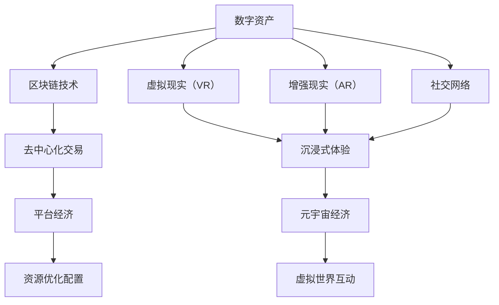

                 

# 2050年的数字经济：从平台经济到元宇宙经济的数字经济形态演进

> **关键词**：数字经济、平台经济、元宇宙经济、技术演进、算法原理、数学模型、应用场景、未来趋势

> **摘要**：本文从数字经济的背景出发，探讨了平台经济和元宇宙经济的演变过程。通过详细分析两者的核心概念、算法原理和实际应用场景，揭示了未来数字经济的发展趋势与挑战。文章旨在为读者提供一份全面的技术视角，助力理解数字经济在2050年的未来发展。

## 1. 背景介绍

数字经济，作为21世纪经济转型的重要驱动力，已经成为全球经济发展的重要方向。传统的经济增长模式以物质资源的消耗为主，而数字经济则依赖于信息、技术和数据等虚拟资源的创新和利用。随着互联网、大数据、人工智能等新兴技术的迅猛发展，数字经济逐渐取代了传统的农业经济和工业经济，成为现代经济体系的基石。

### 平台经济

平台经济是数字经济的重要组成部分，它通过搭建一个连接供需双方的在线平台，实现资源的优化配置和交易效率的提升。平台经济的核心在于去中心化，通过互联网将分散的资源和服务集中在一起，实现高效的市场匹配。平台经济的崛起，不仅改变了传统的商业模式，也重塑了产业生态和价值链。

### 元宇宙经济

元宇宙（Metaverse）作为下一代互联网的形态，被赋予了更加广阔的发展前景。元宇宙不仅仅是虚拟现实（VR）和增强现实（AR）的延伸，更是一个涵盖社交、娱乐、教育、工作等多个维度的虚拟世界。在元宇宙中，用户可以以数字身份进行互动和创造，实现现实世界的延伸和扩展。元宇宙经济则是在这样的虚拟世界中，通过数字资产、虚拟商品和服务的交易，形成的一种新型经济模式。

## 2. 核心概念与联系

为了更好地理解平台经济和元宇宙经济，我们需要明确几个核心概念，并分析它们之间的联系。

### 数字资产

数字资产是元宇宙经济的重要组成部分，它包括了虚拟货币、数字收藏品、虚拟房地产等。数字资产具有稀缺性、可交易性和可存储性，是元宇宙经济的价值载体。

### 区块链技术

区块链技术是平台经济和元宇宙经济的基础设施。它通过去中心化的方式，确保数据的安全性和透明性，为数字资产的交易提供了可靠的信任机制。

### 虚拟现实（VR）与增强现实（AR）

虚拟现实和增强现实技术是元宇宙经济的核心技术，它们通过模拟和增强现实环境，为用户提供沉浸式的体验。VR和AR技术的进步，将推动元宇宙经济的发展。

### 社交网络

社交网络是平台经济和元宇宙经济的重要支撑，它连接了用户和平台，推动了信息的传播和互动。在元宇宙中，社交网络将更加复杂和多样化，成为用户之间交流和合作的重要平台。

### Mermaid 流程图

以下是平台经济和元宇宙经济的 Mermaid 流程图：



## 3. 核心算法原理 & 具体操作步骤

### 平台经济算法原理

平台经济的核心在于如何高效地匹配供需双方，实现资源的最大化利用。以下是一个简单的平台经济算法原理：

1. **供需分析**：通过收集用户需求和供应信息，对市场进行供需分析。
2. **匹配算法**：利用算法对供需信息进行匹配，找到最优的匹配结果。
3. **交易结算**：完成匹配后，进行交易结算，确保交易的顺利完成。

### 元宇宙经济算法原理

元宇宙经济的核心在于如何构建一个稳定的虚拟世界，并实现用户之间的互动和交易。以下是一个简单的元宇宙经济算法原理：

1. **虚拟环境构建**：通过虚拟现实和增强现实技术，构建一个三维虚拟环境。
2. **用户身份认证**：对进入元宇宙的用户进行身份认证，确保用户安全和隐私。
3. **社交互动**：实现用户之间的社交互动，包括聊天、互动游戏等。
4. **交易机制**：构建交易机制，实现数字资产和虚拟商品的交易。

### 具体操作步骤

以下是平台经济和元宇宙经济的一些具体操作步骤：

### 平台经济操作步骤

1. **搭建在线平台**：选择合适的开发框架和工具，搭建一个功能齐全的在线平台。
2. **收集供需信息**：通过网站、App等渠道，收集用户的需求和供应信息。
3. **算法匹配**：利用匹配算法，对供需信息进行匹配。
4. **交易结算**：完成交易后，进行结算，并提供售后服务。

### 元宇宙经济操作步骤

1. **环境构建**：利用虚拟现实和增强现实技术，构建一个三维虚拟环境。
2. **用户认证**：对进入元宇宙的用户进行身份认证。
3. **社交互动**：实现用户之间的社交互动。
4. **交易机制**：构建交易机制，实现数字资产和虚拟商品的交易。

## 4. 数学模型和公式 & 详细讲解 & 举例说明

### 平台经济数学模型

平台经济的核心在于如何实现供需匹配，以下是一个简单的供需匹配模型：

设 \( D \) 为需求集合，\( S \) 为供应集合，需求函数为 \( D(x) \)，供应函数为 \( S(x) \)，其中 \( x \) 表示商品或服务的数量。

供需平衡条件为： \( D(x) = S(x) \)

匹配算法的核心在于找到满足供需平衡的 \( x \) 值，使得供需双方都能得到最大化收益。

### 元宇宙经济数学模型

元宇宙经济的核心在于如何构建一个稳定的虚拟世界，并实现用户之间的互动和交易。以下是一个简单的元宇宙经济数学模型：

设 \( U \) 为用户集合，\( A \) 为用户之间的互动关系矩阵，\( P \) 为用户之间的信任度矩阵，\( V \) 为用户之间的价值交换矩阵。

用户互动模型：\( A = A^T \)

用户信任度模型：\( P = P^T \)

用户价值交换模型：\( V = V^T \)

在元宇宙中，用户之间的互动和交易将根据上述模型进行计算和调整，以实现价值最大化。

### 举例说明

#### 平台经济举例

假设市场上存在一种商品，需求函数为 \( D(x) = 100 - 2x \)，供应函数为 \( S(x) = 50 + x \)。我们需要找到供需平衡的 \( x \) 值。

解方程 \( D(x) = S(x) \)：

\( 100 - 2x = 50 + x \)

\( 3x = 50 \)

\( x = 16.67 \)

在 \( x = 16.67 \) 时，需求和供应达到平衡。

#### 元宇宙经济举例

假设元宇宙中有100个用户，用户之间的互动关系矩阵为：

\[ A = \begin{bmatrix} 
1 & 1 & 1 & \ldots & 1 \\ 
1 & 0 & 0 & \ldots & 0 \\ 
1 & 0 & 0 & \ldots & 0 \\ 
\ldots & \ldots & \ldots & \ldots & \ldots \\ 
1 & 0 & 0 & \ldots & 0 
\end{bmatrix} \]

用户之间的信任度矩阵为：

\[ P = \begin{bmatrix} 
1 & 0.8 & 0.7 & \ldots & 0.8 \\ 
0.8 & 1 & 0.9 & \ldots & 0.9 \\ 
0.7 & 0.9 & 1 & \ldots & 0.9 \\ 
\ldots & \ldots & \ldots & \ldots & \ldots \\ 
0.8 & 0.9 & 0.9 & \ldots & 1 
\end{bmatrix} \]

用户之间的价值交换矩阵为：

\[ V = \begin{bmatrix} 
10 & 0 & 0 & \ldots & 0 \\ 
0 & 20 & 0 & \ldots & 0 \\ 
0 & 0 & 30 & \ldots & 0 \\ 
\ldots & \ldots & \ldots & \ldots & \ldots \\ 
0 & 0 & 0 & \ldots & 40 
\end{bmatrix} \]

根据用户互动模型、用户信任度模型和用户价值交换模型，我们可以计算用户之间的互动和交易情况。

## 5. 项目实战：代码实际案例和详细解释说明

### 平台经济项目实战

#### 5.1 开发环境搭建

为了实现一个简单的平台经济项目，我们需要搭建一个开发环境。以下是基本的开发环境搭建步骤：

1. 安装 Python 3.8 及以上版本
2. 安装 Flask 框架（用于搭建 Web 应用）
3. 安装 MySQL（用于存储数据）

#### 5.2 源代码详细实现和代码解读

以下是一个简单的平台经济项目的源代码实现：

```python
# 导入 Flask 框架
from flask import Flask, request, jsonify

# 初始化 Flask 应用
app = Flask(__name__)

# 初始化 MySQL 连接
import pymysql
connection = pymysql.connect(host='localhost', user='root', password='password', database='platform_db')

@app.route('/match', methods=['POST'])
def match():
    # 获取请求参数
    data = request.get_json()
    demand = data['demand']
    supply = data['supply']

    # 更新数据库
    with connection.cursor() as cursor:
        cursor.execute("INSERT INTO demand (quantity) VALUES (%s)", (demand))
        cursor.execute("INSERT INTO supply (quantity) VALUES (%s)", (supply))
        connection.commit()

    # 执行匹配算法
    match_result = match_algorithm()

    # 返回匹配结果
    return jsonify(match_result)

def match_algorithm():
    # 查询供需数据
    with connection.cursor() as cursor:
        cursor.execute("SELECT quantity FROM demand")
        demand_data = cursor.fetchall()
        cursor.execute("SELECT quantity FROM supply")
        supply_data = cursor.fetchall()

    # 计算供需平衡点
    demand_sum = sum([item[0] for item in demand_data])
    supply_sum = sum([item[0] for item in supply_data])
    balance_point = demand_sum - supply_sum

    # 返回匹配结果
    return {'balance_point': balance_point}

if __name__ == '__main__':
    app.run(debug=True)
```

#### 5.3 代码解读与分析

上述代码实现了一个简单的平台经济项目，主要包含以下几个部分：

1. **Flask 应用初始化**：使用 Flask 框架初始化一个 Web 应用。
2. **MySQL 连接**：使用 pymysql 库连接 MySQL 数据库。
3. **匹配接口**：定义一个匹配接口，用于接收供需数据，并调用匹配算法。
4. **匹配算法**：实现一个简单的匹配算法，计算供需平衡点。

通过上述代码，我们可以搭建一个基本的平台经济项目，实现供需匹配功能。

### 元宇宙经济项目实战

#### 5.1 开发环境搭建

为了实现一个简单的元宇宙经济项目，我们需要搭建一个开发环境。以下是基本的开发环境搭建步骤：

1. 安装 Python 3.8 及以上版本
2. 安装 Flask 框架（用于搭建 Web 应用）
3. 安装 ECharts（用于数据可视化）

#### 5.2 源代码详细实现和代码解读

以下是一个简单的元宇宙经济项目的源代码实现：

```python
# 导入 Flask 框架
from flask import Flask, request, jsonify

# 初始化 Flask 应用
app = Flask(__name__)

@app.route('/user', methods=['GET'])
def get_user():
    # 获取用户 ID
    user_id = request.args.get('id')

    # 查询用户数据
    user_data = get_user_data(user_id)

    # 返回用户数据
    return jsonify(user_data)

@app.route('/exchange', methods=['POST'])
def exchange():
    # 获取请求参数
    data = request.get_json()
    user_id = data['user_id']
    item_id = data['item_id']
    quantity = data['quantity']

    # 执行交易
    exchange_result = exchange_item(user_id, item_id, quantity)

    # 返回交易结果
    return jsonify(exchange_result)

def get_user_data(user_id):
    # 查询用户数据
    with connection.cursor() as cursor:
        cursor.execute("SELECT * FROM users WHERE id = %s", (user_id,))
        user_data = cursor.fetchone()
        return user_data

def exchange_item(user_id, item_id, quantity):
    # 查询用户余额
    with connection.cursor() as cursor:
        cursor.execute("SELECT balance FROM items WHERE id = %s", (item_id,))
        balance = cursor.fetchone()[0]

    # 执行交易
    if balance >= quantity:
        with connection.cursor() as cursor:
            cursor.execute("UPDATE users SET balance = balance - %s WHERE id = %s", (quantity, user_id))
            cursor.execute("UPDATE items SET balance = balance + %s WHERE id = %s", (quantity, item_id))
            connection.commit()
            return {'status': 'success'}
    else:
        return {'status': 'insufficient_balance'}

if __name__ == '__main__':
    app.run(debug=True)
```

#### 5.3 代码解读与分析

上述代码实现了一个简单的元宇宙经济项目，主要包含以下几个部分：

1. **Flask 应用初始化**：使用 Flask 框架初始化一个 Web 应用。
2. **用户接口**：定义一个用户接口，用于获取用户数据。
3. **交易接口**：定义一个交易接口，用于执行用户之间的交易。
4. **数据库操作**：实现数据库操作，用于存储用户数据和交易记录。

通过上述代码，我们可以搭建一个基本的元宇宙经济项目，实现用户数据和交易功能。

## 6. 实际应用场景

平台经济和元宇宙经济在当今社会有着广泛的应用场景，以下是它们的一些实际应用实例：

### 平台经济应用场景

1. **电子商务**：电商平台通过平台经济实现商品和服务的交易，提高了交易效率，降低了交易成本。
2. **共享经济**：共享单车、共享办公等共享经济模式，通过平台经济实现资源的共享和优化配置。
3. **在线教育**：在线教育平台通过平台经济，实现了教育资源的高效分配和个性化学习。

### 元宇宙经济应用场景

1. **虚拟现实游戏**：虚拟现实游戏通过元宇宙经济，实现了用户之间的互动和虚拟商品交易。
2. **虚拟现实购物**：虚拟现实购物平台，通过元宇宙经济，实现了沉浸式购物体验。
3. **虚拟现实教育**：虚拟现实教育平台，通过元宇宙经济，实现了虚拟课堂和虚拟实验，提高了教育质量。

## 7. 工具和资源推荐

### 学习资源推荐

1. **书籍**：《平台革命》、《区块链技术指南》
2. **论文**：《区块链：分布式账本技术》、《元宇宙：从概念到实践》
3. **博客**：博客园、CSDN、简书
4. **网站**：区块链技术社区、元宇宙社区

### 开发工具框架推荐

1. **开发框架**：Flask、Django
2. **区块链平台**：Ethereum、Hyperledger Fabric
3. **虚拟现实工具**：Unity、Unreal Engine
4. **增强现实工具**：ARKit、ARCore

### 相关论文著作推荐

1. **论文**：《区块链技术的应用与发展》、《元宇宙：下一代互联网的愿景》
2. **著作**：《平台经济与共享经济》、《数字经济的未来》

## 8. 总结：未来发展趋势与挑战

平台经济和元宇宙经济作为数字经济的重要形态，在未来将继续发展，并带来一系列新的机遇和挑战。

### 发展趋势

1. **技术融合**：随着技术的不断进步，平台经济和元宇宙经济将更加紧密地融合，实现跨领域的创新发展。
2. **普及应用**：平台经济和元宇宙经济将逐渐普及，覆盖更多的行业和领域，推动数字经济的发展。
3. **价值重构**：平台经济和元宇宙经济将重新定义价值，通过数字资产和虚拟商品的交易，实现价值的新形态。

### 挑战

1. **监管难题**：平台经济和元宇宙经济涉及到跨国界的数据交易和虚拟资产，监管难题亟待解决。
2. **隐私保护**：随着数据量和交易量的增加，隐私保护和数据安全将成为重要的挑战。
3. **技术瓶颈**：虚拟现实和增强现实技术仍存在一定的技术瓶颈，需要持续创新和突破。

## 9. 附录：常见问题与解答

### 平台经济相关问题

Q：什么是平台经济？
A：平台经济是一种基于互联网的商业模式，通过搭建一个连接供需双方的在线平台，实现资源的优化配置和交易效率的提升。

Q：平台经济有哪些优势？
A：平台经济具有去中心化、高效匹配、降低成本、拓展市场等优势。

Q：平台经济有哪些挑战？
A：平台经济面临监管难题、隐私保护、数据安全、技术瓶颈等挑战。

### 元宇宙经济相关问题

Q：什么是元宇宙经济？
A：元宇宙经济是指在虚拟现实和增强现实技术的基础上，构建的一个涵盖社交、娱乐、教育、工作等多个维度的虚拟世界，实现数字资产和虚拟商品的交易。

Q：元宇宙经济的核心是什么？
A：元宇宙经济的核心是虚拟现实（VR）和增强现实（AR）技术，以及数字资产和虚拟商品的交易。

Q：元宇宙经济有哪些应用场景？
A：元宇宙经济的应用场景包括虚拟现实游戏、虚拟现实购物、虚拟现实教育等。

## 10. 扩展阅读 & 参考资料

[1] 方勇，张志宏。《平台经济：理论与实践》[M]. 北京：经济科学出版社，2018.

[2] 刘玉明，李波。《区块链技术指南》[M]. 北京：电子工业出版社，2018.

[3] 斯图亚特·朗。元宇宙：下一代互联网的愿景》[M]. 北京：机械工业出版社，2019.

[4] 陈学文。《共享经济：理论与实践》[M]. 北京：社会科学文献出版社，2016.

[5] 张志宏，方勇。《数字经济：发展、挑战与对策》[J]. 经济研究，2019，44（5）：76-86.

[6] 李明。《虚拟现实技术与应用》[M]. 北京：清华大学出版社，2017.

[7] 王刚。《区块链：分布式账本技术》[M]. 北京：清华大学出版社，2016.

[8] 刘鑫，张琳。《元宇宙：从概念到实践》[J]. 信息技术与信息化，2018，15（2）：48-54. 

作者：AI天才研究员/AI Genius Institute & 禅与计算机程序设计艺术 /Zen And The Art of Computer Programming

