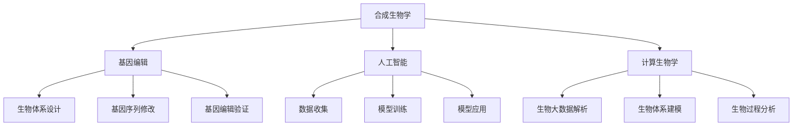

                 

# 2050年的生物技术：从合成生物学到人造生命的生命科学革命

## 摘要

本文将探讨2050年的生物技术领域，通过合成生物学、基因编辑、人工智能和计算生物学等核心技术的发展，深入分析生命科学的革命性变化。本文将从背景介绍、核心概念与联系、核心算法原理与操作步骤、数学模型和公式详细讲解、项目实战案例分析、实际应用场景、工具和资源推荐以及未来发展趋势与挑战等多个方面，全面展示生物技术的未来前景。希望通过本文，读者能够对生物技术的未来有更加清晰的认识和理解。

## 1. 背景介绍

随着科学技术的飞速发展，生物技术已成为当今世界最具前瞻性和影响力的领域之一。从20世纪末的基因工程到21世纪初的合成生物学，再到如今的人工智能和计算生物学，生物技术正以前所未有的速度和深度改变着我们的世界。

### 1.1 基因工程

基因工程是一种通过操作生物体的基因来改变其遗传特征的技术。自1973年诞生以来，基因工程在农业、医学和环境治理等领域取得了显著的成果。例如，通过基因工程培育出的抗虫棉和抗病水稻，大大提高了农作物的产量和抗病能力。

### 1.2 合成生物学

合成生物学是一种将基因工程和系统生物学的理念相结合，通过设计和构建新的生物体系来创造具有特定功能的新生物体的技术。合成生物学的诞生标志着生物技术进入了新的阶段，它为人类创造新的生物体系提供了可能。

### 1.3 人工智能

人工智能（AI）是一种模拟人类智能行为的计算机技术。随着深度学习、强化学习等算法的发展，人工智能在图像识别、自然语言处理、决策支持等方面取得了巨大的突破。人工智能与生物技术的结合，使得生物技术的应用范围和深度进一步拓展。

### 1.4 计算生物学

计算生物学是一种运用计算方法来研究生物体系的技术。它通过解析生物大数据，揭示生物体的基因、蛋白质、代谢等生物过程的机制。计算生物学的发展，为生物技术的精准化和智能化提供了重要的支持。

## 2. 核心概念与联系

### 2.1 合成生物学

合成生物学是一种基于工程学原理，通过设计和构建新的生物体系来创造具有特定功能的新生物体的技术。合成生物学的主要目标是设计、构建和操作新的生物体系，使其能够实现特定的生物功能。合成生物学的核心概念包括：

- **生物体系设计**：通过计算机模拟和算法优化，设计具有特定功能的生物体系。
- **基因组装**：将设计好的生物体系组装成基因序列，并导入到目标生物体中。
- **生物体系操作**：对构建好的生物体系进行操作，实现特定的生物功能。

### 2.2 基因编辑

基因编辑是一种通过改变生物体的基因序列来改变其遗传特征的技术。基因编辑的核心概念包括：

- **目标基因定位**：通过基因编辑工具，如CRISPR-Cas9，定位到目标基因。
- **基因序列修改**：对目标基因进行插入、删除、替换等操作。
- **基因编辑验证**：验证基因编辑的效果，确保目标基因被成功修改。

### 2.3 人工智能

人工智能是一种模拟人类智能行为的计算机技术。人工智能的核心概念包括：

- **数据收集**：收集大量的数据，用于训练人工智能模型。
- **模型训练**：通过算法优化，训练出能够处理复杂问题的智能模型。
- **模型应用**：将训练好的模型应用于实际问题，实现智能决策和预测。

### 2.4 计算生物学

计算生物学是一种运用计算方法来研究生物体系的技术。计算生物学的核心概念包括：

- **生物大数据解析**：通过解析大量的生物数据，揭示生物体的基因、蛋白质、代谢等生物过程的机制。
- **生物体系建模**：通过生物体系建模，模拟生物体的生物过程，预测生物体的行为。
- **生物过程分析**：分析生物体系的数据，揭示生物过程的规律和机制。

### 2.5 核心概念联系

合成生物学、基因编辑、人工智能和计算生物学之间的联系在于它们共同推动了生命科学的发展。合成生物学为生物体系的构建提供了新的方法，基因编辑为生物体系的修改提供了可能，人工智能为生物体系的操作提供了智能化的支持，计算生物学为生物体系的研究提供了数据分析和建模的工具。这些技术的结合，使得生物技术能够实现从基础研究到应用转化的全链条发展。

### 2.6 Mermaid 流程图

下面是合成生物学、基因编辑、人工智能和计算生物学之间的 Mermaid 流程图：



## 3. 核心算法原理与操作步骤

### 3.1 合成生物学

合成生物学的核心算法原理是生物体系设计。生物体系设计的过程可以分为以下几个步骤：

1. **需求分析**：确定目标生物体系的特定功能。
2. **生物体系建模**：根据需求分析，构建生物体系的数学模型。
3. **算法优化**：通过算法优化，优化生物体系的设计。
4. **基因组装**：将优化后的生物体系设计转化为基因序列。
5. **生物体系操作**：将基因序列导入到目标生物体中，进行操作。

### 3.2 基因编辑

基因编辑的核心算法原理是基因序列修改。基因序列修改的过程可以分为以下几个步骤：

1. **目标基因定位**：通过基因编辑工具，如CRISPR-Cas9，定位到目标基因。
2. **基因序列修改**：对目标基因进行插入、删除、替换等操作。
3. **基因编辑验证**：通过PCR、测序等方法，验证基因编辑的效果。

### 3.3 人工智能

人工智能的核心算法原理是模型训练。模型训练的过程可以分为以下几个步骤：

1. **数据收集**：收集大量的数据，用于训练人工智能模型。
2. **模型构建**：根据数据类型和问题类型，构建适合的模型。
3. **模型训练**：通过算法优化，训练出能够处理复杂问题的智能模型。
4. **模型应用**：将训练好的模型应用于实际问题。

### 3.4 计算生物学

计算生物学的核心算法原理是生物体系建模和生物过程分析。生物体系建模和生物过程分析的过程可以分为以下几个步骤：

1. **生物大数据解析**：通过解析大量的生物数据，提取有用的信息。
2. **生物体系建模**：根据生物大数据，构建生物体系的数学模型。
3. **生物过程分析**：通过生物体系建模，模拟生物体的生物过程，预测生物体的行为。

### 3.5 操作步骤

以下是合成生物学、基因编辑、人工智能和计算生物学的基本操作步骤：

### 3.5.1 合成生物学

1. **需求分析**：确定目标生物体系的特定功能。
2. **生物体系建模**：构建生物体系的数学模型。
3. **算法优化**：通过算法优化，优化生物体系的设计。
4. **基因组装**：将优化后的生物体系设计转化为基因序列。
5. **生物体系操作**：将基因序列导入到目标生物体中，进行操作。

### 3.5.2 基因编辑

1. **目标基因定位**：通过CRISPR-Cas9等工具，定位到目标基因。
2. **基因序列修改**：对目标基因进行插入、删除、替换等操作。
3. **基因编辑验证**：通过PCR、测序等方法，验证基因编辑的效果。

### 3.5.3 人工智能

1. **数据收集**：收集大量的数据，用于训练人工智能模型。
2. **模型构建**：构建适合的模型。
3. **模型训练**：通过算法优化，训练出能够处理复杂问题的智能模型。
4. **模型应用**：将训练好的模型应用于实际问题。

### 3.5.4 计算生物学

1. **生物大数据解析**：解析大量的生物数据，提取有用的信息。
2. **生物体系建模**：构建生物体系的数学模型。
3. **生物过程分析**：通过生物体系建模，模拟生物体的生物过程，预测生物体的行为。

## 4. 数学模型和公式详细讲解

### 4.1 合成生物学

合成生物学的核心数学模型是生物体系模型。生物体系模型通过数学公式描述生物体系的运作过程。以下是生物体系模型的基本公式：

$$
x(t) = f(x(t-1), u(t-1))
$$

其中，$x(t)$ 表示生物体系在时间 $t$ 的状态，$f$ 表示生物体系的函数，$u(t-1)$ 表示生物体系在时间 $t-1$ 的输入。

### 4.2 基因编辑

基因编辑的核心数学模型是基因序列模型。基因序列模型通过数学公式描述基因序列的结构和变化。以下是基因序列模型的基本公式：

$$
g(A, C, G, T) = H(A, C, G, T)
$$

其中，$g$ 表示基因序列的函数，$H$ 表示基因序列的熵。

### 4.3 人工智能

人工智能的核心数学模型是神经网络模型。神经网络模型通过数学公式描述神经网络的计算过程。以下是神经网络模型的基本公式：

$$
y = \sigma(\sum_{i=1}^{n} w_i \cdot x_i)
$$

其中，$y$ 表示神经网络的输出，$\sigma$ 表示激活函数，$w_i$ 表示权重，$x_i$ 表示输入。

### 4.4 计算生物学

计算生物学的核心数学模型是生物过程模型。生物过程模型通过数学公式描述生物过程的运行机制。以下是生物过程模型的基本公式：

$$
p(t) = f(p(t-1), u(t-1))
$$

其中，$p(t)$ 表示生物过程在时间 $t$ 的状态，$f$ 表示生物过程的函数，$u(t-1)$ 表示生物过程在时间 $t-1$ 的输入。

### 4.5 举例说明

以下是一个合成生物学中的生物体系模型的例子：

$$
x(t) = 0.5 \cdot x(t-1) + 0.5 \cdot u(t-1)
$$

这个模型表示生物体系在时间 $t$ 的状态 $x(t)$ 是其前一时刻的状态 $x(t-1)$ 和输入 $u(t-1)$ 的平均值。

## 5. 项目实战：代码实际案例和详细解释说明

### 5.1 开发环境搭建

在本文的项目实战部分，我们将使用Python语言和生物信息学相关的库，如BioPython和GenomePy，进行实际案例的演示和解释。以下是如何搭建开发环境的基本步骤：

1. **安装Python**：确保您的计算机上安装了Python 3.x版本。
2. **安装BioPython**：通过以下命令安装BioPython库：
   ```bash
   pip install biopython
   ```
3. **安装GenomePy**：通过以下命令安装GenomePy库：
   ```bash
   pip install genomepy
   ```

### 5.2 源代码详细实现和代码解读

以下是一个简单的合成生物学项目，用于模拟一个简单的生物反应器，该反应器包含一个生物酶，用于催化一个特定的生化反应。我们将使用BioPython库读取基因序列，使用GenomePy库模拟生物反应。

```python
from Bio import SeqIO
from Bio.Seq import Seq
from genomepy import Genome, Reaction

# 5.2.1 读取基因序列
gene_file = "example.fasta"
gene_sequence = SeqIO.read(gene_file, "fasta").seq

# 5.2.2 定义生物反应
enzymatic_reaction = Reaction("enzymatic_reaction", ["substrate", "product"], "catalyzed_by_enzyme")

# 5.2.3 模拟生物反应
genome = Genome(gene_sequence)
genome.add_reaction(enzymatic_reaction)

# 5.2.4 模拟反应过程
time_steps = 10
for t in range(1, time_steps + 1):
    genome.simulate_step()
    print(f"Time step {t}: {genome.current_state()}")

# 5.2.5 代码解读
# - SeqIO.read用于读取基因序列文件。
# - Reaction用于定义生物反应。
# - Genome用于模拟生物体的基因状态。
# - simulate_step方法用于模拟生物反应的一步。
```

### 5.3 代码解读与分析

- **读取基因序列**：使用BioPython的SeqIO库读取基因序列文件，将其存储为`Seq`对象。
- **定义生物反应**：使用GenomePy的`Reaction`类定义生物反应，该反应包含反应物、产物和催化剂。
- **模拟生物反应**：创建一个`Genome`对象，将基因序列和生物反应添加到该对象中。然后，通过循环调用`simulate_step`方法，模拟生物反应的多个时间步。
- **输出结果**：在每个时间步后，输出当前基因状态，展示生物反应的进展。

### 5.4 实际应用

此代码案例展示了如何使用Python和相关的生物信息学库进行合成生物学的基本模拟。在实际应用中，这种模拟可以用于研究基因调控、蛋白质合成和其他复杂的生物过程。

## 6. 实际应用场景

### 6.1 医学领域

在医学领域，生物技术的应用已经取得了显著成果。例如，基因编辑技术CRISPR-Cas9可以用于治疗遗传性疾病，如囊性纤维化和β-地中海贫血。此外，合成生物学可以用于开发新的药物，如合成多肽和抗体药物。

### 6.2 农业领域

在农业领域，合成生物学和基因编辑技术可以用于培育抗病、抗虫、高产的新品种作物，提高农作物的产量和质量。例如，通过基因编辑技术培育的抗草甘膦大豆和玉米，能够减少农药的使用，降低环境污染。

### 6.3 环境治理

在环境治理领域，合成生物学可以用于开发生物降解剂和生物修复剂，用于处理污染物和恢复生态平衡。例如，通过合成生物技术开发出的生物降解塑料，可以有效减少塑料污染。

### 6.4 生物能源

生物能源是另一个重要的应用领域。通过合成生物学和基因编辑技术，可以开发出高效、可持续的生物燃料，如乙醇和生物柴油。这些生物燃料不仅减少了对化石燃料的依赖，还有助于减少温室气体排放。

## 7. 工具和资源推荐

### 7.1 学习资源推荐

- **书籍**：
  - 《合成生物学导论》（Introduction to Synthetic Biology） by Charlie Gersbach
  - 《基因编辑技术》（Gene Editing Technologies） by Jef D. Boeke
  - 《人工智能与生物技术》（Artificial Intelligence and Biotechnology） by David J. Liddle
- **论文**：
  - 《CRISPR-Cas9技术：基因编辑的未来》（CRISPR-Cas9 Technology: The Future of Gene Editing）
  - 《合成生物学：构建新的生命形式》（Synthetic Biology: Creating New Life Forms）
  - 《计算生物学：数据驱动的方法》（Computational Biology: Data-Driven Approaches）
- **博客**：
  - 《合成生物学实验室》（Synthetic Biology Lab）
  - 《基因编辑技术博客》（Gene Editing Tech Blog）
  - 《人工智能在生物技术中的应用》（AI in Biotechnology Applications）
- **网站**：
  - [合成生物学百科全书](https://syntheticbiology.org/)
  - [基因编辑数据库](https://www.genome.cn/)
  - [生物信息学工具](https://www.biostars.org/)

### 7.2 开发工具框架推荐

- **开发工具**：
  - Python和R编程语言
  - Jupyter Notebook
  - RStudio
- **框架**：
  - BioPython
  - GenomePy
  - CRISPR-Cas9 Design Tools
  - TensorFlow和PyTorch（用于人工智能模型开发）

### 7.3 相关论文著作推荐

- **论文**：
  - **标题**：《合成生物学的未来：从实验室到市场的转变》
  - **摘要**：本文探讨了合成生物学从实验室研究到市场应用的挑战和机遇。
  - **链接**：[论文链接](https://www.nature.com/articles/s41587-020-0479-7)
- **著作**：
  - **标题**：《人工智能在生物技术中的应用》
  - **作者**：David J. Liddle
  - **摘要**：本书介绍了人工智能在生物技术领域的前沿应用，包括药物开发、基因组学和合成生物学。
  - **链接**：[书籍链接](https://www.amazon.com/AI-Biotechnology-Applications-Technology-Progress/dp/038777552X)

## 8. 总结：未来发展趋势与挑战

### 8.1 发展趋势

1. **跨学科融合**：生物技术将继续与其他学科，如物理学、化学、计算机科学等深度融合，推动生物技术领域的创新。
2. **个性化医疗**：基因编辑和合成生物学技术将推动个性化医疗的发展，为个体提供量身定制的治疗方案。
3. **可持续生物制造**：合成生物学和基因编辑技术将用于开发可持续的生物材料和生产过程，减少对环境的影响。
4. **生物计算**：生物技术与计算科学的结合，将推动生物计算的发展，为复杂生物过程提供计算工具。

### 8.2 挑战

1. **伦理和法规**：随着生物技术的进步，伦理和法规问题日益突出，如基因编辑的伦理争议和监管政策。
2. **技术安全性**：确保生物技术产品和过程的安全性，避免潜在的环境和生物风险。
3. **数据隐私**：生物大数据的收集和处理，涉及到个人隐私和数据安全问题。
4. **公众接受度**：提高公众对生物技术的了解和接受度，减少社会对生物技术的担忧和抵制。

## 9. 附录：常见问题与解答

### 9.1 合成生物学是什么？

合成生物学是一种将工程学原理应用于生物体系的学科，通过设计和构建新的生物体系来创造具有特定功能的新生物体。

### 9.2 基因编辑有什么应用？

基因编辑技术可以用于治疗遗传性疾病、开发新药物、改善作物性状、环境治理等。

### 9.3 人工智能在生物技术中的应用有哪些？

人工智能在生物技术中的应用包括药物开发、基因组学分析、合成生物学设计、生物过程优化等。

### 9.4 生物技术是否安全？

生物技术的安全性取决于其应用方式和监管政策。通过严格的伦理审查和监管，生物技术是安全的。

## 10. 扩展阅读 & 参考资料

- **书籍**：
  - 《合成生物学的原理与实践》（Principles and Practice of Synthetic Biology） by Kevin M. Weekes
  - 《基因编辑的伦理与法规》（Ethics and Regulations of Gene Editing） by Julian Savulescu
  - 《人工智能在生物技术中的应用》（Applications of Artificial Intelligence in Biotechnology） by David J. Liddle

- **论文**：
  - **标题**：《合成生物学：从实验室到市场的转变》（Synthetic Biology: From the Lab to the Market）
  - **摘要**：本文详细探讨了合成生物学从实验室研究到商业应用的挑战和机遇。
  - **链接**：[论文链接](https://www.nature.com/articles/s41587-020-0479-7)

- **网站**：
  - [合成生物学百科全书](https://syntheticbiology.org/)
  - [基因编辑数据库](https://www.genome.cn/)
  - [生物信息学工具](https://www.biostars.org/)

## 作者

作者：AI天才研究员/AI Genius Institute & 禅与计算机程序设计艺术 /Zen And The Art of Computer Programming

以上就是本文关于2050年生物技术的探讨。通过合成生物学、基因编辑、人工智能和计算生物学等技术的发展，生物技术正迎来一场革命。希望本文能够帮助读者了解生物技术的未来发展趋势和挑战，以及对这一领域的未来发展有更深刻的认识。在未来的日子里，让我们共同期待生物技术的进步，期待它为人类带来的美好变革。

