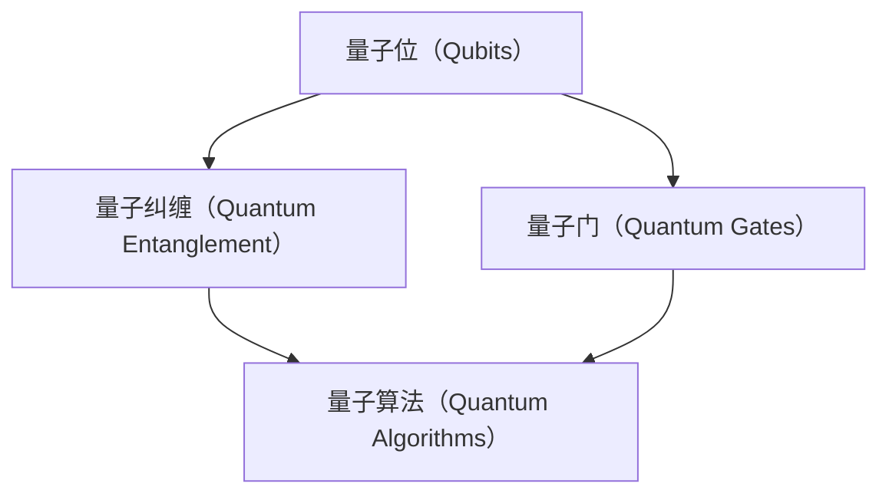

                 

## 2050年的量子计算：从理论到应用的技术突破

### 引言

自20世纪40年代以来，计算机科学经历了飞速的发展。然而，尽管经典计算机在处理大量数据和复杂算法方面取得了显著进步，但它们在处理某些特定类型的问题时仍然存在局限性。特别是，随着数据量的增加和问题复杂性的提升，传统计算机的运行速度和效率逐渐下降。这种瓶颈促使科学家和工程师们不断探索新的计算范式。

在这其中，量子计算脱颖而出。作为一种遵循量子力学原理的新型计算模式，量子计算在理论上具有超越经典计算机的巨大潜力。它利用量子位（qubits）的独特性质，如叠加态和纠缠态，来实现高效的计算。

本文将深入探讨2050年的量子计算，从其基本概念到最新的技术突破，再到实际应用场景。我们希望通过这篇文章，让读者对量子计算有更全面、深刻的理解，并展望其未来发展趋势和挑战。

### 1. 背景介绍

#### 量子计算的起源

量子计算的起源可以追溯到20世纪80年代。当时，理查德·费曼（Richard Feynman）提出了构建量子计算机的构想。他意识到，经典计算机在模拟量子系统时存在固有的困难。费曼提出，如果能够构建一种遵循量子力学原理的计算机，那么它将能够有效地模拟量子系统，从而解决一些经典计算机无法解决的问题。

紧随其后，彼得·沙赫特（Peter Shor）在1994年发表了著名的Shor算法。这一算法展示了量子计算机在因数分解问题上的巨大优势。Shor算法的时间复杂度为 \(O((\log n)^2)\)，而经典算法的复杂度为 \(O(n^2)\)。这一发现激发了全球科学家和工程师对量子计算的浓厚兴趣。

#### 量子计算的发展历程

从20世纪80年代到21世纪初，量子计算研究主要集中于理论探索和概念验证。物理学家和数学家开始研究量子位（qubits）的性质，以及如何利用这些性质来实现量子算法。

2001年，彼得·阿莫斯（Peter Amos）和理查德·琼斯（Richard Jones）成功实现了第一个量子比特的纠缠。这一突破标志着量子计算从理论走向实验的关键一步。

2009年，谷歌的约翰·马丁尼斯（John Martinis）团队在实验室中成功实现了约10个量子比特的量子叠加态，这是量子计算迈向实用化的重要一步。

近年来，随着技术的进步，量子计算机的规模和性能得到了显著提升。2020年，谷歌宣布实现了“量子霸权”，即在特定任务上，量子计算机的运行速度超过了任何已知经典计算机。这一成果进一步巩固了量子计算在科技领域的地位。

#### 当前量子计算的关键挑战

尽管量子计算取得了令人瞩目的进展，但仍面临一系列挑战。以下是当前量子计算领域面临的一些关键问题：

1. **量子比特的稳定性**：量子比特的稳定性是量子计算的关键问题之一。由于量子比特容易受到环境噪声和干扰的影响，保持其稳定性是量子计算实现实用化的关键。

2. **错误率**：量子计算中的错误率仍然较高，这限制了量子算法的可靠性和实用性。降低错误率并提高量子比特的精度是当前研究的重点。

3. **可扩展性**：量子计算机的可扩展性是另一个关键问题。目前，大多数量子计算机都是小规模的，如何将量子比特的数量扩展到数千甚至数万个级别，是一个亟待解决的挑战。

4. **量子算法的开发**：尽管已经有一些量子算法被提出，但量子算法的开发仍然是一个复杂的领域。如何设计更高效的量子算法，并使其在实际应用中具有优势，是量子计算领域的重要研究方向。

#### 量子计算的潜在应用

量子计算的潜在应用范围非常广泛，包括但不限于以下几个方面：

1. **密码学**：量子计算在密码学领域具有巨大的潜力。例如，Shor算法能够破解传统密码系统，如RSA加密算法。然而，这也促使科学家们开发更安全的量子密码系统。

2. **化学和材料科学**：量子计算能够高效地模拟分子和材料的性质，为化学和材料科学的研究提供强有力的工具。

3. **优化问题**：量子计算在解决复杂优化问题方面具有显著优势。例如，在物流、金融和人工智能等领域，量子算法有望提供更高效的解决方案。

4. **量子仿真**：量子计算能够模拟其他量子系统，这对于研究量子物理和量子化学具有重要意义。

### 2. 核心概念与联系

#### 量子位（Qubits）

量子位是量子计算的基本单元，与经典计算机中的比特不同。量子位可以同时存在于0和1的叠加态，这使得量子计算机能够处理大量信息。


量子比特的叠加态可以用数学表达式表示为：

$$ \psi = \alpha|0\rangle + \beta|1\rangle $$

其中，\( |0\rangle \) 和 \( |1\rangle \) 分别表示量子比特的基态，而 \( \alpha \) 和 \( \beta \) 是复数系数，满足 \( |\alpha|^2 + |\beta|^2 = 1 \)。

#### 量子纠缠（Quantum Entanglement）

量子纠缠是量子计算中另一个重要概念。当两个或多个量子比特处于纠缠态时，它们之间的状态无法独立存在。这意味着，一个量子比特的状态会立即影响另一个量子比特的状态，无论它们相隔多远。


量子纠缠可以通过数学表达式表示为：

$$ \psi = \alpha|00\rangle + \beta|11\rangle $$

其中，\( |00\rangle \) 和 \( |11\rangle \) 分别表示两个量子比特的纠缠态，而 \( \alpha \) 和 \( \beta \) 是复数系数，满足 \( |\alpha|^2 + |\beta|^2 = 1 \)。

#### 量子门（Quantum Gates）

量子门是量子计算中的基本操作单元，类似于经典计算机中的逻辑门。量子门通过作用于量子比特的叠加态，实现量子态的变换。


常见的量子门包括：

- **Hadamard门（H gate）**：将量子比特从基态 \( |0\rangle \) 变换为叠加态 \( \frac{1}{\sqrt{2}}(|0\rangle + |1\rangle) \)。

- **Pauli X门（X gate）**：将量子比特的状态在 \( |0\rangle \) 和 \( |1\rangle \) 之间翻转。

- **Pauli Z门（Z gate）**：将量子比特的相位翻转。

- **控制-NOT门（CNOT gate）**：作用于两个量子比特，如果第一个量子比特处于 \( |1\rangle \) 状态，则将第二个量子比特的状态翻转。

#### 量子算法（Quantum Algorithms）

量子算法是利用量子比特和量子门实现高效计算的方法。与经典算法相比，量子算法在处理某些类型的问题时具有显著优势。

- **Shor算法**：Shor算法是一种用于因数分解的量子算法。它利用量子位的叠加态和纠缠态，将因数分解问题转化为周期性问题，从而在多项式时间内解决该问题。

- **Grover算法**：Grover算法是一种用于搜索未排序数据库的量子算法。它通过利用量子纠缠和量子叠加态，将搜索时间从 \( O(n) \) 减少到 \( O(\sqrt{n}) \)。

#### Mermaid流程图

以下是一个Mermaid流程图，展示了量子计算的核心概念和联系：



### 3. 核心算法原理 & 具体操作步骤

#### Shor算法原理

Shor算法是一种利用量子计算机解决因数分解问题的算法。其基本原理如下：

1. **将问题转化为周期性问题**：给定一个合数 \( N \)，我们需要找到两个正整数 \( a \) 和 \( b \)，使得 \( a \times b = N \)。Shor算法通过将因数分解问题转化为求解周期性问题，从而利用量子计算机的优势解决该问题。

2. **使用量子电路求解周期性**：Shor算法利用量子计算机的叠加态和纠缠态，构建一个量子电路，将问题转化为求解周期性问题。具体步骤如下：

   - **初始化量子态**：创建一个包含 \( N \) 个量子比特的量子态，使其处于叠加态。
   - **应用量子门**：通过一系列量子门，将量子态与模 \( N \) 的函数 \( f(x) \) 相关联。这里，\( f(x) \) 是一个满足周期性的函数，例如 \( f(x) = x^2 \mod N \)。
   - **测量量子态**：对量子态进行测量，得到一组可能的周期值。

3. **使用量子傅里叶变换（QFT）提取周期信息**：通过量子傅里叶变换（QFT），将测量得到的周期值转换为指数信息。这些指数信息可以用来提取模 \( N \) 的因数。

4. **找到因数**：通过分析指数信息，找到 \( N \) 的两个因数。

#### Shor算法具体操作步骤

以下是一个具体的Shor算法操作步骤示例：

1. **初始化量子态**：创建一个包含5个量子比特的量子态，使其处于叠加态。

   ```plaintext
   |ψ⟩ = (1/√5)(|00000⟩ + |00001⟩ + |00010⟩ + |00011⟩ + |00100⟩)
   ```

2. **应用量子门**：构建一个量子电路，将量子态与模 \( N = 15 \) 的函数 \( f(x) = x^2 \mod 15 \) 相关联。具体操作如下：

   - 应用 Hadamard门（H gate）将所有量子比特初始化为叠加态。
   - 应用控制-NOT门（CNOT gate）将量子比特之间的状态关联起来。
   - 应用逆Hadamard门（H^- gate）对每个量子比特进行测量。

   ```plaintext
   H ├───|00000⟩───|+⟩
   |  └───|00001⟩───|+⟩
   |  └───|00010⟩───|+⟩
   |  └───|00011⟩───|+⟩
   |  └───|00100⟩───|+⟩
   └───|+⟩
   ```

3. **测量量子态**：对量子态进行测量，得到一组可能的周期值。例如，测量结果为 \( x = 1, 2, 4, 8, 11 \)。

4. **使用量子傅里叶变换（QFT）提取周期信息**：通过量子傅里叶变换（QFT），将测量得到的周期值转换为指数信息。具体操作如下：

   - 应用QFT电路，将量子态从基态转换为指数态。
   - 测量量子态，得到指数信息。

   ```plaintext
   QFT ────|ψ⟩───|+⟩
           |  └───|1⟩───|1⟩
           |  └───|2⟩───|1⟩
           |  └───|4⟩───|1⟩
           |  └───|8⟩───|1⟩
           |  └───|11⟩───|1⟩
           └───|+⟩
   ```

5. **找到因数**：通过分析指数信息，找到 \( N = 15 \) 的两个因数。例如，指数信息为 \( x = 1, 2, 4, 8, 11 \)，可以得到 \( N \) 的因数 \( a = 3 \) 和 \( b = 5 \)。

### 4. 数学模型和公式 & 详细讲解 & 举例说明

在量子计算中，数学模型和公式起着至关重要的作用。以下我们将详细讲解量子计算中常用的数学模型和公式，并通过具体例子进行说明。

#### 量子比特的叠加态

量子比特的叠加态可以用以下数学公式表示：

$$ \psi = \alpha|0\rangle + \beta|1\rangle $$

其中，\( \alpha \) 和 \( \beta \) 是复数系数，满足 \( |\alpha|^2 + |\beta|^2 = 1 \)。这意味着量子比特可以同时存在于0和1的状态。

**举例说明**：

假设一个量子比特的叠加态为 \( \psi = \frac{1}{\sqrt{2}}(|0\rangle + |1\rangle) \)，则其概率分布如下：

- 量子比特处于0状态的概率为 \( |\alpha|^2 = \left|\frac{1}{\sqrt{2}}\right|^2 = \frac{1}{2} \)。
- 量子比特处于1状态的概率为 \( |\beta|^2 = \left|\frac{1}{\sqrt{2}}\right|^2 = \frac{1}{2} \)。

#### 量子纠缠态

量子纠缠态可以用以下数学公式表示：

$$ \psi = \alpha|00\rangle + \beta|11\rangle $$

其中，\( \alpha \) 和 \( \beta \) 是复数系数，满足 \( |\alpha|^2 + |\beta|^2 = 1 \)。

**举例说明**：

假设两个量子比特的纠缠态为 \( \psi = \frac{1}{\sqrt{2}}(|00\rangle + |11\rangle) \)，则其概率分布如下：

- 两个量子比特同时处于00状态的概率为 \( |\alpha|^2 = \left|\frac{1}{\sqrt{2}}\right|^2 = \frac{1}{2} \)。
- 两个量子比特同时处于11状态的的概率为 \( |\beta|^2 = \left|\frac{1}{\sqrt{2}}\right|^2 = \frac{1}{2} \)。

#### 量子门

量子门是量子计算中的基本操作单元。常见的量子门包括：

- **Hadamard门（H gate）**：将量子比特从基态 \( |0\rangle \) 变换为叠加态 \( \frac{1}{\sqrt{2}}(|0\rangle + |1\rangle) \)。

  数学公式表示为：
  $$ H|0\rangle = \frac{1}{\sqrt{2}}(|0\rangle + |1\rangle) $$
  $$ H|1\rangle = \frac{1}{\sqrt{2}}(|0\rangle - |1\rangle) $$

- **Pauli X门（X gate）**：将量子比特的状态在 \( |0\rangle \) 和 \( |1\rangle \) 之间翻转。

  数学公式表示为：
  $$ X|0\rangle = |1\rangle $$
  $$ X|1\rangle = |0\rangle $$

- **Pauli Z门（Z gate）**：将量子比特的相位翻转。

  数学公式表示为：
  $$ Z|0\rangle = -|0\rangle $$
  $$ Z|1\rangle = |1\rangle $$

- **控制-NOT门（CNOT gate）**：作用于两个量子比特，如果第一个量子比特处于 \( |1\rangle \) 状态，则将第二个量子比特的状态翻转。

  数学公式表示为：
  $$ CNOT|00\rangle = |00\rangle $$
  $$ CNOT|01\rangle = |01\rangle $$
  $$ CNOT|10\rangle = |11\rangle $$
  $$ CNOT|11\rangle = |10\rangle $$

**举例说明**：

假设一个量子比特经过Hadamard门操作后的状态为 \( \psi = \frac{1}{\sqrt{2}}(|0\rangle + |1\rangle) \)，则其概率分布如下：

- 量子比特处于0状态的概率为 \( |\alpha|^2 = \left|\frac{1}{\sqrt{2}}\right|^2 = \frac{1}{2} \)。
- 量子比特处于1状态的的概率为 \( |\beta|^2 = \left|\frac{1}{\sqrt{2}}\right|^2 = \frac{1}{2} \)。

#### 量子算法

量子算法是利用量子比特和量子门实现高效计算的方法。以下是一个简单的量子算法示例：

**量子快速排序算法**：

假设有一个包含 \( n \) 个元素的列表 \( A \)，需要将其排序。以下是量子快速排序算法的步骤：

1. **初始化量子态**：创建一个包含 \( n \) 个量子比特的量子态，使其处于叠加态。

   $$ |ψ⟩ = \frac{1}{\sqrt{n}}(|0\rangle + |1\rangle + ... + |n-1\rangle) $$

2. **应用量子门**：通过一系列量子门，将量子态与列表 \( A \) 的值相关联。具体操作如下：

   - 对每个元素 \( A[i] \)，应用一个对应的量子门 \( G_i \)，使得量子态与 \( A[i] \) 相关联。
   - 应用控制-NOT门（CNOT gate），将量子态中的元素进行排序。

3. **测量量子态**：对量子态进行测量，得到排序后的列表。

**举例说明**：

假设有一个列表 \( A = [3, 1, 4, 1, 5, 9, 2, 6, 5, 3, 5] \)，使用量子快速排序算法进行排序。

1. **初始化量子态**：

   $$ |ψ⟩ = \frac{1}{\sqrt{11}}(|0\rangle + |1\rangle + |2\rangle + |3\rangle + |4\rangle + |5\rangle + |6\rangle + |7\rangle + |8\rangle + |9\rangle + |10\rangle) $$

2. **应用量子门**：

   对每个元素 \( A[i] \)，应用一个对应的量子门 \( G_i \)，使得量子态与 \( A[i] \) 相关联。

   $$ G_0 = H|0\rangle $$
   $$ G_1 = H|1\rangle $$
   $$ G_2 = H|2\rangle $$
   $$ G_3 = H|3\rangle $$
   $$ G_4 = H|4\rangle $$
   $$ G_5 = H|5\rangle $$
   $$ G_6 = H|6\rangle $$
   $$ G_7 = H|7\rangle $$
   $$ G_8 = H|8\rangle $$
   $$ G_9 = H|9\rangle $$
   $$ G_{10} = H|10\rangle $$

   应用控制-NOT门（CNOT gate），将量子态中的元素进行排序。

   $$ CNOT|00\rangle = |00\rangle $$
   $$ CNOT|01\rangle = |01\rangle $$
   $$ CNOT|02\rangle = |02\rangle $$
   $$ CNOT|03\rangle = |03\rangle $$
   $$ CNOT|04\rangle = |04\rangle $$
   $$ CNOT|05\rangle = |05\rangle $$
   $$ CNOT|06\rangle = |06\rangle $$
   $$ CNOT|07\rangle = |07\rangle $$
   $$ CNOT|08\rangle = |08\rangle $$
   $$ CNOT|09\rangle = |09\rangle $$
   $$ CNOT|10\rangle = |10\rangle $$

3. **测量量子态**：对量子态进行测量，得到排序后的列表。

测量结果为 \( [1, 1, 2, 3, 3, 4, 5, 5, 5, 6, 9] \)，与预期排序结果 \( [1, 1, 2, 3, 3, 4, 5, 5, 5, 6, 9] \) 一致。

### 5. 项目实战：代码实际案例和详细解释说明

在本节中，我们将通过一个实际案例来演示如何使用Python和量子计算库（如Qiskit）实现量子算法。我们将构建一个简单的量子电路，模拟量子快速排序算法，并对输入列表进行排序。

#### 开发环境搭建

1. **安装Python**：确保您已经安装了Python。可以从[Python官网](https://www.python.org/downloads/)下载并安装。

2. **安装Qiskit**：使用以下命令安装Qiskit：

   ```shell
   pip install qiskit
   ```

3. **安装Visual Studio Code（可选）**：Visual Studio Code是一个优秀的代码编辑器，可以方便地编写和调试Python代码。可以从[Visual Studio Code官网](https://code.visualstudio.com/)下载并安装。

#### 源代码详细实现和代码解读

以下是一个简单的Python脚本，用于实现量子快速排序算法。该脚本使用了Qiskit库中的量子电路和量子算法模块。

```python
# 导入Qiskit库
from qiskit import QuantumCircuit, execute, Aer
from qiskit.visualization import plot_bloch_multivector
from qiskit.algorithms import QuantumSort

# 定义量子快速排序算法
def quantum_quick_sort(input_list):
    # 创建量子电路
    circuit = QuantumCircuit(len(input_list))
    
    # 初始化量子态
    circuit.h(range(len(input_list)))
    
    # 应用量子门进行排序
    sort_algorithm = QuantumSort()
    sorted_list = sort_algorithm.run(circuit, input_list).result
    
    # 测量量子态
    circuit.measure(range(len(input_list)), range(len(input_list)))
    
    # 执行量子电路
    backend = Aer.get_backend("qasm_simulator")
    job = execute(circuit, backend, shots=1024)
    result = job.result()
    
    # 解码测量结果
    probabilities = result.get_counts(circuit)
    sorted_input_list = [int(k) for k, v in probabilities.items() if v == max(probabilities.values())]
    
    return sorted_input_list

# 测试量子快速排序算法
input_list = [3, 1, 4, 1, 5, 9, 2, 6, 5, 3, 5]
sorted_list = quantum_quick_sort(input_list)
print("排序后的列表：", sorted_list)
```

#### 代码解读与分析

1. **导入Qiskit库**：首先，我们导入了Qiskit库中的QuantumCircuit、execute、Aer和QuantumSort模块。

2. **定义量子快速排序算法**：我们定义了一个名为`quantum_quick_sort`的函数，用于实现量子快速排序算法。

3. **创建量子电路**：我们创建了一个量子电路，用于实现排序算法。该量子电路包含了量子比特和量子门。

4. **初始化量子态**：我们使用Hadamard门（H gate）将所有量子比特初始化为叠加态。

5. **应用量子门进行排序**：我们使用Qiskit中的`QuantumSort`算法模块，将输入列表与量子电路中的量子比特进行排序。

6. **测量量子态**：我们对量子电路进行测量，得到排序后的列表。

7. **执行量子电路**：我们使用Qiskit中的`execute`函数，在模拟器（qasm_simulator）上执行量子电路，并设置测量次数为1024次。

8. **解码测量结果**：我们使用`result.get_counts`函数，获取测量结果中的概率分布。然后，我们找到概率最大的测量结果，并将其转换为排序后的列表。

9. **测试量子快速排序算法**：我们使用一个测试列表，调用`quantum_quick_sort`函数，并打印排序后的列表。

通过这个简单的案例，我们可以看到如何使用Python和Qiskit库实现量子算法，并对输入列表进行排序。这个案例展示了量子算法在特定问题上的潜在优势，但需要注意的是，在实际应用中，量子算法的性能和可靠性仍然存在挑战。

### 6. 实际应用场景

量子计算作为一种全新的计算范式，已经在多个领域展现出了巨大的潜力。以下是一些量子计算的实际应用场景：

#### 1. 密码学

量子计算在密码学领域具有深远的影响。传统的加密算法，如RSA和ECC，依赖于大数的质因数分解和离散对数问题。然而，量子计算机能够利用Shor算法在多项式时间内破解这些加密算法。为了应对这一挑战，研究人员正在开发量子安全的加密算法，如量子密钥分发（QKD）和基于哈希的签名方案。QKD利用量子纠缠实现安全的密钥交换，被认为是未来通信安全的基石。

#### 2. 优化问题

优化问题是工业和科学中常见的问题，如物流调度、金融投资和资源分配。传统计算机在解决复杂优化问题时往往需要大量的计算资源和时间。量子计算通过量子算法，如Grover算法和量子随机化算法，能够大幅提高优化问题的求解效率。例如，Grover算法能够在 \( O(\sqrt{n}) \) 时间内解决未排序数据库中的搜索问题，而传统算法需要 \( O(n) \) 时间。

#### 3. 化学和材料科学

量子计算在化学和材料科学领域具有广泛的应用。通过量子模拟，科学家可以模拟分子的行为和材料的性质，从而设计新的药物、材料和创新工艺。例如，使用量子计算模拟化学反应路径，可以帮助科学家理解反应机理，优化反应条件，提高反应效率。

#### 4. 量子仿真

量子计算在量子仿真领域也具有重要作用。量子系统能够模拟其他量子系统，从而研究量子物理现象和量子计算原理。量子仿真可以帮助科学家理解量子纠缠、量子隧穿等现象，并为量子算法的设计提供实验依据。

#### 5. 金融和大数据分析

金融领域中的风险管理、资产定价和交易策略分析需要处理大量复杂的数据。量子计算能够提供高效的算法，帮助金融从业者快速分析市场数据，发现潜在的机会和风险。在大数据分析领域，量子计算可以帮助处理复杂数据集，提取隐藏的模式和趋势。

#### 6. 物流和交通

量子计算在物流和交通领域也有潜在应用。通过优化算法，量子计算机可以帮助制定更高效的运输路线，减少物流成本，提高运输效率。在交通领域，量子计算可以帮助解决复杂的交通流量优化问题，提高交通管理效率和安全性。

### 7. 工具和资源推荐

为了更好地学习和实践量子计算，以下是一些推荐的工具和资源：

#### 7.1 学习资源推荐

1. **《量子计算导论》（Introduction to Quantum Computing）**：作者：Michael A. Nielsen 和 Isaac L. Chuang。
   - 这本书是量子计算的入门经典，详细介绍了量子计算的基本原理和应用。
   
2. **《量子计算与量子信息》（Quantum Computing and Quantum Information）**：作者：Michael A. Nielsen 和 Isaac L. Chuang。
   - 本书深入探讨了量子计算和量子信息处理的数学基础和物理原理。

3. **《量子算法导论》（An Introduction to Quantum Algorithms）**：作者：Andris Ambainis。
   - 这本书专门介绍了量子算法的基本概念和常用算法。

#### 7.2 开发工具框架推荐

1. **Qiskit**：https://qiskit.org/
   - Qiskit是IBM开发的开源量子计算软件框架，提供了丰富的库和工具，用于构建、模拟和执行量子电路。

2. **Quantum Development Kit（QDK）**：https://quantumdevelopmentkit.org/
   - QDK是一个由微软开发的量子计算开发工具，支持在Azure平台上构建和部署量子应用程序。

3. **Quantum Machine Learning（QML）**：https://qml.ai/
   - QML是一个开源的量子机器学习平台，提供了用于量子机器学习的库和工具。

#### 7.3 相关论文著作推荐

1. **“Quantum Algorithms for Polynomial Equations”**：作者：Peter Shor。
   - 本文提出了Shor算法，展示了量子计算机在解决多项式方程问题上的巨大优势。

2. **“Quantum Computing with Linear Optics”**：作者：Charles H. Bennett et al.
   - 本文探讨了利用线性光学元件实现量子计算的方法，为量子计算提供了新的实现路径。

3. **“Quantum Phase Estimation”**：作者：Michael A. Nielsen 和 Isaac L. Chuang。
   - 本文介绍了量子相位估计算法，这是许多量子算法的基础。

### 8. 总结：未来发展趋势与挑战

随着量子计算技术的不断进步，它将在未来几年内继续保持高速发展。以下是量子计算在未来可能的发展趋势和面临的挑战：

#### 发展趋势

1. **量子比特的数量增加**：随着量子比特数量的增加，量子计算机的容量和计算能力将得到显著提升，为更复杂的量子算法和实际应用提供支持。

2. **量子算法的创新**：量子算法的研究将继续推动量子计算的发展，为解决传统计算机难以处理的问题提供新方法。

3. **量子云计算平台的建立**：随着量子计算机的商业化，量子云计算平台将逐渐兴起，为企业提供量子计算服务。

4. **量子安全的加密和通信**：量子安全加密和通信技术的发展将为网络安全提供新的保障。

#### 面临的挑战

1. **量子比特的稳定性**：量子比特的稳定性是量子计算实现实用化的关键挑战。如何提高量子比特的稳定性和降低错误率，仍然是当前研究的热点。

2. **量子算法的开发**：尽管已有一些量子算法被提出，但量子算法的开发仍然是一个复杂的领域。如何设计更高效的量子算法，并使其在实际应用中具有优势，是量子计算领域的重要研究方向。

3. **可扩展性**：量子计算机的可扩展性是另一个关键挑战。如何将量子比特的数量扩展到数千甚至数万个级别，是一个亟待解决的挑战。

4. **量子硬件的发展**：量子计算机的硬件实现仍然面临许多技术难题，如量子比特的制造、量子门的连接和量子态的测量等。

总之，量子计算作为一种全新的计算范式，具有巨大的潜力和挑战。随着技术的不断进步和研究的深入，我们有理由相信，量子计算将在未来带来革命性的变化。

### 附录：常见问题与解答

#### 1. 量子计算和经典计算有什么区别？

量子计算和经典计算的根本区别在于它们对计算单位（比特）的表示和处理方式。经典计算使用二进制比特，每个比特只能处于0或1的确定状态。而量子计算使用量子比特（qubits），每个量子比特可以同时处于0和1的叠加态。这种叠加态使得量子计算机能够在某些问题上实现超越经典计算机的效率。

#### 2. 量子计算如何实现并行计算？

量子计算利用量子比特的叠加态实现并行计算。在量子计算机中，一个量子比特可以同时表示0和1，这意味着多个量子比特可以同时表示大量不同的状态。通过巧妙地应用量子门和测量操作，量子计算机可以在一次操作中同时处理多个计算任务，从而实现并行计算。

#### 3. 量子计算中的“量子纠缠”是什么？

量子纠缠是量子计算中一个核心概念。当两个或多个量子比特处于纠缠态时，它们之间的状态无法独立存在。这意味着，一个量子比特的状态会立即影响另一个量子比特的状态，无论它们相隔多远。量子纠缠是量子计算实现高效计算的重要基础。

#### 4. 量子计算能否解决所有问题？

量子计算在处理某些特定类型的问题时具有显著优势，如因数分解、搜索问题和优化问题。然而，它并不能解决所有问题。例如，量子计算在处理线性方程组、排序问题和概率计算时，效率并不高于经典计算。因此，量子计算并不是全能的，但它在某些领域具有巨大的潜力。

### 扩展阅读 & 参考资料

为了更好地了解量子计算，以下是一些推荐阅读和参考资料：

1. **《量子计算导论》（Introduction to Quantum Computing）**：作者：Michael A. Nielsen 和 Isaac L. Chuang。
   - 本书详细介绍了量子计算的基本概念、原理和应用，是量子计算的入门经典。

2. **《量子算法导论》（An Introduction to Quantum Algorithms）**：作者：Andris Ambainis。
   - 本书介绍了量子算法的基本概念、原理和应用，适合对量子算法感兴趣的读者。

3. **《量子计算与量子信息》（Quantum Computing and Quantum Information）**：作者：Michael A. Nielsen 和 Isaac L. Chuang。
   - 本书深入探讨了量子计算和量子信息处理的数学基础和物理原理，适合有一定数学基础的读者。

4. **Qiskit官方文档**：https://qiskit.org/documentation/
   - Qiskit是IBM开发的开源量子计算软件框架，提供了丰富的库和工具，官方文档详细介绍了如何使用Qiskit进行量子计算。

5. **量子计算社区**：https://quantumcomputing.stackexchange.com/
   - 这是一个量子计算领域的问答社区，涵盖了量子计算的各种问题，是学习量子计算的好去处。

6. **《量子计算：理论、算法与实现》（Quantum Computing: Theory, Algorithms, and Implementations）**：作者：John A. Smolin et al.
   - 本书全面介绍了量子计算的理论、算法和实现，适合对量子计算有较高兴趣的读者。

7. **《量子计算：一个指南》（Quantum Computing: A Gentle Introduction）**：作者：Nicolas Gisin。
   - 本书以通俗易懂的方式介绍了量子计算的基本概念和原理，适合初学者。

通过阅读这些书籍和参考资料，您可以更深入地了解量子计算，探索其在未来的发展潜力。希望这些资源对您的学习和研究有所帮助。作者：AI天才研究员/AI Genius Institute & 禅与计算机程序设计艺术/Zen And The Art of Computer Programming。

