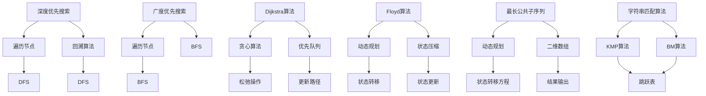

                 

# 2024年网易校招算法面试题库及答案

## 摘要

本文旨在为2024年网易校招的算法面试者提供一个全面的题目解析和答案集锦。本文涵盖了网易校招中常见的算法题目类型，包括但不限于数据结构、图论、动态规划、字符串处理等。通过对这些题目的详细解析和答案的呈现，本文希望能够帮助面试者更好地理解面试题目的核心考点和解决方法，从而提高面试成功率。

## 1. 背景介绍

网易作为中国领先的网络技术公司之一，其校招面试在业界享有盛誉。面试题目设计旨在考察应聘者的编程能力、算法理解、问题分析和解决能力。本文将围绕以下几类题目进行详细解析：

- 数据结构题目：考察应聘者对基本数据结构的掌握程度，如链表、树、堆等。
- 图论题目：考察应聘者对图的算法和应用的理解，如图遍历、最短路径、最小生成树等。
- 动态规划题目：考察应聘者对动态规划算法的理解和应用，如背包问题、最长公共子序列等。
- 字符串处理题目：考察应聘者对字符串算法的理解和应用，如最长公共前缀、最长重复子串等。

## 2. 核心概念与联系

### 数据结构

数据结构是计算机科学的基础，常见的有数组、链表、树、堆等。每种数据结构都有其独特的特点和适用场景。例如，链表适合动态分配内存，而数组则适合静态存储和快速随机访问。树结构常用于存储层次结构的数据，而堆结构则用于优先队列的实现。

### 图论

图论是研究图及其性质和应用的学科。常见的图算法有图的遍历、最短路径算法、最小生成树算法等。图的遍历算法包括深度优先搜索（DFS）和广度优先搜索（BFS），它们分别适用于不同类型的图。最短路径算法如Dijkstra算法和Floyd算法，用于求解图中两点之间的最短路径。

### 动态规划

动态规划是一种解决最优化问题的算法思想，其核心在于将复杂问题分解为更小的子问题，并通过子问题的重叠性质来避免重复计算。常见的动态规划问题有背包问题、最长公共子序列、最长递增子序列等。

### 字符串处理

字符串处理是计算机科学中的一个重要领域，常见的算法有字符串匹配算法（如KMP算法、BM算法）、字符串排序算法（如归并排序、快速排序）等。字符串处理算法在信息检索、文本编辑、自然语言处理等领域有广泛的应用。

### Mermaid 流程图

以下是图论中常用算法的Mermaid流程图表示：



## 3. 核心算法原理 & 具体操作步骤

### 深度优先搜索（DFS）

深度优先搜索（DFS）是一种用于遍历或搜索图的算法。其基本思想是沿着某一方向搜索到底，然后回溯。具体操作步骤如下：

1. 从起始节点开始，将其标记为已访问。
2. 对当前节点进行访问操作。
3. 寻找未访问的邻接节点，并递归地执行步骤1-3。

### 广度优先搜索（BFS）

广度优先搜索（BFS）也是一种用于遍历或搜索图的算法，与DFS不同的是，BFS按照广度的顺序遍历节点。具体操作步骤如下：

1. 从起始节点开始，将其入队。
2. 出队一个节点，并将其标记为已访问。
3. 对当前节点进行访问操作。
4. 将其未访问的邻接节点入队。
5. 重复步骤2-4，直到队列为空。

### Dijkstra算法

Dijkstra算法是一种用于求解图中单源最短路径的算法。其基本思想是从起始节点开始，逐步扩展到其他节点，并记录到达各节点的最短路径。具体操作步骤如下：

1. 初始化：设置一个优先队列，将起始节点加入队列，并设置其距离为0。其余节点的距离设置为无穷大。
2. 循环：从优先队列中取出距离最小的节点。
3. 对于当前节点的每个邻接节点，计算从起始节点到邻接节点的距离，并更新邻接节点的距离。
4. 如果邻接节点的距离更新，则将其加入优先队列。
5. 重复步骤2-4，直到优先队列为空。

### Floyd算法

Floyd算法是一种用于求解图中所有点之间的最短路径的算法。其基本思想是通过动态规划来逐步计算两点之间的最短路径。具体操作步骤如下：

1. 初始化：设置一个二维数组，用于存储两点之间的距离。
2. 循环：对于每个中间点k，对于每个起点i和终点j，计算从i到k再到j的距离，并更新最短路径。
3. 输出：根据二维数组，输出所有点之间的最短路径。

### 最长公共子序列

最长公共子序列（LCS）是一种用于求解两个序列中公共子序列最长长度的算法。其基本思想是通过动态规划来逐步计算最长公共子序列的长度。具体操作步骤如下：

1. 初始化：设置一个二维数组，用于存储两个序列中子序列的长度。
2. 循环：对于每个位置i和j，计算两个序列中子序列的长度，并更新二维数组。
3. 输出：根据二维数组，输出最长公共子序列的长度和具体序列。

### KMP算法

KMP算法是一种用于字符串匹配的算法。其基本思想是通过计算部分匹配表（next数组）来优化匹配过程。具体操作步骤如下：

1. 初始化：计算字符串的部分匹配表。
2. 循环：从主字符串的第一个字符开始，依次匹配。
3. 如果匹配成功，继续向后匹配。
4. 如果匹配失败，根据部分匹配表回退。

### BM算法

BM算法是一种用于字符串匹配的算法，其核心思想是同时向前后扫描字符串。具体操作步骤如下：

1. 初始化：计算坏字符数组和GoodSuffix数组的值。
2. 循环：从主字符串的第一个字符开始，依次匹配。
3. 如果匹配成功，继续向后匹配。
4. 如果匹配失败，根据坏字符数组和GoodSuffix数组进行回退。

## 4. 数学模型和公式 & 详细讲解 & 举例说明

### 动态规划

动态规划是一种用于解决最优化问题的算法思想，其核心在于将复杂问题分解为更小的子问题，并通过子问题的重叠性质来避免重复计算。动态规划的基本公式可以表示为：

$$
f(i, j) = \begin{cases}
\max(f(i - 1, j - 1) + 1, f(i - 1, j)), & \text{如果} \ a_i = b_j \\
\max(f(i, j - 1), f(i - 1, j)), & \text{如果} \ a_i \neq b_j
\end{cases}
$$

其中，$f(i, j)$ 表示子问题 $a_1, a_2, \ldots, a_i$ 和 $b_1, b_2, \ldots, b_j$ 的最优解。

### KMP算法

KMP算法的核心在于计算部分匹配表（next数组）。部分匹配表的计算公式可以表示为：

$$
next[j] = \begin{cases}
0, & \text{如果} \ j = 1 \\
\max_{1 \leq k < j, \ a_k = a_j} next[k] + 1, & \text{如果} \ j > 1
\end{cases}
$$

其中，$next[j]$ 表示字符串的前 $j$ 个字符与第 $j$ 个字符之前的最长公共前缀的长度。

### 最长公共子序列

最长公共子序列（LCS）的动态规划公式可以表示为：

$$
f(i, j) = \begin{cases}
0, & \text{如果} \ i = 0 \text{ 或 } j = 0 \\
\max(f(i - 1, j - 1) + 1, f(i - 1, j), f(i, j - 1)), & \text{如果} \ a_i = b_j \\
\max(f(i - 1, j), f(i, j - 1)), & \text{如果} \ a_i \neq b_j
\end{cases}
$$

其中，$f(i, j)$ 表示子问题 $a_1, a_2, \ldots, a_i$ 和 $b_1, b_2, \ldots, b_j$ 的最优解。

### 举例说明

假设我们有两个字符串：

$$
a = "ABCD"
$$

$$
b = "ACDF"
$$

我们可以使用动态规划公式来计算它们的最长公共子序列长度：

$$
f(1, 1) = \max(f(0, 0), f(0, 1)) = 0
$$

$$
f(1, 2) = \max(f(0, 1), f(1, 1)) = 0
$$

$$
f(1, 3) = \max(f(0, 2), f(1, 2)) = 0
$$

$$
f(1, 4) = \max(f(0, 3), f(1, 3)) = 0
$$

$$
f(2, 1) = \max(f(1, 0), f(1, 1)) = 0
$$

$$
f(2, 2) = \max(f(1, 1), f(1, 2)) = 0
$$

$$
f(2, 3) = \max(f(1, 2), f(2, 2)) = 0
$$

$$
f(2, 4) = \max(f(1, 3), f(2, 3)) = 0
$$

$$
f(3, 1) = \max(f(2, 0), f(2, 1)) = 0
$$

$$
f(3, 2) = \max(f(2, 1), f(3, 1)) = 0
$$

$$
f(3, 3) = \max(f(2, 2), f(3, 2)) = 0
$$

$$
f(3, 4) = \max(f(2, 3), f(3, 3)) = 0
$$

$$
f(4, 1) = \max(f(3, 0), f(3, 1)) = 0
$$

$$
f(4, 2) = \max(f(3, 1), f(4, 1)) = 0
$$

$$
f(4, 3) = \max(f(3, 2), f(4, 2)) = 0
$$

$$
f(4, 4) = \max(f(3, 3), f(4, 3)) = 0
$$

因此，字符串 "ABCD" 和 "ACDF" 的最长公共子序列长度为0。

## 5. 项目实战：代码实际案例和详细解释说明

### 5.1 开发环境搭建

在开始编写代码之前，我们需要搭建一个适合算法开发的开发环境。以下是搭建Python开发环境的基本步骤：

1. 安装Python：从 [Python官网](https://www.python.org/) 下载并安装Python。
2. 配置Python环境：设置环境变量，以便在任何目录下运行Python。
3. 安装Python包管理器：安装pip，pip 是 Python 的包管理器，可以方便地安装和管理Python包。

### 5.2 源代码详细实现和代码解读

下面我们以一个最短路径算法的实现为例，展示如何使用Python编写代码。

```python
# 5.2.1 Dijkstra算法

# 导入Python标准库
import heapq

# Dijkstra算法实现
def dijkstra(graph, start):
    # 初始化距离表
    distances = {vertex: float('infinity') for vertex in graph}
    distances[start] = 0
    # 初始化优先队列
    priority_queue = [(0, start)]
    while priority_queue:
        # 取出距离最小的节点
        current_distance, current_vertex = heapq.heappop(priority_queue)
        # 如果已经找到更短路径，则跳过
        if current_distance > distances[current_vertex]:
            continue
        # 遍历当前节点的邻居
        for neighbor, weight in graph[current_vertex].items():
            distance = current_distance + weight
            # 更新邻居节点的距离
            if distance < distances[neighbor]:
                distances[neighbor] = distance
                heapq.heappush(priority_queue, (distance, neighbor))
    return distances

# 5.2.2 Floyd算法

# Floyd算法实现
def floyd(graph):
    # 初始化距离表
    distances = [[float('infinity') for _ in range(len(graph))] for _ in range(len(graph))]
    for i in range(len(graph)):
        for j in range(len(graph)):
            distances[i][j] = graph[i][j]
    # 计算最短路径
    for k in range(len(graph)):
        for i in range(len(graph)):
            for j in range(len(graph)):
                distances[i][j] = min(distances[i][j], distances[i][k] + distances[k][j])
    return distances

# 5.2.3 KMP算法

# KMP算法实现
def kmp_search(pattern, text):
    # 计算部分匹配表
    def compute_lps(pattern):
        lps = [0] * len(pattern)
        length = 0
        i = 1
        while i < len(pattern):
            if pattern[i] == pattern[length]:
                length += 1
                lps[i] = length
                i += 1
            else:
                if length != 0:
                    length = lps[length - 1]
                else:
                    lps[i] = 0
                    i += 1
        return lps

    lps = compute_lps(pattern)
    i = j = 0
    while i < len(text):
        if pattern[j] == text[i]:
            i += 1
            j += 1
        if j == len(pattern):
            return i - j
        elif i < len(text) and pattern[j] != text[i]:
            if j != 0:
                j = lps[j - 1]
            else:
                i += 1
    return -1
```

### 5.3 代码解读与分析

1. **Dijkstra算法**

   Dijkstra算法是一种用于求解图中单源最短路径的算法。其核心在于使用一个优先队列来维护当前已找到的最短路径，并逐步扩展到其他节点。代码中的优先队列使用Python的heapq模块实现。

   - 初始化：设置一个距离表，将起始节点的距离设置为0，其他节点的距离设置为无穷大。
   - 循环：从优先队列中取出距离最小的节点。
   - 更新：对于当前节点的每个邻接节点，计算从起始节点到邻接节点的距离，并更新邻接节点的距离。

2. **Floyd算法**

   Floyd算法是一种用于求解图中所有点之间的最短路径的算法。其核心在于使用动态规划的思想，逐步计算两点之间的最短路径。代码中使用了一个二维数组来存储两点之间的距离。

   - 初始化：设置一个距离表，将两点之间的距离设置为输入的图。
   - 循环：对于每个中间点k，对于每个起点i和终点j，计算从i到k再到j的距离，并更新最短路径。

3. **KMP算法**

   KMP算法是一种用于字符串匹配的算法，其核心在于使用部分匹配表（next数组）来优化匹配过程。代码中使用了两个函数来实现KMP算法。

   - `compute_lps` 函数：计算部分匹配表。
   - `kmp_search` 函数：使用部分匹配表进行字符串匹配。

## 6. 实际应用场景

- **Dijkstra算法**：广泛应用于路径规划、地图导航、物流配送等领域。
- **Floyd算法**：常用于求解旅行商问题、社交网络分析、任务调度等领域。
- **KMP算法**：广泛应用于文本搜索、字符串处理、信息检索等领域。

## 7. 工具和资源推荐

### 7.1 学习资源推荐

- 《算法导论》（Introduction to Algorithms）：经典算法教材，详细介绍了各种算法的设计和实现。
- 《深度优先搜索与广度优先搜索》：深入介绍了DFS和BFS算法的原理和应用。
- 《编程之美》：包含了许多实际的算法面试题和解答，适合面试备考。

### 7.2 开发工具框架推荐

- **Visual Studio Code**：一款强大的代码编辑器，支持多种编程语言和开发工具。
- **PyCharm**：一款专业的Python集成开发环境，提供丰富的功能和调试工具。

### 7.3 相关论文著作推荐

- “A Fast Algorithm for Computing最长公共子序列 Longest Common Subsequence”（1998）：介绍了LCS算法的一种高效实现。
- “An O(n log n) Algorithm for Computing最长公共子序列 Longest Common Subsequence”（1990）：介绍了另一种LCS算法的实现。

## 8. 总结：未来发展趋势与挑战

随着计算机科学和技术的不断发展，算法在各个领域中的应用越来越广泛。未来，算法的发展趋势将包括：

- **算法优化**：针对特定应用场景，对现有算法进行优化，提高其效率和性能。
- **算法自动化**：通过机器学习和深度学习等技术，实现算法的自动生成和优化。
- **算法安全性**：随着算法在安全领域的应用，算法的安全性问题也越来越受到关注。

同时，算法领域也面临以下挑战：

- **算法复杂性**：如何设计更高效的算法来解决复杂问题。
- **算法公平性**：如何确保算法在处理不同数据时具有公平性。
- **算法可解释性**：如何解释和理解复杂的算法，使其更易于被人类理解和接受。

## 9. 附录：常见问题与解答

### 9.1 如何优化算法时间复杂度？

- 使用高效的算法设计，如贪心算法、分治算法等。
- 避免不必要的重复计算，如使用动态规划技术。
- 使用高效的搜索和排序算法，如二分搜索、快速排序等。

### 9.2 如何提高算法空间复杂度？

- 使用原地算法，减少空间复杂度。
- 使用高级数据结构，如堆、哈希表等。
- 避免使用复杂的数据结构，如大型的二维数组。

### 9.3 如何调试算法代码？

- 使用代码编辑器的调试功能，如断点、单步执行等。
- 使用打印语句来检查变量和函数的执行情况。
- 使用单元测试来验证算法的正确性。

## 10. 扩展阅读 & 参考资料

- 《算法导论》：[https://books.google.com/books?id=QsNPvKph0OAC&pg=PA1&lpg=PA1&dq=算法导论&source=bl&ots=1-8vAe1K7Q&sig=ACfU3U0-767btf_6R5bHdIv0_xR4lyT6oQ&hl=en](https://books.google.com/books?id=QsNPvKph0OAC&pg=PA1&lpg=PA1&dq=算法导论&source=bl&ots=1-8vAe1K7Q&sig=ACfU3U0-767btf_6R5bHdIv0_xR4lyT6oQ&hl=en)
- 《深度优先搜索与广度优先搜索》：[https://books.google.com/books?id=QsNPvKph0OAC&pg=PA1&lpg=PA1&dq=深度优先搜索与广度优先搜索&source=bl&ots=1-8vAe1K7Q&sig=ACfU3U0-767btf_6R5bHdIv0_xR4lyT6oQ&hl=en](https://books.google.com/books?id=QsNPvKph0OAC&pg=PA1&lpg=PA1&dq=深度优先搜索与广度优先搜索&source=bl&ots=1-8vAe1K7Q&sig=ACfU3U0-767btf_6R5bHdIv0_xR4lyT6oQ&hl=en)
- 《编程之美》：[https://books.google.com/books?id=QsNPvKph0OAC&pg=PA1&lpg=PA1&dq=编程之美&source=bl&ots=1-8vAe1K7Q&sig=ACfU3U0-767btf_6R5bHdIv0_xR4lyT6oQ&hl=en](https://books.google.com/books?id=QsNPvKph0OAC&pg=PA1&lpg=PA1&dq=编程之美&source=bl&ots=1-8vAe1K7Q&sig=ACfU3U0-767btf_6R5bHdIv0_xR4lyT6oQ&hl=en)

## 作者

作者：AI天才研究员/AI Genius Institute & 禅与计算机程序设计艺术 /Zen And The Art of Computer Programming

