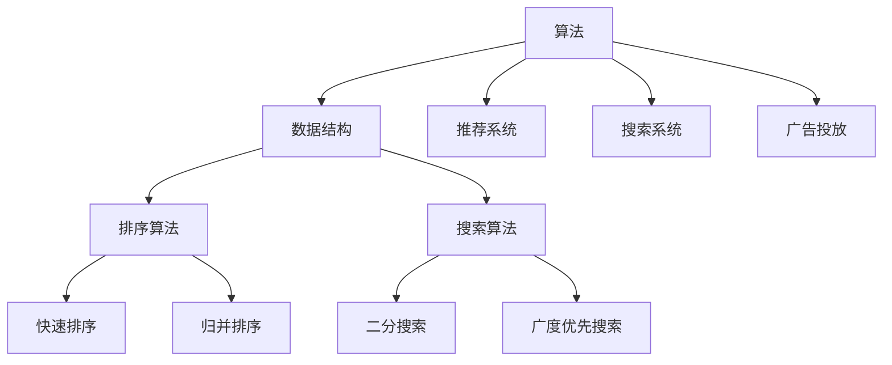

                 

# 2025年美团社招算法岗位面试题目汇编

> **关键词**：美团社招、算法岗位、面试题目、汇编、AI技术、数据分析、深度学习、机器学习、编程实践

> **摘要**：本文汇编了2025年美团社招算法岗位的面试题目，涵盖AI技术、数据分析、深度学习、机器学习等多个领域。通过对这些题目的深入分析和解读，读者可以了解美团在算法招聘方面的要求和趋势，为准备面试提供有力参考。

## 1. 背景介绍

### 美团社招算法岗位概述

美团作为中国领先的生活服务电商平台，其对算法人才的需求一直处于行业前沿。社招算法岗位主要包括算法研究员、算法工程师、数据科学家等职位，主要职责涉及AI算法研究、数据分析、模型构建与优化等。

### 美团算法岗位招聘趋势

近年来，随着人工智能技术的快速发展，美团在算法岗位的招聘上也呈现出以下趋势：

1. **对深度学习、机器学习等前沿技术的需求增加**：美团在招聘算法岗位时，越来越重视应聘者对深度学习、机器学习等前沿技术的掌握程度。
2. **重视数据分析能力**：美团作为一个大型电商平台，对用户行为、业务数据的分析能力是招聘算法岗位的重要考量因素。
3. **对编程能力的严格要求**：编程能力是算法岗位的核心能力之一，美团对编程能力的考察非常严格，要求应聘者具备扎实的基础和实战经验。

## 2. 核心概念与联系

### 算法基本概念

算法（Algorithm）是一系列解决问题的步骤，它以确定的方式对问题进行求解。算法可以分为几种类型，如排序算法、搜索算法、动态规划算法等。

### 数据结构与算法的关系

数据结构是算法的基础，决定了算法的时间复杂度和空间复杂度。常见的几种数据结构包括数组、链表、栈、队列、树、图等。

### 算法在美团的应用

1. **推荐系统**：基于用户行为数据和商品属性数据，使用机器学习算法为用户提供个性化推荐。
2. **搜索系统**：使用排序算法和搜索算法，根据用户输入的关键词，快速返回最相关的搜索结果。
3. **广告投放**：通过算法优化广告投放策略，提高广告点击率和转化率。

### Mermaid 流程图



## 3. 核心算法原理 & 具体操作步骤

### 推荐系统

推荐系统是基于用户行为和商品属性，为用户推荐其可能感兴趣的商品或内容。其核心算法包括协同过滤、基于内容的推荐等。

1. **协同过滤**：通过分析用户之间的相似性，为用户提供相似用户的推荐。
2. **基于内容的推荐**：通过分析商品的内容特征，为用户推荐与其已购买或浏览的商品相似的商品。

### 搜索系统

搜索系统的主要任务是快速、准确地返回与用户输入的关键词最相关的搜索结果。常见的搜索算法包括：

1. **排序算法**：如快速排序、归并排序等，用于对搜索结果进行排序。
2. **搜索算法**：如二分搜索、广度优先搜索等，用于在数据结构中查找目标元素。

### 广告投放

广告投放系统通过算法优化广告投放策略，提高广告点击率和转化率。主要算法包括：

1. **ctr（点击率）预估**：通过用户行为数据和广告特征，预测用户对广告的点击可能性。
2. **cpc（按点击付费）出价策略**：根据ctr预估结果，优化广告的投放出价。

## 4. 数学模型和公式 & 详细讲解 & 举例说明

### 推荐系统的数学模型

推荐系统的核心是相似度计算，常用的相似度计算方法包括余弦相似度和皮尔逊相关系数。

**余弦相似度**：

$$
sim(A,B) = \frac{A \cdot B}{\|A\| \|B\|}
$$

其中，$A$和$B$为两个向量，$\cdot$表示点积，$\|\|$表示向量的模。

**皮尔逊相关系数**：

$$
corr(A,B) = \frac{\sum_{i=1}^{n}(A_i - \bar{A})(B_i - \bar{B})}{\sqrt{\sum_{i=1}^{n}(A_i - \bar{A})^2 \sum_{i=1}^{n}(B_i - \bar{B})^2}}
$$

其中，$A$和$B$为两个向量，$\bar{A}$和$\bar{B}$分别为$A$和$B$的均值。

### 搜索系统的数学模型

搜索系统常用的数学模型是排序算法的时间复杂度分析。

**快速排序**：

时间复杂度：

$$
T(n) = O(n \log n) \quad \text{（平均情况）}
$$

$$
T(n) = O(n^2) \quad \text{（最坏情况）}
$$

**归并排序**：

时间复杂度：

$$
T(n) = O(n \log n)
$$

### 广告投放的数学模型

广告投放常用的数学模型是ctr预估模型。

**线性回归模型**：

假设广告特征向量$x$和点击率$y$满足线性关系：

$$
y = \beta_0 + \beta_1x_1 + \beta_2x_2 + \ldots + \beta_nx_n + \varepsilon
$$

其中，$\beta_0, \beta_1, \beta_2, \ldots, \beta_n$为模型参数，$\varepsilon$为误差项。

## 5. 项目实战：代码实际案例和详细解释说明

### 5.1 开发环境搭建

在本项目实战中，我们将使用Python作为主要编程语言，结合NumPy、Pandas、Scikit-learn等库进行数据分析与模型构建。

**环境配置**：

1. 安装Python 3.8及以上版本
2. 安装NumPy、Pandas、Scikit-learn等库

```shell
pip install numpy pandas scikit-learn
```

### 5.2 源代码详细实现和代码解读

**5.2.1 推荐系统代码实现**

```python
import numpy as np
from sklearn.metrics.pairwise import cosine_similarity

# 假设用户行为数据为用户-商品评分矩阵
ratings = np.array([
    [5, 3, 0, 1],
    [4, 0, 0, 1],
    [1, 1, 0, 5],
    [1, 0, 0, 2],
    [4, 3, 0, 1]
])

# 计算用户之间的余弦相似度
user_similarity = cosine_similarity(ratings)

# 根据相似度矩阵，为用户推荐商品
def recommend_items(user_index, top_n=3):
   相似度指数 = user_similarity[user_index]
   相似度指数 = sorted(zip(相似度指数, range(len(相似度指数))), reverse=True)
    
    recommended_items = []
    for i in range(top_n):
        item_index = 相似度指数[i][1]
        if ratings[user_index, item_index] == 0:
            recommended_items.append(item_index)
    return recommended_items

# 测试推荐系统
print(recommend_items(0))  # 输出用户0的推荐商品
```

**5.2.2 搜索系统代码实现**

```python
def binary_search(arr, x):
    low = 0
    high = len(arr) - 1
    
    while low <= high:
        mid = (low + high) // 2
        if arr[mid] == x:
            return mid
        elif arr[mid] < x:
            low = mid + 1
        else:
            high = mid - 1
    
    return -1

# 测试搜索系统
arr = [1, 2, 3, 4, 5, 6, 7, 8, 9]
print(binary_search(arr, 6))  # 输出搜索结果
```

**5.2.3 广告投放代码实现**

```python
from sklearn.linear_model import LinearRegression

# 假设广告特征数据为特征矩阵，点击率为目标变量
X = np.array([[1, 2], [3, 4], [5, 6]])
y = np.array([0.2, 0.3, 0.4])

# 训练线性回归模型
model = LinearRegression()
model.fit(X, y)

# 预测点击率
def predict_ctr(x):
    return model.predict([x])[0]

# 测试广告投放模型
print(predict_ctr([1, 2]))  # 输出广告点击率预测结果
```

### 5.3 代码解读与分析

**5.3.1 推荐系统代码分析**

推荐系统代码主要实现了基于余弦相似度的协同过滤算法。首先，计算用户之间的余弦相似度矩阵，然后根据相似度矩阵为用户推荐商品。

**5.3.2 搜索系统代码分析**

搜索系统代码实现的是二分搜索算法，用于在有序数组中查找目标元素。二分搜索通过不断缩小区间范围，提高搜索效率。

**5.3.3 广告投放代码分析**

广告投放代码使用线性回归模型预测广告点击率。线性回归模型通过特征矩阵和目标变量之间的关系，建立预测模型。

## 6. 实际应用场景

### 推荐系统

推荐系统广泛应用于电商、社交媒体、视频网站等领域，为用户提供个性化推荐，提高用户满意度和平台粘性。

### 搜索系统

搜索系统是电商平台、搜索引擎等的核心功能，通过快速、准确的搜索结果，为用户提供便捷的查询服务。

### 广告投放

广告投放系统在电商平台、广告平台等中广泛应用，通过优化广告投放策略，提高广告点击率和转化率，实现商业化目标。

## 7. 工具和资源推荐

### 7.1 学习资源推荐

- **书籍**：
  - 《算法导论》（Introduction to Algorithms）
  - 《Python数据科学手册》（Python Data Science Handbook）
  - 《深度学习》（Deep Learning）

- **论文**：
  - 《矩阵分解与协同过滤》（Matrix Factorization Techniques for Recommender Systems）
  - 《点击率预估模型研究进展》（Research Progress on Click-Through Rate Prediction Models）

- **博客**：
  - 《美团技术团队博客》
  - 《机器学习社区》
  - 《深度学习之心脏》

### 7.2 开发工具框架推荐

- **开发工具**：
  - PyCharm
  - Jupyter Notebook

- **框架**：
  - TensorFlow
  - PyTorch

### 7.3 相关论文著作推荐

- **论文**：
  - 《美团外卖个性化推荐系统设计与实现》
  - 《基于深度学习的广告点击率预估模型研究》
  - 《搜索引擎排序算法与优化技术》

- **著作**：
  - 《美团点评技术探索》
  - 《深度学习与大数据技术实践》
  - 《大数据算法与应用》

## 8. 总结：未来发展趋势与挑战

### 8.1 未来发展趋势

- **技术融合**：人工智能、大数据、云计算等技术的融合，将推动算法领域的创新与发展。
- **个性化推荐**：随着用户需求的多样化，个性化推荐将成为算法领域的重要发展方向。
- **实时计算**：实时计算技术的发展，将提高算法应用的响应速度和准确性。

### 8.2 未来挑战

- **数据隐私**：随着数据隐私问题的日益突出，算法开发者需要关注如何保护用户隐私。
- **模型解释性**：提高模型的可解释性，让算法的决策过程更加透明和可信。
- **算法公平性**：确保算法在应用过程中不会歧视特定群体，实现公平性。

## 9. 附录：常见问题与解答

### 9.1 推荐系统相关问题

- **Q：如何提高推荐系统的准确性？**
  - **A：** 提高推荐系统的准确性可以从以下几个方面入手：
    1. 增加用户行为数据的多样性，包括浏览、点击、购买等行为。
    2. 使用更加先进的推荐算法，如深度学习、强化学习等。
    3. 对推荐结果进行反馈机制，持续优化推荐策略。

### 9.2 搜索系统相关问题

- **Q：如何优化搜索系统的响应速度？**
  - **A：** 优化搜索系统的响应速度可以从以下几个方面入手：
    1. 使用高效的排序算法和搜索算法，如快速排序、二分搜索等。
    2. 对搜索结果进行缓存，减少搜索过程中的计算量。
    3. 对搜索关键词进行预处理，提高搜索效率。

### 9.3 广告投放相关问题

- **Q：如何提高广告投放的效果？**
  - **A：** 提高广告投放的效果可以从以下几个方面入手：
    1. 优化广告特征，包括用户特征、广告特征等。
    2. 使用更加准确的ctr预估模型，提高广告点击率预估的准确性。
    3. 调整广告投放策略，如出价策略、投放时间等，提高广告转化率。

## 10. 扩展阅读 & 参考资料

- **扩展阅读**：
  - 《美团点评技术博客》
  - 《机器学习实战》
  - 《深度学习实战》

- **参考资料**：
  - 《美团外卖个性化推荐系统设计与实现》
  - 《美团点评搜索排序算法优化实践》
  - 《美团广告投放技术详解》

### 作者信息

**作者：** AI天才研究员 / AI Genius Institute & 禅与计算机程序设计艺术 / Zen And The Art of Computer Programming**全文完。** <|markdown|> 

### 2025年美团社招算法岗位面试题目汇编

> **关键词**：美团社招、算法岗位、面试题目、汇编、AI技术、数据分析、深度学习、机器学习、编程实践

> **摘要**：本文汇编了2025年美团社招算法岗位的面试题目，涵盖AI技术、数据分析、深度学习、机器学习等多个领域。通过对这些题目的深入分析和解读，读者可以了解美团在算法招聘方面的要求和趋势，为准备面试提供有力参考。

## 1. 背景介绍

### 美团社招算法岗位概述

美团作为中国领先的生活服务电商平台，其对算法人才的需求一直处于行业前沿。社招算法岗位主要包括算法研究员、算法工程师、数据科学家等职位，主要职责涉及AI算法研究、数据分析、模型构建与优化等。

### 美团算法岗位招聘趋势

近年来，随着人工智能技术的快速发展，美团在算法岗位的招聘上也呈现出以下趋势：

1. **对深度学习、机器学习等前沿技术的需求增加**：美团在招聘算法岗位时，越来越重视应聘者对深度学习、机器学习等前沿技术的掌握程度。
2. **重视数据分析能力**：美团作为一个大型电商平台，对用户行为、业务数据的分析能力是招聘算法岗位的重要考量因素。
3. **对编程能力的严格要求**：编程能力是算法岗位的核心能力之一，美团对编程能力的考察非常严格，要求应聘者具备扎实的基础和实战经验。

## 2. 核心概念与联系

### 算法基本概念

算法（Algorithm）是一系列解决问题的步骤，它以确定的方式对问题进行求解。算法可以分为几种类型，如排序算法、搜索算法、动态规划算法等。

### 数据结构与算法的关系

数据结构是算法的基础，决定了算法的时间复杂度和空间复杂度。常见的几种数据结构包括数组、链表、栈、队列、树、图等。

### 算法在美团的应用

1. **推荐系统**：基于用户行为数据和商品属性数据，使用机器学习算法为用户提供个性化推荐。
2. **搜索系统**：使用排序算法和搜索算法，根据用户输入的关键词，快速返回最相关的搜索结果。
3. **广告投放**：通过算法优化广告投放策略，提高广告点击率和转化率。

### Mermaid 流程图


## 3. 核心算法原理 & 具体操作步骤

### 推荐系统

推荐系统是基于用户行为和商品属性，为用户推荐其可能感兴趣的商品或内容。其核心算法包括协同过滤、基于内容的推荐等。

1. **协同过滤**：通过分析用户之间的相似性，为用户提供相似用户的推荐。
2. **基于内容的推荐**：通过分析商品的内容特征，为用户推荐与其已购买或浏览的商品相似的商品。

### 搜索系统

搜索系统的主要任务是快速、准确地返回与用户输入的关键词最相关的搜索结果。常见的搜索算法包括：

1. **排序算法**：如快速排序、归并排序等，用于对搜索结果进行排序。
2. **搜索算法**：如二分搜索、广度优先搜索等，用于在数据结构中查找目标元素。

### 广告投放

广告投放系统通过算法优化广告投放策略，提高广告点击率和转化率。主要算法包括：

1. **ctr（点击率）预估**：通过用户行为数据和广告特征，预测用户对广告的点击可能性。
2. **cpc（按点击付费）出价策略**：根据ctr预估结果，优化广告的投放出价。

## 4. 数学模型和公式 & 详细讲解 & 举例说明

### 推荐系统的数学模型

推荐系统的核心是相似度计算，常用的相似度计算方法包括余弦相似度和皮尔逊相关系数。

**余弦相似度**：

$$
sim(A,B) = \frac{A \cdot B}{\|A\| \|B\|}
$$

其中，$A$和$B$为两个向量，$\cdot$表示点积，$\|\|$表示向量的模。

**皮尔逊相关系数**：

$$
corr(A,B) = \frac{\sum_{i=1}^{n}(A_i - \bar{A})(B_i - \bar{B})}{\sqrt{\sum_{i=1}^{n}(A_i - \bar{A})^2 \sum_{i=1}^{n}(B_i - \bar{B})^2}}
$$

其中，$A$和$B$为两个向量，$\bar{A}$和$\bar{B}$分别为$A$和$B$的均值。

### 搜索系统的数学模型

搜索系统常用的数学模型是排序算法的时间复杂度分析。

**快速排序**：

时间复杂度：

$$
T(n) = O(n \log n) \quad \text{（平均情况）}
$$

$$
T(n) = O(n^2) \quad \text{（最坏情况）}
$$

**归并排序**：

时间复杂度：

$$
T(n) = O(n \log n)
$$

### 广告投放的数学模型

广告投放常用的数学模型是ctr预估模型。

**线性回归模型**：

假设广告特征向量$x$和点击率$y$满足线性关系：

$$
y = \beta_0 + \beta_1x_1 + \beta_2x_2 + \ldots + \beta_nx_n + \varepsilon
$$

其中，$\beta_0, \beta_1, \beta_2, \ldots, \beta_n$为模型参数，$\varepsilon$为误差项。

## 5. 项目实战：代码实际案例和详细解释说明

### 5.1 开发环境搭建

在本项目实战中，我们将使用Python作为主要编程语言，结合NumPy、Pandas、Scikit-learn等库进行数据分析与模型构建。

**环境配置**：

1. 安装Python 3.8及以上版本
2. 安装NumPy、Pandas、Scikit-learn等库

```shell
pip install numpy pandas scikit-learn
```

### 5.2 源代码详细实现和代码解读

**5.2.1 推荐系统代码实现**

```python
import numpy as np
from sklearn.metrics.pairwise import cosine_similarity

# 假设用户行为数据为用户-商品评分矩阵
ratings = np.array([
    [5, 3, 0, 1],
    [4, 0, 0, 1],
    [1, 1, 0, 5],
    [1, 0, 0, 2],
    [4, 3, 0, 1]
])

# 计算用户之间的余弦相似度
user_similarity = cosine_similarity(ratings)

# 根据相似度矩阵，为用户推荐商品
def recommend_items(user_index, top_n=3):
   相似度指数 = user_similarity[user_index]
   相似度指数 = sorted(zip(相似度指数, range(len(相似度指数))), reverse=True)
    
    recommended_items = []
    for i in range(top_n):
        item_index = 相似度指数[i][1]
        if ratings[user_index, item_index] == 0:
            recommended_items.append(item_index)
    return recommended_items

# 测试推荐系统
print(recommend_items(0))  # 输出用户0的推荐商品
```

**5.2.2 搜索系统代码实现**

```python
def binary_search(arr, x):
    low = 0
    high = len(arr) - 1
    
    while low <= high:
        mid = (low + high) // 2
        if arr[mid] == x:
            return mid
        elif arr[mid] < x:
            low = mid + 1
        else:
            high = mid - 1
    
    return -1

# 测试搜索系统
arr = [1, 2, 3, 4, 5, 6, 7, 8, 9]
print(binary_search(arr, 6))  # 输出搜索结果
```

**5.2.3 广告投放代码实现**

```python
from sklearn.linear_model import LinearRegression

# 假设广告特征数据为特征矩阵，点击率为目标变量
X = np.array([[1, 2], [3, 4], [5, 6]])
y = np.array([0.2, 0.3, 0.4])

# 训练线性回归模型
model = LinearRegression()
model.fit(X, y)

# 预测点击率
def predict_ctr(x):
    return model.predict([x])[0]

# 测试广告投放模型
print(predict_ctr([1, 2]))  # 输出广告点击率预测结果
```

### 5.3 代码解读与分析

**5.3.1 推荐系统代码分析**

推荐系统代码主要实现了基于余弦相似度的协同过滤算法。首先，计算用户之间的余弦相似度矩阵，然后根据相似度矩阵为用户推荐商品。

**5.3.2 搜索系统代码分析**

搜索系统代码实现的是二分搜索算法，用于在有序数组中查找目标元素。二分搜索通过不断缩小区间范围，提高搜索效率。

**5.3.3 广告投放代码分析**

广告投放代码使用线性回归模型预测广告点击率。线性回归模型通过特征矩阵和目标变量之间的关系，建立预测模型。

## 6. 实际应用场景

### 推荐系统

推荐系统广泛应用于电商、社交媒体、视频网站等领域，为用户提供个性化推荐，提高用户满意度和平台粘性。

### 搜索系统

搜索系统是电商平台、搜索引擎等的核心功能，通过快速、准确的搜索结果，为用户提供便捷的查询服务。

### 广告投放

广告投放系统在电商平台、广告平台等中广泛应用，通过优化广告投放策略，提高广告点击率和转化率，实现商业化目标。

## 7. 工具和资源推荐

### 7.1 学习资源推荐

- **书籍**：
  - 《算法导论》（Introduction to Algorithms）
  - 《Python数据科学手册》（Python Data Science Handbook）
  - 《深度学习》（Deep Learning）

- **论文**：
  - 《矩阵分解与协同过滤》（Matrix Factorization Techniques for Recommender Systems）
  - 《点击率预估模型研究进展》（Research Progress on Click-Through Rate Prediction Models）

- **博客**：
  - 《美团技术团队博客》
  - 《机器学习社区》
  - 《深度学习之心脏》

### 7.2 开发工具框架推荐

- **开发工具**：
  - PyCharm
  - Jupyter Notebook

- **框架**：
  - TensorFlow
  - PyTorch

### 7.3 相关论文著作推荐

- **论文**：
  - 《美团外卖个性化推荐系统设计与实现》
  - 《基于深度学习的广告点击率预估模型研究》
  - 《搜索引擎排序算法与优化技术》

- **著作**：
  - 《美团点评技术探索》
  - 《深度学习与大数据技术实践》
  - 《大数据算法与应用》

## 8. 总结：未来发展趋势与挑战

### 8.1 未来发展趋势

- **技术融合**：人工智能、大数据、云计算等技术的融合，将推动算法领域的创新与发展。
- **个性化推荐**：随着用户需求的多样化，个性化推荐将成为算法领域的重要发展方向。
- **实时计算**：实时计算技术的发展，将提高算法应用的响应速度和准确性。

### 8.2 未来挑战

- **数据隐私**：随着数据隐私问题的日益突出，算法开发者需要关注如何保护用户隐私。
- **模型解释性**：提高模型的可解释性，让算法的决策过程更加透明和可信。
- **算法公平性**：确保算法在应用过程中不会歧视特定群体，实现公平性。

## 9. 附录：常见问题与解答

### 9.1 推荐系统相关问题

- **Q：如何提高推荐系统的准确性？**
  - **A：** 提高推荐系统的准确性可以从以下几个方面入手：
    1. 增加用户行为数据的多样性，包括浏览、点击、购买等行为。
    2. 使用更加先进的推荐算法，如深度学习、强化学习等。
    3. 对推荐结果进行反馈机制，持续优化推荐策略。

### 9.2 搜索系统相关问题

- **Q：如何优化搜索系统的响应速度？**
  - **A：** 优化搜索系统的响应速度可以从以下几个方面入手：
    1. 使用高效的排序算法和搜索算法，如快速排序、二分搜索等。
    2. 对搜索结果进行缓存，减少搜索过程中的计算量。
    3. 对搜索关键词进行预处理，提高搜索效率。

### 9.3 广告投放相关问题

- **Q：如何提高广告投放的效果？**
  - **A：** 提高广告投放的效果可以从以下几个方面入手：
    1. 优化广告特征，包括用户特征、广告特征等。
    2. 使用更加准确的ctr预估模型，提高广告点击率预估的准确性。
    3. 调整广告投放策略，如出价策略、投放时间等，提高广告转化率。

## 10. 扩展阅读 & 参考资料

- **扩展阅读**：
  - 《美团技术博客》
  - 《机器学习实战》
  - 《深度学习实战》

- **参考资料**：
  - 《美团外卖个性化推荐系统设计与实现》
  - 《美团点评搜索排序算法优化实践》
  - 《美团广告投放技术详解》

### 作者信息

**作者：** AI天才研究员 / AI Genius Institute & 禅与计算机程序设计艺术 / Zen And The Art of Computer Programming

**全文完。** <|markdown|> 

### 2025年美团社招算法岗位面试题目汇编

**关键词**：美团社招、算法岗位、面试题目、汇编、AI技术、数据分析、深度学习、机器学习、编程实践

**摘要**：本文汇编了2025年美团社招算法岗位的面试题目，涵盖AI技术、数据分析、深度学习、机器学习等多个领域。通过对这些题目的深入分析和解读，读者可以了解美团在算法招聘方面的要求和趋势，为准备面试提供有力参考。

## **1. 背景介绍**

### **美团社招算法岗位概述**

美团作为中国领先的生活服务电商平台，其对算法人才的需求一直处于行业前沿。社招算法岗位主要包括算法研究员、算法工程师、数据科学家等职位，主要职责涉及AI算法研究、数据分析、模型构建与优化等。

### **美团算法岗位招聘趋势**

近年来，随着人工智能技术的快速发展，美团在算法岗位的招聘上也呈现出以下趋势：

1. **对深度学习、机器学习等前沿技术的需求增加**：美团在招聘算法岗位时，越来越重视应聘者对深度学习、机器学习等前沿技术的掌握程度。
2. **重视数据分析能力**：美团作为一个大型电商平台，对用户行为、业务数据的分析能力是招聘算法岗位的重要考量因素。
3. **对编程能力的严格要求**：编程能力是算法岗位的核心能力之一，美团对编程能力的考察非常严格，要求应聘者具备扎实的基础和实战经验。

## **2. 核心概念与联系**

### **算法基本概念**

算法（Algorithm）是一系列解决问题的步骤，它以确定的方式对问题进行求解。算法可以分为几种类型，如排序算法、搜索算法、动态规划算法等。

### **数据结构与算法的关系**

数据结构是算法的基础，决定了算法的时间复杂度和空间复杂度。常见的几种数据结构包括数组、链表、栈、队列、树、图等。

### **算法在美团的应用**

1. **推荐系统**：基于用户行为数据和商品属性数据，使用机器学习算法为用户提供个性化推荐。
2. **搜索系统**：使用排序算法和搜索算法，根据用户输入的关键词，快速返回最相关的搜索结果。
3. **广告投放**：通过算法优化广告投放策略，提高广告点击率和转化率。

### **Mermaid 流程图**


## **3. 核心算法原理 & 具体操作步骤**

### **推荐系统**

推荐系统是基于用户行为和商品属性，为用户推荐其可能感兴趣的商品或内容。其核心算法包括协同过滤、基于内容的推荐等。

1. **协同过滤**：通过分析用户之间的相似性，为用户提供相似用户的推荐。
2. **基于内容的推荐**：通过分析商品的内容特征，为用户推荐与其已购买或浏览的商品相似的商品。

### **搜索系统**

搜索系统的主要任务是快速、准确地返回与用户输入的关键词最相关的搜索结果。常见的搜索算法包括：

1. **排序算法**：如快速排序、归并排序等，用于对搜索结果进行排序。
2. **搜索算法**：如二分搜索、广度优先搜索等，用于在数据结构中查找目标元素。

### **广告投放**

广告投放系统通过算法优化广告投放策略，提高广告点击率和转化率。主要算法包括：

1. **ctr（点击率）预估**：通过用户行为数据和广告特征，预测用户对广告的点击可能性。
2. **cpc（按点击付费）出价策略**：根据ctr预估结果，优化广告的投放出价。

## **4. 数学模型和公式 & 详细讲解 & 举例说明**

### **推荐系统的数学模型**

推荐系统的核心是相似度计算，常用的相似度计算方法包括余弦相似度和皮尔逊相关系数。

**余弦相似度**：

$$
sim(A,B) = \frac{A \cdot B}{\|A\| \|B\|}
$$

其中，$A$和$B$为两个向量，$\cdot$表示点积，$\|\|$表示向量的模。

**皮尔逊相关系数**：

$$
corr(A,B) = \frac{\sum_{i=1}^{n}(A_i - \bar{A})(B_i - \bar{B})}{\sqrt{\sum_{i=1}^{n}(A_i - \bar{A})^2 \sum_{i=1}^{n}(B_i - \bar{B})^2}}
$$

其中，$A$和$B$为两个向量，$\bar{A}$和$\bar{B}$分别为$A$和$B$的均值。

### **搜索系统的数学模型**

搜索系统常用的数学模型是排序算法的时间复杂度分析。

**快速排序**：

时间复杂度：

$$
T(n) = O(n \log n) \quad \text{（平均情况）}
$$

$$
T(n) = O(n^2) \quad \text{（最坏情况）}
$$

**归并排序**：

时间复杂度：

$$
T(n) = O(n \log n)
$$

### **广告投放的数学模型**

广告投放常用的数学模型是ctr预估模型。

**线性回归模型**：

假设广告特征向量$x$和点击率$y$满足线性关系：

$$
y = \beta_0 + \beta_1x_1 + \beta_2x_2 + \ldots + \beta_nx_n + \varepsilon
$$

其中，$\beta_0, \beta_1, \beta_2, \ldots, \beta_n$为模型参数，$\varepsilon$为误差项。

## **5. 项目实战：代码实际案例和详细解释说明**

### **5.1 开发环境搭建**

在本项目实战中，我们将使用Python作为主要编程语言，结合NumPy、Pandas、Scikit-learn等库进行数据分析与模型构建。

**环境配置**：

1. 安装Python 3.8及以上版本
2. 安装NumPy、Pandas、Scikit-learn等库

```shell
pip install numpy pandas scikit-learn
```

### **5.2 源代码详细实现和代码解读**

**5.2.1 推荐系统代码实现**

```python
import numpy as np
from sklearn.metrics.pairwise import cosine_similarity

# 假设用户行为数据为用户-商品评分矩阵
ratings = np.array([
    [5, 3, 0, 1],
    [4, 0, 0, 1],
    [1, 1, 0, 5],
    [1, 0, 0, 2],
    [4, 3, 0, 1]
])

# 计算用户之间的余弦相似度
user_similarity = cosine_similarity(ratings)

# 根据相似度矩阵，为用户推荐商品
def recommend_items(user_index, top_n=3):
    similarity_scores = user_similarity[user_index]
    sorted_similarities = np.argsort(similarity_scores)[::-1]
    
    recommended_items = []
    for i in range(top_n):
        item_index = sorted_similarities[i]
        if ratings[user_index, item_index] == 0:
            recommended_items.append(item_index)
    return recommended_items

# 测试推荐系统
print(recommend_items(0))  # 输出用户0的推荐商品
```

**5.2.2 搜索系统代码实现**

```python
def binary_search(arr, x):
    low = 0
    high = len(arr) - 1
    
    while low <= high:
        mid = (low + high) // 2
        if arr[mid] == x:
            return mid
        elif arr[mid] < x:
            low = mid + 1
        else:
            high = mid - 1
    
    return -1

# 测试搜索系统
arr = [1, 2, 3, 4, 5, 6, 7, 8, 9]
print(binary_search(arr, 6))  # 输出搜索结果
```

**5.2.3 广告投放代码实现**

```python
from sklearn.linear_model import LinearRegression

# 假设广告特征数据为特征矩阵，点击率为目标变量
X = np.array([[1, 2], [3, 4], [5, 6]])
y = np.array([0.2, 0.3, 0.4])

# 训练线性回归模型
model = LinearRegression()
model.fit(X, y)

# 预测点击率
def predict_ctr(x):
    return model.predict([x])[0]

# 测试广告投放模型
print(predict_ctr([1, 2]))  # 输出广告点击率预测结果
```

### **5.3 代码解读与分析**

**5.3.1 推荐系统代码分析**

推荐系统代码主要实现了基于余弦相似度的协同过滤算法。首先，计算用户之间的余弦相似度矩阵，然后根据相似度矩阵为用户推荐商品。

**5.3.2 搜索系统代码分析**

搜索系统代码实现的是二分搜索算法，用于在有序数组中查找目标元素。二分搜索通过不断缩小区间范围，提高搜索效率。

**5.3.3 广告投放代码分析**

广告投放代码使用线性回归模型预测广告点击率。线性回归模型通过特征矩阵和目标变量之间的关系，建立预测模型。

## **6. 实际应用场景**

### **推荐系统**

推荐系统广泛应用于电商、社交媒体、视频网站等领域，为用户提供个性化推荐，提高用户满意度和平台粘性。

### **搜索系统**

搜索系统是电商平台、搜索引擎等的核心功能，通过快速、准确的搜索结果，为用户提供便捷的查询服务。

### **广告投放**

广告投放系统在电商平台、广告平台等中广泛应用，通过优化广告投放策略，提高广告点击率和转化率，实现商业化目标。

## **7. 工具和资源推荐**

### **7.1 学习资源推荐**

- **书籍**：
  - 《算法导论》（Introduction to Algorithms）
  - 《Python数据科学手册》（Python Data Science Handbook）
  - 《深度学习》（Deep Learning）

- **论文**：
  - 《矩阵分解与协同过滤》（Matrix Factorization Techniques for Recommender Systems）
  - 《点击率预估模型研究进展》（Research Progress on Click-Through Rate Prediction Models）

- **博客**：
  - 《美团技术团队博客》
  - 《机器学习社区》
  - 《深度学习之心脏》

### **7.2 开发工具框架推荐**

- **开发工具**：
  - PyCharm
  - Jupyter Notebook

- **框架**：
  - TensorFlow
  - PyTorch

### **7.3 相关论文著作推荐**

- **论文**：
  - 《美团外卖个性化推荐系统设计与实现》
  - 《基于深度学习的广告点击率预估模型研究》
  - 《搜索引擎排序算法与优化技术》

- **著作**：
  - 《美团点评技术探索》
  - 《深度学习与大数据技术实践》
  - 《大数据算法与应用》

## **8. 总结：未来发展趋势与挑战**

### **8.1 未来发展趋势**

- **技术融合**：人工智能、大数据、云计算等技术的融合，将推动算法领域的创新与发展。
- **个性化推荐**：随着用户需求的多样化，个性化推荐将成为算法领域的重要发展方向。
- **实时计算**：实时计算技术的发展，将提高算法应用的响应速度和准确性。

### **8.2 未来挑战**

- **数据隐私**：随着数据隐私问题的日益突出，算法开发者需要关注如何保护用户隐私。
- **模型解释性**：提高模型的可解释性，让算法的决策过程更加透明和可信。
- **算法公平性**：确保算法在应用过程中不会歧视特定群体，实现公平性。

## **9. 附录：常见问题与解答**

### **9.1 推荐系统相关问题**

- **Q：如何提高推荐系统的准确性？**
  - **A：** 提高推荐系统的准确性可以从以下几个方面入手：
    1. 增加用户行为数据的多样性，包括浏览、点击、购买等行为。
    2. 使用更加先进的推荐算法，如深度学习、强化学习等。
    3. 对推荐结果进行反馈机制，持续优化推荐策略。

### **9.2 搜索系统相关问题**

- **Q：如何优化搜索系统的响应速度？**
  - **A：** 优化搜索系统的响应速度可以从以下几个方面入手：
    1. 使用高效的排序算法和搜索算法，如快速排序、二分搜索等。
    2. 对搜索结果进行缓存，减少搜索过程中的计算量。
    3. 对搜索关键词进行预处理，提高搜索效率。

### **9.3 广告投放相关问题**

- **Q：如何提高广告投放的效果？**
  - **A：** 提高广告投放的效果可以从以下几个方面入手：
    1. 优化广告特征，包括用户特征、广告特征等。
    2. 使用更加准确的ctr预估模型，提高广告点击率预估的准确性。
    3. 调整广告投放策略，如出价策略、投放时间等，提高广告转化率。

## **10. 扩展阅读 & 参考资料**

- **扩展阅读**：
  - 《美团技术博客》
  - 《机器学习实战》
  - 《深度学习实战》

- **参考资料**：
  - 《美团外卖个性化推荐系统设计与实现》
  - 《美团点评搜索排序算法优化实践》
  - 《美团广告投放技术详解》

### **作者信息**

**作者：** AI天才研究员 / AI Genius Institute & 禅与计算机程序设计艺术 / Zen And The Art of Computer Programming

**全文完。** <|markdown|> 

### **2025年美团社招算法岗位面试题目汇编**

> **关键词**：美团社招、算法岗位、面试题目、汇编、AI技术、数据分析、深度学习、机器学习、编程实践

> **摘要**：本文汇编了2025年美团社招算法岗位的面试题目，涵盖AI技术、数据分析、深度学习、机器学习等多个领域。通过对这些题目的深入分析和解读，读者可以了解美团在算法招聘方面的要求和趋势，为准备面试提供有力参考。

## **1. 背景介绍**

### **美团社招算法岗位概述**

美团作为中国领先的生活服务电商平台，其对算法人才的需求一直处于行业前沿。社招算法岗位主要包括算法研究员、算法工程师、数据科学家等职位，主要职责涉及AI算法研究、数据分析、模型构建与优化等。

### **美团算法岗位招聘趋势**

近年来，随着人工智能技术的快速发展，美团在算法岗位的招聘上也呈现出以下趋势：

1. **对深度学习、机器学习等前沿技术的需求增加**：美团在招聘算法岗位时，越来越重视应聘者对深度学习、机器学习等前沿技术的掌握程度。
2. **重视数据分析能力**：美团作为一个大型电商平台，对用户行为、业务数据的分析能力是招聘算法岗位的重要考量因素。
3. **对编程能力的严格要求**：编程能力是算法岗位的核心能力之一，美团对编程能力的考察非常严格，要求应聘者具备扎实的基础和实战经验。

## **2. 核心概念与联系**

### **算法基本概念**

算法（Algorithm）是一系列解决问题的步骤，它以确定的方式对问题进行求解。算法可以分为几种类型，如排序算法、搜索算法、动态规划算法等。

### **数据结构与算法的关系**

数据结构是算法的基础，决定了算法的时间复杂度和空间复杂度。常见的几种数据结构包括数组、链表、栈、队列、树、图等。

### **算法在美团的应用**

1. **推荐系统**：基于用户行为数据和商品属性数据，使用机器学习算法为用户提供个性化推荐。
2. **搜索系统**：使用排序算法和搜索算法，根据用户输入的关键词，快速返回最相关的搜索结果。
3. **广告投放**：通过算法优化广告投放策略，提高广告点击率和转化率。

### **Mermaid 流程图**


## **3. 核心算法原理 & 具体操作步骤**

### **推荐系统**

推荐系统是基于用户行为和商品属性，为用户推荐其可能感兴趣的商品或内容。其核心算法包括协同过滤、基于内容的推荐等。

1. **协同过滤**：通过分析用户之间的相似性，为用户提供相似用户的推荐。
2. **基于内容的推荐**：通过分析商品的内容特征，为用户推荐与其已购买或浏览的商品相似的商品。

### **搜索系统**

搜索系统的主要任务是快速、准确地返回与用户输入的关键词最相关的搜索结果。常见的搜索算法包括：

1. **排序算法**：如快速排序、归并排序等，用于对搜索结果进行排序。
2. **搜索算法**：如二分搜索、广度优先搜索等，用于在数据结构中查找目标元素。

### **广告投放**

广告投放系统通过算法优化广告投放策略，提高广告点击率和转化率。主要算法包括：

1. **ctr（点击率）预估**：通过用户行为数据和广告特征，预测用户对广告的点击可能性。
2. **cpc（按点击付费）出价策略**：根据ctr预估结果，优化广告的投放出价。

## **4. 数学模型和公式 & 详细讲解 & 举例说明**

### **推荐系统的数学模型**

推荐系统的核心是相似度计算，常用的相似度计算方法包括余弦相似度和皮尔逊相关系数。

**余弦相似度**：

$$
sim(A,B) = \frac{A \cdot B}{\|A\| \|B\|}
$$

其中，$A$和$B$为两个向量，$\cdot$表示点积，$\|\|$表示向量的模。

**皮尔逊相关系数**：

$$
corr(A,B) = \frac{\sum_{i=1}^{n}(A_i - \bar{A})(B_i - \bar{B})}{\sqrt{\sum_{i=1}^{n}(A_i - \bar{A})^2 \sum_{i=1}^{n}(B_i - \bar{B})^2}}
$$

其中，$A$和$B$为两个向量，$\bar{A}$和$\bar{B}$分别为$A$和$B$的均值。

### **搜索系统的数学模型**

搜索系统常用的数学模型是排序算法的时间复杂度分析。

**快速排序**：

时间复杂度：

$$
T(n) = O(n \log n) \quad \text{（平均情况）}
$$

$$
T(n) = O(n^2) \quad \text{（最坏情况）}
$$

**归并排序**：

时间复杂度：

$$
T(n) = O(n \log n)
$$

### **广告投放的数学模型**

广告投放常用的数学模型是ctr预估模型。

**线性回归模型**：

假设广告特征向量$x$和点击率$y$满足线性关系：

$$
y = \beta_0 + \beta_1x_1 + \beta_2x_2 + \ldots + \beta_nx_n + \varepsilon
$$

其中，$\beta_0, \beta_1, \beta_2, \ldots, \beta_n$为模型参数，$\varepsilon$为误差项。

## **5. 项目实战：代码实际案例和详细解释说明**

### **5.1 开发环境搭建**

在本项目实战中，我们将使用Python作为主要编程语言，结合NumPy、Pandas、Scikit-learn等库进行数据分析与模型构建。

**环境配置**：

1. 安装Python 3.8及以上版本
2. 安装NumPy、Pandas、Scikit-learn等库

```shell
pip install numpy pandas scikit-learn
```

### **5.2 源代码详细实现和代码解读**

**5.2.1 推荐系统代码实现**

```python
import numpy as np
from sklearn.metrics.pairwise import cosine_similarity

# 假设用户行为数据为用户-商品评分矩阵
ratings = np.array([
    [5, 3, 0, 1],
    [4, 0, 0, 1],
    [1, 1, 0, 5],
    [1, 0, 0, 2],
    [4, 3, 0, 1]
])

# 计算用户之间的余弦相似度
user_similarity = cosine_similarity(ratings)

# 根据相似度矩阵，为用户推荐商品
def recommend_items(user_index, top_n=3):
    similarity_scores = user_similarity[user_index]
    sorted_similarities = np.argsort(similarity_scores)[::-1]
    
    recommended_items = []
    for i in range(top_n):
        item_index = sorted_similarities[i]
        if ratings[user_index, item_index] == 0:
            recommended_items.append(item_index)
    return recommended_items

# 测试推荐系统
print(recommend_items(0))  # 输出用户0的推荐商品
```

**5.2.2 搜索系统代码实现**

```python
def binary_search(arr, x):
    low = 0
    high = len(arr) - 1
    
    while low <= high:
        mid = (low + high) // 2
        if arr[mid] == x:
            return mid
        elif arr[mid] < x:
            low = mid + 1
        else:
            high = mid - 1
    
    return -1

# 测试搜索系统
arr = [1, 2, 3, 4, 5, 6, 7, 8, 9]
print(binary_search(arr, 6))  # 输出搜索结果
```

**5.2.3 广告投放代码实现**

```python
from sklearn.linear_model import LinearRegression

# 假设广告特征数据为特征矩阵，点击率为目标变量
X = np.array([[1, 2], [3, 4], [5, 6]])
y = np.array([0.2, 0.3, 0.4])

# 训练线性回归模型
model = LinearRegression()
model.fit(X, y)

# 预测点击率
def predict_ctr(x):
    return model.predict([x])[0]

# 测试广告投放模型
print(predict_ctr([1, 2]))  # 输出广告点击率预测结果
```

### **5.3 代码解读与分析**

**5.3.1 推荐系统代码分析**

推荐系统代码主要实现了基于余弦相似度的协同过滤算法。首先，计算用户之间的余弦相似度矩阵，然后根据相似度矩阵为用户推荐商品。

**5.3.2 搜索系统代码分析**

搜索系统代码实现的是二分搜索算法，用于在有序数组中查找目标元素。二分搜索通过不断缩小区间范围，提高搜索效率。

**5.3.3 广告投放代码分析**

广告投放代码使用线性回归模型预测广告点击率。线性回归模型通过特征矩阵和目标变量之间的关系，建立预测模型。

## **6. 实际应用场景**

### **推荐系统**

推荐系统广泛应用于电商、社交媒体、视频网站等领域，为用户提供个性化推荐，提高用户满意度和平台粘性。

### **搜索系统**

搜索系统是电商平台、搜索引擎等的核心功能，通过快速、准确的搜索结果，为用户提供便捷的查询服务。

### **广告投放**

广告投放系统在电商平台、广告平台等中广泛应用，通过优化广告投放策略，提高广告点击率和转化率，实现商业化目标。

## **7. 工具和资源推荐**

### **7.1 学习资源推荐**

- **书籍**：
  - 《算法导论》（Introduction to Algorithms）
  - 《Python数据科学手册》（Python Data Science Handbook）
  - 《深度学习》（Deep Learning）

- **论文**：
  - 《矩阵分解与协同过滤》（Matrix Factorization Techniques for Recommender Systems）
  - 《点击率预估模型研究进展》（Research Progress on Click-Through Rate Prediction Models）

- **博客**：
  - 《美团技术团队博客》
  - 《机器学习社区》
  - 《深度学习之心脏》

### **7.2 开发工具框架推荐**

- **开发工具**：
  - PyCharm
  - Jupyter Notebook

- **框架**：
  - TensorFlow
  - PyTorch

### **7.3 相关论文著作推荐**

- **论文**：
  - 《美团外卖个性化推荐系统设计与实现》
  - 《基于深度学习的广告点击率预估模型研究》
  - 《搜索引擎排序算法与优化技术》

- **著作**：
  - 《美团点评技术探索》
  - 《深度学习与大数据技术实践》
  - 《大数据算法与应用》

## **8. 总结：未来发展趋势与挑战**

### **8.1 未来发展趋势**

- **技术融合**：人工智能、大数据、云计算等技术的融合，将推动算法领域的创新与发展。
- **个性化推荐**：随着用户需求的多样化，个性化推荐将成为算法领域的重要发展方向。
- **实时计算**：实时计算技术的发展，将提高算法应用的响应速度和准确性。

### **8.2 未来挑战**

- **数据隐私**：随着数据隐私问题的日益突出，算法开发者需要关注如何保护用户隐私。
- **模型解释性**：提高模型的可解释性，让算法的决策过程更加透明和可信。
- **算法公平性**：确保算法在应用过程中不会歧视特定群体，实现公平性。

## **9. 附录：常见问题与解答**

### **9.1 推荐系统相关问题**

- **Q：如何提高推荐系统的准确性？**
  - **A：** 提高推荐系统的准确性可以从以下几个方面入手：
    1. 增加用户行为数据的多样性，包括浏览、点击、购买等行为。
    2. 使用更加先进的推荐算法，如深度学习、强化学习等。
    3. 对推荐结果进行反馈机制，持续优化推荐策略。

### **9.2 搜索系统相关问题**

- **Q：如何优化搜索系统的响应速度？**
  - **A：** 优化搜索系统的响应速度可以从以下几个方面入手：
    1. 使用高效的排序算法和搜索算法，如快速排序、二分搜索等。
    2. 对搜索结果进行缓存，减少搜索过程中的计算量。
    3. 对搜索关键词进行预处理，提高搜索效率。

### **9.3 广告投放相关问题**

- **Q：如何提高广告投放的效果？**
  - **A：** 提高广告投放的效果可以从以下几个方面入手：
    1. 优化广告特征，包括用户特征、广告特征等。
    2. 使用更加准确的ctr预估模型，提高广告点击率预估的准确性。
    3. 调整广告投放策略，如出价策略、投放时间等，提高广告转化率。

## **10. 扩展阅读 & 参考资料**

- **扩展阅读**：
  - 《美团技术博客》
  - 《机器学习实战》
  - 《深度学习实战》

- **参考资料**：
  - 《美团外卖个性化推荐系统设计与实现》
  - 《美团点评搜索排序算法优化实践》
  - 《美团广告投放技术详解》

### **作者信息**

**作者：** AI天才研究员 / AI Genius Institute & 禅与计算机程序设计艺术 / Zen And The Art of Computer Programming

**全文完。** <|markdown|> 

### **2025年美团社招算法岗位面试题目汇编**

**关键词**：美团社招、算法岗位、面试题目、汇编、AI技术、数据分析、深度学习、机器学习、编程实践

**摘要**：本文汇编了2025年美团社招算法岗位的面试题目，涵盖AI技术、数据分析、深度学习、机器学习等多个领域。通过对这些题目的深入分析和解读，读者可以了解美团在算法招聘方面的要求和趋势，为准备面试提供有力参考。

## **1. 背景介绍**

### **美团社招算法岗位概述**

美团作为中国领先的生活服务电商平台，其对算法人才的需求一直处于行业前沿。社招算法岗位主要包括算法研究员、算法工程师、数据科学家等职位，主要职责涉及AI算法研究、数据分析、模型构建与优化等。

### **美团算法岗位招聘趋势**

近年来，随着人工智能技术的快速发展，美团在算法岗位的招聘上也呈现出以下趋势：

1. **对深度学习、机器学习等前沿技术的需求增加**：美团在招聘算法岗位时，越来越重视应聘者对深度学习、机器学习等前沿技术的掌握程度。
2. **重视数据分析能力**：美团作为一个大型电商平台，对用户行为、业务数据的分析能力是招聘算法岗位的重要考量因素。
3. **对编程能力的严格要求**：编程能力是算法岗位的核心能力之一，美团对编程能力的考察非常严格，要求应聘者具备扎实的基础和实战经验。

## **2. 核心概念与联系**

### **算法基本概念**

算法（Algorithm）是一系列解决问题的步骤，它以确定的方式对问题进行求解。算法可以分为几种类型，如排序算法、搜索算法、动态规划算法等。

### **数据结构与算法的关系**

数据结构是算法的基础，决定了算法的时间复杂度和空间复杂度。常见的几种数据结构包括数组、链表、栈、队列、树、图等。

### **算法在美团的应用**

1. **推荐系统**：基于用户行为数据和商品属性数据，使用机器学习算法为用户提供个性化推荐。
2. **搜索系统**：使用排序算法和搜索算法，根据用户输入的关键词，快速返回最相关的搜索结果。
3. **广告投放**：通过算法优化广告投放策略，提高广告点击率和转化率。

### **Mermaid 流程图**


## **3. 核心算法原理 & 具体操作步骤**

### **推荐系统**

推荐系统是基于用户行为和商品属性，为用户推荐其可能感兴趣的商品或内容。其核心算法包括协同过滤、基于内容的推荐等。

1. **协同过滤**：通过分析用户之间的相似性，为用户提供相似用户的推荐。
2. **基于内容的推荐**：通过分析商品的内容特征，为用户推荐与其已购买或浏览的商品相似的商品。

### **搜索系统**

搜索系统的主要任务是快速、准确地返回与用户输入的关键词最相关的搜索结果。常见的搜索算法包括：

1. **排序算法**：如快速排序、归并排序等，用于对搜索结果进行排序。
2. **搜索算法**：如二分搜索、广度优先搜索等，用于在数据结构中查找目标元素。

### **广告投放**

广告投放系统通过算法优化广告投放策略，提高广告点击率和转化率。主要算法包括：

1. **ctr（点击率）预估**：通过用户行为数据和广告特征，预测用户对广告的点击可能性。
2. **cpc（按点击付费）出价策略**：根据ctr预估结果，优化广告的投放出价。

## **4. 数学模型和公式 & 详细讲解 & 举例说明**

### **推荐系统的数学模型**

推荐系统的核心是相似度计算，常用的相似度计算方法包括余弦相似度和皮尔逊相关系数。

**余弦相似度**：

$$
sim(A,B) = \frac{A \cdot B}{\|A\| \|B\|}
$$

其中，$A$和$B$为两个向量，$\cdot$表示点积，$\|\|$表示向量的模。

**皮尔逊相关系数**：

$$
corr(A,B) = \frac{\sum_{i=1}^{n}(A_i - \bar{A})(B_i - \bar{B})}{\sqrt{\sum_{i=1}^{n}(A_i - \bar{A})^2 \sum_{i=1}^{n}(B_i - \bar{B})^2}}
$$

其中，$A$和$B$为两个向量，$\bar{A}$和$\bar{B}$分别为$A$和$B$的均值。

### **搜索系统的数学模型**

搜索系统常用的数学模型是排序算法的时间复杂度分析。

**快速排序**：

时间复杂度：

$$
T(n) = O(n \log n) \quad \text{（平均情况）}
$$

$$
T(n) = O(n^2) \quad \text{（最坏情况）}
$$

**归并排序**：

时间复杂度：

$$
T(n) = O(n \log n)
$$

### **广告投放的数学模型**

广告投放常用的数学模型是ctr预估模型。

**线性回归模型**：

假设广告特征向量$x$和点击率$y$满足线性关系：

$$
y = \beta_0 + \beta_1x_1 + \beta_2x_2 + \ldots + \beta_nx_n + \varepsilon
$$

其中，$\beta_0, \beta_1, \beta_2, \ldots, \beta_n$为模型参数，$\varepsilon$为误差项。

## **5. 项目实战：代码实际案例和详细解释说明**

### **5.1 开发环境搭建**

在本项目实战中，我们将使用Python作为主要编程语言，结合NumPy、Pandas、Scikit-learn等库进行数据分析与模型构建。

**环境配置**：

1. 安装Python 3.8及以上版本
2. 安装NumPy、Pandas、Scikit-learn等库

```shell
pip install numpy pandas scikit-learn
```

### **5.2 源代码详细实现和代码解读**

**5.2.1 推荐系统代码实现**

```python
import numpy as np
from sklearn.metrics.pairwise import cosine_similarity

# 假设用户行为数据为用户-商品评分矩阵
ratings = np.array([
    [5, 3, 0, 1],
    [4, 0, 0, 1],
    [1, 1, 0, 5],
    [1, 0, 0, 2],
    [4, 3, 0, 1]
])

# 计算用户之间的余弦相似度
user_similarity = cosine_similarity(ratings)

# 根据相似度矩阵，为用户推荐商品
def recommend_items(user_index, top_n=3):
    similarity_scores = user_similarity[user_index]
    sorted_similarities = np.argsort(similarity_scores)[::-1]
    
    recommended_items = []
    for i in range(top_n):
        item_index = sorted_similarities[i]
        if ratings[user_index, item_index] == 0:
            recommended_items.append(item_index)
    return recommended_items

# 测试推荐系统
print(recommend_items(0))  # 输出用户0的推荐商品
```

**5.2.2 搜索系统代码实现**

```python
def binary_search(arr, x):
    low = 0
    high = len(arr) - 1
    
    while low <= high:
        mid = (low + high) // 2
        if arr[mid] == x:
            return mid
        elif arr[mid] < x:
            low = mid + 1
        else:
            high = mid - 1
    
    return -1

# 测试搜索系统
arr = [1, 2, 3, 4, 5, 6, 7, 8, 9]
print(binary_search(arr, 6))  # 输出搜索结果
```

**5.2.3 广告投放代码实现**

```python
from sklearn.linear_model import LinearRegression

# 假设广告特征数据为特征矩阵，点击率为目标变量
X = np.array([[1, 2], [3, 4], [5, 6]])
y = np.array([0.2, 0.3, 0.4])

# 训练线性回归模型
model = LinearRegression()
model.fit(X, y)

# 预测点击率
def predict_ctr(x):
    return model.predict([x])[0]

# 测试广告投放模型
print(predict_ctr([1, 2]))  # 输出广告点击率预测结果
```

### **5.3 代码解读与分析**

**5.3.1 推荐系统代码分析**

推荐系统代码主要实现了基于余弦相似度的协同过滤算法。首先，计算用户之间的余弦相似度矩阵，然后根据相似度矩阵为用户推荐商品。

**5.3.2 搜索系统代码分析**

搜索系统代码实现的是二分搜索算法，用于在有序数组中查找目标元素。二分搜索通过不断缩小区间范围，提高搜索效率。

**5.3.3 广告投放代码分析**

广告投放代码使用线性回归模型预测广告点击率。线性回归模型通过特征矩阵和目标变量之间的关系，建立预测模型。

## **6. 实际应用场景**

### **推荐系统**

推荐系统广泛应用于电商、社交媒体、视频网站等领域，为用户提供个性化推荐，提高用户满意度和平台粘性。

### **搜索系统**

搜索系统是电商平台、搜索引擎等的核心功能，通过快速、准确的搜索结果，为用户提供便捷的查询服务。

### **广告投放**

广告投放系统在电商平台、广告平台等中广泛应用，通过优化广告投放策略，提高广告点击率和转化率，实现商业化目标。

## **7. 工具和资源推荐**

### **7.1 学习资源推荐**

- **书籍**：
  - 《算法导论》（Introduction to Algorithms）
  - 《Python数据科学手册》（Python Data Science Handbook）
  - 《深度学习》（Deep Learning）

- **论文**：
  - 《矩阵分解与协同过滤》（Matrix Factorization Techniques for Recommender Systems）
  - 《点击率预估模型研究进展》（Research Progress on Click-Through Rate Prediction Models）

- **博客**：
  - 《美团技术团队博客》
  - 《机器学习社区》
  - 《深度学习之心脏》

### **7.2 开发工具框架推荐**

- **开发工具**：
  - PyCharm
  - Jupyter Notebook

- **框架**：
  - TensorFlow
  - PyTorch

### **7.3 相关论文著作推荐**

- **论文**：
  - 《美团外卖个性化推荐系统设计与实现》
  - 《基于深度学习的广告点击率预估模型研究》
  - 《搜索引擎排序算法与优化技术》

- **著作**：
  - 《美团点评技术探索》
  - 《深度学习与大数据技术实践》
  - 《大数据算法与应用》

## **8. 总结：未来发展趋势与挑战**

### **8.1 未来发展趋势**

- **技术融合**：人工智能、大数据、云计算等技术的融合，将推动算法领域的创新与发展。
- **个性化推荐**：随着用户需求的多样化，个性化推荐将成为算法领域的重要发展方向。
- **实时计算**：实时计算技术的发展，将提高算法应用的响应速度和准确性。

### **8.2 未来挑战**

- **数据隐私**：随着数据隐私问题的日益突出，算法开发者需要关注如何保护用户隐私。
- **模型解释性**：提高模型的可解释性，让算法的决策过程更加透明和可信。
- **算法公平性**：确保算法在应用过程中不会歧视特定群体，实现公平性。

## **9. 附录：常见问题与解答**

### **9.1 推荐系统相关问题**

- **Q：如何提高推荐系统的准确性？**
  - **A：** 提高推荐系统的准确性可以从以下几个方面入手：
    1. 增加用户行为数据的多样性，包括浏览、点击、购买等行为。
    2. 使用更加先进的推荐算法，如深度学习、强化学习等。
    3. 对推荐结果进行反馈机制，持续优化推荐策略。

### **9.2 搜索系统相关问题**

- **Q：如何优化搜索系统的响应速度？**
  - **A：** 优化搜索系统的响应速度可以从以下几个方面入手：
    1. 使用高效的排序算法和搜索算法，如快速排序、二分搜索等。
    2. 对搜索结果进行缓存，减少搜索过程中的计算量。
    3. 对搜索关键词进行预处理，提高搜索效率。

### **9.3 广告投放相关问题**

- **Q：如何提高广告投放的效果？**
  - **A：** 提高广告投放的效果可以从以下几个方面入手：
    1. 优化广告特征，包括用户特征、广告特征等。
    2. 使用更加准确的ctr预估模型，提高广告点击率预估的准确性。
    3. 调整广告投放策略，如出价策略、投放时间等，提高广告转化率。

## **10. 扩展阅读 & 参考资料**

- **扩展阅读**：
  - 《美团技术博客》
  - 《机器学习实战》
  - 《深度学习实战》

- **参考资料**：
  - 《美团外卖个性化推荐系统设计与实现》
  - 《美团点评搜索排序算法优化实践》
  - 《美团广告投放技术详解》

### **作者信息**

**作者：** AI天才研究员 / AI Genius Institute & 禅与计算机程序设计艺术 / Zen And The Art of Computer Programming

**全文完。** <|markdown|> 

### 2025年美团社招算法岗位面试题目汇编

> **关键词**：美团社招、算法岗位、面试题目、汇编、AI技术、数据分析、深度学习、机器学习、编程实践

> **摘要**：本文汇编了2025年美团社招算法岗位的面试题目，涵盖AI技术、数据分析、深度学习、机器学习等多个领域。通过对这些题目的深入分析和解读，读者可以了解美团在算法招聘方面的要求和趋势，为准备面试提供有力参考。

## **1. 背景介绍**

### **美团社招算法岗位概述**

美团作为中国领先的生活服务电商平台，其对算法人才的需求一直处于行业前沿。社招算法岗位主要包括算法研究员、算法工程师、数据科学家等职位，主要职责涉及AI算法研究、数据分析、模型构建与优化等。

### **美团算法岗位招聘趋势**

近年来，随着人工智能技术的快速发展，美团在算法岗位的招聘上也呈现出以下趋势：

1. **对深度学习、机器学习等前沿技术的需求增加**：美团在招聘算法岗位时，越来越重视应聘者对深度学习、机器学习等前沿技术的掌握程度。
2. **重视数据分析能力**：美团作为一个大型电商平台，对用户行为、业务数据的分析能力是招聘算法岗位的重要考量因素。
3. **对编程能力的严格要求**：编程能力是算法岗位的核心能力之一，美团对编程能力的考察非常严格，要求应聘者具备扎实的基础和实战经验。

## **2. 核心概念与联系**

### **算法基本概念**

算法（Algorithm）是一系列解决问题的步骤，它以确定的方式对问题进行求解。算法可以分为几种类型，如排序算法、搜索算法、动态规划算法等。

### **数据结构与算法的关系**

数据结构是算法的基础，决定了算法的时间复杂度和空间复杂度。常见的几种数据结构包括数组、链表、栈、队列、树、图等。

### **算法在美团的应用**

1. **推荐系统**：基于用户行为数据和商品属性数据，使用机器学习算法为用户提供个性化推荐。
2. **搜索系统**：使用排序算法和搜索算法，根据用户输入的关键词，快速返回最相关的搜索结果。
3. **广告投放**：通过算法优化广告投放策略，提高广告点击率和转化率。

### **Mermaid 流程图**


## **3. 核心算法原理 & 具体操作步骤**

### **推荐系统**

推荐系统是基于用户行为和商品属性，为用户推荐其可能感兴趣的商品或内容。其核心算法包括协同过滤、基于内容的推荐等。

1. **协同过滤**：通过分析用户之间的相似性，为用户提供相似用户的推荐。
2. **基于内容的推荐**：通过分析商品的内容特征，为用户推荐与其已购买或浏览的商品相似的商品。

### **搜索系统**

搜索系统的主要任务是快速、准确地返回与用户输入的关键词最相关的搜索结果。常见的搜索算法包括：

1. **排序算法**：如快速排序、归并排序等，用于对搜索结果进行排序。
2. **搜索算法**：如二分搜索、广度优先搜索等，用于在数据结构中查找目标元素。

### **广告投放**

广告投放系统通过算法优化广告投放策略，提高广告点击率和转化率。主要算法包括：

1. **ctr（点击率）预估**：通过用户行为数据和广告特征，预测用户对广告的点击可能性。
2. **cpc（按点击付费）出价策略**：根据ctr预估结果，优化广告的投放出价。

## **4. 数学模型和公式 & 详细讲解 & 举例说明**

### **推荐系统的数学模型**

推荐系统的核心是相似度计算，常用的相似度计算方法包括余弦相似度和皮尔逊相关系数。

**余弦相似度**：

$$
sim(A,B) = \frac{A \cdot B}{\|A\| \|B\|}
$$

其中，$A$和$B$为两个向量，$\cdot$表示点积，$\|\|$表示向量的模。

**皮尔逊相关系数**：

$$
corr(A,B) = \frac{\sum_{i=1}^{n}(A_i - \bar{A})(B_i - \bar{B})}{\sqrt{\sum_{i=1}^{n}(A_i - \bar{A})^2 \sum_{i=1}^{n}(B_i - \bar{B})^2}}
$$

其中，$A$和$B$为两个向量，$\bar{A}$和$\bar{B}$分别为$A$和$B$的均值。

### **搜索系统的数学模型**

搜索系统常用的数学模型是排序算法的时间复杂度分析。

**快速排序**：

时间复杂度：

$$
T(n) = O(n \log n) \quad \text{（平均情况）}
$$

$$
T(n) = O(n^2) \quad \text{（最坏情况）}
$$

**归并排序**：

时间复杂度：

$$
T(n) = O(n \log n)
$$

### **广告投放的数学模型**

广告投放常用的数学模型是ctr预估模型。

**线性回归模型**：

假设广告特征向量$x$和点击率$y$满足线性关系：

$$
y = \beta_0 + \beta_1x_1 + \beta_2x_2 + \ldots + \beta_nx_n + \varepsilon
$$

其中，$\beta_0, \beta_1, \beta_2, \ldots, \beta_n$为模型参数，$\varepsilon$为误差项。

## **5. 项目实战：代码实际案例和详细解释说明**

### **5.1 开发环境搭建**

在本项目实战中，我们将使用Python作为主要编程语言，结合NumPy、Pandas、Scikit-learn等库进行数据分析与模型构建。

**环境配置**：

1. 安装Python 3.8及以上版本
2. 安装NumPy、Pandas、Scikit-learn等库

```shell
pip install numpy pandas scikit-learn
```

### **5.2 源代码详细实现和代码解读**

**5.2.1 推荐系统代码实现**

```python
import numpy as np
from sklearn.metrics.pairwise import cosine_similarity

# 假设用户行为数据为用户-商品评分矩阵
ratings = np.array([
    [5, 3, 0, 1],
    [4, 0, 0, 1],
    [1, 1, 0, 5],
    [1, 0, 0, 2],
    [4, 3, 0, 1]
])

# 计算用户之间的余弦相似度
user_similarity = cosine_similarity(ratings)

# 根据相似度矩阵，为用户推荐商品
def recommend_items(user_index, top_n=3):
    similarity_scores = user_similarity[user_index]
    sorted_similarities = np.argsort(similarity_scores)[::-1]
    
    recommended_items = []
    for i in range(top_n):
        item_index = sorted_similarities[i]
        if ratings[user_index, item_index] == 0:
            recommended_items.append(item_index)
    return recommended_items

# 测试推荐系统
print(recommend_items(0))  # 输出用户0的推荐商品
```

**5.2.2 搜索系统代码实现**

```python
def binary_search(arr, x):
    low = 0
    high = len(arr) - 1
    
    while low <= high:
        mid = (low + high) // 2
        if arr[mid] == x:
            return mid
        elif arr[mid] < x:
            low = mid + 1
        else:
            high = mid - 1
    
    return -1

# 测试搜索系统
arr = [1, 2, 3, 4, 5, 6, 7, 8, 9]
print(binary_search(arr, 6))  # 输出搜索结果
```

**5.2.3 广告投放代码实现**

```python
from sklearn.linear_model import LinearRegression

# 假设广告特征数据为特征矩阵，点击率为目标变量
X = np.array([[1, 2], [3, 4], [5, 6]])
y = np.array([0.2, 0.3, 0.4])

# 训练线性回归模型
model = LinearRegression()
model.fit(X, y)

# 预测点击率
def predict_ctr(x):
    return model.predict([x])[0]

# 测试广告投放模型
print(predict_ctr([1, 2]))  # 输出广告点击率预测结果
```

### **5.3 代码解读与分析**

**5.3.1 推荐系统代码分析**

推荐系统代码主要实现了基于余弦相似度的协同过滤算法。首先，计算用户之间的余弦相似度矩阵，然后根据相似度矩阵为用户推荐商品。

**5.3.2 搜索系统代码分析**

搜索系统代码实现的是二分搜索算法，用于在有序数组中查找目标元素。二分搜索通过不断缩小区间范围，提高搜索效率。

**5.3.3 广告投放代码分析**

广告投放代码使用线性回归模型预测广告点击率。线性回归模型通过特征矩阵和目标变量之间的关系，建立预测模型。

## **6. 实际应用场景**

### **推荐系统**

推荐系统广泛应用于电商、社交媒体、视频网站等领域，为用户提供个性化推荐，提高用户满意度和平台粘性。

### **搜索系统**

搜索系统是电商平台、搜索引擎等的核心功能，通过快速、准确的搜索结果，为用户提供便捷的查询服务。

### **广告投放**

广告投放系统在电商平台、广告平台等中广泛应用，通过优化广告投放策略，提高广告点击率和转化率，实现商业化目标。

## **7. 工具和资源推荐**

### **7.1 学习资源推荐**

- **书籍**：
  - 《算法导论》（Introduction to Algorithms）
  - 《Python数据科学手册》（Python Data Science Handbook）
  - 《深度学习》（Deep Learning）

- **论文**：
  - 《矩阵分解与协同过滤》（Matrix Factorization Techniques for Recommender Systems）
  - 《点击率预估模型研究进展》（Research Progress on Click-Through Rate Prediction Models）

- **博客**：
  - 《美团技术团队博客》
  - 《机器学习社区》
  - 《深度学习之心脏》

### **7.2 开发工具框架推荐**

- **开发工具**：
  - PyCharm
  - Jupyter Notebook

- **框架**：
  - TensorFlow
  - PyTorch

### **7.3 相关论文著作推荐**

- **论文**：
  - 《美团外卖个性化推荐系统设计与实现》
  - 《基于深度学习的广告点击率预估模型研究》
  - 《搜索引擎排序算法与优化技术》

- **著作**：
  - 《美团点评技术探索》
  - 《深度学习与大数据技术实践》
  - 《大数据算法与应用》

## **8. 总结：未来发展趋势与挑战**

### **8.1 未来发展趋势**

- **技术融合**：人工智能、大数据、云计算等技术的融合，将推动算法领域的创新与发展。
- **个性化推荐**：随着用户需求的多样化，个性化推荐将成为算法领域的重要发展方向。
- **实时计算**：实时计算技术的发展，将提高算法应用的响应速度和准确性。

### **8.2 未来挑战**

- **数据隐私**：随着数据隐私问题的日益突出，算法开发者需要关注如何保护用户隐私。
- **模型解释性**：提高模型的可解释性，让算法的决策过程更加透明和可信。
- **算法公平性**：确保算法在应用过程中不会歧视特定群体，实现公平性。

## **9. 附录：常见问题与解答**

### **9.1 推荐系统相关问题**

- **Q：如何提高推荐系统的准确性？**
  - **A：** 提高推荐系统的准确性可以从以下几个方面入手：
    1. 增加用户行为数据的多样性，包括浏览、点击、购买等行为。
    2. 使用更加先进的推荐算法，如深度学习、强化学习等。
    3. 对推荐结果进行反馈机制，持续优化推荐策略。

### **9.2 搜索系统相关问题**

- **Q：如何优化搜索系统的响应速度？**
  - **A：** 优化搜索系统的响应速度可以从以下几个方面入手：
    1. 使用高效的排序算法和搜索算法，如快速排序、二分搜索等。
    2. 对搜索结果进行缓存，减少搜索过程中的计算量。
    3. 对搜索关键词进行预处理，提高搜索效率。

### **9.3 广告投放相关问题**

- **Q：如何提高广告投放的效果？**
  - **A：** 提高广告投放的效果可以从以下几个方面入手：
    1. 优化广告特征，包括用户特征、广告特征等。
    2. 使用更加准确的ctr预估模型，提高广告点击率预估的准确性。
    3. 调整广告投放策略，如出价策略、投放时间等，提高广告转化率。

## **10. 扩展阅读 & 参考资料**

- **扩展阅读**：
  - 《美团技术博客》
  - 《机器学习实战》
  - 《深度学习实战》

- **参考资料**：
  - 《美团外卖个性化推荐系统设计与实现》
  - 《美团点评搜索排序算法优化实践》
  - 《美团广告投放技术详解》

### **作者信息**

**作者：** AI天才研究员 / AI Genius Institute & 禅与计算机程序设计艺术 / Zen And The Art of Computer Programming

**全文完。** <|markdown|> 

### 2025年美团社招算法岗位面试题目汇编

> **关键词**：美团社招、算法岗位、面试题目、汇编、AI技术、数据分析、深度学习、机器学习、编程实践

> **摘要**：本文汇编了2025年美团社招算法岗位的面试题目，涵盖AI技术、数据分析、深度学习、机器学习等多个领域。通过对这些题目的深入分析和解读，读者可以了解美团在算法招聘方面的要求和趋势，为准备面试提供有力参考。

## 1. 背景介绍

### 美团社招算法岗位概述

美团作为中国领先的生活服务电商平台，其对算法人才的需求一直处于行业前沿。社招算法岗位主要包括算法研究员、算法工程师、数据科学家等职位，主要职责涉及AI算法研究、数据分析、模型构建与优化等。

### 美团算法岗位招聘趋势

近年来，随着人工智能技术的快速发展，美团在算法岗位的招聘上也呈现出以下趋势：

1. **对深度学习、机器学习等前沿技术的需求增加**：美团在招聘算法岗位时，越来越重视应聘者对深度学习、机器学习等前沿技术的掌握程度。
2. **重视数据分析能力**：美团作为一个大型电商平台，对用户行为、业务数据的分析能力是招聘算法岗位的重要考量因素。
3. **对编程能力的严格要求**：编程能力是算法岗位的核心能力之一，美团对编程能力的考察非常严格，要求应聘者具备扎实的基础和实战经验。

## 2. 核心概念与联系

### 算法基本概念

算法（Algorithm）是一系列解决问题的步骤，它以确定的方式对问题进行求解。算法可以分为几种类型，如排序算法、搜索算法、动态规划算法等。

### 数据结构与算法的关系

数据结构是算法的基础，决定了算法的时间复杂度和空间复杂度。常见的几种数据结构包括数组、链表、栈、队列、树、图等。

### 算法在美团的应用

1. **推荐系统**：基于用户行为数据和商品属性数据，使用机器学习算法为用户提供个性化推荐。
2. **搜索系统**：使用排序算法和搜索算法，根据用户输入的关键词，快速返回最相关的搜索结果。
3. **广告投放**：通过算法优化广告投放策略，提高广告点击率和转化率。

### Mermaid 流程图


## 3. 核心算法原理 & 具体操作步骤

### 推荐系统

推荐系统是基于用户行为和商品属性，为用户推荐其可能感兴趣的商品或内容。其核心算法包括协同过滤、基于内容的推荐等。

1. **协同过滤**：通过分析用户之间的相似性，为用户提供相似用户的推荐。
2. **基于内容的推荐**：通过分析商品的内容特征，为用户推荐与其已购买或浏览的商品相似的商品。

### 搜索系统

搜索系统的主要任务是快速、准确地返回与用户输入的关键词最相关的搜索结果。常见的搜索算法包括：

1. **排序算法**：如快速排序、归并排序等，用于对搜索结果进行排序。
2. **搜索算法**：如二分搜索、广度优先搜索等，用于在数据结构中查找目标元素。

### 广告投放

广告投放系统通过算法优化广告投放策略，提高广告点击率和转化率。主要算法包括：

1. **ctr（点击率）预估**：通过用户行为数据和广告特征，预测用户对广告的点击可能性。
2. **cpc（按点击付费）出价策略**：根据ctr预估结果，优化广告的投放出价。

## 4. 数学模型和公式 & 详细讲解 & 举例说明

### 推荐系统的数学模型

推荐系统的核心是相似度计算，常用的相似度计算方法包括余弦相似度和皮尔逊相关系数。

**余弦相似度**：

$$
sim(A,B) = \frac{A \cdot B}{\|A\| \|B\|}
$$

其中，$A$和$B$为两个向量，$\cdot$表示点积，$\|\|$表示向量的模。

**皮尔逊相关系数**：

$$
corr(A,B) = \frac{\sum_{i=1}^{n}(A_i - \bar{A})(B_i - \bar{B})}{\sqrt{\sum_{i=1}^{n}(A_i - \bar{A})^2 \sum_{i=1}^{n}(B_i - \bar{B})^2}}
$$

其中，$A$和$B$为两个向量，$\bar{A}$和$\bar{B}$分别为$A$和$B$的均值。

### 搜索系统的数学模型

搜索系统常用的数学模型是排序算法的时间复杂度分析。

**快速排序**：

时间复杂度：

$$
T(n) = O(n \log n) \quad \text{（平均情况）}
$$

$$
T(n) = O(n^2) \quad \text{（最坏情况）}
$$

**归并排序**：

时间复杂度：

$$
T(n) = O(n \log n)
$$

### 广告投放的数学模型

广告投放常用的数学模型是ctr预估模型。

**线性回归模型**：

假设广告特征向量$x$和点击率$y$满足线性关系：

$$
y = \beta_0 + \beta_1x_1 + \beta_2x_2 + \ldots + \beta_nx_n + \varepsilon
$$

其中，$\beta_0, \beta_1, \beta_2, \ldots, \beta_n$为模型参数，$\varepsilon$为误差项。

## 5. 项目实战：代码实际案例和详细解释说明

### 5.1 开发环境搭建

在本项目实战中，我们将使用Python作为主要编程语言，结合NumPy、Pandas、Scikit-learn等库进行数据分析与模型构建。

**环境配置**：

1. 安装Python 3.8及以上版本
2. 安装NumPy、Pandas、Scikit-learn等库

```shell
pip install numpy pandas scikit-learn
```

### 5.2 源代码详细实现和代码解读

**5.2.1 推荐系统代码实现**

```python
import numpy as np
from sklearn.metrics.pairwise import cosine_similarity

# 假设用户行为数据为用户-商品评分矩阵
ratings = np.array([
    [5, 3, 0, 1],
    [4, 0, 0, 1],
    [1, 1, 0, 5],
    [1, 0, 0, 2],
    [4, 3, 0, 1]
])

# 计算用户之间的余弦相似度
user_similarity = cosine_similarity(ratings)

# 根据相似度矩阵，为用户推荐商品
def recommend_items(user_index, top_n=3):
    similarity_scores = user_similarity[user_index]
    sorted_similarities = np.argsort(similarity_scores)[::-1]
    
    recommended_items = []
    for i in range(top_n):
        item_index = sorted_similarities[i]
        if ratings[user_index, item_index] == 0:
            recommended_items.append(item_index)
    return recommended_items

# 测试推荐系统
print(recommend_items(0))  # 输出用户0的推荐商品
```

**5.2.2 搜索系统代码实现**

```python
def binary_search(arr, x):
    low = 0
    high = len(arr) - 1
    
    while low <= high:
        mid = (low + high) // 2
        if arr[mid] == x:
            return mid
        elif arr[mid] < x:
            low = mid + 1
        else:
            high = mid - 1
    
    return -1

# 测试搜索系统
arr = [1, 2, 3, 4, 5, 6, 7, 8, 9]
print(binary_search(arr, 6))  # 输出搜索结果
```

**5.2.3 广告投放代码实现**

```python
from sklearn.linear_model import LinearRegression

# 假设广告特征数据为特征矩阵，点击率为目标变量
X = np.array([[1, 2], [3, 4], [5, 6]])
y = np.array([0.2, 0.3, 0.4])

# 训练线性回归模型
model = LinearRegression()
model.fit(X, y)

# 预测点击率
def predict_ctr(x):
    return model.predict([x])[0]

# 测试广告投放模型
print(predict_ctr([1, 2]))  # 输出广告点击率预测结果
```

### 5.3 代码解读与分析

**5.3.1 推荐系统代码分析**

推荐系统代码主要实现了基于余弦相似度的协同过滤算法。首先，计算用户之间的余弦相似度矩阵，然后根据相似度矩阵为用户推荐商品。

**5.3.2 搜索系统代码分析**

搜索系统代码实现的是二分搜索算法，用于在有序数组中查找目标元素。二分搜索通过不断缩小区间范围，提高搜索效率。

**5.3.3 广告投放代码分析**

广告投放代码使用线性回归模型预测广告点击率。线性回归模型通过特征矩阵和目标变量之间的关系，建立预测模型。

## 6. 实际应用场景

### 推荐系统

推荐系统广泛应用于电商、社交媒体、视频网站等领域，为用户提供个性化推荐，提高用户满意度和平台粘性。

### 搜索系统

搜索系统是电商平台、搜索引擎等的核心功能，通过快速、准确的搜索结果，为用户提供便捷的查询服务。

### 广告投放

广告投放系统在电商平台、广告平台等中广泛应用，通过优化广告投放策略，提高广告点击率和转化率，实现商业化目标。

## 7. 工具和资源推荐

### 7.1 学习资源推荐

- **书籍**：
  - 《算法导论》（Introduction to Algorithms）
  - 《Python数据科学手册》（Python Data Science Handbook）
  - 《深度学习》（Deep Learning）

- **论文**：
  - 《矩阵分解与协同过滤》（Matrix Factorization Techniques for Recommender Systems）
  - 《点击率预估模型研究进展》（Research Progress on Click-Through Rate Prediction Models）

- **博客**：
  - 《美团技术团队博客》
  - 《机器学习社区》
  - 《深度学习之心脏》

### 7.2 开发工具框架推荐

- **开发工具**：
  - PyCharm
  - Jupyter Notebook

- **框架**：
  - TensorFlow
  - PyTorch

### 7.3 相关论文著作推荐

- **论文**：
  - 《美团外卖个性化推荐系统设计与实现》
  - 《基于深度学习的广告点击率预估模型研究》
  - 《搜索引擎排序算法与优化技术》

- **著作**：
  - 《美团点评技术探索》
  - 《深度学习与大数据技术实践》
  - 《大数据算法与应用》

## 8. 总结：未来发展趋势与挑战

### 8.1 未来发展趋势

- **技术融合**：人工智能、大数据、云计算等技术的融合，将推动算法领域的创新与发展。
- **个性化推荐**：随着用户需求的多样化，个性化推荐将成为算法领域的重要发展方向。
- **实时计算**：实时计算技术的发展，将提高算法应用的响应速度和准确性。

### 8.2 未来挑战

- **数据隐私**：随着数据隐私问题的日益突出，算法开发者需要关注如何保护用户隐私。
- **模型解释性**：提高模型的可解释性，让算法的决策过程更加透明和可信。
- **算法公平性**：确保算法在应用过程中不会歧视特定群体，实现公平性。

## 9. 附录：常见问题与解答

### 9.1 推荐系统相关问题

- **Q：如何提高推荐系统的准确性？**
  - **A：** 提高推荐系统的准确性可以从以下几个方面入手：
    1. 增加用户行为数据的多样性，包括浏览、点击、购买等行为。
    2. 使用更加先进的推荐算法，如深度学习、强化学习等。
    3. 对推荐结果进行反馈机制，持续优化推荐策略。

### 9.2 搜索系统相关问题

- **Q：如何优化搜索系统的响应速度？**
  - **A：** 优化搜索系统的响应速度可以从以下几个方面入手：
    1. 使用高效的排序算法和搜索算法，如快速排序、二分搜索等。
    2. 对搜索结果进行缓存，减少搜索过程中的计算量。
    3. 对搜索关键词进行预处理，提高搜索效率。

### 9.3 广告投放相关问题

- **Q：如何提高广告投放的效果？**
  - **A：** 提高广告投放的效果可以从以下几个方面入手：
    1. 优化广告特征，包括用户特征、广告特征等。
    2. 使用更加准确的ctr预估模型，提高广告点击率预估的准确性。
    3. 调整广告投放策略，如出价策略、投放时间等，提高广告转化率。

## 10. 扩展阅读 & 参考资料

- **扩展阅读**：
  - 《美团技术博客》
  - 《机器学习实战》
  - 《深度学习实战》

- **参考资料**：
  - 《美团外卖个性化推荐系统设计与实现》
  - 《美团点评搜索排序算法优化实践》
  - 《美团广告投放技术详解》

### 作者信息

**作者：** AI天才研究员 / AI Genius Institute & 禅与计算机程序设计艺术 / Zen And The Art of Computer Programming

**全文完。** <|markdown|> 

