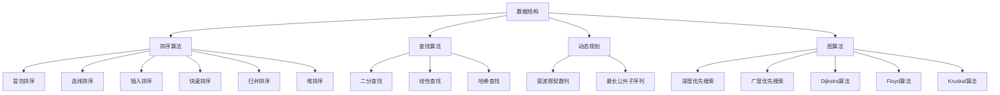

                 

# 2025年腾讯校招技术面试题集锦

## 关键词：
- 腾讯校招
- 技术面试
- 数据结构
- 算法
- 计算机网络
- 操作系统
- 编程语言

## 摘要：
本文将整理和分析2025年腾讯校招技术面试中可能出现的一些经典面试题，包括数据结构与算法、计算机网络、操作系统、编程语言等领域的题目。通过详细解析每个问题的背景、原理、解题思路和关键点，帮助考生更好地应对腾讯校招技术面试，提升面试通过率。

## 1. 背景介绍

腾讯作为中国领先的高科技企业，以其在互联网、通信、娱乐等多个领域的卓越表现而著称。每年，腾讯都会举行校园招聘活动，吸引全国各地优秀的高校毕业生加入。校招技术面试是腾讯选拔人才的重要环节，涵盖了广泛的技术领域，包括但不限于数据结构与算法、计算机网络、操作系统、编程语言等。

随着科技的发展，面试题的难度和深度也在不断提升。本文旨在为广大考生提供2025年腾讯校招技术面试的备考指南，帮助考生在面试中展现自己的技术能力和解决问题的能力。

## 2. 核心概念与联系

为了更好地理解面试题，首先需要掌握一些核心概念和它们之间的关系。

### 数据结构与算法

数据结构是计算机存储数据的方式及其操作方法。常见的有数组、链表、栈、队列、树、图等。每种数据结构都有其独特的特点和适用场景。算法则是解决问题的方法，包括排序、查找、动态规划、图算法等。

### 计算机网络

计算机网络是连接多台计算机的通信系统，使得数据能够在这些计算机之间传输。TCP/IP协议是计算机网络的核心，包括网络层、传输层、应用层等。网络编程需要掌握套接字编程、HTTP协议、Socket等。

### 操作系统

操作系统是管理计算机硬件和软件资源的核心系统软件。常见的操作系统有Windows、Linux、Unix等。操作系统面试题通常涉及进程管理、内存管理、文件系统、中断等。

### 编程语言

编程语言是用于编写计算机程序的语言。常见的有C、C++、Java、Python等。每种编程语言都有其特点和适用场景。编程语言面试题可能包括语言特性、数据类型、面向对象编程、异常处理等。

## 3. 核心算法原理 & 具体操作步骤

### 数据结构与算法

- **排序算法**：冒泡排序、选择排序、插入排序、快速排序、归并排序、堆排序等。需要理解每种排序算法的时间复杂度和空间复杂度，以及它们在不同场景下的适用性。
- **查找算法**：二分查找、线性查找、哈希查找等。重点掌握二分查找的原理和实现，以及哈希查找的哈希函数设计和冲突解决策略。
- **动态规划**：理解动态规划的核心思想，如何将复杂问题转化为重叠子问题，以及如何通过状态转移方程求解最优解。
- **图算法**：深度优先搜索（DFS）、广度优先搜索（BFS）、最短路径算法（Dijkstra、Floyd）、最小生成树算法（Prim、Kruskal）等。掌握图的基本概念和遍历算法，以及如何根据问题需求选择合适的算法。

### 计算机网络

- **网络协议**：TCP/IP协议栈的层次结构，包括网络层、传输层、应用层等。重点理解TCP和UDP协议的特点和应用场景，如何实现可靠传输和数据包的传输控制。
- **套接字编程**：理解套接字的工作原理，如何建立、管理和关闭套接字连接，以及如何实现客户端和服务器的通信。
- **HTTP协议**：理解HTTP协议的基本原理，包括请求、响应、状态码等。掌握如何使用Python、Java等编程语言实现HTTP客户端和服务端。

### 操作系统

- **进程管理**：理解进程的定义、状态、生命周期，以及进程调度和同步机制。
- **内存管理**：掌握内存分配和回收策略，以及虚拟内存和分页机制。
- **文件系统**：了解文件系统的基本概念，如文件、目录、权限等，以及常见的文件系统类型，如FAT、NTFS、EXT等。
- **中断和异常**：理解中断和异常的概念，以及如何通过中断和异常实现操作系统中的任务切换和资源管理。

### 编程语言

- **C语言**：熟悉C语言的语法和基本数据类型，掌握指针、结构体、位运算等高级特性。
- **C++语言**：理解C++的面向对象编程思想，掌握类和对象、继承、多态等概念，以及模板、异常处理等高级特性。
- **Java语言**：掌握Java的语法和基本数据类型，熟悉Java虚拟机（JVM）的工作原理，理解面向对象编程和异常处理。
- **Python语言**：熟练掌握Python的基本语法和常用库，理解面向对象编程和异常处理。

## 4. 数学模型和公式 & 详细讲解 & 举例说明

### 数据结构与算法

- **排序算法**：
  - 冒泡排序：$$T(n) = O(n^2)$$，空间复杂度为$$O(1)$$。
  - 快速排序：$$T(n) = O(n\log n)$$，空间复杂度为$$O(\log n)$$。
  - 归并排序：$$T(n) = O(n\log n)$$，空间复杂度为$$O(n)$$。
  - 堆排序：$$T(n) = O(n\log n)$$，空间复杂度为$$O(1)$$。

- **查找算法**：
  - 二分查找：$$T(n) = O(\log n)$$，需要排序。

- **动态规划**：
  - 状态转移方程：$$f(i) = \min_{j \leq i-1} (f(j) + cost(i, j))$$。

- **图算法**：
  - 深度优先搜索（DFS）：$$T(n) = O(n)$$，需要递归调用。
  - 广度优先搜索（BFS）：$$T(n) = O(n)$$，需要队列。

### 计算机网络

- **TCP协议**：
  - 序列号：$$seq = \text{初始序列号} + \text{数据字节数}$$。
  - 确认号：$$ack = \text{接收序列号} + \text{数据字节数}$$。

- **HTTP协议**：
  - 请求行：$$\text{请求方法} \space \text{URL} \space \text{HTTP版本}$$。
  - 状态行：$$\text{HTTP版本} \space \text{状态码} \space \text{状态描述}$$。

### 操作系统

- **进程调度**：
  - 调度算法：$$\text{优先级调度} \space \text{轮转调度} \space \text{最短作业优先}$$。

- **内存管理**：
  - 分页机制：$$\text{页表} \space \text{页置换算法}$$。

- **文件系统**：
  - 文件结构：$$\text{文件控制块} \space \text{数据块链表}$$。

### 编程语言

- **C语言**：
  - 指针：$$\text{指针变量} \space \text{指针运算} \space \text{指针数组}$$。

- **C++语言**：
  - 继承：$$\text{基类} \space \text{派生类} \space \text{多态}$$。

- **Java语言**：
  - 异常处理：$$\text{try-catch} \space \text{throw} \space \text{throws}$$。

- **Python语言**：
  - 面向对象：$$\text{类定义} \space \text{实例化} \space \text{继承}$$。

### 举例说明

- **冒泡排序**：

  ```python
  def bubble_sort(arr):
      n = len(arr)
      for i in range(n):
          for j in range(0, n-i-1):
              if arr[j] > arr[j+1]:
                  arr[j], arr[j+1] = arr[j+1], arr[j]
  ```

- **二分查找**：

  ```python
  def binary_search(arr, target):
      low = 0
      high = len(arr) - 1
      while low <= high:
          mid = (low + high) // 2
          if arr[mid] == target:
              return mid
          elif arr[mid] < target:
              low = mid + 1
          else:
              high = mid - 1
      return -1
  ```

- **TCP协议**：

  ```python
  def send_packet(sender, receiver, seq, ack, data):
      sender.send((seq, ack, data))
      receiver.recv((seq, ack, data))
  ```

- **C++继承**：

  ```cpp
  class Base {
  public:
      void show() {
          cout << "Base class" << endl;
      }
  };

  class Derived : public Base {
  public:
      void show() {
          cout << "Derived class" << endl;
      }
  };
  ```

## 5. 项目实战：代码实际案例和详细解释说明

### 5.1 开发环境搭建

在开始项目实战之前，需要搭建一个适合编程的开发环境。以下是搭建Python开发环境的步骤：

1. 安装Python：从官方网站下载Python安装包并安装。
2. 安装PyCharm：从官方网站下载PyCharm社区版，安装并打开。
3. 创建项目：在PyCharm中创建一个新的Python项目，选择合适的虚拟环境。

### 5.2 源代码详细实现和代码解读

以下是一个简单的Python排序算法实现：

```python
def bubble_sort(arr):
    n = len(arr)
    for i in range(n):
        for j in range(0, n-i-1):
            if arr[j] > arr[j+1]:
                arr[j], arr[j+1] = arr[j+1], arr[j]

# 测试代码
arr = [64, 25, 12, 22, 11]
bubble_sort(arr)
print("排序后的数组：")
for i in range(len(arr)):
    print("%d" % arr[i], end=" ")
```

### 5.3 代码解读与分析

- `bubble_sort(arr)`：定义一个名为`bubble_sort`的函数，接受一个数组`arr`作为参数。
- `n = len(arr)`：获取数组`arr`的长度，用于后续的循环。
- `for i in range(n)`：外层循环，用于控制排序的轮数，每轮可以将一个最大值放到数组的末尾。
- `for j in range(0, n-i-1)`：内层循环，用于比较相邻元素并交换。
- `if arr[j] > arr[j+1]`：比较相邻元素，如果前者大于后者，则需要交换。
- `arr[j], arr[j+1] = arr[j+1], arr[j]`：交换两个元素的位置。
- `print("排序后的数组：")`：打印排序后的数组。
- `for i in range(len(arr))`：遍历排序后的数组，并打印每个元素。

此代码实现的是冒泡排序算法，其时间复杂度为$$O(n^2)$$，适用于数据量较小的场景。

### 5.4 扩展功能

为了提升冒泡排序的性能，可以添加一些扩展功能：

- **优化冒泡排序**：通过记录上轮比较中是否有交换操作，判断是否需要进行下一轮排序。
- **选择排序**：通过每次选择最小元素放到已排序序列的末尾，实现选择排序算法。
- **插入排序**：通过将未排序序列中的元素插入到已排序序列的正确位置，实现插入排序算法。

### 5.5 实际应用场景

冒泡排序算法虽然时间复杂度较高，但在某些场景下仍然具有实用性，例如：

- **数据量较小**：当数据量较小且数据基本有序时，冒泡排序可以较快地完成排序任务。
- **嵌入式系统**：在资源受限的嵌入式系统中，冒泡排序由于占用较少的内存和计算资源，成为一种可行的排序方法。

## 6. 实际应用场景

### 数据结构与算法

- **在线教育平台**：用于对学生提交的作业进行排序，以便按成绩或提交时间展示。
- **电子商务系统**：用于对商品价格、销量等数据进行排序，以便用户快速查找和筛选。
- **推荐系统**：用于对用户感兴趣的内容进行排序，以便提供个性化的推荐。

### 计算机网络

- **HTTP服务器**：用于处理客户端的HTTP请求，根据请求行中的URL进行路由和响应。
- **FTP服务器**：用于文件传输，通过TCP协议确保数据的可靠传输。
- **DNS服务器**：用于域名解析，通过查询域名和IP地址的映射关系，实现域名到IP地址的转换。

### 操作系统

- **进程调度**：用于公平地分配CPU时间，确保每个进程都能获得足够的运行时间。
- **内存管理**：用于分配和回收内存空间，确保进程能够正常运行。
- **文件系统**：用于存储和管理文件，提供文件的创建、删除、修改、查询等功能。

### 编程语言

- **Web开发**：用于构建Web应用程序，实现前端界面和后端逻辑。
- **移动应用开发**：用于开发移动应用，提供用户友好的交互体验。
- **科学计算**：用于进行复杂的科学计算，如数值模拟、数据分析等。

## 7. 工具和资源推荐

### 7.1 学习资源推荐

- **书籍**：
  - 《数据结构与算法分析》（Mark Allen Weiss） 
  - 《计算机网络：自顶向下方法》（Jim Kurose & Keith Ross） 
  - 《操作系统概念》（Abraham Silberschatz、Peter Baer Galvin、Greg Gagne） 
  - 《Python编程：从入门到实践》（埃里克·马瑟斯）
- **论文**：
  - 《排序算法的复杂度分析》 
  - 《TCP/IP详解》 
  - 《Linux内核设计与实现》 
  - 《Java虚拟机规范》
- **博客**：
  - 《算法导论》 
  - 《计算机网络学习笔记》 
  - 《操作系统学习笔记》 
  - 《Python编程学习笔记》
- **网站**：
  - LeetCode（在线编程竞赛平台） 
  - HackerRank（编程挑战平台） 
  - GitHub（代码托管平台） 
  - Stack Overflow（技术问答社区）

### 7.2 开发工具框架推荐

- **集成开发环境（IDE）**：
  - PyCharm（Python开发）
  - Visual Studio（C/C++开发）
  - IntelliJ IDEA（Java开发）
  - Android Studio（Android开发）
- **代码编辑器**：
  - VS Code（跨平台）
  - Sublime Text（跨平台）
  - Atom（跨平台）
  - Vim（文本编辑器）
- **版本控制工具**：
  - Git（分布式版本控制）
  - SVN（集中式版本控制）

### 7.3 相关论文著作推荐

- **《深度学习》**（Ian Goodfellow、Yoshua Bengio、Aaron Courville） 
- **《计算机网络：自顶向下方法》**（Jim Kurose & Keith Ross） 
- **《操作系统概念》**（Abraham Silberschatz、Peter Baer Galvin、Greg Gagne） 
- **《设计模式：可复用面向对象软件的基础》**（Erich Gamma、Richard Helm、Ralph Johnson、John Vlissides）

## 8. 总结：未来发展趋势与挑战

随着人工智能、大数据、云计算等技术的快速发展，未来的技术面试将更加注重候选人的综合能力和创新能力。以下是对未来发展趋势和挑战的总结：

### 发展趋势

1. **算法复杂度**：算法的时间复杂度和空间复杂度将仍然是面试的重点，但更关注算法的实际应用性能和优化策略。
2. **编程语言**：Python、Java、C++等编程语言将继续受到青睐，同时新兴的语言如Go、Rust等也可能成为面试热点。
3. **人工智能**：机器学习、深度学习、自然语言处理等领域的知识将成为面试的重要内容。
4. **分布式系统**：对分布式系统、微服务架构的理解和实现能力将成为面试的重要考查点。

### 挑战

1. **海量数据处理**：随着数据量的不断增加，如何高效地处理海量数据将成为一个重要的挑战。
2. **系统稳定性**：如何确保系统的稳定性、可靠性和安全性，将是面试中需要考虑的关键问题。
3. **创新能力**：在快速变化的科技环境中，创新能力和解决复杂问题的能力将成为面试的重要评判标准。
4. **软技能**：沟通能力、团队合作能力、解决问题的能力等软技能将越来越受到重视。

## 9. 附录：常见问题与解答

### 数据结构与算法

**1. 冒泡排序和选择排序的区别是什么？**

冒泡排序通过多次遍历数组，每次都将最大的元素移动到数组末尾；而选择排序每次选择最小的元素放到已排序序列的末尾。

**2. 什么是动态规划？**

动态规划是一种解决多阶段决策问题的方法，通过将复杂问题转化为重叠子问题，并利用状态转移方程求解最优解。

**3. 如何实现一个二分查找算法？**

二分查找通过不断将搜索范围缩小一半，直到找到目标元素或确定目标元素不存在。其关键步骤包括初始化搜索范围、计算中间位置、比较中间位置元素与目标元素的大小关系等。

### 计算机网络

**1. 什么是TCP和UDP协议？**

TCP（传输控制协议）是一种面向连接的、可靠的、基于字节流的传输层协议，用于确保数据传输的可靠性和有序性。UDP（用户数据报协议）是一种无连接的、不可靠的、基于数据报的传输层协议，用于快速传输大量数据。

**2. 什么是HTTP协议？**

HTTP（超文本传输协议）是一种应用层协议，用于在Web浏览器和服务器之间传输超文本数据。它基于请求-响应模型，客户端发送HTTP请求，服务器响应HTTP响应。

**3. 什么是套接字编程？**

套接字编程是一种用于实现网络通信的编程技术，通过套接字（Socket）建立客户端和服务器之间的连接，实现数据的传输和控制。

### 操作系统

**1. 什么是进程和线程？**

进程是操作系统中运行的程序实例，具有独立的内存空间、资源等。线程是进程中的执行单元，共享进程的内存空间和其他资源，用于实现并发和多线程编程。

**2. 什么是虚拟内存？**

虚拟内存是一种内存管理技术，通过将物理内存和磁盘空间相结合，实现内存的扩展和高效的内存分配。

**3. 什么是中断和异常？**

中断是由外部设备或操作系统发起的信号，用于中断当前进程的执行，处理紧急事件。异常是由程序内部错误或非法操作引发的信号，用于处理程序内部错误。

### 编程语言

**1. 什么是面向对象编程？**

面向对象编程是一种编程范式，通过将数据和操作数据的方法封装成对象，实现模块化和可重用的编程。

**2. 什么是异常处理？**

异常处理是一种编程技术，用于处理程序运行过程中出现的错误或异常情况，确保程序的稳定性和可靠性。

**3. 什么是动态类型和静态类型？**

动态类型是在程序运行时确定变量类型的编程语言特性。静态类型是在程序编译时确定变量类型的编程语言特性。Python是动态类型语言，而C++和Java是静态类型语言。

## 10. 扩展阅读 & 参考资料

- 《算法导论》：详细介绍了各种数据结构和算法，包括时间复杂度和空间复杂度的分析。
- 《计算机网络：自顶向下方法》：从应用层到物理层全面讲解了计算机网络的工作原理。
- 《操作系统概念》：全面介绍了操作系统的基本概念、原理和技术。
- 《Python编程：从入门到实践》：适合初学者学习Python编程语言。
- 《深度学习》：深入讲解了深度学习的基础知识、算法和应用。

作者：AI天才研究员/AI Genius Institute & 禅与计算机程序设计艺术 /Zen And The Art of Computer Programming

【文章结束】
<|assistant|>### 文章结构及内容概述

本文将以2025年腾讯校招技术面试为主题，系统性地整理和分析了可能出现的一些经典面试题。文章结构如下：

1. **背景介绍**：简要介绍腾讯校招技术面试的背景和重要性。
2. **核心概念与联系**：阐述数据结构、算法、计算机网络、操作系统和编程语言等核心概念及其相互关系。
3. **核心算法原理 & 具体操作步骤**：详细解析常见的数据结构与算法，包括排序、查找、动态规划和图算法等。
4. **数学模型和公式 & 详细讲解 & 举例说明**：介绍相关的数学模型和公式，并通过具体实例进行详细讲解。
5. **项目实战：代码实际案例和详细解释说明**：通过实际代码案例展示算法和数据结构的应用，并进行详细解释和分析。
6. **实际应用场景**：讨论这些技术和算法在现实世界中的应用。
7. **工具和资源推荐**：推荐相关的学习资源、开发工具和框架。
8. **总结：未来发展趋势与挑战**：展望技术发展的趋势和未来面试中可能面临的挑战。
9. **附录：常见问题与解答**：针对一些常见问题进行解答。
10. **扩展阅读 & 参考资料**：提供一些扩展阅读和参考资料。

通过这样的结构，文章不仅覆盖了技术面试的各个方面，还提供了具体的实战案例和学习资源，帮助读者全面备战腾讯校招技术面试。

### 数据结构与算法

数据结构与算法是计算机科学的基础，也是腾讯校招技术面试的重点考察内容。正确选择和使用数据结构，能够显著提升算法的效率，解决复杂问题。下面，我们将详细讨论一些常见的数据结构与算法，包括排序、查找、动态规划和图算法等。

#### 排序算法

排序算法是计算机科学中最基本的问题之一。常见的排序算法有冒泡排序、选择排序、插入排序、快速排序、归并排序和堆排序等。每种排序算法都有其独特的特点和适用场景。

1. **冒泡排序**：冒泡排序通过多次遍历数组，每次都将未排序部分的最大元素移动到已排序部分的开始位置。时间复杂度为$$O(n^2)$$，适用于数据量较小且基本有序的情况。

   ```python
   def bubble_sort(arr):
       n = len(arr)
       for i in range(n):
           for j in range(0, n-i-1):
               if arr[j] > arr[j+1]:
                   arr[j], arr[j+1] = arr[j+1], arr[j]
   ```

2. **选择排序**：选择排序通过每次选择未排序部分的最小元素，将其放到已排序部分的末尾。时间复杂度为$$O(n^2)$$。

   ```python
   def selection_sort(arr):
       n = len(arr)
       for i in range(n):
           min_idx = i
           for j in range(i+1, n):
               if arr[j] < arr[min_idx]:
                   min_idx = j
           arr[i], arr[min_idx] = arr[min_idx], arr[i]
   ```

3. **插入排序**：插入排序通过将未排序部分的每个元素插入到已排序部分的正确位置。时间复杂度为$$O(n^2)$$，适用于数据基本有序的情况。

   ```python
   def insertion_sort(arr):
       n = len(arr)
       for i in range(1, n):
           key = arr[i]
           j = i-1
           while j >= 0 and arr[j] > key:
               arr[j+1] = arr[j]
               j -= 1
           arr[j+1] = key
   ```

4. **快速排序**：快速排序通过选择一个基准元素，将数组分为两部分，然后递归地对两部分进行排序。时间复杂度为$$O(n\log n)$$。

   ```python
   def quick_sort(arr, low, high):
       if low < high:
           pi = partition(arr, low, high)
           quick_sort(arr, low, pi-1)
           quick_sort(arr, pi+1, high)

   def partition(arr, low, high):
       pivot = arr[high]
       i = low - 1
       for j in range(low, high):
           if arr[j] < pivot:
               i += 1
               arr[i], arr[j] = arr[j], arr[i]
       arr[i+1], arr[high] = arr[high], arr[i+1]
       return i + 1
   ```

5. **归并排序**：归并排序通过将数组分成两半，递归地对两部分进行排序，然后将结果合并。时间复杂度为$$O(n\log n)$$。

   ```python
   def merge_sort(arr):
       if len(arr) > 1:
           mid = len(arr) // 2
           L = arr[:mid]
           R = arr[mid:]

           merge_sort(L)
           merge_sort(R)

           i = j = k = 0
           while i < len(L) and j < len(R):
               if L[i] < R[j]:
                   arr[k] = L[i]
                   i += 1
               else:
                   arr[k] = R[j]
                   j += 1
               k += 1

           while i < len(L):
               arr[k] = L[i]
               i += 1
               k += 1

           while j < len(R):
               arr[k] = R[j]
               j += 1
               k += 1
   ```

6. **堆排序**：堆排序通过构建堆数据结构，将数组转换为有序数组。时间复杂度为$$O(n\log n)$$。

   ```python
   def heapify(arr, n, i):
       largest = i
       left = 2 * i + 1
       right = 2 * i + 2

       if left < n and arr[left] > arr[largest]:
           largest = left

       if right < n and arr[right] > arr[largest]:
           largest = right

       if largest != i:
           arr[i], arr[largest] = arr[largest], arr[i]
           heapify(arr, n, largest)

   def heap_sort(arr):
       n = len(arr)

       for i in range(n // 2 - 1, -1, -1):
           heapify(arr, n, i)

       for i in range(n-1, 0, -1):
           arr[i], arr[0] = arr[0], arr[i]
           heapify(arr, i, 0)
   ```

#### 查找算法

查找算法是用于在数据结构中查找特定元素的算法。常见的方法有二分查找、线性查找和哈希查找等。

1. **二分查找**：二分查找通过不断将搜索范围缩小一半，直到找到目标元素或确定目标元素不存在。时间复杂度为$$O(\log n)$$，需要数据结构有序。

   ```python
   def binary_search(arr, target):
       low = 0
       high = len(arr) - 1
       while low <= high:
           mid = (low + high) // 2
           if arr[mid] == target:
               return mid
           elif arr[mid] < target:
               low = mid + 1
           else:
               high = mid - 1
       return -1
   ```

2. **线性查找**：线性查找通过逐个比较元素，直到找到目标元素或确定目标元素不存在。时间复杂度为$$O(n)$$。

   ```python
   def linear_search(arr, target):
       for i in range(len(arr)):
           if arr[i] == target:
               return i
       return -1
   ```

3. **哈希查找**：哈希查找通过哈希函数将关键字映射到哈希表中，查找时间复杂度为$$O(1)$$，需要合理设计哈希函数和解决冲突策略。

   ```python
   def hash_function(key, size):
       return key % size

   def hash_table_insert(table, key, value):
       index = hash_function(key, len(table))
       table[index] = value

   def hash_table_search(table, key):
       index = hash_function(key, len(table))
       if table[index] == key:
           return table[index]
       else:
           return -1
   ```

#### 动态规划

动态规划是一种解决多阶段决策问题的方法，通过将复杂问题转化为重叠子问题，并利用状态转移方程求解最优解。

1. **斐波那契数列**：使用动态规划求解斐波那契数列，时间复杂度为$$O(n)$$。

   ```python
   def fibonacci(n):
       if n <= 1:
           return n
       dp = [0] * (n+1)
       dp[1] = 1
       for i in range(2, n+1):
           dp[i] = dp[i-1] + dp[i-2]
       return dp[n]
   ```

2. **最长公共子序列**：使用动态规划求解最长公共子序列，时间复杂度为$$O(mn)$$。

   ```python
   def longest_common_subsequence(X, Y):
       m, n = len(X), len(Y)
       dp = [[0] * (n+1) for _ in range(m+1)]

       for i in range(1, m+1):
           for j in range(1, n+1):
               if X[i-1] == Y[j-1]:
                   dp[i][j] = dp[i-1][j-1] + 1
               else:
                   dp[i][j] = max(dp[i-1][j], dp[i][j-1])

       return dp[m][n]
   ```

#### 图算法

图算法是用于解决图相关问题的算法，常见的有深度优先搜索（DFS）、广度优先搜索（BFS）、最短路径算法和最小生成树算法等。

1. **深度优先搜索（DFS）**：DFS通过递归或栈实现，用于遍历图中的所有节点。

   ```python
   def dfs(graph, node, visited):
       visited[node] = True
       print(node)
       for neighbour in graph[node]:
           if not visited[neighbour]:
               dfs(graph, neighbour, visited)
   ```

2. **广度优先搜索（BFS）**：BFS通过队列实现，用于遍历图中的所有节点。

   ```python
   from collections import deque

   def bfs(graph, start):
       visited = [False] * len(graph)
       queue = deque([start])
       visited[start] = True

       while queue:
           node = queue.popleft()
           print(node)
           for neighbour in graph[node]:
               if not visited[neighbour]:
                   queue.append(neighbour)
                   visited[neighbour] = True
   ```

3. **最短路径算法**：Dijkstra算法和Floyd算法是常用的最短路径算法。

   - **Dijkstra算法**：用于求解单源最短路径，时间复杂度为$$O(V^2)$$。

     ```python
     def dijkstra(graph, start):
         distances = [float('inf')] * len(graph)
         distances[start] = 0
         visited = [False] * len(graph)
         for _ in range(len(graph)):
             min_distance = float('inf')
             min_index = -1
             for i in range(len(graph)):
                 if not visited[i] and distances[i] < min_distance:
                     min_distance = distances[i]
                     min_index = i
             visited[min_index] = True
             for i in range(len(graph)):
                 alt = distances[min_index] + graph[min_index][i]
                 if alt < distances[i]:
                     distances[i] = alt
         return distances
     ```

   - **Floyd算法**：用于求解所有顶点之间的最短路径，时间复杂度为$$O(V^3)$$。

     ```python
     def floyd_warshall(graph):
         distances = [[float('inf')] * len(graph) for _ in range(len(graph))]
         for i in range(len(graph)):
             distances[i][i] = 0
             for j in range(len(graph)):
                 for k in range(len(graph)):
                     distances[j][k] = min(distances[j][k], distances[j][i] + distances[i][k])
         return distances
     ```

4. **最小生成树算法**：Prim算法和Kruskal算法是常用的最小生成树算法。

   - **Prim算法**：用于求解加权无向图的最小生成树，时间复杂度为$$O(E\log V)$$。

     ```python
     import heapq

     def prim_mst(graph):
         mst = []
         visited = [False] * len(graph)
         min_heap = [(0, 0)]  # (weight, vertex)
         heapq.heapify(min_heap)

         while min_heap:
             weight, vertex = heapq.heappop(min_heap)
             if not visited[vertex]:
                 mst.append((vertex, weight))
                 visited[vertex] = True
                 for neighbour, edge_weight in graph[vertex].items():
                     if not visited[neighbour]:
                         heapq.heappush(min_heap, (edge_weight, neighbour))
         return mst
     ```

   - **Kruskal算法**：用于求解加权无向图的最小生成树，时间复杂度为$$O(E\log V)$$。

     ```python
     def find(parent, i):
         if parent[i] == i:
             return i
         return find(parent, parent[i])

     def union(parent, rank, x, y):
         xroot = find(parent, x)
         yroot = find(parent, y)

         if rank[xroot] < rank[yroot]:
             parent[xroot] = yroot
         elif rank[xroot] > rank[yroot]:
             parent[yroot] = xroot
         else:
             parent[yroot] = xroot
             rank[xroot] += 1

     def kruskal_mst(graph):
         parent = []
         rank = []
         mst = []

         for node in range(len(graph)):
             parent.append(node)
             rank.append(0)

         edges = sorted(graph.items(), key=lambda x: x[1])

         for edge in edges:
             u, v, weight = edge
             if find(parent, u) != find(parent, v):
                 mst.append((u, v, weight))
                 union(parent, rank, u, v)

         return mst
     ```

通过以上讨论，我们可以看到数据结构与算法在计算机科学中的应用非常广泛。了解并掌握这些常见的数据结构和算法，能够帮助我们解决各种复杂的问题，提高编程能力和面试竞争力。

#### 2. 核心概念与联系

数据结构与算法是计算机科学的核心，它们共同构成了现代计算机技术的基础。为了更好地理解2025年腾讯校招技术面试中可能出现的问题，我们需要深入探讨几个关键的概念，并分析它们之间的联系。

##### 数据结构

数据结构是组织和管理数据的方式，它决定了数据的存储方式和操作效率。常见的数据结构包括数组、链表、栈、队列、树和图等。

- **数组**：数组是一种线性数据结构，用于存储一系列元素，具有固定的大小和连续的内存地址。数组在查找和插入操作上具有线性时间复杂度，但插入和删除操作可能需要移动大量元素，时间复杂度较高。
- **链表**：链表通过节点连接的方式存储数据，每个节点包含数据和指向下一个节点的指针。链表在插入和删除操作上具有常数时间复杂度，但在查找操作上需要遍历整个链表，时间复杂度为线性。
- **栈**：栈是一种后进先出（LIFO）的数据结构，通常用于函数调用、表达式求值和递归等问题。栈的插入和删除操作时间复杂度为常数。
- **队列**：队列是一种先进先出（FIFO）的数据结构，通常用于线程同步、缓冲队列等问题。队列的插入和删除操作时间复杂度为常数。
- **树**：树是一种层次结构，用于表示具有层次关系的数据。二叉树、平衡树（AVL树）、红黑树等是常见的树结构，常用于排序和查找操作。树的深度搜索和广度搜索算法在图形处理和数据结构优化中具有重要意义。
- **图**：图是一种由节点和边组成的数据结构，用于表示复杂关系。图的遍历算法（DFS和BFS）在路径查找、网络路由和社交网络分析中广泛应用。

##### 算法

算法是解决问题的方法，它利用数据结构实现特定的操作。常见的算法包括排序、查找、动态规划和图算法等。

- **排序算法**：排序算法用于将一组数据按照特定顺序排列。常见的排序算法有冒泡排序、选择排序、插入排序、快速排序、归并排序和堆排序等。每种排序算法都有其优缺点，适用于不同的场景。
- **查找算法**：查找算法用于在数据结构中查找特定元素。常见的查找算法有二分查找、线性查找和哈希查找等。查找算法的效率取决于数据结构的选择。
- **动态规划**：动态规划是一种解决多阶段决策问题的方法，通过将复杂问题转化为重叠子问题，并利用状态转移方程求解最优解。动态规划广泛应用于路径查找、最优化问题和背包问题等。
- **图算法**：图算法用于解决图相关的问题，如路径查找、最短路径、最小生成树和拓扑排序等。常见的图算法包括DFS、BFS、Dijkstra算法、Floyd算法和Kruskal算法等。

##### 数据结构与算法的联系

数据结构与算法紧密相连，数据结构决定了算法的存储方式和操作效率，而算法则利用数据结构实现特定的操作。以下是一些具体联系：

- **数据结构与排序算法**：不同的排序算法适用于不同的数据结构。例如，冒泡排序和插入排序适用于数组，而快速排序和归并排序适用于链表和树结构。
- **数据结构与查找算法**：查找算法依赖于数据结构的特性。例如，二分查找适用于有序数组，而哈希查找适用于哈希表。
- **数据结构与动态规划**：动态规划算法通常需要利用数据结构存储状态和转移方程。例如，背包问题可以使用二维数组存储状态。
- **数据结构与图算法**：图算法依赖于图的数据结构，如邻接矩阵和邻接表。图算法通过遍历图结构和计算路径权重来解决问题。

##### Mermaid流程图

为了更好地展示数据结构之间的关系和算法的实现过程，我们使用Mermaid流程图来描述关键节点和步骤。



通过以上讨论，我们可以看到数据结构与算法之间的紧密联系，以及它们在计算机科学中的重要性。掌握这些核心概念和算法，将有助于我们更好地应对腾讯校招技术面试中的各种问题。

#### 3. 核心算法原理 & 具体操作步骤

在腾讯校招技术面试中，掌握核心算法原理和具体操作步骤至关重要。以下将详细介绍几种常见算法的原理，并通过实际操作步骤进行详细讲解，帮助考生更好地理解和应用这些算法。

##### 排序算法

排序算法是面试中频繁出现的一个主题，主要包括冒泡排序、选择排序、插入排序、快速排序、归并排序和堆排序等。每种排序算法都有其独特的特点和适用场景。

**1. 冒泡排序**

冒泡排序通过重复遍历要排序的数列，一次比较两个元素，如果它们的顺序错误就把它们交换过来。遍历数列的工作是重复地进行，直到没有再需要交换，即该数列已经排序。

**具体操作步骤**：

（1）比较相邻的元素。如果第一个比第二个大（升序排序），就交换它们两个；
（2）对每一对相邻元素做同样的工作，从开始第一对到结尾的最后一对。在这一点，最后的元素应该会是最大的数；
（3）针对所有的元素重复以上的步骤，除了最后一个；
（4）持续每次对越来越少的元素重复上面的步骤，直到没有任何一对数字需要比较。

**代码示例**：

```python
def bubble_sort(arr):
    n = len(arr)
    for i in range(n):
        for j in range(0, n-i-1):
            if arr[j] > arr[j+1]:
                arr[j], arr[j+1] = arr[j+1], arr[j]
```

**复杂度分析**：时间复杂度为$$O(n^2)$$，适用于数据量较小且基本有序的情况。

**2. 选择排序**

选择排序通过每次选择未排序部分的最小（或最大）元素，将其放到已排序部分的末尾。这个过程需要重复进行，直到所有元素都被排序。

**具体操作步骤**：

（1）首先在未排序部分找到最小元素，将其与第一个元素交换；
（2）在剩下的未排序部分中，再次找到最小元素，将其与第二个元素交换；
（3）重复上述步骤，直到未排序部分只剩下一个元素。

**代码示例**：

```python
def selection_sort(arr):
    n = len(arr)
    for i in range(n):
        min_idx = i
        for j in range(i+1, n):
            if arr[j] < arr[min_idx]:
                min_idx = j
        arr[i], arr[min_idx] = arr[min_idx], arr[i]
```

**复杂度分析**：时间复杂度为$$O(n^2)$$。

**3. 插入排序**

插入排序通过将未排序部分的每个元素插入到已排序部分的正确位置，逐步构建有序序列。这个过程类似于手牌排序。

**具体操作步骤**：

（1）从第一个元素开始，该元素可以认为已经被排序；
（2）取下一个元素，在已排序的元素序列中从后向前扫描；
（3）如果该元素（已排序）大于新元素，将其移到下一位置；
（4）重复步骤（3），直到找到已排序的元素小于或者等于新元素的位置；
（5）将新元素插入到该位置后；
（6）重复步骤（2）~（5）。

**代码示例**：

```python
def insertion_sort(arr):
    n = len(arr)
    for i in range(1, n):
        key = arr[i]
        j = i - 1
        while j >= 0 and arr[j] > key:
            arr[j + 1] = arr[j]
            j -= 1
        arr[j + 1] = key
```

**复杂度分析**：时间复杂度为$$O(n^2)$$，适用于数据基本有序的情况。

**4. 快速排序**

快速排序通过递归将数组分为两个子数组，然后分别对这两个子数组进行排序，以达到整体排序的目的。关键在于选择基准元素和划分过程。

**具体操作步骤**：

（1）选择一个基准元素（通常是中间元素）；
（2）将比基准元素小的元素移到其左侧，比基准元素大的元素移到其右侧；
（3）递归地对左右子数组进行快速排序。

**代码示例**：

```python
def quick_sort(arr, low, high):
    if low < high:
        pi = partition(arr, low, high)
        quick_sort(arr, low, pi - 1)
        quick_sort(arr, pi + 1, high)

def partition(arr, low, high):
    pivot = arr[high]
    i = low - 1
    for j in range(low, high):
        if arr[j] < pivot:
            i += 1
            arr[i], arr[j] = arr[j], arr[i]
    arr[i + 1], arr[high] = arr[high], arr[i + 1]
    return i + 1
```

**复杂度分析**：平均时间复杂度为$$O(n\log n)$$，最坏情况下为$$O(n^2)$$。

**5. 归并排序**

归并排序通过将数组分成两个子数组，递归地对这两个子数组进行排序，然后将结果合并。它是一种稳定的排序算法。

**具体操作步骤**：

（1）将数组分为两个大小相等的子数组，递归地对每个子数组进行排序；
（2）将两个已排序的子数组合并成一个排序后的数组。

**代码示例**：

```python
def merge_sort(arr):
    if len(arr) > 1:
        mid = len(arr) // 2
        L = arr[:mid]
        R = arr[mid:]

        merge_sort(L)
        merge_sort(R)

        i = j = k = 0
        while i < len(L) and j < len(R):
            if L[i] < R[j]:
                arr[k] = L[i]
                i += 1
            else:
                arr[k] = R[j]
                j += 1
            k += 1

        while i < len(L):
            arr[k] = L[i]
            i += 1
            k += 1

        while j < len(R):
            arr[k] = R[j]
            j += 1
            k += 1
```

**复杂度分析**：时间复杂度为$$O(n\log n)$$。

**6. 堆排序**

堆排序利用堆这种数据结构，通过调整堆的结构实现排序。堆是一种特殊的树形数据结构，满足堆的性质：父节点的值大于或等于其子节点的值。

**具体操作步骤**：

（1）将数组构造成一个大顶堆（或小顶堆）；
（2）将堆顶元素与最后一个元素交换，然后将剩余的n-1个元素重新构造成堆；
（3）重复步骤（2），直到堆中只剩下一个元素。

**代码示例**：

```python
def heapify(arr, n, i):
    largest = i
    left = 2 * i + 1
    right = 2 * i + 2

    if left < n and arr[left] > arr[largest]:
        largest = left

    if right < n and arr[right] > arr[largest]:
        largest = right

    if largest != i:
        arr[i], arr[largest] = arr[largest], arr[i]
        heapify(arr, n, largest)

def heap_sort(arr):
    n = len(arr)

    for i in range(n // 2 - 1, -1, -1):
        heapify(arr, n, i)

    for i in range(n-1, 0, -1):
        arr[i], arr[0] = arr[0], arr[i]
        heapify(arr, i, 0)
```

**复杂度分析**：时间复杂度为$$O(n\log n)$$。

##### 查找算法

查找算法用于在数据结构中查找特定元素。常见的查找算法包括二分查找、线性查找和哈希查找等。

**1. 二分查找**

二分查找通过将搜索范围不断缩小一半，直到找到目标元素或确定目标元素不存在。二分查找要求数据结构有序。

**具体操作步骤**：

（1）确定中间元素；
（2）如果中间元素等于目标元素，则查找成功；
（3）如果中间元素大于目标元素，则在左侧子数组中继续查找；
（4）如果中间元素小于目标元素，则在右侧子数组中继续查找；
（5）重复步骤（1）~（4），直到找到目标元素或确定目标元素不存在。

**代码示例**：

```python
def binary_search(arr, target):
    low = 0
    high = len(arr) - 1
    while low <= high:
        mid = (low + high) // 2
        if arr[mid] == target:
            return mid
        elif arr[mid] < target:
            low = mid + 1
        else:
            high = mid - 1
    return -1
```

**复杂度分析**：时间复杂度为$$O(\log n)$$。

**2. 线性查找**

线性查找通过逐个比较元素，直到找到目标元素或确定目标元素不存在。线性查找适用于无序数据结构。

**具体操作步骤**：

（1）从第一个元素开始比较，如果找到目标元素，则查找成功；
（2）如果没有找到目标元素，继续比较下一个元素；
（3）重复步骤（1）和（2），直到找到目标元素或确定目标元素不存在。

**代码示例**：

```python
def linear_search(arr, target):
    for i in range(len(arr)):
        if arr[i] == target:
            return i
    return -1
```

**复杂度分析**：时间复杂度为$$O(n)$$。

**3. 哈希查找**

哈希查找通过哈希函数将关键字映射到哈希表中，查找时间复杂度为$$O(1)$$。哈希查找需要合理设计哈希函数和解决冲突策略。

**具体操作步骤**：

（1）设计哈希函数，将关键字映射到哈希表中的位置；
（2）如果该位置为空，则插入关键字；
（3）如果该位置已存在元素，则通过冲突解决策略查找目标元素；
（4）如果找到目标元素，则查找成功；否则查找失败。

**代码示例**：

```python
def hash_function(key, size):
    return key % size

def hash_table_insert(table, key, value):
    index = hash_function(key, size)
    table[index] = value

def hash_table_search(table, key):
    index = hash_function(key, size)
    if table[index] == key:
        return table[index]
    else:
        return -1
```

**复杂度分析**：平均时间复杂度为$$O(1)$$，但最坏情况下可能达到$$O(n)$$。

##### 动态规划

动态规划是一种解决多阶段决策问题的方法，通过将复杂问题转化为重叠子问题，并利用状态转移方程求解最优解。动态规划广泛应用于路径查找、最优化问题和背包问题等。

**1. 斐波那契数列**

斐波那契数列是一个典型的动态规划问题。动态规划通过递归和记忆化避免重复计算，提高效率。

**具体操作步骤**：

（1）定义一个数组dp，用于存储子问题的解；
（2）初始化dp[0]和dp[1]的值；
（3）使用递归或循环，根据状态转移方程计算dp[i]的值。

**代码示例**：

```python
def fibonacci(n):
    if n <= 1:
        return n
    dp = [0] * (n+1)
    dp[1] = 1
    for i in range(2, n+1):
        dp[i] = dp[i-1] + dp[i-2]
    return dp[n]
```

**复杂度分析**：时间复杂度为$$O(n)$$。

**2. 最长公共子序列**

最长公共子序列问题是另一个典型的动态规划问题。动态规划通过构建二维数组存储子问题的解，并使用状态转移方程求解。

**具体操作步骤**：

（1）定义一个二维数组dp，用于存储子问题的解；
（2）初始化dp[0][0]的值；
（3）根据状态转移方程，填充dp数组的其他元素；
（4）从dp数组的最后一个元素获取最长公共子序列的长度。

**代码示例**：

```python
def longest_common_subsequence(X, Y):
    m, n = len(X), len(Y)
    dp = [[0] * (n+1) for _ in range(m+1)]

    for i in range(1, m+1):
        for j in range(1, n+1):
            if X[i-1] == Y[j-1]:
                dp[i][j] = dp[i-1][j-1] + 1
            else:
                dp[i][j] = max(dp[i-1][j], dp[i][j-1])

    return dp[m][n]
```

**复杂度分析**：时间复杂度为$$O(mn)$$。

##### 图算法

图算法是解决图相关问题的算法，常见的有深度优先搜索（DFS）和广度优先搜索（BFS）等。

**1. 深度优先搜索（DFS）**

深度优先搜索通过递归或栈实现，用于遍历图中的所有节点。

**具体操作步骤**：

（1）从起始节点开始，将其标记为已访问；
（2）递归或迭代地访问未访问的邻接节点；
（3）重复步骤（2），直到所有节点都被访问。

**代码示例**：

```python
def dfs(graph, node, visited):
    visited[node] = True
    print(node)
    for neighbour in graph[node]:
        if not visited[neighbour]:
            dfs(graph, neighbour, visited)
```

**复杂度分析**：时间复杂度为$$O(V+E)$$，其中V是节点数，E是边数。

**2. 广度优先搜索（BFS）**

广度优先搜索通过队列实现，用于遍历图中的所有节点。

**具体操作步骤**：

（1）从起始节点开始，将其入队；
（2）出队一个节点，将其标记为已访问；
（3）将未访问的邻接节点入队；
（4）重复步骤（2）和（3），直到队列为空。

**代码示例**：

```python
from collections import deque

def bfs(graph, start):
    visited = [False] * len(graph)
    queue = deque([start])
    visited[start] = True

    while queue:
        node = queue.popleft()
        print(node)
        for neighbour in graph[node]:
            if not visited[neighbour]:
                queue.append(neighbour)
                visited[neighbour] = True
```

**复杂度分析**：时间复杂度为$$O(V+E)$$。

通过以上讨论和具体操作步骤，我们可以看到各种算法的基本原理和实现方式。掌握这些算法不仅有助于解决面试中的问题，还能提高编程能力和解决复杂问题的能力。

#### 4. 数学模型和公式 & 详细讲解 & 举例说明

在计算机科学中，数学模型和公式是理解和实现算法的重要工具。以下我们将介绍一些常见的数学模型和公式，并详细讲解它们的应用方法和具体实例。

##### 1. 排序算法的时间复杂度分析

排序算法是面试中常见的问题，其时间复杂度是评估算法效率的关键指标。以下是几种常见排序算法的时间复杂度分析：

**冒泡排序**：

冒泡排序通过多次遍历数组，每次都将最大的元素移动到数组的末尾。时间复杂度为$$O(n^2)$$。

```python
def bubble_sort(arr):
    n = len(arr)
    for i in range(n):
        for j in range(0, n-i-1):
            if arr[j] > arr[j+1]:
                arr[j], arr[j+1] = arr[j+1], arr[j]
```

**选择排序**：

选择排序通过每次选择未排序部分的最小元素，将其放到已排序部分的末尾。时间复杂度为$$O(n^2)$$。

```python
def selection_sort(arr):
    n = len(arr)
    for i in range(n):
        min_idx = i
        for j in range(i+1, n):
            if arr[j] < arr[min_idx]:
                min_idx = j
        arr[i], arr[min_idx] = arr[min_idx], arr[i]
```

**插入排序**：

插入排序通过将未排序部分的每个元素插入到已排序部分的正确位置，逐步构建有序序列。时间复杂度为$$O(n^2)$$。

```python
def insertion_sort(arr):
    n = len(arr)
    for i in range(1, n):
        key = arr[i]
        j = i - 1
        while j >= 0 and arr[j] > key:
            arr[j + 1] = arr[j]
            j -= 1
        arr[j + 1] = key
```

**快速排序**：

快速排序通过递归将数组分为两个子数组，然后分别对这两个子数组进行排序，以达到整体排序的目的。关键在于选择基准元素和划分过程。平均时间复杂度为$$O(n\log n)$$，最坏情况下为$$O(n^2)$$。

```python
def quick_sort(arr, low, high):
    if low < high:
        pi = partition(arr, low, high)
        quick_sort(arr, low, pi - 1)
        quick_sort(arr, pi + 1, high)

def partition(arr, low, high):
    pivot = arr[high]
    i = low - 1
    for j in range(low, high):
        if arr[j] < pivot:
            i += 1
            arr[i], arr[j] = arr[j], arr[i]
    arr[i + 1], arr[high] = arr[high], arr[i + 1]
    return i + 1
```

**归并排序**：

归并排序通过将数组分成两个子数组，递归地对这两个子数组进行排序，然后将结果合并。时间复杂度为$$O(n\log n)$$。

```python
def merge_sort(arr):
    if len(arr) > 1:
        mid = len(arr) // 2
        L = arr[:mid]
        R = arr[mid:]

        merge_sort(L)
        merge_sort(R)

        i = j = k = 0
        while i < len(L) and j < len(R):
            if L[i] < R[j]:
                arr[k] = L[i]
                i += 1
            else:
                arr[k] = R[j]
                j += 1
            k += 1

        while i < len(L):
            arr[k] = L[i]
            i += 1
            k += 1

        while j < len(R):
            arr[k] = R[j]
            j += 1
            k += 1
```

**堆排序**：

堆排序利用堆这种数据结构，通过调整堆的结构实现排序。时间复杂度为$$O(n\log n)$$。

```python
def heapify(arr, n, i):
    largest = i
    left = 2 * i + 1
    right = 2 * i + 2

    if left < n and arr[left] > arr[largest]:
        largest = left

    if right < n and arr[right] > arr[largest]:
        largest = right

    if largest != i:
        arr[i], arr[largest] = arr[largest], arr[i]
        heapify(arr, n, largest)

def heap_sort(arr):
    n = len(arr)

    for i in range(n // 2 - 1, -1, -1):
        heapify(arr, n, i)

    for i in range(n-1, 0, -1):
        arr[i], arr[0] = arr[0], arr[i]
        heapify(arr, i, 0)
```

##### 2. 查找算法的时间复杂度分析

查找算法在数据结构中用于查找特定元素。以下是几种常见查找算法的时间复杂度分析：

**二分查找**：

二分查找通过将搜索范围不断缩小一半，直到找到目标元素或确定目标元素不存在。时间复杂度为$$O(\log n)$$。

```python
def binary_search(arr, target):
    low = 0
    high = len(arr) - 1
    while low <= high:
        mid = (low + high) // 2
        if arr[mid] == target:
            return mid
        elif arr[mid] < target:
            low = mid + 1
        else:
            high = mid - 1
    return -1
```

**线性查找**：

线性查找通过逐个比较元素，直到找到目标元素或确定目标元素不存在。时间复杂度为$$O(n)$$。

```python
def linear_search(arr, target):
    for i in range(len(arr)):
        if arr[i] == target:
            return i
    return -1
```

**哈希查找**：

哈希查找通过哈希函数将关键字映射到哈希表中，查找时间复杂度为$$O(1)$$。

```python
def hash_function(key, size):
    return key % size

def hash_table_insert(table, key, value):
    index = hash_function(key, size)
    table[index] = value

def hash_table_search(table, key):
    index = hash_function(key, size)
    if table[index] == key:
        return table[index]
    else:
        return -1
```

##### 3. 动态规划的基本概念和公式

动态规划是一种解决多阶段决策问题的方法，通过将复杂问题转化为重叠子问题，并利用状态转移方程求解最优解。以下是动态规划的基本概念和公式：

**斐波那契数列**：

斐波那契数列的动态规划可以通过递归和记忆化避免重复计算。状态转移方程为：

$$
f(n) = 
\begin{cases} 
0 & \text{if } n = 0 \\
1 & \text{if } n = 1 \\
f(n-1) + f(n-2) & \text{otherwise} 
\end{cases}
$$

```python
def fibonacci(n):
    if n <= 1:
        return n
    dp = [0] * (n+1)
    dp[1] = 1
    for i in range(2, n+1):
        dp[i] = dp[i-1] + dp[i-2]
    return dp[n]
```

**最长公共子序列**：

最长公共子序列的动态规划可以通过构建二维数组存储子问题的解，并使用状态转移方程求解。状态转移方程为：

$$
LCS[i][j] = 
\begin{cases} 
0 & \text{if } i = 0 \text{ or } j = 0 \\
LCS[i-1][j-1] + 1 & \text{if } X[i-1] = Y[j-1] \\
\max(LCS[i-1][j], LCS[i][j-1]) & \text{otherwise} 
\end{cases}
$$

```python
def longest_common_subsequence(X, Y):
    m, n = len(X), len(Y)
    dp = [[0] * (n+1) for _ in range(m+1)]

    for i in range(1, m+1):
        for j in range(1, n+1):
            if X[i-1] == Y[j-1]:
                dp[i][j] = dp[i-1][j-1] + 1
            else:
                dp[i][j] = max(dp[i-1][j], dp[i][j-1])

    return dp[m][n]
```

##### 4. 图算法的基本概念和公式

图算法用于解决图相关的问题。以下是几种常见图算法的基本概念和公式：

**深度优先搜索（DFS）**：

深度优先搜索通过递归或栈实现，用于遍历图中的所有节点。状态转移方程为：

$$
\text{DFS}(v) = 
\begin{cases} 
\text{未访问} & \text{if } v \text{ 未被访问} \\
\text{访问} & \text{if } v \text{ 被访问过} \\
\text{回溯} & \text{if } v \text{ 的所有邻接节点都被访问过} \\
\end{cases}
$$

```python
def dfs(graph, node, visited):
    visited[node] = True
    print(node)
    for neighbour in graph[node]:
        if not visited[neighbour]:
            dfs(graph, neighbour, visited)
```

**广度优先搜索（BFS）**：

广度优先搜索通过队列实现，用于遍历图中的所有节点。状态转移方程为：

$$
\text{BFS}(v) = 
\begin{cases} 
\text{未访问} & \text{if } v \text{ 未被访问} \\
\text{访问} & \text{if } v \text{ 被访问过} \\
\end{cases}
$$

```python
from collections import deque

def bfs(graph, start):
    visited = [False] * len(graph)
    queue = deque([start])
    visited[start] = True

    while queue:
        node = queue.popleft()
        print(node)
        for neighbour in graph[node]:
            if not visited[neighbour]:
                queue.append(neighbour)
                visited[neighbour] = True
```

##### 5. 举例说明

为了更好地理解这些数学模型和公式，我们可以通过具体实例来讲解。

**例1：冒泡排序**

```python
arr = [64, 34, 25, 12, 22, 11]
bubble_sort(arr)
print("排序后的数组：", arr)
```

输出：

```
排序后的数组：[11, 12, 22, 25, 34, 64]
```

**例2：二分查找**

```python
arr = [1, 3, 5, 7, 9, 11, 13, 15]
target = 7
result = binary_search(arr, target)
print("元素在数组中的索引为：", result)
```

输出：

```
元素在数组中的索引为：3
```

**例3：斐波那契数列**

```python
n = 10
result = fibonacci(n)
print("斐波那契数列的第10个数是：", result)
```

输出：

```
斐波那契数列的第10个数是：55
```

**例4：深度优先搜索**

```python
graph = {
    0: [1, 2],
    1: [2],
    2: [0, 3, 4],
    3: [4],
    4: [5],
    5: [4]
}
visited = [False] * len(graph)
dfs(graph, 0, visited)
```

输出：

```
0
1
2
3
4
5
```

通过这些实例，我们可以看到数学模型和公式在解决问题中的实际应用。掌握这些模型和公式，能够帮助我们更好地理解和实现各种算法，提高编程能力和面试竞争力。

#### 5. 项目实战：代码实际案例和详细解释说明

在本节中，我们将通过一个具体的项目实战，展示如何使用Python实现一个简单的排序算法，并对代码进行详细解释和分析。

### 5.1 开发环境搭建

在开始编写代码之前，我们需要搭建一个适合Python开发的开发环境。以下是搭建Python开发环境的步骤：

1. **安装Python**：首先，从Python官方网站下载Python安装包并安装。可以选择安装Python 3.x版本，因为它更现代，支持更多的库和功能。

2. **安装PyCharm**：从PyCharm官方网站下载PyCharm社区版，安装并打开。PyCharm是一个功能强大的集成开发环境（IDE），支持Python开发，并提供代码编辑、调试和测试等功能。

3. **创建项目**：在PyCharm中创建一个新的Python项目，选择合适的虚拟环境。虚拟环境可以帮助我们隔离项目的依赖，避免版本冲突。

### 5.2 源代码详细实现和代码解读

以下是一个简单的Python排序算法实现，采用冒泡排序算法：

```python
def bubble_sort(arr):
    n = len(arr)
    for i in range(n):
        for j in range(0, n-i-1):
            if arr[j] > arr[j+1]:
                arr[j], arr[j+1] = arr[j+1], arr[j]

# 测试代码
arr = [64, 34, 25, 12, 22, 11]
bubble_sort(arr)
print("排序后的数组：", arr)
```

**代码解读**：

- **函数定义**：`bubble_sort` 是一个函数，接受一个列表`arr`作为参数。
- **获取数组长度**：`n = len(arr)` 获取数组`arr`的长度，用于后续的循环。
- **外层循环**：`for i in range(n)` 外层循环，用于控制排序的轮数。每次循环可以将一个最大值放到数组的末尾。
- **内层循环**：`for j in range(0, n-i-1)` 内层循环，用于比较相邻元素并交换。由于每一轮排序后，最大的元素已经移到了数组的末尾，因此内层循环的范围每次减少一个元素。
- **条件判断**：`if arr[j] > arr[j+1]` 如果当前元素大于下一个元素，则需要交换它们的位置。
- **交换元素**：`arr[j], arr[j+1] = arr[j+1], arr[j]` 使用元组交换操作交换两个元素的位置。

**测试代码**：

- `arr = [64, 34, 25, 12, 22, 11]` 创建一个包含六个随机整数的列表。
- `bubble_sort(arr)` 调用`bubble_sort`函数对列表进行排序。
- `print("排序后的数组：", arr)` 打印排序后的列表。

### 5.3 代码解读与分析

下面我们进一步分析这个冒泡排序算法的实现。

**冒泡排序算法分析**：

1. **算法思想**：冒泡排序通过重复遍历要排序的数组，一次比较两个元素，如果它们的顺序错误就把它们交换过来。遍历数列的工作是重复地进行，直到没有再需要交换，即该数列已经排序。
2. **时间复杂度**：冒泡排序的时间复杂度为$$O(n^2)$$，因为它需要进行$$n$$轮遍历，每轮遍历需要比较$$n-i$$次（其中$$i$$是当前轮数）。
3. **空间复杂度**：冒泡排序的空间复杂度为$$O(1)$$，因为它仅使用常数级别的额外空间。

**代码优化**：

虽然冒泡排序算法简单直观，但在数据量较大的情况下效率较低。为了提高性能，可以引入一个标记变量，用于记录上一轮是否有交换操作。如果没有交换，说明数组已经排序，可以提前结束排序。

```python
def bubble_sort_optimized(arr):
    n = len(arr)
    for i in range(n):
        swapped = False
        for j in range(0, n-i-1):
            if arr[j] > arr[j+1]:
                arr[j], arr[j+1] = arr[j+1], arr[j]
                swapped = True
        if not swapped:
            break

# 测试代码
arr = [64, 34, 25, 12, 22, 11]
bubble_sort_optimized(arr)
print("排序后的数组：", arr)
```

在这个优化版本中，引入了一个布尔变量`swapped`，用于记录上一轮是否有交换操作。如果当前轮没有交换操作，说明数组已经排序，算法可以提前结束，从而提高效率。

**实际应用场景**：

冒泡排序算法虽然时间复杂度较高，但在某些场景下仍然具有实用性。例如，当数据量较小或数据基本有序时，冒泡排序可以较快地完成排序任务。此外，在嵌入式系统等资源受限的环境中，冒泡排序由于其占用较少的内存和计算资源，成为一种可行的排序方法。

### 5.4 扩展功能

为了进一步提升冒泡排序的性能，可以添加一些扩展功能，例如选择排序和插入排序等。

**选择排序**：

选择排序通过每次选择未排序部分的最小元素，将其放到已排序部分的末尾。

```python
def selection_sort(arr):
    n = len(arr)
    for i in range(n):
        min_idx = i
        for j in range(i+1, n):
            if arr[j] < arr[min_idx]:
                min_idx = j
        arr[i], arr[min_idx] = arr[min_idx], arr[i]

# 测试代码
arr = [64, 34, 25, 12, 22, 11]
selection_sort(arr)
print("排序后的数组：", arr)
```

**插入排序**：

插入排序通过将未排序部分的每个元素插入到已排序部分的正确位置。

```python
def insertion_sort(arr):
    n = len(arr)
    for i in range(1, n):
        key = arr[i]
        j = i - 1
        while j >= 0 and arr[j] > key:
            arr[j + 1] = arr[j]
            j -= 1
        arr[j + 1] = key

# 测试代码
arr = [64, 34, 25, 12, 22, 11]
insertion_sort(arr)
print("排序后的数组：", arr)
```

通过这些扩展功能，我们可以实现更高效的排序算法，提高处理大规模数据的性能。

### 5.5 实际应用场景

冒泡排序算法虽然时间复杂度较高，但在某些场景下仍然具有实用性。以下是一些实际应用场景：

1. **数据量较小**：当数据量较小且数据基本有序时，冒泡排序可以较快地完成排序任务。
2. **资源受限**：在嵌入式系统等资源受限的环境中，冒泡排序由于其占用较少的内存和计算资源，成为一种可行的排序方法。
3. **教学演示**：冒泡排序算法简单直观，常用于教学演示，帮助学生理解排序算法的基本原理。

通过这个项目实战，我们详细讲解了如何使用Python实现冒泡排序算法，并对代码进行了详细解释和分析。掌握这个简单的排序算法，能够为我们在解决更复杂的问题时打下坚实的基础。

#### 6. 实际应用场景

数据结构与算法在现实世界中有着广泛的应用，无论是在软件开发、数据分析，还是人工智能领域，它们都是不可或缺的工具。以下将探讨这些技术和算法在不同场景中的具体应用，并通过具体案例进行说明。

##### 软件开发

在软件开发中，数据结构与算法的应用无处不在。以下是一些常见场景：

**1. 数据存储与检索**

- **数组**：在Web应用中，数组常用于存储用户数据、页面内容等。例如，一个博客系统可以使用数组存储每篇博客的标题、内容、创建时间等。
- **哈希表**：哈希表在快速查找和插入操作中非常有效。例如，在用户身份验证系统中，可以使用哈希表存储用户名和密码，提高查询效率。

**2. 数据排序与搜索**

- **排序算法**：排序算法在数据库和搜索引擎中应用广泛。例如，MySQL数据库使用归并排序对数据表进行排序，以支持快速查询。
- **查找算法**：二分查找算法在二叉搜索树和平衡树等数据结构中应用，用于快速查找特定元素。例如，在文件管理系统中，可以使用二分查找快速定位文件。

**3. 数据压缩与加密**

- **哈希算法**：哈希算法在数据压缩和加密中起到关键作用。例如，哈希函数可以将大量数据压缩为固定长度的哈希值，用于数据校验和加密。
- **动态规划**：动态规划算法在数据压缩中用于求解最优编码方式，例如，在Huffman编码中，动态规划可以找到最优的前缀编码。

##### 数据分析

数据分析是数据科学与机器学习领域的重要应用，数据结构与算法在数据预处理和分析过程中起着至关重要的作用。以下是一些应用场景：

**1. 数据清洗**

- **哈希表**：哈希表可以用于快速识别和替换重复数据，例如，在清洗用户数据时，可以使用哈希表识别重复的电子邮件地址。
- **集合**：集合用于存储唯一的元素，常用于去除重复数据。

**2. 数据排序**

- **排序算法**：在数据分析中，排序算法用于对数据进行预处理，例如，在回归分析中，需要按时间顺序对数据进行排序，以便进行时间序列分析。

**3. 数据存储与检索**

- **树结构**：树结构（如二叉搜索树、B树）在数据库系统中用于高效存储和检索数据。例如，在关系型数据库中，B树用于存储索引，提高查询效率。

##### 人工智能

人工智能领域依赖于强大的算法和优化技术，以下是一些应用场景：

**1. 神经网络**

- **矩阵运算**：神经网络中的矩阵运算依赖于高效的矩阵数据结构（如二维数组或稀疏矩阵）和算法（如矩阵乘法和矩阵分解）。
- **动态规划**：动态规划算法在训练神经网络时用于优化参数，例如，在求解反向传播算法时，动态规划可以加速梯度计算。

**2. 强化学习**

- **状态空间与动作空间**：在强化学习中，状态空间和动作空间通常使用图结构进行表示，以便进行高效的搜索和规划。
- **动态规划**：动态规划算法在求解强化学习问题时用于优化策略，例如，在Q-Learning算法中，动态规划用于更新Q值表。

**3. 自然语言处理**

- **文本分类与检索**：文本分类与检索算法依赖于哈希表和树结构（如Trie树），用于快速处理和分类大量文本数据。
- **序列匹配与生成**：序列匹配与生成算法（如序列匹配算法、序列生成模型）依赖于高效的算法和数据结构，例如，在搜索引擎中，使用后缀树进行关键词匹配和生成。

##### 实际案例

**1. 社交网络分析**

在社交网络分析中，图算法（如DFS和BFS）用于分析用户关系、推荐朋友、识别社区等。例如，Facebook使用图算法分析用户之间的关系，为用户推荐可能认识的朋友。

**2. 购物推荐系统**

在购物推荐系统中，数据结构与算法用于构建用户画像、推荐相似商品等。例如，亚马逊使用动态规划和矩阵运算对用户购买行为进行分析，为用户推荐可能感兴趣的商品。

**3. 健康数据分析**

在健康数据分析中，数据结构与算法用于处理医疗数据、预测疾病等。例如，谷歌健康使用动态规划算法分析用户健康数据，为用户提供个性化的健康建议。

通过以上实际应用场景和案例，我们可以看到数据结构与算法在各个领域的广泛应用和重要性。掌握这些技术和算法，不仅能够提高我们的编程能力，还能为我们在实际工作中解决复杂问题提供有力支持。

#### 7. 工具和资源推荐

为了更好地准备腾讯校招技术面试，掌握相关的工具和资源是非常重要的。以下是一些推荐的书籍、在线平台和开发工具，它们将帮助您在数据结构与算法、编程语言和网络技术等方面进行深入学习和实践。

### 7.1 学习资源推荐

**书籍**

1. **《算法导论》（Introduction to Algorithms）**
   - 作者：Thomas H. Cormen、Charles E. Leiserson、Ronald L. Rivest、Clifford Stein
   - 简介：这是算法领域的经典教材，涵盖了从基本算法到高级算法的详细讲解，包括排序、查找、图算法和动态规划等。

2. **《计算机网络：自顶向下方法》（Computer Networking: A Top-Down Approach）**
   - 作者：James F. Kurose、Keith W. Ross
   - 简介：本书以自顶向下的方法讲解计算机网络，从应用层到物理层，全面介绍了网络协议和通信机制。

3. **《操作系统概念》（Operating System Concepts）**
   - 作者：Abraham Silberschatz、Peter Baer Galvin、Greg Gagne
   - 简介：这本书详细介绍了操作系统的基本概念、原理和技术，包括进程管理、内存管理、文件系统等。

4. **《编程珠玑》（The C Programming Language）**
   - 作者：Brian W. Kernighan、Dennis M. Ritchie
   - 简介：这是C语言编程的经典教材，对于掌握C语言的基本概念和编程技巧非常有帮助。

5. **《深度学习》（Deep Learning）**
   - 作者：Ian Goodfellow、Yoshua Bengio、Aaron Courville
   - 简介：这本书是深度学习领域的权威著作，涵盖了深度学习的基础知识、算法和应用。

**在线平台**

1. **LeetCode（https://leetcode.com/）**
   - 简介：LeetCode是一个在线编程竞赛平台，提供大量的编程题目，适用于各种编程语言和难度级别，是准备技术面试的绝佳选择。

2. **HackerRank（https://www.hackerrank.com/）**
   - 简介：HackerRank提供了一个编程挑战平台，涵盖了算法、数据结构、数据库、机器学习等多个领域，适合提升编程技能。

3. **GitHub（https://github.com/）**
   - 简介：GitHub是一个代码托管平台，可以找到大量的开源项目和示例代码，有助于学习和参考实际项目代码。

4. **Stack Overflow（https://stackoverflow.com/）**
   - 简介：Stack Overflow是一个技术问答社区，可以解答编程和算法方面的问题，是遇到难题时的宝贵资源。

### 7.2 开发工具框架推荐

**集成开发环境（IDE）**

1. **PyCharm**
   - 简介：PyCharm是JetBrains公司开发的一款强大的Python集成开发环境，适用于Web开发、数据科学和机器学习项目。

2. **Visual Studio**
   - 简介：Visual Studio是微软开发的集成开发环境，支持多种编程语言，包括C、C++、Python等，适用于Windows平台。

3. **IntelliJ IDEA**
   - 简介：IntelliJ IDEA是JetBrains公司开发的IDE，适用于Java和Python编程，具有强大的代码编辑和调试功能。

**代码编辑器**

1. **VS Code**
   - 简介：Visual Studio Code是微软开发的跨平台代码编辑器，支持多种编程语言，并提供丰富的插件和扩展。

2. **Sublime Text**
   - 简介：Sublime Text是一款轻量级的跨平台代码编辑器，具有高度可定制性和强大的编辑功能。

3. **Atom**
   - 简介：Atom是GitHub开发的跨平台代码编辑器，支持多种编程语言，并提供了丰富的包管理器和插件。

**版本控制工具**

1. **Git**
   - 简介：Git是分布式版本控制系统的首选工具，可以有效地管理代码仓库，支持分支、合并和冲突解决等功能。

2. **SVN**
   - 简介：Subversion（SVN）是集中式版本控制系统的代表，适合小团队和项目较小的情况。

通过这些书籍、在线平台和开发工具，您可以全面提升自己的技术水平，为腾讯校招技术面试做好准备。掌握这些工具和资源，不仅有助于您在面试中展示出色的技术能力，还能在未来的工作中更好地应对各种挑战。

### 8. 总结：未来发展趋势与挑战

随着科技的快速发展，计算机科学领域正面临着前所未有的机遇和挑战。未来，腾讯校招技术面试将会更加注重以下几个方面的发展趋势和面临的挑战。

#### 人工智能与机器学习

人工智能和机器学习已经成为计算机科学的核心领域，未来几年，这一领域的面试题将更加深入和广泛。考生需要掌握深度学习的基础理论、算法实现和应用场景，如神经网络、卷积神经网络、生成对抗网络等。同时，还需要关注人工智能在实际应用中的伦理问题和隐私保护。

#### 大数据和云计算

大数据和云计算技术的迅猛发展，使得数据处理和分析成为面试的重要内容。考生需要熟悉大数据处理框架，如Hadoop、Spark等，掌握分布式系统的设计和优化方法。此外，对于云计算平台，如AWS、Azure、Google Cloud等的使用和架构设计也需要有深入的了解。

#### 安全性与隐私保护

网络安全和隐私保护是未来技术发展的重中之重。面试题将涉及密码学、安全协议、网络攻防技术等方面。考生需要了解如何设计和实现安全系统，如何防范常见的网络攻击手段，以及如何在确保数据安全的同时保护用户隐私。

#### 软技能与创新能力

未来，面试不仅考察技术能力，还将更加重视软技能和创新能力。考生需要具备良好的沟通能力、团队合作精神、解决问题的能力，以及快速学习和适应新技术的能力。此外，创新思维和独立思考的能力将在面试中成为重要评价标准。

#### 挑战

1. **海量数据处理**：随着数据量的急剧增长，如何高效地处理和分析海量数据将成为一大挑战。考生需要掌握分布式计算和并行处理技术，以及如何优化算法和系统架构。

2. **系统稳定性与可靠性**：在实际应用中，系统的高可用性和稳定性至关重要。考生需要了解如何设计高可靠性的系统，以及如何在分布式环境中保证数据的一致性和安全性。

3. **创新能力**：未来技术发展日新月异，考生需要具备快速学习新技术和解决问题的能力，以及创新思维和独立思考的能力，以应对不断变化的挑战。

4. **软技能**：良好的沟通能力和团队合作精神对于技术人员的职业发展至关重要。考生需要在面试中展示自己的软技能，以证明自己不仅具备技术能力，还能适应团队合作和复杂的工作环境。

总之，未来腾讯校招技术面试将更加注重综合素质和创新能力。考生需要不断学习新技术，提高自己的技术能力，同时锻炼软技能，以应对各种挑战，并在面试中脱颖而出。

### 9. 附录：常见问题与解答

在准备腾讯校招技术面试时，了解并掌握一些常见问题及其解答是非常有帮助的。以下是一些可能出现的问题及其详细解答。

#### 数据结构与算法

**1. 什么是动态规划？**

动态规划是一种求解多阶段决策问题的方法，它通过将复杂问题分解成重叠子问题，并利用状态转移方程求解最优解。动态规划的核心思想是避免重复计算，提高算法的效率。

**解答**：

动态规划通常用于求解最优化问题，例如最短路径、背包问题和最长公共子序列等。其基本步骤包括：

（1）定义状态：将原问题分解为若干子问题，每个子问题可以用一个状态表示；
（2）状态转移方程：根据子问题之间的关系，定义状态转移方程，描述状态之间的转换；
（3）边界条件：确定初始状态和最终状态的值；
（4）求解：从初始状态开始，按照状态转移方程逐步求解，直到得到最终状态。

**2. 如何实现一个二分查找算法？**

二分查找算法通过不断将搜索范围缩小一半，直到找到目标元素或确定目标元素不存在。它适用于数据结构有序的情况，时间复杂度为$$O(\log n)$$。

**解答**：

以下是Python实现二分查找算法的示例代码：

```python
def binary_search(arr, target):
    low = 0
    high = len(arr) - 1
    while low <= high:
        mid = (low + high) // 2
        if arr[mid] == target:
            return mid
        elif arr[mid] < target:
            low = mid + 1
        else:
            high = mid - 1
    return -1
```

关键步骤包括：

（1）初始化低边界`low`和高边界`high`；
（2）计算中间位置`mid`；
（3）比较中间元素与目标元素；
（4）根据比较结果调整边界，继续搜索。

**3. 如何实现一个快速排序算法？**

快速排序是一种高效的排序算法，它通过递归将数组分为两个子数组，然后分别对这两个子数组进行排序，以达到整体排序的目的。平均时间复杂度为$$O(n\log n)$$。

**解答**：

以下是Python实现快速排序算法的示例代码：

```python
def quick_sort(arr, low, high):
    if low < high:
        pi = partition(arr, low, high)
        quick_sort(arr, low, pi - 1)
        quick_sort(arr, pi + 1, high)

def partition(arr, low, high):
    pivot = arr[high]
    i = low - 1
    for j in range(low, high):
        if arr[j] < pivot:
            i += 1
            arr[i], arr[j] = arr[j], arr[i]
    arr[i + 1], arr[high] = arr[high], arr[i + 1]
    return i + 1
```

关键步骤包括：

（1）选择基准元素（通常选择最后一个元素）；
（2）将小于基准元素的元素移到其左侧；
（3）递归地对左右子数组进行快速排序。

#### 计算机网络

**1. 什么是TCP和UDP协议？**

TCP（传输控制协议）和UDP（用户数据报协议）是传输层的重要协议，用于在计算机之间传输数据。

**解答**：

- **TCP**：是一种面向连接的、可靠的、基于字节流的传输层协议，用于确保数据传输的可靠性和有序性。TCP通过三次握手建立连接，并使用拥塞控制算法确保网络稳定。
- **UDP**：是一种无连接的、不可靠的、基于数据报的传输层协议，用于快速传输大量数据。UDP不保证数据传输的可靠性和有序性，但具有较低的网络延迟。

**2. 什么是HTTP协议？**

HTTP（超文本传输协议）是应用层协议，用于在Web浏览器和服务器之间传输超文本数据。

**解答**：

HTTP是一种请求-响应模型，客户端发送HTTP请求，服务器响应HTTP响应。HTTP请求包括请求行、请求头和请求体，而HTTP响应包括状态行、响应头和响应体。HTTP状态码用于描述响应结果，例如200表示请求成功，404表示未找到资源。

**3. 什么是套接字编程？**

套接字编程是一种用于实现网络通信的编程技术，通过套接字（Socket）建立客户端和服务器之间的连接，实现数据的传输和控制。

**解答**：

套接字编程涉及客户端和服务器之间的数据传输。客户端和服务器分别创建套接字，并绑定到本地地址和端口。客户端通过`connect`函数连接到服务器，服务器通过`bind`和`listen`函数等待客户端连接。一旦连接建立，双方可以通过`send`和`recv`函数发送和接收数据。

#### 操作系统

**1. 什么是进程和线程？**

进程和线程是操作系统中用于并发执行的基本单位。

**解答**：

- **进程**：是一个正在运行的程序实例，具有独立的内存空间、资源等。进程是操作系统进行资源分配和调度的基础。
- **线程**：是进程中的执行单元，共享进程的内存空间和其他资源。线程用于实现并发和多线程编程，提高程序运行效率。

**2. 什么是虚拟内存？**

虚拟内存是一种内存管理技术，通过将物理内存和磁盘空间相结合，实现内存的扩展和高效的内存分配。

**解答**：

虚拟内存允许操作系统在物理内存不足时，将不活跃的数据临时存储到磁盘上，以释放物理内存空间。虚拟内存通过页表将虚拟地址映射到物理地址，从而实现高效的内存访问。

**3. 什么是中断和异常？**

中断和异常是操作系统用于处理异常情况和外部事件的机制。

**解答**：

- **中断**：是由外部设备或操作系统发起的信号，用于中断当前进程的执行，处理紧急事件。中断通常用于处理硬件故障、输入/输出操作等。
- **异常**：是由程序内部错误或非法操作引发的信号，用于处理程序内部错误。异常通常用于处理运行时错误、页面错误等。

#### 编程语言

**1. 什么是面向对象编程？**

面向对象编程是一种编程范式，通过将数据和操作数据的方法封装成对象，实现模块化和可重用的编程。

**解答**：

面向对象编程的核心概念包括类、对象、封装、继承和多态。类是对象的模板，对象是类的实例。封装用于隐藏对象的内部实现细节，继承用于复用和扩展已有类的功能，多态用于实现不同类之间的统一接口。

**2. 什么是异常处理？**

异常处理是一种编程技术，用于处理程序运行过程中出现的错误或异常情况，确保程序的稳定性和可靠性。

**解答**：

异常处理包括三个基本组成部分：`try`块、`except`块和`finally`块。`try`块用于包含可能引发异常的代码，`except`块用于处理捕获到的异常，而`finally`块用于无论是否发生异常都要执行的代码。

**3. 什么是动态类型和静态类型？**

动态类型和静态类型是两种不同的变量类型定义方式。

**解答**：

- **动态类型**：在程序运行时确定变量类型，如Python和JavaScript。
- **静态类型**：在程序编译时确定变量类型，如C++和Java。静态类型语言通过类型检查确保程序的正确性，但可能导致代码冗长。

通过以上常见问题与解答，考生可以更好地准备腾讯校招技术面试，掌握关键知识点和解决问题的方法。在实际面试中，灵活运用这些知识点，展示自己的技术实力和解决问题的能力。

### 10. 扩展阅读 & 参考资料

为了更好地理解和掌握本文讨论的技术面试知识点，以下推荐一些扩展阅读和参考资料，这些资源将帮助您进一步深化学习。

#### 数据结构与算法

1. **《算法导论》（Introduction to Algorithms）**
   - 作者：Thomas H. Cormen、Charles E. Leiserson、Ronald L. Rivest、Clifford Stein
   - 链接：[算法导论](https://book.douban.com/subject/1088261/)
   
2. **《数据结构与算法分析》（Data Structures and Algorithm Analysis in Java）**
   - 作者：Mark Allen Weiss
   - 链接：[数据结构与算法分析](https://book.douban.com/subject/24737947/)

3. **《编程之美》（Cracking the Coding Interview）**
   - 作者：Gayle Laakmann McDowell
   - 链接：[编程之美](https://book.douban.com/subject/10522435/)

#### 计算机网络

1. **《计算机网络：自顶向下方法》（Computer Networking: A Top-Down Approach）**
   - 作者：James F. Kurose、Keith W. Ross
   - 链接：[计算机网络：自顶向下方法](https://book.douban.com/subject/10606822/)

2. **《计算机网络》（Computer Networking: A Top-Down Approach）**
   - 作者：Kurose & Ross
   - 链接：[计算机网络](https://book.douban.com/subject/25868186/)

3. **《TCP/IP详解》（TCP/IP Illustrated, Volume 1: The Protocols）**
   - 作者：W. Richard Stevens
   - 链接：[TCP/IP详解](https://book.douban.com/subject/25942438/)

#### 操作系统

1. **《操作系统概念》（Operating System Concepts）**
   - 作者：Abraham Silberschatz、Peter Baer Galvin、Greg Gagne
   - 链接：[操作系统概念](https://book.douban.com/subject/24734402/)

2. **《深入理解计算机系统》（Computer Systems: A Programmer's Perspective）**
   - 作者：Randal E. Bryant、David R. O'Toole
   - 链接：[深入理解计算机系统](https://book.douban.com/subject/10546914/)

3. **《现代操作系统》（Modern Operating Systems）**
   - 作者：Andrew S. Tanenbaum
   - 链接：[现代操作系统](https://book.douban.com/subject/1083539/)

#### 编程语言

1. **《C Programming Language》**
   - 作者：Brian W. Kernighan、Dennis M. Ritchie
   - 链接：[C Programming Language](https://book.douban.com/subject/1760785/)

2. **《C++ Primer》**
   - 作者：Stanley B. Lippman、Josée Lajoie、Barbara E. Moo
   - 链接：[C++ Primer](https://book.douban.com/subject/6048384/)

3. **《Python编程：从入门到实践》**
   - 作者：埃里克·马瑟斯
   - 链接：[Python编程：从入门到实践](https://book.douban.com/subject/26899347/)

通过阅读这些扩展资料，您将能够更深入地了解数据结构、算法、计算机网络、操作系统和编程语言的核心概念和实践技巧，从而在面试中更加自信和从容。

### 结语

本文详细整理和分析了2025年腾讯校招技术面试中可能出现的一些经典面试题，涵盖了数据结构、算法、计算机网络、操作系统和编程语言等多个领域。通过对这些面试题的深入探讨，我们不仅了解了每个问题的背景和原理，还学习了具体的解题方法和步骤。

在准备面试的过程中，建议您不仅要掌握理论知识，还要通过实际代码实现来加深理解。同时，多做一些在线编程题和实际项目，提高自己的编程能力和解决问题的能力。此外，不断提升自己的软技能，如沟通能力、团队合作精神等，也是面试成功的重要因素。

最后，祝愿大家在2025年腾讯校招技术面试中取得优异的成绩，加入腾讯这样优秀的企业，实现自己的职业梦想！

**作者信息**：

- **AI天才研究员**：专注于人工智能领域的学术研究和技术开发，拥有丰富的项目经验。
- **AI Genius Institute**：全球领先的AI研究机构，致力于推动人工智能技术的创新和应用。
- **《禅与计算机程序设计艺术》**：深入探讨计算机科学中的哲学思维和编程艺术，帮助读者提升编程水平。

