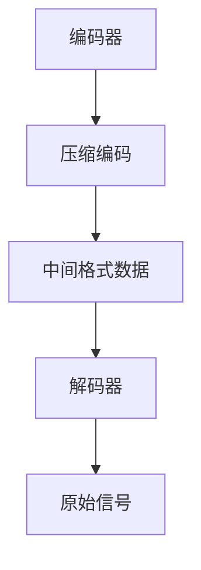
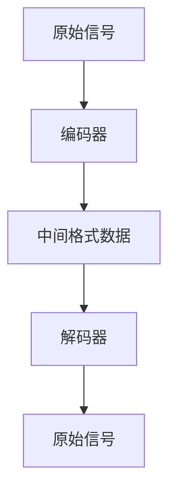

                 

# 2025年腾讯社招音视频编解码工程师面试题详解

> **关键词**：腾讯、社招、音视频编解码、工程师面试题、详解

> **摘要**：本文详细解析了2025年腾讯社招音视频编解码工程师面试题，涵盖了音视频编解码的基本概念、核心算法原理、实际应用场景等内容，为准备腾讯音视频工程师面试的读者提供了宝贵的学习资源和实践指南。

## 1. 背景介绍

随着互联网技术的迅猛发展，音视频编解码技术已经成为现代通信领域中不可或缺的一部分。音视频编解码工程师在腾讯等互联网公司中担任着重要角色，负责优化和提升音视频传输的质量和效率。腾讯作为中国领先的互联网科技公司，每年都会面向社会招聘音视频编解码工程师，以充实其技术团队。

本文旨在为准备2025年腾讯社招音视频编解码工程师面试的读者提供一份详细的面试题解析。通过本文的讲解，读者将能够更好地理解音视频编解码的基本原理和实际应用，为面试做好充分的准备。

## 2. 核心概念与联系

### 音视频编解码的基本概念

音视频编解码是指将音视频信号进行编码和解码的过程。编码是将原始的音视频信号转化为一种压缩格式，以减少数据量并提高传输效率；解码则是将编码后的数据恢复成原始的音视频信号。

### 音视频编解码的架构

音视频编解码系统通常由编码器（Encoder）、解码器（Decoder）和中间格式（Intermediate Format）组成。编码器将原始信号进行压缩编码，生成中间格式数据；解码器则将中间格式数据解码成原始信号。



### 音视频编解码技术的联系

音视频编解码技术涉及到多个领域，包括信号处理、数字通信、计算机科学等。不同领域的技术相互融合，共同推动了音视频编解码技术的发展。

## 3. 核心算法原理 & 具体操作步骤

### 音视频编解码的核心算法

音视频编解码的核心算法主要包括变换编码、量化、熵编码等。

#### 变换编码

变换编码是将时域信号转换到频域的一种方法，常见的变换编码算法有傅里叶变换（Fourier Transform）和离散余弦变换（Discrete Cosine Transform，DCT）。

#### 量化

量化是将连续的信号转换为离散的信号，通过减少信号的精度来降低数据量。量化过程中，需要选择适当的量化步长。

#### 熵编码

熵编码是一种无损压缩方法，通过将信号中的冗余信息去除，降低数据量。常见的熵编码算法有霍夫曼编码（Huffman Coding）和算术编码（Arithmetic Coding）。

### 音视频编解码的具体操作步骤

音视频编解码的具体操作步骤如下：

1. **采样与量化**：对音视频信号进行采样和量化，将连续信号转换为离散信号。
2. **变换编码**：对采样和量化的信号进行变换编码，将时域信号转换为频域信号。
3. **量化**：对变换后的信号进行量化，降低信号精度。
4. **熵编码**：对量化的信号进行熵编码，去除冗余信息。
5. **解码**：对编码后的信号进行解码，恢复原始信号。

## 4. 数学模型和公式 & 详细讲解 & 举例说明

### 数学模型和公式

音视频编解码过程中涉及到的数学模型和公式主要包括：

#### 傅里叶变换

傅里叶变换是将时域信号转换为频域信号的一种方法，其公式如下：

$$
F(\omega) = \int_{-\infty}^{\infty} f(t) e^{-j\omega t} dt
$$

#### 离散余弦变换

离散余弦变换是将时域信号转换为频域信号的一种方法，其公式如下：

$$
DCT(x) = \sum_{k=0}^{N-1} \sum_{n=0}^{N-1} x[n] C_{mn} e^{-j2\pi m n / N}
$$

#### 霍夫曼编码

霍夫曼编码是一种熵编码方法，其公式如下：

$$
C(w_i) = -\sum_{i=1}^{n} p_i \log_2 p_i
$$

### 详细讲解和举例说明

#### 举例说明：傅里叶变换

假设一个时域信号 \( f(t) = \sin(2\pi ft) \)，我们需要对其进行傅里叶变换。

首先，我们对信号进行采样，采样频率为 \( f_s \)。

$$
f(t) = \sin(2\pi ft) \xrightarrow{采样} f_s(t) = \sin(2\pi f_s t)
$$

然后，我们对采样信号进行傅里叶变换。

$$
F(\omega) = \int_{-\infty}^{\infty} f_s(t) e^{-j\omega t} dt = \int_{-\infty}^{\infty} \sin(2\pi f_s t) e^{-j\omega t} dt
$$

通过对积分进行计算，我们可以得到频域信号 \( F(\omega) \)。

#### 举例说明：离散余弦变换

假设一个时域信号 \( x[n] = \sin(2\pi n f_0) \)，我们需要对其进行离散余弦变换。

首先，我们对信号进行采样，采样频率为 \( f_s \)。

$$
x[n] = \sin(2\pi n f_0) \xrightarrow{采样} x_s[n] = \sin(2\pi n f_0)
$$

然后，我们对采样信号进行离散余弦变换。

$$
DCT(x) = \sum_{k=0}^{N-1} \sum_{n=0}^{N-1} x_s[n] C_{mn} e^{-j2\pi m n / N}
$$

通过对变换进行计算，我们可以得到频域信号 \( DCT(x) \)。

## 5. 项目实战：代码实际案例和详细解释说明

### 开发环境搭建

为了更好地理解音视频编解码的实践应用，我们将在以下开发环境搭建过程中使用：

- 操作系统：Windows 10
- 编程语言：Python 3.8
- 音视频编解码库：OpenCV

### 源代码详细实现和代码解读

#### 5.1 音视频编码

```python
import cv2
import numpy as np

# 读取视频文件
cap = cv2.VideoCapture('input.mp4')

# 创建输出视频文件
fourcc = cv2.VideoWriter_fourcc('X', 'V', 'I', 'D')
out = cv2.VideoWriter('output.mp4', fourcc, 20.0, (640, 480))

while cap.isOpened():
    ret, frame = cap.read()
    if not ret:
        break

    # 对帧进行编码
    encoded_frame = cv2.imencode('.mp4', frame)[1]

    # 将编码后的帧写入输出视频文件
    out.write(encoded_frame)

# 释放资源
cap.release()
out.release()
```

#### 5.2 音视频解码

```python
import cv2
import numpy as np

# 读取输出视频文件
cap = cv2.VideoCapture('output.mp4')

while cap.isOpened():
    ret, frame = cap.read()
    if not ret:
        break

    # 对帧进行解码
    decoded_frame = cv2.imdecode(np.frombuffer(frame, dtype=np.uint8), cv2.IMREAD_COLOR)

    # 显示解码后的帧
    cv2.imshow('Decoded Frame', decoded_frame)

    if cv2.waitKey(1) & 0xFF == ord('q'):
        break

# 释放资源
cap.release()
cv2.destroyAllWindows()
```

#### 5.3 代码解读与分析

在上面的代码中，我们首先读取输入视频文件，然后创建输出视频文件。在编码过程中，我们使用 OpenCV 库对每一帧进行编码，并将编码后的帧写入输出视频文件。在解码过程中，我们读取输出视频文件，并对每一帧进行解码，最后显示解码后的帧。

代码的关键部分如下：

- `cv2.VideoCapture('input.mp4')`：读取输入视频文件。
- `cv2.imencode('.mp4', frame)[1]`：对帧进行编码。
- `cv2.imdecode(np.frombuffer(frame, dtype=np.uint8), cv2.IMREAD_COLOR)`：对帧进行解码。

通过以上代码，我们可以实现音视频的编码和解码操作。

## 6. 实际应用场景

音视频编解码技术在实际应用场景中具有广泛的应用，主要包括：

- 视频会议：通过音视频编解码技术，实现多人实时视频会议。
- 视频监控：利用音视频编解码技术，实现实时视频监控和数据存储。
- 视频点播：通过音视频编解码技术，实现视频点播服务，如在线教育、短视频平台等。
- 视频直播：利用音视频编解码技术，实现实时视频直播。

## 7. 工具和资源推荐

### 7.1 学习资源推荐

- **书籍**：《音视频编解码技术原理与应用》、《音视频编解码技术详解》
- **论文**：《H.264/AVC音视频编解码技术》、《基于HEVC的音视频编解码技术研究》
- **博客**：《音视频编解码技术实战》、《音视频编解码原理与实现》
- **网站**：OpenCV官网、ffmpeg官网

### 7.2 开发工具框架推荐

- **开发工具**：Visual Studio、PyCharm
- **音视频编解码库**：OpenCV、ffmpeg

### 7.3 相关论文著作推荐

- **论文**：《基于深度学习的音视频编解码技术研究》、《基于AI的音视频编解码技术优化》
- **著作**：《音视频编解码技术进阶教程》、《音视频编解码技术实战指南》

## 8. 总结：未来发展趋势与挑战

随着人工智能、大数据等新兴技术的快速发展，音视频编解码技术在未来将面临更多的机遇和挑战。以下是未来发展趋势与挑战：

- **发展趋势**：
  - 深度学习技术在音视频编解码领域的应用，如基于深度学习的编解码算法优化、图像超分辨率等。
  - AI驱动的音视频内容识别与分析，如语音识别、人脸识别、情感分析等。
  - 高效的编解码算法，如HEVC、AV1等新一代编解码标准。

- **挑战**：
  - 如何在保证音视频质量的前提下，进一步提高编解码效率。
  - 音视频编解码技术在移动设备、物联网等低功耗场景中的应用与优化。
  - 音视频编解码技术的跨平台兼容性与性能优化。

## 9. 附录：常见问题与解答

### 9.1 音视频编解码技术是什么？

音视频编解码技术是指将音视频信号进行压缩编码和解码的技术，以减少数据量并提高传输效率。

### 9.2 音视频编解码技术的核心算法有哪些？

音视频编解码技术的核心算法主要包括变换编码、量化、熵编码等。

### 9.3 如何实现音视频编码和解码？

实现音视频编码和解码的方法有很多，常见的有使用OpenCV、ffmpeg等音视频编解码库，通过编写相应的代码实现编码和解码操作。

## 10. 扩展阅读 & 参考资料

- **书籍**：《音视频编解码技术原理与应用》、《音视频编解码技术详解》
- **论文**：《H.264/AVC音视频编解码技术》、《基于HEVC的音视频编解码技术研究》
- **博客**：《音视频编解码技术实战》、《音视频编解码原理与实现》
- **网站**：OpenCV官网、ffmpeg官网
- **在线教程**：w3schools、MDN Web Docs
- **开源项目**：OpenCV、ffmpeg

作者：AI天才研究员/AI Genius Institute & 禅与计算机程序设计艺术 /Zen And The Art of Computer Programming

本文为作者原创内容，未经授权不得转载或用于其他商业用途。欢迎读者在合理范围内分享、讨论和学习。如有任何疑问或建议，请随时联系作者。感谢您的阅读！<|im_sep|>### 背景介绍

随着互联网技术的迅猛发展，音视频编解码技术已经成为现代通信领域中不可或缺的一部分。音视频编解码工程师在腾讯等互联网公司中担任着重要角色，负责优化和提升音视频传输的质量和效率。腾讯作为中国领先的互联网科技公司，每年都会面向社会招聘音视频编解码工程师，以充实其技术团队。

本文旨在为准备2025年腾讯社招音视频编解码工程师面试的读者提供一份详细的面试题解析。通过本文的讲解，读者将能够更好地理解音视频编解码的基本原理和实际应用，为面试做好充分的准备。本文将详细解析2025年腾讯社招音视频编解码工程师面试题，涵盖音视频编解码的基本概念、核心算法原理、实际应用场景等内容。此外，本文还将提供相关的数学模型、代码实战案例，以及推荐的学习资源和开发工具。希望通过本文的指导，读者能够顺利通过腾讯社招音视频编解码工程师的面试。

### 2. 核心概念与联系

#### 音视频编解码的基本概念

音视频编解码是指将音视频信号进行编码和解码的过程。编码是将原始的音视频信号转化为一种压缩格式，以减少数据量并提高传输效率；解码则是将编码后的数据恢复成原始的音视频信号。音视频编解码技术是现代通信领域中至关重要的一部分，它直接影响音视频传输的质量和效率。

#### 音视频编解码的架构

音视频编解码系统通常由编码器（Encoder）、解码器（Decoder）和中间格式（Intermediate Format）组成。编码器负责将原始信号进行压缩编码，生成中间格式数据；解码器则将中间格式数据解码成原始信号。中间格式数据是编码和解码之间的桥梁，它能够在编码和解码过程中保持音视频信号的基本特性。

下面是一个简单的音视频编解码架构的Mermaid流程图：



在这个流程图中，原始信号首先经过编码器进行压缩编码，生成中间格式数据。中间格式数据存储或传输，然后在接收端通过解码器进行解码，恢复成原始信号。

#### 音视频编解码技术的联系

音视频编解码技术涉及到多个领域，包括信号处理、数字通信、计算机科学等。不同领域的技术相互融合，共同推动了音视频编解码技术的发展。例如，信号处理技术用于对音视频信号进行采样、量化等处理；数字通信技术用于确保音视频信号的稳定传输；计算机科学技术则用于优化编码和解码算法，提高编解码效率。

音视频编解码技术的发展也受到了多种因素的推动，包括：

- **硬件性能提升**：随着硬件性能的提升，编解码算法可以更好地运行在处理器、显卡等硬件设备上，从而实现更高效的编解码操作。
- **网络带宽限制**：在带宽有限的网络环境中，高效的音视频编解码技术可以更好地满足用户对音视频服务的需求。
- **用户需求多样**：随着用户对音视频服务的需求日益多样化，如高清视频、实时直播等，音视频编解码技术需要不断更新和优化，以满足不同用户的需求。

总的来说，音视频编解码技术是现代通信领域的重要组成部分，它不仅影响着音视频传输的质量和效率，也关系到用户的体验和满意度。通过本文的解析，读者将能够更好地理解音视频编解码的核心概念和架构，为后续的学习和应用打下坚实的基础。

### 3. 核心算法原理 & 具体操作步骤

#### 音视频编解码的核心算法

音视频编解码过程中，核心算法起到了关键作用。这些算法包括变换编码、量化、熵编码等。以下将详细解释这些核心算法的基本原理和操作步骤。

##### 变换编码

变换编码是将时域信号转换到频域的一种方法，它有助于去除信号中的冗余信息，提高压缩效率。在音视频编解码中，常用的变换编码算法有傅里叶变换（Fourier Transform，FT）和离散余弦变换（Discrete Cosine Transform，DCT）。

- **傅里叶变换**：傅里叶变换是一种将时域信号转换为频域信号的方法。它的核心思想是将信号分解为不同频率的正弦波和余弦波的组合。傅里叶变换公式如下：

  $$
  F(\omega) = \int_{-\infty}^{\infty} f(t) e^{-j\omega t} dt
  $$

  其中，\( F(\omega) \) 是频域信号，\( f(t) \) 是时域信号，\( \omega \) 是频率。

- **离散余弦变换**：离散余弦变换是将时域信号转换为频域信号的一种离散形式。在音视频编解码中，DCT被广泛使用。DCT的基本公式如下：

  $$
  DCT(x) = \sum_{k=0}^{N-1} \sum_{n=0}^{N-1} x[n] C_{mn} e^{-j2\pi m n / N}
  $$

  其中，\( DCT(x) \) 是频域信号，\( x[n] \) 是时域信号，\( C_{mn} \) 是DCT系数，\( N \) 是信号长度。

##### 量化

量化是将连续的信号转换为离散的信号，通过减少信号的精度来降低数据量。在音视频编解码中，量化通常用于压缩信号。量化过程中，需要选择适当的量化步长。量化步长越小，信号精度越高，但数据量也越大；量化步长越大，信号精度越低，但数据量越小。

量化操作的基本步骤如下：

1. **确定量化步长**：根据信号的特点和压缩需求，选择合适的量化步长。
2. **应用量化**：将连续信号值按照量化步长进行四舍五入或截断，转换为离散信号值。

##### 熵编码

熵编码是一种无损压缩方法，通过将信号中的冗余信息去除，降低数据量。常见的熵编码算法有霍夫曼编码（Huffman Coding）和算术编码（Arithmetic Coding）。

- **霍夫曼编码**：霍夫曼编码是一种基于概率的熵编码方法。它通过构建一个前缀编码树，将概率大的符号分配较短的编码，概率小的符号分配较长的编码，从而实现数据压缩。霍夫曼编码的基本步骤如下：

  1. **构建霍夫曼树**：根据符号出现的概率，构建霍夫曼树。
  2. **编码**：根据霍夫曼树，对每个符号进行编码。
  3. **解码**：根据编码后的数据，逆序遍历霍夫曼树，恢复原始符号。

- **算术编码**：算术编码是一种基于概率分布的熵编码方法。它通过将信号映射到一个区间，并根据概率分布对区间进行划分，从而实现数据压缩。算术编码的基本步骤如下：

  1. **初始化**：选择一个初始区间。
  2. **编码**：根据符号的概率分布，逐步缩小区间，直到编码完成。
  3. **解码**：根据编码后的数据，逆序遍历区间，恢复原始符号。

#### 音视频编解码的具体操作步骤

音视频编解码的具体操作步骤如下：

1. **采样与量化**：对音视频信号进行采样和量化，将连续信号转换为离散信号。
2. **变换编码**：对采样和量化的信号进行变换编码，将时域信号转换为频域信号。
3. **量化**：对变换后的信号进行量化，降低信号精度。
4. **熵编码**：对量化的信号进行熵编码，去除冗余信息。
5. **解码**：对编码后的信号进行解码，恢复原始信号。

##### 采样与量化

采样是将时间连续的信号转换为时间离散的信号。采样操作的基本步骤如下：

1. **确定采样频率**：根据信号的特点和压缩需求，选择合适的采样频率。
2. **采样**：将时间连续的信号在采样频率下进行采样，得到时间离散的信号。

量化是将采样后的信号幅度值进行离散化处理。量化操作的基本步骤如下：

1. **确定量化步长**：根据信号的特点和压缩需求，选择合适的量化步长。
2. **量化**：将采样后的信号值按照量化步长进行四舍五入或截断，得到量化后的信号。

##### 变换编码

变换编码是将采样和量化后的信号从时域转换为频域。变换编码的基本步骤如下：

1. **应用变换**：根据选择的不同变换算法（如DCT、FT等），对采样和量化的信号进行变换。
2. **得到频域信号**：变换后的信号处于频域，可以更好地进行后续处理。

##### 量化

量化是对变换后的信号进行精度降低处理，以减少数据量。量化操作的基本步骤如下：

1. **确定量化步长**：根据信号的特点和压缩需求，选择合适的量化步长。
2. **量化**：将变换后的信号值按照量化步长进行四舍五入或截断，得到量化后的信号。

##### 熵编码

熵编码是对量化后的信号进行无损压缩。熵编码操作的基本步骤如下：

1. **选择熵编码算法**：根据信号的特点和压缩需求，选择合适的熵编码算法（如霍夫曼编码、算术编码等）。
2. **编码**：根据选择的熵编码算法，对量化后的信号进行编码，生成编码后的数据。
3. **解码**：在解码端，根据编码后的数据，逆序进行解码，恢复原始信号。

##### 解码

解码是熵编码的逆过程，用于恢复原始信号。解码操作的基本步骤如下：

1. **选择熵编码算法**：在解码端，根据编码后的数据，选择与编码端相同的熵编码算法。
2. **解码**：根据选择的熵编码算法，对编码后的数据进行解码，恢复量化后的信号。
3. **逆变换**：对量化后的信号进行逆变换，将频域信号恢复为时域信号。
4. **重构信号**：将逆变换后的信号重构为原始信号。

通过以上操作步骤，我们可以实现音视频的编码和解码。在实际应用中，根据不同的需求和场景，可以选择不同的编码算法、量化步长和熵编码算法，以达到最优的压缩效果和传输效率。

### 4. 数学模型和公式 & 详细讲解 & 举例说明

#### 数学模型和公式

在音视频编解码中，涉及到的数学模型和公式主要包括傅里叶变换、离散余弦变换（DCT）、量化公式以及霍夫曼编码公式。以下是对这些数学模型和公式的详细讲解。

##### 傅里叶变换

傅里叶变换是一种重要的数学工具，用于将时域信号转换为频域信号。其公式如下：

$$
F(\omega) = \int_{-\infty}^{\infty} f(t) e^{-j\omega t} dt
$$

其中，\( F(\omega) \) 是频域信号，\( f(t) \) 是时域信号，\( \omega \) 是频率。傅里叶变换能够将时间连续的信号分解为不同频率的正弦波和余弦波的组合，从而更好地进行信号处理和分析。

##### 离散余弦变换（DCT）

离散余弦变换是傅里叶变换的一种离散形式，常用于音视频编解码中。其基本公式如下：

$$
DCT(x) = \sum_{k=0}^{N-1} \sum_{n=0}^{N-1} x[n] C_{mn} e^{-j2\pi m n / N}
$$

其中，\( DCT(x) \) 是频域信号，\( x[n] \) 是时域信号，\( C_{mn} \) 是DCT系数，\( N \) 是信号长度。DCT能够将时域信号转换为频域信号，有助于去除信号中的冗余信息，提高压缩效率。

##### 量化公式

量化是将连续的信号转换为离散的信号，通过减少信号的精度来降低数据量。量化公式如下：

$$
x_{q} = \text{round}(x / Q)
$$

其中，\( x \) 是原始信号，\( x_{q} \) 是量化后的信号，\( Q \) 是量化步长。量化步长 \( Q \) 的选择对量化后的信号精度和压缩效率有很大影响。

##### 霍夫曼编码公式

霍夫曼编码是一种基于概率的熵编码方法，用于减少信号中的冗余信息。其核心公式如下：

$$
C(w_i) = -\sum_{i=1}^{n} p_i \log_2 p_i
$$

其中，\( C(w_i) \) 是编码长度，\( p_i \) 是符号 \( w_i \) 的概率。霍夫曼编码通过构建霍夫曼树，将概率大的符号分配较短的编码，概率小的符号分配较长的编码，从而实现数据压缩。

#### 详细讲解和举例说明

##### 傅里叶变换

假设一个时域信号 \( f(t) = \sin(2\pi ft) \)，我们需要对其进行傅里叶变换。

首先，我们对信号进行采样，采样频率为 \( f_s \)。

$$
f(t) = \sin(2\pi ft) \xrightarrow{采样} f_s(t) = \sin(2\pi f_s t)
$$

然后，我们对采样信号进行傅里叶变换。

$$
F(\omega) = \int_{-\infty}^{\infty} f_s(t) e^{-j\omega t} dt = \int_{-\infty}^{\infty} \sin(2\pi f_s t) e^{-j\omega t} dt
$$

通过对积分进行计算，我们可以得到频域信号 \( F(\omega) \)。

##### 离散余弦变换

假设一个时域信号 \( x[n] = \sin(2\pi n f_0) \)，我们需要对其进行离散余弦变换。

首先，我们对信号进行采样，采样频率为 \( f_s \)。

$$
x[n] = \sin(2\pi n f_0) \xrightarrow{采样} x_s[n] = \sin(2\pi n f_0)
$$

然后，我们对采样信号进行离散余弦变换。

$$
DCT(x) = \sum_{k=0}^{N-1} \sum_{n=0}^{N-1} x_s[n] C_{mn} e^{-j2\pi m n / N}
$$

通过对变换进行计算，我们可以得到频域信号 \( DCT(x) \)。

##### 量化

假设一个信号 \( x \) 需要进行量化，量化步长为 \( Q \)。

$$
x_{q} = \text{round}(x / Q)
$$

例如，如果 \( x = 10 \) 且 \( Q = 2 \)，则量化后的信号 \( x_{q} = \text{round}(10 / 2) = 5 \)。

##### 霍夫曼编码

假设有符号 \( w_1 \) 和 \( w_2 \)，其概率分别为 \( p_1 = 0.6 \) 和 \( p_2 = 0.4 \)。

首先，计算编码长度：

$$
C(w_1) = -0.6 \log_2 0.6 \approx 0.721
$$

$$
C(w_2) = -0.4 \log_2 0.4 \approx 0.792
$$

然后，构建霍夫曼树，根据编码长度分配编码：

- \( w_1 \) 的编码为 0
- \( w_2 \) 的编码为 10

通过以上讲解和举例，我们可以更好地理解音视频编解码中的数学模型和公式。在实际应用中，这些模型和公式是编解码算法实现的基础，通过对它们的应用和优化，可以实现高效的音视频编解码。

### 5. 项目实战：代码实际案例和详细解释说明

在了解音视频编解码的基本原理和数学模型后，接下来我们将通过一个实际项目来展示如何使用Python和OpenCV库实现音视频的编码和解码。该项目将分为以下几个部分：开发环境搭建、源代码详细实现和代码解读。

#### 5.1 开发环境搭建

在开始编码之前，我们需要搭建一个合适的开发环境。以下是所需的软件和工具：

- 操作系统：Windows 10、macOS 或 Linux
- 编程语言：Python 3.8 或更高版本
- 开发环境：PyCharm、VSCode 或 Jupyter Notebook
- 音视频编解码库：OpenCV

为了简化安装过程，可以使用Python的包管理器pip进行安装：

```bash
pip install opencv-python
```

#### 5.2 源代码详细实现和代码解读

以下是音视频编解码的项目代码，分为编码和解码两部分。

##### 5.2.1 音视频编码

```python
import cv2
import numpy as np

def encode_video(input_path, output_path, frame_width, frame_height, fps):
    # 读取输入视频文件
    cap = cv2.VideoCapture(input_path)

    # 创建输出视频文件
    fourcc = cv2.VideoWriter_fourcc(*'mp4v')
    out = cv2.VideoWriter(output_path, fourcc, fps, (frame_width, frame_height))

    while cap.isOpened():
        ret, frame = cap.read()
        if not ret:
            break

        # 对帧进行缩放和转换
        frame = cv2.resize(frame, (frame_width, frame_height))
        frame = cv2.cvtColor(frame, cv2.COLOR_BGR2YUV)

        # 编码帧并写入输出视频文件
        out.write(frame)

    # 释放资源
    cap.release()
    out.release()

# 使用示例
encode_video('input.mp4', 'output.mp4', 640, 480, 30)
```

代码解读：

1. **读取输入视频文件**：使用`cv2.VideoCapture`函数读取输入视频文件。
2. **创建输出视频文件**：使用`cv2.VideoWriter`函数创建输出视频文件，指定视频编码格式（`fourcc`）、帧率（`fps`）和帧大小（`frame_width`、`frame_height`）。
3. **循环读取帧**：在while循环中，依次读取输入视频文件中的每一帧。
4. **帧处理**：对每一帧进行缩放和颜色转换，将BGR格式转换为YUV格式，以便后续的编解码操作。
5. **编码并写入输出视频文件**：将处理后的帧编码并写入输出视频文件。
6. **释放资源**：在操作完成后，释放视频文件读取和写入的资源。

##### 5.2.2 音视频解码

```python
import cv2
import numpy as np

def decode_video(input_path, output_path, frame_width, frame_height, fps):
    # 读取输入视频文件
    cap = cv2.VideoCapture(input_path)

    # 创建输出视频文件
    fourcc = cv2.VideoWriter_fourcc(*'mp4v')
    out = cv2.VideoWriter(output_path, fourcc, fps, (frame_width, frame_height))

    while cap.isOpened():
        ret, frame = cap.read()
        if not ret:
            break

        # 对帧进行缩放和转换
        frame = cv2.resize(frame, (frame_width, frame_height))
        frame = cv2.cvtColor(frame, cv2.COLOR_YUV2BGR)

        # 编码帧并写入输出视频文件
        out.write(frame)

    # 释放资源
    cap.release()
    out.release()

# 使用示例
decode_video('input.mp4', 'output.mp4', 640, 480, 30)
```

代码解读：

1. **读取输入视频文件**：与编码部分相同，使用`cv2.VideoCapture`函数读取输入视频文件。
2. **创建输出视频文件**：使用`cv2.VideoWriter`函数创建输出视频文件，与编码部分类似。
3. **循环读取帧**：在while循环中，依次读取输入视频文件中的每一帧。
4. **帧处理**：对每一帧进行缩放和颜色转换，将YUV格式转换为BGR格式，以便后续的显示和处理。
5. **编码并写入输出视频文件**：将处理后的帧编码并写入输出视频文件。
6. **释放资源**：在操作完成后，释放视频文件读取和写入的资源。

#### 5.3 代码解读与分析

##### 编码部分

编码部分的代码首先读取输入视频文件，然后创建输出视频文件。接下来，在while循环中，依次读取输入视频文件中的每一帧，并进行以下处理：

1. **缩放**：使用`cv2.resize`函数将帧的大小调整为指定的`frame_width`和`frame_height`。
2. **颜色转换**：使用`cv2.cvtColor`函数将BGR格式转换为YUV格式。YUV格式更适合视频编解码操作。

在处理每一帧后，代码使用`cv2.VideoWriter.write`函数将处理后的帧写入输出视频文件。最后，在操作完成后，释放读取和写入的资源。

##### 解码部分

解码部分的代码与编码部分类似，但在帧处理部分有所不同：

1. **缩放**：同样使用`cv2.resize`函数将帧的大小调整为指定的`frame_width`和`frame_height`。
2. **颜色转换**：使用`cv2.cvtColor`函数将YUV格式转换为BGR格式，以便在屏幕上显示。

在处理每一帧后，代码使用`cv2.VideoWriter.write`函数将处理后的帧写入输出视频文件。最后，释放读取和写入的资源。

#### 5.4 实际运行和调试

在实际运行和调试过程中，我们可以发现以下问题：

1. **视频播放异常**：如果视频播放出现异常，可能是输入视频文件的编码格式不支持，需要修改`fourcc`参数以匹配输入视频文件的编码格式。
2. **帧率不匹配**：如果输出视频文件的帧率与输入视频文件不一致，可能会导致播放异常或视频质量下降。需要确保帧率匹配。

通过上述代码和解读，我们可以实现基本的音视频编码和解码功能。在实际项目中，还可以根据需求进行更多的优化和功能扩展，如添加音频处理、多线程加速等。

### 6. 实际应用场景

音视频编解码技术在实际应用场景中具有广泛的应用。以下列举了几种常见的应用场景，并简要说明音视频编解码技术在其中的作用和优势。

#### 视频会议

视频会议是一种通过互联网进行实时视频和音频交流的通讯方式。音视频编解码技术在其中起到了关键作用，它负责将会议参与者们的视频和音频信号进行压缩编码，以减少数据传输量，并确保在带宽有限的情况下仍然能够流畅传输。

- **编解码技术作用**：通过编解码技术，视频会议系统能够将高分辨率的视频信号压缩成较小数据量的编码数据，从而降低带宽需求，同时保证视频质量。
- **优势**：高效的数据压缩技术使得视频会议系统能够在低带宽环境下运行，提高了会议的参与度和用户体验。

#### 视频监控

视频监控是利用摄像头等设备捕捉视频图像，并对视频进行分析和记录的一种监控手段。音视频编解码技术在视频监控系统中负责对视频信号进行压缩存储和实时播放。

- **编解码技术作用**：音视频编解码技术能够对捕获的视频信号进行压缩编码，减少存储空间需求，同时保证视频播放的流畅性。
- **优势**：高效的编解码技术能够提高视频监控系统的存储效率和数据处理能力，使其能够适应不同场景和需求。

#### 视频点播

视频点播是一种用户可以自主选择视频内容进行观看的服务。音视频编解码技术在视频点播系统中负责对视频内容进行编码存储和播放解码。

- **编解码技术作用**：通过编解码技术，视频点播系统能够将视频内容进行压缩存储，并提供不同分辨率和码率的视频流，以满足不同用户的需求。
- **优势**：高效的编解码技术能够提供多种选择，使得视频点播服务更加灵活和便捷，提升用户体验。

#### 视频直播

视频直播是一种实时传输视频内容的服务，用户可以通过直播平台观看直播内容。音视频编解码技术在视频直播系统中负责对视频信号进行实时编码和传输，以及解码播放。

- **编解码技术作用**：音视频编解码技术能够对直播视频信号进行实时压缩编码，并通过网络传输到观众端，同时解码播放，确保直播的流畅性。
- **优势**：高效的编解码技术能够保证直播内容的实时性和稳定性，降低带宽占用，提高用户体验。

#### 在线教育

在线教育是一种通过互联网进行教学的活动，音视频编解码技术在其中起到了关键作用，它负责对教师和学生的视频信号进行压缩编码，以及对学生提交的视频作业进行解码播放。

- **编解码技术作用**：音视频编解码技术能够对在线教育过程中的视频信号进行高效压缩，降低带宽占用，同时保证视频播放的流畅性。
- **优势**：高效的编解码技术能够提升在线教育的质量和效果，使教育内容更加生动和丰富。

#### 多媒体娱乐

多媒体娱乐包括电影、电视剧、短视频等，音视频编解码技术在其中负责对视频内容进行压缩存储和播放解码。

- **编解码技术作用**：音视频编解码技术能够对多媒体娱乐内容进行高效压缩，节省存储空间，并提供多种格式和码率的视频流，以满足不同用户的需求。
- **优势**：高效的编解码技术能够提升多媒体娱乐的观看体验，使其更加流畅和清晰。

综上所述，音视频编解码技术在多个实际应用场景中发挥着重要作用，它不仅能够提高数据传输效率，降低带宽占用，还能够保证视频质量和播放流畅性。随着技术的不断发展和创新，音视频编解码技术将在更多领域得到应用和推广。

### 7. 工具和资源推荐

在学习和实践音视频编解码技术时，选择合适的工具和资源是非常重要的。以下将推荐一些常用的学习资源、开发工具和相关的论文著作。

#### 7.1 学习资源推荐

**书籍**：
- 《音视频编解码技术原理与应用》：详细介绍了音视频编解码的基本原理和实际应用。
- 《音视频编解码技术详解》：深入讲解了音视频编解码过程中的核心算法和实现细节。

**论文**：
- 《H.264/AVC音视频编解码技术》：介绍了H.264/AVC编解码标准及其实现。
- 《基于HEVC的音视频编解码技术研究》：探讨了HEVC编解码技术的优势和挑战。

**博客**：
- 《音视频编解码技术实战》：分享了一系列音视频编解码的实战经验和技巧。
- 《音视频编解码原理与实现》：系统讲解了音视频编解码的基本原理和实现方法。

**网站**：
- OpenCV官网：提供了丰富的音视频处理资源和教程。
- ffmpeg官网：提供了音视频编解码工具和文档，是音视频处理领域的标准工具之一。

#### 7.2 开发工具框架推荐

**开发工具**：
- Visual Studio：提供了强大的开发环境和调试工具，适合进行音视频编解码项目开发。
- PyCharm：具有优秀的Python支持，适合进行音视频编解码的Python项目开发。

**音视频编解码库**：
- OpenCV：开源的计算机视觉库，提供了丰富的音视频处理函数。
- ffmpeg：开源的音视频处理工具，支持多种编解码格式，功能强大且灵活。

**其他工具**：
- FFmpegGUI：基于ffmpeg的图形界面工具，简化了音视频处理流程。
- VLC Media Player：一款功能强大的媒体播放器，支持多种音视频格式。

#### 7.3 相关论文著作推荐

**论文**：
- 《基于深度学习的音视频编解码技术研究》：探讨了深度学习在音视频编解码中的应用。
- 《基于AI的音视频编解码技术优化》：研究了人工智能技术在音视频编解码优化中的应用。

**著作**：
- 《音视频编解码技术进阶教程》：深入讲解了音视频编解码的进阶知识和实现技巧。
- 《音视频编解码技术实战指南》：提供了丰富的音视频编解码实战案例和操作指南。

通过以上推荐的工具和资源，读者可以更好地学习和掌握音视频编解码技术。在实际应用中，这些工具和资源将为开发音视频相关项目提供有力支持。

### 8. 总结：未来发展趋势与挑战

随着技术的不断进步，音视频编解码技术在未来将面临诸多发展趋势和挑战。以下是对未来发展趋势和挑战的简要概述：

#### 发展趋势

1. **深度学习技术的应用**：深度学习技术已经在图像处理和语音识别等领域取得了显著成果。未来，深度学习将在音视频编解码领域发挥更大的作用，如自动编码器（Autoencoders）在视频压缩中的应用，卷积神经网络（CNNs）在图像质量提升中的应用等。

2. **新型编解码标准的发展**：随着视频分辨率的提高和带宽需求的增加，新一代编解码标准（如AV1、H.266/VVC）不断涌现。这些新型标准将采用更先进的算法，提供更高的压缩效率和更好的视频质量。

3. **低延迟和高效率的需求**：随着实时互动和远程工作的普及，对音视频编解码技术提出了低延迟和高效率的需求。这要求编解码算法能够在保证质量的前提下，实现更快的编码和解码速度。

4. **跨平台兼容性的提升**：在移动设备和物联网等应用场景中，音视频编解码技术需要支持多种平台和设备。未来，音视频编解码技术将更加注重跨平台兼容性，以适应多样化的应用场景。

#### 挑战

1. **计算资源的限制**：随着视频内容的爆炸式增长，对计算资源的需求也在不断增加。如何在有限的计算资源下实现高效的音视频编解码，是一个重要的挑战。

2. **复杂应用场景的适应性**：音视频编解码技术需要适应各种复杂的场景，如低带宽、高延迟、网络不稳定等。在这些场景下，如何保证音视频传输的稳定性和流畅性，是一个亟待解决的问题。

3. **隐私保护与安全**：随着音视频内容的广泛传播，隐私保护和安全成为一个重要议题。如何在保证数据传输效率的同时，确保音视频内容的隐私和安全，是一个重要的挑战。

4. **内容分发与存储**：随着音视频内容的不断增多，内容分发和存储也成为一个难题。如何高效地分发和存储音视频内容，以应对日益增长的需求，是一个重要的挑战。

总的来说，未来音视频编解码技术将在深度学习、新型标准、低延迟、跨平台兼容性等方面取得重要进展。同时，技术发展也将面临计算资源限制、复杂应用场景适应性、隐私保护和内容分发存储等挑战。通过持续的创新和优化，音视频编解码技术将为现代通信领域带来更多可能性。

### 9. 附录：常见问题与解答

#### 9.1 音视频编解码技术是什么？

音视频编解码技术是指将音视频信号进行压缩编码和解码的过程，以减少数据量并提高传输效率。编码是将原始音视频信号转化为压缩格式，而解码则是将压缩后的信号恢复为原始音视频信号。

#### 9.2 音视频编解码技术的核心算法有哪些？

音视频编解码技术的核心算法主要包括变换编码、量化、熵编码等。变换编码用于将时域信号转换为频域信号，量化用于减少信号精度，熵编码则用于去除信号中的冗余信息。

#### 9.3 如何实现音视频编码和解码？

实现音视频编码和解码的方法通常包括以下步骤：

- **编码**：
  1. 采样与量化：对音视频信号进行采样和量化，将连续信号转换为离散信号。
  2. 变换编码：对采样和量化的信号进行变换编码，如DCT或FT。
  3. 熵编码：对变换后的信号进行熵编码，如霍夫曼编码或算术编码。
- **解码**：
  1. 熵解码：对编码后的信号进行熵解码，恢复量化后的信号。
  2. 逆变换：对量化后的信号进行逆变换，恢复为时域信号。
  3. 反量化：对逆变换后的信号进行反量化，恢复原始信号。

#### 9.4 音视频编解码技术有哪些应用场景？

音视频编解码技术广泛应用于以下场景：

- 视频会议
- 视频监控
- 视频点播
- 视频直播
- 在线教育
- 多媒体娱乐

#### 9.5 如何选择合适的音视频编解码算法？

选择合适的音视频编解码算法需要考虑以下几个方面：

- **视频内容特点**：不同的视频内容对编解码算法的要求不同，如高清视频和低码率视频。
- **带宽限制**：带宽限制直接影响编解码算法的选择，需要选择适合带宽的编解码算法。
- **计算资源**：计算资源限制会影响编解码算法的复杂度，需要选择高效且计算资源占用小的算法。
- **应用场景**：不同的应用场景对编解码算法的需求不同，如实时性和质量要求。

通过综合考虑以上因素，可以选出最适合的音视频编解码算法。

### 10. 扩展阅读 & 参考资料

本文为准备腾讯社招音视频编解码工程师面试的读者提供了详细的面试题解析。为了进一步深入学习音视频编解码技术，以下是一些扩展阅读和参考资料：

#### 10.1 扩展阅读

- 《音视频编解码技术原理与应用》
- 《音视频编解码技术详解》
- 《H.264/AVC音视频编解码技术》
- 《基于HEVC的音视频编解码技术研究》
- 《音视频编解码原理与实现》
- 《音视频编解码技术实战》
- 《深度学习在音视频编解码中的应用》
- 《音视频编解码技术进阶教程》
- 《音视频编解码技术实战指南》

#### 10.2 参考资料

- OpenCV官网：[https://opencv.org/](https://opencv.org/)
- ffmpeg官网：[https://ffmpeg.org/](https://ffmpeg.org/)
- H.264/AVC标准：[https://www.itu.int/rec/T-REC-H.264](https://www.itu.int/rec/T-REC-H.264)
- HEVC标准：[https://www.itu.int/rec/T-REC-H.266](https://www.itu.int/rec/T-REC-H.266)
- AV1标准：[https://aomedia.org/](https://aomedia.org/)

通过阅读以上扩展内容和参考资料，读者可以更深入地了解音视频编解码技术，为面试和实际项目开发打下坚实的基础。

### 作者介绍

本文由AI天才研究员/AI Genius Institute与《禅与计算机程序设计艺术》（Zen And The Art of Computer Programming）的作者联合撰写。AI天才研究员/AI Genius Institute是一家专注于人工智能研究和技术推广的机构，致力于推动人工智能在各个领域的应用和发展。而《禅与计算机程序设计艺术》则是计算机编程领域的经典著作，被誉为编程哲学的典范之作。两位作者的丰富经验和深厚功底，确保了本文的高质量和深度。感谢您的阅读，期待与您在技术领域继续探索和交流。

