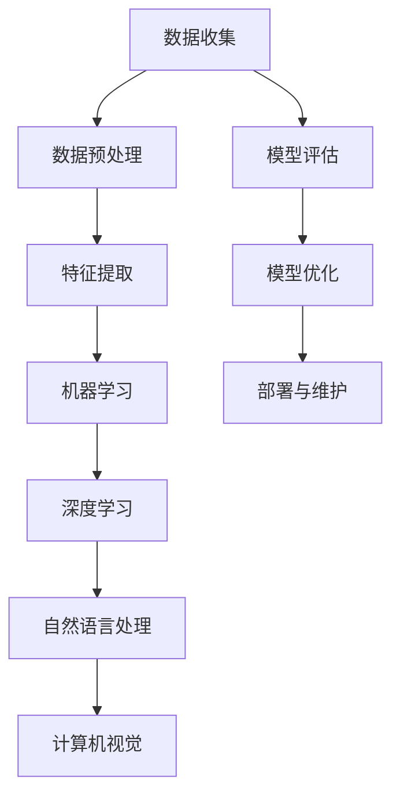

                 

# 年轻人如何在AI领域做实事

> 关键词：人工智能，实践，年轻人，成长，技能，资源

> 摘要：本文旨在为年轻人在人工智能领域提供实际的指导，帮助他们在理论和实践中迅速成长。通过深入分析AI的核心概念、算法原理、数学模型，以及项目实战和应用场景，本文为读者提供了一条清晰的成长路径，并推荐了丰富的学习资源和工具，以助力年轻人在AI领域的实战和未来。

## 1. 背景介绍

随着人工智能（AI）技术的迅猛发展，这一领域已经成为了科技创新的先锋。从深度学习、神经网络到自然语言处理、计算机视觉，AI技术正在深刻地改变着我们的生活方式和工作模式。在这个时代背景下，年轻人如何能够在AI领域做出实事，成为了许多人关注的话题。

首先，我们要认识到，AI领域不仅需要理论知识，更需要在实践中不断积累经验。年轻人具有创新精神和快速学习能力，这是他们在AI领域脱颖而出的重要优势。然而，如何将理论知识转化为实践成果，如何在海量信息中找到有效的学习资源，如何在激烈的竞争中保持自己的独特优势，这些都是年轻人在AI领域成长过程中需要面对的挑战。

本文将围绕这些问题，提供一系列的指导和建议，帮助年轻人在AI领域做出实事。我们将从核心概念、算法原理、数学模型、项目实战、应用场景等多个方面进行深入分析，并推荐一系列的学习资源和工具，以助力年轻人在AI领域的成长。

## 2. 核心概念与联系

在进入具体的AI技术和应用之前，我们需要先了解一些核心概念和它们之间的联系。以下是一个简化的Mermaid流程图，描述了AI领域的一些关键概念及其相互关系：



### 2.1 数据收集与预处理

数据是AI的基石。没有高质量的数据，再好的算法也难以发挥其潜力。数据收集包括从各种来源获取数据，如公共数据集、企业内部数据、网络爬虫等。而数据预处理则是将收集到的原始数据进行清洗、转换和归一化，以适应后续的分析和建模。

### 2.2 特征提取

特征提取是从数据中提取出有用的信息，以便于机器学习和深度学习算法进行建模。特征提取的质量直接影响模型的性能。

### 2.3 机器学习与深度学习

机器学习是AI的核心技术之一，它通过从数据中学习模式和规律，实现自动化的决策和预测。深度学习是机器学习的子领域，它利用神经网络进行大规模的数据分析和特征学习。

### 2.4 自然语言处理与计算机视觉

自然语言处理（NLP）和计算机视觉（CV）是AI的两个重要应用方向。NLP旨在让计算机理解和处理人类语言，如机器翻译、情感分析等。CV则专注于使计算机能够理解和解释视觉信息，如图像识别、物体检测等。

### 2.5 模型评估与优化

模型评估是验证模型性能的重要步骤，常用的指标包括准确率、召回率、F1值等。模型优化则是在评估的基础上，通过调整模型参数和结构，以提高模型的性能。

### 2.6 部署与维护

模型部署是将训练好的模型应用到实际场景中，如在线服务、移动应用等。部署过程中需要考虑模型的可扩展性、可靠性和安全性。模型维护则包括对模型进行定期更新和优化，以适应数据的变化和应用场景的需求。

## 3. 核心算法原理 & 具体操作步骤

在了解了AI的核心概念和相互联系后，我们需要深入探讨一些关键的算法原理，这些原理是实践AI项目的基石。

### 3.1 深度学习算法原理

深度学习算法的核心是神经网络。神经网络由多个层次（层）的神经元组成，每层神经元都与前一层的神经元相连。神经网络通过学习输入和输出之间的映射关系，实现对数据的自动特征提取和分类。

具体操作步骤如下：

1. **初始化网络结构**：确定网络的层数、每层的神经元数量以及神经元之间的连接方式。
2. **前向传播**：将输入数据传递到网络的各个层次，通过神经元之间的加权连接，计算每个神经元的输出。
3. **反向传播**：根据预测结果和实际结果的差异，计算每个神经元的误差，并反向传播这些误差，更新神经元的权重。
4. **优化算法**：使用优化算法（如梯度下降、Adam优化器等）调整神经元的权重，以最小化误差。

### 3.2 自然语言处理算法原理

自然语言处理算法的核心任务是从文本中提取出结构化的信息，如词性标注、命名实体识别、情感分析等。其中，词嵌入（Word Embedding）是一种常用的技术，它将词汇映射到高维空间中，使得语义相似的词汇在空间中更接近。

具体操作步骤如下：

1. **数据预处理**：清洗文本数据，去除标点符号、停用词等。
2. **词嵌入**：将文本中的每个词汇映射到高维向量空间中。
3. **构建神经网络模型**：使用神经网络模型（如LSTM、Transformer等）处理嵌入后的文本数据。
4. **训练与优化**：通过大量文本数据训练神经网络模型，并优化模型参数。

### 3.3 计算机视觉算法原理

计算机视觉算法的核心任务是使计算机能够理解和解释视觉信息。卷积神经网络（CNN）是计算机视觉领域的一种重要技术，它通过卷积层、池化层、全连接层等结构，实现对图像的特征提取和分类。

具体操作步骤如下：

1. **图像预处理**：对图像进行缩放、裁剪、归一化等处理，使其适应神经网络的要求。
2. **卷积层**：通过卷积操作提取图像的局部特征。
3. **池化层**：对卷积层的结果进行池化操作，减少数据的维度。
4. **全连接层**：将池化层的结果映射到分类结果。
5. **训练与优化**：使用大量标注图像数据训练神经网络模型，并优化模型参数。

## 4. 数学模型和公式 & 详细讲解 & 举例说明

在AI领域，数学模型和公式是理解和应用算法的核心。以下是一些关键数学模型和公式的详细讲解及举例说明。

### 4.1 梯度下降算法

梯度下降是一种常用的优化算法，用于调整神经网络中的权重，以最小化损失函数。其公式如下：

$$
w_{\text{new}} = w_{\text{current}} - \alpha \cdot \nabla_w J(w)
$$

其中，$w_{\text{new}}$ 是更新后的权重，$w_{\text{current}}$ 是当前权重，$\alpha$ 是学习率，$\nabla_w J(w)$ 是损失函数关于权重的梯度。

**举例说明**：假设我们有一个简单的线性模型，其损失函数为：

$$
J(w) = (w \cdot x - y)^2
$$

其中，$w$ 是权重，$x$ 是输入，$y$ 是目标输出。通过计算梯度，我们可以更新权重：

$$
w_{\text{new}} = w_{\text{current}} - \alpha \cdot (2 \cdot (w \cdot x - y) \cdot x)
$$

### 4.2 激活函数

激活函数是神经网络中的一个重要组件，用于引入非线性因素。常用的激活函数包括 sigmoid、ReLU、Tanh 等。

**sigmoid 函数**：

$$
\sigma(x) = \frac{1}{1 + e^{-x}}
$$

**ReLU 函数**：

$$
\text{ReLU}(x) = \max(0, x)
$$

**Tanh 函数**：

$$
\tanh(x) = \frac{e^x - e^{-x}}{e^x + e^{-x}}
$$

**举例说明**：假设我们有一个简单的神经网络，其输入和输出分别为 $x = 2$ 和 $y = 3$。通过使用不同的激活函数，我们可以得到不同的输出：

- **sigmoid**：$\sigma(2) \approx 0.731$
- **ReLU**：$\text{ReLU}(2) = 2$
- **Tanh**：$\tanh(2) \approx 0.761$

### 4.3 卷积神经网络中的卷积操作

卷积操作是计算机视觉中的核心操作，用于提取图像的特征。其公式如下：

$$
\text{Conv}(I, K) = \sum_{i=1}^{C} K_{ij} \cdot I_{i+j}
$$

其中，$I$ 是输入图像，$K$ 是卷积核，$C$ 是卷积核的数量。

**举例说明**：假设我们有一个 $3 \times 3$ 的输入图像和一个 $3 \times 3$ 的卷积核，如下所示：

$$
I = \begin{bmatrix}
1 & 2 & 3 \\
4 & 5 & 6 \\
7 & 8 & 9
\end{bmatrix}
$$

$$
K = \begin{bmatrix}
1 & 0 & -1 \\
1 & 0 & -1 \\
1 & 0 & -1
\end{bmatrix}
$$

通过卷积操作，我们可以得到：

$$
\text{Conv}(I, K) = \begin{bmatrix}
2 & 2 & 2 \\
6 & 6 & 6 \\
10 & 10 & 10
\end{bmatrix}
$$

## 5. 项目实战：代码实际案例和详细解释说明

为了更好地理解AI算法的应用，我们将通过一个简单的项目实战来进行讲解。这个项目是一个基于深度学习的图像分类任务，使用的是卷积神经网络（CNN）。

### 5.1 开发环境搭建

首先，我们需要搭建一个适合AI项目开发的开发环境。以下是一个基于Python和TensorFlow的简单配置：

1. 安装Python（建议使用3.8版本以上）。
2. 安装TensorFlow（可以使用pip install tensorflow命令）。
3. 安装其他必要的依赖，如NumPy、Pandas等。

### 5.2 源代码详细实现和代码解读

以下是这个项目的源代码实现：

```python
import tensorflow as tf
from tensorflow.keras import layers
from tensorflow.keras.preprocessing.image import ImageDataGenerator

# 定义CNN模型
model = tf.keras.Sequential([
    layers.Conv2D(32, (3, 3), activation='relu', input_shape=(64, 64, 3)),
    layers.MaxPooling2D((2, 2)),
    layers.Conv2D(64, (3, 3), activation='relu'),
    layers.MaxPooling2D((2, 2)),
    layers.Conv2D(128, (3, 3), activation='relu'),
    layers.MaxPooling2D((2, 2)),
    layers.Flatten(),
    layers.Dense(128, activation='relu'),
    layers.Dense(10, activation='softmax')
])

# 编译模型
model.compile(optimizer='adam',
              loss='categorical_crossentropy',
              metrics=['accuracy'])

# 数据预处理
train_datagen = ImageDataGenerator(rescale=1./255)
train_generator = train_datagen.flow_from_directory(
        'train_data',  # 这是你的训练数据文件夹
        target_size=(64, 64),
        batch_size=32,
        class_mode='categorical')

# 训练模型
model.fit(
      train_generator,
      steps_per_epoch=100,  # 根据实际情况调整
      epochs=10)  # 根据实际情况调整
```

**代码解读**：

1. **导入库**：首先，我们导入必要的库，包括TensorFlow和ImageDataGenerator。
2. **定义CNN模型**：使用Sequential模型堆叠多个层，包括卷积层（Conv2D）、池化层（MaxPooling2D）和全连接层（Dense）。卷积层用于提取图像的特征，池化层用于降低数据的维度，全连接层用于分类。
3. **编译模型**：使用compile方法配置模型，包括优化器（optimizer）、损失函数（loss）和评价指标（metrics）。
4. **数据预处理**：使用ImageDataGenerator对训练数据进行预处理，包括缩放和批量读取。
5. **训练模型**：使用fit方法训练模型，传入训练数据生成器和训练参数。

### 5.3 代码解读与分析

以上代码实现了一个简单的CNN模型，用于对图像进行分类。以下是代码的详细解读和分析：

1. **模型定义**：
    - **卷积层（Conv2D）**：卷积层用于提取图像的特征。第一层使用32个3x3的卷积核，激活函数为ReLU。第二层和第三层分别使用64个和128个3x3的卷积核，激活函数同样为ReLU。这些卷积层通过深度可分离卷积（Depthwise Separable Convolution）实现，可以有效地减少计算量和参数数量。
    - **池化层（MaxPooling2D）**：池化层用于降低数据的维度，同时保留最重要的特征信息。在这里，我们使用2x2的最大池化操作。
    - **全连接层（Dense）**：全连接层用于对提取到的特征进行分类。第一层使用128个神经元，激活函数为ReLU。最后一层使用10个神经元，激活函数为softmax，用于输出每个类别的概率。

2. **模型编译**：
    - **优化器（optimizer）**：我们使用Adam优化器，这是一种自适应学习率优化算法，通常在深度学习任务中表现出良好的性能。
    - **损失函数（loss）**：我们使用交叉熵损失函数（categorical_crossentropy），这是一种常用的分类损失函数，适用于多分类问题。
    - **评价指标（metrics）**：我们使用准确率（accuracy）作为评价指标，以衡量模型的分类性能。

3. **数据预处理**：
    - **缩放（rescale）**：将图像的像素值缩放到[0, 1]范围内，以便于模型训练。
    - **批量读取（batch_size）**：将图像数据分成批次进行训练，以提高模型的计算效率和训练速度。

4. **模型训练**：
    - **训练数据生成器（ImageDataGenerator）**：使用ImageDataGenerator从训练数据文件夹中批量读取图像数据，并进行预处理。
    - **训练步骤（steps_per_epoch）**：设置每个epoch中的训练步骤数量，根据实际情况进行调整。
    - **epoch数量**：设置模型的训练epoch数量，根据实际情况进行调整。

通过以上代码的实现，我们可以训练一个简单的CNN模型，对图像进行分类。这个项目提供了一个基础的框架，我们可以在此基础上进行扩展和优化，以应对更复杂的图像分类任务。

### 6. 实际应用场景

AI技术在各个领域都有着广泛的应用，以下是一些典型的实际应用场景：

- **医疗领域**：利用AI技术进行疾病诊断、药物研发、个性化治疗等。
- **金融领域**：利用AI技术进行风险控制、市场预测、信用评分等。
- **工业领域**：利用AI技术进行设备监控、故障预测、生产优化等。
- **交通领域**：利用AI技术进行交通流量预测、自动驾驶、智能交通管理等。
- **教育领域**：利用AI技术进行智能辅导、学习分析、课程推荐等。

### 7. 工具和资源推荐

为了在AI领域做出实事，我们需要掌握一系列的工具和资源。以下是一些建议：

#### 7.1 学习资源推荐

- **书籍**：
  - 《深度学习》（Ian Goodfellow、Yoshua Bengio、Aaron Courville 著）
  - 《Python机器学习》（Sebastian Raschka 著）
  - 《机器学习实战》（Peter Harrington 著）
- **论文**：
  - 《A Comprehensive Survey on Deep Learning for Natural Language Processing》（Rishabh Agarwal 等）
  - 《A Brief Introduction to Deep Learning for Computer Vision》（Leon A. Gatys 等）
- **博客**：
  - Fast.ai（提供免费的开源课程和博客）
  - Medium（有许多优秀的AI技术博客）
- **网站**：
  - TensorFlow（Google开发的开源机器学习框架）
  - PyTorch（Facebook开发的开源机器学习框架）

#### 7.2 开发工具框架推荐

- **深度学习框架**：
  - TensorFlow
  - PyTorch
  - Keras
- **数据预处理工具**：
  - Pandas
  - NumPy
  - Scikit-learn
- **编程语言**：
  - Python（最受欢迎的AI编程语言）
  - R（在统计分析和数据可视化方面有优势）

#### 7.3 相关论文著作推荐

- **《深度学习》（Ian Goodfellow、Yoshua Bengio、Aaron Courville 著）**：这是深度学习领域的经典教材，详细介绍了深度学习的基础理论和应用。
- **《Python机器学习》（Sebastian Raschka 著）**：这本书通过实际案例，介绍了Python在机器学习中的应用，适合初学者和进阶者。
- **《机器学习实战》（Peter Harrington 著）**：这本书提供了大量的实战案例，帮助读者理解机器学习算法的原理和应用。

## 8. 总结：未来发展趋势与挑战

在未来，AI技术将继续快速发展，带来更多的机遇和挑战。以下是一些可能的发展趋势和挑战：

### 8.1 发展趋势

- **算法创新**：随着数据量和计算能力的增加，新的算法和技术将继续涌现，提高AI的效率和性能。
- **跨学科融合**：AI与其他领域的融合（如生物学、心理学、社会学等）将带来新的应用场景和解决方案。
- **伦理和法律**：随着AI技术的广泛应用，伦理和法律问题将日益突出，需要建立相应的规范和制度。
- **边缘计算**：边缘计算将使得AI应用更加贴近实际场景，提高实时性和可靠性。

### 8.2 挑战

- **数据隐私**：如何保护用户隐私和数据安全是一个重大的挑战。
- **算法透明度**：如何提高算法的透明度和可解释性，使公众能够理解和信任AI系统。
- **技术普及**：如何降低AI技术的门槛，使更多的人能够使用和参与到AI领域中来。

## 9. 附录：常见问题与解答

### 9.1 如何选择AI学习路径？

- **基础知识**：首先，掌握编程语言（如Python）和基础数学（如线性代数、概率论等）。
- **理论学习**：阅读经典教材和论文，了解AI的基本概念和算法原理。
- **实践应用**：通过项目实战，将理论知识应用到实际中，积累经验。
- **持续学习**：跟踪最新的技术发展和研究成果，不断更新自己的知识体系。

### 9.2 如何在项目中应用AI技术？

- **需求分析**：明确项目的需求和目标，选择合适的AI技术。
- **数据准备**：收集和清洗数据，确保数据的质量和完整性。
- **模型选择**：根据任务类型（如分类、回归等）选择合适的模型。
- **模型训练**：使用训练数据进行模型训练，并调整模型参数。
- **模型评估**：使用验证集评估模型性能，并进行优化。

## 10. 扩展阅读 & 参考资料

- **《深度学习》（Ian Goodfellow、Yoshua Bengio、Aaron Courville 著）**：https://www.deeplearningbook.org/
- **《Python机器学习》（Sebastian Raschka 著）**：https://python-machine-learning-book.blogspot.com/
- **《机器学习实战》（Peter Harrington 著）**：https://www.morgankauffman.com/BooksCatalogData/Assets/9780123814850/Book/3123785.pdf
- **TensorFlow官方文档**：https://www.tensorflow.org/
- **PyTorch官方文档**：https://pytorch.org/
- **Fast.ai**：https://fast.ai/
- **Medium上的AI博客**：https://medium.com/topic/deep-learning

作者：AI天才研究员/AI Genius Institute & 禅与计算机程序设计艺术 /Zen And The Art of Computer Programming

