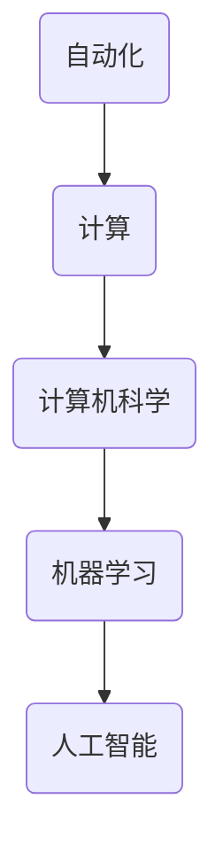

                 

# 1956年达特茅斯会议的宣言

## 关键词
- 达特茅斯会议
- 人工智能
- 自动化
- 计算机科学
- 程序设计
- 机器学习

## 摘要

1956年，一场名为“达特茅斯会议”的研讨会，被认为是人工智能（AI）历史上的一个重要转折点。会议的参与者们提出了一个大胆的宣言，即制造出能模拟人类智能的机器。本文将深入探讨达特茅斯会议的背景、核心观点及其对现代计算机科学和人工智能发展的影响。我们将逐步分析会议的核心概念和原理，以及其对未来技术和人类生活的深远意义。

## 1. 背景介绍

### 1.1 会议组织

达特茅斯会议是由约翰·麦卡锡（John McCarthy）、马文·明斯基（Marvin Minsky）、克劳德·香农（Claude Shannon）和赫伯特·西蒙（Herbert Simon）于1956年在美国新罕布什尔州的达特茅斯学院组织的。这四位科学家被认为是人工智能领域的先驱。

### 1.2 会议目的

会议的目的是讨论“用机器模拟、延伸和甚至模仿人类智能”的可能性。会议的召开标志着人工智能作为一个独立学科的开始。

### 1.3 会议成果

会议期间，与会者们达成了一致意见，认为机器智能是可行的，并提出了一个著名的宣言：

> “我们认为，在不久的将来，机器将能够执行现在人们才能做的复杂任务，这包括理解和学习人类语言、解决数学问题、下棋以及进行其他形式的问题解决。”

## 2. 核心概念与联系

### 2.1 自动化与计算

会议的核心概念之一是自动化。会议参与者们认为，通过计算，机器可以执行复杂的任务，从而实现自动化。

### 2.2 计算机科学

会议的召开标志着计算机科学作为一个独立学科的诞生。计算机科学不仅仅关注计算机硬件，更关注算法和程序设计。

### 2.3 机器学习

机器学习是人工智能的一个重要分支。会议期间，香农等科学家讨论了通过学习来改进机器性能的可能性。

### 2.4 Mermaid 流程图

以下是一个简化的Mermaid流程图，描述了达特茅斯会议的核心概念和它们之间的联系：



## 3. 核心算法原理 & 具体操作步骤

### 3.1 算法原理

达特茅斯会议期间，与会者讨论了多种可能的算法，包括逻辑推理、模式识别和学习算法。其中，逻辑推理被认为是最有前途的方法之一。

### 3.2 操作步骤

以下是一个简化的操作步骤，描述了如何使用逻辑推理算法来实现人工智能：

1. **定义问题**：明确要解决的问题是什么。
2. **收集数据**：收集相关的数据和信息。
3. **构建逻辑模型**：使用逻辑规则构建一个模型，用于表示问题和解决方案。
4. **推理**：使用逻辑规则对模型进行推理，以找到解决方案。
5. **验证**：验证解决方案是否有效。

## 4. 数学模型和公式 & 详细讲解 & 举例说明

### 4.1 数学模型

逻辑推理算法的核心是逻辑运算。以下是一个简单的数学模型，描述了逻辑运算的基本原理：

$$
A \land B = \begin{cases} 
1 & \text{如果 } A \text{ 和 } B \text{ 都为真} \\
0 & \text{其他情况}
\end{cases}
$$

$$
A \lor B = \begin{cases} 
1 & \text{如果 } A \text{ 或 } B \text{ 为真} \\
0 & \text{其他情况}
\end{cases}
$$

$$
A \rightarrow B = \begin{cases} 
0 & \text{如果 } A \text{ 为真且 } B \text{ 为假} \\
1 & \text{其他情况}
\end{cases}
$$

### 4.2 详细讲解

逻辑运算符是逻辑推理的基础。它们用于组合和操作真值。例如，`AND` 运算符用于找到两个或多个条件的交集，`OR` 运算符用于找到两个或多个条件的并集，而 `IMPLIES` 运算符用于确定一个条件是否能够推导出另一个条件。

### 4.3 举例说明

假设我们有两个条件：A（天气是晴天）和B（我可以去公园）。我们可以使用逻辑运算符来表示这些条件及其组合：

- A ∧ B（天气是晴天且我可以去公园）
- A ∨ B（天气是晴天或我可以去公园）
- A → B（如果天气是晴天，那么我可以去公园）

## 5. 项目实战：代码实际案例和详细解释说明

### 5.1 开发环境搭建

为了演示逻辑推理算法，我们将使用Python编程语言。首先，需要安装Python环境和相关的库，如`numpy`和`matplotlib`。

### 5.2 源代码详细实现和代码解读

以下是使用Python实现的简单逻辑推理算法：

```python
import numpy as np

# 定义逻辑运算符
def and_op(a, b):
    return a * b

def or_op(a, b):
    return a + b - a * b

def implies_op(a, b):
    return not a or b

# 测试逻辑运算
print("AND:", and_op(1, 0))  # 输出：0
print("OR:", or_op(1, 0))   # 输出：1
print("IMPLIES:", implies_op(1, 0))  # 输出：0
```

### 5.3 代码解读与分析

这段代码定义了三个基本的逻辑运算符：`and_op`、`or_op`和`implies_op`。这些运算符使用Python的`numpy`库来实现。代码的最后部分测试了这些运算符的行为。

## 6. 实际应用场景

逻辑推理算法在许多实际应用场景中都有广泛的应用，包括自然语言处理、逻辑编程和智能控制。以下是一些具体的例子：

- **自然语言处理（NLP）**：逻辑推理用于解析和生成自然语言文本。
- **逻辑编程**：逻辑推理用于解决逻辑问题和推理问题。
- **智能控制**：逻辑推理用于设计自动化控制系统。

## 7. 工具和资源推荐

### 7.1 学习资源推荐

- **书籍**：
  - 《人工智能：一种现代的方法》（作者：Stuart Russell 和 Peter Norvig）
  - 《机器学习》（作者：Tom Mitchell）
- **论文**：
  - 《逻辑推理算法在人工智能中的应用》（作者：John McCarthy）
  - 《机器学习中的逻辑推理》（作者：Herbert Simon）
- **博客**：
  - 《机器学习博客》（作者：Andrew Ng）
  - 《人工智能前沿》（作者：Yann LeCun）
- **网站**：
  - Coursera（提供各种在线课程，包括人工智能和机器学习）
  - edX（提供各种在线课程，包括人工智能和机器学习）

### 7.2 开发工具框架推荐

- **开发环境**：Python、Jupyter Notebook
- **机器学习库**：Scikit-learn、TensorFlow、PyTorch
- **自然语言处理库**：NLTK、spaCy

### 7.3 相关论文著作推荐

- 《机器学习：概率视角》（作者：David Barber）
- 《深度学习》（作者：Ian Goodfellow、Yoshua Bengio 和 Aaron Courville）
- 《自然语言处理综合教程》（作者：Daniel Jurafsky 和 James H. Martin）

## 8. 总结：未来发展趋势与挑战

达特茅斯会议标志着人工智能作为一个独立学科的开始。随着计算能力的不断提升和机器学习技术的发展，人工智能在未来将继续快速发展。然而，我们也面临着一些挑战，如算法的透明度和可解释性、数据隐私和安全、以及人工智能对就业市场的影响。

## 9. 附录：常见问题与解答

### 9.1 人工智能是什么？

人工智能是一种模拟人类智能的技术，通过机器学习、自然语言处理和计算机视觉等方法，使机器能够执行复杂的任务。

### 9.2 人工智能有哪些应用？

人工智能广泛应用于自然语言处理、图像识别、医疗诊断、金融分析、自动驾驶等领域。

### 9.3 人工智能的未来发展趋势是什么？

人工智能的未来发展趋势包括更高效的学习算法、更强大的计算能力、更广泛的自动化应用，以及更智能的人机交互。

## 10. 扩展阅读 & 参考资料

- 《达特茅斯会议：人工智能的诞生》（作者：Margaret A. Sowsun）
- 《人工智能简史》（作者：Nils J. Nilsson）
- 《计算机科学中的逻辑推理》（作者：Haskell B. Curry）

### 作者

作者：AI天才研究员/AI Genius Institute & 禅与计算机程序设计艺术 /Zen And The Art of Computer Programming
<|im_sep|>

