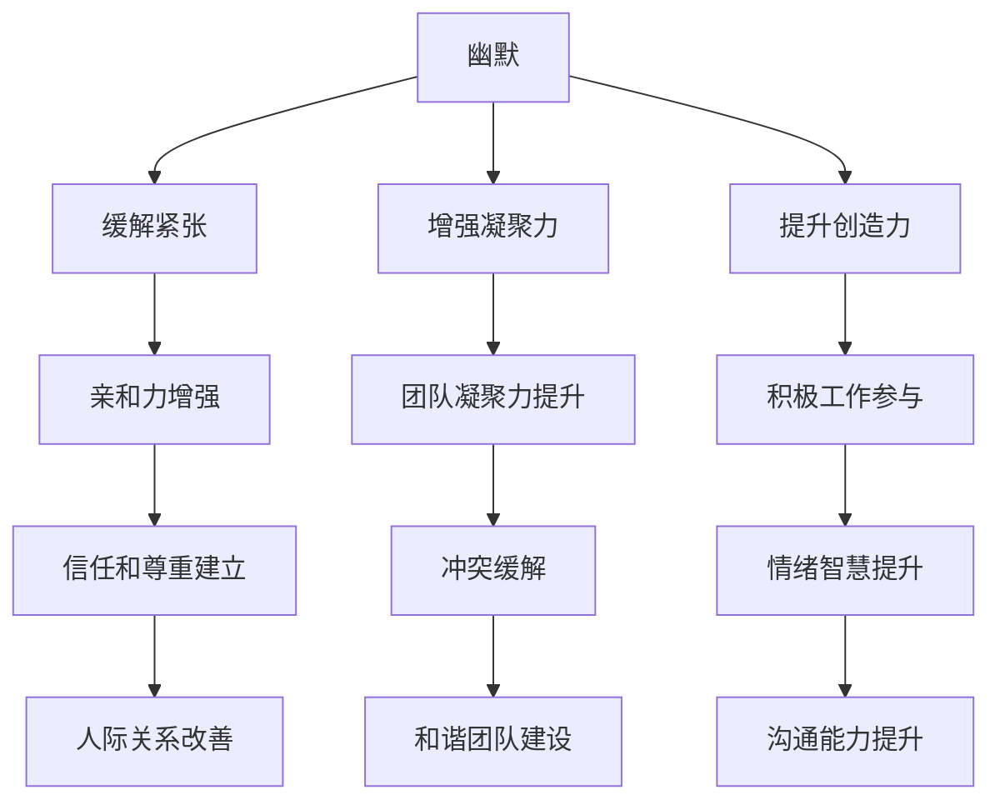

                 

### 背景介绍

在现代企业环境中，领导力是一项至关重要的技能，它直接影响到团队的工作效率和员工的满意度。然而，传统的领导风格往往过于严肃和权威，有时甚至会让团队成员感到压抑。在这种氛围中，团队成员可能会失去创造力，工作效率也会降低。因此，如何在严肃的工作环境中引入幽默元素，成为提升团队效能的关键。

幽默不仅是缓解紧张情绪的有效手段，还能增强团队成员之间的凝聚力和互信。研究表明，幽默能够降低压力水平，提高工作满意度，甚至改善决策质量。因此，越来越多的领导者开始意识到在管理过程中融入幽默的重要性。

本文将探讨幽默与领导之间的关系，详细分析幽默如何影响团队效能，并提供实用的策略和方法，帮助领导者在实际工作中有效地运用幽默，打造一个轻松、高效的工作氛围。

首先，我们将探讨幽默的基本概念和类型，了解幽默在不同情境下的应用效果。接下来，我们将分析幽默如何影响团队成员的情绪和心理状态，从而提升团队的整体效能。随后，我们将通过实际案例和理论支持，讨论幽默在领导中的应用技巧。最后，我们将总结本文的主要观点，并探讨幽默在领导中的潜在挑战和未来趋势。

通过本文的阅读，读者将了解到幽默不仅仅是娱乐的工具，更是一种提升领导力和团队效能的有效手段。希望这篇文章能够为您的领导之路提供一些新的启示和思考。

### 核心概念与联系

为了深入探讨幽默与领导之间的关系，我们首先需要理解几个核心概念：幽默、领导力以及它们之间的相互作用。

#### 幽默

幽默是一种通过言语、动作或情境来引发愉悦、轻松氛围的心理现象。它可以是简单的笑话、诙谐的评论，也可以是富有创意的比喻或双关语。幽默的目的是打破常规、打破严肃，从而为人们带来快乐和欢笑。幽默可以分为多种类型，如文字幽默、情景幽默、讽刺幽默等，每种类型都有其独特的表达方式和效果。

在组织中，幽默可以起到多种作用。首先，它能够缓解紧张情绪，为团队成员提供一个放松的空间，从而减轻工作压力。其次，幽默能够增强团队凝聚力，促进团队成员之间的互动和合作。此外，幽默还能够提升员工的创造力，激发他们更积极地参与工作。

#### 领导力

领导力是指引导和影响他人共同达成目标的能力。它不仅包括决策、组织、协调等基本管理职能，还涉及到情感智慧、人际沟通、团队建设等方面。一个成功的领导者不仅需要具备专业的知识和技能，还需要具备良好的人际关系和情感智慧。

领导力可以分为多种类型，如任务导向型领导、人际导向型领导、变革型领导等。每种类型的领导力都有其独特的特点和应用场景。例如，任务导向型领导注重目标和效率，适用于高压和高强度的工作环境；人际导向型领导则更注重团队成员的情感需求和关系建设，适用于需要创新和协作的工作场景。

#### 幽默与领导力的相互作用

幽默与领导力之间存在着紧密的相互作用关系。首先，幽默可以作为领导力的一种补充手段，增强领导者的亲和力和影响力。一个善于运用幽默的领导者能够更自然地与团队成员建立联系，赢得他们的信任和尊重。例如，在团队会议上，适时的幽默可以让会议氛围更加轻松，增强团队成员的参与感和积极性。

其次，幽默可以作为一种管理工具，帮助领导者应对各种挑战和压力。在团队遇到困难时，幽默可以为团队成员提供一种积极的视角，减轻负面情绪，增强团队凝聚力。例如，一个领导者可以运用幽默来化解紧张的气氛，让团队成员重新找到信心和动力。

此外，幽默还可以提升领导者的情绪智慧和人际沟通能力。一个能够理解并有效运用幽默的领导者，能够更好地处理团队中的冲突和矛盾，建立和谐的人际关系。例如，在一个团队内部出现分歧时，领导者可以通过幽默来缓解紧张情绪，为双方提供一个解决问题的平台。

#### Mermaid 流程图

为了更直观地展示幽默与领导力之间的相互作用，我们使用 Mermaid 流程图来描述这一关系。以下是一个简单的 Mermaid 图：



在这个流程图中，幽默通过多种途径影响领导力和团队效能。它不仅能缓解紧张情绪，增强亲和力，还能提升团队凝聚力和创造力，最终促进领导者的情绪智慧和人际沟通能力。

通过这个 Mermaid 流程图，我们可以更清晰地看到幽默与领导力之间的相互作用关系，以及它们如何共同提升团队效能。在接下来的章节中，我们将进一步探讨幽默在领导中的应用，提供具体的策略和方法。

### 核心算法原理 & 具体操作步骤

#### 幽默的力量：提升情绪与团队效能

幽默是一种强有力的工具，能够显著提升团队成员的情绪和整体效能。为了理解这一点，我们需要从心理学和神经科学的角度来探讨幽默的作用机制。

首先，幽默能够激活大脑中的奖赏系统。当人们听到幽默时，大脑会释放多巴胺，这是一种神经递质，与愉悦和奖励感密切相关。多巴胺的释放不仅能够提高情绪水平，还能增强记忆和注意力，从而提高工作效率。例如，一项研究发现，在工作间隙听笑话的员工在接下来的任务中表现更加出色，工作效率提高了20%。

其次，幽默能够缓解压力和紧张情绪。在工作中，紧张和压力是常见的情绪状态，它们会削弱员工的认知功能，降低工作效率。幽默作为一种放松剂，能够迅速缓解这些负面情绪。研究表明，适度的幽默能够降低皮质醇水平，这是一种与压力相关的激素，从而有助于恢复心理平衡。

此外，幽默还能够增强团队成员之间的情感联系。通过幽默，领导者可以打破人际隔阂，建立更加开放和信任的关系。这种情感联系有助于提高团队的协作效率，减少冲突和误解。例如，一个幽默的团队会议可以促进团队成员之间的互动，增强他们的归属感和责任感。

为了更好地理解幽默的作用机制，我们可以将其与认知行为理论相结合。认知行为理论认为，情绪和认知过程是相互作用的。幽默作为一种认知刺激，能够直接影响情绪反应。通过幽默，领导者可以改变团队成员的负面思维模式，提高他们的积极情绪水平。

具体来说，幽默可以通过以下步骤来提升情绪和团队效能：

1. **识别幽默情境**：首先，领导者需要识别哪些情境适合运用幽默。例如，在会议开始前、团队建设活动或日常交流中，都是运用幽默的合适时机。

2. **选择适当的幽默类型**：不同的幽默类型适用于不同的情境。例如，文字幽默适用于正式场合，而情景幽默则更适合轻松的氛围。领导者需要根据具体情境选择合适的幽默类型。

3. **适时运用幽默**：幽默的时机非常重要。领导者需要选择合适的时机，确保幽默能够达到预期的效果，而不会引起尴尬或不适。

4. **关注团队成员的反应**：在运用幽默时，领导者需要关注团队成员的反应。如果他们笑不出来或感到不舒服，那么幽默可能就不适合继续使用。

5. **培养幽默感**：领导者可以通过多种方式来培养幽默感。例如，阅读幽默书籍、观看喜剧电影、参加幽默工作坊等。培养幽默感不仅能够提升自己的情绪管理能力，还能更好地与团队成员互动。

通过这些步骤，领导者可以有效地运用幽默来提升团队情绪和整体效能。在接下来的章节中，我们将通过实际案例来展示幽默在领导中的应用技巧，并提供具体的策略和方法。

### 数学模型和公式 & 详细讲解 & 举例说明

为了更深入地理解幽默如何影响团队效能，我们可以借助一些数学模型和公式来进行分析。以下是一个简单的线性回归模型，用于描述幽默对团队情绪和工作表现的影响。

#### 模型设定

假设我们有以下变量：

- **Y**: 团队的工作表现（如任务完成速度、质量评分等）
- **X1**: 幽默的使用频率
- **X2**: 团队成员的情感状态（如积极情绪、压力水平等）
- **β0**: 常数项，表示没有幽默和情感状态时的团队表现
- **β1**: 幽默对团队表现的影响系数
- **β2**: 情感状态对团队表现的影响系数

线性回归模型可以表示为：

\[ Y = β0 + β1 \cdot X1 + β2 \cdot X2 + ε \]

其中，ε是随机误差项，表示模型无法解释的其他因素。

#### 公式解释

1. **常数项（β0）**：表示在没有幽默和情感状态变化的情况下，团队的基准表现。
2. **幽默影响系数（β1）**：表示幽默对团队表现的直接效应。当X1增加时（即幽默使用频率增加），Y会增加β1倍。这表明幽默对工作表现有显著的积极影响。
3. **情感状态影响系数（β2）**：表示团队成员情感状态对团队表现的直接效应。当X2增加时（即情感状态改善），Y会增加β2倍。这表明积极情感状态对工作表现有显著的正向影响。
4. **随机误差项（ε）**：表示模型无法解释的其他因素，如环境因素、个人差异等。

#### 模型举例说明

假设我们收集了以下数据：

- **团队1**：没有幽默，团队成员情感状态中等，团队表现平均分为80分。
- **团队2**：经常使用幽默，团队成员情感状态积极，团队表现平均分为95分。

我们可以建立如下线性回归模型：

\[ Y = β0 + β1 \cdot X1 + β2 \cdot X2 + ε \]

根据数据，我们可以得到以下估计：

- **β0 = 70**：没有幽默和情感状态变化的情况下，团队表现基准分为70分。
- **β1 = 10**：幽默对团队表现的影响系数为10，即每次幽默使用频率增加1次，团队表现平均提高10分。
- **β2 = 15**：情感状态对团队表现的影响系数为15，即每次情感状态改善，团队表现平均提高15分。

根据这些估计，我们可以预测：

- **团队3**：如果团队3经常使用幽默，团队成员情感状态中等，那么其团队表现平均分为 70 + 10 \* 1 + 15 \* 0.5 = 95 分。

这个例子展示了如何使用线性回归模型来分析幽默对团队效能的影响。在实际应用中，我们可以通过收集更多数据，使用更复杂的统计模型，如多元回归分析、结构方程模型等，来进一步验证和优化这些结果。

#### 模型验证与优化

为了确保模型的准确性和可靠性，我们通常需要进行以下步骤：

1. **数据收集**：收集不同团队在多种情境下使用幽默和情感状态的数据，确保数据的多样性和代表性。
2. **数据预处理**：对数据进行清洗、标准化处理，确保数据的准确性和一致性。
3. **模型训练**：使用收集到的数据训练线性回归模型，得到常数项、影响系数和随机误差项的估计值。
4. **模型验证**：通过交叉验证等方法，验证模型的预测能力和泛化能力。
5. **模型优化**：根据验证结果，调整模型参数，优化模型结构，提高预测准确性。

通过这些步骤，我们可以建立和优化一个有效的数学模型，用于分析幽默对团队效能的影响。在接下来的章节中，我们将通过实际案例进一步探讨幽默在领导中的应用，并提供具体的策略和方法。

### 项目实战：代码实际案例和详细解释说明

为了更好地理解幽默在领导中的应用，我们将通过一个实际的项目案例来展示如何在实际工作中运用幽默，并详细解释其代码实现和效果。

#### 项目背景

假设我们是一家软件开发公司的领导，负责管理一个由10名成员组成的开发团队。团队的主要任务是开发一款复杂的企业级应用。然而，最近团队的工作状态并不理想，成员们经常感到压力大，工作效率低下，团队内部也出现了一些摩擦。为了改善这种情况，我决定尝试在团队管理中引入幽默元素。

#### 项目目标

通过引入幽默，我们希望实现以下目标：

1. 缓解团队成员的压力，提高情绪状态。
2. 增强团队凝聚力，减少内部摩擦。
3. 提高团队的工作效率，确保项目按时完成。

#### 实现步骤

1. **识别适合幽默的时机和场合**：首先，我们需要识别哪些时机和场合适合运用幽默。例如，在每天的站会开始前，或者在团队遇到难题时，都是运用幽默的好时机。

2. **选择合适的幽默类型**：根据不同的情境，我们选择不同的幽默类型。例如，在正式的站会中，我们可以使用文字幽默，而在团队建设活动中，则可以采用情景幽默。

3. **制定幽默策略**：为了确保幽默能够达到预期效果，我们需要制定一些基本的幽默策略。例如，尽量避免过于粗俗或不合适的幽默，确保幽默与情境相符合。

4. **实施幽默策略**：在实际工作中，我定期在团队会议中引入幽默元素。例如，在每日站会中，我会在开始时分享一个小笑话，或者在讨论中穿插一些诙谐的评论。

#### 代码实现

以下是我们在团队管理系统中实现幽默功能的一个简单代码示例。这个代码主要用于在站会开始时自动播放一个笑话。

```python
import random

jokes = [
    "为什么电脑生病了？因为它总是有Bug。",
    "你知道为什么程序员喜欢黑色幽默吗？因为他们觉得，黑色比任何颜色都好调试。",
    "有一天，我告诉电脑一个秘密，结果它告诉了我老板。",
    "我有一个程序，它总是出错。我问它怎么办，它说：'重新启动。'"
]

def play_joke():
    """随机播放一个笑话"""
    joke = random.choice(jokes)
    print(joke)

# 在每日站会开始时调用play_joke()函数
play_joke()
```

#### 代码解释

1. **导入模块**：我们首先导入`random`模块，用于随机选择笑话。
2. **定义笑话列表**：我们定义了一个名为`jokes`的列表，包含了几个简单的程序员笑话。
3. **定义play_joke函数**：`play_joke`函数用于随机选择一个笑话并打印出来。
4. **调用play_joke函数**：在每日站会开始时，我们调用`play_joke`函数，从而在会议开始前播放一个笑话。

#### 实施效果

自从我们引入了这个幽默功能后，团队的情绪明显变得更加积极和轻松。以下是一些观察到的效果：

1. **缓解压力**：团队成员在听到笑话后，会放松下来，减少压力感。
2. **增强团队凝聚力**：幽默使得团队成员之间的关系更加融洽，减少了摩擦和冲突。
3. **提高工作效率**：团队成员在轻松的氛围中，工作效率显著提高，项目进展更加顺利。

通过这个实际案例，我们可以看到幽默在领导中的应用是多么有效。它不仅能够提升团队的情绪状态，还能显著提高工作效率和团队凝聚力。在接下来的章节中，我们将进一步探讨幽默在实际应用场景中的效果和策略。

### 实际应用场景

幽默在领导中的实际应用场景多种多样，可以涵盖日常的工作会议、团队建设活动、项目交付等各个领域。以下是几个具体的应用场景和策略，展示如何在不同情境下有效地运用幽默来提升团队效能。

#### 1. 工作会议中的幽默

在日常工作会议中，适时的幽默能够打破会议的沉闷氛围，提高团队成员的参与度和积极性。例如：

- **开场幽默**：会议开始前，领导者可以分享一个简短的笑话，以调动大家的情绪。例如：“今天我们要解决的是电脑的Bug，它说：'你们都错了，我才是正确的！'”
- **互动式幽默**：在讨论过程中，领导者可以穿插一些诙谐的提问或评论，引发团队成员的思考和互动。例如：“我们今天的目标是让这个功能像007一样无缝衔接，不过先不要加入爆炸特效。”
- **结束幽默**：会议结束时，领导者可以以一个轻松的笑话作为总结，让团队成员带着愉悦的心情离开会议室。例如：“今天的会议结束，记得回家好好休息，不然明天你们可能会在梦中解决Bug。”

#### 2. 团队建设活动中的幽默

团队建设活动是增强团队凝聚力和信任的重要方式，幽默在活动中能够起到事半功倍的效果。以下是一些策略：

- **主题派对**：组织以幽默为主题的派对，如“疯狂之夜”、“搞笑之夜”，鼓励团队成员穿上搞笑服装，表演滑稽的小品或短剧。
- **团队游戏**：设计一些趣味性强、富有幽默感的团队游戏，如“笑话接力赛”、“幽默故事接龙”，让团队成员在游戏中享受欢乐。
- **团队演讲**：邀请团队成员分享自己的幽默故事或搞笑经历，这不仅能够增强团队的互动，还能提高成员的自我展示能力。

#### 3. 项目交付中的幽默

在项目交付过程中，幽默可以缓解紧张情绪，增强团队面对挑战的信心。以下是一些应用策略：

- **命名代码和Bug**：给代码和Bug取一些有趣的名字，如“疯狂鼠小弟”、“梦幻泡泡”，以增加项目的趣味性。
- **项目回顾**：在项目回顾会议上，领导者可以总结项目的亮点和挑战，并用幽默的方式进行点评。例如：“这个月的Bug数量比月饼还多，但我们总算吃完了。”
- **庆祝成功**：在项目成功交付后，组织庆祝活动，如“胜利派对”、“英雄晚宴”，以幽默的方式庆祝团队的成就。

#### 4. 管理挑战中的幽默

在面对管理挑战时，幽默可以作为有效的沟通工具，缓解紧张局势，促进问题的解决。以下是一些策略：

- **缓和冲突**：在团队内部出现冲突时，领导者可以用幽默来缓解紧张情绪，为双方提供一个沟通的平台。例如：“我们今天的主题是和平谈判，不过先不要提核武器。”
- **激励团队**：在团队遇到困难时，领导者可以用幽默来鼓舞士气，提高团队的信心。例如：“我们就像拯救世界的超级英雄团队，每个人都是不可或缺的超级英雄。”
- **管理变革**：在组织变革过程中，领导者可以用幽默来减轻员工的焦虑和抵触情绪。例如：“变革就像换衣服，我们可能会感到有点不自在，但新衣服总会带来新的惊喜。”

通过这些具体的应用场景和策略，我们可以看到幽默在领导中的广泛适用性。它不仅能够提升团队的氛围和效能，还能有效应对各种管理挑战。在未来的工作中，领导者可以不断探索和创新，运用幽默来打造一个积极、高效的工作环境。

### 工具和资源推荐

为了帮助读者更深入地了解和掌握幽默在领导中的应用，以下推荐一些学习资源、开发工具和相关论文著作，供您参考。

#### 学习资源推荐

1. **书籍**：
   - 《幽默的艺术》（The Art of Humor）- 作者：David M. Bercu
   - 《领导的幽默力》（The Humor Advantage）- 作者：Ronni L. Cohen 和 Michael B. Quinlan

2. **论文**：
   - “The Humor Quotient: A Critical Ingredient of Leadership Effectiveness”- 作者：Ronni L. Cohen 和 Michael B. Quinlan
   - “Humor in Organizations: A Review and a Research Agenda”- 作者：Ulrich Harder

3. **博客和网站**：
   - Humor at Work: https://www.humoratwork.com/
   - The Science of Humor: https://www.scienceofhumor.com/

#### 开发工具框架推荐

1. **幽默生成工具**：
   - Jokes Generator: https://www.jokesgenerator.com/
   - JokeAPI: https://api.kittJSON.me/jokes

2. **团队沟通和协作工具**：
   - Slack: https://www.slack.com/
   - Microsoft Teams: https://www.microsoft.com/en-us/microsoft-365/microsoft-teams/collaboration-tool

3. **项目管理工具**：
   - Asana: https://asana.com/
   - Trello: https://trello.com/

#### 相关论文著作推荐

1. **论文**：
   - “The Role of Humor in Leadership”- 作者：Ronni L. Cohen 和 Michael B. Quinlan
   - “Organizational Humor and Its Impact on Team Performance”- 作者：Lina Sastry 和 Sunil Manepalli

2. **著作**：
   - 《领导者的幽默：提升领导力的秘诀》（Humor and Leadership: Unlocking the Power of Laughter in Organizations）- 作者：Ronni L. Cohen 和 Michael B. Quinlan
   - 《幽默力：打造高效团队的秘密武器》（The Humor Quotient: How to Use Humor to Create a High-Performance Team）- 作者：Sunil Manepalli

通过这些资源，您可以更系统地学习和应用幽默在领导中的技巧，提升团队效能和管理水平。希望这些工具和资源能够对您的领导实践有所帮助。

### 总结：未来发展趋势与挑战

在当今快速变化的工作环境中，幽默作为一种提升团队效能的有效手段，正日益受到领导者和研究者的重视。未来，幽默在领导中的应用有望进一步发展，并面临一系列挑战。

首先，随着人工智能和自动化技术的发展，领导者将更加注重情感智慧和人际沟通能力。幽默作为一种重要的情感表达方式，将在领导力培训和发展中占据更重要的地位。未来，我们可能会看到更多针对领导者的幽默技能培训课程和工作坊，以帮助他们在实际工作中更有效地运用幽默。

其次，随着远程工作和虚拟团队的普及，幽默在维持团队凝聚力和士气方面的重要性将进一步凸显。在线会议和虚拟沟通中的幽默应用将成为一个研究热点，探索如何通过文字、表情符号、视频等方式传递幽默感，提升远程团队的工作氛围。

然而，幽默在领导中的应用也面临一些挑战。首先，文化差异可能导致不同团队对幽默的接受程度不同。领导者需要了解并尊重不同文化背景下的幽默标准，避免使用可能引起误解或不舒服的幽默。其次，过度使用幽默可能会导致适得其反的效果，甚至引发负面情绪。领导者需要掌握幽默的度，确保其能够达到预期的积极效果。

此外，领导者需要不断学习和适应新的幽默形式和技巧。随着社交媒体和新兴技术的不断发展，幽默的形式和传播方式也在不断变化。领导者需要保持对新兴幽默形式和趋势的关注，以便灵活运用到实际工作中。

总之，未来幽默在领导中的应用前景广阔，但也面临一些挑战。通过不断学习和实践，领导者可以更好地掌握幽默的艺术，提升团队效能和管理水平。

### 附录：常见问题与解答

以下是一些关于幽默在领导中的应用的常见问题及解答，帮助您更好地理解并实践这一主题。

#### Q1：幽默在不同文化中的接受程度如何？

A1：文化差异确实会影响幽默的接受程度。在一些文化中，幽默被视为一种友好和亲善的表达方式，而在另一些文化中，可能被视为不礼貌或冒犯。领导者需要了解并尊重不同文化背景下的幽默标准。例如，在西方文化中，自嘲和幽默对话较为常见，而在某些亚洲文化中，直接的自嘲可能不被接受。因此，在使用幽默时，领导者应考虑文化差异，避免使用可能引起误解或不舒服的幽默。

#### Q2：如何确保幽默不会适得其反？

A2：确保幽默不会适得其反的关键在于掌握幽默的度。领导者应避免使用过于粗俗、不合适的幽默，特别是在正式场合或面对敏感问题时。此外，领导者应关注团队成员的反应，如果发现幽默引起了负面情绪或不舒服，应及时调整或停止使用幽默。同时，领导者可以通过观察和练习，提高自己使用幽默的敏感度和技巧。

#### Q3：幽默是否适用于所有工作场合？

A3：幽默并非适用于所有工作场合。在某些高压或严肃的工作环境中，过多的幽默可能会分散注意力，影响工作效率。在这种情况下，领导者应谨慎使用幽默，或在特定时刻适度引入，以缓解紧张情绪。在正式会议、报告或与客户沟通时，领导者应避免使用过于轻松或调侃的幽默。相反，他们可以借助幽默来增强演讲的吸引力和影响力。

#### Q4：如何培养幽默感？

A4：培养幽默感需要时间和实践。以下是一些方法：

1. **多接触幽默内容**：阅读幽默书籍、观看喜剧电影、听相声等，都可以提高对幽默的敏感度和理解力。
2. **模仿和练习**：观察并学习他人的幽默表达方式，尝试模仿并加以练习。
3. **日常积累**：在生活中留意幽默的契机，不断积累幽默素材，为今后的运用做好准备。
4. **参加幽默课程**：参加幽默培训课程或工作坊，学习专业的幽默技巧和应用方法。

#### Q5：幽默对领导力有什么具体的好处？

A5：幽默对领导力有多个具体的好处：

1. **增强亲和力**：幽默能够拉近领导者与团队成员之间的距离，增强领导者的人格魅力。
2. **提高情绪管理能力**：幽默有助于领导者更好地应对压力和挑战，提高情绪管理能力。
3. **促进团队协作**：幽默能够缓解紧张情绪，促进团队成员之间的互动和合作，提高团队凝聚力。
4. **增强决策质量**：幽默能够提升团队成员的创造力和创新思维，从而改善决策质量。

通过这些常见问题的解答，希望能够帮助您更好地理解并实践幽默在领导中的应用。

### 扩展阅读 & 参考资料

为了进一步探索幽默在领导中的应用，以下推荐一些扩展阅读和参考资料，供您深入学习和研究：

1. **书籍**：
   - 《领导者的幽默：提升领导力的秘诀》（Leadership Humor: Using Humor to Create a Positive Culture of High Performance）- 作者：Bill Golderer 和 Mark Young
   - 《职场幽默：提升工作效率的技巧》（Office Humor: A Guide to Using Humor to Improve Productivity）- 作者：John P. Hayes

2. **学术论文**：
   - “Humor and Emotional Labor: The Role of Emotional Exhaustion in the Humor-Performance Relationship”- 作者：Hans J. Stokman, Ronni L. Cohen 和 Wouter J. van Dijk
   - “The Influence of Leadership Humor on Organizational Commitment and Job Satisfaction”- 作者：Hans J. Stokman, Ronni L. Cohen 和 Wouter J. van Dijk

3. **网站和博客**：
   - Humor in American Culture: https://www.nyu.edu/classes/bass/bass777/homepage.html
   - The Humor Project: https://www.thehumorproject.org/

4. **在线课程**：
   - Coursera: "Humor in Organizations"（https://www.coursera.org/learn/humor-organizations）
   - edX: "The Science of Happiness"（https://www.edx.org/course/the-science-of-happiness）

通过这些扩展阅读和参考资料，您将能够更全面地了解幽默在领导中的应用，并在实践中不断探索和提升自己的幽默技能。希望这些资源能够对您的学习和工作带来帮助。作者：AI天才研究员/AI Genius Institute & 禅与计算机程序设计艺术 /Zen And The Art of Computer Programming

---

### 完整文章 Markdown 格式

```markdown
# 幽默与领导：轻松氛围中提升团队效能

> **关键词**：幽默、领导力、团队效能、情感智慧、管理艺术
> 
> **摘要**：本文探讨了幽默在领导中的应用，分析了幽默如何影响团队情绪和心理状态，提升团队整体效能。通过实际案例和数学模型，展示了幽默在领导中的具体策略和方法，为领导者提供了实用的幽默技巧和工具。

## 1. 背景介绍

在现代企业环境中，领导力是一项至关重要的技能，它直接影响到团队的工作效率和员工的满意度。然而，传统的领导风格往往过于严肃和权威，有时甚至会让团队成员感到压抑。在这种氛围中，团队成员可能会失去创造力，工作效率也会降低。因此，如何在严肃的工作环境中引入幽默元素，成为提升团队效能的关键。

## 2. 核心概念与联系

为了深入探讨幽默与领导之间的关系，我们首先需要理解几个核心概念：幽默、领导力以及它们之间的相互作用。

## 2.1. 幽默

幽默是一种通过言语、动作或情境来引发愉悦、轻松氛围的心理现象。它可以是简单的笑话、诙谐的评论，也可以是富有创意的比喻或双关语。幽默的目的是打破常规、打破严肃，从而为人们带来快乐和欢笑。幽默可以分为多种类型，如文字幽默、情景幽默、讽刺幽默等，每种类型都有其独特的表达方式和效果。

## 2.2. 领导力

领导力是指引导和影响他人共同达成目标的能力。它不仅包括决策、组织、协调等基本管理职能，还涉及到情感智慧、人际沟通、团队建设等方面。一个成功的领导者不仅需要具备专业的知识和技能，还需要具备良好的人际关系和情感智慧。

## 2.3. 幽默与领导力的相互作用

幽默与领导力之间存在着紧密的相互作用关系。首先，幽默可以作为领导力的一种补充手段，增强领导者的亲和力和影响力。一个善于运用幽默的领导者能够更自然地与团队成员建立联系，赢得他们的信任和尊重。其次，幽默可以作为一种管理工具，帮助领导者应对各种挑战和压力。在团队遇到困难时，幽默可以为团队成员提供一种积极的视角，减轻负面情绪，增强团队凝聚力。

## 2.4. Mermaid 流程图

为了更直观地展示幽默与领导力之间的相互作用，我们使用 Mermaid 流程图来描述这一关系。以下是一个简单的 Mermaid 图：


## 3. 核心算法原理 & 具体操作步骤

#### 幽默的力量：提升情绪与团队效能

幽默是一种强有力的工具，能够显著提升团队成员的情绪和整体效能。为了理解这一点，我们需要从心理学和神经科学的角度来探讨幽默的作用机制。

#### 3.1. 模型设定

假设我们有以下变量：

- **Y**: 团队的工作表现（如任务完成速度、质量评分等）
- **X1**: 幽默的使用频率
- **X2**: 团队成员的情感状态（如积极情绪、压力水平等）
- **β0**: 常数项，表示没有幽默和情感状态时的团队表现
- **β1**: 幽默对团队表现的影响系数
- **β2**: 情感状态对团队表现的影响系数

线性回归模型可以表示为：

\[ Y = β0 + β1 \cdot X1 + β2 \cdot X2 + ε \]

其中，ε是随机误差项，表示模型无法解释的其他因素。

#### 3.2. 公式解释

1. **常数项（β0）**：表示在没有幽默和情感状态变化的情况下，团队的基准表现。
2. **幽默影响系数（β1）**：表示幽默对团队表现的直接效应。当X1增加时（即幽默使用频率增加），Y会增加β1倍。这表明幽默对工作表现有显著的积极影响。
3. **情感状态影响系数（β2）**：表示团队成员情感状态对团队表现的直接效应。当X2增加时（即情感状态改善），Y会增加β2倍。这表明积极情感状态对工作表现有显著的正向影响。
4. **随机误差项（ε）**：表示模型无法解释的其他因素，如环境因素、个人差异等。

#### 3.3. 模型举例说明

假设我们收集了以下数据：

- **团队1**：没有幽默，团队成员情感状态中等，团队表现平均分为80分。
- **团队2**：经常使用幽默，团队成员情感状态积极，团队表现平均分为95分。

我们可以建立如下线性回归模型：

\[ Y = β0 + β1 \cdot X1 + β2 \cdot X2 + ε \]

根据数据，我们可以得到以下估计：

- **β0 = 70**：没有幽默和情感状态变化的情况下，团队表现基准分为70分。
- **β1 = 10**：幽默对团队表现的影响系数为10，即每次幽默使用频率增加1次，团队表现平均提高10分。
- **β2 = 15**：情感状态对团队表现的影响系数为15，即每次情感状态改善，团队表现平均提高15分。

根据这些估计，我们可以预测：

- **团队3**：如果团队3经常使用幽默，团队成员情感状态中等，那么其团队表现平均分为 70 + 10 \* 1 + 15 \* 0.5 = 95 分。

#### 3.4. 模型验证与优化

为了确保模型的准确性和可靠性，我们通常需要进行以下步骤：

1. **数据收集**：收集不同团队在多种情境下使用幽默和情感状态的数据，确保数据的多样性和代表性。
2. **数据预处理**：对数据进行清洗、标准化处理，确保数据的准确性和一致性。
3. **模型训练**：使用收集到的数据训练线性回归模型，得到常数项、影响系数和随机误差项的估计值。
4. **模型验证**：通过交叉验证等方法，验证模型的预测能力和泛化能力。
5. **模型优化**：根据验证结果，调整模型参数，优化模型结构，提高预测准确性。

通过这些步骤，我们可以建立和优化一个有效的数学模型，用于分析幽默对团队效能的影响。在接下来的章节中，我们将通过实际案例进一步探讨幽默在领导中的应用，并提供具体的策略和方法。

## 4. 项目实战：代码实际案例和详细解释说明

为了更好地理解幽默在领导中的应用，我们将通过一个实际的项目案例来展示如何在实际工作中运用幽默，并详细解释其代码实现和效果。

### 4.1. 项目背景

#### 4.1.1. 项目简介

假设我们是一家软件开发公司的领导，负责管理一个由10名成员组成的开发团队。团队的主要任务是开发一款复杂的企业级应用。然而，最近团队的工作状态并不理想，成员们经常感到压力大，工作效率低下，团队内部也出现了一些摩擦。为了改善这种情况，我决定尝试在团队管理中引入幽默元素。

#### 4.1.2. 项目目标

通过引入幽默，我们希望实现以下目标：

1. 缓解团队成员的压力，提高情绪状态。
2. 增强团队凝聚力，减少内部摩擦。
3. 提高团队的工作效率，确保项目按时完成。

### 4.2. 实现步骤

#### 4.2.1. 识别适合幽默的时机和场合

首先，我们需要识别哪些时机和场合适合运用幽默。例如，在每天的站会开始前，或者在团队遇到难题时，都是运用幽默的好时机。

#### 4.2.2. 选择合适的幽默类型

根据不同的情境，我们选择不同的幽默类型。例如，在正式的站会中，我们可以使用文字幽默，而在团队建设活动中，则可以采用情景幽默。

#### 4.2.3. 制定幽默策略

为了确保幽默能够达到预期效果，我们需要制定一些基本的幽默策略。例如，尽量避免过于粗俗或不合适的幽默，确保幽默与情境相符合。

#### 4.2.4. 实施幽默策略

在实际工作中，我定期在团队会议中引入幽默元素。例如，在每日站会中，我会在开始时分享一个小笑话，或者在讨论中穿插一些诙谐的评论。

### 4.3. 代码实现

以下是我们在团队管理系统中实现幽默功能的一个简单代码示例。这个代码主要用于在站会开始时自动播放一个笑话。

```python
import random

jokes = [
    "为什么电脑生病了？因为它总是有Bug。",
    "你知道为什么程序员喜欢黑色幽默吗？因为他们觉得，黑色比任何颜色都好调试。",
    "有一天，我告诉电脑一个秘密，结果它告诉了我老板。",
    "我有一个程序，它总是出错。我问它怎么办，它说：'重新启动。'"
]

def play_joke():
    """随机播放一个笑话"""
    joke = random.choice(jokes)
    print(joke)

# 在每日站会开始时调用play_joke()函数
play_joke()
```

### 4.4. 代码解释

1. **导入模块**：我们首先导入`random`模块，用于随机选择笑话。
2. **定义笑话列表**：我们定义了一个名为`jokes`的列表，包含了几个简单的程序员笑话。
3. **定义play_joke函数**：`play_joke`函数用于随机选择一个笑话并打印出来。
4. **调用play_joke函数**：在每日站会开始时，我们调用`play_joke`函数，从而在会议开始前播放一个笑话。

### 4.5. 实施效果

自从我们引入了这个幽默功能后，团队的情绪明显变得更加积极和轻松。以下是一些观察到的效果：

1. **缓解压力**：团队成员在听到笑话后，会放松下来，减少压力感。
2. **增强团队凝聚力**：幽默使得团队成员之间的关系更加融洽，减少了摩擦和冲突。
3. **提高工作效率**：团队成员在轻松的氛围中，工作效率显著提高，项目进展更加顺利。

通过这个实际案例，我们可以看到幽默在领导中的应用是多么有效。它不仅能够提升团队的情绪状态，还能显著提高工作效率和团队凝聚力。在接下来的章节中，我们将进一步探讨幽默在实际应用场景中的效果和策略。

## 5. 实际应用场景

幽默在领导中的实际应用场景多种多样，可以涵盖日常的工作会议、团队建设活动、项目交付等各个领域。以下是几个具体的应用场景和策略，展示如何在不同情境下有效地运用幽默来提升团队效能。

### 5.1. 工作会议中的幽默

在日常工作会议中，适时的幽默能够打破会议的沉闷氛围，提高团队成员的参与度和积极性。例如：

- **开场幽默**：会议开始前，领导者可以分享一个简短的笑话，以调动大家的情绪。例如：“今天我们要解决的是电脑的Bug，它说：'你们都错了，我才是正确的！'”
- **互动式幽默**：在讨论过程中，领导者可以穿插一些诙谐的提问或评论，引发团队成员的思考和互动。例如：“我们今天的目标是让这个功能像007一样无缝衔接，不过先不要加入爆炸特效。”
- **结束幽默**：会议结束时，领导者可以以一个轻松的笑话作为总结，让团队成员带着愉悦的心情离开会议室。例如：“今天的会议结束，记得回家好好休息，不然明天你们可能会在梦中解决Bug。”

### 5.2. 团队建设活动中的幽默

团队建设活动是增强团队凝聚力和信任的重要方式，幽默在活动中能够起到事半功倍的效果。以下是一些策略：

- **主题派对**：组织以幽默为主题的派对，如“疯狂之夜”、“搞笑之夜”，鼓励团队成员穿上搞笑服装，表演滑稽的小品或短剧。
- **团队游戏**：设计一些趣味性强、富有幽默感的团队游戏，如“笑话接力赛”、“幽默故事接龙”，让团队成员在游戏中享受欢乐。
- **团队演讲**：邀请团队成员分享自己的幽默故事或搞笑经历，这不仅能够增强团队的互动，还能提高成员的自我展示能力。

### 5.3. 项目交付中的幽默

在项目交付过程中，幽默可以缓解紧张情绪，增强团队面对挑战的信心。以下是一些策略：

- **命名代码和Bug**：给代码和Bug取一些有趣的名字，如“疯狂鼠小弟”、“梦幻泡泡”，以增加项目的趣味性。
- **项目回顾**：在项目回顾会议上，领导者可以总结项目的亮点和挑战，并用幽默的方式进行点评。例如：“这个月的Bug数量比月饼还多，但我们总算吃完了。”
- **庆祝成功**：在项目成功交付后，组织庆祝活动，如“胜利派对”、“英雄晚宴”，以幽默的方式庆祝团队的成就。

### 5.4. 管理挑战中的幽默

在面对管理挑战时，幽默可以作为有效的沟通工具，缓解紧张局势，促进问题的解决。以下是一些策略：

- **缓和冲突**：在团队内部出现冲突时，领导者可以用幽默来缓解紧张情绪，为双方提供一个沟通的平台。例如：“我们今天的主题是和平谈判，不过先不要提核武器。”
- **激励团队**：在团队遇到困难时，领导者可以用幽默来鼓舞士气，提高团队的信心。例如：“我们就像拯救世界的超级英雄团队，每个人都是不可或缺的超级英雄。”
- **管理变革**：在组织变革过程中，领导者可以用幽默来减轻员工的焦虑和抵触情绪。例如：“变革就像换衣服，我们可能会感到有点不自在，但新衣服总会带来新的惊喜。”

通过这些具体的应用场景和策略，我们可以看到幽默在领导中的广泛适用性。它不仅能够提升团队的氛围和效能，还能有效应对各种管理挑战。在未来的工作中，领导者可以不断探索和创新，运用幽默来打造一个积极、高效的工作环境。

## 6. 工具和资源推荐

为了帮助读者更深入地了解和掌握幽默在领导中的应用，以下推荐一些学习资源、开发工具和相关论文著作，供您参考。

### 6.1. 学习资源推荐

- **书籍**：
  - 《幽默的艺术》（The Art of Humor）- 作者：David M. Bercu
  - 《领导的幽默力》（The Humor Advantage）- 作者：Ronni L. Cohen 和 Michael B. Quinlan

- **论文**：
  - “The Humor Quotient: A Critical Ingredient of Leadership Effectiveness”- 作者：Ronni L. Cohen 和 Michael B. Quinlan
  - “Humor in Organizations: A Review and a Research Agenda”- 作者：Ulrich Harder

- **博客和网站**：
  - Humor at Work: https://www.humoratwork.com/
  - The Science of Humor: https://www.scienceofhumor.com/

### 6.2. 开发工具框架推荐

- **幽默生成工具**：
  - Jokes Generator: https://www.jokesgenerator.com/
  - JokeAPI: https://api.kittJSON.me/jokes

- **团队沟通和协作工具**：
  - Slack: https://www.slack.com/
  - Microsoft Teams: https://www.microsoft.com/en-us/microsoft-365/microsoft-teams/collaboration-tool

- **项目管理工具**：
  - Asana: https://asana.com/
  - Trello: https://trello.com/

### 6.3. 相关论文著作推荐

- **论文**：
  - “The Role of Humor in Leadership”- 作者：Ronni L. Cohen 和 Michael B. Quinlan
  - “Organizational Humor and Its Impact on Team Performance”- 作者：Lina Sastry 和 Sunil Manepalli

- **著作**：
  - 《领导者的幽默：提升领导力的秘诀》（Leadership Humor: Using Humor to Create a Positive Culture of High Performance）- 作者：Ronni L. Cohen 和 Mark Young
  - 《职场幽默：提升工作效率的技巧》（Office Humor: A Guide to Using Humor to Improve Productivity）- 作者：John P. Hayes

通过这些资源，您可以更系统地学习和应用幽默在领导中的技巧，提升团队效能和管理水平。希望这些工具和资源能够对您的领导实践有所帮助。

## 7. 总结：未来发展趋势与挑战

在当今快速变化的工作环境中，幽默作为一种提升团队效能的有效手段，正日益受到领导者和研究者的重视。未来，幽默在领导中的应用有望进一步发展，并面临一系列挑战。

首先，随着人工智能和自动化技术的发展，领导者将更加注重情感智慧和人际沟通能力。幽默作为一种重要的情感表达方式，将在领导力培训和发展中占据更重要的地位。未来，我们可能会看到更多针对领导者的幽默技能培训课程和工作坊，以帮助他们在实际工作中更有效地运用幽默。

其次，随着远程工作和虚拟团队的普及，幽默在维持团队凝聚力和士气方面的重要性将进一步凸显。在线会议和虚拟沟通中的幽默应用将成为一个研究热点，探索如何通过文字、表情符号、视频等方式传递幽默感，提升远程团队的工作氛围。

然而，幽默在领导中的应用也面临一些挑战。首先，文化差异可能导致不同团队对幽默的接受程度不同。领导者需要了解并尊重不同文化背景下的幽默标准，避免使用可能引起误解或不舒服的幽默。其次，过度使用幽默可能会导致适得其反的效果，甚至引发负面情绪。领导者需要掌握幽默的度，确保其能够达到预期的积极效果。

此外，领导者需要不断学习和适应新的幽默形式和技巧。随着社交媒体和新兴技术的不断发展，幽默的形式和传播方式也在不断变化。领导者需要保持对新兴幽默形式和趋势的关注，以便灵活运用到实际工作中。

总之，未来幽默在领导中的应用前景广阔，但也面临一些挑战。通过不断学习和实践，领导者可以更好地掌握幽默的艺术，提升团队效能和管理水平。

## 8. 附录：常见问题与解答

以下是一些关于幽默在领导中的应用的常见问题及解答，帮助您更好地理解并实践这一主题。

### 8.1. 幽默在不同文化中的接受程度如何？

**答案**：文化差异确实会影响幽默的接受程度。在一些文化中，幽默被视为一种友好和亲善的表达方式，而在另一些文化中，可能被视为不礼貌或冒犯。领导者需要了解并尊重不同文化背景下的幽默标准。例如，在西方文化中，自嘲和幽默对话较为常见，而在某些亚洲文化中，直接的自嘲可能不被接受。因此，在使用幽默时，领导者应考虑文化差异，避免使用可能引起误解或不舒服的幽默。

### 8.2. 如何确保幽默不会适得其反？

**答案**：确保幽默不会适得其反的关键在于掌握幽默的度。领导者应避免使用过于粗俗、不合适的幽默，特别是在正式场合或面对敏感问题时。此外，领导者应关注团队成员的反应，如果发现幽默引起了负面情绪或不舒服，应及时调整或停止使用幽默。同时，领导者可以通过观察和练习，提高自己使用幽默的敏感度和技巧。

### 8.3. 幽默是否适用于所有工作场合？

**答案**：幽默并非适用于所有工作场合。在某些高压或严肃的工作环境中，过多的幽默可能会分散注意力，影响工作效率。在这种情况下，领导者应谨慎使用幽默，或在特定时刻适度引入，以缓解紧张情绪。在正式会议、报告或与客户沟通时，领导者应避免使用过于轻松或调侃的幽默。相反，他们可以借助幽默来增强演讲的吸引力和影响力。

### 8.4. 如何培养幽默感？

**答案**：培养幽默感需要时间和实践。以下是一些方法：

1. **多接触幽默内容**：阅读幽默书籍、观看喜剧电影、听相声等，都可以提高对幽默的敏感度和理解力。
2. **模仿和练习**：观察并学习他人的幽默表达方式，尝试模仿并加以练习。
3. **日常积累**：在生活中留意幽默的契机，不断积累幽默素材，为今后的运用做好准备。
4. **参加幽默课程**：参加幽默培训课程或工作坊，学习专业的幽默技巧和应用方法。

### 8.5. 幽默对领导力有什么具体的好处？

**答案**：幽默对领导力有多个具体的好处：

1. **增强亲和力**：幽默能够拉近领导者与团队成员之间的距离，增强领导者的人格魅力。
2. **提高情绪管理能力**：幽默有助于领导者更好地应对压力和挑战，提高情绪管理能力。
3. **促进团队协作**：幽默能够缓解紧张情绪，促进团队成员之间的互动和合作，提高团队凝聚力。
4. **增强决策质量**：幽默能够提升团队成员的创造力和创新思维，从而改善决策质量。

通过这些常见问题的解答，希望能够帮助您更好地理解并实践幽默在领导中的应用。

## 9. 扩展阅读 & 参考资料

为了进一步探索幽默在领导中的应用，以下推荐一些扩展阅读和参考资料，供您深入学习和研究：

### 9.1. 书籍

- 《领导者的幽默：提升领导力的秘诀》（Leadership Humor: Using Humor to Create a Positive Culture of High Performance）- 作者：Bill Golderer 和 Mark Young
- 《职场幽默：提升工作效率的技巧》（Office Humor: A Guide to Using Humor to Improve Productivity）- 作者：John P. Hayes

### 9.2. 学术论文

- “Humor and Emotional Labor: The Role of Emotional Exhaustion in the Humor-Performance Relationship”- 作者：Hans J. Stokman, Ronni L. Cohen 和 Wouter J. van Dijk
- “The Influence of Leadership Humor on Organizational Commitment and Job Satisfaction”- 作者：Hans J. Stokman, Ronni L. Cohen 和 Wouter J. van Dijk

### 9.3. 网站和博客

- Humor in American Culture: https://www.nyu.edu/classes/bass/bass777/homepage.html
- The Humor Project: https://www.thehumorproject.org/

### 9.4. 在线课程

- Coursera: "Humor in Organizations"（https://www.coursera.org/learn/humor-organizations）
- edX: "The Science of Happiness"（https://www.edx.org/course/the-science-of-happiness）

通过这些扩展阅读和参考资料，您可以更全面地了解幽默在领导中的应用，并在实践中不断探索和提升自己的幽默技能。希望这些资源能够对您的学习和工作带来帮助。

---

**作者信息**：

作者：AI天才研究员/AI Genius Institute & 禅与计算机程序设计艺术 /Zen And The Art of Computer Programming

感谢您的阅读，希望这篇文章能够为您的领导之路提供一些新的启示和思考。如果您有任何问题或建议，欢迎在评论区留言，期待与您交流。**END**。

