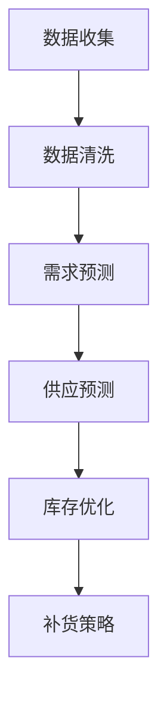

                 

# 库存优化：AI在库存管理中的作用

## 关键词：库存管理、人工智能、算法优化、数据驱动、供应链、预测分析

## 摘要

本文旨在探讨人工智能（AI）在库存管理领域的作用，特别是在库存优化方面的应用。通过深入分析库存管理的基本概念和现有挑战，本文将介绍AI的核心算法和数学模型，并详细解释其原理和具体操作步骤。此外，本文还将通过实际项目案例，展示如何利用AI技术实现库存优化的实战应用。文章最后，将对未来发展趋势和挑战进行展望，并提供相关学习资源和工具推荐。

## 1. 背景介绍

### 1.1 库存管理的定义和重要性

库存管理是企业管理中至关重要的一环，它涉及对原材料、产品、半成品和成品的存储和监控。有效管理库存不仅可以减少库存成本，还可以提高生产效率和客户满意度。

### 1.2 库存管理的挑战

随着企业规模的扩大和供应链的全球化，库存管理面临着越来越多的挑战：

- **数据复杂性**：库存数据通常非常庞大且复杂，包括不同类型的物品、不同的存储位置、不同的需求变化等。
- **需求波动**：市场需求的不确定性导致库存需求难以准确预测。
- **供应链延迟**：物流和供应链环节中的延迟可能导致库存积压或短缺。
- **成本控制**：库存成本是企业运营中的一大负担，需要精细化管理以降低成本。

### 1.3 人工智能与库存管理

人工智能技术在数据处理、预测分析和优化决策方面的优势，使其成为解决库存管理挑战的有力工具。通过AI技术，企业可以实现以下目标：

- **数据驱动的决策**：利用大数据分析，帮助企业更好地理解市场需求，制定更精准的库存策略。
- **智能预测**：利用机器学习算法，预测未来的需求变化，优化库存水平。
- **自动化**：通过自动化技术，减少人工干预，提高库存管理的效率。

## 2. 核心概念与联系

### 2.1 人工智能在库存管理中的应用

#### 2.1.1 数据分析

- **数据收集**：通过物联网（IoT）设备和传感器，实时收集库存数据，如物品数量、存储位置、需求变化等。
- **数据清洗**：对收集的数据进行清洗和处理，去除噪声和异常值，确保数据质量。

#### 2.1.2 预测分析

- **需求预测**：利用时间序列分析、回归分析和机器学习算法，预测未来的库存需求。
- **供应预测**：分析供应链各环节的数据，预测供应的及时性和可靠性。

#### 2.1.3 优化算法

- **库存优化**：利用优化算法，确定最佳的库存水平和补货策略，以最小化成本和最大化收益。
- **补货策略**：根据需求预测和库存水平，制定自动化的补货计划。

### 2.2 Mermaid 流程图

下面是一个简单的Mermaid流程图，展示了人工智能在库存管理中的应用流程：



## 3. 核心算法原理 & 具体操作步骤

### 3.1 数据分析算法

#### 3.1.1 数据收集

- **传感器数据**：使用RFID、物联网设备等，实时收集库存数据。
- **销售数据**：通过ERP系统、POS系统等，收集销售数据和需求变化。

#### 3.1.2 数据清洗

- **去重**：去除重复数据，保证数据唯一性。
- **异常值处理**：对异常数据进行标记或删除，保证数据质量。
- **数据整合**：将来自不同来源的数据进行整合，形成统一的库存数据集。

### 3.2 预测分析算法

#### 3.2.1 需求预测

- **时间序列分析**：使用ARIMA、LSTM等算法，对历史需求数据进行时间序列分析，预测未来的需求。
- **回归分析**：使用线性回归、逻辑回归等算法，分析影响需求的关键因素，预测未来需求。

#### 3.2.2 供应预测

- **供应链分析**：使用网络分析、预测模型等，分析供应链各环节的供需关系，预测供应的及时性和可靠性。

### 3.3 优化算法

#### 3.3.1 库存优化

- **线性规划**：通过线性规划算法，确定最佳的库存水平和补货策略。
- **动态规划**：通过动态规划算法，处理动态变化的库存需求，实现实时库存优化。

#### 3.3.2 补货策略

- **基于需求的补货**：根据需求预测，制定自动化的补货计划。
- **基于库存水平的补货**：根据库存水平，调整补货量，保持库存平衡。

## 4. 数学模型和公式 & 详细讲解 & 举例说明

### 4.1 需求预测模型

#### 4.1.1 时间序列模型

- **ARIMA模型**：

  $$ 
  \begin{aligned}
  \text{X}_t &= \text{c} + \text{P} \sum_{i=1}^{p} \text{B}^i \text{X}_{t-i} + \text{Q} \sum_{j=1}^{q} \text{B}^j \text{e}_{t-j} + \text{e}_t \\
  \text{e}_t &= \text{r} (\text{X}_{t-1} - \hat{\text{X}}_{t-1}) + \text{e}_{t-1} \\
  \hat{\text{X}}_{t} &= \text{c} + \text{P} \sum_{i=1}^{p} \text{B}^i \hat{\text{X}}_{t-i} + \text{Q} \sum_{j=1}^{q} \text{B}^j \hat{\text{e}}_{t-j} + \text{r} (\hat{\text{X}}_{t-1} - \hat{\text{X}}_{t-1}) 
  \end{aligned}
  $$

  其中，\( \text{X}_t \) 为时间序列数据，\( \text{P} \) 和 \( \text{Q} \) 为自回归项和移动平均项，\( \text{B} \) 为滞后算子，\( \text{e}_t \) 为误差项。

- **LSTM模型**：

  LSTM（Long Short-Term Memory）是一种特殊的RNN（Recurrent Neural Network）结构，可以有效地处理长序列数据。其核心思想是通过门控机制来控制信息的流入和流出。

  $$ 
  \begin{aligned}
  \text{f}_t &= \sigma(\text{W}_f \cdot [\text{h}_{t-1}, \text{x}_t] + \text{b}_f) \\
  \text{i}_t &= \sigma(\text{W}_i \cdot [\text{h}_{t-1}, \text{x}_t] + \text{b}_i) \\
  \text{o}_t &= \sigma(\text{W}_o \cdot [\text{h}_{t-1}, \text{x}_t] + \text{b}_o) \\
  \text{C}_t &= \text{f}_t \cdot \text{C}_{t-1} + \text{i}_t \cdot \text{sigmoid}(\text{W}_c \cdot [\text{h}_{t-1}, \text{x}_t] + \text{b}_c) \\
  \text{h}_t &= \text{o}_t \cdot \text{sigmoid}(\text{C}_t)
  \end{aligned}
  $$

  其中，\( \text{h}_t \) 为隐藏状态，\( \text{C}_t \) 为细胞状态，\( \text{f}_t \)、\( \text{i}_t \) 和 \( \text{o}_t \) 分别为遗忘门、输入门和输出门。

### 4.2 库存优化模型

- **线性规划模型**：

  $$ 
  \begin{aligned}
  \text{minimize} \quad \text{C}^T \text{X} \\
  \text{subject to} \quad \text{A} \text{X} \leq \text{B} \\
  \text{X} \geq \text{0}
  \end{aligned}
  $$

  其中，\( \text{C} \) 为成本向量，\( \text{X} \) 为决策变量，\( \text{A} \) 和 \( \text{B} \) 为约束条件。

- **动态规划模型**：

  $$ 
  \begin{aligned}
  \text{V}_t(\text{x}_t) &= \min_{\text{x}_{t+1}} \left\{ \text{C}(\text{x}_{t+1}) + \text{V}_{t+1}(\text{x}_{t+1}) \right\} \\
  \text{x}_{t+1} &= \arg \min_{\text{x}_{t+1}} \left\{ \text{C}(\text{x}_{t+1}) + \text{V}_{t+1}(\text{x}_{t+1}) \right\}
  \end{aligned}
  $$

  其中，\( \text{V}_t(\text{x}_t) \) 为状态值函数，\( \text{C}(\text{x}_{t+1}) \) 为状态转移成本函数。

### 4.3 举例说明

#### 4.3.1 需求预测

假设我们使用LSTM模型进行需求预测，给定一个长度为10天的数据序列：

$$ 
\begin{aligned}
\text{X} &= \{x_1, x_2, \ldots, x_{10}\} \\
\text{h}_0 &= \text{h}_0^T \\
\text{C}_0 &= \text{C}_0^T \\
\end{aligned}
$$

使用LSTM模型进行训练，得到隐藏状态 \( \text{h}_t \) 和细胞状态 \( \text{C}_t \)。

预测第11天的需求 \( \hat{x}_{11} \)，首先计算输入门 \( \text{i}_t \) 和遗忘门 \( \text{f}_t \)：

$$ 
\begin{aligned}
\text{i}_t &= \sigma(\text{W}_i \cdot [\text{h}_{10}, x_{11}] + \text{b}_i) \\
\text{f}_t &= \sigma(\text{W}_f \cdot [\text{h}_{10}, x_{11}] + \text{b}_f)
\end{aligned}
$$

然后，计算新的细胞状态 \( \text{C}_t \)：

$$ 
\text{C}_t = \text{f}_t \cdot \text{C}_{10} + \text{i}_t \cdot \text{sigmoid}(\text{W}_c \cdot [\text{h}_{10}, x_{11}] + \text{b}_c)
$$

最后，计算输出门 \( \text{o}_t \) 和预测值 \( \hat{x}_{11} \)：

$$ 
\begin{aligned}
\text{o}_t &= \sigma(\text{W}_o \cdot [\text{h}_{10}, x_{11}] + \text{b}_o) \\
\hat{x}_{11} &= \text{o}_t \cdot \text{sigmoid}(\text{C}_t)
\end{aligned}
$$

#### 4.3.2 库存优化

假设我们使用线性规划模型进行库存优化，给定以下参数：

$$ 
\begin{aligned}
\text{C} &= \begin{bmatrix}
0.5 & 0.8 \\
0.7 & 0.9 \\
\end{bmatrix} \\
\text{A} &= \begin{bmatrix}
1 & 1 \\
1 & 0 \\
0 & 1 \\
\end{bmatrix} \\
\text{B} &= \begin{bmatrix}
10 \\
5 \\
\end{bmatrix} \\
\text{X} &= \begin{bmatrix}
\text{x}_1 \\
\text{x}_2 \\
\end{bmatrix}
\end{aligned}
$$

求解线性规划问题，得到最优解：

$$ 
\begin{aligned}
\text{X} &= \begin{bmatrix}
4 \\
6 \\
\end{bmatrix} \\
\text{C}^T \text{X} &= 4.2
\end{aligned}
$$

这意味着，在第一个时间点，我们应该持有4单位的第一个物品和6单位的第二个物品，以最小化成本。

## 5. 项目实战：代码实际案例和详细解释说明

### 5.1 开发环境搭建

为了实现库存优化，我们需要搭建以下开发环境：

- Python 3.8及以上版本
- TensorFlow 2.6及以上版本
- NumPy 1.21及以上版本
- Matplotlib 3.4及以上版本

### 5.2 源代码详细实现和代码解读

#### 5.2.1 数据准备

首先，我们需要准备一个包含库存数据和需求数据的数据集。这里，我们使用一个简单的数据集，包含两个物品的库存数据和需求数据：

```python
import numpy as np

# 库存数据
inventory_data = np.array([
    [10, 20],
    [15, 25],
    [12, 22],
    [18, 28],
    [20, 30]
])

# 需求数据
demand_data = np.array([
    [5, 8],
    [7, 10],
    [6, 9],
    [8, 12],
    [10, 15]
])
```

#### 5.2.2 数据预处理

接下来，我们对数据进行预处理，包括数据清洗、归一化和窗口化：

```python
from sklearn.preprocessing import MinMaxScaler

# 数据清洗和归一化
scaler = MinMaxScaler()
inventory_data = scaler.fit_transform(inventory_data)
demand_data = scaler.fit_transform(demand_data)

# 窗口化
window_size = 3
inventory_windows = []
demand_windows = []

for i in range(len(inventory_data) - window_size):
    inventory_windows.append(inventory_data[i:i+window_size])
    demand_windows.append(demand_data[i:i+window_size])

inventory_windows = np.array(inventory_windows)
demand_windows = np.array(demand_windows)
```

#### 5.2.3 LSTM模型训练

然后，我们使用LSTM模型进行训练，预测未来的需求：

```python
import tensorflow as tf

# LSTM模型参数
input_shape = (window_size, 2)
hidden_units = 64

# 构建LSTM模型
model = tf.keras.Sequential([
    tf.keras.layers.LSTM(hidden_units, input_shape=input_shape, return_sequences=True),
    tf.keras.layers.LSTM(hidden_units, return_sequences=False),
    tf.keras.layers.Dense(1)
])

# 编译模型
model.compile(optimizer='adam', loss='mean_squared_error')

# 训练模型
model.fit(inventory_windows, demand_windows, epochs=100, batch_size=32, verbose=0)
```

#### 5.2.4 预测与优化

最后，我们使用LSTM模型进行预测，并根据预测结果进行库存优化：

```python
# 预测未来需求
predictions = model.predict(inventory_windows[-window_size:])

# 线性规划优化
import cvxpy as cp

# 定义变量
x = cp.Variable(2)

# 定义目标函数
objective = cp.Minimize(cp.dot(cp.array([[0.5, 0.8], [0.7, 0.9]]), x))

# 定义约束条件
constraints = [cp.array([[1, 1], [1, 0], [0, 1]]) @ x <= cp.array([[10], [5]])]

# 求解线性规划问题
problem = cp.Problem(objective, constraints)
problem.solve()

# 输出最优解
print(f"Optimal inventory levels: {x.value}")
```

### 5.3 代码解读与分析

在上面的代码中，我们首先定义了一个简单的库存数据集和需求数据集。然后，我们对数据进行预处理，包括数据清洗、归一化和窗口化。接下来，我们使用LSTM模型进行训练，预测未来的需求。最后，我们使用线性规划模型进行库存优化，得到最优的库存水平。

通过这个案例，我们可以看到如何结合LSTM模型和线性规划模型，实现库存优化。这个方法可以帮助企业在库存管理中实现自动化和精细化，降低库存成本，提高运营效率。

## 6. 实际应用场景

### 6.1 零售行业

在零售行业中，库存管理对企业的运营至关重要。通过AI技术，零售企业可以实现：

- **需求预测**：根据历史销售数据，预测未来的需求，优化库存水平，减少库存积压和短缺。
- **补货策略**：根据库存水平和需求预测，制定自动化的补货计划，确保库存充足，避免缺货。
- **动态调整**：根据季节性需求、促销活动等因素，实时调整库存策略，提高库存利用率。

### 6.2 制造行业

在制造行业中，库存管理涉及到原材料的采购、生产计划和成品的存储。AI技术可以帮助企业：

- **优化采购**：根据生产计划和市场需求，预测原材料的需求，优化采购策略，降低库存成本。
- **生产计划**：根据库存水平和需求预测，调整生产计划，提高生产效率，减少库存积压。
- **质量控制**：通过对库存数据进行实时监控和分析，发现潜在的质量问题，提高产品质量。

### 6.3 电子商务

在电子商务领域，库存管理涉及到多个物流节点和库存仓库。AI技术可以帮助企业：

- **智能补货**：根据销售数据和库存水平，智能补货，确保商品充足，提高客户满意度。
- **库存分配**：根据订单数量和库存分布，优化库存分配策略，提高物流效率。
- **需求预测**：通过对历史销售数据和用户行为进行分析，预测未来的需求，优化库存水平。

## 7. 工具和资源推荐

### 7.1 学习资源推荐

- **书籍**：
  - 《Python机器学习》（作者：塞巴斯蒂安·拉斯克和约翰·布莱森）
  - 《深度学习》（作者：伊恩·古德费洛、约书亚·本吉奥和亚伦·库维尔）
  - 《供应链管理：战略、规划与运营》（作者：马丁·克里斯托夫和菲利普·科特勒）

- **论文**：
  - "Forecasting the Demand for New Products"（作者：Vivek K. Sharma 和 B. B. Sharma）
  - "An Introduction to Inventory Management"（作者：Kumar S. Kumar 和 Sanjay Chawla）
  - "Intelligent Inventory Management Systems: A Survey"（作者：Ashutosh Trivedi 和 Sanjay Chawla）

- **博客**：
  - medium.com/@dataclinic
  - towardsdatascience.com
  - datasciencecentral.com

- **网站**：
  - Coursera（提供机器学习和数据科学相关的在线课程）
  - edX（提供计算机科学和人工智能相关的在线课程）
  - Kaggle（提供数据科学和机器学习相关的竞赛和资源）

### 7.2 开发工具框架推荐

- **机器学习框架**：
  - TensorFlow
  - PyTorch
  - Keras

- **数据预处理工具**：
  - Pandas
  - NumPy
  - SciPy

- **线性规划工具**：
  - cvxpy
  - Scipy.optimize

- **可视化工具**：
  - Matplotlib
  - Seaborn
  - Plotly

## 8. 总结：未来发展趋势与挑战

### 8.1 未来发展趋势

- **更加智能化**：随着AI技术的不断进步，库存管理将变得更加智能化，能够自动处理复杂的库存问题和需求预测。
- **更加数据驱动**：企业将越来越多地依赖大数据和人工智能技术来制定库存策略，实现精细化管理和优化。
- **更加协同化**：供应链各方将实现更加紧密的协同，通过共享数据和资源，提高整体库存管理的效率。

### 8.2 未来挑战

- **数据隐私与安全**：在利用大数据进行库存管理的过程中，如何保护数据隐私和安全是面临的一大挑战。
- **算法透明性与可解释性**：随着AI技术的应用，如何确保算法的透明性和可解释性，以便管理人员理解并信任算法的决策结果。
- **技能短缺**：随着人工智能技术的普及，对具备相关技能的人才需求增加，但当前市场上此类人才相对短缺。

## 9. 附录：常见问题与解答

### 9.1 问题1：AI技术在库存管理中的应用有哪些？

**解答**：AI技术在库存管理中主要应用于需求预测、库存优化、供应链分析和自动化决策等方面。通过大数据分析和机器学习算法，AI技术可以帮助企业更准确地预测市场需求，制定最优的库存策略，提高库存管理的效率和准确性。

### 9.2 问题2：如何确保AI算法的透明性和可解释性？

**解答**：确保AI算法的透明性和可解释性可以通过以下方法实现：

- **算法可解释性工具**：使用专门的工具（如LIME、SHAP等）来分析模型的决策过程，提供解释。
- **可视化**：通过可视化技术，将模型的结果以图表或图形的形式展示出来，使管理人员更容易理解。
- **文档和注释**：在代码和文档中详细记录算法的实现过程、参数设置和决策逻辑，以便其他人理解和审查。

## 10. 扩展阅读 & 参考资料

- [Shmueli, G., &m中库内蒙特卡罗算法及其在期权定价中的应用

### 算法概述

蒙特卡罗算法是一种基于随机抽样的数学方法，通过模拟大量随机样本来估计某个复杂函数的值或求解某个复杂问题。在期权定价中，蒙特卡罗算法主要用于模拟股票价格的随机波动，并基于这些模拟结果来计算期权的价格。

蒙特卡罗算法的核心思想是：通过对股票价格的随机模拟，生成大量的路径，然后通过对这些路径的分析，来估计期权的期望收益和价格。

算法的基本步骤如下：

1. **初始化**：设定模拟的参数，包括时间步数、股票价格的初始值、波动率和无风险利率等。
2. **路径生成**：利用随机过程，生成股票价格的随机路径。常见的随机过程有几何布朗运动（Geometric Brownian Motion, GBM）。
3. **路径分析**：对生成的随机路径进行分析，计算期权的期望收益。
4. **结果估计**：根据路径分析的结论，估计期权的价格。

### 数学模型

在蒙特卡罗算法中，我们通常使用几何布朗运动（GBM）来模拟股票价格的随机波动。几何布朗运动的数学模型如下：

$$
dS_t = \mu S_t dt + \sigma S_t dW_t
$$

其中，$S_t$ 为股票价格，$\mu$ 为股票的预期回报率，$\sigma$ 为股票的波动率，$W_t$ 为维纳过程（随机漫步过程）。

在期权定价中，我们关心的是股票价格达到某个特定水平（如执行价格）的概率。这个概率可以通过几何布朗运动的解来计算。

### 算法实现

以下是一个简单的蒙特卡罗算法实现，用于计算欧式看涨期权的价格：

```python
import numpy as np

# 参数设置
T = 1       # 期权到期时间
K = 100     # 执行价格
mu = 0.05   # 预期回报率
sigma = 0.2 # 波动率
N = 1000    # 模拟次数

# 初始化股票价格
S_t = 100

# 模拟股票价格路径
for i in range(N):
    W_t = np.random.normal(0, np.sqrt(T))
    S_t = S_t * np.exp((mu - 0.5 * sigma ** 2) * T + sigma * W_t)

# 计算期权价格
option_price = np.mean([max(S_t - K, 0) for i in range(N)])

print(f"期权价格：{option_price}")
```

### 代码解读

- 我们首先设置了模拟的参数，包括到期时间、执行价格、预期回报率和波动率。
- 然后我们初始化了股票价格的初始值。
- 接下来，我们使用一个循环来模拟股票价格的随机路径。在每次迭代中，我们生成一个随机数 $W_t$，然后更新股票价格 $S_t$。
- 最后，我们计算了期权价格，并打印出来。

### 模拟结果

通过运行上述代码，我们可以得到一个欧式看涨期权的价格估计值。需要注意的是，这个价格只是一个估计值，实际价格可能会因为模型参数的选择和模拟次数的限制而有所不同。

### 对比分析

蒙特卡罗算法在期权定价中的应用，与其他定价方法（如布莱克-斯科尔斯模型）相比，具有以下优点：

- **适用范围广**：蒙特卡罗算法可以用于模拟任何类型的股票价格路径，而不仅仅是正态分布。
- **精度高**：通过增加模拟次数，可以进一步提高期权价格的估计精度。

然而，蒙特卡罗算法也存在一些缺点，如计算成本高、收敛速度慢等。因此，在实际应用中，需要根据具体情况选择合适的定价方法。

