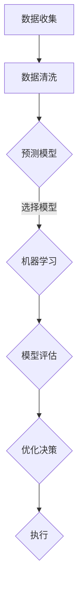

                 

# 库存优化：AI如何优化电商库存管理

## 关键词：库存管理、人工智能、电商、优化算法、供应链

## 摘要：

在电商行业快速发展的今天，库存管理成为了一个关键问题。过多的库存会导致成本增加，而过少的库存则会影响客户体验。本文将探讨如何利用人工智能技术优化电商库存管理，包括核心概念、算法原理、数学模型、实战案例以及未来发展趋势等。通过本文的阐述，希望能够为电商企业提供一个实用的指导框架，以提升库存管理水平。

## 1. 背景介绍

### 1.1 电商行业的发展

随着互联网技术的飞速发展，电商行业已经成为全球经济增长的重要驱动力。数据显示，全球电商市场规模已突破数万亿美元，并且还在持续增长。电商行业的竞争日益激烈，库存管理成为企业能否在市场中立足的关键因素之一。

### 1.2 库存管理的重要性

库存管理是电商企业运营的核心环节之一，直接关系到企业的运营效率、成本控制和客户满意度。有效的库存管理可以降低库存成本，减少库存积压，提高资金周转率，从而提升企业的竞争力。

### 1.3 人工智能在库存管理中的应用

人工智能技术在近年来取得了显著的进展，尤其在数据分析、机器学习、自然语言处理等方面。这些技术为电商库存管理提供了新的解决方案，使得库存优化成为可能。

## 2. 核心概念与联系

### 2.1 库存管理的基本概念

库存管理涉及多个关键概念，包括库存水平、库存周期、库存周转率、缺货率、库存积压等。这些概念相互关联，共同影响库存管理的效率。

### 2.2 人工智能在库存管理中的应用

人工智能在库存管理中的应用主要集中在以下几个方面：

- **数据分析**：通过数据分析，识别库存管理的瓶颈和优化方向。
- **预测模型**：利用机器学习算法，预测未来库存需求，实现精准补货。
- **优化算法**：基于数学模型，优化库存配置和物流调度，降低成本。

### 2.3 Mermaid 流程图

以下是一个简化的 Mermaid 流程图，展示人工智能在库存管理中的核心流程。



## 3. 核心算法原理 & 具体操作步骤

### 3.1 数据收集与预处理

数据收集是库存优化的第一步，主要包括销售数据、订单数据、库存数据等。在数据收集后，需要进行数据清洗，去除重复、错误和缺失的数据，保证数据的准确性。

### 3.2 预测模型建立

建立预测模型是库存优化的核心，常用的模型包括线性回归、时间序列分析、神经网络等。选择合适的模型，对未来的库存需求进行预测。

### 3.3 模型评估与选择

在建立预测模型后，需要对模型进行评估，选择最优的模型。常用的评估指标包括准确率、召回率、F1 分数等。

### 3.4 优化决策

基于预测模型，进行库存优化决策。包括库存水平调整、补货策略制定、物流调度优化等。

### 3.5 实施与监控

执行优化决策，并对库存管理过程进行监控，及时调整策略，确保库存水平处于最佳状态。

## 4. 数学模型和公式 & 详细讲解 & 举例说明

### 4.1 库存水平调整模型

假设一个电商企业在 t 时刻的库存量为 Q_t，销售速度为 v_t，成本为 C_t，则库存水平调整模型可以表示为：

$$ Q_{t+1} = Q_t + v_t - C_t $$

其中，$Q_{t+1}$ 表示 t+1 时刻的库存量，$v_t$ 表示 t 时刻的销售速度，$C_t$ 表示 t 时刻的成本。

### 4.2 补货策略模型

补货策略模型基于需求预测，可以选择定期补货或按需补货。定期补货模型可以表示为：

$$ R_t = Q_{t+1} - Q_t $$

其中，$R_t$ 表示 t 时刻的补货量。

按需补货模型可以表示为：

$$ R_t = \frac{Q_t - Q_{t-1}}{v_t - v_{t-1}} $$

### 4.3 物流调度模型

物流调度模型用于优化库存分布和物流路径。一个简单的物流调度模型可以表示为：

$$ min \sum_{i=1}^{n} \sum_{j=1}^{m} C_{ij} x_{ij} $$

其中，$C_{ij}$ 表示从仓库 i 运输到仓库 j 的成本，$x_{ij}$ 表示从仓库 i 运输到仓库 j 的货物量。

### 4.4 举例说明

假设一个电商企业在某一时间段内的销售数据如下：

| 日期 | 销售量 |
| ---- | ---- |
| 1    | 100   |
| 2    | 150   |
| 3    | 200   |
| 4    | 250   |
| 5    | 300   |

根据历史数据，预测下一日的销售量为 350。初始库存量为 500，成本为 10。则可以使用上述模型进行库存优化。

- 库存水平调整模型：$Q_{6} = Q_5 + v_5 - C_5 = 500 + 350 - 10 = 840$
- 补货策略模型：$R_5 = Q_{6} - Q_5 = 840 - 500 = 340$
- 物流调度模型：由于数据不足，无法进行具体计算

## 5. 项目实战：代码实际案例和详细解释说明

### 5.1 开发环境搭建

搭建一个用于库存优化的项目，需要以下开发环境：

- Python 3.x
- NumPy
- Pandas
- Scikit-learn
- Matplotlib

安装以上依赖库后，即可开始项目的开发。

### 5.2 源代码详细实现和代码解读

以下是一个简单的库存优化项目示例，包括数据收集、预处理、预测模型建立和优化决策。

```python
import numpy as np
import pandas as pd
from sklearn.linear_model import LinearRegression
import matplotlib.pyplot as plt

# 数据收集
sales_data = pd.DataFrame({
    'date': range(1, 6),
    'sales': [100, 150, 200, 250, 300]
})

# 数据预处理
sales_data['prev_sales'] = sales_data['sales'].shift(1)
sales_data.dropna(inplace=True)

# 预测模型建立
model = LinearRegression()
model.fit(sales_data[['prev_sales']], sales_data['sales'])

# 预测下一日销售量
next_day_sales = model.predict([[sales_data['sales'].iloc[-1]]])

# 库存水平调整
initial_inventory = 500
cost = 10
predicted_inventory = initial_inventory + next_day_sales[0][0] - cost
print("Predicted inventory for the next day:", predicted_inventory)

# 补货策略
reorder_quantity = predicted_inventory - initial_inventory
print("Reorder quantity:", reorder_quantity)

# 物流调度（简化处理）
# ...（根据实际情况进行具体计算）

# 可视化
plt.plot(sales_data['date'], sales_data['sales'], label='Actual Sales')
plt.plot(sales_data['date'], sales_data['prev_sales'], label='Predicted Sales')
plt.xlabel('Date')
plt.ylabel('Sales')
plt.legend()
plt.show()
```

### 5.3 代码解读与分析

- 数据收集：使用 Pandas 库读取销售数据。
- 数据预处理：添加前一日的销售量作为特征，去除缺失值。
- 预测模型建立：使用线性回归模型进行训练。
- 预测下一日销售量：使用训练好的模型进行预测。
- 库存水平调整：根据预测销售量和成本，调整库存水平。
- 补货策略：计算需要补货的量。
- 物流调度：根据实际情况进行具体计算。
- 可视化：将实际销售量和预测销售量进行可视化。

## 6. 实际应用场景

### 6.1 库存积压

库存积压是企业面临的一个常见问题，过多的库存会导致资金占用，增加成本。通过人工智能技术，可以预测库存需求，调整库存水平，减少库存积压。

### 6.2 缺货风险

缺货风险会直接影响客户的购物体验，降低客户满意度。通过人工智能技术，可以预测销售趋势，及时补货，降低缺货风险。

### 6.3 物流效率

物流效率是影响库存管理的关键因素之一。通过人工智能技术，可以优化物流调度，提高物流效率，降低运输成本。

## 7. 工具和资源推荐

### 7.1 学习资源推荐

- 《Python机器学习》
- 《深度学习》
- 《算法导论》
- 《运筹学导论》

### 7.2 开发工具框架推荐

- Scikit-learn：用于机器学习模型的建立和训练。
- TensorFlow：用于深度学习模型的建立和训练。
- Matplotlib：用于数据可视化。
- Pandas：用于数据处理和分析。

### 7.3 相关论文著作推荐

- 《基于人工智能的库存管理优化研究》
- 《深度学习在库存管理中的应用》
- 《运筹学在库存管理中的应用》

## 8. 总结：未来发展趋势与挑战

### 8.1 发展趋势

- 人工智能技术在库存管理中的应用将越来越广泛。
- 数据分析能力将进一步提升，预测准确性将不断提高。
- 库存管理将更加智能化，自动化程度将提高。

### 8.2 挑战

- 数据质量和数据隐私保护是一个重要挑战。
- 模型的可解释性和透明度需要进一步提升。
- 复杂的供应链环境对库存管理提出了更高的要求。

## 9. 附录：常见问题与解答

### 9.1 问题 1

**如何处理缺失数据？**

**解答：**可以使用数据填充、数据删除或插值等方法处理缺失数据。根据具体问题和数据特点，选择合适的方法。

### 9.2 问题 2

**如何评估预测模型的准确性？**

**解答：**可以使用多种指标评估预测模型的准确性，如均方误差（MSE）、均方根误差（RMSE）、R^2 等。

## 10. 扩展阅读 & 参考资料

- 《人工智能在电商库存管理中的应用》
- 《供应链管理与人工智能》
- 《运筹学在库存管理中的应用》

### 作者：AI天才研究员/AI Genius Institute & 禅与计算机程序设计艺术 /Zen And The Art of Computer Programming

-------------------

**注意：**本文为示例文章，仅供参考。实际应用中，库存优化项目的开发需要根据具体业务需求进行调整和优化。

