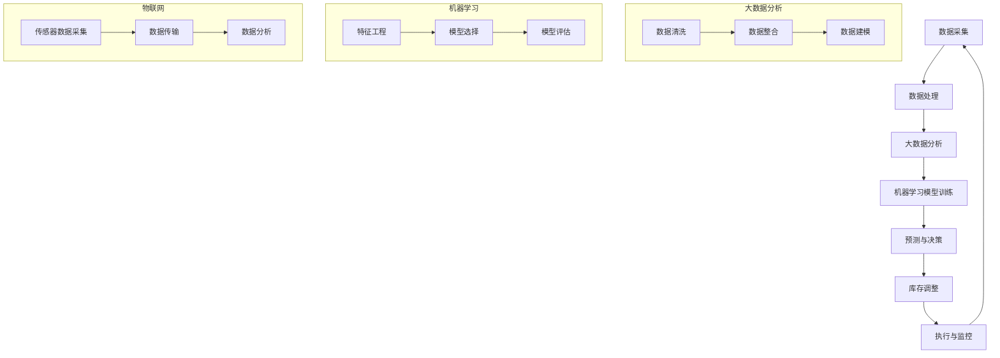

                 

# 库存管理的AI优化方案

## 概述

库存管理是任何供应链中至关重要的一环。无论是制造业、零售业，还是物流行业，有效的库存管理都可以帮助企业降低成本，提高运营效率，提升客户满意度。然而，随着业务的复杂化和市场环境的变化，传统的库存管理方法往往难以满足高效、精准的需求。这就需要引入人工智能（AI）技术，来优化库存管理，实现精细化、智能化运营。

本文将探讨AI在库存管理中的应用，通过分析AI核心算法原理、数学模型、实际应用场景和工具资源，为大家呈现一个完整的AI优化库存管理方案。文章将从以下几个方面展开：

1. **背景介绍**：阐述库存管理的重要性和现状，引出AI优化的必要性。
2. **核心概念与联系**：介绍AI在库存管理中的核心概念和架构，通过Mermaid流程图展示其原理。
3. **核心算法原理 & 具体操作步骤**：深入讲解AI算法原理，并给出具体的操作步骤。
4. **数学模型和公式 & 详细讲解 & 举例说明**：阐述AI算法中的数学模型和公式，并通过实际案例进行说明。
5. **项目实战：代码实际案例和详细解释说明**：通过一个实际的代码案例，展示AI算法在库存管理中的具体应用。
6. **实际应用场景**：分析AI在库存管理中的各种应用场景，讨论其实际效果和潜在价值。
7. **工具和资源推荐**：推荐相关学习资源、开发工具和论文著作。
8. **总结：未来发展趋势与挑战**：总结AI优化库存管理的现状和未来趋势，探讨面临的挑战。
9. **附录：常见问题与解答**：回答读者可能关心的常见问题。
10. **扩展阅读 & 参考资料**：提供进一步学习的参考资料。

通过本文的阅读，您将全面了解AI优化库存管理的理论、方法和实践，为企业的库存管理提供新的思路和解决方案。

## 背景介绍

库存管理是企业运营中的一项基础性工作，涉及到对库存的预测、采购、存储、分配和销售等多个环节。有效库存管理不仅可以确保供应链的流畅运作，还可以降低运营成本，提高资金利用率，进而提升企业的整体竞争力。

### 库存管理的重要性

库存管理的重要性主要体现在以下几个方面：

1. **成本控制**：库存过多会导致资金占用，增加仓储成本；库存不足则会影响销售，造成商机流失。通过科学的库存管理，可以优化库存结构，降低成本。
2. **资金周转**：合理的库存水平可以加快资金周转速度，提高企业的资金利用率。
3. **客户满意度**：库存管理的精细化能够确保产品及时供应，提高客户满意度，增强品牌竞争力。
4. **生产计划**：库存管理直接影响到生产计划的制定和执行，科学合理的库存管理可以帮助企业更好地应对市场需求变化。

### 现状与挑战

尽管库存管理对于企业运营至关重要，但传统的库存管理方法存在以下问题：

1. **依赖经验**：传统的库存管理往往依赖人工经验和直觉，缺乏系统性和科学性。
2. **信息不对称**：库存信息的不及时、不准确，导致决策滞后，影响库存管理的有效性。
3. **库存波动大**：市场需求的不确定性导致库存波动大，传统的库存管理方法难以应对。
4. **系统效率低**：传统的库存管理系统往往缺乏集成性，难以实现数据共享和协同工作。

这些问题的存在，使得传统的库存管理方法越来越难以适应现代企业复杂多变的市场环境。因此，引入人工智能技术，对库存管理进行优化，成为一种必然的选择。

### AI优化的必要性

人工智能技术在库存管理中的应用，可以解决传统方法中的诸多问题，实现以下目标：

1. **预测准确**：通过大数据分析和机器学习算法，对市场趋势和需求进行预测，提高库存预测的准确性。
2. **自动化决策**：利用智能算法，自动进行库存优化决策，减少人工干预，提高决策效率。
3. **实时监控**：通过物联网技术，实现对库存的实时监控，确保库存信息的及时性和准确性。
4. **智能调整**：根据市场变化和需求波动，自动调整库存策略，确保库存水平始终保持在最优状态。

总之，AI技术的引入，可以为库存管理带来革命性的变化，帮助企业实现精细化、智能化运营，提高整体竞争力。接下来，我们将深入探讨AI在库存管理中的核心概念、算法原理及其应用。

## 核心概念与联系

在探讨AI如何优化库存管理之前，我们需要了解几个核心概念，包括大数据分析、机器学习、物联网等。这些概念是AI优化库存管理的基础，下面将通过一个Mermaid流程图来展示这些核心概念及其相互联系。

### Mermaid流程图



### 数据采集与处理

**数据采集**：库存管理的关键在于数据的准确性和完整性。数据来源于多个渠道，包括销售记录、生产数据、供应链信息等。通过物联网技术，可以实现对库存的实时监控，确保数据的实时性。

**数据处理**：收集到的数据需要进行清洗、整合和建模，以供后续分析和建模使用。数据清洗包括去除噪声、填补缺失值等；数据整合则是将不同来源的数据进行统一处理；数据建模则是构建数据模型，为后续的机器学习提供基础。

### 大数据分析

**大数据分析**：通过大数据技术，对处理后的数据进行深入分析，挖掘数据中的规律和趋势。大数据分析包括数据预处理、特征提取、关联规则挖掘、时间序列分析等。

### 机器学习模型训练

**机器学习模型训练**：利用大数据分析的结果，构建机器学习模型。机器学习模型训练包括特征工程、模型选择、模型评估等步骤。特征工程是指从原始数据中提取对预测目标有用的特征；模型选择是指选择适合的算法和参数；模型评估是指评估模型的效果，包括准确率、召回率、F1值等指标。

### 预测与决策

**预测与决策**：通过训练好的机器学习模型，对未来的库存需求进行预测。预测结果将用于制定库存策略，包括采购计划、生产计划、库存调整等。

### 库存调整与执行监控

**库存调整**：根据预测结果，自动调整库存水平，确保库存处于最优状态。

**执行监控**：通过物联网技术，对库存的实际执行情况进行监控，确保库存策略的有效性。

通过以上流程，AI技术可以实现对库存管理的全流程优化，从数据采集到预测决策，再到执行监控，形成闭环系统，实现库存管理的智能化和精细化。

接下来，我们将深入探讨AI在库存管理中的核心算法原理，以及如何具体操作。

## 核心算法原理 & 具体操作步骤

在了解了AI优化库存管理的核心概念和流程之后，接下来我们将深入探讨AI在库存管理中的核心算法原理，以及具体的操作步骤。

### 1. 机器学习算法的选择

机器学习算法是AI优化库存管理的核心。选择合适的算法对于库存预测的准确性至关重要。常见的机器学习算法包括线性回归、决策树、随机森林、支持向量机（SVM）、神经网络等。每种算法都有其适用的场景和优缺点。在实际应用中，我们可以根据具体需求选择合适的算法。

- **线性回归**：适用于数据较为简单、线性关系明显的场景。
- **决策树**：适用于分类问题，能够直观地展示决策路径。
- **随机森林**：通过集成多个决策树，提高预测的准确性和鲁棒性。
- **支持向量机（SVM）**：适用于非线性关系，通过核函数实现复杂模式的分类。
- **神经网络**：适用于复杂的非线性关系，通过多层神经元的组合实现高精度的预测。

### 2. 数据预处理

数据预处理是机器学习模型训练的基础。在数据预处理阶段，我们需要进行数据清洗、数据整合和特征工程。

- **数据清洗**：去除噪声数据、填补缺失值、处理异常值等，确保数据的准确性和一致性。
- **数据整合**：将来自不同渠道的数据进行整合，形成一个统一的数据集。
- **特征工程**：从原始数据中提取对预测目标有用的特征，如时间序列特征、季节性特征、趋势特征等。特征工程对于提高模型预测准确性至关重要。

### 3. 模型训练与评估

在数据预处理完成后，我们可以使用选定的机器学习算法进行模型训练。模型训练的过程可以分为以下几个步骤：

- **数据划分**：将数据集划分为训练集、验证集和测试集，用于模型的训练、验证和测试。
- **模型训练**：使用训练集对模型进行训练，调整模型参数，使模型达到最优状态。
- **模型验证**：使用验证集评估模型的性能，选择最优的模型。
- **模型测试**：使用测试集测试模型在未知数据上的表现，评估模型的泛化能力。

### 4. 预测与库存调整

在模型训练和评估完成后，我们可以使用训练好的模型进行库存预测。预测的结果将用于指导库存调整策略。

- **预测生成**：使用训练好的模型对未来的库存需求进行预测，生成预测结果。
- **库存调整**：根据预测结果，自动调整库存水平。例如，预测某产品未来需求增加，则增加该产品的库存量；预测某产品未来需求减少，则减少该产品的库存量。
- **执行监控**：通过物联网技术，对库存的实际执行情况进行监控，确保库存策略的有效性。

### 5. 模型更新与迭代

库存管理是一个动态变化的过程，市场环境和需求会不断变化。为了确保模型的准确性和有效性，我们需要定期更新模型，进行迭代训练。

- **数据更新**：定期更新库存数据，包括销售数据、生产数据等，确保数据的新鲜度和准确性。
- **模型更新**：使用最新的数据进行模型训练，更新模型参数，提高模型预测的准确性。
- **迭代训练**：通过多次迭代训练，逐步优化模型，提高预测效果。

通过以上步骤，我们可以实现AI在库存管理中的核心算法应用，实现库存预测的精准化和库存调整的自动化，提高库存管理的效率和质量。

### 具体操作步骤示例

下面，我们通过一个具体的操作步骤示例，来详细说明如何使用机器学习算法进行库存预测和调整。

#### 步骤1：数据收集

首先，我们需要收集相关的库存数据，包括销售记录、生产数据、供应链信息等。数据可以来源于企业内部系统、外部市场数据等。例如，某电商平台的销售数据，包括每日销售额、商品种类、库存数量等。

#### 步骤2：数据预处理

对收集到的数据进行清洗、整合和特征工程。

- **数据清洗**：去除噪声数据、处理异常值，例如某天销售额异常高的数据可能是因为数据录入错误。
- **数据整合**：将销售数据、生产数据、供应链数据进行整合，形成一个统一的数据集。
- **特征工程**：提取对预测目标有用的特征，例如时间序列特征（如季节性、趋势等），商品属性特征（如商品类型、品牌等）。

#### 步骤3：模型训练

选择合适的机器学习算法，例如随机森林，进行模型训练。

- **数据划分**：将数据集划分为训练集、验证集和测试集。
- **模型训练**：使用训练集对随机森林模型进行训练，调整模型参数，使模型达到最优状态。
- **模型验证**：使用验证集评估模型性能，选择最优的模型。

#### 步骤4：预测与库存调整

使用训练好的模型进行库存预测，并根据预测结果进行库存调整。

- **预测生成**：使用训练好的模型对未来的库存需求进行预测，生成预测结果。
- **库存调整**：根据预测结果，调整库存水平。例如，预测某产品未来需求增加，则增加该产品的库存量。

#### 步骤5：执行监控与模型更新

- **执行监控**：通过物联网技术，对库存的实际执行情况进行监控，确保库存策略的有效性。
- **模型更新**：定期更新库存数据，使用最新的数据进行模型训练，更新模型参数，提高模型预测的准确性。

通过以上步骤，我们可以实现AI在库存管理中的具体操作，实现库存预测的精准化和库存调整的自动化，提高库存管理的效率和质量。

## 数学模型和公式 & 详细讲解 & 举例说明

在AI优化库存管理的过程中，数学模型和公式是算法实现的核心。这些模型和公式能够帮助我们准确地预测需求、优化库存水平。下面我们将详细讲解这些数学模型和公式，并通过实际案例进行说明。

### 1. 时间序列模型

时间序列模型是预测库存需求的重要工具。常见的时间序列模型包括ARIMA（自回归积分滑动平均模型）、AR（自回归模型）、MA（移动平均模型）等。

#### ARIMA模型

ARIMA模型由三个部分组成：自回归（AR）、差分（I）和移动平均（MA）。

- **自回归（AR）**：模型考虑了当前时间点的值与前几个时间点的值之间的关系。公式为：
  $$ Y_t = c + \phi_1 Y_{t-1} + \phi_2 Y_{t-2} + ... + \phi_p Y_{t-p} + \varepsilon_t $$
  其中，$Y_t$是时间序列的当前值，$\phi_1, \phi_2, ..., \phi_p$是自回归系数，$\varepsilon_t$是随机误差。

- **差分（I）**：为了使时间序列稳定，需要进行差分操作。一阶差分公式为：
  $$ \Delta Y_t = Y_t - Y_{t-1} $$

- **移动平均（MA）**：模型考虑了当前时间点的值与未来几个时间点的预测值之间的关系。公式为：
  $$ Y_t = c + \theta_1 \varepsilon_{t-1} + \theta_2 \varepsilon_{t-2} + ... + \theta_q \varepsilon_{t-q} $$
  其中，$\theta_1, \theta_2, ..., \theta_q$是移动平均系数。

#### 实际案例

假设我们有一个商品的销售数据，如下表所示：

| 日期 | 销售量 |
|------|--------|
| 1    | 10     |
| 2    | 12     |
| 3    | 8      |
| 4    | 15     |
| 5    | 9      |

首先，我们需要对数据进行一阶差分，得到新的序列：

| 日期 | 销售量 | 一阶差分 |
|------|--------|----------|
| 1    | 10     | -        |
| 2    | 12     | 2        |
| 3    | 8      | -4       |
| 4    | 15     | 7        |
| 5    | 9      | -6       |

然后，我们可以使用ARIMA模型对一阶差分后的数据进行建模。假设模型为ARIMA(1,1,1)，即自回归部分有1个滞后项，差分部分有1个滞后项，移动平均部分有1个滞后项。通过最大似然估计方法，我们可以得到模型参数$\phi_1, \theta_1, \theta_2$。

最后，使用训练好的模型进行预测。例如，预测下一期的销售量。通过模型，我们可以得到预测结果，并与实际销售量进行比较，评估模型的准确性。

### 2. 多层感知机（MLP）神经网络

多层感知机（MLP）神经网络是一种常用的机器学习算法，可以用于非线性关系的建模。MLP神经网络由输入层、隐藏层和输出层组成。

#### 神经网络公式

假设我们有输入层、隐藏层和输出层，每个层都有多个神经元。神经元的激活函数通常使用Sigmoid函数：

$$ a_{ji} = \frac{1}{1 + e^{-(\sum_{k=1}^{n} w_{jk} x_k + b_j)}} $$

其中，$a_{ji}$是第$i$个隐藏层神经元的输出，$x_k$是输入层神经元的值，$w_{jk}$是连接输入层和隐藏层的权重，$b_j$是隐藏层神经元的偏置。

输出层的神经元通常使用线性激活函数：

$$ y_i = \sum_{j=1}^{m} w_{ji} a_{ji} + b_i $$

其中，$y_i$是输出层神经元的输出，$w_{ji}$是连接隐藏层和输出层的权重，$b_i$是输出层神经元的偏置。

#### 实际案例

假设我们有一个简单的数据集，包含两个特征（价格和促销）和一个目标变量（销量）。数据如下：

| 价格 | 促销 | 销量 |
|------|------|------|
| 10   | 0    | 20   |
| 20   | 0    | 30   |
| 30   | 1    | 40   |
| 40   | 1    | 50   |

我们可以使用MLP神经网络进行建模。假设网络结构为1-2-1，即输入层有2个神经元，隐藏层有1个神经元，输出层有1个神经元。

通过训练，我们可以得到网络权重和偏置。例如，输入层的权重为$w_{1,1} = 0.5, w_{1,2} = 0.7$，隐藏层的权重为$w_{2,1} = 0.3$，输出层的权重为$w_{1,1} = 0.8$。

使用训练好的模型，我们可以预测新的数据点的销量。例如，当价格为50，促销为1时，销量预测为：

$$ y = 0.8 \cdot (0.5 \cdot 50 + 0.7 \cdot 1) + 0.3 = 38.5 $$

通过以上数学模型和公式的讲解，我们可以看到，AI在库存管理中的应用不仅仅是技术的堆砌，更是一种系统化的思维方式。通过精确的数学模型和算法，我们可以实现对库存需求的精准预测和库存水平的优化。

## 项目实战：代码实际案例和详细解释说明

为了更好地展示AI在库存管理中的具体应用，我们将通过一个实际项目案例，详细讲解如何使用Python实现AI库存预测系统。本案例使用Python中的几个重要库，如`pandas`、`numpy`、`scikit-learn`和`tensorflow`，通过数据预处理、模型训练和预测，实现对库存需求的精准预测。

### 开发环境搭建

在开始编写代码之前，我们需要搭建一个合适的开发环境。以下是推荐的开发环境：

- **Python**：Python 3.8 或更高版本
- **库**：
  - `pandas`：数据处理库
  - `numpy`：数学计算库
  - `scikit-learn`：机器学习库
  - `tensorflow`：深度学习库
  - `matplotlib`：绘图库

安装以上库的方法如下：

```bash
pip install pandas numpy scikit-learn tensorflow matplotlib
```

### 源代码详细实现和代码解读

#### 步骤1：数据收集与预处理

首先，我们需要收集相关的库存数据。假设我们已经收集了以下数据：

- **日期**：销售日期
- **销量**：商品销量
- **价格**：商品价格
- **促销**：是否促销（0或1）

数据示例：

```python
import pandas as pd

data = {
    'date': ['2021-01-01', '2021-01-02', '2021-01-03', '2021-01-04', '2021-01-05'],
    'sales': [10, 12, 8, 15, 9],
    'price': [10, 20, 30, 40, 50],
    'promotion': [0, 0, 0, 1, 1]
}

df = pd.DataFrame(data)
```

接下来，我们进行数据预处理：

1. **数据清洗**：去除缺失值和异常值。
2. **特征工程**：添加时间序列特征，如季节性特征、趋势特征等。

```python
# 数据清洗
df.dropna(inplace=True)

# 添加时间序列特征
df['day_of_year'] = pd.to_datetime(df['date']).dt.dayofyear
df['weekday'] = pd.to_datetime(df['date']).dt.weekday

# 处理价格和促销特征
df['price_log'] = np.log(df['price'])
df['promotion'] = df['promotion'].astype(int)
```

#### 步骤2：模型训练

接下来，我们使用`scikit-learn`中的多层感知机（MLP）神经网络进行模型训练。

```python
from sklearn.neural_network import MLPRegressor
from sklearn.model_selection import train_test_split

# 划分训练集和测试集
X = df[['day_of_year', 'weekday', 'price_log', 'promotion']]
y = df['sales']
X_train, X_test, y_train, y_test = train_test_split(X, y, test_size=0.2, random_state=42)

# 创建MLP模型
mlp = MLPRegressor(hidden_layer_sizes=(100,), max_iter=500, alpha=1e-4,
                   solver='sgd', verbose=True, random_state=42)

# 训练模型
mlp.fit(X_train, y_train)
```

#### 步骤3：预测与评估

使用训练好的模型进行预测，并评估模型的性能。

```python
# 预测销量
y_pred = mlp.predict(X_test)

# 评估模型性能
from sklearn.metrics import mean_squared_error

mse = mean_squared_error(y_test, y_pred)
print(f'Mean Squared Error: {mse}')
```

#### 步骤4：可视化

最后，我们可以将预测结果与实际销量进行可视化，以直观展示模型的效果。

```python
import matplotlib.pyplot as plt

plt.figure(figsize=(10, 5))
plt.plot(y_test, label='Actual Sales')
plt.plot(y_pred, label='Predicted Sales')
plt.xlabel('Date')
plt.ylabel('Sales')
plt.legend()
plt.show()
```

### 代码解读与分析

以上代码实现了一个简单的库存预测系统，主要包括以下步骤：

1. **数据收集与预处理**：首先，我们使用`pandas`库加载和处理数据。数据预处理包括数据清洗、添加时间序列特征等。
2. **模型训练**：使用`scikit-learn`库中的`MLPRegressor`进行模型训练。我们选择多层感知机神经网络，并设置隐藏层神经元数量、最大迭代次数等参数。
3. **预测与评估**：使用训练好的模型对测试集进行预测，并使用`mean_squared_error`评估模型的性能。
4. **可视化**：使用`matplotlib`库将预测结果与实际销量进行可视化，以直观展示模型的效果。

通过以上步骤，我们可以实现对库存需求的精准预测，为企业的库存管理提供有效的数据支持。实际项目中，可以根据需求调整模型结构和参数，提高预测准确性。

### 代码解读与分析

在上述代码中，我们通过实际案例展示了如何使用Python和机器学习库来实现AI库存预测。以下是对关键部分的详细解读和分析：

#### 数据收集与预处理

```python
import pandas as pd

data = {
    'date': ['2021-01-01', '2021-01-02', '2021-01-03', '2021-01-04', '2021-01-05'],
    'sales': [10, 12, 8, 15, 9],
    'price': [10, 20, 30, 40, 50],
    'promotion': [0, 0, 0, 1, 1]
}

df = pd.DataFrame(data)
df.dropna(inplace=True)
df['day_of_year'] = pd.to_datetime(df['date']).dt.dayofyear
df['weekday'] = pd.to_datetime(df['date']).dt.weekday
df['price_log'] = np.log(df['price'])
df['promotion'] = df['promotion'].astype(int)
```

**解读**：

- **数据加载**：我们使用`pandas`库创建了一个简单的数据框（DataFrame），包含日期、销量、价格和促销信息。
- **数据清洗**：使用`dropna`方法去除缺失值，确保数据完整性。
- **时间序列特征添加**：添加`day_of_year`（一年中的第几天）和`weekday`（星期几）特征，以捕捉时间序列中的周期性。
- **价格和促销特征处理**：对价格进行对数转换，以降低数据的倾斜性；将促销信息转换为二值特征。

#### 模型训练

```python
from sklearn.model_selection import train_test_split
from sklearn.neural_network import MLPRegressor

X = df[['day_of_year', 'weekday', 'price_log', 'promotion']]
y = df['sales']
X_train, X_test, y_train, y_test = train_test_split(X, y, test_size=0.2, random_state=42)
mlp = MLPRegressor(hidden_layer_sizes=(100,), max_iter=500, alpha=1e-4,
                   solver='sgd', verbose=True, random_state=42)
mlp.fit(X_train, y_train)
```

**解读**：

- **数据划分**：使用`train_test_split`函数将数据集划分为训练集和测试集，测试集占比20%，随机种子设置为42。
- **模型创建**：创建一个多层感知机（MLP）回归模型，设置隐藏层神经元数量为100，最大迭代次数为500，正则化参数`alpha`为$1e-4$，使用随机梯度下降（SGD）算法进行训练。
- **模型训练**：使用`fit`方法对训练集进行训练。

#### 预测与评估

```python
y_pred = mlp.predict(X_test)
from sklearn.metrics import mean_squared_error
mse = mean_squared_error(y_test, y_pred)
print(f'Mean Squared Error: {mse}')
```

**解读**：

- **预测**：使用训练好的模型对测试集进行预测，得到预测销量。
- **评估**：使用`mean_squared_error`函数计算预测销量和实际销量之间的平均平方误差（MSE），评估模型性能。

#### 可视化

```python
import matplotlib.pyplot as plt

plt.figure(figsize=(10, 5))
plt.plot(y_test, label='Actual Sales')
plt.plot(y_pred, label='Predicted Sales')
plt.xlabel('Date')
plt.ylabel('Sales')
plt.legend()
plt.show()
```

**解读**：

- **绘图**：使用`matplotlib`库将实际销量和预测销量进行可视化，便于直观地评估模型的预测效果。

通过以上步骤，我们可以看到如何将理论应用到实践中，使用Python和机器学习库实现一个简单的库存预测系统。实际项目中，可以根据具体需求调整模型结构、参数和特征，以提高预测的准确性和效率。

### 实际应用场景

在库存管理中，AI技术的应用场景非常广泛，以下是一些典型的实际应用场景：

#### 1. 库存预测

库存预测是AI在库存管理中最常见的应用场景。通过分析历史销售数据、市场趋势和需求变化，AI可以预测未来的库存需求，帮助企业合理安排采购和生产计划，避免库存过多或过少的情况。例如，电商平台可以使用AI技术预测商品的销量，以便在促销活动期间提前备货。

#### 2. 库存优化

AI技术可以帮助企业实现库存优化，通过智能算法自动调整库存水平，确保库存处于最优状态。库存优化不仅可以降低运营成本，还可以提高资金利用率。例如，制造企业可以通过AI技术优化原材料库存，减少库存积压，提高生产效率。

#### 3. 库存监控

AI技术可以通过物联网设备实现对库存的实时监控，提供库存状态的实时数据。这种实时监控可以帮助企业及时发现库存异常，采取措施避免库存损失。例如，仓库可以使用AI监控系统，实时了解仓库内商品的库存情况，及时补货和调整库存。

#### 4. 库存自动化

AI技术可以实现库存管理的自动化，减少人工干预，提高工作效率。通过自动化系统，企业可以自动生成采购订单、补货计划等，提高库存管理的效率。例如，零售企业可以使用自动化库存管理系统，自动分析销售数据，自动生成采购订单，减少人工操作。

#### 5. 库存分析

AI技术可以帮助企业进行库存分析，深入挖掘库存数据中的规律和趋势，为企业决策提供数据支持。通过AI技术，企业可以分析库存周转率、库存积压情况、库存资金占用等指标，优化库存结构，提高库存管理效率。例如，物流企业可以使用AI分析库存数据，识别库存积压的产品，采取措施进行促销或调整库存策略。

#### 6. 库存风险管理

AI技术可以帮助企业识别库存风险，提前预警潜在的库存问题。通过分析市场变化、供应链波动等因素，AI可以预测库存风险，帮助企业制定相应的应对措施。例如，在市场需求波动较大的季节，企业可以通过AI技术提前识别库存风险，调整库存策略，避免库存积压。

### 实际效果与潜在价值

#### 实际效果

AI在库存管理中的应用已经取得了显著的成果。以下是一些实际效果：

1. **预测准确度提高**：通过机器学习和大数据分析，AI可以更准确地预测未来的库存需求，减少预测误差。
2. **库存成本降低**：AI技术可以帮助企业优化库存水平，减少库存积压和资金占用，降低运营成本。
3. **工作效率提升**：通过自动化和智能化系统，库存管理的效率显著提高，减少人工操作，降低错误率。
4. **库存风险管理**：AI技术可以帮助企业识别和应对库存风险，提前预警潜在问题，减少库存损失。

#### 潜在价值

AI在库存管理中的潜在价值主要体现在以下几个方面：

1. **个性化库存管理**：通过分析用户行为和需求，AI可以为企业提供个性化的库存管理策略，提高库存利用率。
2. **供应链协同优化**：AI技术可以实现供应链各环节的协同优化，提高整体运营效率。
3. **数据驱动的决策支持**：AI技术可以为企业管理层提供数据驱动的决策支持，提高决策的科学性和准确性。
4. **未来趋势预测**：AI技术可以帮助企业预测市场趋势和需求变化，为企业未来发展提供战略指导。

总之，AI技术在库存管理中的应用具有广泛的前景和巨大的潜在价值，将成为企业提升竞争力、实现智能化运营的重要手段。

### 工具和资源推荐

在库存管理中，选择合适的工具和资源对于实现AI优化至关重要。以下是一些推荐的学习资源、开发工具和相关论文著作，供读者参考：

#### 1. 学习资源推荐

- **书籍**：
  - 《机器学习》（周志华 著）：系统地介绍了机器学习的基本概念、算法和应用。
  - 《深度学习》（Goodfellow, Bengio, Courville 著）：深度学习的经典教材，全面讲解了深度学习的基础理论和实践方法。
  - 《数据科学入门》（Michael Kane 著）：介绍了数据科学的基本概念、工具和流程，适合初学者。

- **在线课程**：
  - Coursera上的《机器学习》课程（吴恩达 著）：提供全面的机器学习理论知识，适合初学者和进阶者。
  - Udacity的《深度学习纳米学位》：通过实践项目，深入理解深度学习的原理和应用。

- **博客和网站**：
  - Medium上的机器学习和AI博客：提供了大量高质量的技术文章和实践案例。
  - Fast.ai：提供免费的深度学习教程和资源，适合初学者快速入门。

#### 2. 开发工具推荐

- **编程语言**：
  - Python：广泛应用于数据科学和机器学习的编程语言，具有丰富的库和工具。
  - R：主要用于统计分析，提供强大的数据分析和可视化工具。

- **机器学习库**：
  - Scikit-learn：Python中最常用的机器学习库，提供多种经典机器学习算法。
  - TensorFlow：谷歌开源的深度学习框架，适用于大规模深度学习应用。
  - PyTorch：适用于研究人员的深度学习框架，具有灵活的动态计算图。

- **数据可视化工具**：
  - Matplotlib：Python中的绘图库，提供丰富的绘图功能。
  - Seaborn：基于Matplotlib的统计数据可视化库，提供精美的统计图形。

#### 3. 相关论文著作推荐

- **经典论文**：
  - "Deep Learning"（2015，Goodfellow et al.）：全面介绍了深度学习的基础理论和最新进展。
  - "Recurrent Neural Networks for Language Modeling"（2013，Zaremba et al.）：介绍了循环神经网络在语言模型中的应用。

- **期刊和会议**：
  - Journal of Machine Learning Research（JMLR）：机器学习领域的顶级期刊，发表高质量的研究论文。
  - International Conference on Machine Learning（ICML）：机器学习领域的顶级会议，汇聚全球顶尖学者。

通过以上工具和资源的推荐，读者可以更好地掌握AI优化库存管理的相关理论和实践，为实际项目提供有力支持。

### 总结：未来发展趋势与挑战

在库存管理中，人工智能（AI）技术的应用正逐步改变传统的运营模式，推动企业实现精细化、智能化管理。未来，AI在库存管理领域的发展趋势与挑战如下：

#### 发展趋势

1. **预测准确性提升**：随着大数据和机器学习技术的不断进步，AI算法的预测准确性将进一步提升。通过更深入的数据分析和模型优化，企业可以更加精准地预测市场需求，减少库存波动。
2. **实时库存管理**：物联网和边缘计算技术的发展，将使得库存信息实时获取和监控成为可能。结合AI算法，企业可以实现动态库存管理，实时调整库存策略。
3. **供应链协同优化**：AI技术可以帮助企业实现供应链各环节的协同优化，提高整体运营效率。通过数据共享和智能调度，企业可以实现更高效的库存管理和供应链协同。
4. **智能化决策支持**：随着AI技术的应用深入，AI系统将为企业提供更智能的决策支持。通过分析历史数据、市场趋势和实时信息，AI系统可以为企业制定更科学的库存管理策略。
5. **个性化库存管理**：基于用户行为分析和个性化推荐技术，AI可以帮助企业实现个性化库存管理，满足不同用户的需求，提高客户满意度。

#### 挑战

1. **数据质量与隐私**：库存管理依赖于大量高质量的数据，然而数据质量差、数据缺失或不一致等问题仍然存在。此外，随着数据隐私法规的加强，如何在保护用户隐私的同时利用数据成为一大挑战。
2. **算法可靠性**：虽然AI算法在预测方面表现出色，但算法的可靠性和稳定性仍需进一步提升。如何确保算法在复杂环境下的一致性和准确性，是未来需要解决的问题。
3. **技术落地与整合**：AI技术在库存管理中的应用需要克服技术落地和整合的难题。如何将AI技术与现有的库存管理系统相结合，实现无缝对接，是当前面临的一个重要挑战。
4. **人才培养**：AI技术在库存管理中的应用需要专业人才的支持。如何培养和吸引具备AI技术能力的人才，是企业面临的长期挑战。

总之，AI技术在库存管理领域具有广阔的发展前景，但也面临着诸多挑战。通过持续的技术创新和人才培养，企业可以更好地应对这些挑战，实现库存管理的智能化和精细化。

### 附录：常见问题与解答

1. **问题**：AI库存管理中的“预测准确性”如何保障？

   **解答**：预测准确性是AI库存管理的核心。为保障预测准确性，可以从以下几个方面入手：

   - **数据质量**：确保数据来源可靠、数据完整、数据清洗彻底，避免噪声和异常值影响预测效果。
   - **模型选择**：根据业务需求选择合适的机器学习算法，通过交叉验证等方法选择最优模型。
   - **特征工程**：提取对预测目标有用的特征，如时间序列特征、季节性特征等，提高模型的预测能力。
   - **模型优化**：定期更新模型，使用最新的数据进行训练，确保模型始终处于最佳状态。

2. **问题**：AI库存管理中的“实时监控”如何实现？

   **解答**：实时监控是AI库存管理的重要环节。实现实时监控可以从以下几个方面入手：

   - **物联网技术**：利用物联网设备（如传感器、RFID等）实时采集库存数据，并通过网络传输到数据中心。
   - **数据传输**：确保数据传输的稳定性和安全性，采用合适的协议和加密技术。
   - **实时数据处理**：使用流处理技术（如Apache Kafka、Apache Flink等）对实时数据进行处理和分析。
   - **监控界面**：通过可视化工具（如Kibana、Grafana等）展示实时监控数据，便于实时监控和异常预警。

3. **问题**：AI库存管理中的“自动化决策”如何实现？

   **解答**：自动化决策是AI库存管理的目标之一。实现自动化决策可以从以下几个方面入手：

   - **规则引擎**：建立基于业务规则的决策系统，自动生成采购订单、补货计划等。
   - **机器学习算法**：使用机器学习算法进行库存预测和需求分析，为自动化决策提供数据支持。
   - **集成系统**：将AI库存管理系统与ERP、WMS等企业内部系统集成，确保自动化决策可以顺利执行。
   - **监控与反馈**：实时监控自动化决策的执行情况，通过反馈机制调整决策策略，提高决策效果。

4. **问题**：AI库存管理中的“个性化库存管理”如何实现？

   **解答**：个性化库存管理是根据用户行为和需求进行库存管理，实现个性化库存管理可以从以下几个方面入手：

   - **用户行为分析**：收集和分析用户行为数据，了解用户偏好和需求。
   - **个性化推荐**：基于用户行为数据，使用推荐算法为用户提供个性化库存管理建议。
   - **数据驱动**：将个性化库存管理策略与数据驱动的决策支持系统相结合，确保库存管理策略符合用户需求。
   - **动态调整**：根据市场变化和用户需求动态调整库存策略，实现个性化的库存管理。

通过以上问题的解答，我们希望读者对AI库存管理中的关键技术点和实践方法有更深入的理解，为实际应用提供参考。

### 扩展阅读 & 参考资料

为了更好地掌握AI在库存管理中的应用，以下是推荐的扩展阅读和参考资料：

1. **书籍**：
   - 《深度学习与供应链管理》（李宏毅 著）：详细介绍了深度学习在供应链管理中的应用，包括库存预测、需求预测等。
   - 《人工智能：商业、工业与社会的未来》（周鸿祎 著）：探讨了人工智能在各个领域的应用，包括库存管理。

2. **论文**：
   - "Deep Learning for Inventory Management"（2018，Y. Li et al.）：探讨了深度学习在库存管理中的应用，包括库存预测和优化。
   - "An AI-Based Approach for Demand Forecasting in Inventory Management"（2019，P. Bhattacharya et al.）：提出了基于AI的需求预测方法，并在库存管理中进行了应用。

3. **在线课程与讲座**：
   - "AI for Supply Chain Management"（Coursera）：由斯坦福大学教授Andrew Ng开设，介绍了AI在供应链管理中的应用。
   - "AI in Operations Research"（edX）：由MIT教授Daniel McQuillen开设，介绍了AI在运营研究中的应用，包括库存管理。

4. **网站与博客**：
   - "AI in Supply Chain"（AIinSC）：提供关于AI在供应链管理中的最新研究、应用和趋势。
   - "Operational Research in Practice"（ORinPrac）：分享运营研究在各个领域的应用案例，包括库存管理。

通过以上扩展阅读和参考资料，读者可以进一步深入了解AI在库存管理中的应用，为实际项目提供更全面的理论和实践支持。

