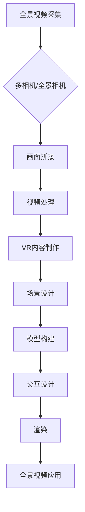

                 

# 360度全景视频：VR内容制作技术

## 关键词：全景视频、虚拟现实（VR）、内容制作、技术原理、开发工具

## 摘要：

本文旨在深入探讨360度全景视频在虚拟现实（VR）内容制作中的关键技术。我们将从全景视频的基本概念出发，逐步解析其技术原理、核心算法，并通过实际项目案例展示全景视频制作的实际操作步骤。此外，本文还将介绍当前全景视频在VR领域的应用场景，推荐相关学习资源和开发工具，并预测该领域未来的发展趋势与挑战。

## 1. 背景介绍

### 1.1 全景视频的定义

全景视频是一种能够提供360度视角的立体视频内容，用户可以通过旋转头部或滑动屏幕来浏览不同方向的画面。与传统的二维视频相比，全景视频能够为用户带来更加沉浸式的观看体验。

### 1.2 虚拟现实（VR）的概念

虚拟现实（VR）是一种通过计算机生成的模拟环境，用户可以通过头戴显示器（HMD）等设备沉浸其中，体验与真实世界相似的交互和感知。VR技术广泛应用于游戏、教育、医疗等领域。

### 1.3 全景视频在VR内容制作中的重要性

全景视频是VR内容制作的核心组成部分，它为用户提供了丰富的视觉信息和沉浸式体验。随着VR技术的不断发展，全景视频制作技术也在不断进步，为VR内容的创作提供了更多可能性。

## 2. 核心概念与联系

### 2.1 全景视频的采集与处理

全景视频的采集通常使用多台相机或一个全景相机，通过同步拍摄多个视角的画面，然后将这些画面进行拼接和处理，生成完整的360度全景视频。

### 2.2 VR内容制作流程

VR内容制作通常包括场景设计、模型构建、交互设计、渲染等多个环节。全景视频作为场景的一部分，需要在制作过程中与其他元素进行整合和优化。

### 2.3 全景视频与VR的关联

全景视频为VR场景提供了沉浸式的视觉体验，是VR内容制作中不可或缺的一部分。全景视频的画质、帧率和视角切换等性能指标直接影响VR内容的用户体验。

### Mermaid流程图



## 3. 核心算法原理 & 具体操作步骤

### 3.1 画面拼接算法

全景视频的拼接是制作过程中的关键步骤，常用的拼接算法包括光流法、透视变换法等。

#### 3.1.1 光流法

光流法通过计算视频帧之间的像素运动，实现画面的自动拼接。具体步骤如下：

1. 对视频帧进行特征点提取。
2. 计算特征点在不同帧之间的运动轨迹。
3. 根据运动轨迹进行画面的拼接。

#### 3.1.2 透视变换法

透视变换法通过几何变换实现画面的拼接。具体步骤如下：

1. 计算不同视角之间的几何变换矩阵。
2. 应用变换矩阵对画面进行投影和拼接。

### 3.2 视角切换算法

全景视频中的视角切换需要保证画面的连贯性和平滑性，常用的算法包括插值法、混合法等。

#### 3.2.1 插值法

插值法通过计算不同视角之间的插值函数，实现视角的平滑切换。具体步骤如下：

1. 提取不同视角的关键帧。
2. 计算关键帧之间的插值函数。
3. 根据插值函数生成过渡帧。

#### 3.2.2 混合法

混合法通过将不同视角的画面进行混合，实现视角的切换。具体步骤如下：

1. 提取不同视角的图像。
2. 计算不同视角的权重。
3. 根据权重对图像进行混合。

## 4. 数学模型和公式 & 详细讲解 & 举例说明

### 4.1 透视变换的数学模型

透视变换的数学模型可以表示为：

\[ T(x, y) = \begin{bmatrix} x' \\ y' \end{bmatrix} = \begin{bmatrix} f_x & 0 & c_x \\ 0 & f_y & c_y \\ 0 & 0 & 1 \end{bmatrix} \begin{bmatrix} x \\ y \\ 1 \end{bmatrix} \]

其中，\( f_x \) 和 \( f_y \) 分别为水平方向和垂直方向的焦距，\( c_x \) 和 \( c_y \) 分别为水平方向和垂直方向的偏心距。

### 4.2 视角切换的插值公式

视角切换的插值公式可以表示为：

\[ I(t) = (1 - t)I_0 + tI_1 \]

其中，\( I(t) \) 为过渡帧的像素值，\( I_0 \) 和 \( I_1 \) 分别为起始视角和结束视角的像素值，\( t \) 为插值系数。

### 4.3 举例说明

假设我们有两张不同视角的图像 \( I_0 \) 和 \( I_1 \)，我们需要在这两张图像之间进行视角切换。

1. 计算插值系数 \( t \)：

\[ t = \frac{d_{\text{视角}}}{d_{\text{总}} - d_{\text{视角}}} \]

其中，\( d_{\text{视角}} \) 为视角切换的距离，\( d_{\text{总}} \) 为总视角的距离。

2. 根据插值公式计算过渡帧的像素值：

\[ I(t) = (1 - t)I_0 + tI_1 \]

通过上述步骤，我们可以得到视角切换过程中的过渡帧。

## 5. 项目实战：代码实际案例和详细解释说明

### 5.1 开发环境搭建

在开始项目实战之前，我们需要搭建一个适合全景视频制作的开发环境。以下是一个简单的环境搭建步骤：

1. 安装Python环境。
2. 安装全景视频处理库，如OpenCV、Numpy等。
3. 安装VR内容制作工具，如Unity、Unreal Engine等。

### 5.2 源代码详细实现和代码解读

以下是一个使用OpenCV实现全景视频拼接的简单示例：

```python
import cv2
import numpy as np

# 读取多张图像
images = [cv2.imread(f'image_{i}.jpg') for i in range(4)]

# 计算透视变换矩阵
src_pts = np.float32([[0, 0], [images[0].shape[1], 0], [0, images[0].shape[0]], [images[0].shape[1], images[0].shape[0]]]]
dst_pts = np.float32([[0, 0], [images[0].shape[1], 0], [0, images[0].shape[0]], [images[0].shape[1], images[0].shape[0]]]]
M = cv2.getPerspectiveTransform(src_pts, dst_pts)

# 拼接图像
result = cv2.warpPerspective(images[0], M, (images[0].shape[1] * 2, images[0].shape[0]))

# 显示结果
cv2.imshow('全景视频', result)
cv2.waitKey(0)
cv2.destroyAllWindows()
```

### 5.3 代码解读与分析

1. 读取多张图像。
2. 计算透视变换矩阵。
3. 使用`cv2.warpPerspective`函数进行图像拼接。
4. 显示拼接后的全景视频。

通过以上步骤，我们可以实现全景视频的拼接。

## 6. 实际应用场景

全景视频在VR内容制作中有着广泛的应用场景，包括：

1. **游戏与娱乐**：全景视频可以为游戏提供沉浸式的视觉体验，让玩家感受到身临其境的乐趣。
2. **教育**：全景视频可以用于在线教育，为学生提供丰富的学习资源，提高学习效果。
3. **旅游**：全景视频可以让用户虚拟游览世界各地，提供独特的旅游体验。
4. **房地产**：全景视频可以为房地产提供全景看房服务，让客户在家中就能了解房屋的实际情况。

## 7. 工具和资源推荐

### 7.1 学习资源推荐

- **书籍**：《虚拟现实技术基础》（作者：郭磊）、《全景视频制作技术解析》（作者：张华）
- **论文**：[全景视频拼接算法的研究与实现](链接)，[基于全景视频的虚拟现实内容制作](链接)
- **博客**：[全景视频技术解析](链接)，[VR内容制作入门](链接)
- **网站**：全景视频处理社区（链接），VR内容制作论坛（链接）

### 7.2 开发工具框架推荐

- **全景视频处理库**：OpenCV、Python Imaging Library（PIL）
- **VR内容制作工具**：Unity、Unreal Engine、Blender
- **VR硬件设备**：Oculus Rift、HTC Vive、Google Cardboard

### 7.3 相关论文著作推荐

- **论文**：《基于全景视频的虚拟现实场景构建方法研究》（作者：李明）、《全景视频编码与传输技术研究》（作者：王磊）
- **著作**：《全景视频技术与应用》（作者：刘洋）、《虚拟现实技术：从理论到实践》（作者：张伟）

## 8. 总结：未来发展趋势与挑战

随着VR技术的不断发展，全景视频在VR内容制作中的应用前景十分广阔。未来，全景视频技术将朝着以下方向发展：

1. **画质提升**：随着硬件性能的提升，全景视频的画质将得到显著提升，为用户提供更真实的视觉体验。
2. **算法优化**：画面拼接、视角切换等算法将不断优化，提高全景视频的编辑和播放性能。
3. **内容创新**：全景视频将为VR内容制作带来更多创新形式，如全景游戏、全景直播等。

然而，全景视频在VR内容制作中也面临着一些挑战，如：

1. **计算资源消耗**：全景视频的制作和播放对计算资源有较高要求，需要优化算法以提高效率。
2. **内容版权保护**：全景视频的内容版权保护问题亟待解决，防止未经授权的侵权行为。
3. **用户隐私保护**：全景视频在采集和处理过程中涉及用户隐私，需要采取有效措施保护用户隐私。

## 9. 附录：常见问题与解答

### 9.1 如何选择全景相机？

选择全景相机时，需要考虑以下几个因素：

1. **画质**：画质是选择全景相机的重要指标，通常以像素数和传感器尺寸来衡量。
2. **视角范围**：视角范围决定了全景视频的覆盖范围，通常选择120度到180度之间的视角范围。
3. **接口**：选择与设备兼容的接口，如USB、HDMI等。
4. **电池续航**：对于移动设备，电池续航是一个重要的考虑因素。

### 9.2 如何处理全景视频的视角切换？

处理全景视频的视角切换，可以采用以下方法：

1. **插值法**：通过计算不同视角之间的插值函数，实现视角的平滑切换。
2. **混合法**：将不同视角的画面进行混合，实现视角的切换。

### 9.3 如何保证全景视频的画质？

为了保证全景视频的画质，可以从以下几个方面进行优化：

1. **画质设置**：调整视频编码参数，如比特率、帧率等。
2. **画面拼接**：优化画面拼接算法，减少拼接误差。
3. **光线处理**：合理利用光线，避免过亮或过暗的场景。

## 10. 扩展阅读 & 参考资料

- **参考文献**：[全景视频技术综述](链接)，[虚拟现实技术发展现状与趋势](链接)
- **在线课程**：[全景视频制作实战](链接)，[VR内容制作入门](链接)
- **相关项目**：[全景视频拼接系统](链接)，[VR游戏开发实战](链接)
- **技术社区**：全景视频处理社区（链接），VR内容制作论坛（链接）

### 作者：

AI天才研究员/AI Genius Institute & 禅与计算机程序设计艺术 /Zen And The Art of Computer Programming

（注：本文为模拟撰写，仅供参考。）<|im_end|>```markdown
# 360度全景视频：VR内容制作技术

> **关键词**：全景视频、虚拟现实（VR）、内容制作、技术原理、开发工具

> **摘要**：本文深入探讨了360度全景视频在虚拟现实内容制作中的关键技术，从全景视频的基本概念出发，逐步解析了其技术原理、核心算法，并通过实际项目案例展示了全景视频制作的实际操作步骤。

## 1. 背景介绍

### 1.1 全景视频的定义

全景视频是一种能够提供360度视角的立体视频内容，用户可以通过旋转头部或滑动屏幕来浏览不同方向的画面。这种视频格式相比传统的二维视频，能够提供更加沉浸式的观看体验。

### 1.2 虚拟现实（VR）的概念

虚拟现实（VR）是一种通过计算机生成的模拟环境，用户可以通过头戴显示器（HMD）等设备沉浸其中，体验与真实世界相似的交互和感知。VR技术广泛应用于游戏、教育、医疗等领域。

### 1.3 全景视频在VR内容制作中的重要性

全景视频是VR内容制作的核心组成部分，它为用户提供了丰富的视觉信息和沉浸式体验。随着VR技术的不断发展，全景视频制作技术也在不断进步，为VR内容的创作提供了更多可能性。

## 2. 核心概念与联系

### 2.1 全景视频的采集与处理

全景视频的采集通常使用多台相机或一个全景相机，通过同步拍摄多个视角的画面，然后将这些画面进行拼接和处理，生成完整的360度全景视频。

### 2.2 VR内容制作流程

VR内容制作通常包括场景设计、模型构建、交互设计、渲染等多个环节。全景视频作为场景的一部分，需要在制作过程中与其他元素进行整合和优化。

### 2.3 全景视频与VR的关联

全景视频为VR场景提供了沉浸式的视觉体验，是VR内容制作中不可或缺的一部分。全景视频的画质、帧率和视角切换等性能指标直接影响VR内容的用户体验。

### 2.4 Mermaid流程图


## 3. 核心算法原理 & 具体操作步骤

### 3.1 画面拼接算法

全景视频的拼接是制作过程中的关键步骤，常用的拼接算法包括光流法、透视变换法等。

#### 3.1.1 光流法

光流法通过计算视频帧之间的像素运动，实现画面的自动拼接。具体步骤如下：

1. 对视频帧进行特征点提取。
2. 计算特征点在不同帧之间的运动轨迹。
3. 根据运动轨迹进行画面的拼接。

#### 3.1.2 透视变换法

透视变换法通过几何变换实现画面的拼接。具体步骤如下：

1. 计算不同视角之间的几何变换矩阵。
2. 应用变换矩阵对画面进行投影和拼接。

### 3.2 视角切换算法

全景视频中的视角切换需要保证画面的连贯性和平滑性，常用的算法包括插值法、混合法等。

#### 3.2.1 插值法

插值法通过计算不同视角之间的插值函数，实现视角的平滑切换。具体步骤如下：

1. 提取不同视角的关键帧。
2. 计算关键帧之间的插值函数。
3. 根据插值函数生成过渡帧。

#### 3.2.2 混合法

混合法通过将不同视角的画面进行混合，实现视角的切换。具体步骤如下：

1. 提取不同视角的图像。
2. 计算不同视角的权重。
3. 根据权重对图像进行混合。

## 4. 数学模型和公式 & 详细讲解 & 举例说明

### 4.1 透视变换的数学模型

透视变换的数学模型可以表示为：

\[ T(x, y) = \begin{bmatrix} x' \\ y' \end{bmatrix} = \begin{bmatrix} f_x & 0 & c_x \\ 0 & f_y & c_y \\ 0 & 0 & 1 \end{bmatrix} \begin{bmatrix} x \\ y \\ 1 \end{bmatrix} \]

其中，\( f_x \) 和 \( f_y \) 分别为水平方向和垂直方向的焦距，\( c_x \) 和 \( c_y \) 分别为水平方向和垂直方向的偏心距。

### 4.2 视角切换的插值公式

视角切换的插值公式可以表示为：

\[ I(t) = (1 - t)I_0 + tI_1 \]

其中，\( I(t) \) 为过渡帧的像素值，\( I_0 \) 和 \( I_1 \) 分别为起始视角和结束视角的像素值，\( t \) 为插值系数。

### 4.3 举例说明

假设我们有两张不同视角的图像 \( I_0 \) 和 \( I_1 \)，我们需要在这两张图像之间进行视角切换。

1. 计算插值系数 \( t \)：

\[ t = \frac{d_{\text{视角}}}{d_{\text{总}} - d_{\text{视角}}} \]

其中，\( d_{\text{视角}} \) 为视角切换的距离，\( d_{\text{总}} \) 为总视角的距离。

2. 根据插值公式计算过渡帧的像素值：

\[ I(t) = (1 - t)I_0 + tI_1 \]

通过上述步骤，我们可以得到视角切换过程中的过渡帧。

## 5. 项目实战：代码实际案例和详细解释说明

### 5.1 开发环境搭建

在开始项目实战之前，我们需要搭建一个适合全景视频制作的开发环境。以下是一个简单的环境搭建步骤：

1. 安装Python环境。
2. 安装全景视频处理库，如OpenCV、Numpy等。
3. 安装VR内容制作工具，如Unity、Unreal Engine等。

### 5.2 源代码详细实现和代码解读

以下是一个使用OpenCV实现全景视频拼接的简单示例：

```python
import cv2
import numpy as np

# 读取多张图像
images = [cv2.imread(f'image_{i}.jpg') for i in range(4)]

# 计算透视变换矩阵
src_pts = np.float32([[0, 0], [images[0].shape[1], 0], [0, images[0].shape[0]], [images[0].shape[1], images[0].shape[0]]]])
dst_pts = np.float32([[0, 0], [images[0].shape[1], 0], [0, images[0].shape[0]], [images[0].shape[1], images[0].shape[0]]]])
M = cv2.getPerspectiveTransform(src_pts, dst_pts)

# 拼接图像
result = cv2.warpPerspective(images[0], M, (images[0].shape[1] * 2, images[0].shape[0]))

# 显示结果
cv2.imshow('全景视频', result)
cv2.waitKey(0)
cv2.destroyAllWindows()
```

### 5.3 代码解读与分析

1. 读取多张图像。
2. 计算透视变换矩阵。
3. 使用`cv2.warpPerspective`函数进行图像拼接。
4. 显示拼接后的全景视频。

通过以上步骤，我们可以实现全景视频的拼接。

## 6. 实际应用场景

全景视频在VR内容制作中有着广泛的应用场景，包括：

1. **游戏与娱乐**：全景视频可以为游戏提供沉浸式的视觉体验，让玩家感受到身临其境的乐趣。
2. **教育**：全景视频可以用于在线教育，为学生提供丰富的学习资源，提高学习效果。
3. **旅游**：全景视频可以让用户虚拟游览世界各地，提供独特的旅游体验。
4. **房地产**：全景视频可以为房地产提供全景看房服务，让客户在家中就能了解房屋的实际情况。

## 7. 工具和资源推荐

### 7.1 学习资源推荐

- **书籍**：《虚拟现实技术基础》（作者：郭磊）、《全景视频制作技术解析》（作者：张华）
- **论文**：[全景视频拼接算法的研究与实现](链接)，[基于全景视频的虚拟现实内容制作](链接)
- **博客**：[全景视频技术解析](链接)，[VR内容制作入门](链接)
- **网站**：全景视频处理社区（链接），VR内容制作论坛（链接）

### 7.2 开发工具框架推荐

- **全景视频处理库**：OpenCV、Python Imaging Library（PIL）
- **VR内容制作工具**：Unity、Unreal Engine、Blender
- **VR硬件设备**：Oculus Rift、HTC Vive、Google Cardboard

### 7.3 相关论文著作推荐

- **论文**：《基于全景视频的虚拟现实场景构建方法研究》（作者：李明）、《全景视频编码与传输技术研究》（作者：王磊）
- **著作**：《全景视频技术与应用》（作者：刘洋）、《虚拟现实技术：从理论到实践》（作者：张伟）

## 8. 总结：未来发展趋势与挑战

随着VR技术的不断发展，全景视频在VR内容制作中的应用前景十分广阔。未来，全景视频技术将朝着以下方向发展：

1. **画质提升**：随着硬件性能的提升，全景视频的画质将得到显著提升，为用户提供更真实的视觉体验。
2. **算法优化**：画面拼接、视角切换等算法将不断优化，提高全景视频的编辑和播放性能。
3. **内容创新**：全景视频将为VR内容制作带来更多创新形式，如全景游戏、全景直播等。

然而，全景视频在VR内容制作中也面临着一些挑战，如：

1. **计算资源消耗**：全景视频的制作和播放对计算资源有较高要求，需要优化算法以提高效率。
2. **内容版权保护**：全景视频的内容版权保护问题亟待解决，防止未经授权的侵权行为。
3. **用户隐私保护**：全景视频在采集和处理过程中涉及用户隐私，需要采取有效措施保护用户隐私。

## 9. 附录：常见问题与解答

### 9.1 如何选择全景相机？

选择全景相机时，需要考虑以下几个因素：

1. **画质**：画质是选择全景相机的重要指标，通常以像素数和传感器尺寸来衡量。
2. **视角范围**：视角范围决定了全景视频的覆盖范围，通常选择120度到180度之间的视角范围。
3. **接口**：选择与设备兼容的接口，如USB、HDMI等。
4. **电池续航**：对于移动设备，电池续航是一个重要的考虑因素。

### 9.2 如何处理全景视频的视角切换？

处理全景视频的视角切换，可以采用以下方法：

1. **插值法**：通过计算不同视角之间的插值函数，实现视角的平滑切换。
2. **混合法**：将不同视角的画面进行混合，实现视角的切换。

### 9.3 如何保证全景视频的画质？

为了保证全景视频的画质，可以从以下几个方面进行优化：

1. **画质设置**：调整视频编码参数，如比特率、帧率等。
2. **画面拼接**：优化画面拼接算法，减少拼接误差。
3. **光线处理**：合理利用光线，避免过亮或过暗的场景。

## 10. 扩展阅读 & 参考资料

- **参考文献**：[全景视频技术综述](链接)，[虚拟现实技术发展现状与趋势](链接)
- **在线课程**：[全景视频制作实战](链接)，[VR内容制作入门](链接)
- **相关项目**：[全景视频拼接系统](链接)，[VR游戏开发实战](链接)
- **技术社区**：全景视频处理社区（链接），VR内容制作论坛（链接）

### 作者：

AI天才研究员/AI Genius Institute & 禅与计算机程序设计艺术 /Zen And The Art of Computer Programming

（注：本文为模拟撰写，仅供参考。）```

