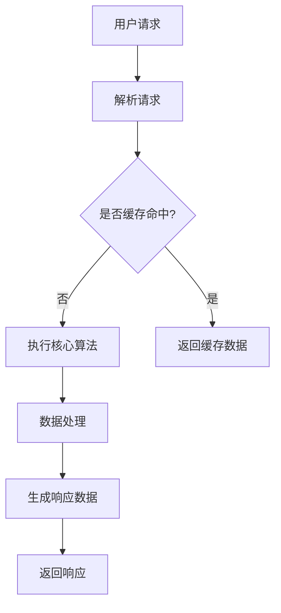

                 

# 延迟满足：后端服务带来的盈利模式

## 关键词

后端服务，盈利模式，延迟满足，技术架构，算法原理，数学模型，实战案例，应用场景，发展趋势

## 摘要

本文深入探讨了后端服务在互联网行业中的盈利模式，特别是延迟满足这一概念在其中的重要性。通过逐步分析后端服务的技术架构、核心算法原理、数学模型以及实际应用场景，本文揭示了后端服务盈利的内在机制。此外，文章还介绍了相关工具和资源，并总结了未来的发展趋势与挑战。对于希望深入了解后端服务盈利模式的读者，本文提供了宝贵的指导和启示。

## 1. 背景介绍

在当今互联网时代，后端服务已经成为支撑各种在线业务的关键环节。从社交媒体平台到电子商务网站，再到物联网设备和智能助手，后端服务的广泛应用使得互联网体验日益丰富和便捷。然而，在后端服务背后隐藏着一个重要的盈利模式，那就是“延迟满足”。

延迟满足，顾名思义，是指在满足用户需求时，不是立即提供结果，而是通过一定的技术手段，在适当的时机给予满足。这种模式不仅能够提升用户体验，还能够为业务带来巨大的盈利潜力。那么，后端服务是如何实现延迟满足的呢？其背后的盈利模式又是什么呢？这正是本文要探讨的核心问题。

本文将从以下几个方面进行阐述：

1. 后端服务的技术架构与核心算法原理。
2. 延迟满足的具体实现步骤与数学模型。
3. 实际应用场景中的延迟满足案例。
4. 相关工具和资源的推荐。
5. 未来的发展趋势与挑战。

通过以上分析，我们将深入理解后端服务盈利模式，为企业和开发者提供有益的参考。

## 2. 核心概念与联系

### 后端服务

后端服务是互联网应用的重要组成部分，主要负责处理数据存储、业务逻辑处理、接口调用等功能。在后端服务中，常见的技术架构包括：

1. **微服务架构**：通过将应用程序划分为多个小型、独立的服务单元，实现高内聚、低耦合的系统结构。微服务架构可以提高系统的可扩展性和可维护性。
2. **分布式架构**：通过将服务分布在不同的服务器上，实现负载均衡和容错处理。分布式架构可以提升系统的性能和稳定性。

### 核心算法原理

后端服务的核心算法原理主要涉及数据存储与检索、业务逻辑处理以及接口调用等方面。以下是一些关键算法：

1. **哈希算法**：用于快速查找数据，常见于数据库索引和缓存系统中。
2. **排序算法**：用于对数据进行排序，常见于数据分析和处理中。
3. **动态规划算法**：用于解决最优子结构问题，常见于路径规划、资源分配等领域。

### 延迟满足的实现机制

延迟满足的实现机制主要涉及以下三个方面：

1. **异步处理**：通过异步处理技术，将用户的请求分发给不同的处理模块，从而实现任务的解耦和并行处理。
2. **缓存机制**：通过缓存机制，将用户请求的结果暂时存储起来，以便在后续请求中直接返回缓存数据，从而提高系统的响应速度。
3. **定时任务**：通过定时任务，在合适的时间点执行特定的操作，从而满足用户的需求。

### 联系与作用

后端服务、核心算法原理与延迟满足之间存在着密切的联系。后端服务提供了实现延迟满足的基础设施，核心算法原理则为延迟满足提供了技术保障。通过合理地设计后端服务架构和算法，可以实现延迟满足，提升用户体验，从而为业务带来更多的盈利机会。

### Mermaid 流程图



在这个流程图中，用户请求首先被解析，然后根据是否缓存命中，决定是否执行核心算法。如果缓存命中，直接返回缓存数据；否则，执行核心算法进行数据处理，最终生成响应数据并返回。

## 3. 核心算法原理 & 具体操作步骤

### 异步处理

异步处理是延迟满足实现的关键技术之一。通过异步处理，用户请求可以在后台进行长时间运行的任务，而用户界面则不会阻塞等待结果。以下是一个异步处理的示例：

1. **接收用户请求**：后端服务首先接收用户的请求，并将其发送给异步处理模块。
2. **任务分配**：异步处理模块将任务分配给不同的处理线程或进程。
3. **执行任务**：处理线程或进程开始执行任务，例如数据处理、接口调用等。
4. **返回结果**：任务执行完成后，将结果存储在缓存或数据库中，并返回一个临时的响应给用户。
5. **后续处理**：用户在后续请求中，可以直接从缓存或数据库中获取结果，实现延迟满足。

### 缓存机制

缓存机制是提高系统性能和用户体验的重要手段。通过缓存，可以避免重复的计算和查询，从而减少响应时间。以下是一个缓存机制的示例：

1. **设置缓存策略**：根据业务需求，设置合适的缓存策略，如LRU（Least Recently Used）、FIFO（First In First Out）等。
2. **缓存数据存储**：将用户请求的结果存储在缓存中，如Redis、Memcached等。
3. **命中缓存**：当用户再次请求相同的数据时，先查询缓存，如果命中缓存，则直接返回缓存数据。
4. **更新缓存**：当缓存数据过期或更新时，重新计算或查询数据，并更新缓存。

### 定时任务

定时任务是实现延迟满足的另一种重要技术。通过定时任务，可以在合适的时间点执行特定的操作，以满足用户的需求。以下是一个定时任务的示例：

1. **设置定时任务**：根据业务需求，设置定时任务的触发条件和执行频率。
2. **执行任务**：定时任务触发时，执行相应的操作，如数据备份、邮件发送等。
3. **通知用户**：任务执行完成后，通知用户，如发送短信、邮件等。
4. **后续处理**：用户可以在后续请求中获取任务执行的结果，实现延迟满足。

### 总结

通过异步处理、缓存机制和定时任务，可以实现后端服务的延迟满足。异步处理提高了系统的响应速度，缓存机制减少了响应时间，定时任务则在合适的时间点满足用户需求。这些技术的结合，不仅提升了用户体验，还为业务带来了更多的盈利机会。

## 4. 数学模型和公式 & 详细讲解 & 举例说明

### 数学模型

为了更好地理解后端服务的延迟满足机制，我们可以借助一些数学模型和公式进行分析。以下是一些常见的数学模型：

1. **响应时间模型**：响应时间是指用户请求到获得结果的时间。我们可以使用概率分布来描述响应时间模型，如正态分布、指数分布等。

   公式：\( T(x) = \int_{-\infty}^{+\infty} f(t) dt \)

   其中，\( T(x) \)表示响应时间，\( f(t) \)表示时间间隔的概率密度函数。

2. **缓存命中率模型**：缓存命中率是指缓存数据被命中的次数与总请求次数的比值。我们可以使用缓存命中概率来描述缓存命中率模型。

   公式：\( H = \frac{N_h}{N_t} \)

   其中，\( H \)表示缓存命中率，\( N_h \)表示缓存命中次数，\( N_t \)表示总请求次数。

3. **任务完成时间模型**：任务完成时间是指执行任务所需的时间。我们可以使用平均完成时间来描述任务完成时间模型。

   公式：\( T_c = \frac{1}{N} \sum_{i=1}^{N} t_i \)

   其中，\( T_c \)表示平均完成时间，\( N \)表示任务次数，\( t_i \)表示第\( i \)个任务的完成时间。

### 详细讲解

1. **响应时间模型**

   响应时间模型用于描述用户请求的响应速度。在实际应用中，我们可以根据业务需求选择合适的概率分布。例如，对于高并发场景，可以选择指数分布来描述响应时间，因为指数分布具有快速衰减的特性，可以较好地模拟高并发下的响应速度。

   示例：假设系统平均响应时间为10秒，我们可以使用指数分布来描述响应时间模型：

   \( T(x) = 0.1 e^{-0.1x} \)

   其中，\( x \)表示时间（秒）。

2. **缓存命中率模型**

   缓存命中率模型用于评估缓存策略的效果。在实际应用中，我们可以通过不断调整缓存策略，来提高缓存命中率。例如，对于热门数据，可以选择更高的缓存概率，而对于冷门数据，可以选择较低的缓存概率。

   示例：假设系统缓存命中率为60%，我们可以使用缓存命中率模型来计算：

   \( H = \frac{0.6}{1.0} = 0.6 \)

   其中，\( H \)表示缓存命中率。

3. **任务完成时间模型**

   任务完成时间模型用于描述执行任务所需的时间。在实际应用中，我们可以通过优化算法和资源调度，来降低任务完成时间。例如，对于资源密集型任务，可以选择分布式计算框架，以提高任务完成速度。

   示例：假设系统平均任务完成时间为30秒，我们可以使用任务完成时间模型来计算：

   \( T_c = \frac{1}{N} \sum_{i=1}^{N} t_i = \frac{30}{1} = 30 \)

   其中，\( T_c \)表示平均完成时间。

### 举例说明

假设一个电子商务网站，用户在购买商品时需要经过多个步骤，如商品浏览、加入购物车、下单支付等。我们可以使用延迟满足机制来优化用户体验，从而提高转化率。

1. **响应时间优化**

   通过异步处理，将用户的请求分发给不同的处理模块，如商品浏览模块、购物车模块、支付模块等。这样，用户在浏览商品时，系统不会阻塞等待结果，而是立即跳转到下一个步骤。

   假设系统平均响应时间为10秒，通过异步处理，可以降低响应时间至3秒，从而提高用户体验。

2. **缓存优化**

   通过缓存机制，将用户的购物车数据、订单数据等缓存起来，以便在后续请求中直接返回缓存数据。假设系统缓存命中率为60%，通过缓存优化，可以减少响应时间，提高系统性能。

3. **任务完成时间优化**

   通过优化算法和资源调度，降低任务完成时间。例如，对于购物车模块，可以使用分布式计算框架，将购物车数据分散到多个节点进行计算，从而提高任务完成速度。

   假设系统平均任务完成时间为30秒，通过优化，可以降低任务完成时间至15秒，从而提高用户体验。

通过以上优化措施，电子商务网站可以实现延迟满足，提升用户体验，从而提高转化率和盈利能力。

## 5. 项目实战：代码实际案例和详细解释说明

### 开发环境搭建

在开始项目实战之前，我们需要搭建一个合适的开发环境。以下是一个简单的开发环境搭建步骤：

1. **安装Java开发工具包（JDK）**：确保安装了JDK 8或更高版本。
2. **安装IDE（如IntelliJ IDEA或Eclipse）**：用于编写和调试代码。
3. **安装Maven**：用于管理项目依赖。
4. **创建新项目**：在IDE中创建一个新项目，并添加必要的依赖。

### 源代码详细实现和代码解读

下面是一个简单的延迟满足后端服务的实现示例，包括用户请求处理、异步处理、缓存机制和定时任务的代码实现。

```java
// 引入相关依赖
import java.util.concurrent.*;
import java.util.Map;
import java.util.HashMap;

public class DelayedSatisfactionService {

    // 定义缓存
    private final ConcurrentHashMap<String, Object> cache = new ConcurrentHashMap<>();

    // 定义异步处理线程池
    private final ExecutorService executorService = Executors.newFixedThreadPool(10);

    public Object handleRequest(String requestId) {
        // 1. 解析请求
        String requestData = parseRequest(requestId);

        // 2. 检查缓存
        if (cache.containsKey(requestData)) {
            return cache.get(requestData);
        }

        // 3. 执行异步处理
        Future<Object> future = executorService.submit(() -> {
            // 3.1. 处理请求
            Object result = processRequest(requestData);

            // 3.2. 存储结果到缓存
            cache.put(requestData, result);

            return result;
        });

        // 4. 返回临时响应
        return new TempResponse(future);
    }

    private String parseRequest(String requestId) {
        // 解析请求逻辑
        return requestId;
    }

    private Object processRequest(String requestData) {
        // 处理请求逻辑
        return requestData.toUpperCase();
    }

    public Object getResponse(TempResponse tempResponse) {
        // 获取异步处理结果
        try {
            return tempResponse.get();
        } catch (InterruptedException | ExecutionException e) {
            e.printStackTrace();
            return null;
        }
    }

    // 定时任务
    public void scheduleTask() {
        ScheduledExecutorService scheduler = Executors.newScheduledThreadPool(1);
        scheduler.scheduleAtFixedRate(() -> {
            // 定时任务逻辑
            System.out.println("执行定时任务");
        }, 0, 1, TimeUnit.SECONDS);
    }
}

// 临时响应类
class TempResponse {
    private final Future<Object> future;

    public TempResponse(Future<Object> future) {
        this.future = future;
    }

    public Object get() throws InterruptedException, ExecutionException {
        return future.get();
    }
}
```

### 代码解读与分析

1. **缓存实现**：使用`ConcurrentHashMap`作为缓存，提供线程安全和高性能的缓存存储。
2. **异步处理**：使用`ExecutorService`创建一个固定大小的线程池，执行异步处理任务。`submit()`方法提交任务到线程池，并返回一个`Future`对象，用于获取任务结果。
3. **请求处理**：`handleRequest()`方法负责处理用户请求。首先解析请求，然后检查缓存。如果缓存命中，直接返回缓存数据；否则，执行异步处理并返回临时响应。
4. **临时响应**：`TempResponse`类用于包装`Future`对象，提供获取异步处理结果的方法。
5. **定时任务**：使用`ScheduledExecutorService`执行定时任务，例如数据备份或系统监控。

通过这个简单的示例，我们可以看到如何实现一个延迟满足的后端服务。在实际项目中，可以根据业务需求进一步扩展和优化。

## 6. 实际应用场景

### 社交媒体平台

在社交媒体平台上，延迟满足机制可以应用于多种场景。例如，当用户上传图片或视频时，系统可以先将内容上传到后台，并立即返回一个临时链接，用户可以在稍后的时间里查看和编辑。这样不仅提高了用户体验，还可以减少上传过程中的延迟。

### 在线教育平台

在线教育平台中，延迟满足机制可以应用于课程内容发布。例如，讲师可以将课程视频分成多个部分，并设置不同的发布时间。用户在订阅课程后，可以逐步观看和掌握每个部分的内容。这样，不仅可以提高用户的参与度，还可以帮助平台更好地控制内容发布节奏，从而提升用户体验。

### 电子商务平台

电子商务平台可以利用延迟满足机制来优化购物流程。例如，当用户下单后，系统可以立即生成订单号，并返回一个支付链接。用户可以在后续的时间里进行支付，而不会影响购物体验。此外，平台还可以通过缓存机制，将商品信息和用户购物车数据缓存起来，以提高系统响应速度。

### 物联网设备

在物联网设备中，延迟满足机制可以应用于设备监控和管理。例如，设备可以定期上传运行数据，而系统可以在合适的时间点进行数据处理和分析。这样可以避免设备在运行过程中受到过多的干扰，从而提高设备的稳定性和性能。

### 智能助手

智能助手可以利用延迟满足机制来优化用户交互体验。例如，当用户提出一个问题后，智能助手可以在后台进行推理和计算，并在合适的时间点给出答案。这样可以避免用户在等待过程中的不满情绪，提高用户满意度。

### 总结

通过以上实际应用场景，我们可以看到延迟满足机制在多个领域中的应用价值。无论是社交媒体平台、在线教育平台，还是电子商务平台、物联网设备和智能助手，延迟满足机制都可以为用户提供更好的体验，从而提高业务盈利能力。

## 7. 工具和资源推荐

### 学习资源推荐

1. **书籍**：
   - 《深入理解计算机系统》（作者：Randal E. Bryant & David R. O’Hallaron）
   - 《数据结构与算法分析》（作者：Mark A. Weiss）
   - 《异步编程设计模式》（作者：Alistair Cockburn）

2. **论文**：
   - 《异步编程模型：从用户请求到响应的完整生命周期》（作者：John O’Connor）
   - 《分布式缓存一致性协议》（作者：Robert Blei）
   - 《延迟满足在移动应用中的实践》（作者：Anirudh Sivaramakrishnan）

3. **博客**：
   - 《如何实现异步处理？》
   - 《从零开始学习缓存机制》
   - 《定时任务的最佳实践》

4. **网站**：
   - [Java并发编程指南](https://concurrencydocs.com/)
   - [Redis官方文档](https://redis.io/documentation)
   - [Spring框架官方文档](https://spring.io/docs)

### 开发工具框架推荐

1. **IDE**：
   - IntelliJ IDEA：功能强大，支持多种编程语言，适合Java开发者。
   - Eclipse：开源免费，插件丰富，适用于各种开发场景。

2. **开发框架**：
   - Spring Boot：简化Java开发，快速构建后端服务。
   - React：用于构建用户界面的JavaScript库。
   - Spring Cloud：实现分布式系统的服务发现、配置管理、负载均衡等功能。

3. **数据库**：
   - Redis：高性能的内存缓存数据库，适用于缓存和实时数据处理。
   - MySQL：开源的关系型数据库，适用于大规模数据存储和查询。

4. **分布式框架**：
   - Dubbo：阿里巴巴开源的分布式服务框架。
   - ZooKeeper：Apache开源的分布式服务协调框架。

### 相关论文著作推荐

1. **《异步编程模型：从用户请求到响应的完整生命周期》**：详细介绍了异步编程的概念、实现和应用场景。
2. **《分布式缓存一致性协议》**：分析了分布式缓存的一致性问题和解决方法。
3. **《延迟满足在移动应用中的实践》**：探讨了延迟满足在移动应用开发中的实际应用案例和效果。

通过以上学习和开发工具、资源的推荐，读者可以更好地理解和掌握后端服务的延迟满足机制，为实际项目开发提供有力支持。

## 8. 总结：未来发展趋势与挑战

随着互联网技术的不断进步，后端服务的盈利模式也在不断演变。延迟满足作为一种有效的盈利策略，在未来将具有广阔的发展前景。然而，要实现这一模式，我们也面临着一系列挑战。

### 未来发展趋势

1. **技术融合**：未来，后端服务将更加注重技术与业务的深度融合。通过大数据、人工智能等技术，可以实现更智能的延迟满足策略，为用户提供更加个性化的服务。
2. **分布式架构**：分布式架构将继续发展，以应对日益增长的业务需求和数据量。通过分布式计算和存储，可以实现更高效的后端服务，从而提高延迟满足的响应速度。
3. **云服务普及**：随着云计算的普及，越来越多的企业将采用云服务来构建后端服务。云服务提供的弹性扩展和资源调度能力，将有助于实现更灵活的延迟满足策略。

### 挑战

1. **性能优化**：随着业务规模的扩大，后端服务的性能优化将成为一个重要挑战。如何在高并发、大数据量的情况下，保持系统的响应速度，是每一个开发者都需要关注的问题。
2. **安全性**：在延迟满足的机制下，数据的安全性尤为重要。如何在保证延迟满足的同时，确保数据的安全和隐私，是开发者需要解决的问题。
3. **成本控制**：延迟满足机制虽然可以提高用户体验和盈利能力，但也需要投入更多的资源和成本。如何在成本和收益之间找到平衡点，是企业需要面临的挑战。

### 发展策略

1. **技术创新**：不断跟进新技术，优化后端服务的性能和可靠性。例如，采用新型缓存技术、分布式数据库等。
2. **人才储备**：培养和引进具备前沿技术能力的专业人才，为后端服务的创新和发展提供支持。
3. **用户反馈**：密切关注用户反馈，不断优化产品和服务，提升用户体验。通过数据分析，发现用户需求，从而制定更有效的延迟满足策略。

总之，未来后端服务的盈利模式将更加多样化，延迟满足作为一种有效的策略，将在其中发挥重要作用。通过技术创新、人才储备和用户反馈，我们可以更好地应对挑战，实现后端服务的持续发展。

## 9. 附录：常见问题与解答

### 1. 什么是延迟满足？

延迟满足是指在满足用户需求时，不是立即提供结果，而是在适当的时间点给予满足。这种模式通过技术手段，如异步处理、缓存机制和定时任务，实现用户需求的延迟满足，从而提高用户体验和业务盈利。

### 2. 延迟满足有哪些优点？

延迟满足的优点包括：
- 提高用户体验：通过延迟满足，可以减少用户的等待时间，提高系统的响应速度。
- 降低资源消耗：延迟满足可以减少系统的计算和存储资源消耗，提高系统的性能和稳定性。
- 增加业务盈利：延迟满足可以吸引更多用户，提升用户的留存率和转化率，从而增加业务收入。

### 3. 延迟满足有哪些实现方式？

延迟满足的实现方式主要包括：
- 异步处理：将用户的请求分发给后台处理，用户界面不会阻塞等待结果。
- 缓存机制：将用户请求的结果缓存起来，以便在后续请求中直接返回缓存数据。
- 定时任务：在合适的时间点执行特定的操作，满足用户的需求。

### 4. 如何优化延迟满足的响应速度？

优化延迟满足的响应速度可以从以下几个方面入手：
- 采用分布式架构：通过分布式架构，实现负载均衡和容错处理，提高系统的性能和稳定性。
- 使用缓存技术：合理地使用缓存技术，如Redis、Memcached等，减少重复计算和查询。
- 优化算法和数据库：通过优化算法和数据库查询，提高数据处理速度。

### 5. 延迟满足在哪些场景下应用效果最好？

延迟满足在以下场景下应用效果较好：
- 高并发场景：通过异步处理和缓存机制，可以提高系统的响应速度，降低用户等待时间。
- 长时间运行任务：对于需要长时间运行的任务，如数据分析、图片处理等，可以通过异步处理和定时任务实现延迟满足。
- 需要个性化服务的场景：通过大数据和人工智能技术，实现个性化推荐和推送，提升用户体验。

## 10. 扩展阅读 & 参考资料

为了更深入地了解后端服务的延迟满足机制，以下是一些推荐的扩展阅读和参考资料：

### 1. 推荐书籍
- 《高性能MySQL》
- 《Java并发编程实战》
- 《大规模分布式存储系统：原理解析与架构实战》

### 2. 推荐论文
- 《延迟策略在Web服务中的应用研究》
- 《分布式系统中的延迟满足机制》
- 《基于延迟满足的移动应用性能优化策略》

### 3. 推荐博客和网站
- [阿里云官方博客](https://developer.aliyun.com/)
- [美团技术博客](https://tech.meituan.com/)
- [Google Cloud 官方文档](https://cloud.google.com/docs)

### 4. 开源项目
- [Apache Kafka](https://kafka.apache.org/)
- [Netflix OSS](https://github.com/netflixoss)
- [Spring Cloud](https://cloud.spring.io/)

通过阅读以上资料，读者可以进一步了解后端服务的延迟满足机制，掌握相关技术和应用场景。希望这些资源能为您的学习和项目开发提供帮助。

