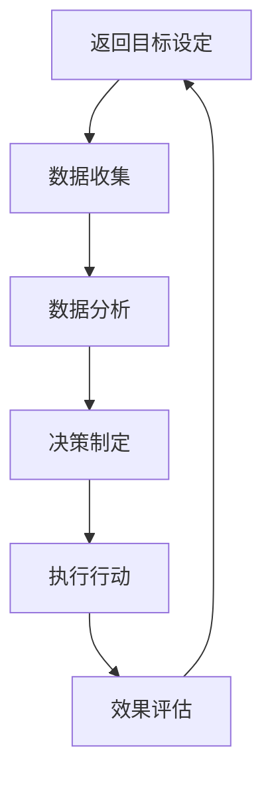

                 

# 建立反馈循环：促进持续改进的机制

> **关键词：** 反馈循环、持续改进、机制设计、IT行业、效率提升

> **摘要：** 本文将探讨在IT行业建立有效的反馈循环机制的重要性，以及如何通过一系列具体步骤和方法，促进团队和组织在技术发展过程中的持续改进。文章旨在为开发者、项目经理和团队领导者提供有价值的参考和实用的策略。

## 1. 背景介绍

在信息技术飞速发展的今天，软件系统和应用程序的复杂度不断上升。为了保持竞争力，IT行业中的团队和组织需要持续改进其技术能力、工作效率和产品质量。然而，如何实现这一目标并不是一件容易的事情。建立有效的反馈循环机制，成为了实现持续改进的关键步骤。

### 1.1 反馈循环的概念

反馈循环是指通过持续获取、分析和利用反馈信息，对系统或过程进行调整和优化的循环过程。它包括以下几个关键环节：

- **收集反馈：** 获取来自用户、客户、同事和其他利益相关者的意见和评价。
- **分析反馈：** 对收集到的反馈进行系统分析和评估，以识别问题和机会。
- **采取行动：** 基于分析结果，制定并实施改进措施。
- **监测效果：** 跟踪改进措施的效果，评估其对系统或过程的实际影响。

### 1.2 持续改进的必要性

持续改进是IT行业中不可或缺的一部分，因为它：

- **提高工作效率：** 通过不断优化流程和工具，减少不必要的工作量，提高团队的工作效率。
- **提升产品质量：** 通过收集用户反馈和及时发现缺陷，提高软件的质量和稳定性。
- **增强创新能力：** 通过对反馈的分析和利用，激发团队的创造力，推动技术创新。
- **增强竞争力：** 通过持续改进，提升组织在市场上的竞争力。

## 2. 核心概念与联系

### 2.1 反馈循环的组成部分

反馈循环包括以下几个关键组成部分：

- **目标设定：** 确定要解决的问题或要达到的目标。
- **数据收集：** 收集与目标相关的数据，包括用户反馈、系统性能指标、市场趋势等。
- **数据分析：** 对收集到的数据进行整理、分析和解释，以识别问题和机会。
- **决策制定：** 基于分析结果，制定改进措施。
- **执行行动：** 实施改进措施。
- **效果评估：** 评估改进措施的效果，并持续调整和优化。

### 2.2 反馈循环与持续改进的关系

反馈循环是持续改进的核心机制。它通过不断收集、分析和利用反馈信息，推动团队和组织在技术发展过程中持续优化和改进。反馈循环与持续改进的关系可以概括为以下几点：

- **促进信息流动：** 反馈循环使得信息在团队和组织内部高效流动，为改进提供可靠的数据支持。
- **增强问题意识：** 通过持续的反馈循环，团队和组织能够及时发现和解决问题，避免问题积累。
- **推动创新：** 反馈循环激发了团队的创造力和创新能力，推动技术的持续创新。
- **确保改进效果：** 通过反馈循环，改进措施的效果得到持续评估和优化，确保持续改进的有效性。

### 2.3 Mermaid流程图

以下是一个简化的反馈循环流程图，展示了各部分之间的联系：



### 2.4 反馈循环的核心概念

- **反馈质量：** 反馈的质量直接影响反馈循环的效果。高质量反馈应包括明确的问题描述、具体的改进建议、相关的数据和事实依据。
- **反馈速度：** 快速的反馈循环能够更及时地识别和解决问题，提高改进效率。
- **反馈机制：** 建立有效的反馈机制，确保反馈的收集、分析和利用过程高效、透明和持续。

## 3. 核心算法原理 & 具体操作步骤

### 3.1 反馈循环的算法原理

反馈循环的算法原理可以概括为以下几点：

- **数据驱动的决策制定：** 通过收集和分析数据，团队和组织能够基于事实和证据制定决策，而不是仅凭直觉或经验。
- **持续迭代优化：** 通过持续的反馈循环，团队和组织能够在实际运行过程中不断调整和优化其技术、流程和策略。
- **自适应调整：** 面对不断变化的环境和需求，反馈循环使得团队和组织能够迅速适应和调整，保持竞争力。

### 3.2 反馈循环的具体操作步骤

以下是建立和运行反馈循环的具体操作步骤：

#### 步骤1：目标设定

- **确定改进目标：** 根据组织或团队的战略目标，确定需要改进的关键领域和具体目标。
- **明确衡量标准：** 确定用于衡量改进效果的指标和标准。

#### 步骤2：数据收集

- **收集用户反馈：** 通过问卷调查、用户访谈、反馈表单等方式，收集用户对产品或服务的反馈。
- **收集系统数据：** 收集系统性能指标、错误日志、用户行为数据等，以分析系统运行状态。

#### 步骤3：数据分析

- **整理数据：** 对收集到的数据进行清洗、整理和分类。
- **分析趋势：** 使用统计分析、数据挖掘等技术，分析数据中的趋势和规律。
- **识别问题：** 根据分析结果，识别系统或流程中存在的问题和瓶颈。

#### 步骤4：决策制定

- **制定改进措施：** 基于分析结果，制定具体的改进措施和方案。
- **确定责任人：** 确定负责实施改进措施的人员或团队。

#### 步骤5：执行行动

- **实施改进：** 按照制定的方案，实施改进措施。
- **跟进进度：** 定期跟进改进措施的执行进度，确保按计划进行。

#### 步骤6：效果评估

- **监测效果：** 收集改进措施实施后的数据，评估其效果。
- **调整方案：** 根据评估结果，对改进措施进行调整和优化。

#### 步骤7：返回目标设定

- **持续优化：** 将改进效果纳入下一次反馈循环的目标设定中，持续优化和改进。

### 3.3 反馈循环的优化方法

为了提高反馈循环的效果，可以采取以下优化方法：

- **增加反馈渠道：** 建立多样化的反馈渠道，如在线反馈表单、社交媒体互动等，提高反馈的收集效率。
- **提高反馈质量：** 通过培训和激励机制，提高用户和员工的反馈意识和质量。
- **缩短反馈周期：** 通过优化流程和工具，缩短反馈循环的周期，提高改进速度。
- **引入数据可视化工具：** 使用数据可视化工具，如仪表板、图表等，帮助团队和组织更好地理解和分析数据。

## 4. 数学模型和公式 & 详细讲解 & 举例说明

### 4.1 反馈循环的数学模型

反馈循环的数学模型可以基于系统动力学或控制理论进行构建。以下是一个简化的反馈循环模型：

\[ x_{t+1} = f(x_t, u_t) + v_t \]

其中：

- \( x_t \) 表示系统状态向量。
- \( u_t \) 表示外部输入向量。
- \( v_t \) 表示噪声。
- \( f \) 是系统状态转移函数，描述系统状态如何根据当前状态和外部输入发生变化。

### 4.2 反馈控制的公式

在反馈控制系统中，常用的控制公式是PID（比例-积分-微分）控制器：

\[ u_t = K_p e_t + K_i \int_{0}^{t} e_{\tau} d\tau + K_d \frac{de_t}{dt} \]

其中：

- \( e_t \) 是误差，表示实际状态与期望状态之间的差距。
- \( K_p \)、\( K_i \) 和 \( K_d \) 分别是比例、积分和微分系数。

### 4.3 反馈循环的应用实例

假设一个IT团队的目标是提高软件项目的交付速度，以下是一个简单的反馈循环应用实例：

#### 目标设定

- **改进目标：** 提高软件项目的交付速度。
- **衡量标准：** 交付周期（从需求分析到软件交付的时间）。

#### 数据收集

- **用户反馈：** 通过问卷调查，收集用户对项目交付速度的满意度。
- **系统数据：** 收集项目进度、任务分配、资源利用率等数据。

#### 数据分析

- **整理数据：** 整理用户反馈和系统数据，找出影响交付速度的关键因素。
- **分析趋势：** 分析数据，找出交付周期的分布情况和变化趋势。

#### 决策制定

- **改进措施：** 根据分析结果，制定改进措施，如优化项目流程、增加资源投入等。
- **责任人：** 确定负责实施改进措施的人员。

#### 执行行动

- **实施改进：** 按照制定的方案，实施改进措施。
- **跟进进度：** 定期跟进改进措施的执行进度。

#### 效果评估

- **监测效果：** 收集改进措施实施后的数据，评估交付周期是否缩短。
- **调整方案：** 根据评估结果，对改进措施进行调整和优化。

通过以上反馈循环，IT团队能够持续优化项目交付速度，实现持续改进。

## 5. 项目实战：代码实际案例和详细解释说明

### 5.1 开发环境搭建

为了实现一个简单的反馈循环系统，我们首先需要搭建一个开发环境。以下是一个基本的开发环境搭建步骤：

1. **安装Python：** Python是一种广泛使用的编程语言，非常适合实现反馈循环系统。可以从Python官方网站（https://www.python.org/downloads/）下载并安装Python。
2. **安装必要的库：** 使用pip工具安装一些常用的库，如NumPy（用于数据分析）、Matplotlib（用于数据可视化）等。例如：
   ```shell
   pip install numpy matplotlib
   ```
3. **配置Python虚拟环境：** 为了更好地管理和隔离项目依赖，可以配置一个Python虚拟环境。例如，使用virtualenv工具创建虚拟环境：
   ```shell
   virtualenv feedback_loop_env
   source feedback_loop_env/bin/activate  # Windows下使用 `feedback_loop_env\Scripts\activate`
   ```

### 5.2 源代码详细实现和代码解读

下面是一个简单的Python代码实现，用于展示反馈循环的基本原理。

```python
import numpy as np
import matplotlib.pyplot as plt

# 反馈循环函数
def feedback_loop(x, u, Kp, Ki, Kd):
    e = x - u  # 误差
    p = Kp * e  # 比例控制
    i = Ki * np.integrate(e)  # 积分控制
    d = Kd * (e - e_prev)  # 微分控制
    u_new = p + i + d  # 新的控制输出
    e_prev = e  # 更新误差
    return u_new

# 初始化参数
x = 0  # 初始状态
u = 10  # 初始外部输入
Kp = 1  # 比例系数
Ki = 0.1  # 积分系数
Kd = 0.05  # 微分系数
e_prev = 0  # 初始误差

# 运行反馈循环
for _ in range(100):
    u_new = feedback_loop(x, u, Kp, Ki, Kd)
    x = x + u_new  # 更新状态
    u = u_new  # 更新外部输入

# 绘制结果
plt.plot(range(100), [u for _ in range(100)])
plt.xlabel('Time')
plt.ylabel('Control Output')
plt.title('Feedback Loop')
plt.show()
```

代码解读：

1. **反馈循环函数：** `feedback_loop` 函数实现了一个简单的反馈循环。它根据当前状态（`x`）、外部输入（`u`）和控制器参数（`Kp`、`Ki`、`Kd`）计算新的控制输出（`u_new`）。
2. **初始化参数：** 初始化状态（`x`）、外部输入（`u`）和控制器参数（`Kp`、`Ki`、`Kd`）。
3. **运行反馈循环：** 使用一个循环运行100次反馈循环，每次迭代更新状态和控制输出。
4. **绘制结果：** 使用Matplotlib绘制控制输出随时间的变化。

### 5.3 代码解读与分析

1. **反馈循环函数：** `feedback_loop` 函数的核心是实现PID控制算法。它通过比例（`p`）、积分（`i`）和微分（`d`）三个部分对误差进行控制。比例部分直接根据当前误差调整控制输出，积分部分累积误差以消除稳态误差，微分部分根据误差的变化率进行控制，以减少过冲和振荡。
2. **初始化参数：** 初始化参数是反馈循环的关键步骤。合适的控制器参数（`Kp`、`Ki`、`Kd`）对于实现良好的控制效果至关重要。
3. **运行反馈循环：** 运行反馈循环是一个迭代过程，每次迭代都更新状态和控制输出。这个过程可以模拟一个实际的控制系统，如温度控制、自动驾驶等。
4. **绘制结果：** 绘制控制输出随时间的变化可以帮助我们直观地理解反馈循环的工作原理和效果。

通过这个简单的案例，我们可以看到反馈循环在实现持续改进方面的应用。在实际项目中，可以根据具体需求对反馈循环进行扩展和优化，以实现更复杂的功能和更高效的改进。

## 6. 实际应用场景

### 6.1 软件开发

在软件开发过程中，建立反馈循环机制能够显著提高项目质量和开发效率。通过收集用户反馈和系统数据，开发团队能够及时识别问题并进行改进。以下是一些具体的应用场景：

- **需求变更管理：** 通过反馈循环，开发团队能够及时了解用户的需求变更，快速调整开发计划和优先级。
- **测试和质量管理：** 通过自动化测试和用户反馈，开发团队能够及时发现和修复缺陷，确保软件质量。
- **性能优化：** 通过监控系统性能指标和用户行为数据，开发团队能够发现性能瓶颈并进行优化，提高软件的运行效率。

### 6.2 自动化运维

在自动化运维领域，反馈循环机制同样发挥着重要作用。通过持续监控和反馈，运维团队能够及时发现和处理系统故障，确保系统的稳定运行。以下是一些具体的应用场景：

- **故障检测和预警：** 通过监控系统性能和日志数据，运维团队能够实时检测故障并进行预警，提前采取措施。
- **资源优化：** 通过分析系统负载和资源使用情况，运维团队能够合理分配资源，提高系统的资源利用率。
- **自动化脚本优化：** 通过反馈循环，运维团队能够持续优化自动化脚本，提高自动化操作的效率和准确性。

### 6.3 产品运营

在产品运营过程中，反馈循环机制能够帮助团队更好地理解用户需求和市场趋势，制定更有效的营销策略。以下是一些具体的应用场景：

- **用户行为分析：** 通过分析用户行为数据，运营团队能够了解用户的使用习惯和偏好，优化产品功能和用户体验。
- **市场反馈监测：** 通过社交媒体、用户反馈渠道等收集用户和市场反馈，运营团队能够及时了解市场动态，调整营销策略。
- **活动效果评估：** 通过监控活动数据，运营团队能够评估活动效果，优化活动策划和执行。

### 6.4 智能制造

在智能制造领域，反馈循环机制能够帮助生产企业实时监控生产过程，提高生产效率和产品质量。以下是一些具体的应用场景：

- **设备维护和故障预警：** 通过监控系统数据和设备状态，生产企业能够提前发现设备故障并进行维护，避免生产中断。
- **生产流程优化：** 通过分析生产数据和过程参数，生产企业能够优化生产流程，提高生产效率。
- **质量检测和反馈：** 通过质量检测设备和反馈系统，生产企业能够实时监控产品质量，及时识别和解决质量缺陷。

## 7. 工具和资源推荐

### 7.1 学习资源推荐

- **书籍：**
  - 《反馈循环：如何实现持续改进》（Feedback Loop: How to Create the Behavior You Want by Making Small Changes That Add Up）
  - 《系统思维实践》（Systems Thinking: Managing Complexity in Business and Life）
  - 《创新者的窘境》（The Innovator's Dilemma）

- **论文：**
  - “The Feedback Loop: A Systems Approach to Continuous Improvement” by John M. Frame
  - “Feedback Control of Distributed Systems” by Michael J. Ackerman and Mark W. Mahoney

- **博客：**
  - https://www.agilealliance.org/agile101/agile-principles-practices/feedback-loop/
  - https://www.mountaingoatsoftware.com/blog/how-to-create-a-good-feedback-loop

### 7.2 开发工具框架推荐

- **持续集成和持续部署（CI/CD）：** Jenkins、GitHub Actions、GitLab CI/CD
- **自动化测试工具：** Selenium、JUnit、pytest
- **数据分析工具：** Tableau、Power BI、Matplotlib
- **项目管理工具：** Jira、Trello、Asana

### 7.3 相关论文著作推荐

- **论文：**
  - “A Survey of Feedback Control Applications in Software Engineering” by Ahmed E. Hassan and Robinow East
  - “Using Feedback Loops to Improve Software Development” by Rick M. Adcock and Jeffery M. Voas

- **著作：**
  - 《软件工程实践：现代软件开发的科学基础》（Software Engineering: A Practitioner’s Approach）
  - 《敏捷软件开发：原则、实践与模式》（Agile Software Development: Principles, Patterns, and Practices）

## 8. 总结：未来发展趋势与挑战

### 8.1 未来发展趋势

- **智能化反馈系统：** 随着人工智能和机器学习技术的发展，未来的反馈系统将更加智能化，能够自动分析和处理海量数据，提供更精准的改进建议。
- **自动化反馈循环：** 通过自动化工具和平台，反馈循环的运行过程将更加高效和自动化，减少人工干预，提高改进速度。
- **跨领域整合：** 反馈循环将在不同领域（如软件工程、自动化运维、产品运营等）实现跨领域整合，推动全行业的持续改进。

### 8.2 未来挑战

- **数据隐私和安全性：** 在建立反馈循环过程中，如何处理和保护用户数据，确保数据隐私和安全，是一个重要的挑战。
- **系统集成与兼容性：** 不同系统和工具之间的集成与兼容性，如何确保反馈循环在不同平台和系统中顺畅运行，是一个技术挑战。
- **组织文化变革：** 建立反馈循环机制需要改变传统的组织文化和工作方式，如何推动组织文化变革，是一个管理挑战。

## 9. 附录：常见问题与解答

### 9.1 反馈循环与闭环控制系统的区别

- **反馈循环：** 主要用于描述一个持续获取、分析和利用反馈信息的过程，以实现持续改进。
- **闭环控制系统：** 是一个更为专业的概念，通常用于描述一个由控制器、执行器和反馈系统组成的自动控制系统，以实现特定的控制目标。

### 9.2 如何建立有效的反馈循环机制

- **明确目标：** 确定要解决的问题或要达到的目标。
- **数据驱动：** 基于事实和证据制定决策。
- **快速响应：** 确保反馈循环的周期尽量短，以提高改进速度。
- **全员参与：** 推动团队成员参与反馈和改进过程，提高改进效果。

## 10. 扩展阅读 & 参考资料

- **参考资料：**
  - https://www.ibm.com/docs/en/cloud/222?topic=overview-continuous-feedback
  - https://www.hypergrid.info/blog/continuous-improvement
  - https://www.process STREET.com/business-process-management/what-is-continuous-improvement

- **扩展阅读：**
  - https://www.sciencedirect.com/topics/engineering/feedback-loop
  - https://www IEEE.org/education/careers/ece-careers/feedback-loop-for-engineers

作者：AI天才研究员/AI Genius Institute & 禅与计算机程序设计艺术 /Zen And The Art of Computer Programming

