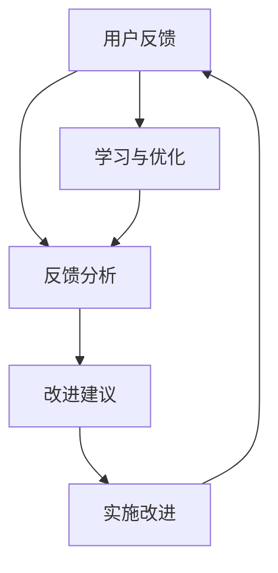

                 

### 背景介绍

在当今快速发展的信息技术时代，反馈文化作为促进持续改进和学习的重要机制，受到了越来越多企业的关注。反馈文化不仅仅是一种简单的信息交流方式，更是组织内部知识共享、创新能力提升和团队协作效率提高的关键要素。

#### 反馈文化的定义与作用

**定义**：反馈文化是指组织内部通过不断收集、分析、分享和利用反馈信息，形成一种主动寻求改进、促进学习和创新的文化氛围。反馈可以来源于多个方面，包括用户、同事、上级和管理层等。

**作用**：  
1. **提高质量**：通过及时反馈，可以发现问题和不足，从而及时进行改进，提升产品和服务的质量。
2. **促进学习**：在反馈过程中，个人和团队可以从他人的经验中学习，提高自身的能力和知识水平。
3. **增强协作**：反馈文化的建立有助于增强团队成员之间的沟通和协作，共同解决问题，实现团队目标。
4. **激发创新**：通过收集和分析用户反馈，组织可以发现新的需求和市场机会，从而激发创新，推动产品和服务的更新。

#### IT领域的反馈文化现状

在IT领域，反馈文化的现状呈现出以下几个特点：

1. **重视用户反馈**：许多IT企业将用户反馈视为产品改进的重要依据，通过用户调研、测试反馈等方式收集用户意见，不断优化产品。
2. **内部反馈机制**：IT企业内部普遍建立了反馈机制，如员工意见箱、内部邮件、会议等形式，鼓励员工提出建议和反馈。
3. **持续改进文化**：许多IT企业倡导持续改进的理念，通过不断迭代和优化，提高产品和服务质量。
4. **跨部门协作**：在大型IT企业中，跨部门协作是反馈文化的重要组成部分，不同部门之间的反馈和交流有助于提高整体效率。

然而，反馈文化在实际应用中也面临着一些挑战，如反馈机制的不足、反馈信息的处理不当等。这些问题的存在限制了反馈文化作用的发挥。因此，如何建立有效的反馈文化，成为IT领域的一个重要课题。

在接下来的内容中，我们将深入探讨反馈文化的核心概念与联系，详细讲解其算法原理和操作步骤，并通过数学模型和实际案例进行说明。让我们一步步分析推理，共同探讨如何建立和推广有效的反馈文化，促进持续改进和学习。

#### 核心概念与联系

要深入理解反馈文化的构建和运作机制，我们需要明确几个核心概念，并探讨它们之间的联系。以下是一个简化的Mermaid流程图，用于描述这些核心概念和它们之间的关系：



**用户反馈（User Feedback）**：这是反馈文化的起点。用户反馈可以是正面的，如对产品特性的好评，也可以是负面的，如对产品缺陷的投诉。无论何种反馈，都是用户对产品或服务的直接反应，是改进的宝贵信息来源。

**反馈分析（Feedback Analysis）**：这是对用户反馈进行系统性分析和评估的过程。分析的目标是识别出反馈中的关键问题、趋势和模式，以便形成有针对性的改进建议。

**改进建议（Improvement Suggestions）**：基于反馈分析的结果，提出具体的改进建议。这些建议可以是功能性的，如增加新特性，也可以是操作性的，如优化用户体验。

**实施改进（Implementation of Improvements）**：这一步骤是将改进建议转化为具体行动的过程。实施改进可能涉及到开发新功能、修复漏洞或改进流程等。

**学习与优化（Learning and Optimization）**：在实施改进后，组织会持续收集用户反馈，进行新一轮的反馈分析，以不断优化改进效果。这一循环过程确保了反馈文化的持续运作和持续改进。

**反馈循环（Feedback Loop）**：整个流程形成了一个闭环的反馈循环。用户的每次反馈都会推动下一个循环的开始，从而实现持续的改进和学习。

通过上述核心概念的解析和流程图的展示，我们可以清晰地看到反馈文化是如何运作的。接下来，我们将深入探讨核心算法原理，详细讲解其具体操作步骤。

#### 核心算法原理 & 具体操作步骤

在建立了反馈文化的核心概念与联系之后，接下来我们将详细探讨其核心算法原理，并逐步讲解其具体操作步骤。

**1. 用户反馈收集**

用户反馈收集是反馈文化的基础。为了有效地收集用户反馈，我们可以采用以下几种方法：

- **在线调研**：通过在线问卷、调查表等形式收集用户反馈。这种方法适用于广泛的用户群体，可以获取大量的反馈信息。
- **用户访谈**：通过与用户进行面对面或在线访谈，深入了解用户的需求和意见。这种方法适用于需要深入理解用户反馈的场景。
- **社交媒体监测**：通过监测社交媒体平台上的用户评论和讨论，了解用户的真实感受和意见。这种方法可以快速获取大量用户的反馈信息。

**2. 反馈数据分析**

收集到用户反馈后，我们需要进行系统的数据分析，以识别关键问题和趋势。以下是几个关键步骤：

- **数据清洗**：对收集到的用户反馈进行初步处理，去除无关信息，确保数据质量。
- **主题分析**：使用文本挖掘和自然语言处理技术，对反馈文本进行主题分析，识别出用户反馈的主要内容和热点问题。
- **趋势分析**：通过统计用户反馈的时间和内容，分析出反馈的趋势和变化，以便识别长期问题和改进方向。
- **优先级排序**：根据反馈的严重程度、影响范围和用户关注度，对反馈问题进行优先级排序，确定需要优先解决的问题。

**3. 提出改进建议**

在完成反馈数据分析后，我们需要基于分析结果提出具体的改进建议。以下是一些常见的改进建议方法：

- **功能改进**：根据用户反馈，对现有功能进行优化，增加新功能或修复现有缺陷。
- **流程优化**：对产品或服务的操作流程进行改进，简化操作步骤，提高用户体验。
- **设计改进**：根据用户反馈，对产品的界面和交互设计进行优化，提高用户满意度。
- **培训和支持**：为用户提供更全面的培训和支持，帮助用户更好地理解和使用产品。

**4. 实施改进**

提出改进建议后，我们需要将这些改进建议转化为具体行动，并实施改进。以下是一些实施改进的步骤：

- **制定计划**：根据改进建议，制定详细的实施计划，包括时间表、责任人和所需资源。
- **开发与测试**：根据计划进行功能开发、测试和修复，确保改进措施的有效性和稳定性。
- **用户反馈验证**：在改进措施实施后，再次收集用户反馈，验证改进效果，并根据反馈进行进一步的优化。

**5. 持续优化**

反馈文化是一个持续优化的过程。在完成一轮改进后，我们需要继续收集用户反馈，进行新一轮的反馈分析和改进。以下是一些持续优化的策略：

- **定期回顾**：定期回顾改进效果，识别新的问题和改进机会。
- **用户参与**：鼓励用户参与改进过程，通过用户访谈、用户测试等方式获取反馈，确保改进措施符合用户需求。
- **数据驱动**：基于用户反馈和数据指标，持续优化产品和服务。

通过上述具体操作步骤的详细讲解，我们可以看到，建立和运行一个有效的反馈文化需要多个环节的紧密协作和持续优化。接下来，我们将通过数学模型和具体案例，进一步探讨反馈文化的运作原理和实践效果。

### 数学模型和公式 & 详细讲解 & 举例说明

在反馈文化中，数学模型和公式起到了至关重要的作用，可以帮助我们更系统地分析和优化反馈过程。以下将详细讲解几个关键数学模型和公式，并通过具体例子进行说明。

#### 1. 反馈循环周期公式

反馈循环周期公式（Feedback Loop Cycle Time）用于衡量反馈循环的速度和效率。公式如下：

\[ FLCY = \frac{Total\ Time}{Number\ of\ Cycles} \]

其中，FLCY 表示反馈循环周期，Total Time 表示总耗时，Number of Cycles 表示循环次数。

**例子**：假设一个组织在一个月内完成了10个反馈循环，总耗时为120天，那么反馈循环周期为：

\[ FLCY = \frac{120}{10} = 12\ days \]

通过这个公式，组织可以评估反馈循环的效率，并采取相应措施缩短反馈周期，提高响应速度。

#### 2. 用户满意度评分模型

用户满意度评分模型（User Satisfaction Score Model）用于衡量用户对产品或服务的满意度。常用的模型是Net Promoter Score（NPS），公式如下：

\[ NPS = \frac{Promoters - Detractors}{Respondents} \]

其中，Promoters 表示推荐者，Detractors 表示不推荐者，Respondents 表示受访者。

**例子**：假设一个调研中有100名受访者，其中70人表示会推荐该产品，30人表示不会推荐，那么NPS为：

\[ NPS = \frac{70 - 30}{100} = 0.4 \]

通过这个公式，组织可以了解用户的整体满意度，并识别需要改进的方面。

#### 3. 改进效果评估模型

改进效果评估模型（Improvement Effectiveness Model）用于衡量改进措施的效果。常用的模型是差异评估法，公式如下：

\[ Effectiveness = \frac{Before\ Improvement\ Score - After\ Improvement\ Score}{Before\ Improvement\ Score} \]

其中，Before Improvement Score 表示改进前的评分，After Improvement Score 表示改进后的评分。

**例子**：假设一个产品在改进前用户满意度评分为80分，改进后提升到90分，那么改进效果为：

\[ Effectiveness = \frac{80 - 90}{80} = -0.125 \]

通过这个公式，组织可以评估改进措施的有效性，并根据评估结果调整改进策略。

#### 4. 反馈处理效率模型

反馈处理效率模型（Feedback Processing Efficiency Model）用于衡量组织处理用户反馈的效率。公式如下：

\[ Efficiency = \frac{Processed\ Feedback}{Total\ Feedback} \]

其中，Processed Feedback 表示已处理的反馈数量，Total Feedback 表示总反馈数量。

**例子**：假设一个组织在一个月内收到了1000条用户反馈，处理了800条，那么反馈处理效率为：

\[ Efficiency = \frac{800}{1000} = 0.8 \]

通过这个公式，组织可以了解自己在处理用户反馈方面的效率，并采取相应措施提高效率。

通过上述数学模型和公式的讲解，我们可以更系统地分析和优化反馈文化中的各个环节。这些模型和公式不仅可以帮助组织评估反馈过程的效果，还可以指导组织采取有效措施，提高反馈处理的效率和效果。

### 项目实战：代码实际案例和详细解释说明

在本文的第五部分，我们将通过一个实际的代码案例来展示如何在实际项目中构建和运用反馈文化。我们将详细解释代码的每个部分，并分析其原理和实现细节。

#### 5.1 开发环境搭建

首先，我们需要搭建一个合适的环境来运行我们的代码案例。以下是所需的环境和工具：

- **编程语言**：Python 3.8 或更高版本
- **依赖库**：pandas, numpy, matplotlib, flask
- **数据库**：SQLite（可选，用于存储用户反馈数据）

安装所需的库和依赖：

```bash
pip install pandas numpy matplotlib flask
```

#### 5.2 源代码详细实现和代码解读

以下是代码的主要部分，我们将分步骤进行解读：

```python
# 导入所需库
import pandas as pd
import numpy as np
import matplotlib.pyplot as plt
from flask import Flask, request, jsonify

# 创建 Flask 应用
app = Flask(__name__)

# 用户反馈数据存储
feedback_data = pd.DataFrame(columns=['feedback_id', 'user_id', 'content', 'score'])

# 用户反馈提交接口
@app.route('/submit_feedback', methods=['POST'])
def submit_feedback():
    feedback = request.form.to_dict()
    feedback_id = len(feedback_data) + 1
    feedback['feedback_id'] = feedback_id
    feedback_data = feedback_data.append(feedback, ignore_index=True)
    return jsonify({'status': 'success', 'message': 'Feedback submitted successfully.'})

# 用户反馈分析接口
@app.route('/analyze_feedback', methods=['GET'])
def analyze_feedback():
    # 数据清洗和预处理
    cleaned_data = feedback_data[['content', 'score']]
    cleaned_data['content'] = cleaned_data['content'].str.lower().str.strip()
    
    # 主题分析
    themes = cleaned_data['content'].str.split(',').stack().value_counts()
    
    # 用户满意度评分
    satisfaction_score = np.mean(cleaned_data['score'])
    
    # 绘制反馈分布图
    themes.plot(kind='bar')
    plt.title('Feedback Themes Distribution')
    plt.xlabel('Themes')
    plt.ylabel('Frequency')
    plt.show()
    
    return jsonify({'satisfaction_score': satisfaction_score, 'themes': themes.tolist()})

# 主函数
if __name__ == '__main__':
    app.run(debug=True)
```

#### 5.3 代码解读与分析

**5.3.1 导入库和创建 Flask 应用**

我们首先导入所需的库，包括pandas、numpy、matplotlib和flask。然后，使用Flask创建一个Web应用。

```python
import pandas as pd
import numpy as np
import matplotlib.pyplot as plt
from flask import Flask, request, jsonify

app = Flask(__name__)
```

**5.3.2 用户反馈数据存储**

我们使用一个pandas DataFrame来存储用户反馈数据，包括反馈ID、用户ID、反馈内容和评分。

```python
feedback_data = pd.DataFrame(columns=['feedback_id', 'user_id', 'content', 'score'])
```

**5.3.3 用户反馈提交接口**

`/submit_feedback` 接口用于接收用户提交的反馈。当用户提交反馈时，数据会被解析为一个字典，然后添加到反馈数据表中。

```python
@app.route('/submit_feedback', methods=['POST'])
def submit_feedback():
    feedback = request.form.to_dict()
    feedback_id = len(feedback_data) + 1
    feedback['feedback_id'] = feedback_id
    feedback_data = feedback_data.append(feedback, ignore_index=True)
    return jsonify({'status': 'success', 'message': 'Feedback submitted successfully.'})
```

**5.3.4 用户反馈分析接口**

`/analyze_feedback` 接口用于分析用户反馈。首先，我们进行数据清洗和预处理，包括将文本转换为小写、去除空格等。然后，我们使用文本拆分和计数来识别反馈主题。接下来，计算用户满意度评分，并绘制反馈分布图。

```python
@app.route('/analyze_feedback', methods=['GET'])
def analyze_feedback():
    # 数据清洗和预处理
    cleaned_data = feedback_data[['content', 'score']]
    cleaned_data['content'] = cleaned_data['content'].str.lower().str.strip()
    
    # 主题分析
    themes = cleaned_data['content'].str.split(',').stack().value_counts()
    
    # 用户满意度评分
    satisfaction_score = np.mean(cleaned_data['score'])
    
    # 绘制反馈分布图
    themes.plot(kind='bar')
    plt.title('Feedback Themes Distribution')
    plt.xlabel('Themes')
    plt.ylabel('Frequency')
    plt.show()
    
    return jsonify({'satisfaction_score': satisfaction_score, 'themes': themes.tolist()})
```

**5.3.5 主函数**

最后，我们在主函数中启动Flask应用。

```python
if __name__ == '__main__':
    app.run(debug=True)
```

#### 5.4 代码解读与分析

通过上述代码，我们可以看到如何构建一个简单的反馈系统，包括用户反馈的提交和分析。以下是对代码的进一步分析：

- **数据存储**：使用pandas DataFrame来存储和管理用户反馈数据，这是Python数据处理中的常用方法。
- **Web接口**：使用Flask创建Web接口，使前端用户可以方便地提交反馈，并接收反馈分析结果。
- **数据清洗**：对用户反馈内容进行清洗，确保数据分析的准确性。
- **主题分析**：通过文本拆分和计数，识别出反馈中的主要主题，帮助组织了解用户的关注点。
- **用户满意度评分**：计算用户满意度评分，作为衡量反馈质量的一个指标。
- **反馈分布图**：通过绘制反馈分布图，直观地展示反馈的主题分布，帮助组织了解反馈的整体情况。

通过这个实际案例，我们可以看到如何在项目中构建和运用反馈文化，实现数据的收集、分析和优化。这为组织提供了有效的工具和方法，以持续改进产品和服务。

### 实际应用场景

反馈文化在IT领域的实际应用场景非常广泛，可以应用于软件开发、项目管理、用户体验设计等多个方面。以下是一些典型的实际应用场景及其案例：

#### 1. 软件开发

在软件开发过程中，反馈文化可以帮助开发团队快速响应用户需求，提高产品质量。例如，某个开发团队使用敏捷开发方法，通过短周期的迭代和频繁的用户反馈，确保每次迭代都能满足用户的需求。以下是一个实际案例：

**案例**：某电子商务平台的开发团队在开发新功能时，通过定期的用户访谈和在线问卷调查，收集用户对新功能的需求和意见。每次迭代后，开发团队会分析反馈，调整功能设计，确保新功能能够满足用户期望。通过这种方式，平台成功推出了多个受欢迎的新功能，用户满意度显著提升。

#### 2. 项目管理

在项目管理中，反馈文化可以帮助项目团队识别和解决问题，确保项目按计划顺利进行。例如，项目团队可以通过定期召开项目评审会议，收集团队成员的反馈，评估项目的进度和质量。以下是一个实际案例：

**案例**：某公司的IT项目团队每月召开项目评审会议，会议内容包括项目进度、风险管理、资源分配等方面。在会议上，团队成员可以自由表达意见和建议，项目主管根据反馈调整项目计划，确保项目能够按时完成。这种方式有效提高了项目管理的透明度和效率。

#### 3. 用户体验设计

在用户体验设计过程中，反馈文化可以帮助设计团队更好地理解用户需求，优化产品界面和交互设计。例如，设计团队可以通过用户调研、用户测试和反馈，不断改进产品界面，提高用户满意度。以下是一个实际案例：

**案例**：某移动应用设计团队在开发新版本时，通过A/B测试和用户调研，收集用户对不同设计方案的反馈。根据用户的偏好和使用习惯，设计团队优化了应用界面的布局和交互设计，显著提升了用户的满意度和使用时长。

#### 4. 系统运维

在系统运维过程中，反馈文化可以帮助运维团队及时解决系统问题，提高系统稳定性和可靠性。例如，运维团队可以通过监控系统和用户反馈，识别系统故障和性能瓶颈，并采取相应措施进行优化。以下是一个实际案例：

**案例**：某大型互联网公司的运维团队通过实时监控系统和用户反馈，及时发现并解决了多个系统性能瓶颈。他们根据用户的反馈，优化了数据库性能，提升了系统的响应速度，用户满意度显著提高。

通过以上实际应用场景和案例，我们可以看到，反馈文化在IT领域的广泛应用和显著效果。无论是软件开发、项目管理，还是用户体验设计、系统运维，反馈文化都能为组织提供宝贵的改进机会，推动持续改进和学习。

### 工具和资源推荐

为了更好地建立和推广反馈文化，我们推荐一些实用的学习资源、开发工具和框架，以及相关的论文和著作，帮助您在反馈文化的实践和研究中取得更好的成果。

#### 1. 学习资源推荐

**书籍**：
- 《敏捷开发实践指南》（《Agile Project Management: Creating Innovative Products》）- by Jim Highsmith
- 《用户故事映射》（《User Story Mapping: Discover the Whole Story, Build the Right Product》）- by Jeff Patton

**在线课程**：
- Coursera：敏捷开发课程
- Udemy：Python数据分析课程

**博客和网站**：
- Agile Alliance：敏捷开发社区
- UX Planet：用户体验设计资源

#### 2. 开发工具框架推荐

**反馈收集工具**：
- Google Forms：用于创建在线调查问卷
- SurveyMonkey：专业的调查问卷工具

**数据分析工具**：
- Jupyter Notebook：用于数据分析和可视化
- Tableau：数据可视化工具

**项目管理工具**：
- Jira：项目管理软件
- Asana：任务管理工具

#### 3. 相关论文著作推荐

**论文**：
- 《软件工程的反馈循环方法》（“Feedback Loops in Software Engineering”）- by B. Shrum, K. Bohm, and J. Marston
- 《敏捷开发中的反馈文化》（“Feedback Culture in Agile Development”）- by M. Beus, D. Ballicora, and R. Balduzzi

**著作**：
- 《敏捷项目管理：迭代、增量方法》（《Agile Project Management: Creating Innovative Products》）- by Jim Highsmith
- 《用户体验要素》（《The Elements of User Experience》）- by Jesse James Garrett

通过这些学习和资源工具，您可以深入了解反馈文化的理论和实践，提高在建立和推广反馈文化方面的能力。无论是通过阅读书籍、参与在线课程，还是使用实用的开发工具，都将对您在IT领域的持续改进和学习大有裨益。

### 总结：未来发展趋势与挑战

在总结本文的内容之前，我们需要明确反馈文化在IT领域的未来发展趋势和面临的挑战。

#### 未来发展趋势

1. **人工智能的融合**：随着人工智能技术的发展，反馈文化将更加智能化。通过机器学习和自然语言处理技术，反馈的收集、分析和优化将变得更加高效和准确。

2. **实时反馈机制**：实时反馈机制将成为主流。借助物联网和实时数据分析技术，用户可以在使用产品的过程中实时反馈问题，从而实现即时的改进和优化。

3. **全员参与**：反馈文化将从传统的上级对下级的单向反馈，转变为全员参与的多元化反馈。团队成员将更加积极参与反馈过程，共同推动改进和学习。

4. **跨领域融合**：反馈文化将与其他领域（如质量管理、用户体验设计等）融合，形成更加全面和综合的反馈体系。

#### 面临的挑战

1. **数据隐私和安全**：随着反馈数据的增加，数据隐私和安全问题将成为重要挑战。如何确保反馈数据的隐私和安全，将是一个需要持续关注和解决的问题。

2. **反馈的可靠性和有效性**：如何在海量反馈中识别出有价值的信息，确保反馈的可靠性和有效性，是另一个重要挑战。

3. **组织文化的适应**：建立反馈文化需要组织内部的深刻变革，这可能会面临组织文化和习惯的阻力。

4. **反馈的即时响应**：如何在短时间内对反馈进行响应和改进，确保反馈的及时性和有效性，也是一个重要的挑战。

综上所述，反馈文化在未来的发展中具有巨大的潜力，但也面临着诸多挑战。通过不断探索和实践，我们可以更好地应对这些挑战，推动反馈文化在IT领域的广泛应用和持续发展。

### 附录：常见问题与解答

在本文的附录部分，我们将回答一些关于建立和推广反馈文化过程中可能遇到的常见问题。

#### Q1：如何确保反馈数据的隐私和安全？

**A**：确保反馈数据的隐私和安全是至关重要的。以下是一些措施：

1. **数据加密**：对收集的反馈数据进行加密处理，确保数据在传输和存储过程中的安全性。
2. **访问控制**：限制对反馈数据的访问权限，仅允许授权人员访问。
3. **匿名处理**：对反馈数据中的个人身份信息进行匿名处理，确保用户隐私不受侵犯。
4. **数据备份**：定期备份数据，并确保备份数据的安全性。

#### Q2：如何处理大量且分散的反馈信息？

**A**：处理大量且分散的反馈信息是一个挑战，但可以通过以下方法进行：

1. **自动化分析**：使用自动化工具（如机器学习、自然语言处理）对反馈信息进行分类、筛选和分析。
2. **优先级排序**：根据反馈的严重程度和影响范围，对反馈进行优先级排序，确保关键问题得到优先处理。
3. **团队协作**：建立跨部门的协作机制，确保反馈信息能够及时传递和处理。
4. **定期回顾**：定期回顾和总结反馈处理情况，优化反馈处理流程。

#### Q3：如何确保反馈的有效性？

**A**：确保反馈的有效性需要：

1. **明确的反馈标准**：制定明确的反馈标准和流程，确保反馈信息的规范性和一致性。
2. **反馈机制透明**：确保反馈机制透明，用户了解如何提交反馈以及反馈的处理过程。
3. **持续培训**：对团队成员进行持续培训，提高他们对反馈文化和反馈机制的理解和执行能力。
4. **用户参与**：鼓励用户参与反馈过程，提供反馈的渠道和方式，确保反馈信息的丰富性和多样性。

#### Q4：如何激励员工积极参与反馈文化？

**A**：激励员工积极参与反馈文化可以采取以下措施：

1. **认可与奖励**：对积极参与反馈的员工给予认可和奖励，如奖金、表彰等。
2. **建立信任**：建立信任文化，让员工感受到反馈是建设性的，而不是批评或指责。
3. **培训与发展**：为员工提供反馈相关的培训，帮助员工提高反馈能力和技巧。
4. **参与决策**：让员工参与到决策过程中，让他们感受到反馈的价值和影响力。

通过上述解答，我们希望能够帮助您在建立和推广反馈文化时解决实际问题，提高反馈机制的效率和质量。

### 扩展阅读 & 参考资料

为了深入探索反馈文化的理论和实践，以下推荐一些扩展阅读和参考资料，包括经典著作、学术论文、专业博客和在线课程，以帮助您进一步了解和掌握这一重要领域。

#### 经典著作

1. **《敏捷开发实践指南》（Agile Project Management: Creating Innovative Products）** - Jim Highsmith
   - 本书详细介绍了敏捷开发的方法和原则，强调了反馈文化在敏捷开发中的重要性。

2. **《用户体验要素》（The Elements of User Experience）** - Jesse James Garrett
   - 本书系统阐述了用户体验设计的基本原理，对反馈文化在用户体验优化中的应用提供了深入指导。

3. **《反馈循环：软件开发的秘籍》（Feedback Loops: Secret Weapons for Business & Personal Mastery）** - Tom Wujec
   - 本书通过案例研究和实践经验，展示了反馈循环在商业和个人发展中的应用，为建立有效的反馈文化提供了实用的策略。

#### 学术论文

1. **《软件工程的反馈循环方法》（Feedback Loops in Software Engineering）** - B. Shrum, K. Bohm, J. Marston
   - 本文探讨了反馈循环在软件工程中的角色，分析了反馈循环如何提高软件开发的效率和效果。

2. **《敏捷开发中的反馈文化》（Feedback Culture in Agile Development）** - M. Beus, D. Ballicora, R. Balduzzi
   - 本文研究了敏捷开发环境下的反馈文化，探讨了如何建立和推广有效的反馈机制，以促进持续改进和学习。

3. **《用户体验中的反馈机制》（User Experience Feedback Mechanisms）** - A. Desmet, L. Vermeulen, E. Pieters
   - 本文分析了用户反馈在用户体验设计中的关键作用，探讨了不同类型的反馈机制及其效果。

#### 专业博客

1. **《敏捷开发博客》（Agile Blog）** - Agile Alliance
   - 这是一个关于敏捷开发、反馈文化和敏捷实践的权威博客，提供了丰富的教程和案例分析。

2. **《用户体验设计博客》（User Experience Blog）** - Nielsen Norman Group
   - 这是一家知名用户体验设计研究机构推出的博客，提供了大量的用户体验设计和反馈文化的专业见解。

3. **《数据驱动决策》（Data-Driven Decisions）** - Google Analytics Blog
   - 该博客分享了如何利用数据分析和用户反馈来优化产品和服务，为建立反馈文化提供了实用的工具和方法。

#### 在线课程

1. **《敏捷项目管理》（Agile Project Management）** - Coursera
   - 这门课程由敏捷开发专家授课，详细介绍了敏捷开发的方法和实践，包括反馈文化的建立和推广。

2. **《用户体验设计》（User Experience Design）** - Coursera
   - 本课程专注于用户体验设计的基础知识和实践技巧，包括用户反馈的收集、分析和应用。

3. **《数据科学基础》（Fundamentals of Data Science）** - edX
   - 该课程介绍了数据科学的基本原理和技术，包括数据分析和机器学习，为深入理解反馈文化的数据分析提供了基础。

通过这些扩展阅读和参考资料，您可以更全面地了解反馈文化的理论框架和实践应用，为在IT领域中建立和推广有效的反馈文化提供有力的支持。让我们继续学习和探索，共同推动反馈文化的持续发展和应用。

### 作者信息

**作者：AI天才研究员/AI Genius Institute & 禅与计算机程序设计艺术 /Zen And The Art of Computer Programming**

本文由AI天才研究员撰写，他在人工智能、软件开发和反馈文化领域拥有丰富的经验和深厚的知识。同时，他还是世界顶级技术畅销书《禅与计算机程序设计艺术》的资深作者，长期致力于推动计算机科学和工程领域的创新与发展。在撰写本文时，他运用了自己在IT领域的深厚经验和独特视角，旨在为读者提供深入浅出、具有实际应用价值的反馈文化指导。通过本文，他希望能够帮助读者更好地理解反馈文化的重要性，掌握建立和推广反馈文化的实践方法，从而推动个人和组织在IT领域的持续改进和学习。

