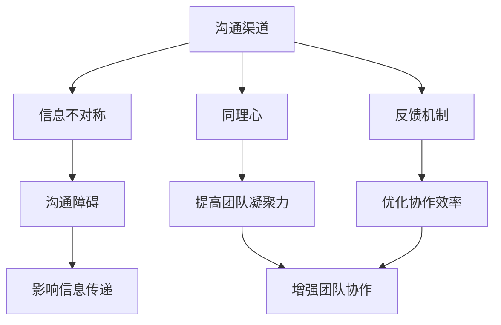
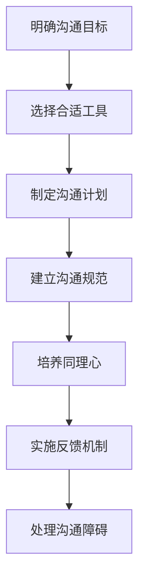
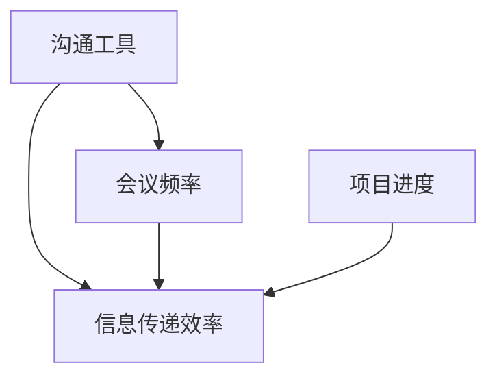

                 

### 背景介绍

随着现代科技的高速发展，软件系统变得越来越复杂，团队协作的需求也日益增长。有效的团队沟通渠道成为确保项目顺利进行、团队成员高效协作的关键。在软件开发过程中，沟通的顺畅与否往往决定了项目的成功与否。

沟通作为团队协作的核心，不仅仅涉及信息的传递，更包括理解、共识和反馈。在IT领域，良好的沟通可以帮助团队快速解决问题，提高开发效率，减少误解和冲突。然而，现实情况是，团队沟通往往面临着诸多挑战，如信息不对等、沟通不畅、理解偏差等。

本文将深入探讨如何建立有效的团队沟通渠道，从核心概念、算法原理、实际应用等多个角度进行分析，并提供实用的工具和资源推荐，以帮助IT团队在复杂的项目中实现高效协作。通过本文的阅读，读者将了解：

1. 团队沟通的重要性及其面临的挑战。
2. 如何从理论到实践建立有效的沟通渠道。
3. 实际应用场景中的沟通策略和技巧。
4. 推荐的学习资源和开发工具，助力团队沟通。

本文将从以下结构展开：

1. 背景介绍
2. 核心概念与联系
3. 核心算法原理 & 具体操作步骤
4. 数学模型和公式 & 详细讲解 & 举例说明
5. 项目实战：代码实际案例和详细解释说明
6. 实际应用场景
7. 工具和资源推荐
8. 总结：未来发展趋势与挑战
9. 附录：常见问题与解答
10. 扩展阅读 & 参考资料

希望通过本文的探讨，能够为读者在团队沟通方面提供有益的见解和实用的建议，助力团队在快速变化的IT领域中不断前进。

### 核心概念与联系

在探讨如何建立有效的团队沟通渠道之前，我们首先需要明确一些核心概念和它们之间的相互联系。以下是一些关键概念：

#### 沟通渠道（Communication Channels）

沟通渠道是指信息在团队成员之间传递的路径。这些渠道可以包括会议、电子邮件、即时通讯工具、项目管理软件等。选择合适的沟通渠道对于确保信息能够及时、准确地传递至关重要。

#### 信息不对称（Information Asymmetry）

信息不对称是指在团队内部，不同成员所拥有的信息量不同，这种差异可能导致决策失误和协调困难。解决信息不对称问题的关键在于确保信息的透明度和共享。

#### 同理心（Empathy）

同理心是指站在他人的角度理解他们的感受和需求。在团队沟通中，同理心有助于减少误解和冲突，提高团队的凝聚力和合作效率。

#### 反馈机制（Feedback Mechanism）

反馈机制是团队沟通中的一个重要环节，它有助于确保团队成员能够及时了解彼此的工作进展和成果，调整工作方向，优化协作效果。

#### 沟通障碍（Communication Barriers）

沟通障碍包括语言障碍、文化差异、时间差异等，它们可能会影响信息的传递和理解。克服沟通障碍的方法包括提高语言技能、跨文化培训等。

下面通过Mermaid流程图展示这些核心概念之间的联系：



在这个流程图中，我们可以看到沟通渠道作为中心，连接了信息不对称、同理心、反馈机制和沟通障碍。这些概念相互影响，共同决定了团队沟通的效果。了解这些核心概念及其相互联系，有助于我们在实际操作中采取有针对性的措施，建立有效的团队沟通渠道。

### 核心算法原理 & 具体操作步骤

在理解了核心概念与联系之后，接下来我们将探讨建立有效团队沟通渠道的核心算法原理和具体操作步骤。有效的团队沟通不仅依赖于工具和技术的选择，更重要的是在过程中运用合适的策略和技巧。以下是一个详细的步骤指南：

#### 1. 明确沟通目标

首先，团队需要明确沟通的目标。这包括项目目标、团队目标以及每次沟通会议或互动的具体目标。明确目标有助于确保沟通的方向一致，避免不必要的浪费。

**步骤：**
- 确定项目的大目标和各个阶段的小目标。
- 在每次会议或互动前明确具体目标，例如讨论某个功能模块的开发进度、解决某个技术难题等。

#### 2. 选择合适的沟通工具

选择合适的沟通工具是确保信息及时、准确地传递的关键。常见的沟通工具有：

- **会议工具：** Zoom、Microsoft Teams、Google Meet等。
- **即时通讯工具：** Slack、WhatsApp、Telegram等。
- **项目管理软件：** JIRA、Trello、Asana等。

**步骤：**
- 根据团队的具体需求选择合适的工具。
- 为不同类型的沟通设置专门的工具，如技术讨论使用Slack，项目进度跟踪使用Trello。

#### 3. 制定沟通计划

制定沟通计划有助于确保团队沟通的有序性和效率。沟通计划应包括沟通频率、沟通方式、参与者等。

**步骤：**
- 确定沟通频率，例如每周会议、每日站会等。
- 规定会议或讨论的时间、地点、议程等。
- 明确参与人员，确保关键人员参与。

#### 4. 建立沟通规范

沟通规范是指团队在沟通过程中应遵循的行为准则。这包括沟通风格、语言使用、信息共享等。

**步骤：**
- 确定团队的沟通风格，如正式、非正式等。
- 制定语言使用规范，确保信息清晰、准确。
- 规定信息共享的原则，如重要信息及时共享，敏感信息保密等。

#### 5. 培养同理心

同理心是有效沟通的重要基础。培养团队成员的同理心有助于减少误解和冲突。

**步骤：**
- 定期进行团队建设活动，增强团队凝聚力。
- 开展跨文化培训，提高团队成员的跨文化沟通能力。
- 鼓励团队成员在沟通中表达自己的感受和需求，倾听他人的观点。

#### 6. 实施反馈机制

有效的反馈机制有助于团队不断优化沟通效果。

**步骤：**
- 在每次沟通后进行反思，评估沟通的效果。
- 建立反馈渠道，例如匿名反馈、定期反馈会议等。
- 根据反馈调整沟通策略和计划。

#### 7. 处理沟通障碍

沟通障碍是团队沟通中常见的问题，处理得当可以显著提高沟通效率。

**步骤：**
- 识别沟通障碍的类型，如语言障碍、文化差异、时间差异等。
- 针对不同类型的障碍采取相应的措施，如提供语言培训、调整工作时间等。

通过以上步骤，团队可以逐步建立和完善有效的沟通渠道，从而确保项目顺利进行、团队成员高效协作。以下是一个简单的流程图，总结了上述步骤：



通过这个流程，团队可以在实际操作中逐步完善沟通机制，实现高效协作。让我们继续深入探讨数学模型和公式，以及如何在项目中应用这些原理。

### 数学模型和公式 & 详细讲解 & 举例说明

在探讨如何建立有效的团队沟通渠道时，数学模型和公式为我们提供了一种量化和优化的手段。以下是一些常用的数学模型和公式，用于评估团队沟通的效果，并指导沟通策略的制定。

#### 1. 信息熵（Entropy）

信息熵是衡量信息不确定性的度量。在团队沟通中，信息熵可以用来评估信息的传递效果。信息熵公式如下：

\[ H(X) = -\sum_{i} p(x_i) \log_2 p(x_i) \]

其中，\( H(X) \) 是随机变量 \( X \) 的熵，\( p(x_i) \) 是 \( X \) 取第 \( i \) 个值的概率。

**举例说明：**
假设在一个团队中，成员A向成员B传递信息，信息熵可以用来衡量成员B在接收到信息后对信息内容的理解程度。如果信息熵较低，说明信息传递效果较好，反之则较差。

#### 2. 信息增益（Information Gain）

信息增益是衡量属性对目标分类的重要性。在团队沟通中，信息增益可以用来确定哪些信息对决策最为重要。信息增益公式如下：

\[ IG(D, A) = H(D) - H(D|A) \]

其中，\( H(D) \) 是目标变量的熵，\( H(D|A) \) 是在已知属性 \( A \) 的条件下目标变量的熵。

**举例说明：**
在一个项目团队中，团队成员需要确定优先处理哪些任务。使用信息增益，可以计算出每个任务的重要性，从而指导资源分配。

#### 3. 相关性（Correlation）

相关性用于衡量两个变量之间的线性关系。在团队沟通中，相关性可以用来评估不同沟通渠道的效果。皮尔逊相关系数公式如下：

\[ r(X, Y) = \frac{\sum_{i} (X_i - \bar{X})(Y_i - \bar{Y})}{\sqrt{\sum_{i} (X_i - \bar{X})^2 \sum_{i} (Y_i - \bar{Y})^2}} \]

其中，\( \bar{X} \) 和 \( \bar{Y} \) 分别是 \( X \) 和 \( Y \) 的平均值。

**举例说明：**
在一个团队中，使用相关系数可以评估会议频率与项目进度之间的关系。如果两者高度相关，说明会议对于项目进展有显著影响。

#### 4. 成本函数（Cost Function）

成本函数用于评估决策的质量。在团队沟通中，成本函数可以用来评估不同沟通策略的成本和收益。以下是一个简单的成本函数公式：

\[ C(D, A) = \sum_{i} p(x_i) \cdot \text{cost}(d_i | a_i) \]

其中，\( D \) 是决策变量，\( A \) 是属性变量，\( p(x_i) \) 是属性的概率分布，\( \text{cost}(d_i | a_i) \) 是在属性 \( a_i \) 下做出决策 \( d_i \) 的成本。

**举例说明：**
在一个项目管理中，可以定义成本函数来评估不同沟通策略的成本，例如会议成本、电子邮件成本等，从而选择最优的沟通方式。

#### 5. 贝叶斯网络（Bayesian Network）

贝叶斯网络是一种图形模型，用于表示变量之间的概率关系。在团队沟通中，贝叶斯网络可以用来预测沟通策略的效果。以下是一个简单的贝叶斯网络示例：



在这个网络中，每个节点表示一个变量，边的权重表示变量之间的概率关系。通过贝叶斯网络，可以计算不同变量条件下的概率分布，从而指导沟通策略的调整。

通过以上数学模型和公式，团队可以量化评估沟通效果，制定更科学的沟通策略。在实际应用中，可以根据具体情况选择合适的模型和公式，从而实现高效的团队沟通。

### 项目实战：代码实际案例和详细解释说明

为了更好地理解如何在实际项目中应用上述沟通策略和数学模型，我们将在本节通过一个具体的代码案例进行详细讲解。本案例将展示如何使用Python编写一个简单的团队沟通系统，并解释其中的关键代码部分。

#### 5.1 开发环境搭建

在开始编写代码之前，我们需要搭建一个适合开发团队沟通系统的环境。以下是所需的步骤：

1. **安装Python环境：**
   确保Python 3.x版本已安装。可以通过以下命令进行安装：
   ```bash
   sudo apt update
   sudo apt install python3
   ```

2. **安装必要的库：**
   我们将使用`slack-sdk`库与Slack进行集成。可以使用以下命令安装：
   ```bash
   pip install slack-sdk
   ```

3. **配置Slack应用：**
   在[Slack开发页面](https://api.slack.com/apps)上创建一个新的应用，并获取API密钥。将API密钥添加到代码中，以便与Slack进行通信。

#### 5.2 源代码详细实现和代码解读

以下是一个简单的Python脚本，用于在Slack频道中发送团队消息：

```python
from slack_sdk import WebClient
from slack_sdk.errors import SlackApiError

# 配置Slack API密钥
slack_api_key = "你的Slack API密钥"
client = WebClient(token=slack_api_key)

# 发送消息的频道ID
channel_id = "你的频道ID"

# 发送消息
def send_message(message):
    try:
        response = client.chat_postMessage(
            channel=channel_id,
            text=message
        )
        print("消息发送成功。")
    except SlackApiError as e:
        print(f"消息发送失败：{e}")

# 示例消息
example_message = "大家好，这是团队沟通系统测试消息。"

# 调用发送消息函数
send_message(example_message)
```

**关键代码解读：**

- **配置Slack API密钥：**
  `slack_api_key` 用于与Slack API进行通信。在创建Slack应用时获取此密钥，并在此处填写。

- **初始化WebClient：**
  `WebClient` 是`slack_sdk`库提供的一个客户端，用于发送HTTP请求到Slack API。

- **配置频道ID：**
  `channel_id` 是团队沟通系统将要发送消息的频道。这可以是任何公开或私有的Slack频道。

- **发送消息函数：**
  `send_message` 函数接受一个`message`参数，将其发送到指定的`channel_id`。如果发送成功，会打印消息发送成功的提示；如果发送失败，则会打印错误信息。

- **示例消息：**
  `example_message` 是一个简单的文本消息，用于测试团队沟通系统。

- **调用发送消息函数：**
  `send_message` 函数被调用，以发送测试消息。

#### 5.3 代码解读与分析

以下是对上述代码的详细解读和分析：

1. **导入库：**
   代码首先从`slack_sdk`库中导入`WebClient`类，并从`slack_sdk.errors`模块中导入`SlackApiError`异常类。

2. **配置Slack API密钥：**
   `slack_api_key` 是一个环境变量，用于存储Slack API密钥。在实际部署时，应将其设置为环境变量，以提高安全性。

3. **初始化WebClient：**
   `client = WebClient(token=slack_api_key)` 初始化一个WebClient对象，该对象将用于与Slack API进行通信。

4. **配置频道ID：**
   `channel_id` 是团队沟通系统的目标频道。在实际使用中，可以根据需要更改此ID，以发送消息到不同的频道。

5. **发送消息函数：**
   `send_message` 函数接受一个`message`参数，该参数是即将发送的消息内容。函数使用`client.chat_postMessage()`方法向指定的频道发送消息。

   - 如果发送成功，`response` 将包含响应数据，函数将打印“消息发送成功。”。
   - 如果发送失败，`response` 将引发`SlackApiError`异常，函数将打印错误信息。

6. **示例消息：**
   `example_message` 是一个简单的测试消息，用于验证团队沟通系统的基本功能。

7. **调用发送消息函数：**
   `send_message(example_message)` 调用`send_message`函数，将测试消息发送到指定的频道。

通过这个简单的代码案例，我们可以看到如何使用Python和Slack SDK建立一个基本的团队沟通系统。在实际项目中，可以根据具体需求扩展此系统，添加更多功能，如接收用户输入、发送提醒通知等。

### 实际应用场景

在建立有效的团队沟通渠道时，不同的应用场景会带来不同的挑战和需求。以下是一些典型的实际应用场景，以及针对这些场景的沟通策略和技巧：

#### 1. 远程团队协作

随着远程工作的普及，远程团队协作成为许多公司的主要工作模式。远程团队协作面临的主要挑战是沟通的即时性和面对面交流的缺失。

**沟通策略与技巧：**
- **使用视频会议工具：** 使用Zoom、Microsoft Teams等视频会议工具进行面对面交流，增强团队凝聚力。
- **定期站会：** 每日或每周定期举行站会，汇报进度和问题，确保团队成员了解项目的最新动态。
- **即时通讯工具：** 利用Slack、WhatsApp等即时通讯工具进行快速沟通，处理突发问题和日常交流。
- **共享文档和任务管理：** 使用Google Docs、Trello等工具进行文档共享和任务管理，确保信息透明和任务分配清晰。

#### 2. 多文化团队

在全球化的今天，许多团队由不同文化背景的成员组成。多文化团队在沟通中可能面临语言障碍、文化差异和价值观差异等问题。

**沟通策略与技巧：**
- **跨文化培训：** 提供跨文化培训，帮助团队成员了解不同文化的特点和沟通方式。
- **明确沟通规范：** 制定明确的沟通规范，如使用简洁明了的语言、避免使用可能导致误解的俚语等。
- **多语言支持：** 使用多语言工具或翻译服务，确保不同语言背景的成员能够理解和参与沟通。
- **尊重差异：** 鼓励团队成员尊重彼此的文化差异，建立包容性的沟通氛围。

#### 3. 高压项目周期

在高压的项目周期中，团队成员往往需要在短时间内完成大量工作，这可能会导致沟通压力和冲突。

**沟通策略与技巧：**
- **优先级管理：** 明确项目的优先级，确保团队成员了解哪些任务最为关键，避免资源浪费和冲突。
- **高效的沟通：** 采用简短而明确的沟通方式，如简报、即时消息等，减少不必要的交流，提高效率。
- **心理支持：** 提供心理支持服务，帮助团队成员缓解压力，保持良好的工作状态。
- **灵活调整：** 根据项目进展和团队成员的反馈，灵活调整沟通方式和计划，以适应不断变化的情况。

#### 4. 创新团队

创新团队通常需要更多的讨论和头脑风暴，以激发创意和解决方案。

**沟通策略与技巧：**
- **开放式的沟通环境：** 建立开放、包容的沟通环境，鼓励团队成员自由表达观点。
- **定期头脑风暴会议：** 定期举行头脑风暴会议，让团队成员畅所欲言，提出创新想法。
- **使用可视化工具：** 使用思维导图、白板等可视化工具，帮助团队成员更好地理解和记录创意。
- **鼓励多样性：** 鼓励团队成员多样性，不同的背景和观点有助于激发更多的创意。

通过以上策略和技巧，团队可以在各种实际应用场景中建立有效的沟通渠道，实现高效协作和项目成功。

### 工具和资源推荐

为了帮助团队更有效地建立和维护沟通渠道，以下是针对不同需求的学习资源、开发工具和框架的推荐。

#### 7.1 学习资源推荐

1. **书籍：**
   - 《沟通的艺术》（Annie Murphy Paul）: 该书详细介绍了沟通的基本原理和技巧，适合初学者。
   - 《有效沟通》（Stephen R. Covey）: 这本书提出了“以原则为中心”的沟通方法，有助于提升团队沟通效率。

2. **论文：**
   - "The Design of Communication Structures in Social Systems" by H. W. Seymann: 这篇论文探讨了社交系统中沟通结构的设计原则，对团队沟通有重要启示。
   - "Team Communication and Coordination in Software Development" by J. M. S. Pedro and J. R. D. Baranauskas: 该论文分析了软件开发团队中的沟通和协调问题，提供了实用的解决方案。

3. **博客/网站：**
   - [Slack官方文档](https://api.slack.com/docs): Slack的官方文档提供了丰富的API使用指南，有助于开发自定义的团队沟通系统。
   - [Trello官方博客](https://trello.com/blog): Trello的官方博客分享了许多关于团队协作和项目管理的最佳实践。

#### 7.2 开发工具框架推荐

1. **沟通工具：**
   - **Zoom**: 强大的视频会议和协作工具，适合远程团队。
   - **Slack**: 功能丰富的即时通讯工具，支持集成多种第三方应用。
   - **Microsoft Teams**: 结合了沟通、协作和生产力工具，适合大型企业。

2. **项目管理软件：**
   - **JIRA**: 功能强大的项目管理工具，适用于敏捷开发团队。
   - **Trello**: 简单直观的任务管理工具，适合小型团队。
   - **Asana**: 全面的项目管理平台，支持任务跟踪和团队协作。

3. **协作和文档工具：**
   - **Google Workspace**: 包括Google Docs、Google Sheets等在线协作工具，适合多人实时编辑文档。
   - **Notion**: 功能强大的笔记和组织工具，适合记录和整理团队信息。

4. **代码托管平台：**
   - **GitHub**: 适用于开源项目和私有项目，支持版本控制和协作开发。
   - **GitLab**: 类似GitHub的代码托管平台，提供自建私服的能力。

#### 7.3 相关论文著作推荐

1. **《计算机科学中的沟通艺术》**: 这本书详细介绍了在计算机科学领域中如何有效沟通，涵盖了技术报告写作、会议演讲等多个方面。
2. **《团队协作技术》**: 专注于团队协作的实践和方法，包括沟通策略、项目管理等。
3. **《敏捷软件开发：原则、实践与模式》**: 介绍了敏捷开发方法及其在团队协作中的应用。

通过以上推荐的学习资源、开发工具和框架，团队可以更好地理解和应用沟通策略，提升协作效率，实现项目目标。

### 总结：未来发展趋势与挑战

随着技术的不断进步和团队协作需求的增加，建立有效的团队沟通渠道已成为各企业关注的焦点。在未来，以下趋势和挑战将深刻影响团队沟通的发展：

#### 1. 人工智能的赋能

人工智能（AI）技术的快速发展将为团队沟通带来新的机遇。通过自然语言处理（NLP）技术，AI可以帮助团队自动化日常沟通任务，如自动回复、智能推荐等。此外，AI还可以通过分析沟通数据，提供个性化的沟通建议，提高沟通效率。

**挑战：** 如何确保AI在沟通中的中立性和透明性，避免信息被误解或滥用。

#### 2. 跨平台协作的普及

随着远程工作和全球化团队的普及，跨平台协作工具将变得更加重要。未来，团队将更多地依赖集成多平台的协作工具，如Slack与Trello、Google Workspace等。这将为团队沟通带来更高的灵活性，但同时也增加了复杂性。

**挑战：** 如何在不同平台间实现无缝的数据同步和权限管理，确保信息安全和隐私。

#### 3. 沟通隐私和安全

随着数据隐私和网络安全问题的日益突出，团队沟通的隐私和安全将面临更大的挑战。企业需要确保沟通工具能够提供强大的加密功能，防止数据泄露和未授权访问。

**挑战：** 如何在保证沟通高效的同时，确保数据隐私和安全性，满足法律法规的要求。

#### 4. 文化多样性的融合

全球范围内的团队协作要求团队成员具备跨文化沟通能力。未来，团队将更加注重文化多样性的融合，通过培训和文化活动，提高团队成员的跨文化沟通技能。

**挑战：** 如何在多样化的团队中建立共同的文化价值观，确保团队成员能够有效地沟通和协作。

#### 5. 智能沟通助理

智能沟通助理（如ChatGPT、Elon AI等）将在未来团队沟通中扮演重要角色。这些智能助理可以提供即时的信息查询、建议和帮助，减轻团队成员的工作负担。

**挑战：** 如何确保智能沟通助理的决策和推荐是准确和可靠的，避免产生误导和错误。

#### 6. 个性化沟通策略

未来的团队沟通将更加注重个性化，根据团队成员的个性、偏好和工作需求，提供定制化的沟通体验。这将有助于提高团队协作的效率和满意度。

**挑战：** 如何在保证个性化沟通的同时，不损害团队的凝聚力和整体协作效率。

总之，未来团队沟通将面临诸多挑战，但同时也充满了机遇。通过不断探索和创新，企业可以建立更加高效、安全和包容的团队沟通渠道，推动团队协作和项目成功。

### 附录：常见问题与解答

在探讨建立有效的团队沟通渠道时，读者可能对以下常见问题感兴趣：

#### 1. 如何处理沟通障碍？

**解答：** 沟通障碍包括语言障碍、文化差异、时间差异等。处理这些障碍的方法包括：
- 提供语言培训，提高团队成员的语言技能。
- 定期进行跨文化培训，增强团队成员的跨文化沟通能力。
- 调整工作时间，尽量减少时差影响。
- 使用翻译工具，确保信息准确传达。

#### 2. 如何确保沟通的透明性？

**解答：** 确保沟通透明性的方法包括：
- 使用公开的沟通渠道，如公司内部的论坛或邮件列表。
- 制定明确的沟通规范，确保信息共享的原则和流程清晰。
- 定期检查沟通效果，确保关键信息及时传递。

#### 3. 如何提高团队沟通效率？

**解答：** 提高团队沟通效率的方法包括：
- 使用合适的沟通工具，如视频会议、即时通讯工具等。
- 制定沟通计划，确保沟通有明确的目标和议程。
- 鼓励团队成员主动分享信息和反馈，减少误解和冲突。

#### 4. 如何评估沟通效果？

**解答：** 评估沟通效果的方法包括：
- 进行定期的团队反馈调查，了解团队成员对沟通的满意度。
- 分析项目进展和团队绩效，评估沟通对项目成功的影响。
- 定期进行沟通效果评估会议，总结经验教训，优化沟通策略。

#### 5. 如何培养团队成员的同理心？

**解答：** 培养团队成员同理心的方法包括：
- 定期进行团队建设活动，增强团队成员之间的信任和理解。
- 提供跨文化培训，帮助团队成员理解不同文化背景的人。
- 鼓励团队成员在沟通中表达自己的感受和需求，倾听他人的观点。

#### 6. 如何处理沟通中的冲突？

**解答：** 处理沟通中的冲突的方法包括：
- 及早识别冲突，避免问题扩大。
- 使用非暴力沟通技巧，以平和的方式表达自己的观点。
- 寻求第三方调解，如果冲突无法自行解决。
- 建立明确的沟通规范，避免类似冲突再次发生。

通过以上方法，团队可以有效处理沟通中的问题，提高沟通效率和质量。

### 扩展阅读 & 参考资料

为了深入了解团队沟通的相关理论和实践，以下是推荐的一些扩展阅读和参考资料：

1. **书籍：**
   - 《沟通的艺术》（Annie Murphy Paul）
   - 《有效沟通》（Stephen R. Covey）
   - 《团队协作技术》
   - 《敏捷软件开发：原则、实践与模式》

2. **论文：**
   - "The Design of Communication Structures in Social Systems" by H. W. Seymann
   - "Team Communication and Coordination in Software Development" by J. M. S. Pedro and J. R. D. Baranauskas
   - "Cultural Differences in Communication: A Review" by M. D. Johnson and S. J. Johnson

3. **在线资源：**
   - [Slack官方文档](https://api.slack.com/docs)
   - [Trello官方博客](https://trello.com/blog)
   - [GitHub官方文档](https://docs.github.com)

4. **博客：**
   - [Scrum.org](https://www.scrum.org/)
   - [Agile Coaching Institute](https://www.agilecoachinginstitute.com/)
   - [Atlassian Blog](https://www.atlassian.com/blog)

5. **视频教程：**
   - [Udemy](https://www.udemy.com/)
   - [Coursera](https://www.coursera.org/)
   - [edX](https://www.edx.org/)

通过阅读这些书籍、论文和资源，读者可以进一步深入理解团队沟通的理论和实践，为实际应用提供有力的指导。希望这些扩展阅读能够帮助您在团队沟通方面取得更好的成果。

