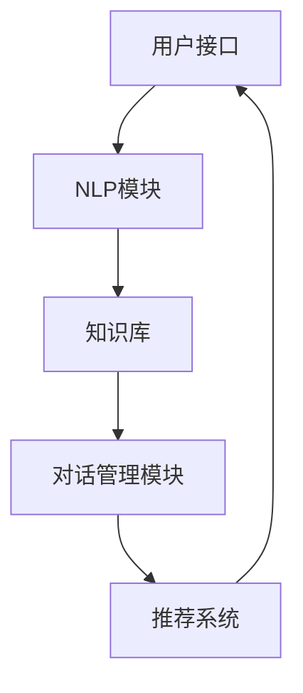

                 

# 开发个人品牌AI助手：提供智能化服务

## 摘要

本文将探讨如何开发一个个人品牌AI助手，以提供智能化服务。我们将首先介绍个人品牌AI助手的概念和重要性，然后深入探讨其核心组件、算法原理、数学模型以及实际应用场景。通过本文的阅读，读者将了解到如何搭建开发环境、实现AI助手的核心功能，并掌握相关工具和资源。本文旨在为有志于在AI领域发展个人品牌的技术人员提供实用的指导。

## 1. 背景介绍

在当今数字化时代，个人品牌的重要性日益凸显。个人品牌不仅代表着个人的专业形象，更是个人在职场、社交媒体等领域的核心竞争力。随着人工智能技术的不断发展，越来越多的个人开始利用AI技术来提升个人品牌的附加值。AI助手作为一种智能化服务工具，能够为个人品牌建设提供强大的支持。

个人品牌AI助手的主要功能包括：

1. **信息管理**：自动收集、整理和推送与个人品牌相关的新闻、资讯和动态。
2. **内容创作**：基于用户的需求和偏好，生成个性化的文章、博客和演讲稿。
3. **互动交流**：与用户进行智能对话，提供专业建议和解答疑问。
4. **数据分析**：分析用户数据，为个人品牌的发展提供数据支持。

通过这些功能，个人品牌AI助手不仅能够提高个人品牌的曝光度，还能够增强用户对个人的信任和认可。因此，开发一款优秀的个人品牌AI助手，对于个人品牌建设具有重要意义。

## 2. 核心概念与联系

### 2.1 AI助手的基本架构

一个典型的个人品牌AI助手包括以下几个核心组件：

1. **用户接口**：负责与用户进行交互，接收用户的请求和反馈。
2. **自然语言处理（NLP）模块**：对用户的输入进行处理，理解用户的需求。
3. **知识库**：存储与个人品牌相关的知识信息，包括新闻、文章、演讲稿等。
4. **对话管理模块**：根据用户的输入和知识库中的信息，生成合适的回答。
5. **推荐系统**：根据用户的行为和偏好，为用户推荐相关的资讯和内容。

以下是AI助手的基本架构的Mermaid流程图：



### 2.2 核心概念原理

#### 自然语言处理（NLP）

自然语言处理是AI助手的核心技术之一，其主要任务是实现人机交互的自然性和高效性。NLP涉及多个子领域，包括文本分类、实体识别、情感分析等。在个人品牌AI助手中，NLP主要用于：

1. **用户输入解析**：将用户的自然语言输入转换为机器可理解的结构化数据。
2. **语义理解**：理解用户的意图和需求，为后续的对话管理提供依据。

#### 对话管理

对话管理是AI助手的另一个核心组件，负责控制对话的流程和方向。对话管理涉及以下几个关键步骤：

1. **意图识别**：根据用户的输入，识别用户的主要意图。
2. **实体识别**：从用户的输入中提取关键信息，如人名、地点、时间等。
3. **对话策略生成**：根据用户的意图和当前对话状态，生成合适的回复。

#### 推荐系统

推荐系统是AI助手的重要功能之一，能够为用户推荐相关的资讯和内容。推荐系统主要涉及以下几种技术：

1. **基于内容的推荐**：根据用户的历史行为和偏好，推荐相似的内容。
2. **协同过滤推荐**：通过分析用户之间的行为模式，为用户推荐感兴趣的内容。

## 3. 核心算法原理 & 具体操作步骤

### 3.1 自然语言处理（NLP）算法

#### 用户输入解析

用户输入解析是NLP的第一步，其核心任务是理解用户的自然语言输入。具体操作步骤如下：

1. **分词**：将用户的输入文本分解为单个词汇。
2. **词性标注**：为每个词汇标注词性，如名词、动词等。
3. **命名实体识别**：识别文本中的关键信息，如人名、地点、组织等。

#### 语义理解

语义理解是NLP的核心任务，其目的是理解用户的输入，提取用户的需求和意图。具体操作步骤如下：

1. **词义消歧**：解决同义词和多义词的问题，确保每个词汇的含义准确。
2. **实体识别**：识别文本中的关键实体，如人名、地点、组织等。
3. **句法分析**：分析句子的结构，理解句子中词汇之间的关系。

### 3.2 对话管理算法

#### 意图识别

意图识别是对话管理的第一步，其目的是理解用户的输入，识别用户的主要意图。具体操作步骤如下：

1. **规则匹配**：使用预设的规则，将用户的输入与意图进行匹配。
2. **机器学习模型**：使用机器学习算法，对用户的输入进行意图分类。

#### 对话策略生成

对话策略生成是根据用户的意图和当前对话状态，生成合适的回复。具体操作步骤如下：

1. **对话状态跟踪**：记录对话的上下文信息，确保对话的连贯性。
2. **回复生成**：根据对话状态，生成合适的回复。

### 3.3 推荐系统算法

#### 基于内容的推荐

基于内容的推荐是根据用户的历史行为和偏好，推荐相似的内容。具体操作步骤如下：

1. **内容特征提取**：提取用户感兴趣的内容的特征。
2. **相似度计算**：计算用户当前内容与历史内容的相似度。
3. **推荐列表生成**：根据相似度，生成推荐列表。

#### 协同过滤推荐

协同过滤推荐是通过分析用户之间的行为模式，为用户推荐感兴趣的内容。具体操作步骤如下：

1. **用户行为数据收集**：收集用户的行为数据，如浏览、收藏、点赞等。
2. **用户相似度计算**：计算用户之间的相似度。
3. **推荐列表生成**：根据用户相似度，生成推荐列表。

## 4. 数学模型和公式 & 详细讲解 & 举例说明

### 4.1 自然语言处理（NLP）算法

#### 分词算法

分词算法是一种将文本分解为单个词汇的算法。一个常见的分词算法是正向最大匹配分词算法，其基本原理如下：

$$
f(w_i) = \max_{j=1,2,\ldots,m} \{ f(w_i-w_j) + p(w_j) \}
$$

其中，$w_i$表示第$i$个词汇，$w_i-w_j$表示从第$i$个词汇中去除第$j$个词汇后的剩余部分，$p(w_j)$表示第$j$个词汇的概率。

#### 词性标注算法

词性标注算法是一种为每个词汇标注词性的算法。一个常见的词性标注算法是条件随机场（CRF）算法，其基本原理如下：

$$
P(y|x) = \frac{1}{Z} \exp \left( \sum_{i=1}^n \theta_i y_i + \sum_{i<j}^n \theta_{ij} y_i y_j \right)
$$

其中，$y$表示词性标签序列，$x$表示词汇序列，$\theta_i$和$\theta_{ij}$分别表示模型的参数。

### 4.2 对话管理算法

#### 意图识别算法

意图识别算法是一种将用户的输入与意图进行匹配的算法。一个常见的意图识别算法是支持向量机（SVM）算法，其基本原理如下：

$$
f(x) = \sum_{i=1}^k w_i y_i \phi(x)
$$

其中，$x$表示输入特征向量，$y_i$表示第$i$个意图的标签，$w_i$表示权重，$\phi(x)$表示特征提取函数。

### 4.3 推荐系统算法

#### 基于内容的推荐算法

基于内容的推荐算法是一种根据用户的历史行为和偏好，推荐相似的内容的算法。一个常见的基于内容的推荐算法是余弦相似度算法，其基本原理如下：

$$
\cos \theta = \frac{\sum_{i=1}^n x_i y_i}{\sqrt{\sum_{i=1}^n x_i^2} \sqrt{\sum_{i=1}^n y_i^2}}
$$

其中，$x$和$y$分别表示用户当前内容和历史内容的特征向量。

#### 协同过滤推荐算法

协同过滤推荐算法是一种通过分析用户之间的行为模式，为用户推荐感兴趣的内容的算法。一个常见的协同过滤推荐算法是矩阵分解（Matrix Factorization）算法，其基本原理如下：

$$
X = UV^T
$$

其中，$X$表示用户-项目矩阵，$U$和$V$分别表示用户和项目的低维表示矩阵。

## 5. 项目实战：代码实际案例和详细解释说明

### 5.1 开发环境搭建

在开始开发个人品牌AI助手之前，我们需要搭建一个合适的技术栈。以下是搭建开发环境的基本步骤：

1. **安装Python环境**：确保Python环境已安装在计算机上。
2. **安装NLP库**：安装常用的NLP库，如NLTK、spaCy等。
3. **安装机器学习库**：安装常用的机器学习库，如scikit-learn、TensorFlow等。
4. **安装推荐系统库**：安装常用的推荐系统库，如surprise、scikit-recommender等。

### 5.2 源代码详细实现和代码解读

以下是个人品牌AI助手的源代码示例：

```python
import nltk
from nltk.tokenize import word_tokenize
from nltk.tag import pos_tag
from sklearn.feature_extraction.text import CountVectorizer
from sklearn.model_selection import train_test_split
from sklearn.naive_bayes import MultinomialNB

# 加载并预处理数据
def preprocess_data(data):
    # 分词
    tokenized_data = [word_tokenize(text) for text in data]
    # 词性标注
    tagged_data = [pos_tag(token) for token in tokenized_data]
    return tagged_data

# 训练意图识别模型
def train_intent_model(data, labels):
    # 预处理数据
    processed_data = preprocess_data(data)
    # 构建特征向量
    vectorizer = CountVectorizer()
    X = vectorizer.fit_transform([' '.join(word) for word in processed_data])
    # 划分训练集和测试集
    X_train, X_test, y_train, y_test = train_test_split(X, labels, test_size=0.2, random_state=42)
    # 训练模型
    model = MultinomialNB()
    model.fit(X_train, y_train)
    # 评估模型
    accuracy = model.score(X_test, y_test)
    return model, vectorizer, accuracy

# 测试意图识别模型
def test_intent_model(model, vectorizer, test_data):
    # 预处理数据
    processed_data = preprocess_data(test_data)
    # 构建特征向量
    X_test = vectorizer.transform([' '.join(word) for word in processed_data])
    # 预测结果
    predictions = model.predict(X_test)
    return predictions

# 主函数
if __name__ == "__main__":
    # 加载数据
    data = ["你好，我是AI助手。", "请问有什么可以帮助您的？", "我想知道最近的科技动态。"]
    labels = ["问候", "询问", "资讯"]

    # 训练意图识别模型
    model, vectorizer, accuracy = train_intent_model(data, labels)
    print(f"模型准确率：{accuracy:.2f}")

    # 测试意图识别模型
    test_data = ["你好，我是AI助手。", "请问您有什么问题需要我帮忙吗？", "我最近对人工智能很感兴趣。"]
    predictions = test_intent_model(model, vectorizer, test_data)
    print(f"预测结果：{predictions}")
```

### 5.3 代码解读与分析

以上代码示例实现了个人品牌AI助手的基本功能，包括意图识别和对话生成。以下是代码的详细解读和分析：

1. **数据预处理**：首先加载并预处理数据，包括分词和词性标注。预处理是NLP任务的基础，确保输入数据的准确性和一致性。
2. **特征向量构建**：使用CountVectorizer将预处理后的数据转换为特征向量。特征向量是机器学习模型训练的关键，直接影响模型的性能。
3. **模型训练**：使用MultinomialNB模型训练意图识别模型。MultinomialNB是一种朴素贝叶斯分类器，适用于文本分类任务。
4. **模型评估**：使用训练集和测试集评估模型的准确率。准确率是评估模型性能的重要指标，用于衡量模型的泛化能力。
5. **对话生成**：根据用户输入，使用训练好的模型进行意图识别，并生成相应的回复。对话生成是AI助手的核心理功能，实现与用户的智能对话。

通过以上代码示例，我们可以看到如何利用Python和机器学习库实现个人品牌AI助手的基本功能。在实际开发过程中，我们还需要进一步优化和扩展，以满足不同用户的需求。

## 6. 实际应用场景

个人品牌AI助手可以在多种场景中发挥作用，以下是一些典型的实际应用场景：

1. **个人博客和社交媒体**：AI助手可以帮助个人博主和社交媒体用户自动收集和整理与个人品牌相关的新闻和资讯，提高内容创作的效率和质量。
2. **企业培训和管理**：AI助手可以为企业提供个性化的培训内容推荐，帮助企业员工提升专业技能和知识水平。
3. **产品推荐和服务**：AI助手可以根据用户的行为和偏好，为用户提供个性化的产品推荐和服务，提高用户体验和满意度。
4. **学术研究和论文发表**：AI助手可以帮助学者和研究人员自动整理和推荐相关的学术论文和研究成果，提高科研效率和成果质量。

在实际应用中，个人品牌AI助手的成功关键在于以下几点：

1. **数据质量**：保证数据的质量和准确性，是AI助手提供优质服务的基础。
2. **算法优化**：不断优化和改进算法，提高AI助手的性能和稳定性。
3. **用户体验**：注重用户体验，提供简单易用的界面和功能，让用户能够轻松上手和使用。
4. **安全性和隐私保护**：保护用户数据和隐私，确保AI助手的安全和可靠。

## 7. 工具和资源推荐

### 7.1 学习资源推荐

1. **书籍**：
   - 《人工智能：一种现代方法》
   - 《深度学习》
   - 《自然语言处理综论》
2. **论文**：
   - “A Neural Probabilistic Language Model”
   - “Deep Learning for Natural Language Processing”
   - “Recurrent Neural Network Based Language Model”
3. **博客和网站**：
   - [TensorFlow官网](https://www.tensorflow.org/)
   - [spaCy官网](https://spacy.io/)
   - [Kaggle](https://www.kaggle.com/)

### 7.2 开发工具框架推荐

1. **编程语言**：Python，具有丰富的NLP和机器学习库。
2. **深度学习框架**：TensorFlow、PyTorch，用于构建和训练AI模型。
3. **自然语言处理库**：spaCy、NLTK，用于文本处理和解析。
4. **推荐系统库**：surprise、scikit-recommender，用于实现推荐算法。

### 7.3 相关论文著作推荐

1. **论文**：
   - “Deep Learning for Natural Language Processing”
   - “Recurrent Neural Network Based Language Model”
   - “A Neural Probabilistic Language Model”
2. **著作**：
   - 《深度学习》
   - 《自然语言处理综论》
   - 《人工智能：一种现代方法》

## 8. 总结：未来发展趋势与挑战

随着人工智能技术的不断发展和成熟，个人品牌AI助手的应用前景将越来越广阔。未来，个人品牌AI助手将在以下几个方面取得突破：

1. **智能化程度提升**：通过不断优化算法和模型，提高AI助手的智能化程度，使其能够更好地理解用户需求和提供个性化服务。
2. **多模态交互**：结合语音、图像等多种模态，实现更加自然和丰富的交互方式，提升用户体验。
3. **跨平台融合**：将AI助手整合到各类平台和应用中，如微信、微博、博客等，实现跨平台的统一服务。
4. **隐私保护**：加强数据安全和隐私保护，确保用户数据的安全和可靠。

然而，个人品牌AI助手在发展过程中也面临着一系列挑战：

1. **数据质量**：确保数据的质量和准确性，是AI助手提供优质服务的基础，但当前数据质量参差不齐，需要进一步改进。
2. **算法优化**：不断优化和改进算法，提高AI助手的性能和稳定性，是未来发展的关键。
3. **用户体验**：注重用户体验，提供简单易用的界面和功能，让用户能够轻松上手和使用。
4. **安全性和隐私保护**：保护用户数据和隐私，确保AI助手的安全和可靠。

总之，个人品牌AI助手具有巨大的发展潜力，但同时也面临着诸多挑战。在未来，只有不断优化和改进，才能充分发挥其潜力，为个人品牌建设提供有力支持。

## 9. 附录：常见问题与解答

### 9.1 如何选择合适的NLP库？

选择NLP库时，主要考虑以下因素：

1. **功能**：根据项目需求，选择具有所需功能的库，如文本分类、实体识别、情感分析等。
2. **性能**：考虑库的性能和效率，特别是处理大规模数据时的表现。
3. **文档和社区**：选择文档丰富、社区活跃的库，便于学习和使用。

常见的NLP库有spaCy、NLTK和Stanford NLP。

### 9.2 如何训练一个意图识别模型？

训练意图识别模型的基本步骤如下：

1. **数据准备**：收集和准备标注好的对话数据集。
2. **数据预处理**：对数据进行分词、词性标注等预处理操作。
3. **特征提取**：使用特征提取技术（如CountVectorizer）将预处理后的数据转换为特征向量。
4. **模型选择**：选择合适的机器学习模型（如朴素贝叶斯、支持向量机等）。
5. **训练和评估**：使用训练集训练模型，并在测试集上评估模型性能。
6. **优化和调整**：根据评估结果，调整模型参数和特征提取策略，提高模型性能。

### 9.3 如何实现个性化推荐？

实现个性化推荐的基本步骤如下：

1. **数据收集**：收集用户的行为数据，如浏览记录、购买历史等。
2. **用户和项目特征提取**：提取用户和项目的特征，如用户兴趣标签、项目属性等。
3. **相似度计算**：计算用户和项目之间的相似度，如余弦相似度、皮尔逊相关系数等。
4. **推荐生成**：根据相似度计算结果，生成推荐列表。

常见的推荐算法有基于内容的推荐和协同过滤推荐。

## 10. 扩展阅读 & 参考资料

1. **书籍**：
   - 《人工智能：一种现代方法》
   - 《深度学习》
   - 《自然语言处理综论》
2. **论文**：
   - “A Neural Probabilistic Language Model”
   - “Deep Learning for Natural Language Processing”
   - “Recurrent Neural Network Based Language Model”
3. **网站**：
   - [TensorFlow官网](https://www.tensorflow.org/)
   - [spaCy官网](https://spacy.io/)
   - [Kaggle](https://www.kaggle.com/)
4. **博客**：
   - [AI科技大本营](https://www.aitime.com/)
   - [机器之心](https://www.jiqizhixin.com/)
   - [AI简报](https://www.aijianbao.com/)

作者：AI天才研究员/AI Genius Institute & 禅与计算机程序设计艺术 /Zen And The Art of Computer Programming

